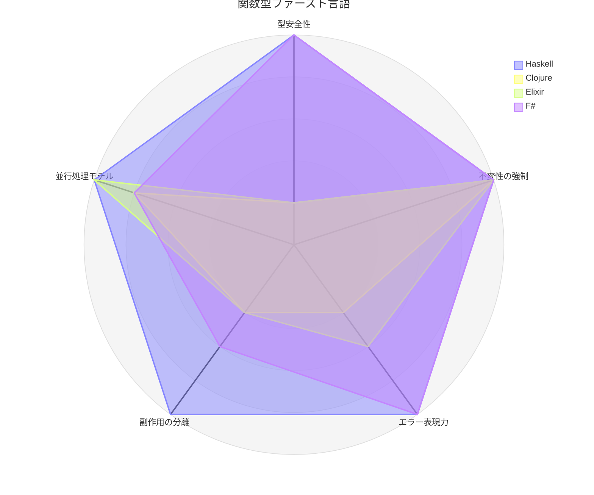
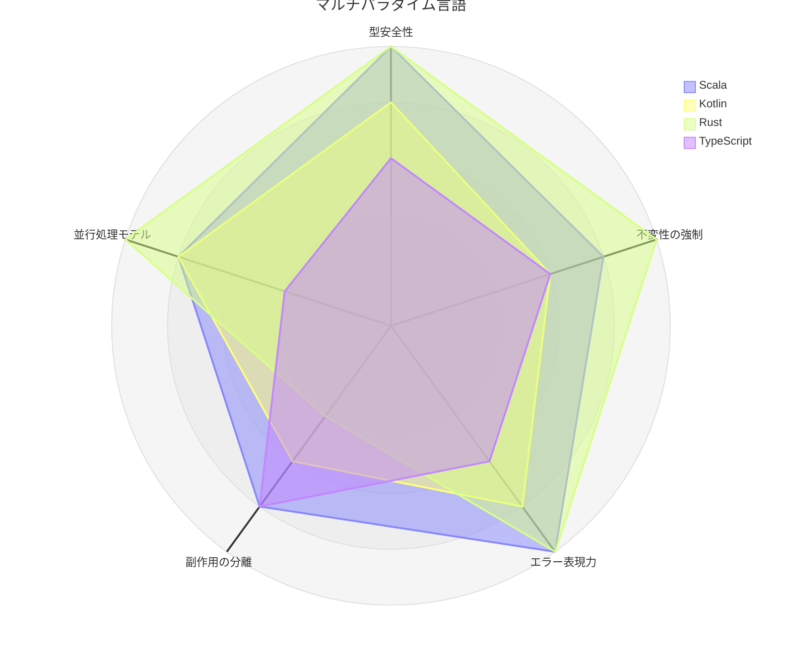
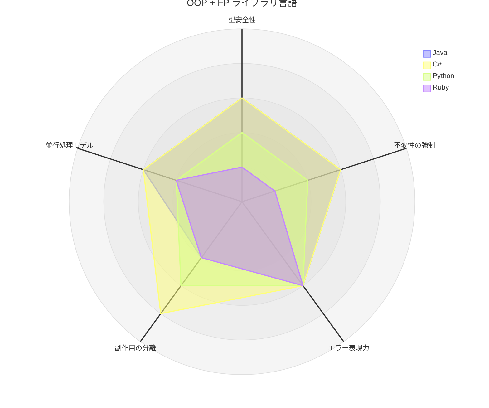
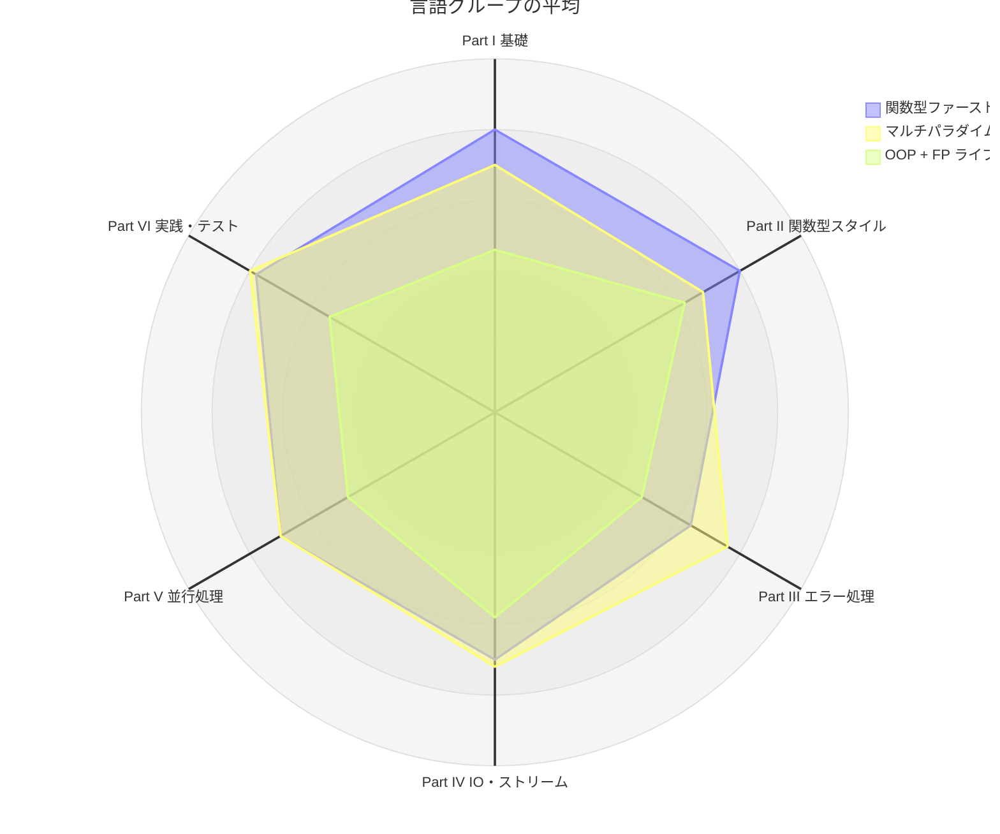
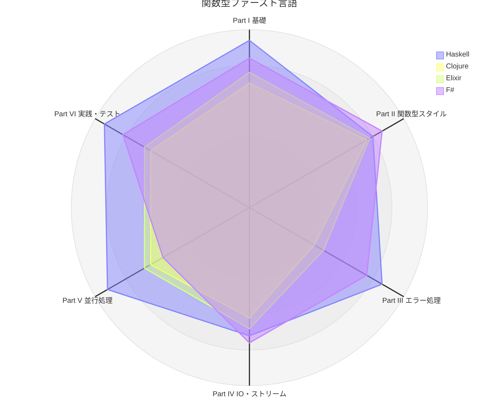
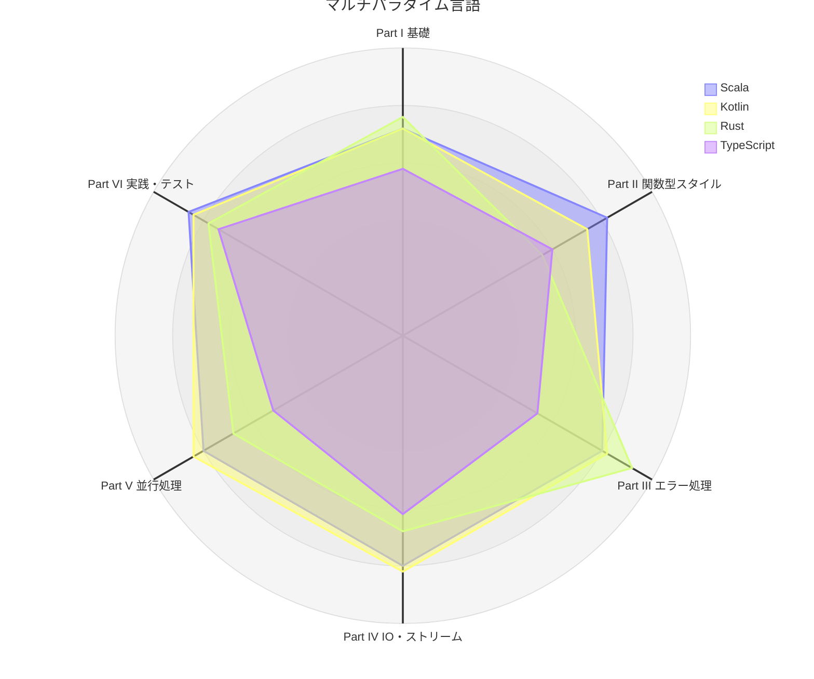
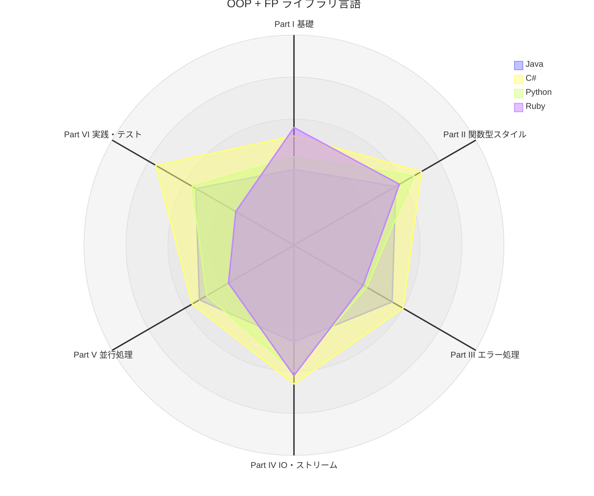

# Grokking Functional Programming：多言語統合解説

本記事シリーズは、12 の言語（Scala, Kotlin, Java, F#, C#, Haskell, Clojure, Elixir, Rust, Python, TypeScript, Ruby）での実装を横断的に比較し、関数型プログラミングの**本質**と**言語固有の表現**を統合的に解説します。

## 本シリーズの目的

各言語の個別記事は「その言語でどう実装するか」に焦点を当てています。本統合記事は、それらを横断して以下を明らかにします：

- **共通の本質**: 言語を超えて成り立つ関数型プログラミングの原則
- **言語間の差異**: 型システム、ランタイム、ライブラリの違いが実装にどう影響するか
- **選択の指針**: どの言語・ライブラリがどのパターンに適しているか

## 言語特性マトリクス

### 言語分類

| グループ | 言語 | 特徴 |
|---------|------|------|
| 関数型ファースト | Haskell, Clojure, Elixir, F# | 関数型が主パラダイム |
| マルチパラダイム（静的） | Scala, Kotlin, Rust, TypeScript | OOP と FP を高度に統合 |
| OOP ファースト + FP ライブラリ | Java, C#, Python, Ruby | ライブラリで FP 機能を補完 |

### 特性比較

| 特性 | Scala | Kotlin | Java | F# | C# | Haskell | Clojure | Elixir | Rust | Python | TypeScript | Ruby |
|------|-------|--------|------|-----|-----|---------|---------|--------|------|--------|------------|------|
| 型システム | 静的（強い） | 静的（null 安全） | 静的（強い） | 静的（推論） | 静的（強い） | 静的（純粋） | 動的 | 動的 | 静的（所有権） | 動的（型ヒント） | 静的（構造的） | 動的 |
| 不変性 | case class | val / data class | record (16+) | デフォルト不変 | record (9+) | 完全不変 | デフォルト不変 | デフォルト不変 | デフォルト不変 | 慣習 + NamedTuple | readonly | freeze |
| Option/Maybe | `Option[A]` | `A?` / `Option<A>` (Arrow) | `Option<T>` (Vavr) | `Option<'a>` | `Option<A>` (LE) | `Maybe a` | `nil` / some | `nil` / `{:ok}` | `Option<T>` | `Maybe` (returns) | `Option<A>` (fp-ts) | `Maybe` (dry) |
| Either/Result | `Either[E, A]` | `Either<E, A>` (Arrow) | `Either<L, R>` (Vavr) | `Result<'a, 'e>` | `Either<L, R>` (LE) | `Either a b` | 手動 | `{:ok}/{:error}` | `Result<T, E>` | `Result` (returns) | `Either<E, A>` (fp-ts) | `Result` (dry) |
| IO モナド | cats-effect IO | suspend 関数 | 独自パターン | Async | Eff/Aff (LE) | IO モナド | lazy-seq | Agent/GenServer | async/await | IO (returns) | Task/TaskEither (fp-ts) | Task (dry) |
| 並行処理 | Ref/Fiber | 構造化並行性 / STM | Virtual Thread | MailboxProcessor | Atom/Task (LE) | STM/MVar | atom/core.async | OTP/GenServer | tokio/Mutex | asyncio | Promise.all | Fiber/Ractor |
| PBT ライブラリ | ScalaCheck | Kotest Property | jqwik | FsCheck | FsCheck | QuickCheck | test.check | StreamData | proptest | Hypothesis | fast-check | rspec |
| 実行環境 | JVM | JVM | JVM | .NET (CLR) | .NET (CLR) | GHC | JVM | BEAM | ネイティブ | CPython | Node.js / Deno | CRuby |

> **LE** = LanguageExt、**Vavr** = Java 向け FP ライブラリ、**Arrow** = Kotlin 向け FP ライブラリ（arrow-core / arrow-fx-coroutines / arrow-fx-stm など）、**dry** = dry-rb エコシステム

### レーダーチャートで見る 12 言語の全体像

全 12 章を通した言語特性を 5 つの軸で数値化し、言語グループごとにレーダーチャートで比較します。スコアは上の特性比較表と各章の比較分析に基づきます。

| 評価軸 | 5 点 | 3 点 | 1 点 |
|--------|------|------|------|
| 型安全性 | 静的型付けで、純粋性・所有権・null などを型で強く保証 | 静的型付けだが抜け道（`any`、null、キャスト）が残る | 動的型付け |
| 不変性の強制 | 不変がデフォルト、または言語が不変を保証 | 不変データ型（record、`readonly`、`val` など）を言語機能で選択 | 慣習や `freeze` などの実行時手段に依存 |
| エラー表現力 | Option/Either 相当とパターンマッチが言語・標準で揃う | ライブラリで Option/Either を提供 | 規約や手動のチェックが中心 |
| 副作用の分離 | 型システムが副作用の分離を強制 | IO 型や `suspend` / `async` で記述と実行を分離できる | 慣習による分離のみ |
| 並行処理モデル | 言語・ランタイム組み込みの高水準モデルで安全性を保証 | 軽量スレッドやライブラリで高水準の並行処理を提供 | シングルスレッドや低水準の手段が中心 |

| 言語 | 型安全性 | 不変性の強制 | エラー表現力 | 副作用の分離 | 並行処理モデル |
|------|:---:|:---:|:---:|:---:|:---:|
| Haskell | 5 | 5 | 5 | 5 | 5 |
| Clojure | 1 | 5 | 2 | 2 | 4 |
| Elixir | 1 | 5 | 3 | 2 | 5 |
| F# | 5 | 5 | 5 | 3 | 4 |
| Scala | 5 | 4 | 5 | 4 | 4 |
| Kotlin | 4 | 3 | 4 | 3 | 4 |
| Rust | 5 | 5 | 5 | 2 | 5 |
| TypeScript | 3 | 3 | 3 | 4 | 2 |
| Java | 3 | 3 | 3 | 2 | 3 |
| C# | 3 | 3 | 3 | 4 | 3 |
| Python | 2 | 2 | 3 | 3 | 2 |
| Ruby | 1 | 1 | 3 | 2 | 2 |



関数型ファースト言語は不変性の強制で全員が満点ですが、型安全性の軸で静的型付けの Haskell・F# と動的型付けの Clojure・Elixir に二分されます。Elixir は型の軸が低い代わりに、OTP による並行処理モデルで Haskell と並びます。



Scala は cats-effect を軸にバランスよく広がり、Rust は所有権による型安全性・不変性・並行処理で突出する一方、IO 型による副作用の分離は行いません。Kotlin は nullable 型 `A?` と Arrow の `Either`、構造化並行性によって Scala に近い形を描き、`val` が参照の再代入を禁じるだけで参照先の不変性までは保証しない分、不変性の軸が控えめです。



OOP + FP ライブラリ言語はエラー表現力が Vavr・LanguageExt・returns・dry-rb によって一律 3 に揃い、ライブラリが言語の差を埋めていることが分かります。C# は LanguageExt の Eff/Aff により副作用の分離で一歩外側に出ます。

全体として、言語組み込みの機能が多いほどチャートは外側に広がり、ライブラリで補う言語ほど中央に寄ります。ただし、どのグループにも突出した軸を持つ言語があり（Elixir の並行処理、Rust の所有権、C# の Eff）、目的に合った軸で言語を選ぶことが重要です。

> スコアは本シリーズの実装と各言語版の記事に基づく相対評価（1〜5）であり、言語の優劣を示すものではありません。

### 総合スコアで見る 12 言語

各章の「レーダーチャートで見る 12 言語」で付けたスコア（各章 5 軸 × 5 点 = 25 点満点）を全 12 章分集計し、言語ごとの総合スコアとして比較します。上の全体像が言語の性質を 5 つの観点で要約したものであるのに対し、こちらは各章の具体的なテーマ（flatMap、Option、IO、並行処理など）での評価を積み上げた結果です。

#### 章別スコアと総合スコア

各章の値は 25 点満点、総合は 300 点満点です。総合スコアの高い順に並べています。

| 順位 | 言語 | 第 1 章 | 第 2 章 | 第 3 章 | 第 4 章 | 第 5 章 | 第 6 章 | 第 7 章 | 第 8 章 | 第 9 章 | 第 10 章 | 第 11 章 | 第 12 章 | 総合 |
|:---:|------|:---:|:---:|:---:|:---:|:---:|:---:|:---:|:---:|:---:|:---:|:---:|:---:|:---:|
| 1 | Haskell | 25 | 22 | 19 | 21 | 20 | 22 | 21 | 19 | 17 | 23 | 22 | 25 | **256** |
| 2 | Scala | 21 | 15 | 19 | 21 | 22 | 20 | 20 | 20 | 20 | 20 | 22 | 21 | **241** |
| 3 | F# | 24 | 18 | 18 | 23 | 23 | 18 | 20 | 19 | 19 | 14 | 19 | 22 | **237** |
| 3 | Kotlin | 19 | 17 | 17 | 21 | 18 | 21 | 20 | 22 | 19 | 21 | 21 | 21 | **237** |
| 5 | Rust | 21 | 17 | 13 | 15 | 14 | 23 | 23 | 17 | 17 | 17 | 21 | 18 | **216** |
| 6 | Elixir | 20 | 18 | 21 | 17 | 21 | 11 | 13 | 13 | 21 | 17 | 16 | 18 | **206** |
| 7 | C# | 12 | 14 | 16 | 16 | 21 | 15 | 15 | 16 | 17 | 14 | 19 | 19 | **194** |
| 8 | Clojure | 19 | 16 | 21 | 17 | 19 | 12 | 9 | 10 | 21 | 16 | 14 | 18 | **192** |
| 9 | TypeScript | 16 | 13 | 15 | 18 | 12 | 14 | 13 | 17 | 14 | 13 | 18 | 19 | **182** |
| 10 | Python | 9 | 12 | 17 | 14 | 19 | 10 | 10 | 14 | 16 | 12 | 12 | 16 | **161** |
| 11 | Java | 7 | 11 | 16 | 13 | 13 | 12 | 15 | 13 | 10 | 13 | 19 | 8 | **150** |
| 12 | Ruby | 14 | 14 | 16 | 14 | 14 | 9 | 10 | 16 | 15 | 9 | 9 | 7 | **147** |

#### Part 別スコア

レーダーチャートの軸は Part I〜VI の 6 つです。各 Part の値は、その Part に含まれる章の得点を平均し、5 点満点に換算したもの（章の得点 ÷ 5）です。章数の多い Part II が有利にならないよう、Part ごとに平均を取っています。

| 言語 | Part I 基礎 | Part II 関数型スタイル | Part III エラー処理 | Part IV IO・ストリーム | Part V 並行処理 | Part VI 実践・テスト |
|------|:---:|:---:|:---:|:---:|:---:|:---:|
| Haskell | 4.7 | 4.0 | 4.3 | 3.6 | 4.6 | 4.7 |
| Clojure | 3.5 | 3.8 | 2.1 | 3.1 | 3.2 | 3.2 |
| Elixir | 3.8 | 3.9 | 2.4 | 3.4 | 3.4 | 3.4 |
| F# | 4.2 | 4.3 | 3.8 | 3.8 | 2.8 | 4.1 |
| Scala | 3.6 | 4.1 | 4.0 | 4.0 | 4.0 | 4.3 |
| Kotlin | 3.6 | 3.7 | 4.1 | 4.1 | 4.2 | 4.2 |
| Rust | 3.8 | 2.8 | 4.6 | 3.4 | 3.4 | 3.9 |
| TypeScript | 2.9 | 3.0 | 2.7 | 3.1 | 2.6 | 3.7 |
| Java | 1.8 | 2.8 | 2.7 | 2.3 | 2.6 | 2.7 |
| C# | 2.6 | 3.5 | 3.0 | 3.3 | 2.8 | 3.8 |
| Python | 2.1 | 3.3 | 2.0 | 3.0 | 2.4 | 2.8 |
| Ruby | 2.8 | 2.9 | 1.9 | 3.1 | 1.8 | 1.6 |
| **関数型ファースト平均** | 4.0 | 4.0 | 3.2 | 3.5 | 3.5 | 3.9 |
| **マルチパラダイム平均** | 3.5 | 3.4 | 3.8 | 3.6 | 3.5 | 4.0 |
| **OOP + FP 平均** | 2.3 | 3.1 | 2.4 | 2.9 | 2.4 | 2.7 |

#### 言語グループの平均



関数型ファースト言語（平均 222.8 点）とマルチパラダイム言語（平均 219.0 点）はほぼ同じ広がりですが、形が異なります。関数型ファースト言語は Part I・II（基礎と関数型スタイル）で最も外側に出る一方、動的型付けの Clojure・Elixir が Part III（エラー処理）で平均を下げています。マルチパラダイム言語は Part III と Part VI（実践・テスト）で最も外側に出ており、静的型による Option / Either と、型を活かしたテスト・リソース管理が強みです。OOP + FP ライブラリ言語（平均 163.0 点）は全体に内側にありますが、Part II ではライブラリのコレクション操作により 3.1 まで広がります。

#### 関数型ファースト言語



Haskell は総合 256 点で全 12 言語の首位となり、Part I（基礎）と Part V（並行処理）、Part VI（実践・テスト）で 4.6 以上を記録します。F# は Part II（関数型スタイル）で 4.3 と最も高い一方、Part V は 2.8 にとどまります。Clojure と Elixir は Part I・II では静的型付けの 2 言語に迫りますが、型で失敗を表現する Part III で 2.1〜2.4 まで下がります。

#### マルチパラダイム言語



Scala（241 点）は全 Part が 3.6〜4.3 に収まるバランス型です。Kotlin（237 点）も 3.6〜4.2 と凹凸の少ない形を描き、`suspend` 関数と構造化並行性を扱う Part IV・V では Scala をわずかに上回ります。Rust は所有権と `Result` / `?` 演算子により Part III で 4.6 と突出する一方、イミュータブルなコレクション操作やカリー化を所有権のもとで書く必要がある Part II は 2.8 です。TypeScript は fp-ts によって Part VI の 3.7 まで広がりますが、全体としてはグループ内で最も内側にあります。

#### OOP + FP ライブラリ言語



C#（194 点）は LanguageExt により Part II・VI で 3.5 以上を確保し、グループ内で最も広い形になります。Python は Part II のジェネレータ・内包表記で 3.3 を得る一方、Part I・III は 2.0 前後です。Java と Ruby は総合 150 点前後で並びますが、Ruby は Part V・VI（並行処理と実践・テスト）が 1.6〜1.8 と低く、Java は Part I（式ベースの定義や不変の既定）が 1.8 と最も低い軸になります。

#### 総合スコアから読み取れること

- **上位は静的型付けの FP 対応言語**: 上位 4 言語（Haskell、Scala、F#、Kotlin）はいずれも静的型付けで、Option / Either 相当や ADT を言語またはライブラリで自然に扱えます。
- **総合点が近くても形は違う**: F# と Kotlin はともに 237 点ですが、F# は Part II に、Kotlin は Part IV・V に山があります。総合点よりも、自分のプロジェクトで重視する Part の軸を見ることが重要です。
- **ライブラリは差を縮める**: OOP + FP ライブラリ言語のうち C# と Python は、LanguageExt や returns によって一部の Part で FP ファースト言語に近い値を得ています。

> 総合スコアは、章ごとに異なる評価軸（学習コストのように易しい言語ほど高得点になる軸を含みます）を等しい重みで合計したものです。各章のスコアと同じく本シリーズの実装と記事に基づく相対評価であり、言語の優劣を示すものではありません。


## 記事構成

### Part I: 関数型プログラミングの基礎（第 1-2 章）

| 章 | 統合記事 | テーマ | 比較のポイント |
|----|---------|--------|---------------|
| 1 | [関数型プログラミング入門](./part-1-ch01-fp-introduction.md) | 命令型 vs 関数型、基本構文 | 各言語のパラダイムポジション、FP の表現スタイルの違い |
| 2 | [純粋関数と副作用](./part-1-ch02-pure-functions.md) | 純粋関数、参照透過性、副作用の排除 | 純粋性の強制度合い（Haskell の完全純粋 vs 他言語の慣習的純粋） |

#### 主な言語間比較テーマ

- **FP の表現力**: Haskell/Clojure/Elixir の FP ファースト vs Java/C# の OOP + FP アドオン
- **純粋性の保証**: Haskell の型レベル純粋性 vs Scala/F# の慣習的純粋性 vs 動的型付け言語の規約的純粋性
- **基本構文**: val/let バインディング vs 再代入可能変数、式ベース（Kotlin の式本体関数など） vs 文ベース

### Part II: 関数型スタイルのプログラミング（第 3-5 章）

| 章 | 統合記事 | テーマ | 比較のポイント |
|----|---------|--------|---------------|
| 3 | [イミュータブルなデータ操作](./part-2-ch03-immutable-data.md) | 不変データ構造とコピーオンライト | 構造共有、永続データ構造、言語レベルの不変保証 |
| 4 | [高階関数](./part-2-ch04-higher-order-functions.md) | map/filter/fold による変換パイプライン | パイプ演算子の有無、メソッドチェーン vs 関数適用スタイル |
| 5 | [flatMap とモナド的合成](./part-2-ch05-flatmap.md) | flatMap/bind によるコンテキスト付き計算の連鎖 | for 内包表記 vs do 記法 vs パイプ vs LINQ vs スレッディングマクロ |

#### 主な言語間比較テーマ

- **不変性の保証レベル**: Haskell の完全不変 vs Rust の `mut` オプトイン vs Clojure の永続データ構造 vs Java/C# のライブラリ依存
- **データ変換スタイル**: Elixir パイプ演算子 `|>` vs F# パイプ `|>` vs Haskell 関数合成 `.` vs Clojure スレッディングマクロ `->>`
- **flatMap の表現**: Scala for 内包表記 vs Haskell do 記法 vs C# LINQ vs TypeScript pipe + chain

### Part III: エラーハンドリングと Option/Either（第 6-7 章）

| 章 | 統合記事 | テーマ | 比較のポイント |
|----|---------|--------|---------------|
| 6 | [Option 型による安全なエラーハンドリング](./part-3-ch06-option.md) | null 安全性、値の有無の型表現 | 言語組み込み vs ライブラリ提供、パターンマッチのサポート度合い |
| 7 | [Either 型と代数的データ型](./part-3-ch07-either-adt.md) | 成功/失敗の型表現、ADT | 判別共用体 vs sealed trait vs enum vs Union、式問題への対応 |

#### 主な言語間比較テーマ

- **Option/Maybe の実装方式**: Haskell/Rust/F# の言語組み込み vs Kotlin の nullable 型 `A?` vs Scala の標準ライブラリ vs Java/C#/Python/Ruby/TypeScript のサードパーティライブラリ
- **ADT の表現**: Haskell `data` vs F# 判別共用体 vs Scala sealed trait vs Kotlin sealed interface vs Rust enum vs Clojure マップ vs Elixir タグ付きタプル
- **パターンマッチ**: Scala/Haskell/F#/Rust/Elixir の強力なパターンマッチ vs Java/C#/Python/TypeScript/Ruby の折衷的サポート

### Part IV: IO と副作用の管理（第 8-9 章）

| 章 | 統合記事 | テーマ | 比較のポイント |
|----|---------|--------|---------------|
| 8 | [IO モナドと副作用の分離](./part-4-ch08-io-monad.md) | 副作用の遅延実行、IO 型による記述と実行の分離 | Haskell IO vs cats-effect vs LanguageExt Eff vs 各言語の代替アプローチ |
| 9 | [ストリーム処理](./part-4-ch09-streams.md) | 無限ストリーム、遅延評価、リアクティブ処理 | fs2 vs Elixir Stream vs Haskell conduit vs 各言語のイテレータ/ジェネレータ |

#### 主な言語間比較テーマ

- **IO の抽象化**: Haskell IO モナド（言語組み込み） vs Scala cats-effect IO vs C# LanguageExt Eff vs Kotlin suspend 関数 vs 他言語の慣習的分離
- **遅延評価**: Haskell のデフォルト遅延 vs Clojure lazy-seq vs 他言語の明示的遅延（Lazy, Stream）
- **ストリーム処理**: fs2 Stream（Scala） vs Kotlin Sequence / Flow vs Elixir Stream + GenStage vs Haskell conduit vs Python ジェネレータ vs Ruby Enumerator::Lazy

### Part V: 並行処理（第 10 章）

| 章 | 統合記事 | テーマ | 比較のポイント |
|----|---------|--------|---------------|
| 10 | [並行・並列処理](./part-5-ch10-concurrency.md) | Ref/Fiber、アトミック参照、軽量スレッド | 並行処理モデルの根本的な違い |

#### 主な言語間比較テーマ

- **並行処理モデル**: Scala Ref/Fiber vs Kotlin 構造化並行性（coroutines） vs Elixir OTP/GenServer vs Haskell STM/MVar vs Rust tokio/Arc/Mutex vs Clojure atom/core.async vs Java Virtual Thread
- **共有状態管理**: 関数型 Ref（Scala/F#） vs STM（Haskell/Clojure） vs 所有権（Rust） vs Atom（C# LanguageExt） vs Actor（Elixir）
- **軽量スレッド**: Scala Fiber vs Elixir プロセス vs Haskell green thread vs Java Virtual Thread vs Ruby Fiber

### Part VI: 実践的なアプリケーション構築とテスト（第 11-12 章）

| 章 | 統合記事                                           | テーマ | 比較のポイント |
|----|------------------------------------------------|--------|---------------|
| 11 | [実践的なアプリケーション構築](./part-6-ch11-application.md) | TravelGuide アプリ、Resource 管理、依存性注入 | DI の関数型アプローチ（Reader vs Protocol vs trait vs インターフェース） |
| 12 | [テスト戦略とプロパティベーステスト](./part-6-ch12-testing.md)  | PBT、テスト設計、副作用のテスト | 各言語の PBT ライブラリとジェネレータ設計 |

#### 主な言語間比較テーマ

- **リソース管理**: Scala Resource vs Kotlin Arrow Resource vs Haskell bracket vs Rust 所有権 + Drop vs Java try-with-resources vs C# using vs Python with
- **依存性注入**: Reader モナド（Scala/TypeScript） vs Protocol（Python） vs trait（Rust） vs ビヘイビア（Elixir） vs 型クラス（Haskell）
- **PBT ライブラリ**: ScalaCheck vs Kotest Property vs jqwik vs FsCheck vs QuickCheck vs test.check vs StreamData vs proptest vs Hypothesis vs fast-check vs rspec

## 各章の統合記事構成テンプレート

各統合記事は以下の構成で執筆します：

```
1. はじめに
   - テーマの概要と関数型での意義

2. 共通の本質
   - 言語を超えて成り立つ原則の核心

3. 言語別実装比較
   - 12 言語の代表的なコードを並べて比較
   - 各言語のイディオムを活かした実装の違い
   - 言語グループ別の傾向分析

4. 比較分析
   - 型システムの影響
   - ライブラリ依存度
   - 表現力と簡潔さのトレードオフ

5. 実践的な選択指針
   - どの言語特性がこのテーマに最も適しているか
   - プロジェクト要件に応じた選択基準

6. まとめ
   - 言語横断的な学び
   - 各言語の個別記事へのリンク
```

## 執筆ルール

### 1. 執筆フォーマット

````markdown
# Part N - 第M章：章タイトル

## M.1 セクションタイトル

本文...

### 言語別実装比較

#### 関数型ファースト言語

<details>
<summary>Haskell 実装</summary>

```haskell
-- コード例
```

</details>

<details>
<summary>Clojure 実装</summary>

```clojure
;; コード例
```

</details>

#### マルチパラダイム言語

<details>
<summary>Scala 実装</summary>

```scala
// コード例
```

</details>

#### OOP + FP ライブラリ言語

<details>
<summary>Java 実装</summary>

```java
// コード例
```

</details>
````

### 2. リスト記述ルール

タスク項目やリスト項目は、ラベル行の後に **1 行空けて** から記述します。

**OK**:

```markdown
**比較ポイント**:

- 不変性の保証レベル
- パフォーマンス特性
- 開発者体験
```

### 3. 言語グループ別の整理

コード比較では 12 言語を以下のグループに分けて提示します：

1. **関数型ファースト**: Haskell → Clojure → Elixir → F#
2. **マルチパラダイム（静的）**: Scala → Kotlin → Rust → TypeScript
3. **OOP + FP ライブラリ**: Java → C# → Python → Ruby

## 執筆計画

> 以下は 11 言語版執筆時（Kotlin 追加前）の計画と実績の記録です。Kotlin 追加に伴う更新は [writing-plan.md](./writing-plan.md) の「12 言語版への更新」を参照してください。

### 概要

全 12 章の統合記事を、Part ごとの統合難易度に基づき 3 つのイテレーションで執筆します。

- **総ソース量**: 55,784 行（11 言語 × 6 Part = 66 ファイル、Kotlin 追加前）
- **統合記事数**: 12 本
- **各記事の想定規模**: 500〜1,000 行
- **詳細計画**: [writing-plan.md](./writing-plan.md) を参照

### 難易度分類

| 難易度 | 章数 | 特徴 |
|--------|------|------|
| Low | 5 章（1-5） | 全言語で構造が一貫、基礎概念で統合しやすい |
| Medium | 4 章（6-9） | ライブラリ依存度が高く、言語固有セクションが必要 |
| High | 3 章（10-12） | 並行処理モデルや実践パターンの根本的差異への対応 |

### イテレーション 1: 基礎と関数型スタイル（Low 難易度）

**対象**: Part I + Part II（第 1-5 章）

全言語で概念構造が一貫しており、統合が最も容易です。

| 章 | タイトル | 難易度 | 統合方針 |
|----|---------|--------|---------|
| 01 | 関数型プログラミング入門 | Low | 命令型 vs 関数型の対比を全言語で横断比較 |
| 02 | 純粋関数と副作用 | Low | 純粋性の保証レベルを言語グループ別に比較 |
| 03 | イミュータブルなデータ操作 | Low | 不変データ構造の実現方法（言語組み込み vs ライブラリ）を比較 |
| 04 | 高階関数 | Low | map/filter/fold のイディオムとパイプライン記法を比較 |
| 05 | flatMap とモナド的合成 | Low | for/do/LINQ/パイプの糖衣構文を言語別に対比 |

**執筆順序**: 01 → 02 → 03 → 04 → 05

**完了条件**:

- [ ] 各章が統合記事構成テンプレートに準拠
- [ ] 11 言語すべてのコード例を含む
- [ ] 言語グループ別の傾向分析を含む

### イテレーション 2: エラーハンドリングと IO（Medium 難易度）

**対象**: Part III + Part IV（第 6-9 章）

各言語の Option/Either 実装方式とライブラリの差異が大きく、言語固有セクションの設計が必要です。

| 章 | タイトル | 難易度 | 統合方針 |
|----|---------|--------|---------|
| 06 | Option 型 | Medium | 言語組み込み vs ライブラリ提供の差異を軸に比較 |
| 07 | Either 型と ADT | Medium | ADT の表現力の違い（判別共用体 vs sealed trait vs enum vs タグ付きタプル） |
| 08 | IO モナド | Medium | IO の抽象化レベルの違い（Haskell IO vs cats-effect vs 慣習的分離） |
| 09 | ストリーム処理 | Medium | 遅延評価とストリームライブラリの多様な実装を比較 |

**執筆順序**: 06 → 07 → 08 → 09

**完了条件**:

- [ ] 各言語の Option/Either 実装の比較表を含む
- [ ] IO モナドの抽象化レベルの違いを図解
- [ ] ストリーム処理のパフォーマンス特性の比較を含む

### イテレーション 3: 並行処理と実践（High 難易度）

**対象**: Part V + Part VI（第 10-12 章）

並行処理モデルが言語ごとに根本的に異なり、最難関です。

| 章 | タイトル | 難易度 | 統合方針 |
|----|---------|--------|---------|
| 10 | 並行・並列処理 | High | 並行処理モデル（Fiber / OTP / STM / tokio / Virtual Thread）を言語別に深掘り |
| 11 | 実践アプリケーション | High | DI・リソース管理の関数型アプローチを言語別に比較 |
| 12 | テスト戦略 | Medium | PBT の共通原理を軸に各言語のライブラリを比較 |

**執筆順序**: 12 → 10 → 11

**完了条件**:

- [ ] 第 10 章で 11 言語の並行処理モデル比較表を含む
- [ ] 第 11 章で DI パターンの言語別実装を比較
- [ ] 第 12 章で全 PBT ライブラリの比較表を含む

### 全体スケジュール

| イテレーション | 章数 | 難易度構成 | 主な課題 |
|---------------|------|-----------|---------|
| 1 | 5 章（01-05） | Low × 5 | ウォームアップ、11 言語比較のフォーマット確立 |
| 2 | 4 章（06-09） | Medium × 4 | ライブラリ依存の差異整理、IO モナドの抽象度の違い |
| 3 | 3 章（10-12） | High × 2 + Medium × 1 | 並行処理モデルの根本的差異、実践パターンの統合 |

### 進捗管理

| 章 | タイトル | イテレーション | 難易度 | 状態 |
|----|---------|---------------|--------|------|
| 01 | 関数型プログラミング入門 | 1 | Low | 完了 |
| 02 | 純粋関数と副作用 | 1 | Low | 完了 |
| 03 | イミュータブルなデータ操作 | 1 | Low | 完了 |
| 04 | 高階関数 | 1 | Low | 完了 |
| 05 | flatMap とモナド的合成 | 1 | Low | 完了 |
| 06 | Option 型 | 2 | Medium | 完了 |
| 07 | Either 型と ADT | 2 | Medium | 完了 |
| 08 | IO モナドと副作用の分離 | 2 | Medium | 完了 |
| 09 | ストリーム処理 | 2 | Medium | 完了 |
| 10 | 並行・並列処理 | 3 | High | 完了 |
| 11 | 実践アプリケーション | 3 | High | 完了 |
| 12 | テスト戦略 | 3 | Medium | 完了 |

## 言語別個別記事へのリンク

| 言語 | FP ライブラリ | 個別記事一覧 |
|------|-------------|-------------|
| Scala | cats-effect / fs2 | [全 6 Part](../scala/index.md) |
| Kotlin | Arrow / kotlinx.coroutines | [全 6 Part](../kotlin/index.md) |
| Java | Vavr | [全 6 Part](../java/index.md) |
| F# | 標準ライブラリ | [全 6 Part](../fsharp/index.md) |
| C# | LanguageExt | [全 6 Part](../csharp/index.md) |
| Haskell | 標準ライブラリ | [全 6 Part](../haskell/index.md) |
| Clojure | core.async | [全 6 Part](../clojure/index.md) |
| Elixir | OTP | [全 6 Part](../elixir/index.md) |
| Rust | tokio | [全 6 Part](../rust/index.md) |
| Python | returns | [全 6 Part](../python/index.md) |
| TypeScript | fp-ts | [全 6 Part](../typescript/index.md) |
| Ruby | dry-rb | [全 6 Part](../ruby/index.md) |

## 参照

- 「Grokking Functional Programming」Michał Płachta, Manning Publications
- [Scala 公式ドキュメント](https://docs.scala-lang.org/)
- [cats-effect](https://typelevel.org/cats-effect/)
- [Kotlin 公式ドキュメント](https://kotlinlang.org/docs/home.html)
- [Arrow](https://arrow-kt.io/)
- [Java 公式ドキュメント](https://docs.oracle.com/en/java/)
- [Vavr](https://www.vavr.io/)
- [F# 公式ドキュメント](https://fsharp.org/)
- [C# 公式ドキュメント](https://docs.microsoft.com/ja-jp/dotnet/csharp/)
- [LanguageExt](https://github.com/louthy/language-ext)
- [Haskell 公式ドキュメント](https://www.haskell.org/)
- [Clojure 公式ドキュメント](https://clojure.org/)
- [Elixir 公式ドキュメント](https://elixir-lang.org/)
- [Rust 公式ドキュメント](https://www.rust-lang.org/)
- [Python 公式ドキュメント](https://docs.python.org/3/)
- [returns](https://returns.readthedocs.io/)
- [TypeScript 公式ドキュメント](https://www.typescriptlang.org/docs/)
- [fp-ts](https://gcanti.github.io/fp-ts/)
- [Ruby 公式ドキュメント](https://docs.ruby-lang.org/ja/)
- [dry-rb](https://dry-rb.org/)
