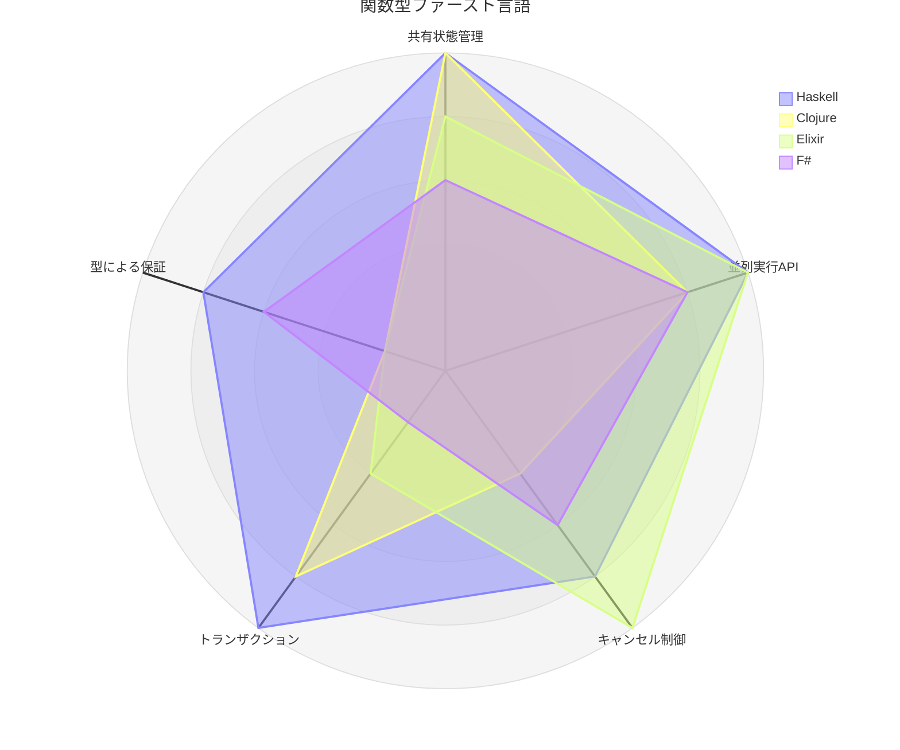
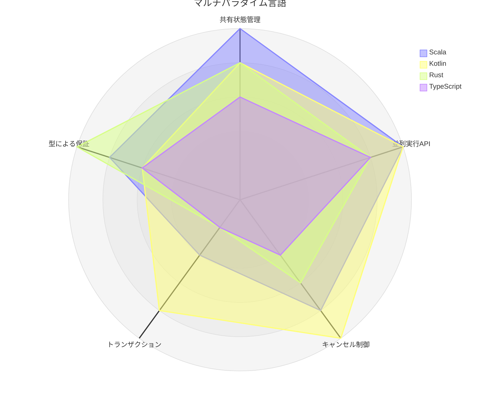
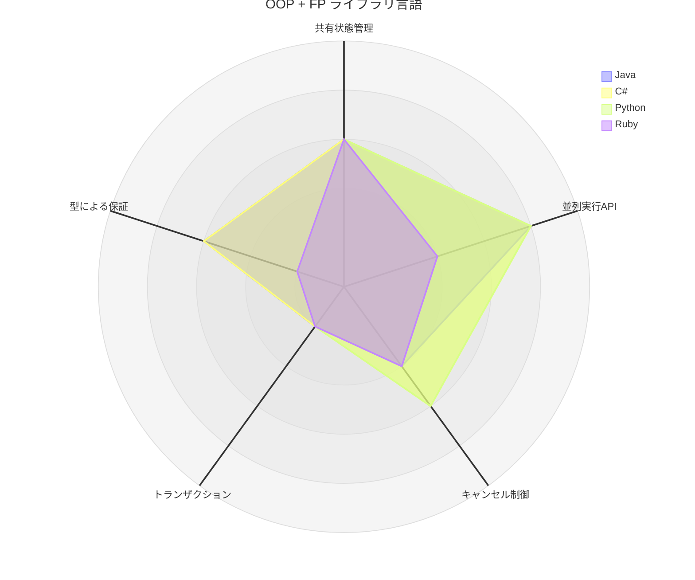

# 第10章: 並行・並列処理 — 12言語比較

## 10.1 はじめに

第 9 章までで、関数型プログラミングの基礎から IO モナド、ストリーム処理まで学んできました。本章では、FP の真価が最も発揮される領域の一つである**並行・並列処理**に踏み込みます。

従来の並行処理は、デッドロック、競合状態、共有可変状態の管理といった難題が伴います。関数型プログラミングでは、イミュータブルデータと参照透過性を基盤に、これらの問題に構造的に対処します。

本章では、12 言語それぞれの並行処理プリミティブを比較し、**共有状態の安全な管理（Ref）**、**並列実行（parSequence）**、**軽量スレッド（Fiber）** という 3 つの共通概念がどのように表現されるかを見ていきます。

---

## 10.2 共通の本質 — 並行処理の 3 つの柱

### FP における並行処理の基本戦略

すべての言語に共通する FP 並行処理のアプローチは、3 つの柱で構成されます。

**第 1 の柱: 共有状態の安全な管理（Ref）** — 複数の並行処理から安全にアクセスできるアトミックな参照です。ミューテックスやロックの低レベルな操作を抽象化し、`update(f)` のような関数的なインターフェースを提供します。

**第 2 の柱: 並列実行（parSequence）** — 複数の独立した IO を並列に実行し、すべての結果を収集します。`sequence`（順次実行）と対比される概念で、実行時間を `O(sum)` から `O(max)` に短縮します。

**第 3 の柱: 軽量スレッド（Fiber）** — OS スレッドよりはるかに軽量な実行単位で、バックグラウンド処理の起動・待機・キャンセルを可能にします。数百万の同時実行をサポートし、構造化された並行処理を実現します。

### 純粋関数による並行処理の分離

並行処理の設計では、**純粋関数によるロジック**と**副作用としての並行制御**を明確に分離します。本章で繰り返し登場するチェックインの例では、`topCities` は常に純粋関数として実装され、並行処理から独立してテスト可能です。

---

## 10.3 共有状態の安全な管理 — Ref の全 12 言語比較

### 代表 3 言語の詳細比較

**Scala — cats-effect の Ref:**

```scala
import cats.effect.Ref

val example: IO[Int] = for {
  counter <- Ref.of[IO, Int](0)    // 初期値 0 の Ref を作成
  _       <- counter.update(_ + 3)  // アトミックに更新
  result  <- counter.get            // 現在の値を取得
} yield result
// 結果: 3
```

**Haskell — IORef:**

```haskell
import Data.IORef

example :: IO Int
example = do
    counter <- newIORef 0
    atomicModifyIORef' counter (\n -> (n + 3, ()))
    readIORef counter
-- 結果: 3
```

**Rust — Arc + Mutex:**

```rust
use std::sync::Arc;
use tokio::sync::Mutex;

pub struct AtomicCounter {
    value: Arc<Mutex<i32>>,
}

impl AtomicCounter {
    pub fn new(initial: i32) -> Self {
        Self { value: Arc::new(Mutex::new(initial)) }
    }

    pub async fn update<F>(&self, f: F) where F: FnOnce(i32) -> i32 {
        let mut guard = self.value.lock().await;
        *guard = f(*guard);
    }

    pub async fn get(&self) -> i32 {
        *self.value.lock().await
    }
}
```

### 全 12 言語の Ref 実装

<details>
<summary>Kotlin — Arrow Atomic / AtomicInt（CAS ベース）</summary>

```kotlin
import arrow.atomic.Atomic
import arrow.atomic.AtomicInt
import arrow.atomic.update

/** カウンターを 3 回インクリメントした結果を返す */
fun incrementThreeTimes(): Int {
    val counter = AtomicInt(0)
    repeat(3) { counter.update { it + 1 } }
    return counter.get()
}

/** Atomic に保存されたチェックイン数をアトミックに更新する */
fun storeCheckIn(storedCheckIns: Atomic<Map<City, Int>>, city: City) {
    storedCheckIns.update { current -> updateCheckIns(current, city) }
}
```

外部から読み取る値（ランキング）には `MutableStateFlow<A>` を使い、読み取り側には `StateFlow` として公開します。

</details>

<details>
<summary>Java — AtomicReference ベースの Ref</summary>

```java
public final class Ref<A> {
    private final AtomicReference<A> value;

    public static <A> IO<Ref<A>> of(A initial) {
        return IO.delay(() -> new Ref<>(initial));
    }

    public IO<A> get() {
        return IO.delay(value::get);
    }

    public IO<Void> update(UnaryOperator<A> f) {
        return IO.effect(() -> value.updateAndGet(f));
    }
}
```

</details>

<details>
<summary>Python — threading.Lock / asyncio.Lock ベースの Ref</summary>

```python
class Ref(Generic[T]):
    def __init__(self, initial: T) -> None:
        self._value = initial
        self._lock = threading.Lock()

    def get(self) -> T:
        with self._lock:
            return self._value

    def update(self, f: Callable[[T], T]) -> None:
        with self._lock:
            self._value = f(self._value)
```

```python
class AsyncRef(Generic[T]):
    def __init__(self, initial: T) -> None:
        self._value = initial
        self._lock = asyncio.Lock()

    async def get(self) -> T:
        async with self._lock:
            return self._value

    async def update(self, f: Callable[[T], T]) -> None:
        async with self._lock:
            self._value = f(self._value)
```

</details>

<details>
<summary>TypeScript — 同期ベースの Ref</summary>

```typescript
interface Ref<A> {
  readonly get: Task<A>
  readonly set: (value: A) => Task<void>
  readonly update: (f: (a: A) => A) => Task<void>
  readonly modify: <B>(f: (a: A) => readonly [A, B]) => Task<B>
}
```

</details>

<details>
<summary>F# — lock ベースの Ref</summary>

```fsharp
type Ref<'a> private (initialValue: 'a) =
    let mutable value = initialValue
    let lockObj = obj()

    member _.Get() : 'a = lock lockObj (fun () -> value)
    member _.Update(f: 'a -> 'a) : unit = lock lockObj (fun () -> value <- f value)

    static member Of(initialValue: 'a) : Ref<'a> = Ref(initialValue)
```

</details>

<details>
<summary>C# — lock ベースの Ref</summary>

```csharp
public class Ref<T>
{
    private T _value;
    private readonly object _lock = new();

    public static Ref<T> Of(T initialValue) => new(initialValue);
    public T Get() { lock (_lock) { return _value; } }
    public void Update(Func<T, T> f) { lock (_lock) { _value = f(_value); } }
}
```

</details>

<details>
<summary>Clojure — atom（CAS ベース）</summary>

```clojure
;; atom を作成
(def counter (atom 0))

;; swap! でアトミックに更新（CAS）
(swap! counter + 3)

;; 値を読み取り
@counter  ;; => 3
```

</details>

<details>
<summary>Elixir — Agent（プロセスベース）</summary>

```elixir
{:ok, counter} = Agent.start_link(fn -> 0 end)

Agent.update(counter, &(&1 + 3))
Agent.get(counter, & &1)  # 3

Agent.stop(counter)
```

</details>

<details>
<summary>Ruby — Mutex ベースの Ref</summary>

```ruby
class Ref
  def initialize(initial_value)
    @value = initial_value
    @mutex = Mutex.new
  end

  def get
    IO.delay { @mutex.synchronize { @value } }
  end

  def update(&fn)
    IO.delay { @mutex.synchronize { @value = fn.call(@value) } }
  end
end
```

</details>

### Ref 実装方式の比較

| 言語 | 型 | 内部実装 | 特徴 |
|------|-----|---------|------|
| Scala | `Ref[IO, A]` | CAS（アトミック） | IO モナドに統合、ロックフリー |
| Kotlin | `Atomic<A>` / `MutableStateFlow<A>` | CAS（`AtomicReference`） | Arrow の拡張関数 `update { }`、作成は副作用扱いしない |
| Haskell | `IORef a` | アトミック操作 | `atomicModifyIORef'` で CAS |
| Rust | `Arc<Mutex<T>>` | OS レベルロック | 所有権で安全性を保証 |
| Java | `Ref<A>` (自作) | `AtomicReference` | CAS ベース、IO にラップ |
| Python | `Ref[T]` / `AsyncRef[T]` | `threading.Lock` / `asyncio.Lock` | 同期/非同期の 2 バージョン |
| TypeScript | `Ref<A>` | 同期（シングルスレッド） | イベントループ内で安全 |
| F# | `Ref<'a>` | `lock` | .NET のモニターロック |
| C# | `Ref<T>` | `lock` | .NET のモニターロック |
| Clojure | `atom` | CAS（ネイティブ） | 言語組み込み、`swap!` で更新 |
| Elixir | `Agent` | プロセス（BEAM VM） | メッセージパッシングで安全 |
| Ruby | `Ref` (自作) | `Mutex` | IO モナドにラップ |

---

## 10.4 並列実行 — parSequence の全 12 言語比較

### 代表 3 言語の詳細比較

**Scala — parSequence:**

```scala
import cats.implicits._

// 順次実行: 約3秒
List(program1, program2, program3).sequence

// 並列実行: 約1秒
List(program1, program2, program3).parSequence
```

**Haskell — mapConcurrently:**

```haskell
import Control.Concurrent.Async

-- 並列実行
results <- mapConcurrently (\x -> return (x * 2)) [1, 2, 3]
-- results: [2, 4, 6]

-- Scala の parSequence に相当
results <- mapConcurrently id [return 1, return 2, return 3]
```

**Rust — tokio::spawn + join_all:**

```rust
pub async fn run_parallel<T, U, F, Fut>(items: Vec<T>, f: F) -> Vec<U>
where
    T: Send + 'static, U: Send + 'static,
    F: Fn(T) -> Fut + Send + Sync + 'static,
    Fut: std::future::Future<Output = U> + Send,
{
    let f = Arc::new(f);
    let handles: Vec<JoinHandle<U>> = items
        .into_iter()
        .map(|item| {
            let f = Arc::clone(&f);
            tokio::spawn(async move { f(item).await })
        })
        .collect();

    let mut results = Vec::with_capacity(handles.len());
    for handle in handles {
        results.push(handle.await.unwrap());
    }
    results
}
```

### 全 12 言語の並列実行

<details>
<summary>Kotlin — Arrow parMap / parZip + coroutineScope</summary>

```kotlin
/** Scala の parSequence に相当: suspend 関数のリストを並列実行する */
suspend fun <A> List<suspend () -> A>.parSequence(): List<A> =
    parMap { io -> io() }

/** 同時実行数を制限して並列に取得する */
suspend fun <A, B> fetchAllLimited(
    ids: List<A>,
    concurrency: Int,
    fetch: suspend (A) -> B,
): List<B> = ids.parMap(concurrency = concurrency) { id -> fetch(id) }

/** 名前とスコアを並列に取得して Profile に組み立てる */
suspend fun fetchProfile(
    fetchName: suspend () -> String,
    fetchScore: suspend () -> Int,
    context: CoroutineContext = EmptyCoroutineContext,
): Profile = parZip(
    context,
    { fetchName() },
    { fetchScore() },
) { name, score -> Profile(name, score) }

/** 構造化並行性: すべてを並行に実行して合計する */
suspend fun sumConcurrent(ios: List<suspend () -> Int>): Int = coroutineScope {
    ios.map { io -> async { io() } }.awaitAll().sum()
}
```

`coroutineScope` の中の子が 1 つでも失敗すると、残りの兄弟は自動的にキャンセルされ、例外は呼び出し元に再送出されます。

</details>

<details>
<summary>Java — CompletableFuture + VirtualThread</summary>

```java
public static <A> IO<List<A>> parSequence(List<IO<A>> ios) {
    return IO.delay(() -> {
        var futures = ios.map(io ->
            CompletableFuture.supplyAsync(io::unsafeRun,
                Executors.newVirtualThreadPerTaskExecutor()));
        return futures.map(CompletableFuture::join);
    });
}
```

</details>

<details>
<summary>Python — asyncio.gather</summary>

```python
async def par_sequence(tasks: list[Coroutine[Any, Any, T]]) -> list[T]:
    return list(await asyncio.gather(*tasks))

# 使用例: 約0.1秒（順次実行なら約0.3秒）
result = await par_sequence([task(1), task(2), task(3)])
```

</details>

<details>
<summary>TypeScript — Promise.all ベースの parSequence</summary>

```typescript
const parallel = await parSequence([
  delay(1000, 1),
  delay(1000, 2),
  delay(1000, 3)
])()  // => [1, 2, 3]（約1秒）
```

</details>

<details>
<summary>F# — Async.Parallel</summary>

```fsharp
let parSequence (asyncList: Async<'a> list) : Async<'a list> =
    async {
        let! results = Async.Parallel asyncList
        return results |> Array.toList
    }
```

</details>

<details>
<summary>C# — Task.WhenAll</summary>

```csharp
public static async Task<Seq<T>> ParSequence<T>(Seq<Task<T>> tasks)
{
    var results = await Task.WhenAll(tasks);
    return toSeq(results);
}
```

</details>

<details>
<summary>Clojure — pmap</summary>

```clojure
;; pmap は map の並列版
(defn parallel-process [coll]
  (vec (pmap slow-operation coll)))

;; 使用例
(vec (pmap #(* % 2) [1 2 3]))  ;; => [2 4 6]
```

</details>

<details>
<summary>Elixir — Task.async + Task.await_many</summary>

```elixir
tasks = [fn -> 1 end, fn -> 2 end, fn -> 3 end]

results =
  tasks
  |> Enum.map(&Task.async/1)
  |> Task.await_many()
# [1, 2, 3]
```

</details>

<details>
<summary>Ruby — Thread ベースの par_sequence</summary>

```ruby
def par_sequence(ios)
  IO.delay do
    threads = ios.map { |io| Thread.new { io.run! } }
    threads.map(&:value)
  end
end
```

</details>

### 並列実行 API の比較

| 言語 | API | 内部実装 | 備考 |
|------|-----|---------|------|
| Scala | `List(...).parSequence` | cats-effect Fiber Pool | ファイバーベース |
| Kotlin | `list.parMap { it() }` / `parZip` / `raceN` | Arrow Fx Coroutines + kotlinx.coroutines | `concurrency` で同時実行数を制限可 |
| Haskell | `mapConcurrently` | async ライブラリ | GHC 軽量スレッド |
| Rust | `tokio::spawn` + `join_all` | tokio ランタイム | `Send` 境界が必要 |
| Java | `CompletableFuture` + VirtualThread | Project Loom | Java 21+ |
| Python | `asyncio.gather` | イベントループ | async/await 必須 |
| TypeScript | `Promise.all` | イベントループ | シングルスレッド |
| F# | `Async.Parallel` | .NET ThreadPool | 標準ライブラリ |
| C# | `Task.WhenAll` | .NET ThreadPool | 標準ライブラリ |
| Clojure | `pmap` | Java ForkJoinPool | 遅延シーケンス |
| Elixir | `Task.async` + `Task.await_many` | BEAM プロセス | 軽量プロセス |
| Ruby | `Thread.new` + `join` | OS スレッド | GIL の制約あり |

---

## 10.5 軽量スレッド — Fiber の全 12 言語比較

### 代表 3 言語の詳細比較

**Scala — Fiber:**

```scala
val program: IO[Unit] = for {
  fiber <- IO.sleep(300.millis)
             .flatMap(_ => IO.println("hello"))
             .foreverM
             .start          // Fiber を起動
  _     <- IO.sleep(1.second)
  _     <- fiber.cancel      // キャンセル
} yield ()
```

**Haskell — Async:**

```haskell
import Control.Concurrent.Async

handle <- async (return 42)   -- バックグラウンドで起動
result <- wait handle          -- 結果を待機
cancel handle                  -- キャンセル
```

**Rust — JoinHandle:**

```rust
pub struct BackgroundTask<T> {
    handle: JoinHandle<T>,
}

impl<T> BackgroundTask<T> {
    pub fn cancel(self) { self.handle.abort(); }
    pub async fn join(self) -> Result<T, tokio::task::JoinError> {
        self.handle.await
    }
}
```

### 全 12 言語の Fiber / 軽量スレッド

<details>
<summary>Kotlin — コルーチンの Job（構造化並行性）</summary>

```kotlin
/** interval ごとに action を繰り返す Job を起動し、すぐに返す */
fun CoroutineScope.repeatForever(interval: Duration, action: suspend () -> Unit): Job =
    launch {
        while (true) {
            delay(interval)
            action()
        }
    }

/** interval ごとに値を集め、duration 経過後に停止して結果を返す */
suspend fun collectFor(
    duration: Duration,
    interval: Duration,
    produce: suspend () -> Int,
): List<Int> = coroutineScope {
    val collected = Atomic(emptyList<Int>())
    val producer = repeatForever(interval) {
        val n = produce()
        collected.update { values -> values + n }
    }
    delay(duration)
    producer.cancelAndJoin()
    collected.get()
}
```

`launch` は `CoroutineScope` の拡張関数なので、起動した `Job` は必ずスコープの子になり、スコープの外に漏れません。

</details>

<details>
<summary>Java — Fiber（VirtualThread ベース）</summary>

```java
public class Fiber<A> {
    private final CompletableFuture<A> future;
    private final Thread thread;

    public IO<A> join() {
        return IO.delay(future::get);
    }

    public IO<Void> cancel() {
        return IO.effect(thread::interrupt);
    }
}
```

</details>

<details>
<summary>Python — asyncio.Task</summary>

```python
class Fiber(Generic[T]):
    def __init__(self, task: asyncio.Task[T]):
        self._task = task

    async def join(self) -> T:
        return await self._task

    def cancel(self) -> None:
        self._task.cancel()
```

</details>

<details>
<summary>TypeScript — Fiber インターフェース</summary>

```typescript
interface Fiber<A> {
  readonly join: Task<A>
  readonly cancel: Task<void>
  readonly isCancelled: IO<boolean>
}
```

</details>

<details>
<summary>F# — Async + CancellationToken</summary>

```fsharp
type Fiber<'a> = {
    Join: Async<'a>
    Cancel: unit -> unit
}

let start (computation: Async<'a>) : Fiber<'a> =
    let cts = new CancellationTokenSource()
    let task = Async.StartAsTask(computation, cancellationToken = cts.Token)
    { Join = Async.AwaitTask task; Cancel = fun () -> cts.Cancel() }
```

</details>

<details>
<summary>C# — Task + CancellationToken</summary>

```csharp
public class Fiber<T>
{
    private readonly Task<T> _task;
    private readonly CancellationTokenSource _cts;

    public async Task<T> Join() => await _task;
    public void Cancel() => _cts.Cancel();
}
```

</details>

<details>
<summary>Clojure — future</summary>

```clojure
(defn start-fiber [f]
  (let [fut (future (f))]
    {:join (fn [] @fut)
     :cancel (fn [] (future-cancel fut))}))
```

</details>

<details>
<summary>Elixir — Process / Task</summary>

```elixir
def start_background(f) do
  pid = spawn(f)
  {:ok, pid}
end

def cancel(pid) do
  Process.exit(pid, :kill)
  :ok
end
```

</details>

<details>
<summary>Ruby — FiberHandle（Thread ベース）</summary>

```ruby
class FiberHandle
  def initialize(thread)
    @thread = thread
  end

  def join
    IO.delay { @thread.value }
  end

  def cancel
    IO.delay { @thread.kill }
  end
end
```

</details>

### Fiber 操作の比較

| 言語 | 起動 | 待機 | キャンセル | 実体 |
|------|------|------|-----------|------|
| Scala | `.start` | `fiber.join` | `fiber.cancel` | cats-effect Fiber |
| Kotlin | `scope.launch` / `scope.async` | `job.join()` / `deferred.await()` | `job.cancelAndJoin()` | コルーチン（`Job`） |
| Haskell | `async` | `wait` | `cancel` | GHC 軽量スレッド |
| Rust | `tokio::spawn` | `handle.await` | `handle.abort()` | tokio タスク |
| Java | `Thread.startVirtualThread` | `future.get()` | `thread.interrupt()` | VirtualThread |
| Python | `asyncio.create_task` | `await task` | `task.cancel()` | asyncio Task |
| TypeScript | `start(task)` | `fiber.join()` | `fiber.cancel()` | Promise + フラグ |
| F# | `Async.Start` | `Async.AwaitTask` | `cts.Cancel()` | .NET Task |
| C# | `Task.Run` | `await task` | `cts.Cancel()` | .NET Task |
| Clojure | `future` | `@fut` / `deref` | `future-cancel` | Java Thread |
| Elixir | `spawn` / `Task.async` | `Task.await` | `Process.exit` | BEAM プロセス |
| Ruby | `Thread.new` | `thread.value` | `thread.kill` | OS スレッド |

---

## 10.6 実践パターン — チェックイン処理システム

### 共通のドメインモデル（純粋関数）

すべての言語で共通する核心は、**ランキング計算が純粋関数**であることです。

**Scala:**

```scala
def topCities(cityCheckIns: Map[City, Int]): List[CityStats] =
  cityCheckIns.toList
    .map { case (city, checkIns) => CityStats(city, checkIns) }
    .sortBy(_.checkIns).reverse.take(3)
```

**Haskell:**

```haskell
topCities :: Int -> Map City Int -> [CityStats]
topCities n cityCheckIns =
    take n . sortBy (\a b -> compare (Down $ csCheckIns a) (Down $ csCheckIns b))
    . map (uncurry CityStats) $ Map.toList cityCheckIns
```

**Clojure:**

```clojure
(defn top-cities [city-check-ins n]
  (->> city-check-ins
       (map (fn [[city check-ins]] (city-stats city check-ins)))
       (sort-by :check-ins >)
       (take n)))
```

この純粋関数は並行処理から完全に独立しており、単体テストが容易です。

### バックグラウンド処理パターン

Fiber を使って、呼び出し元に即座に制御を返しつつバックグラウンドで処理を続ける設計は、全言語で共通するパターンです。

**Scala の ProcessingCheckIns:**

```scala
case class ProcessingCheckIns(
  currentRanking: IO[List[CityStats]],
  stop: IO[Unit]
)

def processCheckIns(checkIns: Stream[IO, City]): IO[ProcessingCheckIns] = for {
  storedCheckIns <- Ref.of[IO, Map[City, Int]](Map.empty)
  storedRanking  <- Ref.of[IO, List[CityStats]](List.empty)
  rankingProgram  = updateRanking(storedCheckIns, storedRanking)
  checkInsProgram = checkIns.evalMap(storeCheckIn(storedCheckIns)).compile.drain
  fiber          <- List(rankingProgram, checkInsProgram).parSequence.start
} yield ProcessingCheckIns(storedRanking.get, fiber.cancel)
```

**Rust の ProcessingCheckIns:**

```rust
pub struct ProcessingCheckIns {
    store: CheckInStore,
    ranking: SharedValue<Vec<CityStats>>,
    tasks: Vec<JoinHandle<()>>,
}

impl ProcessingCheckIns {
    pub async fn current_ranking(&self) -> Vec<CityStats> {
        self.ranking.read().await
    }

    pub fn stop(self) {
        for task in self.tasks { task.abort(); }
    }
}
```

**Haskell の ProcessingCheckIns:**

```haskell
data ProcessingCheckIns = ProcessingCheckIns
    { currentRanking :: IO [CityStats]
    , stopProcessing :: IO ()
    }
```

**Kotlin の ProcessingCheckIns:**

```kotlin
fun CoroutineScope.startProcessingCheckIns(
    checkIns: Flow<City>,
    topN: Int,
    interval: Duration,
): ProcessingCheckIns {
    val storedCheckIns = Atomic(emptyMap<City, Int>())
    val storedRanking = MutableStateFlow(emptyList<CityStats>())

    val job = launch {
        launch { updateRanking(storedCheckIns, storedRanking, topN, interval) }
        launch { checkIns.collect { city -> storeCheckIn(storedCheckIns, city) } }
    }
    return ProcessingCheckIns(storedRanking, job)
}
```

Kotlin では `Ref` の代わりに `Atomic` と `MutableStateFlow`、Fiber の代わりに `Job` を使います。`CoroutineScope` の拡張関数にすることで、「起動してすぐ戻る」関数であることをシグネチャで表明しています。

このパターンの共通構造は以下の通りです。

1. **Ref** で共有状態を初期化
2. 複数の処理（チェックイン保存、ランキング更新）を **Fiber** で並行起動
3. `currentRanking`（状態の読み取り）と `stop`（キャンセル）のインターフェースを返す

---

## 10.7 比較分析

### 並行モデルの分類

12 言語の並行処理モデルは、以下の 4 つのカテゴリに分類できます。なお、これらのモデルの土台となる実行単位の管理方法として、Kotlin の **コルーチン + 構造化並行性**（すべてのコルーチンがスコープに属し、失敗とキャンセルが親子で伝播する）があります。

#### 1. 共有状態モデル（Ref / Lock ベース）

最も広く採用されているモデルです。アトミック参照やロックを使って共有状態を保護します。

**採用言語**: Scala、Kotlin（Atomic / MutableStateFlow）、Haskell（IORef）、Rust、Java、Python、TypeScript、F#、C#、Ruby

**特徴**: 直感的で理解しやすいが、ロックの粒度設計が重要。

#### 2. STM モデル（Software Transactional Memory）

複数の参照をトランザクションで一貫性を保って更新するモデルです。

**採用言語**: Haskell（TVar/STM）、Kotlin（Arrow `arrow-fx-stm` の TVar/atomically）、Clojure（ref/dosync）

```haskell
-- Haskell STM: 銀行口座間の送金
transfer :: TVar Int -> TVar Int -> Int -> STM ()
transfer from to amount = do
    fromBalance <- readTVar from
    check (fromBalance >= amount)
    modifyTVar' from (subtract amount)
    modifyTVar' to (+ amount)
```

```kotlin
// Kotlin（Arrow STM）: Haskell と同じく check で条件待ち
fun STM.transferStm(from: TVar<Int>, to: TVar<Int>, amount: Int) {
    val balance = from.read()
    check(balance >= amount) // false なら retry: from が変わるまで待機して再実行
    from.write(balance - amount)
    to.modify { it + amount }
}

/** 残高不足なら待たずに false を返す送金 */
suspend fun tryTransfer(from: TVar<Int>, to: TVar<Int>, amount: Int): Boolean =
    atomically {
        stm { transferStm(from, to, amount); true } orElse { false }
    }
```

```clojure
;; Clojure STM: トランザクションで複数の ref を更新
(defn stm-transfer! [from-city to-city amount]
  (dosync
   (alter check-in-ref update from-city - amount)
   (alter check-in-ref update to-city (fnil + 0) amount)))
```

**特徴**: 競合時に自動リトライ。デッドロックが構造的に発生しない。

#### 3. アクター / プロセスモデル

状態をプロセスに閉じ込め、メッセージパッシングで通信するモデルです。

**採用言語**: Elixir（GenServer/OTP）、F#（MailboxProcessor）、Rust（Actor パターン）

```elixir
# Elixir: Agent はプロセスベースの状態管理
{:ok, counter} = Agent.start_link(fn -> 0 end)
Agent.update(counter, &(&1 + 1))
```

**特徴**: 共有状態がなく、スケーラビリティに優れる。障害分離が自然。

#### 4. チャネル / CSP モデル

チャネルを介して値を送受信するモデルです。

**採用言語**: Clojure（core.async）、Rust（mpsc/broadcast）、C#（Channel）

**特徴**: プロデューサーとコンシューマーの疎結合。バックプレッシャーのサポート。

### 安全性の保証レベル

| レベル | 言語 | 保証の仕組み |
|--------|------|-------------|
| **コンパイル時** | Rust | 所有権システムが共有可変状態を静的に検出 |
| **型システム** | Scala, Haskell | IO モナドが副作用を型で追跡 |
| **構造化並行性** | Kotlin | コルーチンのスコープが子の寿命を管理し、失敗とキャンセルを伝播。複数状態の整合は Arrow STM で保証 |
| **ランタイム** | Clojure, Elixir | STM の自動リトライ、プロセス分離 |
| **規約ベース** | Java, Python, TypeScript, F#, C#, Ruby | 開発者がロック/同期を適切に使用 |

### レーダーチャートで見る 12 言語

並行処理の 3 つの柱に、複数状態のトランザクションと静的な保証を加えた 5 つの軸で、12 言語の特徴をレーダーチャートにまとめます。

| 評価軸 | 5 点 | 3 点 | 1 点 |
|--------|------|------|------|
| 共有状態管理 | 言語やライブラリがロックフリーな原子参照を直接提供する | 標準のロックや原子参照を自作の `Ref` で包む | 低レベルな同期操作を直接扱う必要がある |
| 並列実行API | 同時実行数の制限や型の異なる処理の組み合わせまで高水準 API が揃う | 一括実行と待機の基本 API がある | 実質的な並列実行が難しい |
| キャンセル制御 | 親子関係やスーパーバイザーでキャンセルと失敗が自動伝播する | トークンやハンドルで明示的にキャンセルする | キャンセル手段がほぼない |
| トランザクション | STM を言語・標準で提供し、条件待ちや合成ができる | 外部ライブラリやプロセスの直列化で代替する | 複数状態の整合は自前で管理する |
| 型による保証 | データ競合をコンパイル時に検出する | 非同期処理を型で表すが、同期は規約に委ねる | 動的型付けで規約のみに頼る |

| 言語 | 共有状態管理 | 並列実行API | キャンセル制御 | トランザクション | 型による保証 |
|------|:---:|:---:|:---:|:---:|:---:|
| Haskell | 5 | 5 | 4 | 5 | 4 |
| Clojure | 5 | 4 | 2 | 4 | 1 |
| Elixir | 4 | 5 | 5 | 2 | 1 |
| F# | 3 | 4 | 3 | 1 | 3 |
| Scala | 5 | 5 | 4 | 2 | 4 |
| Kotlin | 4 | 5 | 5 | 4 | 3 |
| Rust | 4 | 4 | 3 | 1 | 5 |
| TypeScript | 3 | 4 | 2 | 1 | 3 |
| Java | 3 | 4 | 2 | 1 | 3 |
| C# | 3 | 4 | 3 | 1 | 3 |
| Python | 3 | 4 | 3 | 1 | 1 |
| Ruby | 3 | 2 | 2 | 1 | 1 |



関数型ファースト言語では、Haskell が STM と IO 型によりほぼ全方位で高得点です。Clojure は atom と ref による状態管理、Elixir は OTP によるプロセスの寿命管理と、それぞれ得意な軸がはっきり分かれています。



マルチパラダイム言語では、Scala が cats-effect の `Ref` と IO 型で、Kotlin が構造化並行性と Arrow STM で、Rust が所有権による静的な保証で、それぞれ異なる方向に張り出しています。Kotlin は STM をライブラリで使える点で、Haskell に次ぐトランザクションの手軽さを持ちます。



OOP + FP ライブラリ言語は、既存の並行処理基盤の上に自作の `Ref` や `parSequence` を載せるため、似た形になります。Ruby は GIL の制約により並列実行の軸が低くなります。

全体として、並列実行 API はどの言語でも充実しており、差が出るのはキャンセルの伝播、複数状態のトランザクション、静的な保証の 3 軸です。STM を持つ Haskell、Clojure、Kotlin、構造化されたキャンセルを持つ Kotlin と Elixir、コンパイル時の安全性を持つ Rust というように、各言語の強みは並行処理のどの難しさに正面から取り組んでいるかを反映しています。

> スコアは本シリーズの実装と各言語版の記事に基づく相対評価（1〜5）であり、言語の優劣を示すものではありません。

---

## 10.8 言語固有の特徴

### Haskell — STM の優雅さ

Haskell の STM は `retry` と `orElse` による合成可能なトランザクションを提供します。条件が満たされない場合に自動的にブロックし、条件が満たされた時点で再実行する仕組みは、他の言語では再現が困難です。

### Kotlin — 構造化並行性と Arrow STM

Kotlin のコルーチンは必ず `CoroutineScope` に属し、スコープは子の完了を待ちます。`coroutineScope` の中で子が 1 つ失敗すると兄弟は自動的にキャンセルされ、例外は親に再送出されるため、Future を手動でキャンセルして回る必要がありません。その上に Arrow Fx Coroutines の `parMap`（`concurrency` で同時実行数を制限可）、`parZip`、`raceN` が高水準な並列 API を提供します。共有状態は 1 つの値なら `Atomic` / `MutableStateFlow`、複数の値の整合性や条件待ちが必要なら `arrow-fx-stm` の `TVar` と `atomically` を使い、`check` / `retry` / `orElse` で Haskell と同じ合成可能なトランザクションを書けます。一方でキャンセルは協調的で、サスペンドポイントに到達するまで止まらない点には注意が必要です。

### Rust — 所有権による安全性

Rust の `Send` / `Sync` トレイトは、スレッド安全性をコンパイル時に保証します。`Arc<Mutex<T>>` のようなラッパーは冗長に見えますが、「安全でない共有」をコンパイラが検出してくれるため、ランタイムのデータ競合が構造的に排除されます。

### Clojure — 多層並行プリミティブ

`atom`（単一値の CAS）、`ref`（STM トランザクション）、`agent`（非同期キュー）の 3 つのプリミティブを場面に応じて使い分けられる設計は、Clojure 独自の強みです。

### Elixir — OTP による堅牢性

BEAM VM の軽量プロセスと OTP フレームワーク（GenServer、Supervisor）の組み合わせは、並行処理における耐障害性の標準を確立しています。プロセスが数 KB のメモリで数百万同時起動でき、クラッシュしても Supervisor が自動復旧します。

### Java — Project Loom

Java 21 の VirtualThread により、従来の OS スレッドの制約から解放されました。`Executors.newVirtualThreadPerTaskExecutor()` で軽量スレッドを利用でき、既存のスレッドモデルとの互換性を維持しています。

---

## 10.9 選択指針

### ユースケース別の推奨

| ユースケース | 推奨モデル | 適切な言語 |
|-------------|-----------|-----------|
| 高頻度の状態更新 | Ref（共有状態） | Scala, Haskell, Rust |
| 複数リソースのトランザクション | STM | Haskell, Clojure, Kotlin |
| 子タスクの寿命とキャンセルの管理 | 構造化並行性 | Kotlin, Elixir |
| 大規模分散システム | アクター/プロセス | Elixir, F# |
| I/O バウンドの並列処理 | parSequence | 全言語 |
| CPU バウンドの並列処理 | ワーカープール | Rust, Java, Elixir |
| 耐障害性が必要 | Supervisor パターン | Elixir |
| コンパイル時安全性が重要 | 所有権ベース | Rust |

### 3 つの言語グループの傾向

**FP ファースト（Haskell, Clojure, Elixir, F#）**: 言語レベルで並行プリミティブを提供。Haskell の STM、Clojure の atom/ref/agent、Elixir の OTP はそれぞれ独自の哲学に基づく強力な抽象化です。

**マルチパラダイム静的型付け（Scala, Kotlin, Rust, TypeScript）**: ライブラリベースで FP 並行処理を実現。Scala の cats-effect と Rust の tokio はエコシステムの成熟度が高く、Kotlin は言語組み込みのコルーチンと構造化並行性の上に Arrow の `parMap` / `parZip` / STM を載せ、TypeScript は Promise ベースの軽量な抽象化を提供します。

**OOP + FP（Java, C#, Python, Ruby）**: 既存の並行処理基盤（Thread, Task, asyncio）の上に FP パターンを構築。Java の VirtualThread や C# の async/await など、プラットフォームの進化を活用しつつ、Ref や parSequence の FP 的インターフェースをラップします。

---

## 10.10 まとめ

本章では、12 言語の並行処理モデルを **Ref**（共有状態）、**parSequence**（並列実行）、**Fiber**（軽量スレッド）の 3 つの柱で比較しました。

**共通する本質**: すべての言語が「純粋関数でロジックを記述し、副作用として並行制御を行う」という FP の原則に従っています。`topCities` のような純粋関数を並行処理から分離することで、テスト容易性と保守性を確保しています。

**根本的な違い**: 安全性の保証レベルに最大の差があります。Rust は所有権システムでコンパイル時にデータ競合を排除し、Haskell/Clojure（ライブラリとしては Kotlin の Arrow STM も）は STM でランタイムにトランザクション整合性を保証します。Kotlin は構造化並行性により、コルーチンの寿命とキャンセルをスコープで管理します。一方、多くの言語は規約ベースで安全性を担保しており、開発者の責任に委ねられます。

**並行モデルの多様性**: 共有状態、STM、アクター、チャネルという 4 つのモデルは相互排他ではなく、Clojure のように複数のモデルを言語レベルで提供する言語もあります。プロジェクトの要件に応じて適切なモデルを選択することが重要です。

次章では、これまで学んだすべての概念を統合し、実践的なアプリケーションを構築します。
