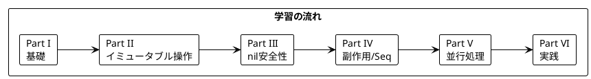

# Grokking Functional Programming 日本語解説（Clojure 版）

本シリーズは「Grokking Functional Programming」（Michał Płachta 著）の学習コンパニオンとして、関数型プログラミングの概念を Clojure で実装しながら日本語で解説します。

---

## 対象読者

- Java や JVM の経験があり、関数型プログラミングに興味がある開発者
- Clojure を学びたいが、FP の概念から理解したい方
- 実践的な FP の適用方法を知りたい JVM エンジニア
- Lisp 系言語に興味がある開発者

---

## 記事一覧

### [Part I: 関数型プログラミングの基礎](part-1.md)

関数型プログラミングの基本概念を学びます。

| 章 | トピック |
|----|----------|
| 第1章 | 命令型 vs 関数型、Clojure 基本構文 |
| 第2章 | 純粋関数、副作用の排除、テストの容易さ |

**キーワード**: 純粋関数、参照透過性、副作用、S式、def/defn

---

### [Part II: 関数型スタイルのプログラミング](part-2.md)

イミュータブルなデータ操作と高階関数を学びます。

| 章 | トピック |
|----|----------|
| 第3章 | イミュータブルデータ、永続データ構造 |
| 第4章 | 高階関数、map/filter/reduce |
| 第5章 | スレッディングマクロ、シーケンス抽象化 |

**キーワード**: イミュータブル、永続データ構造、高階関数、スレッディングマクロ（->、->>）

---

### [Part III: エラーハンドリングと nil 安全性](part-3.md)

型安全なエラーハンドリングを学びます。

| 章 | トピック |
|----|----------|
| 第6章 | nil 処理、some/when、fnil |
| 第7章 | 条件分岐、マルチメソッド、プロトコル |

**キーワード**: nil、some->、条件分岐、マルチメソッド、プロトコル

---

### [Part IV: 副作用の管理とシーケンス処理](part-4.md)

副作用の管理とシーケンス処理を学びます。

| 章 | トピック |
|----|----------|
| 第8章 | 副作用の分離、do、with-open |
| 第9章 | 遅延シーケンス、無限シーケンス、トランスデューサー |

**キーワード**: 副作用、遅延シーケンス、トランスデューサー

---

### [Part V: 並行処理](part-5.md)

関数型プログラミングにおける並行処理を学びます。

| 章 | トピック |
|----|----------|
| 第10章 | atom、ref、agent、STM |
| 第11章 | future、promise、core.async |

**キーワード**: 並行処理、atom、ref、STM、core.async

---

### [Part VI: 実践的なアプリケーション構築とテスト](part-6.md)

実践的なアプリケーション構築とテスト戦略を学びます。

| 章 | トピック |
|----|----------|
| 第12章 | TravelGuide アプリ、コンポーネント、spec |
| 第13章 | テスト戦略、test.check プロパティベーステスト |

**キーワード**: コンポーネント、spec、test.check、REPL 駆動開発

---

## 学習パス



---

## 使用ライブラリ

| ライブラリ | 用途 | 対応章 |
|------------|------|--------|
| Clojure 1.11+ | 言語 | 全章 |
| clojure.spec | データ仕様 | Part III, VI |
| core.async | 非同期処理 | Part V |
| test.check | プロパティベーステスト | Part VI |

---

## リポジトリ構成

```
grokkingfp-examples/
├── app/clojure/src/           # Clojure のサンプルコード
│   ├── ch01/                  # 第1章: イントロダクション
│   ├── ch02/                  # 第2章: 純粋関数
│   ├── ch03/                  # 第3章: イミュータブルデータ
│   ├── ch04/                  # 第4章: 高階関数
│   ├── ch05/                  # 第5章: シーケンス処理
│   ├── ch06/                  # 第6章: nil 処理
│   ├── ch07/                  # 第7章: 条件分岐
│   ├── ch08/                  # 第8章: 副作用
│   ├── ch09/                  # 第9章: 遅延シーケンス
│   ├── ch10/                  # 第10章: 状態管理
│   ├── ch11/                  # 第11章: 並行処理
│   └── ch12/                  # 第12章: テスト
├── app/clojure/test/          # テストコード
└── docs/article/clojure/      # 解説記事（本ディレクトリ）
    ├── index.md               # この記事
    ├── part-1.md              # Part I
    ├── part-2.md              # Part II
    ├── part-3.md              # Part III
    ├── part-4.md              # Part IV
    ├── part-5.md              # Part V
    └── part-6.md              # Part VI
```

---

## Clojure の特徴

Clojure は JVM 上で動作する Lisp 方言であり、関数型プログラミングを強力にサポートします:

### 言語の特徴

| 特徴 | 説明 |
|------|------|
| **Lisp 方言** | S式によるホモイコニシティ（コードがデータ） |
| **イミュータブル** | デフォルトでイミュータブルなデータ構造 |
| **永続データ構造** | 効率的な構造共有による不変コレクション |
| **遅延評価** | シーケンスの遅延評価 |
| **REPL 駆動** | インタラクティブな開発スタイル |
| **JVM 互換** | Java ライブラリとの完全な相互運用 |
| **STM** | Software Transactional Memory による並行処理 |

### Scala との比較

| 概念 | Scala | Clojure |
|------|-------|---------|
| 言語パラダイム | マルチパラダイム（静的型付け） | 関数型（動的型付け） |
| 実行環境 | JVM | JVM |
| Option 型 | `Option[A]` | `nil` + `some->` |
| Either/Result | `Either[E, A]` | 例外 または マップ |
| ADT | `sealed trait` + `case class` | マップ + マルチメソッド |
| for 内包表記 | `for { ... } yield` | `for` マクロ |
| パイプライン | メソッドチェーン | `->` `->>` マクロ |
| 非同期 | `IO[A]` (cats-effect) | `future` / `core.async` |
| ストリーム | `fs2.Stream` | 遅延シーケンス / トランスデューサー |
| 可変状態 | `Ref[IO, A]` | `atom` / `ref` |

### Haskell との比較

| 概念 | Haskell | Clojure |
|------|---------|---------|
| 型システム | 静的・強い型付け | 動的型付け |
| 純粋性 | 型で保証 | 慣習で分離 |
| モナド | 型クラス | なし（マクロで代替） |
| 遅延評価 | デフォルト | シーケンスのみ |
| パターンマッチ | 言語機能 | `core.match` ライブラリ |
| STM | `TVar` | `ref` + `dosync` |

---

## 関数型プログラミングの利点

本シリーズを通じて、以下の利点を実感できます:

1. **予測可能性** - 純粋関数は同じ入力に対して常に同じ出力
2. **テスト容易性** - 副作用がないためテストが簡単
3. **合成可能性** - 小さな関数を組み合わせて複雑な処理を構築
4. **並行安全性** - イミュータブルデータは競合状態を防ぐ
5. **REPL 駆動開発** - インタラクティブな開発で素早いフィードバック

---

## Clojure の基本構文

### S式（S-expression）

```clojure
; 関数呼び出し: (関数 引数1 引数2 ...)
(+ 1 2 3)        ; => 6
(str "Hello" " " "World")  ; => "Hello World"

; 関数定義
(defn greet [name]
  (str "Hello, " name "!"))

(greet "Clojure")  ; => "Hello, Clojure!"
```

### データ構造

```clojure
; リスト（連結リスト）
'(1 2 3)

; ベクター（インデックスアクセス可能）
[1 2 3]

; マップ（キー・値ペア）
{:name "Alice" :age 30}

; セット（重複なし）
#{1 2 3}
```

### スレッディングマクロ

```clojure
; -> (thread-first): 最初の引数に挿入
(-> 5
    (+ 3)      ; (+ 5 3)
    (* 2))     ; (* 8 2) => 16

; ->> (thread-last): 最後の引数に挿入
(->> [1 2 3 4 5]
     (filter odd?)    ; (filter odd? [1 2 3 4 5])
     (map inc))       ; (map inc '(1 3 5)) => (2 4 6)
```

---

## 参考資料

- [Grokking Functional Programming](https://www.manning.com/books/grokking-functional-programming) - 原著
- [Clojure 公式サイト](https://clojure.org/)
- [ClojureDocs](https://clojuredocs.org/) - 関数リファレンス
- [Clojure for the Brave and True](https://www.braveclojure.com/) - 無料オンライン書籍
- [core.async ガイド](https://clojure.org/guides/async)
- [clojure.spec ガイド](https://clojure.org/guides/spec)
