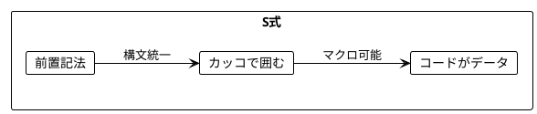
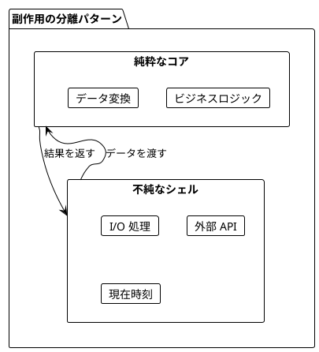

# Part I: 関数型プログラミングの基礎（Clojure 版）

本章では、関数型プログラミングの基本概念を Clojure で学びます。

---

## 第1章: Clojure イントロダクション

### 1.1 命令型 vs 関数型

#### 命令型スタイル（非推奨）

```clojure
;; 可変状態を使用した命令型スタイル
(defn imperative-sum [numbers]
  (let [result (atom 0)]
    (doseq [n numbers]
      (swap! result + n))
    @result))

(imperative-sum [1 2 3 4 5])  ; => 15
```

#### 関数型スタイル（推奨）

```clojure
;; 関数型スタイル：宣言的で簡潔
(defn functional-sum [numbers]
  (reduce + 0 numbers))

(functional-sum [1 2 3 4 5])  ; => 15
```

**関数型スタイルの利点：**

| 観点 | 命令型 | 関数型 |
|------|--------|--------|
| 状態管理 | 可変状態の追跡が必要 | 状態なし |
| テスト | セットアップが複雑 | 入出力のみ確認 |
| 並行処理 | 競合状態に注意 | 安全 |
| コード量 | 多い | 少ない |

---

### 1.2 S式（S-expression）

Clojure は Lisp 方言であり、コードは S式で表現されます。

```clojure
;; S式の基本構文: (関数 引数1 引数2 ...)
(+ 1 2 3)           ; => 6
(* 2 (+ 3 4))       ; => 14
(str "Hello" " " "World")  ; => "Hello World"
```

**S式の特徴：**



---

### 1.3 基本構文

#### 定数定義（def）

```clojure
;; 値の定義
(def greeting "Hello, Clojure!")
(def pi 3.14159)
(def languages ["Scala" "Java" "Clojure" "Haskell"])

greeting    ; => "Hello, Clojure!"
pi          ; => 3.14159
languages   ; => ["Scala" "Java" "Clojure" "Haskell"]
```

#### 関数定義（defn）

```clojure
;; 基本的な関数定義
(defn greet
  "名前を受け取って挨拶を返す"
  [name]
  (str "Hello, " name "!"))

(greet "World")  ; => "Hello, World!"

;; 複数引数
(defn add [a b]
  (+ a b))

(add 2 3)  ; => 5
```

#### 複数アリティ関数

```clojure
;; 同じ関数名で異なる引数の数に対応
(defn greet-multi
  ([] (greet-multi "World"))
  ([name] (str "Hello, " name "!"))
  ([title name] (str "Hello, " title " " name "!")))

(greet-multi)              ; => "Hello, World!"
(greet-multi "Alice")      ; => "Hello, Alice!"
(greet-multi "Dr." "Smith") ; => "Hello, Dr. Smith!"
```

---

### 1.4 ローカル束縛（let）

```clojure
;; let によるローカル変数
(defn calculate-area [radius]
  (let [pi 3.14159
        r-squared (* radius radius)]
    (* pi r-squared)))

(calculate-area 2)  ; => 12.56636

;; ネストした let
(defn format-name [first-name last-name]
  (let [full-name (str first-name " " last-name)
        upper-name (clojure.string/upper-case full-name)]
    {:full full-name
     :upper upper-name
     :initials (str (first first-name) "." (first last-name) ".")}))

(format-name "John" "Doe")
; => {:full "John Doe", :upper "JOHN DOE", :initials "J.D."}
```

---

### 1.5 データ構造

Clojure のコアデータ構造はすべてイミュータブル（不変）です。

#### リスト（List）

```clojure
;; リスト（連結リスト）- 先頭への追加が O(1)
'(1 2 3 4 5)

;; リストの操作
(first '(1 2 3))   ; => 1
(rest '(1 2 3))    ; => (2 3)
(cons 0 '(1 2 3))  ; => (0 1 2 3)
```

#### ベクター（Vector）

```clojure
;; ベクター - インデックスアクセスが高速
[1 2 3 4 5]

;; ベクターの操作
(nth [1 2 3] 1)      ; => 2
(get [1 2 3] 1)      ; => 2
(conj [1 2 3] 4)     ; => [1 2 3 4]
([1 2 3] 0)          ; => 1 （ベクターは関数としても使える）
```

#### マップ（Map）

```clojure
;; マップ（キー・値ペア）
(def person {:name "Alice"
             :age 30
             :city "Tokyo"})

;; マップの操作
(:name person)           ; => "Alice"
(get person :name)       ; => "Alice"
(assoc person :email "alice@example.com")
; => {:name "Alice", :age 30, :city "Tokyo", :email "alice@example.com"}
```

#### セット（Set）

```clojure
;; セット（重複なし）
#{1 2 3 4 5}

;; セットの操作
(contains? #{1 2 3} 2)   ; => true
(conj #{1 2 3} 4)        ; => #{1 4 3 2}
(disj #{1 2 3} 2)        ; => #{1 3}
```

#### データ構造の比較

| 構造 | 追加位置 | アクセス | 用途 |
|------|----------|----------|------|
| リスト | 先頭 O(1) | 線形 O(n) | スタック、再帰処理 |
| ベクター | 末尾 O(1)* | インデックス O(log32 n) | 配列的用途 |
| マップ | キー指定 | キー検索 O(log32 n) | 連想データ |
| セット | 値追加 | 存在確認 O(log32 n) | 重複排除、集合演算 |

*厳密には O(log32 n) だが、実質的に定数時間

---

### 1.6 条件分岐

#### if

```clojure
;; 基本的な if
(if (> 5 3)
  "5 is greater"
  "3 is greater")
; => "5 is greater"
```

#### cond

```clojure
;; 複数条件の分岐
(defn check-age [age]
  (cond
    (< age 0) "Invalid age"
    (< age 13) "Child"
    (< age 20) "Teenager"
    (< age 65) "Adult"
    :else "Senior"))

(check-age 25)  ; => "Adult"
```

#### if-let と when-let

```clojure
;; nil チェックと束縛を同時に
(defn greet-optional [person]
  (if-let [name (:name person)]
    (str "Hello, " name "!")
    "Hello, stranger!"))

(greet-optional {:name "Alice"})  ; => "Hello, Alice!"
(greet-optional {})               ; => "Hello, stranger!"
```

---

### 1.7 ループと再帰

#### loop/recur（末尾再帰）

```clojure
;; 末尾再帰による階乗
(defn factorial [n]
  (loop [i n
         acc 1]
    (if (<= i 1)
      acc
      (recur (dec i) (* acc i)))))

(factorial 5)   ; => 120
(factorial 10)  ; => 3628800
```

#### reduce による集約

```clojure
;; reduce は最も汎用的なループ構造
(defn sum-of-squares [numbers]
  (reduce (fn [acc n] (+ acc (* n n))) 0 numbers))

(sum-of-squares [1 2 3])  ; => 14 (1 + 4 + 9)
```

---

### 1.8 実践例：ショッピングカート

```clojure
;; サンプルカート
(def sample-cart
  [{:name "Apple" :price 100 :quantity 3}
   {:name "Banana" :price 80 :quantity 5}
   {:name "Orange" :price 120 :quantity 2}])

;; アイテムの小計
(defn item-total [item]
  (* (:price item) (:quantity item)))

;; カートの合計
(defn cart-total [cart]
  (reduce + (map item-total cart)))

;; 割引適用
(defn apply-discount [total discount-rate]
  (let [discount (* total discount-rate)]
    (- total discount)))

;; チェックアウト
(defn checkout [cart discount-rate]
  (let [subtotal (cart-total cart)
        total (apply-discount subtotal discount-rate)]
    {:subtotal subtotal
     :discount-rate discount-rate
     :discount (* subtotal discount-rate)
     :total total}))

(checkout sample-cart 0.1)
; => {:subtotal 940, :discount-rate 0.1, :discount 94.0, :total 846.0}
```

---

## 第2章: 純粋関数

### 2.1 純粋関数とは

純粋関数は以下の条件を満たします：

1. **決定性**: 同じ入力に対して常に同じ出力を返す
2. **副作用なし**: 外部状態を変更しない

```clojure
;; 純粋関数の例
(defn add [a b]
  (+ a b))

(defn square [n]
  (* n n))

;; 何度呼んでも同じ結果
(add 2 3)    ; => 5
(add 2 3)    ; => 5
(square 4)   ; => 16
(square 4)   ; => 16
```

---

### 2.2 参照透過性

参照透過性とは、式をその結果で置き換えてもプログラムの動作が変わらない性質です。

```clojure
(defn referential-transparency-demo []
  (let [x (+ 1 2)    ; x = 3
        y (* x 3)    ; y = 9
        z (+ x y)]   ; z = 12
    ;; 以下は同じ結果
    {:using-names z
     :using-values (+ 3 9)}))

;; x と y を直接値で置き換えても同じ
```

---

### 2.3 不純な関数の問題

#### グローバル状態への依存

```clojure
;; 不純：グローバル状態に依存
(def ^:dynamic *tax-rate* 0.1)

(defn impure-calculate-tax [amount]
  (* amount *tax-rate*))

;; 結果が外部状態に依存する
(impure-calculate-tax 1000)  ; => 100.0

(binding [*tax-rate* 0.2]
  (impure-calculate-tax 1000))  ; => 200.0
```

#### 純粋なバージョン

```clojure
;; 純粋：税率を引数として受け取る
(defn pure-calculate-tax [amount tax-rate]
  (* amount tax-rate))

;; 結果は入力のみに依存
(pure-calculate-tax 1000 0.1)  ; => 100.0
(pure-calculate-tax 1000 0.2)  ; => 200.0
```

---

### 2.4 副作用の分離



```clojure
;; 副作用を持つ部分
(defn get-current-hour []
  (.getHour (java.time.LocalTime/now)))

;; 純粋なコアロジック
(defn pure-greeting [name hour]
  (str (cond
         (< hour 12) "Good morning"
         (< hour 18) "Good afternoon"
         :else "Good evening")
       ", " name "!"))

;; 副作用を含むラッパー
(defn create-greeting [name]
  (pure-greeting name (get-current-hour)))
```

---

### 2.5 実践例：給与計算システム

```clojure
;; 税率定義
(def tax-rates
  {:income 0.20
   :social 0.10
   :health 0.05})

;; 純粋関数：総支給額
(defn calculate-gross-salary [base-salary overtime-hours hourly-rate]
  (+ base-salary (* overtime-hours hourly-rate)))

;; 純粋関数：控除計算
(defn calculate-deductions [gross-salary rates]
  (let [income-tax (* gross-salary (:income rates))
        social (* gross-salary (:social rates))
        health (* gross-salary (:health rates))]
    {:income-tax income-tax
     :social social
     :health health
     :total (+ income-tax social health)}))

;; 純粋関数：手取り計算
(defn calculate-net-salary [gross-salary deductions]
  (- gross-salary (:total deductions)))

;; 純粋関数：給与計算全体
(defn process-payroll [employee rates]
  (let [gross (calculate-gross-salary
               (:base-salary employee)
               (:overtime-hours employee 0)
               (:hourly-rate employee 0))
        deductions (calculate-deductions gross rates)
        net (calculate-net-salary gross deductions)]
    {:employee-id (:id employee)
     :gross-salary gross
     :deductions deductions
     :net-salary net}))

;; 使用例
(process-payroll
  {:id 1 :base-salary 300000 :overtime-hours 10 :hourly-rate 1000}
  tax-rates)
; => {:employee-id 1,
;     :gross-salary 310000,
;     :deductions {:income-tax 62000.0, :social 31000.0, :health 15500.0, :total 108500.0},
;     :net-salary 201500.0}
```

---

### 2.6 文字列処理

```clojure
;; 純粋関数による文字列処理
(defn normalize-string [s]
  (-> s
      clojure.string/trim
      clojure.string/lower-case))

(defn count-words [s]
  (if (clojure.string/blank? s)
    0
    (count (clojure.string/split (clojure.string/trim s) #"\s+"))))

(defn word-frequencies [s]
  (frequencies (clojure.string/split (normalize-string s) #"\s+")))

(word-frequencies "Hello World hello")
; => {"hello" 2, "world" 1}
```

---

### 2.7 データバリデーション

```clojure
;; バリデーション関数群
(defn validate-not-empty [field-name value]
  (if (clojure.string/blank? value)
    {:valid false :error (str field-name " cannot be empty")}
    {:valid true :value value}))

(defn validate-email-format [email]
  (if (re-matches #".+@.+\..+" email)
    {:valid true :value email}
    {:valid false :error "Invalid email format"}))

(defn validate-age [age]
  (cond
    (not (integer? age)) {:valid false :error "Age must be an integer"}
    (neg? age) {:valid false :error "Age cannot be negative"}
    (> age 150) {:valid false :error "Age seems unrealistic"}
    :else {:valid true :value age}))

;; ユーザーバリデーション
(defn validate-user [user]
  (let [name-result (validate-not-empty "Name" (:name user ""))
        email-result (validate-email-format (:email user ""))
        age-result (validate-age (:age user))]
    (if (and (:valid name-result)
             (:valid email-result)
             (:valid age-result))
      {:valid true :user user}
      {:valid false
       :errors (remove nil?
                 [(when-not (:valid name-result) (:error name-result))
                  (when-not (:valid email-result) (:error email-result))
                  (when-not (:valid age-result) (:error age-result))])})))

(validate-user {:name "Alice" :email "alice@example.com" :age 30})
; => {:valid true, :user {:name "Alice", :email "alice@example.com", :age 30}}

(validate-user {:name "" :email "invalid" :age -1})
; => {:valid false, :errors ("Name cannot be empty" "Invalid email format" "Age cannot be negative")}
```

---

### 2.8 コンポジション

#### スレッディングマクロ

```clojure
;; -> (thread-first): 最初の引数位置に挿入
(-> 5
    (+ 3)      ; (+ 5 3)
    (* 2))     ; (* 8 2) => 16

;; ->> (thread-last): 最後の引数位置に挿入
(->> [1 2 3 4 5]
     (filter odd?)    ; (filter odd? [1 2 3 4 5])
     (map inc))       ; (map inc '(1 3 5)) => (2 4 6)
```

#### comp による関数合成

```clojure
;; comp は右から左に適用
(def process-string
  (comp clojure.string/upper-case
        clojure.string/trim
        clojure.string/reverse))

(process-string "  hello  ")  ; => "OLLEH"
```

#### partial による部分適用

```clojure
;; partial で引数を固定
(def add-ten (partial + 10))
(def multiply-by-two (partial * 2))

(add-ten 5)          ; => 15
(multiply-by-two 5)  ; => 10
```

---

### 2.9 統計計算

```clojure
;; 純粋関数による統計計算
(defn sum-all [numbers]
  (reduce + 0 numbers))

(defn average [numbers]
  (if (empty? numbers)
    0
    (/ (sum-all numbers) (count numbers))))

(defn statistics [numbers]
  (if (empty? numbers)
    {:count 0 :sum 0 :average 0 :min nil :max nil}
    {:count (count numbers)
     :sum (sum-all numbers)
     :average (average numbers)
     :min (apply min numbers)
     :max (apply max numbers)}))

(statistics [1 2 3 4 5])
; => {:count 5, :sum 15, :average 3, :min 1, :max 5}
```

---

## まとめ

### 学んだ概念

| 概念 | 説明 | Clojure での表現 |
|------|------|------------------|
| S式 | Lisp のコード表現 | `(関数 引数...)` |
| 関数定義 | 名前付き関数 | `defn` |
| ローカル束縛 | 一時的な値の束縛 | `let` |
| 純粋関数 | 副作用のない関数 | 引数のみに依存 |
| 参照透過性 | 式と値の置換可能性 | 外部状態への非依存 |
| コンポジション | 関数の組み合わせ | `->`, `->>`, `comp` |

### Scala との比較

| 概念 | Scala | Clojure |
|------|-------|---------|
| 関数定義 | `def f(x: Int) = ...` | `(defn f [x] ...)` |
| 無名関数 | `x => x + 1` | `#(+ % 1)` または `(fn [x] (+ x 1))` |
| パイプライン | `.map().filter()` | `(->> coll (map f) (filter p))` |
| 部分適用 | `f(1, _)` | `(partial f 1)` |
| 合成 | `f andThen g` | `(comp g f)` |

### 次のステップ

[Part II: 関数型スタイルのプログラミング](part-2.md) では、以下を学びます：

- イミュータブルデータの深堀り
- 永続データ構造
- 高階関数の活用（map、filter、reduce）
- スレッディングマクロの応用
