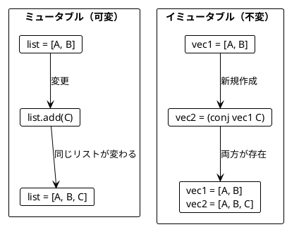
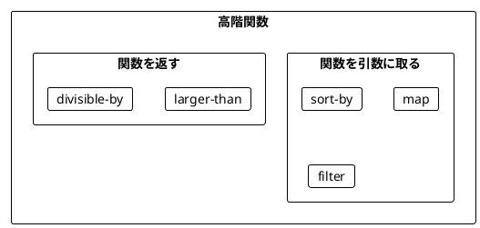
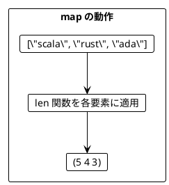
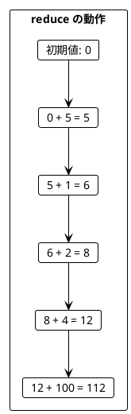
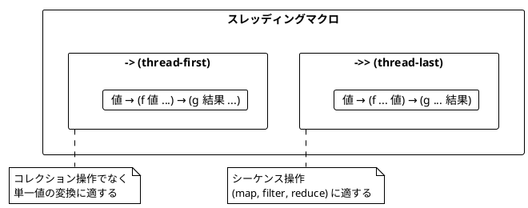
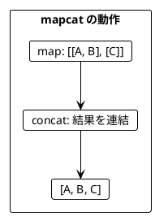
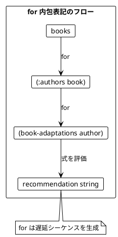

# Part II: 関数型スタイルのプログラミング（Clojure 版）

本章では、関数型プログラミングの核心となるテクニックを学びます。イミュータブルなデータ操作、高階関数、そして `mapcat` による複雑なデータ変換を習得します。

---

## 第3章: イミュータブルなデータ操作

### 3.1 イミュータブルとは

イミュータブル（不変）とは、一度作成されたデータが変更されないことを意味します。Clojure のデータ構造はデフォルトでイミュータブルです。

```clojure
;; 元のベクター
(def original [1 2 3])

;; conj で要素を追加しても元のベクターは変わらない
(def new-vec (conj original 4))

original  ; => [1 2 3]
new-vec   ; => [1 2 3 4]
```



### 3.2 永続データ構造

Clojure の永続データ構造は「構造共有」を使用します。新しいバージョンを作成しても、変わっていない部分はメモリを共有します。

```clojure
;; 大きなベクターでも効率的
(def large-vec (vec (range 1000000)))
(def modified (assoc large-vec 500000 :replaced))

;; 変更されていない部分はメモリを共有
```

### 3.3 ベクターの基本操作

```clojure
;; 要素の追加（末尾）
(conj [1 2 3] 4)          ; => [1 2 3 4]

;; 複数要素の追加
(into [1 2] [3 4 5])      ; => [1 2 3 4 5]

;; スライス操作
(subvec [0 1 2 3 4] 1 3)  ; => [1 2]

;; 最初の n 要素
(take 2 [1 2 3 4 5])      ; => (1 2)

;; 最後の n 要素
(take-last 2 [1 2 3 4 5]) ; => (4 5)
```

### 3.4 リスト変換パターン

```clojure
;; 最初の2要素を末尾に移動
(defn move-first-two-to-end [coll]
  (let [first-two (take 2 coll)
        rest-items (drop 2 coll)]
    (into (vec rest-items) first-two)))

(move-first-two-to-end ["a" "b" "c" "d"])
; => ["c" "d" "a" "b"]

;; 指定位置に挿入
(defn insert-at [coll index element]
  (let [before (take index coll)
        after (drop index coll)]
    (into (conj (vec before) element) after)))

(insert-at ["a" "b" "c"] 1 "x")
; => ["a" "x" "b" "c"]
```

### 3.5 旅程の再計画

```clojure
(defn replan [plan new-city before-city]
  (let [index (.indexOf (vec plan) before-city)
        cities-before (take index plan)
        cities-after (drop index plan)]
    (into (conj (vec cities-before) new-city) cities-after)))

(def plan-a ["Paris" "Berlin" "Kraków"])
(def plan-b (replan plan-a "Vienna" "Kraków"))

plan-b  ; => ["Paris" "Berlin" "Vienna" "Kraków"]
plan-a  ; => ["Paris" "Berlin" "Kraków"]（変わっていない）
```

### 3.6 マップの操作

```clojure
;; 値の更新
(def person {:name "Alice" :age 30})

(assoc person :age 31)
; => {:name "Alice", :age 31}

;; 関数で更新
(update person :age inc)
; => {:name "Alice", :age 31}

;; フィールドの削除
(dissoc person :age)
; => {:name "Alice"}

;; ネストした更新
(def data {:user {:profile {:name "Bob"}}})
(update-in data [:user :profile :name] clojure.string/upper-case)
; => {:user {:profile {:name "BOB"}}}
```

---

## 第4章: 関数を値として扱う

### 4.1 高階関数とは

高階関数（Higher-Order Function）とは、以下のいずれかを満たす関数です：

1. 関数を引数として受け取る
2. 関数を戻り値として返す

Clojure では関数はファーストクラスの値です。



### 4.2 map - 各要素を変換

```clojure
;; 関数を定義
(defn len [s] (count s))

;; map で各要素に適用
(map len ["scala" "rust" "ada"])
; => (5 4 3)

;; 無名関数を使用
(map #(* 2 %) [5 1 2 4 0])
; => (10 2 4 8 0)

;; 2乗
(map #(* % %) [1 2 3 4 5])
; => (1 4 9 16 25)
```



### 4.3 filter - 条件に合う要素を抽出

```clojure
;; 奇数のみ
(filter odd? [5 1 2 4 0])
; => (5 1)

;; 4より大きい
(filter #(> % 4) [5 1 2 4 0])
; => (5)

;; 偶数のみ
(filter even? [1 2 3 4 5 6])
; => (2 4 6)
```

### 4.4 reduce - 畳み込み

```clojure
;; 合計
(reduce + 0 [5 1 2 4 100])
; => 112

;; 最大値
(reduce (fn [max-val n]
          (if (> n max-val) n max-val))
        Integer/MIN_VALUE
        [5 1 2 4 15])
; => 15

;; 積
(reduce * 1 [1 2 3 4 5])
; => 120
```



### 4.5 sort-by - ソート基準を関数で指定

```clojure
(defn score [word]
  (count (clojure.string/replace word "a" "")))

(sort-by score ["rust" "java"])
; => ("java" "rust")
;; java: 2文字 (j, v), rust: 4文字 (r, u, s, t)
```

### 4.6 関数を返す関数

```clojure
(defn larger-than [n]
  (fn [i] (> i n)))

(filter (larger-than 4) [5 1 2 4 0])
; => (5)

(filter (larger-than 1) [5 1 2 4 0])
; => (5 2 4)

;; 範囲判定
(defn between [min-val max-val]
  (fn [i] (and (>= i min-val) (<= i max-val))))

(filter (between 2 5) [1 2 3 4 5 6])
; => (2 3 4 5)
```

### 4.7 部分適用（partial）

```clojure
(def add-10 (partial + 10))
(def multiply-by-2 (partial * 2))

(add-10 5)         ; => 15
(multiply-by-2 5)  ; => 10

(map (partial + 100) [1 2 3])
; => (101 102 103)
```

### 4.8 関数合成（comp）

```clojure
;; comp は右から左に関数を適用
(def process-number
  (comp (partial + 10) (partial * 2)))

(process-number 5)  ; => 20 (5*2=10, 10+10=20)

(def normalize-name
  (comp clojure.string/capitalize
        clojure.string/trim
        clojure.string/lower-case))

(normalize-name "  JOHN DOE  ")
; => "John doe"
```

### 4.9 スレッディングマクロ

Clojure のスレッディングマクロは、データの変換パイプラインを読みやすく書けます。

```clojure
;; -> (thread-first): 前の結果を最初の引数として挿入
(-> "  Hello World  "
    clojure.string/trim
    clojure.string/lower-case
    (clojure.string/replace #"\s+" "-"))
; => "hello-world"

;; ->> (thread-last): 前の結果を最後の引数として挿入
(->> [1 2 3 4 5]
     (filter odd?)
     (map #(* % %))
     (reduce +))
; => 35 (1 + 9 + 25)
```



### 4.10 ワードスコアリングの例

```clojure
(defn score [word]
  (count (clojure.string/replace word "a" "")))

(defn bonus [word]
  (if (clojure.string/includes? word "c") 5 0))

(defn penalty [word]
  (if (clojure.string/includes? word "s") 7 0))

(defn ranked-words [word-scorer words]
  (reverse (sort-by word-scorer words)))

(def words ["ada" "haskell" "scala" "java" "rust"])

;; 基本スコアでランキング
(ranked-words score words)
; => ("haskell" "rust" "scala" "java" "ada")

;; ボーナス付きスコアでランキング
(ranked-words #(+ (score %) (bonus %)) words)
; => ("scala" "haskell" "rust" "java" "ada")
```

---

## 第5章: mapcat とネスト構造

### 5.1 flatten - ネストを平坦化

```clojure
;; flatten は完全に平坦化
(flatten [[1 2] [3 4] [5]])
; => (1 2 3 4 5)

(flatten [[[1 2] [3]] [[4 5]]])
; => (1 2 3 4 5)

;; apply concat は1レベルだけ平坦化
(apply concat [[1 2] [3 4]])
; => (1 2 3 4)
```

### 5.2 mapcat = map + concat

`mapcat` は Scala の `flatMap` に相当します。

```clojure
(def books
  [{:title "FP in Scala" :authors ["Chiusano" "Bjarnason"]}
   {:title "The Hobbit" :authors ["Tolkien"]}])

;; map だけだとネストする
(map :authors books)
; => (["Chiusano" "Bjarnason"] ["Tolkien"])

;; mapcat で平坦化
(mapcat :authors books)
; => ("Chiusano" "Bjarnason" "Tolkien")
```



### 5.3 mapcat によるサイズ変化

```clojure
;; 要素数が増える
(mapcat (fn [x] [x x]) [1 2 3])
; => (1 1 2 2 3 3)

;; 要素数が同じ
(mapcat (fn [x] [(* 2 x)]) [1 2 3])
; => (2 4 6)

;; 要素数が減る（フィルタリング効果）
(mapcat (fn [x] (if (even? x) [x] [])) [1 2 3 4 5])
; => (2 4)
```

### 5.4 ネストした mapcat

```clojure
(defn book-adaptations [author]
  (case author
    "Tolkien" [{:title "An Unexpected Journey"}
               {:title "The Desolation of Smaug"}]
    []))

;; ネストした mapcat
(mapcat
  (fn [book]
    (mapcat
      (fn [author]
        (map
          (fn [movie]
            (str "You may like " (:title movie)
                 ", because you liked " author "'s " (:title book)))
          (book-adaptations author)))
      (:authors book)))
  books)
```

### 5.5 for 内包表記

Clojure の `for` は Scala の for 内包表記に相当します。

```clojure
;; ネストした mapcat と等価
(for [book books
      author (:authors book)
      movie (book-adaptations author)]
  (str "You may like " (:title movie)
       ", because you liked " author "'s " (:title book)))
; => ("You may like An Unexpected Journey, because you liked Tolkien's The Hobbit"
;     "You may like The Desolation of Smaug, because you liked Tolkien's The Hobbit")
```



### 5.6 ガード式（:when）

```clojure
;; :when でフィルタリング
(for [x (range 1 4)
      y (range 1 4)
      :let [product (* x y)]
      :when (even? product)]
  {:x x :y y :product product})
; => ({:x 1 :y 2 :product 2} {:x 2 :y 1 :product 2} ...)
```

### 5.7 円内の点の判定

```clojure
(defn inside? [point radius]
  (<= (+ (* (:x point) (:x point))
         (* (:y point) (:y point)))
      (* radius radius)))

(def points [{:x 5 :y 2} {:x 1 :y 1}])
(def radiuses [2 1])

;; すべての組み合わせを生成
(for [r radiuses
      point points]
  {:point point
   :radius r
   :inside? (inside? point r)})

;; 円内の点のみ
(for [r radiuses
      point points
      :when (inside? point r)]
  {:point point :radius r})
; => ({:point {:x 1, :y 1}, :radius 2})
```

### 5.8 for と型

`for` は常に遅延シーケンスを返します。型を変換するには `into` を使います。

```clojure
;; ベクターに変換
(into [] (for [x [1 2] y [3 4]] (* x y)))
; => [3 4 6 8]

;; セットに変換（重複が除かれる）
(into #{} (for [x [1 2] y [3 4]] (* x y)))
; => #{3 4 6 8}
```

### 5.9 実践例：商品検索

```clojure
(def products
  [{:id 1 :name "Laptop" :category :electronics :price 1000
    :tags ["computer" "portable" "work"]}
   {:id 2 :name "Phone" :category :electronics :price 800
    :tags ["mobile" "portable"]}
   {:id 3 :name "Desk" :category :furniture :price 300
    :tags ["office" "work"]}])

;; 条件で検索
(for [product products
      :when (and (>= (:price product) 500)
                 (= (:category product) :electronics))]
  product)

;; 商品とタグのペアを生成
(for [product products
      tag (:tags product)]
  {:product-name (:name product) :tag tag})
```

---

## まとめ

### Part II で学んだこと

| 章 | 主要概念 | キー操作 |
|----|----------|----------|
| 第3章 | イミュータブル | `conj`, `into`, `assoc`, `update` |
| 第4章 | 高階関数 | `map`, `filter`, `reduce`, `sort-by` |
| 第5章 | 平坦化 | `flatten`, `mapcat`, `for` 内包表記 |

### Scala との比較

| 概念 | Scala | Clojure |
|------|-------|---------|
| リスト追加 | `list :+ elem` | `(conj vec elem)` |
| スライス | `list.slice(a, b)` | `(subvec vec a b)` |
| map | `list.map(f)` | `(map f coll)` |
| filter | `list.filter(p)` | `(filter p coll)` |
| foldLeft | `list.foldLeft(init)(f)` | `(reduce f init coll)` |
| flatMap | `list.flatMap(f)` | `(mapcat f coll)` |
| for 内包表記 | `for { x <- xs } yield x` | `(for [x xs] x)` |

### キーポイント

1. **イミュータブルデータ**: 元のデータは変更せず、新しいデータを作成
2. **構造共有**: 永続データ構造により効率的なメモリ使用
3. **関数は値**: 関数を引数として渡したり、戻り値として返せる
4. **スレッディングマクロ**: `->` と `->>` でパイプライン処理
5. **mapcat パターン**: ネストした構造を平坦化しながら変換
6. **for 内包表記**: 宣言的なシーケンス生成

### 次のステップ

[Part III: エラーハンドリング](part-3.md) では、以下を学びます：

- `nil` の扱いと `some?`/`nil?`
- `some->` と `some->>` マクロ
- 結果型パターン（`:ok`/`:error`）
- `ex-info` と例外処理
