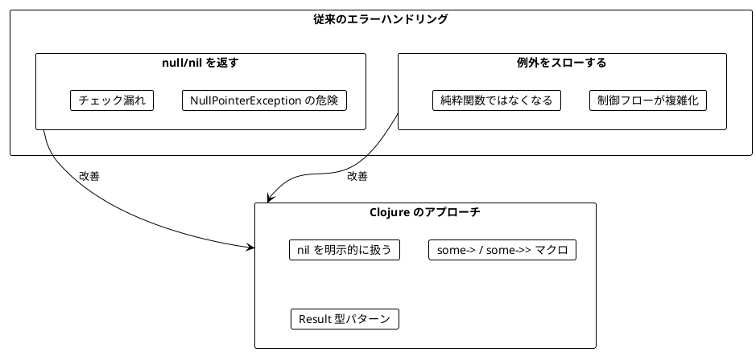
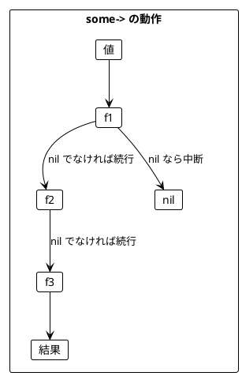
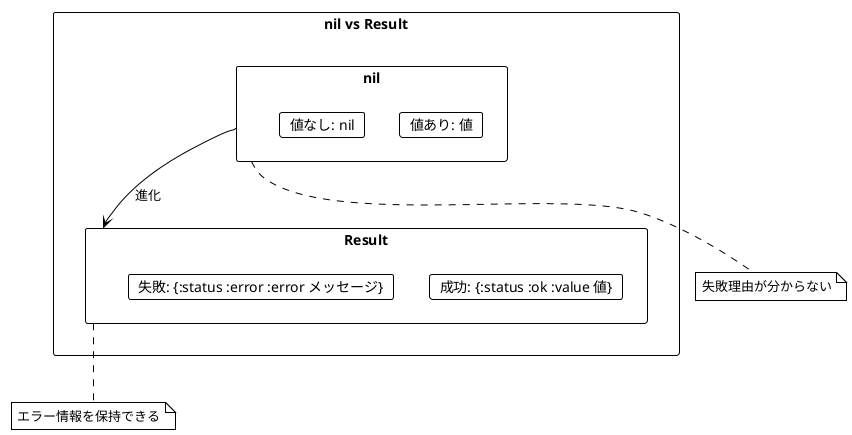
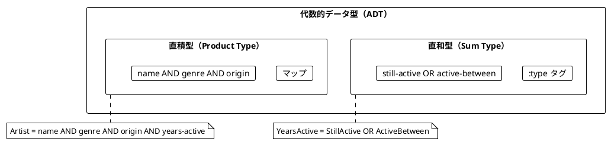

# Part III: エラーハンドリング（Clojure 版）

本章では、Clojure における安全なエラーハンドリングを学びます。`nil` の扱い、Result 型パターン、そして代数的データ型（ADT）を習得します。

---

## 第6章: nil と安全なエラーハンドリング

### 6.1 なぜ安全なエラーハンドリングが必要か

従来のエラーハンドリングには問題があります。



### 6.2 nil の基本

Clojure では `nil` が「値がない」ことを表します。

```clojure
;; nil チェック
(some? 42)    ; => true
(some? nil)   ; => false
(nil? nil)    ; => true
(nil? 42)     ; => false

;; nil は false 扱い（falsy）
(if nil "truthy" "falsy")  ; => "falsy"
(if 0 "truthy" "falsy")    ; => "truthy" (0 は truthy)
```

### 6.3 安全な関数

```clojure
;; 安全な除算
(defn safe-divide [a b]
  (when-not (zero? b)
    (/ a b)))

(safe-divide 10 2)  ; => 5
(safe-divide 10 0)  ; => nil

;; 安全な平方根
(defn safe-sqrt [n]
  (when (>= n 0)
    (Math/sqrt n)))

(safe-sqrt 4)   ; => 2.0
(safe-sqrt -1)  ; => nil
```

### 6.4 some-> と some->> マクロ

`some->` は途中で `nil` になったら処理を中断します。Scala の `Option.flatMap` のチェーンに相当します。

```clojure
;; some-> : 最初の引数位置に挿入、nil で中断
(some-> {:user {:profile {:name "Alice"}}}
        :user
        :profile
        :name)
; => "Alice"

(some-> {:user {:profile {}}}
        :user
        :profile
        :name)
; => nil （:name がないので nil）

;; some->> : 最後の引数位置に挿入
(some->> [1 -2 3 -4 5]
         (filter pos?)
         seq
         (reduce +))
; => 9
```



### 6.5 TV番組パースの例

TV番組の文字列をパースする例で、nil の扱いを学びます。

```clojure
;; TV番組のデータ構造
(defn tv-show [title start end]
  {:title title :start start :end end})

;; 文字列を整数にパース（失敗時は nil）
(defn parse-int [s]
  (try
    (Integer/parseInt (clojure.string/trim s))
    (catch Exception _ nil)))

;; 名前を抽出
(defn extract-name [raw-show]
  (when-let [bracket-open (.indexOf raw-show "(")]
    (when (pos? bracket-open)
      (clojure.string/trim (subs raw-show 0 bracket-open)))))

(extract-name "Breaking Bad (2008-2013)")
; => "Breaking Bad"

(extract-name "No Brackets")
; => nil
```

### 6.6 when-let と if-let

```clojure
;; when-let: 値があれば処理
(defn greet-user [user]
  (if-let [name (:name user)]
    (str "Hello, " name "!")
    "Hello, Guest!"))

(greet-user {:name "Alice"})  ; => "Hello, Alice!"
(greet-user {})               ; => "Hello, Guest!"

;; when-let: 条件を満たす場合のみ処理（else なし）
(defn process-order [order]
  (when-let [items (:items order)]
    (when (seq items)
      {:order-id (:id order)
       :total (reduce + (map :price items))})))
```

### 6.7 TV番組パース（完全版）

```clojure
;; 開始年を抽出
(defn extract-year-start [raw-show]
  (let [bracket-open (.indexOf raw-show "(")
        dash (.indexOf raw-show "-")]
    (when (and (>= bracket-open 0) (> dash (inc bracket-open)))
      (parse-int (subs raw-show (inc bracket-open) dash)))))

;; 終了年を抽出
(defn extract-year-end [raw-show]
  (let [dash (.indexOf raw-show "-")
        bracket-close (.indexOf raw-show ")")]
    (when (and (>= dash 0) (> bracket-close (inc dash)))
      (parse-int (subs raw-show (inc dash) bracket-close)))))

;; 単年を抽出（"Chernobyl (2019)" 形式）
(defn extract-single-year [raw-show]
  (let [dash (.indexOf raw-show "-")
        bracket-open (.indexOf raw-show "(")
        bracket-close (.indexOf raw-show ")")]
    (when (and (neg? dash) (>= bracket-open 0) (> bracket-close (inc bracket-open)))
      (parse-int (subs raw-show (inc bracket-open) bracket-close)))))

;; TV番組パース
(defn parse-show [raw-show]
  (when-let [name (extract-name raw-show)]
    (when-let [year-start (or (extract-year-start raw-show)
                              (extract-single-year raw-show))]
      (when-let [year-end (or (extract-year-end raw-show)
                              (extract-single-year raw-show))]
        (tv-show name year-start year-end)))))

(parse-show "Breaking Bad (2008-2013)")
; => {:title "Breaking Bad", :start 2008, :end 2013}

(parse-show "Chernobyl (2019)")
; => {:title "Chernobyl", :start 2019, :end 2019}

(parse-show "Invalid")
; => nil
```

### 6.8 エラーハンドリング戦略

```clojure
;; Best-effort 戦略: パースできたものだけ返す
(defn parse-shows-best-effort [raw-shows]
  (keep parse-show raw-shows))

(parse-shows-best-effort ["Breaking Bad (2008-2013)"
                          "Invalid"
                          "Chernobyl (2019)"])
; => ({:title "Breaking Bad", ...} {:title "Chernobyl", ...})

;; All-or-nothing 戦略: 全部成功するか nil
(defn parse-shows-all-or-nothing [raw-shows]
  (let [parsed (map parse-show raw-shows)]
    (when (every? some? parsed)
      (vec parsed))))

(parse-shows-all-or-nothing ["Breaking Bad (2008-2013)"
                             "Chernobyl (2019)"])
; => [{...} {...}]

(parse-shows-all-or-nothing ["Breaking Bad (2008-2013)"
                             "Invalid"])
; => nil
```

### 6.9 fnil - nil に対するデフォルト値

```clojure
;; fnil: nil を指定値として扱う関数を作成
(def safe-inc (fnil inc 0))

(safe-inc 5)    ; => 6
(safe-inc nil)  ; => 1

;; 出現回数カウントに活用
(defn count-occurrences [coll]
  (reduce (fn [acc item]
            (update acc item (fnil inc 0)))
          {}
          coll))

(count-occurrences [:a :b :b :c :a :b])
; => {:a 2, :b 3, :c 1}
```

---

## 第7章: Result 型パターンと ADT

### 7.1 nil の限界

`nil` は「値がないこと」しか表現できません。**なぜ失敗したのか**を伝えられません。



### 7.2 Result 型パターン

Clojure では Either の代わりに `:ok/:error` のマップを使うのが一般的です。

```clojure
;; Result 作成関数
(defn ok [value]
  {:status :ok :value value})

(defn error [message]
  {:status :error :error message})

;; チェック関数
(defn ok? [result]
  (= (:status result) :ok))

(defn error? [result]
  (= (:status result) :error))

;; 使用例
(ok 42)           ; => {:status :ok, :value 42}
(error "Failed")  ; => {:status :error, :error "Failed"}
```

### 7.3 Result の操作

```clojure
;; map: 成功時のみ値を変換
(defn result-map [f result]
  (if (ok? result)
    (ok (f (:value result)))
    result))

(result-map #(* % 2) (ok 5))      ; => {:status :ok, :value 10}
(result-map #(* % 2) (error "e")) ; => {:status :error, :error "e"}

;; flatmap: Result を返す関数を適用
(defn result-flatmap [f result]
  (if (ok? result)
    (f (:value result))
    result))

;; or-else: エラー時に代替を使用
(defn result-or-else [result alternative]
  (if (ok? result)
    result
    alternative))

;; get-or-else: 値を取得、エラー時はデフォルト
(defn result-get-or-else [result default]
  (if (ok? result)
    (:value result)
    default))
```

### 7.4 TV番組パース（Result 版）

```clojure
(defn parse-int-result [s]
  (try
    (ok (Integer/parseInt (clojure.string/trim s)))
    (catch Exception _
      (error (str "Cannot parse '" s "' as integer")))))

(defn extract-name-result [raw-show]
  (if-let [bracket-open (.indexOf raw-show "(")]
    (if (pos? bracket-open)
      (ok (clojure.string/trim (subs raw-show 0 bracket-open)))
      (error (str "Can't extract name from " raw-show)))
    (error (str "Can't extract name from " raw-show))))

(extract-name-result "The Wire (2002-2008)")
; => {:status :ok, :value "The Wire"}

(extract-name-result "(2022)")
; => {:status :error, :error "Can't extract name from (2022)"}
```

### 7.5 代数的データ型（ADT）

Clojure ではマップ + `:type` タグで ADT を表現します。

#### 直和型（Sum Type）

```clojure
;; 活動期間を表す直和型
(defn still-active [since]
  {:type :still-active :since since})

(defn active-between [start end]
  {:type :active-between :start start :end end})

;; 使用例
(still-active 1981)
; => {:type :still-active, :since 1981}

(active-between 1968 1980)
; => {:type :active-between, :start 1968, :end 1980}
```

#### 直積型（Product Type）

```clojure
;; アーティストを表す直積型
(defn artist [name genre origin years-active]
  {:name name
   :genre genre
   :origin origin
   :years-active years-active})

(def metallica
  (artist "Metallica" :heavy-metal "U.S." (still-active 1981)))

(def led-zeppelin
  (artist "Led Zeppelin" :hard-rock "England" (active-between 1968 1980)))
```



### 7.6 パターンマッチング

`case` を使って直和型を処理します。

```clojure
(defn was-artist-active? [artist year-start year-end]
  (let [years (:years-active artist)]
    (case (:type years)
      :still-active (<= (:since years) year-end)
      :active-between (and (<= (:start years) year-end)
                           (>= (:end years) year-start)))))

(was-artist-active? metallica 1990 2000)    ; => true
(was-artist-active? led-zeppelin 1990 2000) ; => false

(defn active-length [artist current-year]
  (let [years (:years-active artist)]
    (case (:type years)
      :still-active (- current-year (:since years))
      :active-between (- (:end years) (:start years)))))

(active-length metallica 2024)     ; => 43
(active-length led-zeppelin 2024)  ; => 12
```

### 7.7 検索条件のモデリング

```clojure
;; 検索条件（直和型）
(defn search-by-genre [genres]
  {:type :by-genre :genres (set genres)})

(defn search-by-origin [locations]
  {:type :by-origin :locations (set locations)})

(defn search-by-active-years [start end]
  {:type :by-active-years :start start :end end})

;; 条件マッチング
(defn matches-condition? [artist condition]
  (case (:type condition)
    :by-genre (contains? (:genres condition) (:genre artist))
    :by-origin (contains? (:locations condition) (:origin artist))
    :by-active-years (was-artist-active? artist
                                         (:start condition)
                                         (:end condition))))

;; 検索
(defn search-artists [artists conditions]
  (filter (fn [artist]
            (every? #(matches-condition? artist %) conditions))
          artists))

(search-artists sample-artists
                [(search-by-genre [:heavy-metal])
                 (search-by-origin ["U.S."])])
; => [{:name "Metallica", ...}]
```

### 7.8 バリデーション

```clojure
(defn validate-not-empty [field-name value]
  (if (and value (not (clojure.string/blank? value)))
    (ok value)
    (error (str field-name " cannot be empty"))))

(defn validate-email [email]
  (if (re-matches #".+@.+\..+" email)
    (ok email)
    (error "Invalid email format")))

(defn validate-age [age]
  (cond
    (not (integer? age)) (error "Age must be an integer")
    (neg? age) (error "Age cannot be negative")
    (> age 150) (error "Age seems unrealistic")
    :else (ok age)))

(defn validate-user [user]
  (let [name-result (validate-not-empty "Name" (:name user))
        email-result (validate-email (or (:email user) ""))
        age-result (validate-age (:age user))]
    (if (and (ok? name-result) (ok? email-result) (ok? age-result))
      (ok user)
      (error {:errors (remove nil?
                        [(when (error? name-result) (:error name-result))
                         (when (error? email-result) (:error email-result))
                         (when (error? age-result) (:error age-result))])}))))

(validate-user {:name "Alice" :email "alice@example.com" :age 30})
; => {:status :ok, :value {...}}

(validate-user {:name "" :email "invalid" :age -1})
; => {:status :error, :error {:errors ["Name cannot be empty" "Invalid email format" "Age cannot be negative"]}}
```

### 7.9 every? と some

```clojure
;; every?: すべてが条件を満たす
(every? pos? [1 2 3 4 5])  ; => true
(every? pos? [1 -2 3])     ; => false

;; some: いずれかが条件を満たす（最初のマッチを返す）
(some neg? [1 2 -3 4])     ; => true (-3 がマッチ)
(some neg? [1 2 3])        ; => nil

;; not-any?: どれも条件を満たさない
(not-any? neg? [1 2 3])    ; => true

;; not-every?: すべてが条件を満たすわけではない
(not-every? pos? [1 -2 3]) ; => true
```

### 7.10 ex-info による例外処理

```clojure
;; ex-info: データ付き例外を作成
(defn divide-or-throw [a b]
  (if (zero? b)
    (throw (ex-info "Division by zero" {:a a :b b}))
    (/ a b)))

;; Result に変換
(defn try-result [f]
  (try
    (ok (f))
    (catch Exception e
      (error {:message (ex-message e)
              :data (ex-data e)}))))

(try-result #(divide-or-throw 10 2))
; => {:status :ok, :value 5}

(try-result #(divide-or-throw 10 0))
; => {:status :error, :error {:message "Division by zero", :data {:a 10, :b 0}}}
```

---

## まとめ

### Part III で学んだこと

| 章 | 主要概念 | キー操作 |
|----|----------|----------|
| 第6章 | nil の扱い | `some?`, `nil?`, `some->`, `when-let` |
| 第7章 | Result パターン | `ok`, `error`, `case`, ADT |

### Scala との比較

| 概念 | Scala | Clojure |
|------|-------|---------|
| 値の有無 | `Option[A]` | `nil` / 値 |
| 成功/失敗 | `Either[E, A]` | `{:status :ok/:error ...}` |
| パターンマッチ | `match` | `case`, `cond` |
| チェーン | `flatMap` | `some->`, `some->>` |
| デフォルト値 | `getOrElse` | `or`, `get`, `fnil` |

### キーポイント

1. **nil の明示的な扱い**: `some?`, `nil?` でチェック
2. **some-> マクロ**: nil で中断するパイプライン
3. **Result パターン**: エラー情報を保持する `:ok/:error` マップ
4. **ADT**: `:type` タグで直和型を表現
5. **case によるパターンマッチ**: 直和型を安全に処理

### 次のステップ

[Part IV: 副作用の管理](part-4.md) では、以下を学びます：

- atom と ref による状態管理
- STM（Software Transactional Memory）
- core.async による非同期処理
