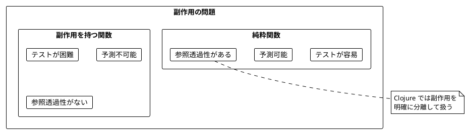
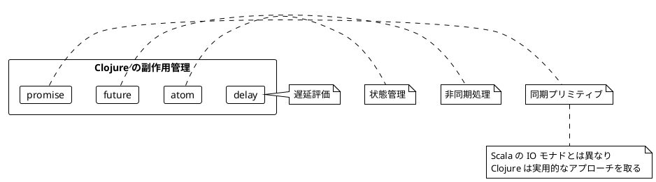
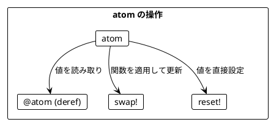
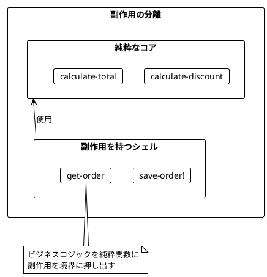
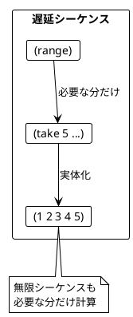
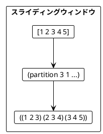
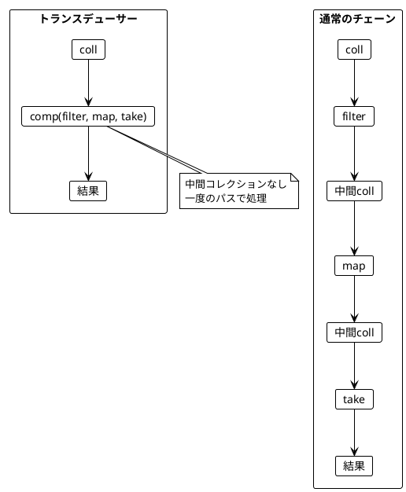

# Part IV: 状態管理とストリーム処理（Clojure 版）

本章では、Clojure における副作用の扱い方を学びます。atom による状態管理、遅延評価、非同期処理、そして遅延シーケンスとトランスデューサーによるストリーム処理を習得します。

---

## 第8章: 状態管理と副作用

### 8.1 副作用の問題

純粋関数は副作用を持ちません。しかし、実際のプログラムには副作用が必要です:

- 状態の変更
- ファイルの読み書き
- ネットワーク通信
- 乱数生成
- 現在時刻の取得



### 8.2 Clojure の副作用管理

Clojure には副作用を管理するための複数のメカニズムがあります。



### 8.3 サイコロを振る例

**ソースファイル**: `app/clojure/src/ch08/state_management.clj`

#### 不純な関数（副作用あり）

```clojure
(defn cast-the-die-impure!
  "サイコロを振る（不純）"
  []
  (inc (rand-int 6)))

;; 呼び出すたびに異なる値が返る
(cast-the-die-impure!) ; => 3
(cast-the-die-impure!) ; => 5
(cast-the-die-impure!) ; => 1
```

#### delay を使った遅延評価

```clojure
(defn cast-the-die
  "サイコロを振る（遅延）"
  []
  (delay (cast-the-die-impure!)))

;; delay を作成しただけでは実行されない
(def die-cast (cast-the-die))
die-cast ; => #<Delay@...>

;; force で実行
(force die-cast) ; => 4
```

> **注意**: `delay` は一度だけ評価され、結果がキャッシュされます。毎回実行するには新しい `delay` を作成するか、関数でラップします。

### 8.4 atom による状態管理

**atom** は Clojure の最も基本的な状態管理プリミティブです。Scala の `Ref` に相当します。



```clojure
;; atom を作成
(def counter (atom 0))

;; 値を読み取り
@counter            ; => 0
(deref counter)     ; => 0

;; swap! で関数を適用して更新
(swap! counter inc) ; => 1
(swap! counter + 5) ; => 6

;; reset! で値を直接設定
(reset! counter 0)  ; => 0
```

### 8.5 atom の高度な操作

```clojure
;; compare-and-set! は期待値と一致する場合のみ更新
(def a (atom 5))
(compare-and-set! a 5 10) ; => true, @a = 10
(compare-and-set! a 5 20) ; => false, @a = 10（変更されない）

;; 複数の値を持つ atom
(def game-state (atom {:rolls [] :total 0}))

(defn roll-die!
  "サイコロを振って状態を更新"
  []
  (let [roll (cast-the-die-impure!)]
    (swap! game-state
           (fn [state]
             (-> state
                 (update :rolls conj roll)
                 (update :total + roll))))
    roll))
```

### 8.6 future による非同期処理

**future** は別スレッドで計算を実行します。

```clojure
;; future を作成
(def f (future
         (Thread/sleep 1000)
         (+ 1 2)))

;; deref で結果を取得（完了まで待機）
@f ; => 3

;; タイムアウト付きで取得
(deref f 500 :timeout) ; => :timeout または結果
```

#### 並列 API 呼び出し

```clojure
(defn async-api-call
  "非同期 API 呼び出しをシミュレート"
  [name delay-ms]
  (future
    (Thread/sleep delay-ms)
    {:name name :result (str "Result for " name)}))

(defn parallel-api-calls
  "並列で API を呼び出す"
  [names]
  (let [futures (mapv #(async-api-call % 100) names)]
    (mapv deref futures)))

(parallel-api-calls ["a" "b" "c"])
; => [{:name "a" ...} {:name "b" ...} {:name "c" ...}]
```

### 8.7 promise による同期

**promise** は一度だけ値を設定できるコンテナです。

```clojure
;; promise を作成
(def p (promise))

;; 値を設定
(deliver p 42)

;; 値を取得
@p ; => 42

;; タイムアウト付き
(deref p 100 :default) ; => 42 または :default
```

### 8.8 ミーティングスケジューリングの例

```clojure
(defn meeting-time [start-hour end-hour]
  {:start-hour start-hour :end-hour end-hour})

(defn meetings-overlap?
  "2つのミーティングが重複するか"
  [m1 m2]
  (not (or (>= (:start-hour m1) (:end-hour m2))
           (>= (:start-hour m2) (:end-hour m1)))))

(defn possible-meetings
  "空き時間を計算（純粋関数）"
  [existing-meetings start-hour end-hour length-hours]
  (let [slots (for [start (range start-hour (- end-hour length-hours -1))]
                (meeting-time start (+ start length-hours)))]
    (filter (fn [slot]
              (not-any? #(meetings-overlap? % slot) existing-meetings))
            slots)))
```

### 8.9 リトライ戦略

```clojure
(defn retry
  "アクションを n 回リトライ"
  [action max-retries]
  (loop [attempts 0]
    (let [result (try
                   {:ok (action)}
                   (catch Exception e
                     {:error (.getMessage e)}))]
      (if (or (:ok result) (>= attempts max-retries))
        result
        (recur (inc attempts))))))

(defn retry-with-delay
  "遅延付きでリトライ"
  [action max-retries delay-ms]
  (loop [attempts 0]
    (let [result (try
                   {:ok (action)}
                   (catch Exception e
                     {:error (.getMessage e)}))]
      (if (or (:ok result) (>= attempts max-retries))
        result
        (do
          (Thread/sleep delay-ms)
          (recur (inc attempts)))))))
```

### 8.10 副作用の分離パターン



```clojure
;; 純粋なコアロジック
(defn calculate-discount [price discount-rate]
  (* price (- 1 discount-rate)))

(defn calculate-total [items]
  (reduce + (map :price items)))

;; 副作用を持つシェル
(def order-db (atom {}))

(defn save-order! [order-id order]
  (swap! order-db assoc order-id order)
  order-id)

;; 副作用を分離した処理
(defn process-order! [order-id items discount-rate]
  (let [subtotal (calculate-total items)          ; 純粋
        total (calculate-discount subtotal discount-rate)]  ; 純粋
    (save-order! order-id {:items items          ; 副作用
                           :subtotal subtotal
                           :total total})))
```

---

## 第9章: 遅延シーケンスとストリーム処理

### 9.1 遅延シーケンスとは

Clojure のシーケンスは**遅延評価**されます。要素は必要になるまで計算されません。



### 9.2 lazy-seq による遅延シーケンス

```clojure
(defn lazy-range
  "遅延範囲シーケンス"
  [start end]
  (lazy-seq
   (when (< start end)
     (cons start (lazy-range (inc start) end)))))

;; range は遅延シーケンス
(def numbers (range 1 11))
;; まだ評価されていない

;; take で必要な分だけ取得
(take 3 numbers)  ; => (1 2 3)
```

### 9.3 無限シーケンス

Clojure には無限シーケンスを生成する関数があります。

| 関数 | 説明 | 例 |
|------|------|-----|
| `repeat` | 同じ値を無限に繰り返す | `(take 5 (repeat 1))` => `(1 1 1 1 1)` |
| `iterate` | 関数を繰り返し適用 | `(take 5 (iterate inc 0))` => `(0 1 2 3 4)` |
| `cycle` | シーケンスを無限に繰り返す | `(take 5 (cycle [1 2]))` => `(1 2 1 2 1)` |
| `repeatedly` | 関数を無限に呼び出す | `(take 3 (repeatedly rand))` |

```clojure
;; 2のべき乗
(def powers-of-2 (iterate #(* 2 %) 1))
(take 10 powers-of-2)
; => (1 2 4 8 16 32 64 128 256 512)

;; 無限のサイコロ
(def infinite-die-rolls (repeatedly #(inc (rand-int 6))))
(take 5 infinite-die-rolls) ; => (3 1 5 2 4)
```

### 9.4 遅延シーケンスの操作

```clojure
(defn process-stream
  "ストリームを処理"
  [stream]
  (->> stream
       (filter odd?)
       (map #(* % %))
       (take 5)))

(process-stream (range))
; => (1 9 25 49 81)

;; take-while: 条件を満たす間取得
(take-while pos? [1 2 3 -1 4 5])
; => (1 2 3)

;; drop-while: 条件を満たす間スキップ
(drop-while #(< % 5) [1 2 3 4 5 6 7])
; => (5 6 7)
```

### 9.5 スライディングウィンドウ



```clojure
;; partition: 指定サイズで分割
(partition 3 (range 10))
; => ((0 1 2) (3 4 5) (6 7 8))

;; partition-all: 端数も含める
(partition-all 3 (range 10))
; => ((0 1 2) (3 4 5) (6 7 8) (9))

;; partition with step: スライディングウィンドウ
(defn sliding-window [n coll]
  (partition n 1 coll))

(sliding-window 3 [1 2 3 4 5])
; => ((1 2 3) (2 3 4) (3 4 5))
```

### 9.6 トレンド検出

為替レートの上昇・下降トレンドを検出します。

```clojure
(defn trending?
  "上昇トレンドかどうか"
  [rates]
  (and (> (count rates) 1)
       (every? (fn [[prev curr]] (< prev curr))
               (partition 2 1 rates))))

(trending? [0.81 0.82 0.83])  ; => true
(trending? [0.81 0.84 0.83])  ; => false

(defn declining?
  "下降トレンドかどうか"
  [rates]
  (and (> (count rates) 1)
       (every? (fn [[prev curr]] (> prev curr))
               (partition 2 1 rates))))

(defn find-trend
  "トレンドを検出"
  [window-size stream]
  (->> stream
       (sliding-window window-size)
       (map (fn [window]
              {:rates (vec window)
               :trending? (trending? window)
               :declining? (declining? window)}))))
```

### 9.7 reductions（スキャン操作）

`reductions` は `reduce` の中間結果をすべて返します。Scala の `scanLeft` に相当します。

```clojure
;; 累積和
(reductions + (range 1 6))
; => (1 3 6 10 15)

;; 移動平均
(defn moving-average [window-size coll]
  (->> coll
       (sliding-window window-size)
       (map #(/ (reduce + %) (count %)))))

(moving-average 3 [1 2 3 4 5 6 7 8 9 10])
; => (2 3 4 5 6 7 8 9)
```

### 9.8 トランスデューサー

**トランスデューサー**は変換を合成する効率的な方法です。中間コレクションを作らずに処理できます。



```clojure
;; トランスデューサーを合成
(def xform
  (comp
   (filter odd?)
   (map #(* % %))
   (take 5)))

;; into で使用
(into [] xform (range 20))
; => [1 9 25 49 81]

;; sequence で遅延処理
(sequence xform (range 20))
; => (1 9 25 49 81)
```

### 9.9 eduction

`eduction` はトランスデューサーを使った効率的な遅延処理です。

```clojure
(defn efficient-process [coll]
  (eduction
   (filter odd?)
   (map #(* % %))
   (take 5)
   coll))

;; reduce, into, run! などと組み合わせて使用
(into [] (efficient-process (range 20)))
; => [1 9 25 49 81]
```

### 9.10 実践例：ログストリーム処理

```clojure
(def log-levels #{:debug :info :warn :error})

(defn generate-log-entry []
  {:timestamp (System/currentTimeMillis)
   :level (rand-nth (vec log-levels))
   :message (str "Log message " (rand-int 1000))})

(def log-stream (repeatedly generate-log-entry))

(defn filter-errors [logs]
  (filter #(= :error (:level %)) logs))

(defn count-by-level [logs]
  (frequencies (map :level logs)))

(defn recent-errors [n logs]
  (->> logs
       filter-errors
       (take n)))
```

### 9.11 実践例：センサーデータストリーム

```clojure
(defn sensor-stream [base-value variance]
  (repeatedly #(+ base-value (* (- (rand) 0.5) variance))))

(defn detect-anomalies [threshold stream]
  (filter #(> (Math/abs (- % 50)) threshold) stream))

(defn alert-on-anomaly [threshold n stream]
  (->> stream
       (detect-anomalies threshold)
       (take n)
       (map (fn [value]
              {:type :anomaly
               :value value
               :timestamp (System/currentTimeMillis)}))))
```

### 9.12 バッチ処理

```clojure
(defn process-in-batches [batch-size process-fn coll]
  (->> coll
       (partition-all batch-size)
       (map process-fn)))

(defn batch-sum [batch-size coll]
  (process-in-batches batch-size #(reduce + %) coll))

(batch-sum 3 [1 2 3 4 5 6 7 8 9 10])
; => (6 15 24 10)
```

### 9.13 パイプライン処理

```clojure
(defn pipeline [& fns]
  (fn [coll]
    (reduce (fn [acc f] (f acc)) coll fns)))

(def my-pipeline
  (pipeline
   (partial filter odd?)
   (partial map #(* % 2))
   (partial take 5)))

(my-pipeline (range 20))
; => (2 6 10 14 18)
```

---

## まとめ

### Clojure vs Scala の比較

| 概念 | Scala (cats-effect) | Clojure |
|------|---------------------|---------|
| 副作用の遅延 | `IO.delay` | `delay` / 関数 |
| 状態管理 | `Ref[IO, A]` | `atom` |
| 非同期処理 | `IO.async` | `future` |
| 同期プリミティブ | `Deferred` | `promise` |
| ストリーム処理 | fs2 `Stream` | 遅延シーケンス |
| 変換の合成 | パイプ演算子 | トランスデューサー |

### 学んだこと

1. **状態管理**: atom を使った安全な状態管理
2. **遅延評価**: delay と force による遅延実行
3. **非同期処理**: future と promise による並行プログラミング
4. **遅延シーケンス**: 無限シーケンスと遅延評価
5. **トランスデューサー**: 効率的な変換の合成
6. **副作用の分離**: 純粋なコアと副作用を持つシェル

### 次のステップ

- Part V では、関数型プログラミングの高度なテクニックを学びます
- Part VI では、実践的なアプリケーション開発を行います
