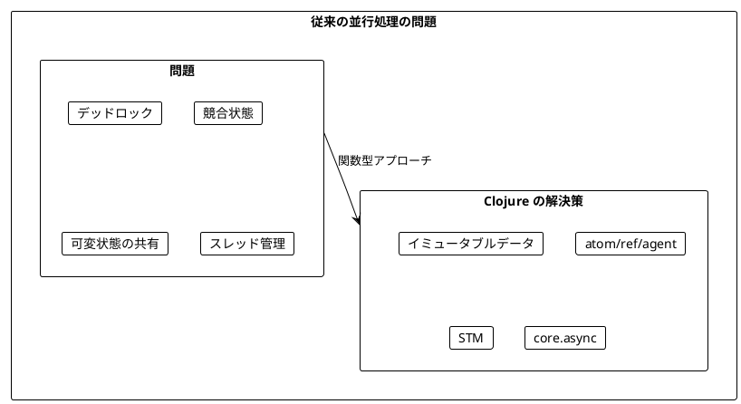
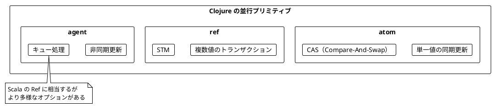
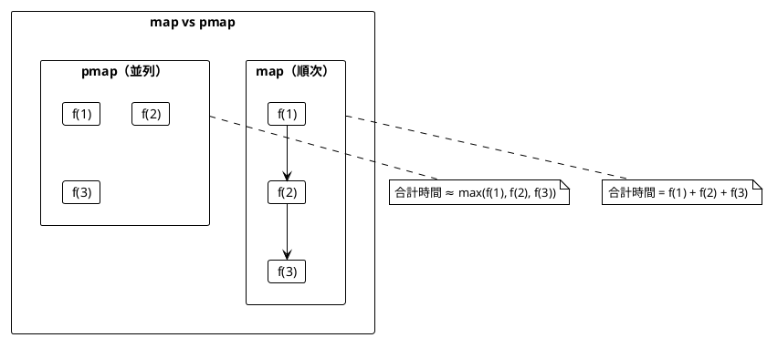
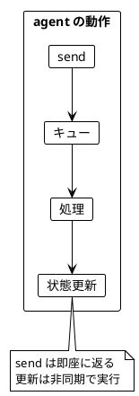
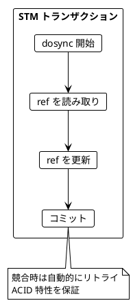
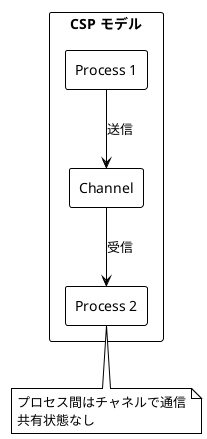
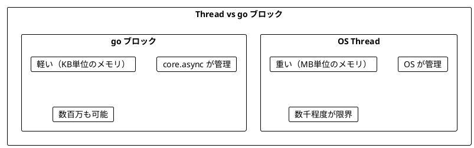
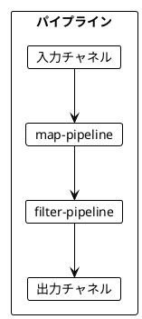
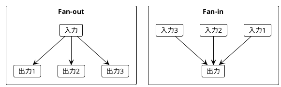
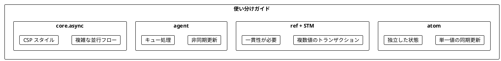

# Part V: 並行処理（Clojure 版）

本章では、Clojure における並行処理を学びます。atom/ref/agent による共有状態管理、pmap による並列処理、そして core.async を使った CSP（Communicating Sequential Processes）スタイルの並行プログラミングを習得します。

---

## 第10章: 並行・並列処理の基礎

### 10.1 並行処理の課題

従来の並行処理には多くの課題があります:

- デッドロック
- 競合状態（Race Condition）
- 共有状態の管理の複雑さ
- スレッドのオーバーヘッド



### 10.2 Clojure の並行プリミティブ

Clojure には複数の並行プリミティブがあります。



### 10.3 チェックインのリアルタイム集計

**ソースファイル**: `app/clojure/src/ch10/concurrency.clj`

都市へのチェックインをリアルタイムで集計し、ランキングを更新する例を見ていきます。

```clojure
(defrecord City [name])
(defrecord CityStats [city check-ins])

(defn city [name]
  (->City name))

(defn city-stats [city check-ins]
  (->CityStats city check-ins))
```

#### トップ都市の計算（純粋関数）

```clojure
(defn top-cities
  "チェックイン数でトップN都市を計算（純粋関数）"
  [city-check-ins n]
  (->> city-check-ins
       (map (fn [[city check-ins]] (city-stats city check-ins)))
       (sort-by :check-ins >)
       (take n)))
```

### 10.4 逐次処理 vs 並行処理

```clojure
;; 逐次処理版
(defn process-check-ins-sequential
  "チェックインを逐次処理"
  [check-ins]
  (reduce
   (fn [city-check-ins city]
     (update city-check-ins city (fnil inc 0)))
   {}
   check-ins))

;; 並行処理版（atom + pmap）
(defn process-check-ins-concurrent
  "チェックインを並行処理"
  [check-ins]
  (let [stored-check-ins (atom {})]
    (dorun (pmap #(store-check-in! stored-check-ins %) check-ins))
    @stored-check-ins))
```

### 10.5 atom - アトミックな共有状態

**atom** は Clojure の最も基本的な並行プリミティブです。Scala の `Ref` に相当します。

```clojure
;; atom を作成
(def stored-check-ins (atom {}))

;; swap! でアトミックに更新
(defn store-check-in! [stored-check-ins city]
  (swap! stored-check-ins update city (fnil inc 0)))

;; 値を読み取り
@stored-check-ins  ; または (deref stored-check-ins)
```

#### atom の主要メソッド

| メソッド | 説明 | 例 |
|----------|------|-----|
| `atom` | 初期値で atom を作成 | `(atom {})` |
| `deref` / `@` | 現在の値を取得 | `@counter` |
| `reset!` | 値を設定 | `(reset! counter 0)` |
| `swap!` | アトミックに更新 | `(swap! counter inc)` |
| `compare-and-set!` | CAS 操作 | `(compare-and-set! a old new)` |

### 10.6 pmap - 並列マップ処理

`pmap` は `map` の並列版です。Scala の `parSequence` に相当します。

```clojure
;; 順次実行
(defn sequential-process [coll]
  (mapv slow-operation coll))

;; 並列実行
(defn parallel-process [coll]
  (vec (pmap slow-operation coll)))
```



### 10.7 サイコロを並行して振る

```clojure
(defn cast-the-die []
  (inc (rand-int 6)))

;; 複数のサイコロを並行して振る
(defn cast-dice-concurrent [n]
  (vec (pmap (fn [_] (cast-the-die)) (range n))))

;; 結果を atom に保存
(defn cast-dice-with-storage! [n]
  (let [stored-casts (atom [])]
    (dorun
     (pmap
      (fn [_]
        (let [result (cast-the-die)]
          (swap! stored-casts conj result)))
      (range n)))
    @stored-casts))
```

### 10.8 agent - 非同期状態更新

**agent** は非同期に状態を更新します。更新はキューに入れられ、順次処理されます。

```clojure
(def check-in-agent (agent {}))

;; send で非同期更新
(defn agent-store-check-in! [city]
  (send check-in-agent update city (fnil inc 0)))

;; 値を読み取り（即座に返る）
@check-in-agent

;; 更新完了を待機
(await check-in-agent)
```



### 10.9 ref と STM（Software Transactional Memory）

**ref** は複数の値をトランザクションで更新します。

```clojure
(def check-in-ref (ref {}))
(def ranking-ref (ref []))

;; dosync でトランザクション
(defn stm-store-check-in! [city]
  (dosync
   (alter check-in-ref update city (fnil inc 0))))

;; 複数の ref を一緒に更新
(defn stm-transfer-check-ins! [from-city to-city amount]
  (dosync
   (let [from-count (get @check-in-ref from-city 0)]
     (when (>= from-count amount)
       (alter check-in-ref update from-city - amount)
       (alter check-in-ref update to-city (fnil + 0) amount)
       true))))
```



### 10.10 future による非同期処理

```clojure
(defn async-api-call [name delay-ms]
  (future
    (Thread/sleep delay-ms)
    {:name name :result (str "Result for " name)}))

(defn parallel-api-calls [names]
  (let [futures (mapv #(async-api-call % 100) names)]
    (mapv deref futures)))

;; タイムアウト付き
(defn parallel-api-calls-with-timeout [names timeout-ms]
  (let [futures (mapv #(async-api-call % 100) names)]
    (mapv #(deref % timeout-ms {:error "timeout"}) futures)))
```

### 10.11 実践例：並行キャッシュ

```clojure
(defn create-cache []
  (let [cache (atom {})
        hits (atom 0)
        misses (atom 0)]
    {:get (fn [key compute-fn]
            (if-let [value (get @cache key)]
              (do (swap! hits inc) value)
              (let [value (compute-fn)]
                (swap! misses inc)
                (swap! cache assoc key value)
                value)))
     :invalidate (fn [key]
                   (swap! cache dissoc key))
     :stats (fn []
              {:size (count @cache)
               :hits @hits
               :misses @misses})}))
```

---

## 第11章: core.async と CSP

### 11.1 CSP（Communicating Sequential Processes）

**core.async** は CSP スタイルの並行プログラミングを提供します。Go 言語の goroutine と channel に似ています。



### 11.2 チャネルの基本

**ソースファイル**: `app/clojure/src/ch11/core_async.clj`

```clojure
(require '[clojure.core.async :as async
           :refer [chan go go-loop <! >! <!! >!! close!
                   timeout put! take!]])

;; チャネルを作成
(def ch (chan))        ; バッファなし
(def ch (chan 10))     ; バッファサイズ 10

;; ブロッキング操作（メインスレッド用）
(>!! ch value)  ; 送信
(<!! ch)        ; 受信

;; ノンブロッキング操作（go ブロック内）
(go (>! ch value))  ; 送信
(go (<! ch))        ; 受信
```

#### チャネルの種類

| 種類 | 説明 | 作成方法 |
|------|------|----------|
| バッファなし | 送受信が同期 | `(chan)` |
| 固定バッファ | 指定サイズ | `(chan 10)` |
| スライディング | 古い値を破棄 | `(chan (sliding-buffer 10))` |
| ドロッピング | 新しい値を破棄 | `(chan (dropping-buffer 10))` |

### 11.3 go ブロック（軽量スレッド）

**go** ブロックは軽量な「擬似スレッド」を作成します。Scala の Fiber に相当します。

```clojure
;; go ブロックは即座に返る
(go
  (println "Starting...")
  (<! (timeout 1000))
  (println "Done!"))

;; go-loop は再帰的な処理に便利
(go-loop [i 0]
  (when (< i 5)
    (println i)
    (<! (timeout 100))
    (recur (inc i))))
```



### 11.4 プロデューサー/コンシューマーパターン

```clojure
(defn simple-producer
  "シンプルなプロデューサー"
  [ch values]
  (go
    (doseq [v values]
      (>! ch v))
    (close! ch)))

(defn simple-consumer
  "シンプルなコンシューマー"
  [ch]
  (go-loop [results []]
    (if-let [v (<! ch)]
      (recur (conj results v))
      results)))

;; 使用例
(let [ch (chan 10)]
  (simple-producer ch [1 2 3 4 5])
  (<!! (simple-consumer ch)))
; => [1 2 3 4 5]
```

### 11.5 パイプラインパターン

```clojure
(defn map-pipeline
  "マッピングパイプライン"
  [f in-ch]
  (let [out-ch (chan)]
    (go-loop []
      (if-let [v (<! in-ch)]
        (do
          (>! out-ch (f v))
          (recur))
        (close! out-ch)))
    out-ch))

(defn filter-pipeline
  "フィルタリングパイプライン"
  [pred in-ch]
  (let [out-ch (chan)]
    (go-loop []
      (if-let [v (<! in-ch)]
        (do
          (when (pred v)
            (>! out-ch v))
          (recur))
        (close! out-ch)))
    out-ch))
```



### 11.6 Fan-out / Fan-in パターン

```clojure
;; Fan-out: 1つのチャネルから複数に分配
(defn fan-out [in-ch out-chs]
  (go-loop []
    (when-let [v (<! in-ch)]
      (doseq [out-ch out-chs]
        (>! out-ch v))
      (recur))))

;; Fan-in: 複数のチャネルから1つに集約
(defn fan-in [in-chs]
  (let [out-ch (chan)]
    (doseq [in-ch in-chs]
      (go-loop []
        (when-let [v (<! in-ch)]
          (>! out-ch v)
          (recur))))
    out-ch))
```



### 11.7 alts! によるセレクト

`alts!` は複数のチャネルから最初に値が来たものを選択します。

```clojure
(defn with-timeout [ch timeout-ms default]
  (let [timeout-ch (timeout timeout-ms)]
    (go
      (let [[v ch] (alts! [ch timeout-ch])]
        (if (= ch timeout-ch)
          default
          v)))))

(defn first-response [chs]
  (go
    (let [[v _] (alts! chs)]
      v)))
```

### 11.8 ワーカープール

```clojure
(defn worker [id work-ch result-ch]
  (go-loop []
    (when-let [work (<! work-ch)]
      (let [result (work)]
        (>! result-ch {:worker id :result result}))
      (recur))))

(defn create-worker-pool [n work-ch result-ch]
  (dotimes [i n]
    (worker i work-ch result-ch)))

;; 使用例
(let [work-ch (chan 10)
      result-ch (chan 10)]
  (create-worker-pool 3 work-ch result-ch)
  (put! work-ch (fn [] (* 2 21)))
  (<!! result-ch))
; => {:worker 0 :result 42}
```

### 11.9 pub/sub パターン

```clojure
(defn create-pub-sub []
  (let [pub-ch (chan)
        subscribers (atom {})]
    {:publish (fn [topic message]
                (put! pub-ch {:topic topic :message message}))
     :subscribe (fn [topic]
                  (let [sub-ch (chan)]
                    (swap! subscribers update topic (fnil conj []) sub-ch)
                    sub-ch))
     :start (fn []
              (go-loop []
                (when-let [{:keys [topic message]} (<! pub-ch)]
                  (doseq [sub-ch (get @subscribers topic [])]
                    (>! sub-ch message))
                  (recur))))}))
```

### 11.10 レートリミッター

```clojure
(defn create-rate-limiter [rate-per-second]
  (let [interval-ms (/ 1000 rate-per-second)
        token-ch (chan 1)]
    ;; トークンを定期的に供給
    (go-loop []
      (>! token-ch :token)
      (<! (timeout interval-ms))
      (recur))
    {:acquire (fn []
                (<!! token-ch))
     :try-acquire (fn [timeout-ms]
                    (let [[v _] (alts!! [token-ch (timeout timeout-ms)])]
                      (some? v)))}))
```

### 11.11 セマフォ

```clojure
(defn create-semaphore [permits]
  (let [sem-ch (chan permits)]
    ;; 初期許可を追加
    (dotimes [_ permits]
      (put! sem-ch :permit))
    {:acquire (fn []
                (<!! sem-ch))
     :release (fn []
                (put! sem-ch :permit))
     :with-permit (fn [f]
                    (<!! sem-ch)
                    (try
                      (f)
                      (finally
                        (put! sem-ch :permit))))}))
```

### 11.12 実践例：並行ダウンローダー

```clojure
(defn concurrent-downloader [urls max-concurrent]
  (let [result-ch (chan (count urls))
        semaphore (chan max-concurrent)]
    ;; セマフォを初期化
    (dotimes [_ max-concurrent]
      (put! semaphore :permit))

    ;; ダウンロードを開始
    (doseq [url urls]
      (go
        (<! semaphore)  ; 許可を取得
        (let [result (<! (simulate-download url))]
          (>! result-ch result)
          (>! semaphore :permit))))  ; 許可を返却

    result-ch))
```

---

## まとめ

### Clojure vs Scala の比較

| 概念 | Scala (cats-effect) | Clojure |
|------|---------------------|---------|
| アトミック参照 | `Ref[IO, A]` | `atom` |
| トランザクション | なし（別ライブラリ） | `ref` + STM |
| 非同期更新 | なし（直接対応なし） | `agent` |
| 軽量スレッド | `Fiber` | `go` ブロック |
| チャネル | fs2 `Queue` | `chan` |
| 並列実行 | `parSequence` | `pmap` |
| セレクト | `race` | `alts!` |

### 並行プリミティブの使い分け



### 学んだこと

1. **atom**: 単一値のアトミックな同期更新
2. **ref + STM**: 複数値のトランザクション管理
3. **agent**: 非同期状態更新
4. **pmap**: 並列マップ処理
5. **core.async**: CSP スタイルの並行処理
6. **go ブロック**: 軽量な擬似スレッド
7. **チャネル**: プロセス間通信

### 次のステップ

- Part VI では、実践的なアプリケーション構築を行います
