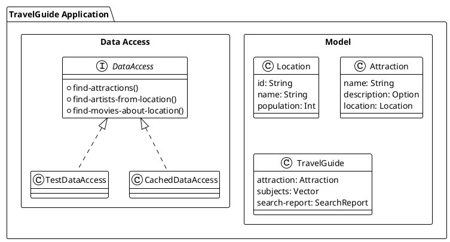
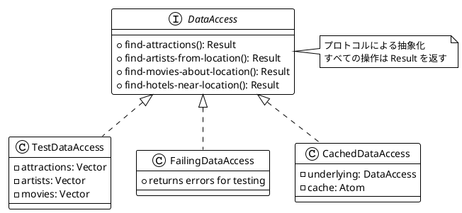
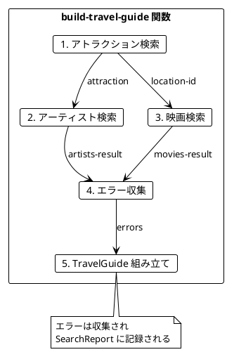
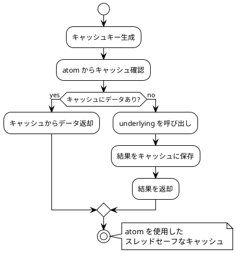
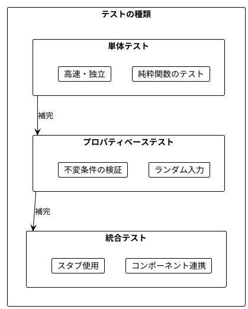
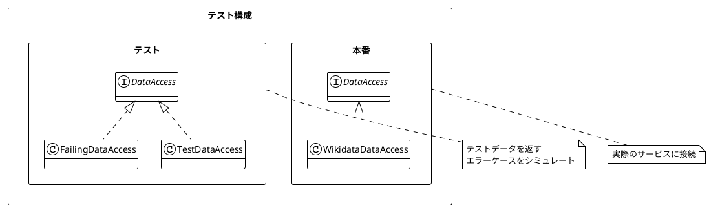
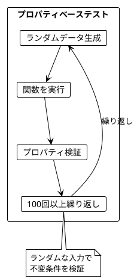
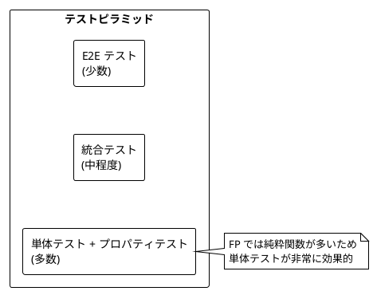
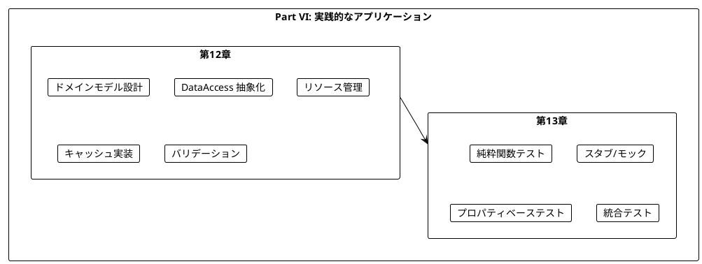
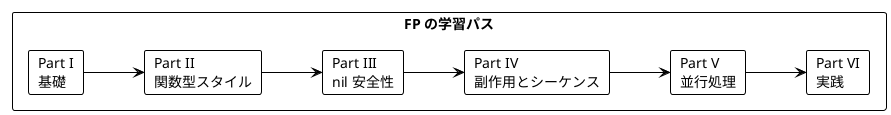

# Part VI: 実践的なアプリケーション構築とテスト（Clojure 版）

本章では、これまで学んだ関数型プログラミングの概念を統合し、実践的なアプリケーションを構築します。また、関数型プログラミングにおけるテスト戦略についても学びます。

---

## 第12章: 実践的なアプリケーション構築

### 12.1 TravelGuide アプリケーション

**ソースファイル**: `app/clojure/src/ch12/travel_guide.clj`

旅行ガイドアプリケーションを例に、実践的な FP アプリケーションの構築方法を学びます。



### 12.2 ドメインモデルの定義

```clojure
;; レコード定義
(defrecord Location [id name population])
(defrecord Attraction [name description location])
(defrecord MusicArtist [name genre origin])
(defrecord Movie [name year director])
(defrecord Hotel [name rating location])
(defrecord SearchReport [attractions-searched errors])
(defrecord TravelGuide [attraction subjects search-report])

;; コンストラクタ関数
(defn location [id name population]
  (->Location id name population))

(defn attraction
  ([name location]
   (->Attraction name nil location))
  ([name description location]
   (->Attraction name description location)))

(defn travel-guide [attraction subjects search-report]
  (->TravelGuide attraction subjects search-report))
```

### 12.3 データアクセス層の抽象化

プロトコルを使用して外部データソースへのアクセスを抽象化します。

```clojure
(defprotocol DataAccess
  "データアクセス層の抽象化"
  (find-attractions [this name ordering limit]
    "アトラクションを検索")
  (find-artists-from-location [this location-id limit]
    "ロケーションからアーティストを検索")
  (find-movies-about-location [this location-id limit]
    "ロケーションに関する映画を検索")
  (find-hotels-near-location [this location-id limit]
    "ロケーション近くのホテルを検索"))
```



### 12.4 Result 型によるエラー処理

```clojure
;; Result ユーティリティ
(defn ok? [result]
  (contains? result :ok))

(defn error? [result]
  (contains? result :error))

(defn get-value [result default]
  (if (ok? result)
    (:ok result)
    default))

(defn get-error [result]
  (:error result))
```

### 12.5 テスト用スタブ実装

```clojure
(defrecord TestDataAccess [attractions artists movies hotels]
  DataAccess
  (find-attractions [_ name ordering limit]
    {:ok (take limit (filter #(clojure.string/includes?
                               (clojure.string/lower-case (:name %))
                               (clojure.string/lower-case name))
                             attractions))})

  (find-artists-from-location [_ location-id limit]
    {:ok (take limit artists)})

  (find-movies-about-location [_ location-id limit]
    {:ok (take limit movies)})

  (find-hotels-near-location [_ location-id limit]
    {:ok (take limit hotels)}))

(defn create-test-data-access []
  (->TestDataAccess
   [test-attraction ...]
   [test-artist ...]
   [test-movie ...]
   [test-hotel ...]))
```

### 12.6 エラー処理付きデータアクセス

```clojure
(defrecord FailingDataAccess []
  DataAccess
  (find-attractions [_ name ordering limit]
    {:ok [(attraction "Fallback Attraction" nil test-location)]})

  (find-artists-from-location [_ location-id limit]
    {:error "Network error: Failed to fetch artists"})

  (find-movies-about-location [_ location-id limit]
    {:error "Timeout: Failed to fetch movies"})

  (find-hotels-near-location [_ location-id limit]
    {:error "Service unavailable"}))
```

### 12.7 TravelGuide アプリケーションの構築

```clojure
(defn build-travel-guide
  "旅行ガイドを構築"
  [data-access attraction-name]
  (let [attractions-result (find-attractions data-access attraction-name by-population 3)]
    (if (error? attractions-result)
      {:error (get-error attractions-result)}
      (let [attractions (get-value attractions-result [])]
        (map (fn [attr]
               (let [location-id (get-in attr [:location :id])
                     artists-result (find-artists-from-location data-access location-id 2)
                     movies-result (find-movies-about-location data-access location-id 2)

                     ;; エラーを収集
                     errors (cond-> []
                              (error? artists-result) (conj (get-error artists-result))
                              (error? movies-result) (conj (get-error movies-result)))

                     ;; 結果を取得（エラー時は空リスト）
                     artists (get-value artists-result [])
                     movies (get-value movies-result [])

                     ;; サブジェクトを構築
                     subjects (concat (map :name artists) (map :name movies))]
                 (travel-guide
                  attr
                  (vec subjects)
                  (search-report (count attractions) errors))))
             attractions)))))
```



### 12.8 キャッシュ付きデータアクセス

`atom` を使用したスレッドセーフなキャッシュの実装:

```clojure
(defn create-cached-data-access
  "キャッシュ付きデータアクセスを作成"
  [underlying-data-access]
  (let [attractions-cache (atom {})
        artists-cache (atom {})
        movies-cache (atom {})
        hotels-cache (atom {})]
    (reify DataAccess
      (find-attractions [_ name ordering limit]
        (let [cache-key (str name "-" ordering "-" limit)]
          (if-let [cached (get @attractions-cache cache-key)]
            {:ok cached}
            (let [result (find-attractions underlying-data-access name ordering limit)]
              (when (ok? result)
                (swap! attractions-cache assoc cache-key (:ok result)))
              result))))
      ;; 他のメソッドも同様...
      )))
```



### 12.9 リソース管理

安全なリソース管理パターン:

```clojure
(defn with-resource
  "リソースを安全に使用（try-with-resources パターン）"
  [acquire release use-fn]
  (let [resource (acquire)]
    (try
      (use-fn resource)
      (finally
        (release resource)))))

(defn make-resource
  "リソースを作成"
  [acquire release]
  {:acquire acquire
   :release release})

;; ファイルリソースの例
(defn file-resource [path]
  (make-resource
   #(clojure.java.io/reader path)
   #(.close %)))

(defn read-lines [path]
  (use-resource
   (file-resource path)
   (fn [reader]
     (vec (line-seq reader)))))
```

### 12.10 バリデーション

```clojure
(defn validate-attraction-name [name]
  (cond
    (nil? name)
    {:error "Attraction name cannot be nil"}

    (clojure.string/blank? name)
    {:error "Attraction name cannot be empty"}

    (> (count name) 100)
    {:error "Attraction name too long"}

    :else
    {:ok name}))

(defn validate-limit [limit]
  (cond
    (nil? limit)
    {:error "Limit cannot be nil"}

    (not (integer? limit))
    {:error "Limit must be an integer"}

    (<= limit 0)
    {:error "Limit must be positive"}

    (> limit 100)
    {:error "Limit cannot exceed 100"}

    :else
    {:ok limit}))
```

---

## 第13章: テスト戦略

### 13.1 関数型プログラミングのテスト

関数型プログラミングでは、純粋関数のおかげでテストが非常に簡単になります。



### 13.2 純粋関数のテスト

**ソースファイル**: `app/clojure/test/ch12/travel_guide_test.clj`

純粋関数は入力と出力のみでテストできます。

```clojure
(deftest filter-popular-locations-tests
  (testing "filters by minimum population"
    (let [locations [(location "Q1" "Small" 1000)
                     (location "Q2" "Medium" 100000)
                     (location "Q3" "Large" 1000000)]
          result (filter-popular-locations locations 50000)]
      (is (= 2 (count result)))
      (is (every? #(>= (:population %) 50000) result)))))

(deftest calculate-average-rating-tests
  (testing "calculates average"
    (let [loc (location "Q1" "City" 100000)
          hotels [(hotel "H1" 4.0 loc)
                  (hotel "H2" 5.0 loc)
                  (hotel "H3" 3.0 loc)]]
      (is (= 4.0 (calculate-average-rating hotels)))))

  (testing "returns 0 for empty list"
    (is (= 0.0 (calculate-average-rating [])))))
```

### 13.3 スタブを使用したテスト

```clojure
(deftest test-data-access-tests
  (let [data-access (create-test-data-access)]

    (testing "find-attractions returns matching attractions"
      (let [result (find-attractions data-access "Test" by-name 10)]
        (is (ok? result))
        (is (= 1 (count (:ok result))))))

    (testing "find-artists-from-location"
      (let [result (find-artists-from-location data-access "Test City" 10)]
        (is (ok? result))))))

(deftest failing-data-access-tests
  (let [data-access (create-failing-data-access)]

    (testing "find-artists-from-location returns error"
      (let [result (find-artists-from-location data-access "Q123" 10)]
        (is (error? result))))))
```



### 13.4 プロパティベーステスト

ランダムな入力で不変条件を検証します。

```clojure
;; ランダムデータ生成
(defn random-location []
  (location
   (str "Q" (rand-int 10000))
   (random-string 10)
   (rand-int 10000000)))

(defn random-attractions [n]
  (repeatedly n random-attraction))

;; プロパティテスト
(deftest property-filter-popular-locations-tests
  (testing "result size is at most input size"
    (dotimes [_ 100]
      (let [n (inc (rand-int 20))
            locations (repeatedly n random-location)
            min-pop (rand-int 10000000)
            result (filter-popular-locations locations min-pop)]
        (is (<= (count result) n)))))

  (testing "all results meet minimum population"
    (dotimes [_ 100]
      (let [locations (repeatedly 10 random-location)
            min-pop (rand-int 10000000)
            result (filter-popular-locations locations min-pop)]
        (is (every? #(>= (:population %) min-pop) result))))))
```



### 13.5 統合テスト

```clojure
(deftest integration-travel-guide-tests
  (testing "end-to-end travel guide workflow"
    (let [data-access (create-cached-data-access (create-test-data-access))
          ;; バリデーション
          validation (validate-search-params "Test" 3)]
      (is (ok? validation))

      ;; ガイド取得
      (let [result (get-travel-guide data-access "Test")]
        (is (ok? result))
        (let [guide (:ok result)]
          (is (some? (:attraction guide)))
          (is (vector? (:subjects guide)))
          (is (some? (:search-report guide)))))))

  (testing "workflow with partial failure"
    (let [data-access (create-failing-data-access)
          result (get-travel-guide data-access "Test")]
      (is (ok? result))
      (let [guide (:ok result)]
        (is (= 2 (count (get-in guide [:search-report :errors]))))))))
```

### 13.6 テストピラミッド



---

## まとめ

### Part VI で学んだこと



### Clojure vs Scala の比較

| 概念 | Scala | Clojure |
|------|-------|---------|
| ドメインモデル | case class | defrecord |
| 抽象化 | trait | defprotocol |
| リソース管理 | Resource | with-resource |
| キャッシュ | Ref | atom |
| エラー処理 | Either | {:ok ...} / {:error ...} |
| テスト | ScalaTest | clojure.test |

### キーポイント

1. **プロトコルによる抽象化**: DataAccess で外部依存を抽象化
2. **with-resource でリソース管理**: 安全なリソースの取得と解放
3. **atom でキャッシュ**: スレッドセーフな状態管理
4. **Result マップでエラー処理**: 明示的なエラーハンドリング
5. **SearchReport**: テスト可能性と可観測性の向上
6. **スタブ**: 外部依存を差し替えてテスト
7. **プロパティベーステスト**: ランダム入力で不変条件を検証

### 学習の総括



---

## シリーズ全体の総括

本シリーズでは、「Grokking Functional Programming」の内容に沿って、Clojure で関数型プログラミングの基礎から実践的なアプリケーション構築までを学びました。

### 学んだ主な概念

| Part | 章 | 主な概念 |
|------|-----|----------|
| I | 1-2 | 純粋関数、参照透過性 |
| II | 3-5 | イミュータブルデータ、高階関数、mapcat |
| III | 6-7 | nil 安全性、Result パターン、ADT |
| IV | 8-9 | 状態管理、遅延シーケンス、トランスデューサー |
| V | 10-11 | atom/ref/agent、core.async |
| VI | 12-13 | 実践アプリケーション、テスト |

### Clojure における関数型プログラミングの利点

1. **シンプルさ**: Lisp の S 式による一貫した構文
2. **イミュータブルがデフォルト**: 永続データ構造
3. **豊富な並行プリミティブ**: atom, ref, agent, core.async
4. **遅延評価**: 効率的なシーケンス処理
5. **REPL 駆動開発**: インタラクティブな開発体験
6. **Java 相互運用**: 豊富なエコシステムへのアクセス

### 次のステップ

- spec や malli による仕様記述とバリデーション
- Component や Integrant によるシステム構成
- re-frame や Fulcro によるフロントエンド開発
- 実際のプロジェクトで Clojure を適用する
