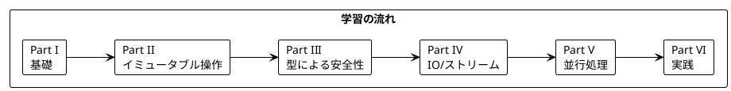

# Grokking Functional Programming 日本語解説（C# 版）

本シリーズは「Grokking Functional Programming」（Michał Płachta 著）の学習コンパニオンとして、関数型プログラミングの概念を C# と LanguageExt ライブラリで実装しながら日本語で解説します。

---

## 対象読者

- C# の経験があり、関数型プログラミングに興味がある開発者
- 既存の C# コードベースに FP の概念を導入したい方
- LanguageExt を使った実践的な FP を学びたい .NET エンジニア

---

## 記事一覧

### [Part I: 関数型プログラミングの基礎](part-1.md)

関数型プログラミングの基本概念を学びます。

| 章 | トピック |
|----|----------|
| 第1章 | 命令型 vs 関数型、C# での FP 基本構文 |
| 第2章 | 純粋関数、副作用の排除、テストの容易さ |

**キーワード**: 純粋関数、参照透過性、副作用、式ベースのプログラミング

---

### [Part II: 関数型スタイルのプログラミング](part-2.md)

イミュータブルなデータ操作と高階関数を学びます。

| 章 | トピック |
|----|----------|
| 第3章 | イミュータブルデータ、Seq 操作 |
| 第4章 | 高階関数、Map/Filter/Fold |
| 第5章 | Bind（flatMap）、LINQ クエリ式 |

**キーワード**: イミュータブル、高階関数、Seq、LINQ

---

### [Part III: エラーハンドリングと Option/Either](part-3.md)

型安全なエラーハンドリングを学びます。

| 章 | トピック |
|----|----------|
| 第6章 | Option 型、Some/None |
| 第7章 | Either 型、Union 型、パターンマッチング |

**キーワード**: Option、Either、Union（判別共用体）、パターンマッチング

---

### [Part IV: IO と副作用の管理](part-4.md)

副作用の管理とストリーム処理を学びます。

| 章 | トピック |
|----|----------|
| 第8章 | Eff モナド、副作用の遅延実行 |
| 第9章 | StreamT、非同期ストリーム処理 |

**キーワード**: Eff、IO モナド、遅延評価、ストリーム処理

---

### [Part V: 並行処理](part-5.md)

関数型プログラミングにおける並行処理を学びます。

| 章 | トピック |
|----|----------|
| 第10章 | Atom（アトミック参照）、並列処理 |

**キーワード**: 並行処理、Atom、Aff、並列実行

---

### [Part VI: 実践的なアプリケーション構築とテスト](part-6.md)

実践的なアプリケーション構築とテスト戦略を学びます。

| 章 | トピック |
|----|----------|
| 第11章 | TravelGuide アプリ、Resource 管理 |
| 第12章 | テスト戦略、プロパティベーステスト |

**キーワード**: Resource 管理、依存性注入、FsCheck/Hedgehog

---

## 学習パス



---

## 使用ライブラリ

| ライブラリ | 用途 | 対応章 |
|------------|------|--------|
| C# 12 / .NET 8 | 言語・ランタイム | 全章 |
| LanguageExt | 関数型プログラミングライブラリ | 全章 |
| FsCheck | プロパティベーステスト | Part VI |

---

## LanguageExt とは

[LanguageExt](https://github.com/louthy/language-ext) は C# で関数型プログラミングを実現するための強力なライブラリです。

### 主要な機能

| 機能 | 説明 |
|------|------|
| **Option&lt;A&gt;** | null 安全な値の表現 |
| **Either&lt;L, R&gt;** | 成功/失敗を型で表現 |
| **Seq&lt;A&gt;** | イミュータブルなシーケンス |
| **Map&lt;K, V&gt;** | イミュータブルな辞書 |
| **Eff&lt;A&gt; / Aff&lt;A&gt;** | 副作用の管理（同期/非同期） |
| **Atom&lt;A&gt;** | スレッドセーフな状態管理 |
| **Record 型** | イミュータブルなレコード |

---

## リポジトリ構成

```
grokkingfp-examples/
├── app/csharp/src/           # C# のサンプルコード
│   ├── Ch01/                 # 第1章: FP 入門
│   ├── Ch02/                 # 第2章: 純粋関数
│   ├── Ch03/                 # 第3章: イミュータブルデータ
│   ├── Ch04/                 # 第4章: 高階関数
│   ├── Ch05/                 # 第5章: Bind
│   ├── Ch06/                 # 第6章: Option
│   ├── Ch07/                 # 第7章: Either
│   ├── Ch08/                 # 第8章: Eff
│   ├── Ch09/                 # 第9章: Stream
│   ├── Ch10/                 # 第10章: 並行処理
│   ├── Ch11/                 # 第11章: 実践アプリ
│   └── Ch12/                 # 第12章: テスト
├── app/csharp/tests/         # テストコード
└── docs/article/csharp/      # 解説記事（本ディレクトリ）
    ├── index.md              # この記事
    ├── part-1.md             # Part I
    ├── part-2.md             # Part II
    ├── part-3.md             # Part III
    ├── part-4.md             # Part IV
    ├── part-5.md             # Part V
    └── part-6.md             # Part VI
```

---

## C# での関数型プログラミング

C# は元々オブジェクト指向言語ですが、近年の進化により関数型プログラミングのサポートが強化されています:

### 言語機能の進化

| バージョン | 機能 |
|------------|------|
| C# 3.0 | LINQ、ラムダ式 |
| C# 6.0 | 式形式メンバー |
| C# 7.0 | パターンマッチング、タプル |
| C# 8.0 | switch 式、null 許容参照型 |
| C# 9.0 | record 型、init-only プロパティ |
| C# 10.0 | record struct、global using |
| C# 11.0 | リスト パターン |
| C# 12.0 | プライマリコンストラクタ、コレクション式 |

### LanguageExt が補完する機能

C# 標準では不足している以下の機能を LanguageExt が提供:

| 不足機能 | LanguageExt での解決 |
|----------|---------------------|
| Option 型 | `Option<A>` |
| Either 型 | `Either<L, R>` |
| イミュータブルコレクション | `Seq<A>`, `Map<K, V>`, `Set<A>` |
| IO モナド | `Eff<A>`, `Aff<A>` |
| パイプライン演算子 | 拡張メソッド `.Map()`, `.Bind()` |
| 部分適用 | `fun`, `curry` 関数 |

---

## 他言語との比較

| 概念 | Scala | F# | C# + LanguageExt |
|------|-------|-----|------------------|
| 言語パラダイム | マルチパラダイム | 関数型ファースト | OOP + FP ライブラリ |
| 実行環境 | JVM | .NET (CLR) | .NET (CLR) |
| Option 型 | `Option[A]` | `Option<'a>` | `Option<A>` |
| Either/Result | `Either[E, A]` | `Result<'a, 'e>` | `Either<L, R>` |
| ADT | `sealed trait` | 判別共用体 | `Union` / `record` |
| for 内包表記 | `for { ... } yield` | コンピュテーション式 | LINQ クエリ式 |
| パイプライン | メソッドチェーン | `\|>` 演算子 | `.Map().Bind()` |
| IO モナド | `IO[A]` (cats-effect) | `Async<'a>` | `Eff<A>` / `Aff<A>` |
| アトミック参照 | `Ref[IO, A]` | `ref` | `Atom<A>` |

---

## 関数型プログラミングの利点

本シリーズを通じて、以下の利点を実感できます:

1. **予測可能性** - 純粋関数は同じ入力に対して常に同じ出力
2. **テスト容易性** - 副作用がないためテストが簡単
3. **合成可能性** - 小さな関数を組み合わせて複雑な処理を構築
4. **並行安全性** - イミュータブルデータは競合状態を防ぐ
5. **型安全性** - Option、Either で null や例外を型で表現

---

## 参考資料

- [Grokking Functional Programming](https://www.manning.com/books/grokking-functional-programming) - 原著
- [LanguageExt GitHub](https://github.com/louthy/language-ext) - LanguageExt リポジトリ
- [LanguageExt ドキュメント](https://languageext.readthedocs.io/) - 公式ドキュメント
- [C# 公式ドキュメント](https://docs.microsoft.com/ja-jp/dotnet/csharp/)
- [Functional Programming in C#](https://www.manning.com/books/functional-programming-in-c-sharp-second-edition) - C# での FP 書籍
