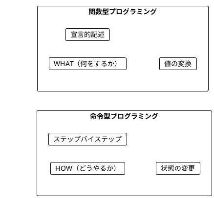
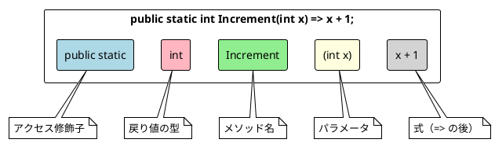
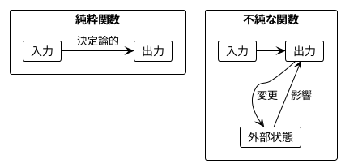
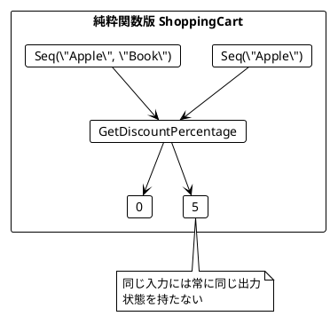
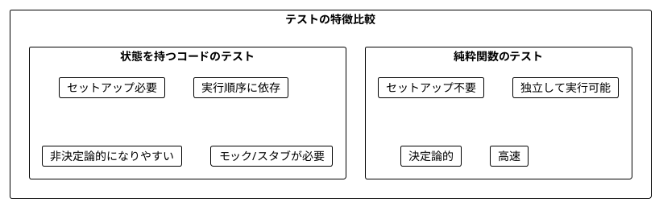
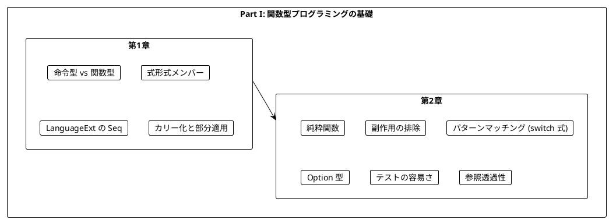

# Part I: 関数型プログラミングの基礎

本章では、関数型プログラミング（FP）の基本概念を C# と LanguageExt ライブラリを使って学びます。命令型プログラミングとの違いを理解し、純粋関数の利点を実感することが目標です。

---

## 第1章: 関数型プログラミング入門

### 1.1 命令型 vs 関数型

プログラミングには大きく分けて2つのパラダイムがあります。



**命令型プログラミング**は「どうやるか」を記述します。

```csharp
// 命令型でワードスコアを計算
public static int WordScoreImperative(string word)
{
    var score = 0;
    foreach (var _ in word)
    {
        score = score + 1;
    }
    return score;
}
```

**関数型プログラミング**は「何をするか」を記述します。

```csharp
// 関数型でワードスコアを計算
public static int WordScore(string word) => word.Length;
```

### 1.2 C# での基本的な関数定義

C# では式形式メンバー（expression-bodied member）を使って簡潔に関数を定義できます。

**ソースファイル**: `app/csharp/src/Ch01/IntroCSharp.cs`

```csharp
/// <summary>
/// 数値をインクリメント
/// </summary>
public static int Increment(int x) => x + 1;

/// <summary>
/// 文字列の最初の文字を取得
/// </summary>
public static char GetFirstCharacter(string s) => s[0];

/// <summary>
/// 単語のスコアを計算（文字数）
/// </summary>
public static int WordScore(string word) => word.Length;

/// <summary>
/// 2つの数値を加算
/// </summary>
public static int Add(int a, int b) => a + b;

/// <summary>
/// 数値を2倍にする
/// </summary>
public static int Double(int x) => x * 2;

/// <summary>
/// 数値が偶数かどうかを判定
/// </summary>
public static bool IsEven(int n) => n % 2 == 0;
```

### 1.3 関数の構造



### 1.4 LanguageExt によるカリー化と部分適用

C# では標準ではカリー化をサポートしていませんが、LanguageExt を使うことで実現できます。

```csharp
using LanguageExt;
using static LanguageExt.Prelude;

/// <summary>
/// カリー化された加算関数
/// curry を使用して (int, int) -> int を int -> int -> int に変換
/// </summary>
public static Func<int, Func<int, int>> AddCurried =>
    curry<int, int, int>((a, b) => a + b);

/// <summary>
/// 部分適用: 5を加算する関数
/// </summary>
public static Func<int, int> AddFive => AddCurried(5);

// 使用例
var result = AddFive(3);  // 8
```

### 1.5 LanguageExt の Seq を使った操作

LanguageExt の `Seq<T>` はイミュータブルなシーケンスです。

```csharp
using LanguageExt;
using static LanguageExt.Prelude;

/// <summary>
/// Seq を使った宣言的なリスト操作
/// </summary>
public static Seq<int> DoubleAll(Seq<int> numbers) =>
    numbers.Map(x => x * 2);

/// <summary>
/// 偶数のみをフィルタリング
/// </summary>
public static Seq<int> FilterEvens(Seq<int> numbers) =>
    numbers.Filter(IsEven);

/// <summary>
/// 合計を計算
/// </summary>
public static int Sum(Seq<int> numbers) =>
    numbers.Fold(0, (acc, x) => acc + x);

// 使用例
var numbers = Seq(1, 2, 3, 4, 5);
var doubled = DoubleAll(numbers);     // Seq(2, 4, 6, 8, 10)
var evens = FilterEvens(numbers);     // Seq(2, 4)
var total = Sum(numbers);             // 15
```

### 1.6 Option を使った安全な操作

LanguageExt の `Option<T>` は値の有無を型で表現します。

```csharp
using LanguageExt;
using static LanguageExt.Prelude;

/// <summary>
/// 安全に最初の文字を取得（空文字列の場合は None）
/// </summary>
public static Option<char> GetFirstCharacterSafe(string s) =>
    string.IsNullOrEmpty(s)
        ? None
        : Some(s[0]);

/// <summary>
/// 安全な除算（ゼロ除算を防ぐ）
/// </summary>
public static Option<int> SafeDivide(int a, int b) =>
    b == 0
        ? None
        : Some(a / b);

// 使用例
var result = SafeDivide(10, 2);  // Some(5)
var error = SafeDivide(10, 0);   // None

// パターンマッチングで処理
result.Match(
    Some: x => Console.WriteLine($"結果: {x}"),
    None: () => Console.WriteLine("除算エラー")
);
```

### 1.7 関数の合成

複数の関数を組み合わせて新しい関数を作成できます。

```csharp
/// <summary>
/// 2つの関数を合成
/// </summary>
public static Func<A, C> Compose<A, B, C>(Func<A, B> f, Func<B, C> g) =>
    x => g(f(x));

/// <summary>
/// インクリメントして2倍にする合成関数
/// </summary>
public static Func<int, int> IncrementThenDouble =>
    Compose<int, int, int>(Increment, Double);

/// <summary>
/// 2倍にしてインクリメントする合成関数
/// </summary>
public static Func<int, int> DoubleThenIncrement =>
    Compose<int, int, int>(Double, Increment);

// 使用例
var r1 = IncrementThenDouble(3);  // (3 + 1) * 2 = 8
var r2 = DoubleThenIncrement(3);  // (3 * 2) + 1 = 7
```

### 1.8 学習ポイント

| 概念 | 命令型 | 関数型 |
|------|--------|--------|
| 焦点 | 手順（How） | 結果（What） |
| 状態 | 変更する | 変換する |
| ループ | for/while | Map/Filter/Fold |
| データ | ミュータブル | イミュータブル |
| 関数 | メソッド呼び出し | 式と合成 |

### 1.9 F# / Scala との比較

| 機能 | C# + LanguageExt | F# | Scala |
|------|------------------|-----|-------|
| 関数定義 | `int F(int x) => ...` | `let f x = ...` | `def f(x: Int) = ...` |
| 型注釈 | `(int x)` | `(x: int)` | `(x: Int)` |
| パイプライン | `.Map().Filter()` | `x \|> f` | メソッドチェーン |
| 部分適用 | `curry` で変換 | デフォルト | `.curried` で変換 |
| Option | `Option<T>` | `Option<'a>` | `Option[A]` |
| Seq | `Seq<T>` | `Seq<'a>` | `Seq[A]` |

---

## 第2章: 純粋関数とテスト

### 2.1 純粋関数とは

純粋関数（Pure Function）は以下の特徴を持つ関数です:

1. **同じ入力には常に同じ出力を返す**
2. **副作用がない**（外部状態を変更しない）



### 2.2 純粋関数の例

**ソースファイル**: `app/csharp/src/Ch02/PureFunctions.cs`

```csharp
/// <summary>
/// 数値をインクリメント（純粋関数）
/// </summary>
public static int Increment(int x) => x + 1;

/// <summary>
/// 2つの数値を加算（純粋関数）
/// </summary>
public static int Add(int a, int b) => a + b;

/// <summary>
/// 数値を2倍にする（純粋関数）
/// </summary>
public static int Double(int x) => x * 2;

/// <summary>
/// 数値が偶数かどうかを判定（純粋関数）
/// </summary>
public static bool IsEven(int n) => n % 2 == 0;

/// <summary>
/// 文字列を大文字に変換（純粋関数）
/// </summary>
public static string ToUpperCase(string s) => s.ToUpper();

/// <summary>
/// 文字列を反転（純粋関数）
/// </summary>
public static string Reverse(string s) =>
    new string(s.Reverse().ToArray());
```

**純粋ではない関数の例**:

```csharp
/// <summary>
/// 不純な関数 - 毎回異なる値を返す
/// </summary>
public static double RandomPart(double x) =>
    x * Random.Shared.NextDouble();

/// <summary>
/// 不純な関数 - 現在時刻を返す
/// </summary>
public static long CurrentTime() =>
    DateTimeOffset.UtcNow.ToUnixTimeMilliseconds();
```

### 2.3 ショッピングカートの例

状態を持つクラスの問題点を見てみましょう。

#### 問題のあるコード（オブジェクト指向的なアプローチ）

```csharp
// ミュータブルな状態を持つ問題のあるアプローチ
public class ShoppingCartBad
{
    private List<string> items = new();
    private bool bookAdded = false;

    public void AddItem(string item)
    {
        items.Add(item);
        if (item == "Book")
            bookAdded = true;
    }

    public int GetDiscountPercentage() =>
        bookAdded ? 5 : 0;

    public List<string> GetItems() => items;  // 問題: 内部状態への参照
}
```

#### 純粋関数による解決

```csharp
using LanguageExt;
using static LanguageExt.Prelude;

/// <summary>
/// カート内の商品リストから割引率を計算
/// Book が含まれていれば 5%、それ以外は 0%
/// </summary>
public static int GetDiscountPercentage(Seq<string> items) =>
    items.Exists(x => x == "Book") ? 5 : 0;

/// <summary>
/// 商品を追加した新しいカートを返す
/// </summary>
public static Seq<string> AddItem(Seq<string> items, string item) =>
    items.Add(item);

/// <summary>
/// 商品を削除した新しいカートを返す
/// </summary>
public static Seq<string> RemoveItem(Seq<string> items, string item) =>
    items.Filter(i => i != item);
```



### 2.4 複数条件による割引計算

C# のパターンマッチング（switch 式）を使った複雑なビジネスロジックの実装:

```csharp
/// <summary>
/// 複数の条件による割引計算
/// </summary>
public static int GetAdvancedDiscountPercentage(Seq<string> items)
{
    var hasBook = items.Exists(x => x == "Book");
    var hasElectronics = items.Exists(item =>
        item == "Laptop" || item == "Phone" || item == "Tablet");
    var itemCount = items.Count;

    return (hasBook, hasElectronics, itemCount) switch
    {
        (true, true, _) => 15,      // Book + 電子機器 → 15%
        (true, _, >= 5) => 10,      // Book + 5個以上 → 10%
        (true, _, _) => 5,          // Book のみ → 5%
        (_, true, >= 3) => 7,       // 電子機器 + 3個以上 → 7%
        (_, _, >= 10) => 5,         // 10個以上 → 5%
        _ => 0                      // それ以外 → 0%
    };
}
```

### 2.5 チップ計算の例

**ソースファイル**: `app/csharp/src/Ch02/PureFunctions.cs`

```csharp
/// <summary>
/// グループサイズに応じたチップ率を計算
/// 6人以上 → 20%
/// 1-5人 → 10%
/// 0人 → 0%
/// </summary>
public static int GetTipPercentage(Seq<string> names)
{
    var size = names.Count;
    if (size > 5) return 20;
    if (size > 0) return 10;
    return 0;
}

/// <summary>
/// パターンマッチングを使用したチップ率計算
/// </summary>
public static int GetTipPercentageMatch(Seq<string> names) =>
    names.Count switch
    {
        > 5 => 20,
        > 0 => 10,
        _ => 0
    };
```

#### Option 型によるゼロ除算の防止

```csharp
/// <summary>
/// 一人当たりの支払額を計算（チップ込み）
/// Option を使ってゼロ除算を防ぐ
/// </summary>
public static Option<decimal> CalculatePerPerson(
    decimal billAmount,
    Seq<string> names)
{
    var size = names.Count;
    if (size == 0)
        return None;

    var tip = CalculateTip(billAmount, names);
    var total = billAmount + tip;
    return Some(total / size);
}
```

### 2.6 純粋関数のテスト

純粋関数は非常にテストしやすいです。

**ソースファイル**: `app/csharp/tests/Ch02/PureFunctionsTests.cs`

```csharp
[Fact]
public void Increment_AddsOneToNumber()
{
    Assert.Equal(7, PureFunctions.Increment(6));
    Assert.Equal(1, PureFunctions.Increment(0));
    Assert.Equal(-5, PureFunctions.Increment(-6));
    Assert.Equal(int.MaxValue, PureFunctions.Increment(int.MaxValue - 1));
}

[Fact]
public void GetDiscountPercentage_Returns5WhenBookExists()
{
    var items = Seq("Apple", "Book", "Pen");
    Assert.Equal(5, ShoppingCart.GetDiscountPercentage(items));
}

[Fact]
public void SafeDivide_ReturnsNoneForDivisionByZero()
{
    Assert.True(PureFunctions.SafeDivide(10, 0).IsNone);
}
```



### 2.7 文字 'a' を除外するワードスコア

より複雑な例を見てみましょう。

```csharp
/// <summary>
/// 'a' を除外した文字数をスコアとして返す
/// </summary>
public static int WordScore(string word) =>
    word.Replace("a", "").Length;

/// <summary>
/// 大文字小文字を区別せずに 'a' を除外
/// </summary>
public static int WordScoreIgnoreCase(string word) =>
    word.Where(c => c != 'a' && c != 'A').Count();
```

```csharp
// テスト
[Fact]
public void WordScore_ExcludesLetterA()
{
    Assert.Equal(3, PureFunctions.WordScore("Scala"));  // "Scl" → 3
    Assert.Equal(8, PureFunctions.WordScore("function")); // 'a' なし → 8
    Assert.Equal(0, PureFunctions.WordScore(""));        // 空文字 → 0
    Assert.Equal(0, PureFunctions.WordScore("aaa"));     // すべて 'a' → 0
}
```

### 2.8 参照透過性

純粋関数は**参照透過性（Referential Transparency）**を持ちます。

> 式をその評価結果で置き換えても、プログラムの意味が変わらないこと

```csharp
// 参照透過性の例
var score1 = WordScore("Scala");
var score2 = WordScore("Scala");
// score1 と score2 は常に同じ値（3）

// 以下の2つは同等
var total1 = WordScore("Scala") + WordScore("Java");
var total2 = 3 + 2;  // WordScore の結果で置き換え可能
```

---

## まとめ

### Part I で学んだこと



### キーポイント

1. **関数型プログラミング**は「何をするか」を宣言的に記述する
2. **式形式メンバー** (`=>`) で簡潔な関数定義ができる
3. **LanguageExt** で C# に関数型プログラミングの機能を追加できる
4. **純粋関数**は同じ入力に対して常に同じ出力を返す
5. **副作用**を避けることでコードの予測可能性が向上する
6. **switch 式**で複雑な条件分岐を簡潔に記述できる
7. **Option 型**で null 安全なプログラミングができる
8. **純粋関数**はテストが非常に簡単
9. **参照透過性**により、コードの理解と推論が容易になる

### 次のステップ

Part II では、以下のトピックを学びます:

- イミュータブルなデータ操作
- 高階関数（関数を値として扱う）
- `Bind`（flatMap）とネスト構造の平坦化
- LINQ クエリ式

---

## 演習問題

### 問題 1: 純粋関数の識別

以下の関数のうち、純粋関数はどれですか?

```csharp
// A
public static int Double(int x) => x * 2;

// B
private static int counter = 0;
public static int IncrementCounter()
{
    counter++;
    return counter;
}

// C
public static string Greet(string name) => $"Hello, {name}!";

// D
public static long CurrentTime() => DateTimeOffset.UtcNow.ToUnixTimeMilliseconds();
```

<details>
<summary>解答</summary>

**A と C は純粋関数**です。

- A: 同じ入力に対して常に同じ出力を返し、副作用がない
- B: 外部変数 `counter` を変更する副作用がある（不純）
- C: 同じ入力に対して常に同じ出力を返し、副作用がない
- D: 呼び出すたびに異なる値を返す（不純）

</details>

### 問題 2: 純粋関数への書き換え

以下の不純なクラスを純粋関数に書き換えてください。

```csharp
public class Counter
{
    private int value = 0;

    public int Increment()
    {
        value++;
        return value;
    }
}
```

<details>
<summary>解答</summary>

```csharp
public static int Increment(int value) => value + 1;

// 使用例
var v1 = 0;
var v2 = Increment(v1);  // 1
var v3 = Increment(v2);  // 2
```

状態を外部に持ち、関数は値を受け取って新しい値を返すだけにします。

</details>

### 問題 3: テストを書く

以下の関数に対するテストケースを考えてください。

```csharp
public static bool IsEven(int n) => n % 2 == 0;
```

<details>
<summary>解答</summary>

```csharp
// 基本ケース
Assert.True(IsEven(0));
Assert.True(IsEven(2));
Assert.True(IsEven(4));

// 奇数
Assert.False(IsEven(1));
Assert.False(IsEven(3));

// 負の数
Assert.True(IsEven(-2));
Assert.False(IsEven(-3));

// 境界値
Assert.False(IsEven(int.MaxValue));
Assert.True(IsEven(int.MinValue));
```

</details>

### 問題 4: Option 型を使う

以下の関数を `Option` 型を使って安全にしてください。

```csharp
public static int Divide(int a, int b) => a / b;  // b が 0 の場合に例外
```

<details>
<summary>解答</summary>

```csharp
public static Option<int> Divide(int a, int b) =>
    b == 0 ? None : Some(a / b);

// 使用例
var result = Divide(10, 2);
result.Match(
    Some: r => Console.WriteLine($"結果: {r}"),
    None: () => Console.WriteLine("0で除算できません")
);
```

`Option` 型を使うことで、エラーケースを型で表現し、呼び出し側にハンドリングを強制できます。

</details>

### 問題 5: 関数合成

`Increment` と `Double` を使って、「2倍してからインクリメント」する関数を作成してください。

<details>
<summary>解答</summary>

```csharp
public static Func<A, C> Compose<A, B, C>(Func<A, B> f, Func<B, C> g) =>
    x => g(f(x));

public static Func<int, int> DoubleThenIncrement =>
    Compose<int, int, int>(Double, Increment);

// 使用例
var result = DoubleThenIncrement(3);  // (3 * 2) + 1 = 7
```

</details>
