# Part II: 関数型スタイルのプログラミング

本章では、関数型プログラミングの核心となるテクニックを学びます。イミュータブルなデータ操作、高階関数、そして `Bind`（flatMap 相当）による複雑なデータ変換を習得します。

---

## 第3章: イミュータブルなデータ操作

### 3.1 イミュータブルとは

イミュータブル（不変）とは、一度作成されたデータが変更されないことを意味します。データを「変更」する代わりに、新しいデータを「作成」します。

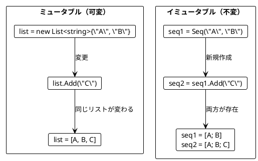

### 3.2 Seq の基本操作

**ソースファイル**: `app/csharp/src/Ch03/ImmutableOperations.cs`

#### 要素の追加

LanguageExt の `Seq<T>` はデフォルトでイミュータブルです。要素を追加すると新しい Seq が作成されます。

```csharp
using LanguageExt;
using static LanguageExt.Prelude;

var appleBook = Seq("Apple", "Book");
var appleBookMango = appleBook.Add("Mango");

// 元の Seq は変わらない
Debug.Assert(appleBook.Count == 2);
// 新しい Seq が作成される
Debug.Assert(appleBookMango.Count == 3);
Debug.Assert(appleBookMango.SequenceEqual(Seq("Apple", "Book", "Mango")));
```

#### スライス操作

```csharp
/// <summary>
/// Seq の先頭 n 個の要素を取得
/// </summary>
public static Seq<T> FirstN<T>(Seq<T> seq, int n) =>
    seq.Take(n);

/// <summary>
/// Seq の末尾 n 個の要素を取得
/// </summary>
public static Seq<T> LastN<T>(Seq<T> seq, int n)
{
    var skipCount = Math.Max(0, seq.Count - n);
    return seq.Skip(skipCount);
}

/// <summary>
/// Seq の最初の 2 要素を取得
/// </summary>
public static Seq<T> FirstTwo<T>(Seq<T> seq) =>
    FirstN(seq, 2);

/// <summary>
/// Seq の最後の 2 要素を取得
/// </summary>
public static Seq<T> LastTwo<T>(Seq<T> seq) =>
    LastN(seq, 2);
```

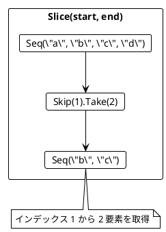

### 3.3 Seq の変換例

```csharp
/// <summary>
/// 最初の 2 要素を末尾に移動
/// </summary>
public static Seq<T> MoveFirstTwoToEnd<T>(Seq<T> seq)
{
    var first = FirstTwo(seq);
    var rest = seq.Skip(2);
    return rest.Concat(first);
}

// 使用例
Debug.Assert(MoveFirstTwoToEnd(Seq("a", "b", "c")).SequenceEqual(Seq("c", "a", "b")));

/// <summary>
/// 最後の要素の前に新しい要素を挿入
/// </summary>
public static Seq<T> InsertBeforeLast<T>(Seq<T> seq, T element)
{
    var withoutLast = seq.Take(seq.Count - 1);
    var last = LastN(seq, 1);
    return withoutLast.Add(element).Concat(last);
}

Debug.Assert(InsertBeforeLast(Seq("a", "b"), "c").SequenceEqual(Seq("a", "c", "b")));
```

### 3.4 旅程の再計画

旅行の計画変更をイミュータブルに行う例です。

```csharp
/// <summary>
/// 指定した都市の前に新しい都市を挿入
/// </summary>
public static Seq<string> Replan(Seq<string> plan, string newCity, string beforeCity)
{
    var index = plan.ToList().FindIndex(c => c == beforeCity);
    if (index < 0) index = plan.Count;

    var citiesBefore = plan.Take(index);
    var citiesAfter = plan.Skip(index);
    return citiesBefore.Add(newCity).Concat(citiesAfter);
}

var planA = Seq("Paris", "Berlin", "Kraków");
var planB = Replan(planA, "Vienna", "Kraków");

Debug.Assert(planB.SequenceEqual(Seq("Paris", "Berlin", "Vienna", "Kraków")));
Debug.Assert(planA.SequenceEqual(Seq("Paris", "Berlin", "Kraków"))); // 元の計画は変わらない!
```

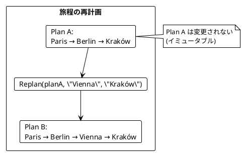

### 3.5 String と Seq の類似性

String と Seq は似た操作ができます。

| 操作 | C# Seq | C# String |
|------|--------|-----------|
| 結合 | `Concat` または `Add` | `+` または `String.Concat` |
| 切り出し | `Skip`, `Take` | `Substring` |
| サイズ | `Count` | `Length` |

```csharp
// Seq の操作
var abSeq = Seq("a", "b");
var cdSeq = Seq("c", "d");
var abcdSeq = abSeq.Concat(cdSeq);
Debug.Assert(abcdSeq.SequenceEqual(Seq("a", "b", "c", "d")));

// String の操作
var abStr = "ab";
var cdStr = "cd";
var abcdStr = abStr + cdStr;
Debug.Assert(abcdStr == "abcd");
```

### 3.6 名前の省略

```csharp
/// <summary>
/// 名前を省略形に変換（例: "Alonzo Church" -> "A. Church"）
/// </summary>
public static string Abbreviate(string name)
{
    var initial = name.Substring(0, 1);
    var separatorIndex = name.IndexOf(' ');
    if (separatorIndex < 0)
        return name;

    var lastName = name.Substring(separatorIndex + 1);
    return $"{initial}. {lastName}";
}

Debug.Assert(Abbreviate("Alonzo Church") == "A. Church");
Debug.Assert(Abbreviate("A. Church") == "A. Church");
```

---

## 第4章: 関数を値として扱う

### 4.1 高階関数とは

高階関数（Higher-Order Function）とは、以下のいずれかを満たす関数です:

1. 関数を引数として受け取る
2. 関数を戻り値として返す

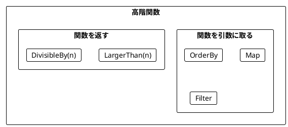

### 4.2 関数を引数として渡す

**ソースファイル**: `app/csharp/src/Ch04/HigherOrderFunctions.cs`

#### OrderBy - ソート基準を関数で指定

```csharp
public static int WordScore(string word) =>
    word.Replace("a", "").Length;

var words = Seq("rust", "java");
var sortedWords = toSeq(words.OrderBy(WordScore));

Debug.Assert(sortedWords.SequenceEqual(Seq("java", "rust")));
// java: 2文字 (j, v), rust: 4文字 (r, u, s, t)
```

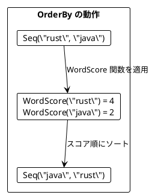

#### Map - 各要素を変換

```csharp
public static int Len(string s) => s.Length;

var lengths = Seq("scala", "rust", "ada").Map(Len);
Debug.Assert(lengths.SequenceEqual(Seq(5, 4, 3)));

public static int Double(int i) => i * 2;
var doubles = Seq(5, 1, 2, 4, 0).Map(Double);
Debug.Assert(doubles.SequenceEqual(Seq(10, 2, 4, 8, 0)));
```

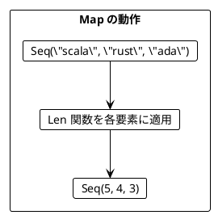

#### Filter - 条件に合う要素を抽出

```csharp
public static bool IsOdd(int i) => i % 2 == 1;

var odds = Seq(5, 1, 2, 4, 0).Filter(IsOdd);
Debug.Assert(odds.SequenceEqual(Seq(5, 1)));

var large = Seq(5, 1, 2, 4, 0).Filter(i => i > 4);
Debug.Assert(large.SequenceEqual(Seq(5)));
```

#### Fold - 畳み込み

```csharp
var sum = Seq(5, 1, 2, 4, 100).Fold(0, (acc, i) => acc + i);
Debug.Assert(sum == 112);

var maximum = Seq(5, 1, 2, 4, 15).Fold(int.MinValue, (maxVal, i) =>
    i > maxVal ? i : maxVal);
Debug.Assert(maximum == 15);
```

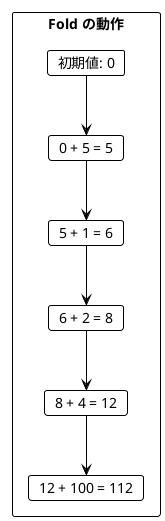

### 4.3 レコード型とパターン

**ソースファイル**: `app/csharp/src/Ch04/HigherOrderFunctions.cs`

```csharp
/// <summary>
/// プログラミング言語を表すレコード型
/// </summary>
public record ProgrammingLanguage(string Name, int Year);

var javaLang = new ProgrammingLanguage("Java", 1995);
var scalaLang = new ProgrammingLanguage("Scala", 2004);

var languages = Seq(javaLang, scalaLang);

// フィールドにアクセス
var names = languages.Map(lang => lang.Name);
Debug.Assert(names.SequenceEqual(Seq("Java", "Scala")));

// 条件でフィルタ
var young = languages.Filter(lang => lang.Year > 2000);
Debug.Assert(young.SequenceEqual(Seq(scalaLang)));
```

### 4.4 関数を返す関数

```csharp
/// <summary>
/// n より大きいかを判定する関数を返す
/// </summary>
public static Func<int, bool> LargerThan(int n) =>
    i => i > n;

var large = Seq(5, 1, 2, 4, 0).Filter(LargerThan(4));
Debug.Assert(large.SequenceEqual(Seq(5)));

var medium = Seq(5, 1, 2, 4, 0).Filter(LargerThan(1));
Debug.Assert(medium.SequenceEqual(Seq(5, 2, 4)));
```

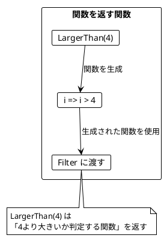

### 4.5 カリー化と部分適用

LanguageExt の `curry` 関数を使ってカリー化できます。

```csharp
using static LanguageExt.Prelude;

// カリー化された加算関数
public static Func<int, Func<int, int>> AddCurried =>
    curry<int, int, int>((a, b) => a + b);

// 部分適用: 5を足す関数
public static Func<int, int> AddFive => AddCurried(5);

Debug.Assert(AddFive(3) == 8);
Debug.Assert(AddFive(10) == 15);
```

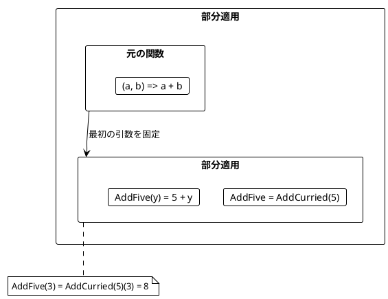

### 4.6 ワードスコアリングの例

複数のスコアリングロジックを組み合わせる例です。

```csharp
public static int WordScore(string word) => word.Replace("a", "").Length;
public static int Bonus(string word) => word.Contains('c') ? 5 : 0;
public static int Penalty(string word) => word.Contains('s') ? 7 : 0;

var words = Seq("ada", "haskell", "scala", "java", "rust");

/// <summary>
/// 指定したスコア関数でワードをランキング
/// </summary>
public static Seq<string> RankedWords(Seq<string> words, Func<string, int> scoreFn) =>
    toSeq(words.OrderByDescending(scoreFn));

// 基本スコアでランキング
var ranking1 = RankedWords(words, WordScore);
Debug.Assert(ranking1.Head == "haskell");

// ボーナス付きスコアでランキング
var ranking2 = RankedWords(words, w => WordScore(w) + Bonus(w));
// scala: 3 + 5 = 8, haskell: 7 + 0 = 7
Debug.Assert(ranking2.Head == "scala");

// ボーナスとペナルティ付きスコアでランキング
var ranking3 = RankedWords(words, w => WordScore(w) + Bonus(w) - Penalty(w));
// java: 2, scala: 1, ada: 0, haskell: 0, rust: -3
Debug.Assert(ranking3.Head == "java");
```

---

## 第5章: Bind とネスト構造

### 5.1 Flatten と Bind

**ソースファイル**: `app/csharp/src/Ch05/FlatMapOperations.cs`

#### Bind - ネストした Seq を平坦化

```csharp
public record Book(string Title, Seq<string> Authors);

var books = Seq(
    new Book("FP in Scala", Seq("Chiusano", "Bjarnason")),
    new Book("The Hobbit", Seq("Tolkien"))
);

// Map だけだとネストする
var authorSeqs = books.Map(b => b.Authors);
// Seq<Seq<string>>: [ ["Chiusano", "Bjarnason"], ["Tolkien"] ]

// Bind で平坦化しながら変換
var authors = books.Bind(b => b.Authors);
// Seq<string>: ["Chiusano", "Bjarnason", "Tolkien"]
```

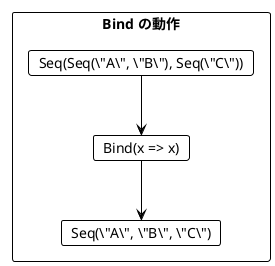

#### Bind = Map + Flatten

C# の LanguageExt における `Bind` は Scala の `flatMap` に相当します。

```csharp
// Map して Flatten
var authors1 = books.Map(b => b.Authors).Bind(x => x);

// Bind で同じことを1行で
var authors2 = books.Bind(b => b.Authors);

Debug.Assert(authors1.SequenceEqual(authors2));
// ["Chiusano", "Bjarnason", "Tolkien"]
```

### 5.2 Bind によるリストサイズの変化

```csharp
// 要素数が増える
var duplicate = Seq(1, 2, 3).Bind(i => Seq(i, i + 10));
// [1, 11, 2, 12, 3, 13] - 6要素

// 要素数が同じ
var doubled = Seq(1, 2, 3).Bind(i => Seq(i * 2));
// [2, 4, 6] - 3要素

// 要素数が減る（フィルタリング効果）
var evens = Seq(1, 2, 3).Bind(i =>
    i % 2 == 0 ? Seq(i) : Empty);
// [2] - 1要素
```

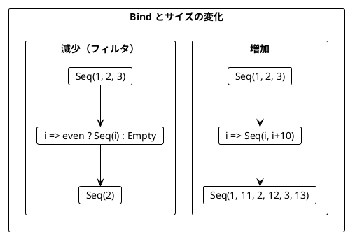

### 5.3 ネストした Bind

複数の Seq を組み合わせる場合、Bind をネストします。

```csharp
public record Movie(string Title);

public static Seq<Movie> BookAdaptations(string author) =>
    author == "Tolkien"
        ? Seq(new Movie("An Unexpected Journey"), new Movie("The Desolation of Smaug"))
        : Empty;

var books = Seq(
    new Book("FP in Scala", Seq("Chiusano", "Bjarnason")),
    new Book("The Hobbit", Seq("Tolkien"))
);

// ネストした Bind
var recommendations = books.Bind(book =>
    book.Authors.Bind(author =>
        BookAdaptations(author).Map(movie =>
            $"You may like {movie.Title}, because you liked {author}'s {book.Title}")));

// 結果:
// [ "You may like An Unexpected Journey, because you liked Tolkien's The Hobbit"
//   "You may like The Desolation of Smaug, because you liked Tolkien's The Hobbit" ]
```

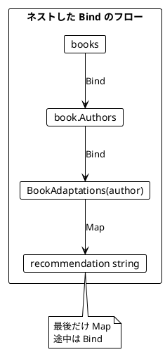

### 5.4 LINQ クエリ式

C# の LINQ クエリ式は、ネストした Bind を読みやすく書けます。

```csharp
// Bind/Map 版
var c1 = books.Bind(book =>
    book.Authors.Bind(author =>
        BookAdaptations(author).Map(movie =>
            $"You may like {movie.Title}, because you liked {author}'s {book.Title}")));

// LINQ クエリ式版（等価）
var c2 = (from book in books
          from author in book.Authors
          from movie in BookAdaptations(author)
          select $"You may like {movie.Title}, because you liked {author}'s {book.Title}").ToSeq();

Debug.Assert(c1.SequenceEqual(c2));
```

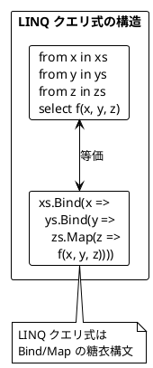

### 5.5 円内の点の判定

LINQ クエリ式でフィルタリングも行う例です。

```csharp
public record Point(int X, int Y);

var points = Seq(new Point(5, 2), new Point(1, 1));
var radiuses = Seq(2, 1);

public static bool IsInside(Point point, int radius) =>
    radius * radius >= point.X * point.X + point.Y * point.Y;

// 全組み合わせを生成
var allCombinations = (from r in radiuses
                       from point in points
                       select $"Point({point.X},{point.Y}) is within a radius of {r}: {IsInside(point, r)}").ToSeq();

// 結果:
// [ "Point(5,2) is within a radius of 2: false"
//   "Point(1,1) is within a radius of 2: true"
//   "Point(5,2) is within a radius of 1: false"
//   "Point(1,1) is within a radius of 1: false" ]
```

#### where によるフィルタリング

```csharp
// where を使ったフィルタリング
var insidePoints = (from r in radiuses
                    from point in points
                    where IsInside(point, r)
                    select $"Point({point.X},{point.Y}) is within a radius of {r}").ToSeq();

// 結果: [ "Point(1,1) is within a radius of 2" ]
```

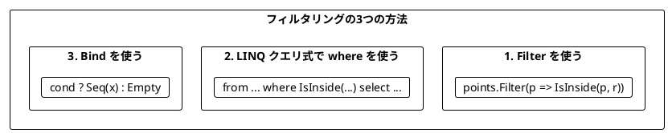

### 5.6 LINQ の柔軟性

C# の LINQ クエリ式は、`Seq`、`IEnumerable`、その他の LINQ 対応型で使えます。

```csharp
// Seq を使った LINQ
var seqResult = (from a in Seq(1, 2)
                 from b in Seq(2, 1)
                 select a * b).ToSeq();
// [2, 1, 4, 2] - 重複あり、順序あり

// HashSet への変換
var hashSetResult = new System.Collections.Generic.HashSet<int>(seqResult);
// {1, 2, 4} - 重複なし
```

---

## まとめ

### Part II で学んだこと

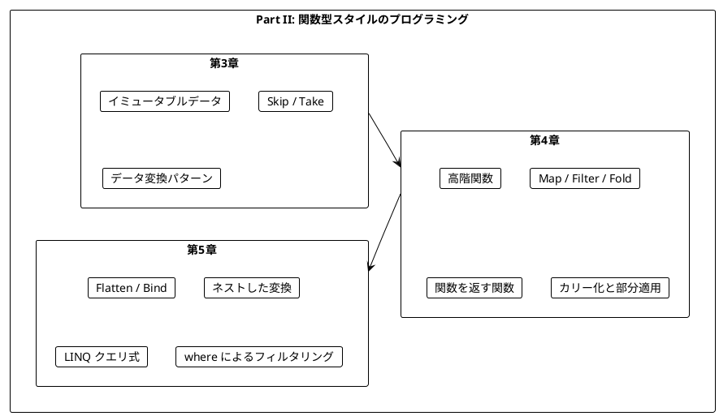

### キーポイント

| 章 | 主要概念 | キー操作 |
|----|----------|----------|
| 第3章 | イミュータブル | `Concat`, `Add`, `Skip`, `Take` |
| 第4章 | 高階関数 | `Map`, `Filter`, `Fold`, `OrderBy` |
| 第5章 | 平坦化 | `Bind`, LINQ クエリ式 |

### C#/LanguageExt と Scala/F# の対応

| 操作 | C# (LanguageExt) | Scala | F# |
|------|------------------|-------|-----|
| 平坦化 | `Bind(x => x)` | `flatten` | `List.concat` |
| flatMap | `Bind` | `flatMap` | `List.collect` |
| 内包表記 | LINQ `from ... select` | `for { x <- xs } yield ...` | `[ for x in xs do ... ]` |
| 畳み込み | `Fold` | `foldLeft` | `List.fold` |
| フィルタ | `Filter` | `filter` | `List.filter` |

### 重要な法則

1. **イミュータブルデータ**: 元のデータは変更せず、新しいデータを作成する
2. **関数は値**: 関数を引数として渡したり、戻り値として返したりできる
3. **Bind パターン**: ネストした構造を平坦化しながら変換する
4. **LINQ クエリ式**: Bind/Map の糖衣構文として使える
5. **メソッドチェーン**: `.` で関数を連鎖させて読みやすくする

### 次のステップ

Part III では、以下のトピックを学びます:

- `Option<T>` 型による安全なエラーハンドリング
- `Either<L, R>` / `Result` 型と複合的なエラー処理

---

## 演習問題

### 問題 1: イミュータブルな操作

以下の関数を実装してください。Seq の中央に要素を挿入する関数です。

```csharp
public static Seq<T> InsertAtMiddle<T>(Seq<T> seq, T element) => ???

// 期待される動作
Debug.Assert(InsertAtMiddle(Seq("a", "b", "c", "d"), "X").SequenceEqual(Seq("a", "b", "X", "c", "d")));
Debug.Assert(InsertAtMiddle(Seq("a", "b"), "X").SequenceEqual(Seq("a", "X", "b")));
```

<details>
<summary>解答</summary>

```csharp
public static Seq<T> InsertAtMiddle<T>(Seq<T> seq, T element)
{
    var middle = seq.Count / 2;
    var before = seq.Take(middle);
    var after = seq.Skip(middle);
    return before.Add(element).Concat(after);
}
```

</details>

### 問題 2: 高階関数

以下の関数を実装してください。条件を満たす要素の数をカウントする関数です。

```csharp
public static int CountWhere<T>(Seq<T> seq, Func<T, bool> predicate) => ???

// 期待される動作
Debug.Assert(CountWhere(Seq(1, 2, 3, 4, 5), i => i > 3) == 2);
Debug.Assert(CountWhere(Seq("a", "bb", "ccc"), s => s.Length > 1) == 2);
```

<details>
<summary>解答</summary>

```csharp
public static int CountWhere<T>(Seq<T> seq, Func<T, bool> predicate) =>
    seq.Filter(predicate).Count;

// または Fold を使って
public static int CountWhere2<T>(Seq<T> seq, Func<T, bool> predicate) =>
    seq.Fold(0, (count, elem) => predicate(elem) ? count + 1 : count);
```

</details>

### 問題 3: LINQ クエリ式

以下のネストした Bind を LINQ クエリ式で書き換えてください。

```csharp
var result = Seq(1, 2).Bind(x =>
    Seq(10, 20).Bind(y =>
        Seq(100, 200).Map(z =>
            x + y + z)));
```

<details>
<summary>解答</summary>

```csharp
var result = (from x in Seq(1, 2)
              from y in Seq(10, 20)
              from z in Seq(100, 200)
              select x + y + z).ToSeq();

// 結果: [111, 211, 121, 221, 112, 212, 122, 222]
```

</details>

### 問題 4: Bind によるフィルタリング

LINQ クエリ式の `where` を使わずに、Bind だけで偶数のみを抽出するコードを書いてください。

```csharp
var numbers = Seq(1, 2, 3, 4, 5, 6);
// 偶数のみを抽出: Seq(2, 4, 6)
```

<details>
<summary>解答</summary>

```csharp
var evenNumbers = numbers.Bind(n =>
    n % 2 == 0 ? Seq(n) : Empty);

// または関数に分離
Seq<int> EvenFilter(int n) =>
    n % 2 == 0 ? Seq(n) : Empty;

var evenNumbers2 = numbers.Bind(EvenFilter);
```

</details>

### 問題 5: メソッドチェーンで書き換え

以下のコードをメソッドチェーンを使って書き換えてください。

```csharp
var result = CountWhere(
    Filter(
        Map(Seq(1, -2, 3, -4, 5), x => x * 2),
        x => x > 0),
    x => true);
```

<details>
<summary>解答</summary>

```csharp
var result = Seq(1, -2, 3, -4, 5)
    .Map(x => x * 2)
    .Filter(x => x > 0)
    .Count;

// 結果: 3 (2, 6, 10 の3つ)
```

メソッドチェーンを使うと、データの変換過程が上から下に読めるようになります。

</details>
