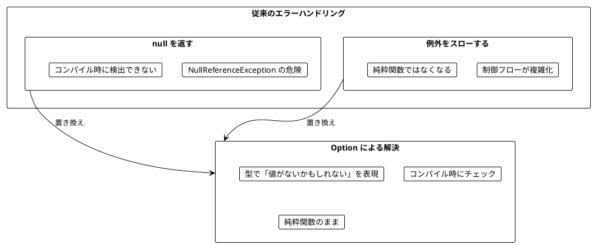
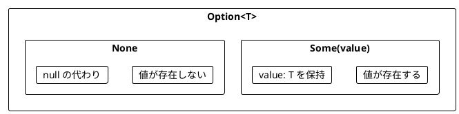
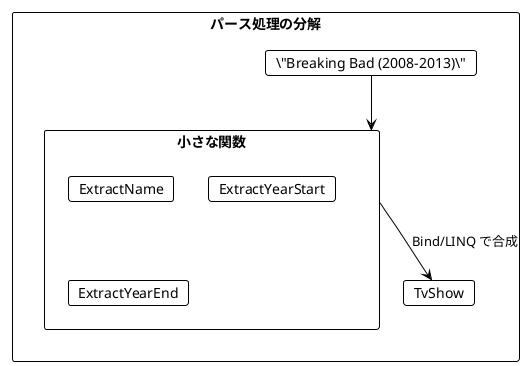
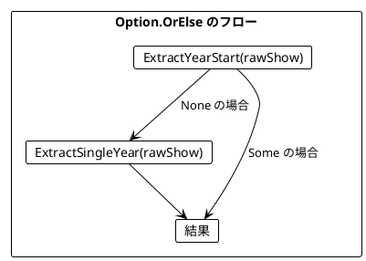
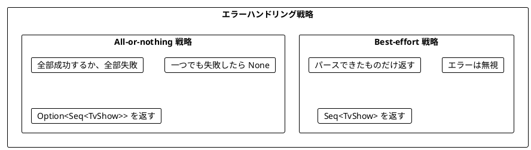
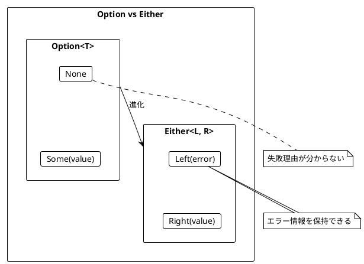
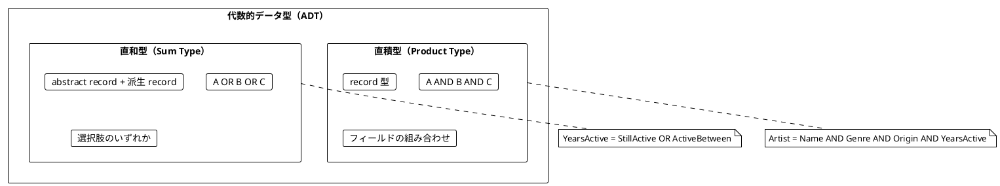
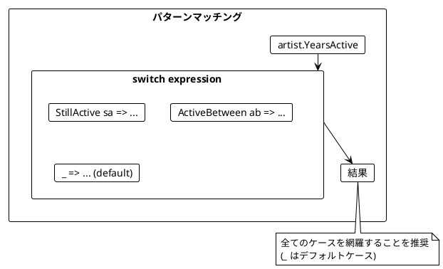
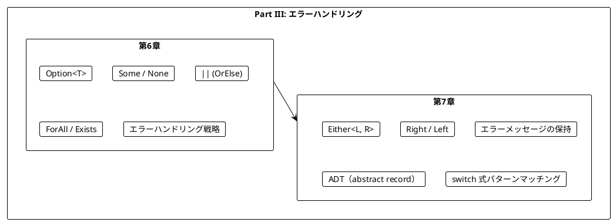

# Part III: エラーハンドリングと Option/Either

本章では、関数型プログラミングにおける安全なエラーハンドリングを学びます。`null` や例外に頼らず、`Option` と `Either` を使って型安全にエラーを扱う方法を習得します。

---

## 第6章: Option 型による安全なエラーハンドリング

### 6.1 なぜ Option が必要か

従来のエラーハンドリングには問題があります。



### 6.2 Option の基本

LanguageExt の `Option<T>` は「`T` 型の値があるか、ないか」を表す型です。



**ソースファイル**: `app/csharp/src/Ch06/OptionHandling.cs`

### 6.3 TV番組のパース例

TV番組の文字列をパースする例で Option の使い方を学びます。

```csharp
using LanguageExt;
using static LanguageExt.Prelude;

public record TvShow(string Title, int Start, int End);

// 入力例: "Breaking Bad (2008-2013)"
// 期待する出力: new TvShow("Breaking Bad", 2008, 2013)
```

#### 例外を使う方法（問題あり）

```csharp
public static TvShow ParseShowUnsafe(string rawShow)
{
    var bracketOpen = rawShow.IndexOf('(');
    var bracketClose = rawShow.IndexOf(')');
    var dash = rawShow.IndexOf('-');

    var name = rawShow.Substring(0, bracketOpen).Trim();
    var yearStart = int.Parse(rawShow.Substring(bracketOpen + 1, dash - bracketOpen - 1));
    var yearEnd = int.Parse(rawShow.Substring(dash + 1, bracketClose - dash - 1));

    return new TvShow(name, yearStart, yearEnd);
}

// 正常ケース
ParseShowUnsafe("Breaking Bad (2008-2013)");
// new TvShow("Breaking Bad", 2008, 2013)

// 異常ケース → 例外がスローされる!
ParseShowUnsafe("Chernobyl (2019)");        // ArgumentOutOfRangeException
ParseShowUnsafe("The Wire 2002-2008");      // ArgumentOutOfRangeException
```

#### Option を使う方法

```csharp
public static Option<TvShow> ParseShow(string rawShow) =>
    ExtractName(rawShow).Bind(name =>
    {
        var yearStart = ExtractYearStart(rawShow) || ExtractSingleYear(rawShow);
        var yearEnd = ExtractYearEnd(rawShow) || ExtractSingleYear(rawShow);

        return from start in yearStart
               from endYear in yearEnd
               select new TvShow(name, start, endYear);
    });

// 正常ケース
ParseShow("Breaking Bad (2008-2013)");
// Some(new TvShow("Breaking Bad", 2008, 2013))

// 異常ケース → None が返される（例外なし）
ParseShow("The Wire 2002-2008");  // None
```

### 6.4 小さな関数から組み立てる

複雑なパース処理を小さな関数に分解します。

```csharp
/// <summary>
/// 文字列を安全に整数に変換
/// </summary>
public static Option<int> TryParseInt(string s) =>
    int.TryParse(s, out var result) ? Some(result) : None;

/// <summary>
/// 名前を抽出
/// </summary>
public static Option<string> ExtractName(string rawShow)
{
    var bracketOpen = rawShow.IndexOf('(');
    return bracketOpen > 0
        ? Some(rawShow.Substring(0, bracketOpen).Trim())
        : None;
}

/// <summary>
/// 開始年を抽出
/// </summary>
public static Option<int> ExtractYearStart(string rawShow)
{
    var bracketOpen = rawShow.IndexOf('(');
    var dash = rawShow.IndexOf('-');
    if (bracketOpen != -1 && dash > bracketOpen + 1)
    {
        var yearStr = rawShow.Substring(bracketOpen + 1, dash - bracketOpen - 1);
        return TryParseInt(yearStr);
    }
    return None;
}

/// <summary>
/// 終了年を抽出
/// </summary>
public static Option<int> ExtractYearEnd(string rawShow)
{
    var dash = rawShow.IndexOf('-');
    var bracketClose = rawShow.IndexOf(')');
    if (dash != -1 && bracketClose > dash + 1)
    {
        var yearStr = rawShow.Substring(dash + 1, bracketClose - dash - 1);
        return TryParseInt(yearStr);
    }
    return None;
}
```



### 6.5 Option の OrElse によるフォールバック

LanguageExt では `||` 演算子または `OrElse` を使って、最初の Option が `None` の場合に代替を試すことができます。

```csharp
var seven = Some(7);
var eight = Some(8);
Option<int> none = None;

seven || eight;    // Some(7) - 最初が Some なのでそのまま
none || eight;     // Some(8) - 最初が None なので代替を使用
seven || none;     // Some(7)
none || none;      // None
```

#### 単年の番組に対応する

「Chernobyl (2019)」のような単年の番組をパースできるようにします。

```csharp
/// <summary>
/// 単年を抽出
/// </summary>
public static Option<int> ExtractSingleYear(string rawShow)
{
    var dash = rawShow.IndexOf('-');
    var bracketOpen = rawShow.IndexOf('(');
    var bracketClose = rawShow.IndexOf(')');
    if (dash == -1 && bracketOpen != -1 && bracketClose > bracketOpen + 1)
    {
        var yearStr = rawShow.Substring(bracketOpen + 1, bracketClose - bracketOpen - 1);
        return TryParseInt(yearStr);
    }
    return None;
}

public static Option<TvShow> ParseShow(string rawShow) =>
    ExtractName(rawShow).Bind(name =>
    {
        var yearStart = ExtractYearStart(rawShow) || ExtractSingleYear(rawShow);
        var yearEnd = ExtractYearEnd(rawShow) || ExtractSingleYear(rawShow);

        return from start in yearStart
               from endYear in yearEnd
               select new TvShow(name, start, endYear);
    });

// これで単年の番組もパースできる
ParseShow("Chernobyl (2019)");
// Some(new TvShow("Chernobyl", 2019, 2019))
```



### 6.6 Option の主要メソッド

| メソッド | 説明 | 例 |
|---------|------|-----|
| `Map` | 値があれば変換 | `Some(5).Map(x => x * 2)` → `Some(10)` |
| `Bind` | 値があれば Option を返す関数を適用 | `Some(5).Bind(x => Some(x * 2))` → `Some(10)` |
| `Filter` | 条件を満たさなければ None | `Some(5).Filter(x => x > 10)` → `None` |
| `\|\|` | None なら代替を使用 | `None \|\| Some(5)` → `Some(5)` |
| `IfNone` | None ならデフォルト値 | `None.IfNone(0)` → `0` |
| `ToSeq` | Seq に変換 | `Some(5).ToSeq()` → `Seq(5)` |

```csharp
Option<int> year = Some(996);
Option<int> noYear = None;

// Map
year.Map(x => x * 2);     // Some(1992)
noYear.Map(x => x * 2);   // None

// Bind
year.Bind(y => Some(y * 2));     // Some(1992)
noYear.Bind(y => Some(y * 2));   // None

// Filter
year.Filter(x => x < 2020);   // Some(996)
year.Filter(x => x > 2020);   // None

// || (OrElse)
year || Some(2020);     // Some(996)
noYear || Some(2020);   // Some(2020)
```

### 6.7 エラーハンドリング戦略

複数の要素をパースする場合、2つの戦略があります。



#### Best-effort 戦略

```csharp
public static Seq<TvShow> ParseShowsBestEffort(Seq<string> rawShows) =>
    rawShows.Bind(raw => ParseShow(raw).ToSeq());

var rawShows = Seq(
    "Breaking Bad (2008-2013)",
    "The Wire 2002 2008",        // 無効な形式
    "Mad Men (2007-2015)"
);

ParseShowsBestEffort(rawShows);
// Seq(TvShow("Breaking Bad", ...), TvShow("Mad Men", ...))
// 無効なものは無視される
```

#### All-or-nothing 戦略

```csharp
public static Option<Seq<TvShow>> ParseShowsAllOrNothing(Seq<string> rawShows)
{
    var parsed = rawShows.Map(ParseShow);
    return parsed.ForAll(opt => opt.IsSome)
        ? Some(parsed.Bind(opt => opt.ToSeq()))
        : None;
}

// 全部成功 → Some(...)
ParseShowsAllOrNothing(Seq("Breaking Bad (2008-2013)", "Mad Men (2007-2015)"));
// Some(Seq(TvShow("Breaking Bad", ...), TvShow("Mad Men", ...)))

// 一つでも失敗 → None
ParseShowsAllOrNothing(Seq("Breaking Bad (2008-2013)", "Invalid"));
// None
```

### 6.8 ForAll と Exists

Option で条件判定をする際に便利なメソッドです。

| メソッド | 動作 |
|----------|------|
| `ForAll(p)` | None → true, Some(x) → p(x) |
| `Exists(p)` | None → false, Some(x) → p(x) |

```csharp
Option<int> year = Some(996);
Option<int> noYear = None;

// ForAll - 「全て」または「存在しない」
year.ForAll(x => x < 2020);     // true (996 < 2020)
noYear.ForAll(x => x < 2020);   // true (値がないので「全て」が自明に真)
year.ForAll(x => x > 2020);     // false

// Exists - 「存在して条件を満たす」
year.Exists(x => x < 2020);     // true
noYear.Exists(x => x < 2020);   // false (値がないので存在しない)
```

#### 実用例: ユーザーのメールフィルタリング

```csharp
public record User(string Name, Option<string> Email, int Age);

var users = Seq(
    new User("Alice", Some("alice@example.com"), 25),
    new User("Bob", None, 30),
    new User("Charlie", Some("charlie@test.com"), 17)
);

// メールアドレスが設定されていないか、example.com ドメイン
public static Seq<User> FilterByEmailDomain(Seq<User> users, string domain) =>
    users.Filter(user =>
        user.Email.ForAll(email => email.EndsWith(domain)));

FilterByEmailDomain(users, "@example.com");
// Seq(Alice, Bob) - Bob は None なので ForAll = true

// メールアドレスが設定されていて、test.com ドメイン
public static Seq<User> FilterByEmailDomainExists(Seq<User> users, string domain) =>
    users.Filter(user =>
        user.Email.Exists(email => email.EndsWith(domain)));

FilterByEmailDomainExists(users, "@test.com");
// Seq(Charlie)
```

---

## 第7章: Either 型と複合的なエラー処理

### 7.1 Option の限界

`Option` は「値があるかないか」しか表現できません。**なぜ失敗したのか**を伝えられません。



### 7.2 Either の基本

LanguageExt の `Either<L, R>` は「`R` 型の成功値か、`L` 型のエラーか」を表す型です。

- `Right(value)`: 成功
- `Left(error)`: 失敗（エラー情報を保持）

**ソースファイル**: `app/csharp/src/Ch07/ResultHandling.cs`

```csharp
using LanguageExt;
using static LanguageExt.Prelude;

public static Either<string, string> ExtractName(string rawShow)
{
    var bracketOpen = rawShow.IndexOf('(');
    return bracketOpen > 0
        ? Right(rawShow.Substring(0, bracketOpen).Trim())
        : Left($"Can't extract name from '{rawShow}'");
}

ExtractName("The Wire (2002-2008)");  // Right("The Wire")
ExtractName("(2022)");                // Left("Can't extract name from '(2022)'")
```

### 7.3 Either を使ったパース

```csharp
public static Either<string, int> ExtractYearStart(string rawShow)
{
    var bracketOpen = rawShow.IndexOf('(');
    var dash = rawShow.IndexOf('-');
    if (bracketOpen != -1 && dash > bracketOpen + 1)
    {
        var yearStr = rawShow.Substring(bracketOpen + 1, dash - bracketOpen - 1);
        return TryParseInt(yearStr);
    }
    return Left($"Can't extract start year from '{rawShow}'");
}

ExtractYearStart("The Wire (2002-2008)");  // Right(2002)
ExtractYearStart("The Wire (-2008)");      // Left("Can't extract start year from 'The Wire (-2008)'")
ExtractYearStart("The Wire (oops-2008)");  // Left("Can't parse 'oops' as integer")
```

### 7.4 Either の OrElse によるフォールバック

```csharp
public static Either<L, R> OrElse<L, R>(this Either<L, R> either, Either<L, R> alternative) =>
    either.IsRight ? either : alternative;

var first = Right<string, int>(42);
var alternative = Right<string, int>(100);
var error = Left<string, int>("error");

first.OrElse(alternative);      // Right(42) - 最初が Right なのでそのまま
error.OrElse(alternative);      // Right(100) - 最初が Left なので代替を使用
```

### 7.5 Either による完全なパーサー

```csharp
public static Either<string, TvShow> ParseShow(string rawShow) =>
    ExtractName(rawShow).Bind(name =>
    {
        var yearStart = ExtractYearStart(rawShow).OrElse(ExtractSingleYear(rawShow));
        var yearEnd = ExtractYearEnd(rawShow).OrElse(ExtractSingleYear(rawShow));

        return from start in yearStart
               from endYear in yearEnd
               select new TvShow(name, start, endYear);
    });

ParseShow("The Wire (2002-2008)");  // Right(TvShow("The Wire", 2002, 2008))
ParseShow("Mad Men ()");            // Left("Can't extract single year from 'Mad Men ()'")
ParseShow("(2002-2008)");           // Left("Can't extract name from '(2002-2008)'")
```

### 7.6 バリデーション

Either はバリデーションに最適です。

```csharp
public static Either<string, int> ValidateAge(int age) =>
    age < 0 ? Left("Age cannot be negative")
    : age > 150 ? Left("Age cannot be greater than 150")
    : Right(age);

public static Either<string, string> ValidateName(string name) =>
    string.IsNullOrWhiteSpace(name) ? Left("Name cannot be empty")
    : name.Length > 100 ? Left("Name cannot be longer than 100 characters")
    : Right(name);

public static Either<string, string> ValidateEmail(string email) =>
    string.IsNullOrWhiteSpace(email) ? Left("Email cannot be empty")
    : !email.Contains('@') ? Left("Email must contain @")
    : Right(email);
```

### 7.7 代数的データ型（ADT）

C# では、abstract record と record を使って直和型を表現します。

#### 直積型（Product Type）

複数のフィールドを**AND**で組み合わせる型です。

```csharp
/// <summary>
/// アーティスト（直積型）
/// </summary>
public record Artist(string Name, MusicGenre Genre, Location Origin, YearsActive YearsActive);
```

#### 直和型（Sum Type）

複数の選択肢を**OR**で表す型です。

```csharp
/// <summary>
/// 音楽ジャンル（直和型を enum で表現）
/// </summary>
public enum MusicGenre
{
    HeavyMetal,
    Pop,
    HardRock,
    Jazz,
    Classical
}

/// <summary>
/// 活動期間（直和型を抽象クラスで表現）
/// </summary>
public abstract record YearsActive;
public record StillActive(int Since) : YearsActive;
public record ActiveBetween(int Start, int EndYear) : YearsActive;

/// <summary>
/// 地域（直和型を抽象クラスで表現）
/// </summary>
public abstract record Location;
public record US() : Location;
public record UK() : Location;
public record Japan() : Location;
public record OtherLocation(string Name) : Location;
```



### 7.8 パターンマッチング

C# では **switch 式** でパターンマッチングを行います。

```csharp
public static bool WasArtistActive(Artist artist, int yearStart, int yearEnd) =>
    artist.YearsActive switch
    {
        StillActive sa => sa.Since <= yearEnd,
        ActiveBetween ab => ab.Start <= yearEnd && ab.EndYear >= yearStart,
        _ => false
    };

public static int ActiveLength(Artist artist, int currentYear) =>
    artist.YearsActive switch
    {
        StillActive sa => currentYear - sa.Since,
        ActiveBetween ab => ab.EndYear - ab.Start,
        _ => 0
    };

public static string DescribeActivity(YearsActive yearsActive) =>
    yearsActive switch
    {
        StillActive sa => $"Active since {sa.Since}",
        ActiveBetween ab => $"Active from {ab.Start} to {ab.EndYear}",
        _ => "Unknown"
    };
```



### 7.9 検索条件のモデリング

検索条件も ADT でモデリングできます。

```csharp
public abstract record SearchCondition;
public record SearchByGenre(Seq<MusicGenre> Genres) : SearchCondition;
public record SearchByOrigin(Seq<Location> Locations) : SearchCondition;
public record SearchByActiveYears(int Start, int EndYear) : SearchCondition;

public static bool MatchesCondition(Artist artist, SearchCondition condition) =>
    condition switch
    {
        SearchByGenre sg => sg.Genres.Exists(g => g == artist.Genre),
        SearchByOrigin so => so.Locations.Exists(l => l == artist.Origin),
        SearchByActiveYears say => WasArtistActive(artist, say.Start, say.EndYear),
        _ => false
    };

public static Seq<Artist> SearchArtists(Seq<Artist> artists, Seq<SearchCondition> conditions) =>
    artists.Filter(artist =>
        conditions.ForAll(condition => MatchesCondition(artist, condition)));
```

### 7.10 支払い方法の例

```csharp
public abstract record PaymentMethod;
public record CreditCard(string Number, string Expiry) : PaymentMethod;
public record BankTransfer(string AccountNumber) : PaymentMethod;
public record Cash() : PaymentMethod;

public static string DescribePayment(PaymentMethod method) =>
    method switch
    {
        CreditCard cc => $"Credit card ending in {cc.Number}",
        BankTransfer bt => $"Bank transfer to account {bt.AccountNumber}",
        Cash => "Cash payment",
        _ => "Unknown payment method"
    };

public static bool IsValidPayment(PaymentMethod method) =>
    method switch
    {
        CreditCard cc => cc.Number.Length >= 4 && cc.Expiry.Contains('/'),
        BankTransfer bt => bt.AccountNumber.Length > 0,
        Cash => true,
        _ => false
    };
```

---

## まとめ

### Part III で学んだこと



### Option vs Either の使い分け

| 状況 | 使用する型 |
|------|------------|
| 値があるかないかだけが重要 | `Option<T>` |
| 失敗理由を伝える必要がある | `Either<string, T>` |
| 検索結果が見つからない | `Option<T>` |
| バリデーションエラーを伝える | `Either<string, T>` |
| 複数のエラー種別がある | `Either<ErrorType, T>` |

### F# / Scala / C# の対応

| 概念 | F# | Scala | C# (LanguageExt) |
|------|-----|-------|------------------|
| 値の有無 | `option` | `Option` | `Option<T>` |
| 成功/失敗 | `Result` | `Either` | `Either<L, R>` |
| 値あり | `Some` | `Some` | `Some(value)` |
| 値なし | `None` | `None` | `None` |
| 成功 | `Ok` | `Right` | `Right(value)` |
| 失敗 | `Error` | `Left` | `Left(error)` |
| 直和型 | 判別共用体 | sealed trait | abstract record |

### キーポイント

1. **Option**: 値の有無を型で表現する
2. **Either**: 成功/失敗とエラー情報を型で表現する
3. **パターンマッチング**: switch 式で Option/Either を安全に処理する
4. **OrElse (||)**: フォールバックを提供する
5. **ADT**: 直積型と直和型でドメインを正確にモデリング
6. **ForAll/Exists**: Option での条件判定に便利

### 次のステップ

Part IV では、以下のトピックを学びます:

- 副作用の管理
- 非同期処理
- ストリーム処理

---

## 演習問題

### 問題 1: Option の基本

以下の関数を実装してください。

```csharp
public static Option<int> SafeDivide(int a, int b)
{
    // TODO: 実装してください
}

// 期待される動作
Assert.Equal(Some(5), SafeDivide(10, 2));
Assert.Equal(None, SafeDivide(10, 0));
Assert.Equal(Some(3), SafeDivide(7, 2));
```

<details>
<summary>解答</summary>

```csharp
public static Option<int> SafeDivide(int a, int b) =>
    b == 0 ? None : Some(a / b);
```

</details>

### 問題 2: Option の合成

以下の関数を実装してください。2つの数値文字列を受け取り、その合計を返します。

```csharp
public static Option<int> AddStrings(string a, string b)
{
    // TODO: 実装してください
}

// 期待される動作
Assert.Equal(Some(30), AddStrings("10", "20"));
Assert.Equal(None, AddStrings("10", "abc"));
Assert.Equal(None, AddStrings("xyz", "20"));
```

<details>
<summary>解答</summary>

```csharp
public static Option<int> TryParseInt(string s) =>
    int.TryParse(s, out var result) ? Some(result) : None;

public static Option<int> AddStrings(string a, string b) =>
    from x in TryParseInt(a)
    from y in TryParseInt(b)
    select x + y;
```

</details>

### 問題 3: Either によるバリデーション

以下の関数を実装してください。年齢を検証し、エラーメッセージを返します。

```csharp
public static Either<string, int> ValidateAge(int age)
{
    // TODO: 実装してください
}

// 期待される動作
Assert.True(ValidateAge(25).IsRight);
Assert.Equal(Left("Age cannot be negative"), ValidateAge(-5));
Assert.Equal(Left("Age cannot be greater than 150"), ValidateAge(200));
```

<details>
<summary>解答</summary>

```csharp
public static Either<string, int> ValidateAge(int age) =>
    age < 0 ? Left("Age cannot be negative")
    : age > 150 ? Left("Age cannot be greater than 150")
    : Right(age);
```

</details>

### 問題 4: パターンマッチング

以下の直和型とパターンマッチングを使った関数を実装してください。

```csharp
public abstract record PaymentMethod;
public record CreditCard(string Number, string Expiry) : PaymentMethod;
public record BankTransfer(string AccountNumber) : PaymentMethod;
public record Cash() : PaymentMethod;

public static string DescribePayment(PaymentMethod method)
{
    // TODO: 実装してください
}

// 期待される動作
Assert.Equal("Credit card ending in 1234", DescribePayment(new CreditCard("1234", "12/25")));
Assert.Equal("Bank transfer to account 9876", DescribePayment(new BankTransfer("9876")));
Assert.Equal("Cash payment", DescribePayment(new Cash()));
```

<details>
<summary>解答</summary>

```csharp
public static string DescribePayment(PaymentMethod method) =>
    method switch
    {
        CreditCard cc => $"Credit card ending in {cc.Number}",
        BankTransfer bt => $"Bank transfer to account {bt.AccountNumber}",
        Cash => "Cash payment",
        _ => "Unknown payment method"
    };
```

</details>

### 問題 5: ForAll と Exists

以下の条件に合うユーザーを抽出する関数を実装してください。

```csharp
public record User(string Name, Option<string> Email, int Age);

var users = Seq(
    new User("Alice", Some("alice@example.com"), 25),
    new User("Bob", None, 30),
    new User("Charlie", Some("charlie@test.com"), 17)
);

// 1. メールアドレスが設定されていないか、example.com ドメインのユーザー
public static Seq<User> F1(Seq<User> users)
{
    // TODO: 実装してください
}

// 2. メールアドレスが設定されていて、test.com ドメインのユーザー
public static Seq<User> F2(Seq<User> users)
{
    // TODO: 実装してください
}
```

<details>
<summary>解答</summary>

```csharp
// 1. メールアドレスが設定されていないか、example.com ドメイン
public static Seq<User> F1(Seq<User> users) =>
    users.Filter(user =>
        user.Email.ForAll(email => email.EndsWith("@example.com")));
// Seq(Alice, Bob)

// 2. メールアドレスが設定されていて、test.com ドメイン
public static Seq<User> F2(Seq<User> users) =>
    users.Filter(user =>
        user.Email.Exists(email => email.EndsWith("@test.com")));
// Seq(Charlie)
```

</details>
