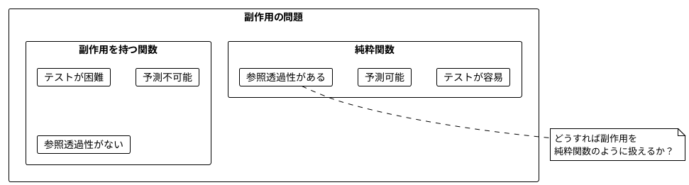
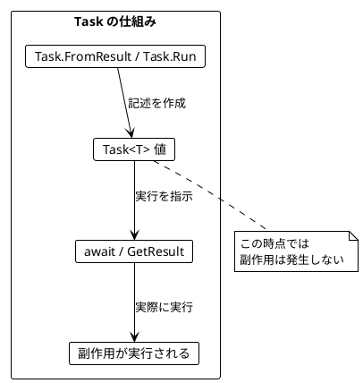
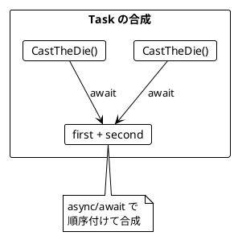
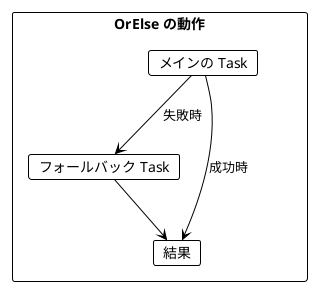
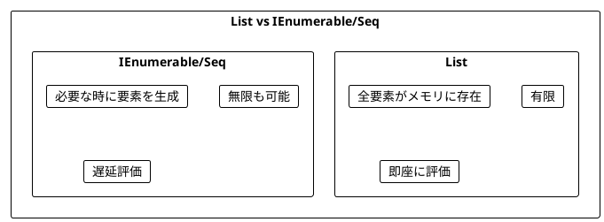
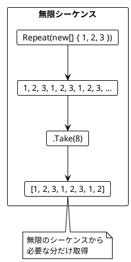
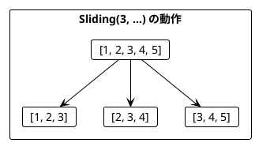
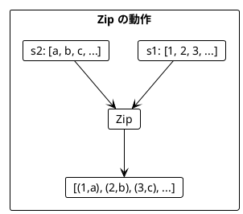
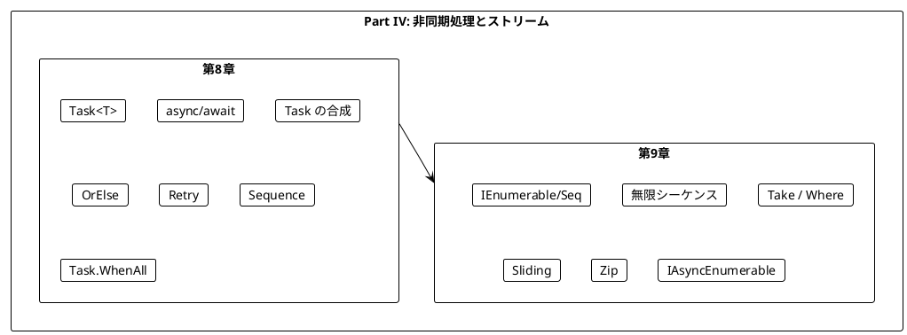

# Part IV: 非同期処理とストリーム

本章では、関数型プログラミングにおける副作用の扱い方を学びます。C# の Task と LanguageExt ライブラリを使って副作用を純粋関数内で安全に記述し、IEnumerable/Seq で無限のデータを扱う方法を習得します。

---

## 第8章: Task による非同期処理

### 8.1 副作用の問題

純粋関数は副作用を持ちません。しかし、実際のプログラムには副作用が必要です:

- ファイルの読み書き
- ネットワーク通信
- データベースアクセス
- 乱数生成
- 現在時刻の取得



### 8.2 C# の Task とは

**Task**（タスク）は「副作用を持つ計算の**記述**」を表す型です。

- `Task<T>` は「実行すると `T` 型の値を返す副作用のある計算」
- Task を作成しただけでは副作用は発生しない（`Task.Run` を除く）
- `await` または `.GetAwaiter().GetResult()` で実際に実行される



### 8.3 サイコロを振る例

**ソースファイル**: `app/csharp/src/Ch08/AsyncIO.cs`

#### 不純な関数（副作用あり）

```csharp
using System;

public static int CastTheDieImpure()
{
    var random = new Random();
    return random.Next(1, 7);
}

// 呼び出すたびに異なる値が返る
Console.WriteLine(CastTheDieImpure());  // 3
Console.WriteLine(CastTheDieImpure());  // 5
Console.WriteLine(CastTheDieImpure());  // 1
```

#### Task を使った純粋な記述

```csharp
public static Task<int> CastTheDie() =>
    Task.Run(CastTheDieImpure);

// Task 値を作成（この時点では実行されない）
Task<int> dieCast = CastTheDie();
Console.WriteLine(dieCast);  // Task<int> - まだ実行されていない

// 実際に実行
Console.WriteLine(await dieCast);  // 4
```

### 8.4 Task の作成方法

| 方法 | 用途 | 例 |
|------|------|-----|
| `Task.FromResult(value)` | 既存の値をラップ（副作用なし） | `Task.FromResult(42)` |
| `Task.Run(() => expr)` | 副作用のある式をラップ | `Task.Run(() => CastTheDieImpure())` |
| `Task.FromResult(Unit.Default)` | 何もしない Task | `Task.FromResult(unit)` |

```csharp
using LanguageExt;
using static LanguageExt.Prelude;

// 副作用を遅延実行
public static Task<T> DelayEffect<T>(Func<T> effect) =>
    Task.Run(effect);

// 純粋な値をラップ
public static Task<T> PureAsync<T>(T value) =>
    Task.FromResult(value);

// Unit を返す Task
public static Task<Unit> UnitAsync =>
    Task.FromResult(unit);
```

### 8.5 Task の合成

Task 値は `async/await` を使って合成できます。

```csharp
public static async Task<int> CastTheDieTwice()
{
    var first = await CastTheDie();
    var second = await CastTheDie();
    return first + second;
}

// まだ実行されていない
Task<int> program = CastTheDieTwice();

// 実行
int result = await program;
```



### 8.6 ミーティングスケジューリングの例

**ソースファイル**: `app/csharp/src/Ch08/AsyncIO.cs`

より実践的な例として、ミーティングのスケジューリングを見てみましょう。

```csharp
public record MeetingTime(int StartHour, int EndHour);

// 副作用のある API 呼び出しを Task でラップ
public static Task<Seq<MeetingTime>> CalendarEntries(string name) =>
    Task.Run(() => CalendarEntriesApiCall(name));
```

#### 予定の取得

```csharp
public static async Task<Seq<MeetingTime>> ScheduledMeetings(string person1, string person2)
{
    var entries1 = await CalendarEntries(person1);
    var entries2 = await CalendarEntries(person2);
    return entries1.Concat(entries2);
}
```

#### 空き時間の計算（純粋関数）

```csharp
public static Seq<MeetingTime> PossibleMeetings(
    Seq<MeetingTime> existingMeetings,
    int startHour,
    int endHour,
    int lengthHours)
{
    return toSeq(Enumerable.Range(startHour, endHour - lengthHours - startHour + 1)
        .Select(start => new MeetingTime(start, start + lengthHours))
        .Where(slot => existingMeetings.ForAll(meeting => !MeetingsOverlap(meeting, slot))));
}
```

### 8.7 OrElse によるエラーハンドリング

失敗時のフォールバックを指定できます。

```csharp
public static async Task<T> OrElse<T>(this Task<T> primary, Task<T> fallback)
{
    try
    {
        return await primary;
    }
    catch
    {
        return await fallback;
    }
}

// 使用例
var year = await SucceedingAsync(996).OrElse(SucceedingAsync(2020));    // 996
var noYear = await FailingAsync("error").OrElse(SucceedingAsync(2020));  // 2020
```



#### リトライ戦略

```csharp
// API 呼び出しを3回までリトライ
await CalendarEntries("Alice")
    .OrElse(CalendarEntries("Alice"))
    .OrElse(CalendarEntries("Alice"))
    .OrElse(Task.FromResult(Seq<MeetingTime>()));  // 全部失敗したら空リスト
```

#### 汎用リトライ関数

```csharp
public static async Task<T> Retry<T>(int maxRetries, Func<Task<T>> action)
{
    var remaining = maxRetries;
    while (true)
    {
        try
        {
            return await action();
        }
        catch when (remaining > 0)
        {
            remaining--;
        }
    }
}

// 使用例
await Retry(10, () => CalendarEntries("Alice"));
```

### 8.8 Sequence による Task のリスト処理

`Seq<Task<T>>` を `Task<Seq<T>>` に変換するには Sequence を使います。

```csharp
public static async Task<Seq<T>> Sequence<T>(Seq<Task<T>> tasks)
{
    var results = new List<T>();
    foreach (var task in tasks)
    {
        results.Add(await task);
    }
    return toSeq(results);
}

var actions = Seq(
    Task.FromResult(1),
    Task.FromResult(2),
    Task.FromResult(3)
);
var combined = await Sequence(actions);  // Seq(1, 2, 3)
```

#### 複数人の予定を取得

```csharp
public static async Task<Seq<MeetingTime>> ScheduledMeetingsMultiple(Seq<string> attendees)
{
    var tasks = attendees.Map(CalendarEntries);
    var allMeetings = await Sequence(tasks);
    return allMeetings.Bind(x => x);
}
```

### 8.9 並列実行

C# では `Task.WhenAll` で複数の Task を並列実行できます。

```csharp
public static async Task<(T1, T2)> Parallel2<T1, T2>(Task<T1> task1, Task<T2> task2)
{
    await Task.WhenAll(task1, task2);
    return (task1.Result, task2.Result);
}

public static async Task<Seq<T>> ParallelAll<T>(Seq<Task<T>> tasks)
{
    var results = await Task.WhenAll(tasks);
    return toSeq(results);
}

// 使用例
var tasks = Seq(CalendarEntries("Alice"), CalendarEntries("Bob"), CalendarEntries("Charlie"));
var allResults = await ParallelAll(tasks);
```

---

## 第9章: ストリーム処理

### 9.1 IEnumerable と Seq とは

**IEnumerable/Seq**（シーケンス）は、要素の（潜在的に無限の）シーケンスを表します。



### 9.2 純粋なシーケンス

**ソースファイル**: `app/csharp/src/Ch09/StreamProcessing.cs`

```csharp
using LanguageExt;
using static LanguageExt.Prelude;

// 有限シーケンス
Seq<int> numbers = Seq(1, 2, 3);

// List に変換
numbers.ToList();  // [1, 2, 3]

// フィルタリング
var oddNumbers = numbers.Filter(n => n % 2 != 0);
oddNumbers.ToList();  // [1, 3]
```

### 9.3 無限シーケンス

```csharp
// repeat で無限に繰り返し
public static IEnumerable<T> Repeat<T>(IEnumerable<T> elements)
{
    while (true)
    {
        foreach (var element in elements)
        {
            yield return element;
        }
    }
}

IEnumerable<int> infinite123s = Repeat(new[] { 1, 2, 3 });

// Take で有限個を取得
infinite123s.Take(8).ToList();  // [1, 2, 3, 1, 2, 3, 1, 2]
```



### 9.4 サイコロを振るストリーム

```csharp
private static readonly Random _random = new();

private static int CastTheDieImpure() =>
    _random.Next(1, 7);

// サイコロを無限に振るストリーム
public static IEnumerable<int> InfiniteDieCasts
{
    get
    {
        while (true)
        {
            yield return CastTheDieImpure();
        }
    }
}

// 最初の3回を取得
InfiniteDieCasts.Take(3).ToList();  // [4, 2, 6]

// 6 が出るまで振り続ける
public static IEnumerable<int> CastUntil(int target)
{
    while (true)
    {
        var n = CastTheDieImpure();
        yield return n;
        if (n == target) yield break;
    }
}
```

### 9.5 シーケンスの主要操作

| 操作 | 説明 | 例 |
|------|------|-----|
| `.Take(n)` | 最初の n 要素を取得 | `stream.Take(3)` |
| `.Where(p)` | 条件を満たす要素のみ | `stream.Where(x => x > 0)` |
| `.Select(f)` | 各要素を変換 | `stream.Select(x => x * 2)` |
| `.Concat(s2)` | 2つのシーケンスを結合 | `s1.Concat(s2)` |
| `Sliding(n, stream)` | スライディングウィンドウ | `Sliding(3, stream)` |

### 9.6 通貨交換レートの例

**ソースファイル**: `app/csharp/src/Ch09/StreamProcessing.cs`

為替レートを監視して、上昇トレンドを検出する例です。

#### トレンド判定（純粋関数）

```csharp
public static bool Trending(Seq<decimal> rates) =>
    rates.Count > 1 &&
    Pairwise(rates).All(pair => pair.Item2 > pair.Item1);

Trending(Seq(0.81m, 0.82m, 0.83m));  // true (上昇トレンド)
Trending(Seq(0.81m, 0.84m, 0.83m));  // false
```

#### レートのストリーム

```csharp
public enum Currency { USD, EUR, GBP, JPY }

public static IEnumerable<decimal> Rates(Currency from, Currency to)
{
    while (true)
    {
        yield return GetExchangeRate(from, to);
    }
}
```

### 9.7 スライディングウィンドウ

`Sliding` で連続する要素をグループ化できます。

```csharp
public static IEnumerable<Seq<T>> Sliding<T>(int windowSize, IEnumerable<T> stream)
{
    var window = new Queue<T>();
    foreach (var item in stream)
    {
        window.Enqueue(item);
        if (window.Count == windowSize)
        {
            yield return toSeq(window);
            window.Dequeue();
        }
    }
}

var stream = new[] { 1, 2, 3, 4, 5 };
Sliding(3, stream).ToList();
// [Seq(1, 2, 3), Seq(2, 3, 4), Seq(3, 4, 5)]
```



#### トレンドを検出して交換

```csharp
public static Option<decimal> ExchangeIfTrending(
    decimal amount,
    Currency from,
    Currency to,
    int windowSize)
{
    var rateWindow = Sliding(windowSize, Rates(from, to))
        .Where(window => Trending(window))
        .Take(1)
        .FirstOrDefault();

    if (rateWindow.IsEmpty)
        return None;

    var lastRate = rateWindow[rateWindow.Count - 1];
    return Some(amount * lastRate);
}
```

### 9.8 シーケンスの結合

2つのシーケンスを `Zip` で結合できます。

```csharp
public static IEnumerable<(T1, T2)> Zip<T1, T2>(
    IEnumerable<T1> stream1,
    IEnumerable<T2> stream2) =>
    stream1.Zip(stream2);

var s1 = new[] { 1, 2, 3 };
var s2 = new[] { "a", "b", "c" };

Zip(s1, s2).ToList();  // [(1, "a"), (2, "b"), (3, "c")]

// 左側の値のみを返す
public static IEnumerable<T1> ZipLeft<T1, T2>(
    IEnumerable<T1> stream1,
    IEnumerable<T2> stream2) =>
    Zip(stream1, stream2).Select(pair => pair.Item1);
```



### 9.9 実用的なストリーム操作

```csharp
// 累積和
public static IEnumerable<int> RunningSum(IEnumerable<int> stream)
{
    var sum = 0;
    foreach (var item in stream)
    {
        sum += item;
        yield return sum;
    }
}

RunningSum(new[] { 1, 2, 3, 4, 5 }).ToList();  // [1, 3, 6, 10, 15]

// 移動平均
public static IEnumerable<decimal> MovingAverage(int windowSize, IEnumerable<decimal> stream) =>
    Sliding(windowSize, stream)
        .Select(window => Enumerable.Sum(window) / windowSize);

// 連続する重複を除去
public static IEnumerable<T> DistinctConsecutive<T>(IEnumerable<T> stream)
{
    var first = true;
    T? prev = default;
    foreach (var item in stream)
    {
        if (first || !EqualityComparer<T>.Default.Equals(prev, item))
        {
            yield return item;
            prev = item;
            first = false;
        }
    }
}
```

### 9.10 非同期ストリーム（IAsyncEnumerable）

C# 8.0 以降では `IAsyncEnumerable<T>` を使って非同期ストリームを扱えます。

```csharp
public static async IAsyncEnumerable<T> RepeatWithDelay<T>(int delayMs, T value)
{
    while (true)
    {
        await Task.Delay(delayMs);
        yield return value;
    }
}

public static async IAsyncEnumerable<T> Take<T>(int n, IAsyncEnumerable<T> stream)
{
    var count = 0;
    await foreach (var item in stream)
    {
        if (count >= n) yield break;
        yield return item;
        count++;
    }
}

public static async Task<Seq<T>> ToSeqAsync<T>(IAsyncEnumerable<T> stream)
{
    var results = new List<T>();
    await foreach (var item in stream)
    {
        results.Add(item);
    }
    return toSeq(results);
}
```

---

## Scala との比較

### IO と Task の比較

| Scala (Cats Effect) | C# | 説明 |
|---------------------|-----|------|
| `IO[A]` | `Task<T>` | 副作用を記述する型 |
| `IO.delay(expr)` | `Task.Run(() => expr)` | 副作用をラップ |
| `IO.pure(value)` | `Task.FromResult(value)` | 純粋な値をラップ |
| `for { a <- io1; b <- io2 } yield ...` | `async { var a = await io1; var b = await io2; return ... }` | 合成 |
| `io.unsafeRunSync()` | `task.GetAwaiter().GetResult()` | 同期実行 |
| `io1.orElse(io2)` | `task1.OrElse(task2)` | フォールバック |
| `ios.sequence` | `Sequence(tasks)` | リストの変換 |

### Stream と IEnumerable/Seq の比較

| Scala (fs2) | C# | 説明 |
|-------------|-----|------|
| `Stream[Pure, A]` | `IEnumerable<T>` / `Seq<T>` | 純粋なストリーム |
| `Stream.eval(io)` | `IAsyncEnumerable<T>` | IO を含むストリーム |
| `stream.repeat` | `Repeat(stream)` | 無限繰り返し |
| `stream.take(n)` | `stream.Take(n)` | 最初の n 要素 |
| `stream.filter(p)` | `stream.Where(p)` | フィルタリング |
| `stream.sliding(n)` | `Sliding(n, stream)` | スライディングウィンドウ |

---

## まとめ

### Part IV で学んだこと



### Task と IEnumerable の比較

| 特性 | Task<T> | IEnumerable<T> |
|------|---------|----------------|
| 要素数 | 1つ | 0個以上（無限も可） |
| 実行 | `await` / `GetResult()` | `ToList()` |
| 用途 | 単一の副作用 | 連続した要素の処理 |

### キーポイント

1. **Task**: 副作用を「記述」として扱い、実行を遅延させる
2. **Task.Run / Task.FromResult**: 副作用のある式や純粋な値を Task にラップ
3. **async/await**: Task を合成（Scala の flatMap 相当）
4. **OrElse**: 失敗時のフォールバックを指定
5. **Sequence**: `Seq<Task<T>>` → `Task<Seq<T>>`
6. **IEnumerable/Seq**: 潜在的に無限のシーケンスを遅延評価で処理
7. **Sliding**: 連続する要素をグループ化してパターンを検出
8. **IAsyncEnumerable**: 非同期ストリーム処理

### 次のステップ

Part V では、以下のトピックを学びます:

- 並行・並列処理
- 共有状態の管理
- 並行コレクション

---

## 演習問題

### 問題 1: Task の基本

以下の関数を実装してください。

```csharp
public static Task<string> PrintAndReturn(string message) => ???

// 期待される動作
// await PrintAndReturn("Hello") は
// "Hello" をコンソールに出力し、"Hello" を返す
```

<details>
<summary>解答</summary>

```csharp
public static Task<string> PrintAndReturn(string message) =>
    Task.Run(() =>
    {
        Console.WriteLine(message);
        return message;
    });
```

</details>

### 問題 2: Task の合成

以下の関数を実装してください。2つの Task を順番に実行し、結果を結合します。

```csharp
public static async Task<C> CombineAsync<A, B, C>(
    Task<A> task1,
    Task<B> task2,
    Func<A, B, C> f) => ???

// 期待される動作
var result = await CombineAsync(
    Task.FromResult(1),
    Task.FromResult(2),
    (a, b) => a + b);  // 3
```

<details>
<summary>解答</summary>

```csharp
public static async Task<C> CombineAsync<A, B, C>(
    Task<A> task1,
    Task<B> task2,
    Func<A, B, C> f)
{
    var a = await task1;
    var b = await task2;
    return f(a, b);
}
```

</details>

### 問題 3: リトライ

以下の関数を実装してください。指定回数リトライし、全部失敗したらデフォルト値を返します。

```csharp
public static async Task<T> RetryWithDefault<T>(
    int maxRetries,
    T defaultValue,
    Func<Task<T>> action) => ???
```

<details>
<summary>解答</summary>

```csharp
public static async Task<T> RetryWithDefault<T>(
    int maxRetries,
    T defaultValue,
    Func<Task<T>> action)
{
    try
    {
        return await Retry(maxRetries, action);
    }
    catch
    {
        return defaultValue;
    }
}
```

</details>

### 問題 4: シーケンス操作

以下のシーケンスを作成してください。

```csharp
// 1. 1から10までの偶数のシーケンス
IEnumerable<int> evens = ???

// 2. 無限に交互に true/false を返すシーケンス
IEnumerable<bool> alternating = ???

// 3. 最初の5つの要素の合計を計算
int sum = new[] { 1, 2, 3, 4, 5, 6, 7, 8, 9, 10 }.Take(5).???
```

<details>
<summary>解答</summary>

```csharp
// 1. 1から10までの偶数
IEnumerable<int> evens = Enumerable.Range(1, 10).Where(n => n % 2 == 0);
// または
IEnumerable<int> evens = new[] { 2, 4, 6, 8, 10 };

// 2. 無限に交互に true/false
IEnumerable<bool> alternating = Alternating();

static IEnumerable<bool> Alternating()
{
    while (true)
    {
        yield return true;
        yield return false;
    }
}

// 3. 最初の5つの要素の合計
int sum = new[] { 1, 2, 3, 4, 5, 6, 7, 8, 9, 10 }
    .Take(5)
    .Sum();  // 15
```

</details>

### 問題 5: トレンド検出

以下の関数を実装してください。直近3つの値が全て同じかどうかを判定します。

```csharp
public static bool IsStable(Seq<int> values) => ???

// 期待される動作
Debug.Assert(IsStable(Seq(5, 5, 5)) == true);
Debug.Assert(IsStable(Seq(5, 5, 6)) == false);
Debug.Assert(IsStable(Seq(5, 6, 5)) == false);
Debug.Assert(IsStable(Seq(5)) == false);  // 3つ未満は false
```

<details>
<summary>解答</summary>

```csharp
public static bool IsStable(Seq<int> values) =>
    values.Count >= 3 &&
    Enumerable.Count(values.Distinct()) == 1;

// または
public static bool IsStable(Seq<int> values) =>
    values.Count >= 3 &&
    Pairwise(values).All(pair => pair.Item1 == pair.Item2);
```

</details>
