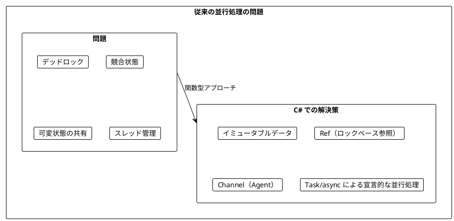
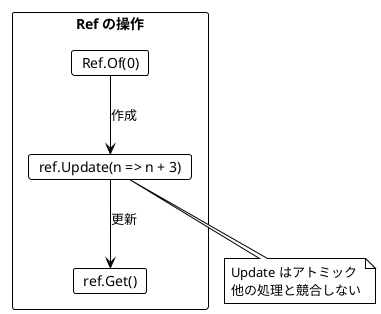
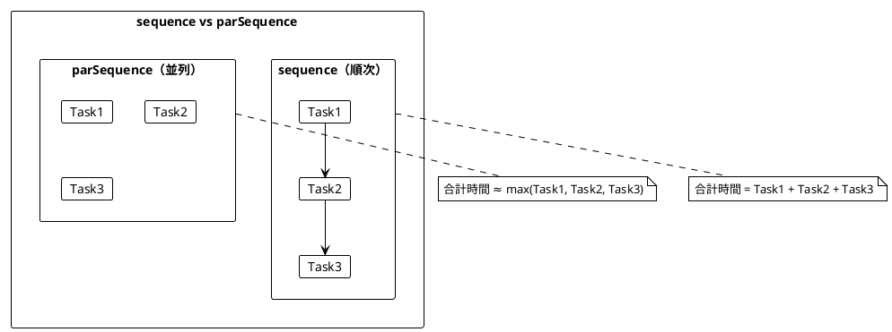
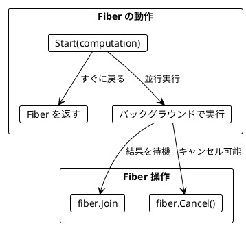
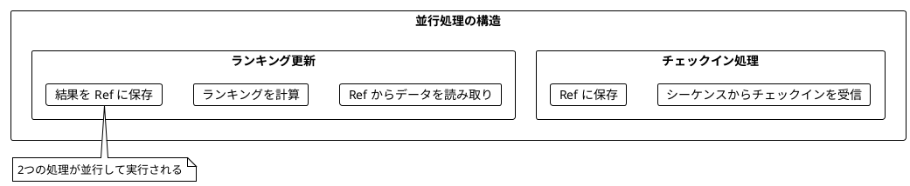
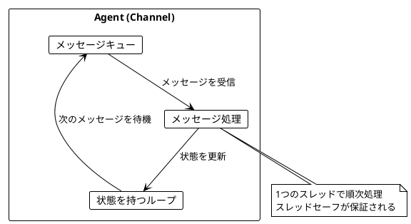
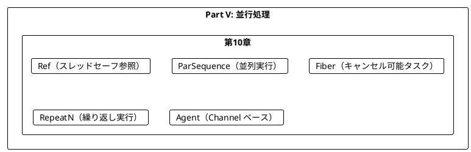
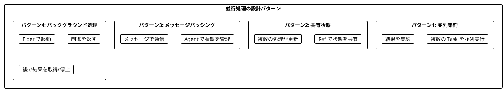

# Part V: 並行処理

本章では、関数型プログラミングにおける並行処理を学びます。Ref によるスレッドセーフな共有状態管理、Task.WhenAll による並列実行、そして Channel を使ったエージェントによる軽量並行処理の構築方法を習得します。

---

## 第10章: 並行・並列処理

### 10.1 並行処理の課題

従来の並行処理には多くの課題があります:

- デッドロック
- 競合状態（Race Condition）
- 共有状態の管理の複雑さ
- スレッドのオーバーヘッド



### 10.2 チェックインのリアルタイム集計

**ソースファイル**: `app/csharp/src/Ch10/ConcurrentProcessing.cs`

都市へのチェックインをリアルタイムで集計し、ランキングを更新する例を見ていきます。

```csharp
public record City(string Name);
public record CityStats(City City, int CheckIns);

// チェックインのシーケンス
public static IEnumerable<City> CheckIns()
{
    for (int i = 0; i < 100000; i++)
    {
        yield return new City("Sydney");
        yield return new City("Dublin");
        yield return new City("Cape Town");
        yield return new City("Lima");
        yield return new City("Singapore");
    }
}
```

#### トップ3都市の計算（純粋関数）

```csharp
public static List<CityStats> TopCities(int n, Dictionary<City, int> cityCheckIns) =>
    cityCheckIns
        .Select(kvp => new CityStats(kvp.Key, kvp.Value))
        .OrderByDescending(stats => stats.CheckIns)
        .Take(n)
        .ToList();
```

### 10.3 Ref - スレッドセーフな共有状態

**Ref** は、複数の並行処理から安全にアクセスできるスレッドセーフな参照です。C# では `lock` を使って実装します。

```csharp
public class Ref<T>
{
    private T _value;
    private readonly object _lock = new();

    private Ref(T initialValue) => _value = initialValue;

    /// <summary>初期値で Ref を作成</summary>
    public static Ref<T> Of(T initialValue) => new(initialValue);

    /// <summary>現在の値を取得</summary>
    public T Get()
    {
        lock (_lock) { return _value; }
    }

    /// <summary>値を設定</summary>
    public void Set(T newValue)
    {
        lock (_lock) { _value = newValue; }
    }

    /// <summary>アトミックに更新</summary>
    public void Update(Func<T, T> f)
    {
        lock (_lock) { _value = f(_value); }
    }
}
```



#### Ref の主要メソッド

| メソッド | 説明 | 例 |
|----------|------|-----|
| `Ref<T>.Of(initial)` | 初期値で Ref を作成 | `Ref<int>.Of(0)` |
| `ref.Get()` | 現在の値を取得 | `counter.Get()` |
| `ref.Set(value)` | 値を設定 | `counter.Set(10)` |
| `ref.Update(f)` | アトミックに更新 | `counter.Update(n => n + 1)` |
| `ref.GetAndUpdate(f)` | 更新して古い値を返す | `counter.GetAndUpdate(n => n + 1)` |
| `ref.UpdateAndGet(f)` | 更新して新しい値を返す | `counter.UpdateAndGet(n => n + 1)` |
| `ref.Modify(f)` | 更新して結果を返す | `counter.Modify(n => (n + 1, n * 2))` |

#### 使用例

```csharp
var counter = Ref<int>.Of(0);
counter.Update(n => n + 3);  // アトミックに更新
counter.Get();                // 3
```

### 10.4 ParSequence - 並列実行

C# では `Task.WhenAll` を使って複数の Task を並列実行できます。

```csharp
/// <summary>Task のリストを並列実行</summary>
public static async Task<Seq<T>> ParSequence<T>(Seq<Task<T>> tasks)
{
    var results = await Task.WhenAll(tasks);
    return toSeq(results);
}

// 使用例
var tasks = Seq(
    Task.FromResult(1),
    Task.FromResult(2),
    Task.FromResult(3)
);
var result = await ParSequence(tasks);  // Seq(1, 2, 3)
```



#### 複数の Task を並列実行

```csharp
/// <summary>2つの Task を並列実行</summary>
public static async Task<(T1, T2)> ParTuple2<T1, T2>(Task<T1> task1, Task<T2> task2)
{
    await Task.WhenAll(task1, task2);
    return (task1.Result, task2.Result);
}

/// <summary>3つの Task を並列実行</summary>
public static async Task<(T1, T2, T3)> ParTuple3<T1, T2, T3>(
    Task<T1> task1, Task<T2> task2, Task<T3> task3)
{
    await Task.WhenAll(task1, task2, task3);
    return (task1.Result, task2.Result, task3.Result);
}
```

### 10.5 サイコロを並行して振る

```csharp
private static readonly Random _random = new();

public static Task<int> CastTheDie() =>
    Task.Run(() => _random.Next(1, 7));

/// <summary>N 個のサイコロを並行して振る</summary>
public static async Task<Seq<int>> CastDiceConcurrently(int n)
{
    var tasks = Enumerable.Range(0, n).Select(_ => CastTheDie());
    var results = await Task.WhenAll(tasks);
    return toSeq(results);
}

/// <summary>N 個のサイコロを並行して振り、合計を返す</summary>
public static async Task<int> CastDiceAndSum(int n)
{
    var results = await CastDiceConcurrently(n);
    return Enumerable.Sum(results);
}
```

### 10.6 Fiber - キャンセル可能な非同期タスク

**Fiber** は、バックグラウンドで実行されるキャンセル可能な非同期タスクです。

```csharp
public class Fiber<T>
{
    /// <summary>タスクの結果を待機</summary>
    public Task<T> Join { get; }

    /// <summary>タスクをキャンセル</summary>
    public Action Cancel { get; }

    public Fiber(Task<T> join, Action cancel)
    {
        Join = join;
        Cancel = cancel;
    }
}

/// <summary>キャンセル可能な非同期タスクを起動</summary>
public static Fiber<T> Start<T>(Func<CancellationToken, Task<T>> computation)
{
    var cts = new CancellationTokenSource();
    var task = Task.Run(() => computation(cts.Token), cts.Token);
    return new Fiber<T>(task, () => cts.Cancel());
}
```



#### RepeatN - N 回繰り返す

```csharp
/// <summary>アクションを N 回繰り返す</summary>
public static async Task<Seq<T>> RepeatN<T>(int n, Func<Task<T>> action)
{
    var results = new List<T>();
    for (var i = 0; i < n; i++)
    {
        results.Add(await action());
    }
    return toSeq(results);
}
```

### 10.7 チェックイン処理の並行版

チェックインの保存とランキングの更新を並行して実行します。

#### チェックインの保存

```csharp
public static void StoreCheckIn(Ref<Dictionary<City, int>> storedCheckIns, City city)
{
    storedCheckIns.Update(dict =>
    {
        var newDict = new Dictionary<City, int>(dict);
        if (newDict.TryGetValue(city, out var count))
            newDict[city] = count + 1;
        else
            newDict[city] = 1;
        return newDict;
    });
}
```

#### ランキングの継続的な更新

```csharp
public static void UpdateRanking(
    Ref<Dictionary<City, int>> storedCheckIns,
    Ref<List<CityStats>> storedRanking)
{
    var checkIns = storedCheckIns.Get();
    var ranking = TopCities(3, checkIns);
    storedRanking.Set(ranking);
}
```



### 10.8 呼び出し元に制御を返す

バックグラウンドで処理を続けつつ、呼び出し元に制御を返す設計ができます。

```csharp
public class ProcessingCheckIns
{
    private readonly Ref<List<CityStats>> _storedRanking;
    private readonly CancellationTokenSource _cts;

    public ProcessingCheckIns(Ref<List<CityStats>> storedRanking, CancellationTokenSource cts)
    {
        _storedRanking = storedRanking;
        _cts = cts;
    }

    /// <summary>現在のランキングを取得</summary>
    public List<CityStats> CurrentRanking() => _storedRanking.Get();

    /// <summary>処理を停止</summary>
    public void Stop() => _cts.Cancel();
}

public static ProcessingCheckIns StartCheckInProcessing(IEnumerable<City> checkIns)
{
    var storedCheckIns = Ref<Dictionary<City, int>>.Of(new Dictionary<City, int>());
    var storedRanking = Ref<List<CityStats>>.Of(new List<CityStats>());
    var cts = new CancellationTokenSource();

    // チェックイン処理を開始
    Task.Run(() =>
    {
        foreach (var city in checkIns)
        {
            if (cts.Token.IsCancellationRequested) break;
            StoreCheckIn(storedCheckIns, city);
        }
    }, cts.Token);

    // ランキング更新を開始
    Task.Run(async () =>
    {
        while (!cts.Token.IsCancellationRequested)
        {
            UpdateRanking(storedCheckIns, storedRanking);
            await Task.Delay(10, cts.Token);
        }
    }, cts.Token);

    return new ProcessingCheckIns(storedRanking, cts);
}
```

#### 使用例

```csharp
var cities = new[]
{
    new City("Tokyo"),
    new City("Sydney"),
    new City("Tokyo"),
    new City("London"),
    new City("Tokyo")
};

var processing = StartCheckInProcessing(cities);

// 少し待ってからランキングを取得
await Task.Delay(100);
var ranking = processing.CurrentRanking();

// 処理を停止
processing.Stop();
```

### 10.9 Channel を使った Agent による並行処理

C# では、**Channel** を使ったメッセージパッシング方式の並行処理が可能です。



#### カウンターエージェント

```csharp
public record Increment;
public record Decrement;
public record GetValue(TaskCompletionSource<int> Reply);
public record Reset;

public class Agent<TState, TMessage> : IDisposable
{
    private readonly Channel<TMessage> _channel;
    private readonly CancellationTokenSource _cts;
    private TState _state;

    public Agent(TState initialState, Func<TState, TMessage, TState> handler)
    {
        _channel = Channel.CreateUnbounded<TMessage>();
        _cts = new CancellationTokenSource();
        _state = initialState;

        Task.Run(async () =>
        {
            await foreach (var message in _channel.Reader.ReadAllAsync(_cts.Token))
            {
                _state = handler(_state, message);
            }
        });
    }

    public void Send(TMessage message) =>
        _channel.Writer.TryWrite(message);

    public void Dispose()
    {
        _cts.Cancel();
        _channel.Writer.Complete();
    }
}
```

#### カウンターの使用

```csharp
using var counter = AgentBasedConcurrency.CreateCounter(0);

// インクリメント（Fire-and-forget）
AgentBasedConcurrency.IncrementCounter(counter);
AgentBasedConcurrency.IncrementCounter(counter);

// 値を取得（同期）
var value = AgentBasedConcurrency.GetCounterValue(counter);  // 2

// デクリメント
AgentBasedConcurrency.DecrementCounter(counter);
var newValue = AgentBasedConcurrency.GetCounterValue(counter);  // 1
```

#### チェックインエージェント

```csharp
public record AddCheckInMsg(City City);
public record GetStatsMsg(TaskCompletionSource<List<CityStats>> Reply);
public record GetTotalMsg(TaskCompletionSource<int> Reply);

public static Agent<Dictionary<City, int>, object> CreateCheckInAgent() =>
    new(new Dictionary<City, int>(), (state, message) => message switch
    {
        AddCheckInMsg msg => UpdateCheckIns(state, msg.City),
        GetStatsMsg msg =>
        {
            msg.Reply.SetResult(TopCities(3, state));
            return state;
        },
        GetTotalMsg msg =>
        {
            msg.Reply.SetResult(state.Values.Sum());
            return state;
        },
        _ => state
    });
```

### 10.10 並列処理ユーティリティ

```csharp
/// <summary>リストの各要素に関数を並列適用</summary>
public static Seq<TResult> ParMap<T, TResult>(Func<T, TResult> f, Seq<T> list)
{
    var tasks = list.Map(x => Task.Run(() => f(x)));
    return toSeq(Task.WhenAll(tasks).Result);
}

/// <summary>条件を満たす要素を並列でフィルタ</summary>
public static Seq<T> ParFilter<T>(Func<T, bool> predicate, Seq<T> list)
{
    var tasks = list.Map(x => Task.Run(() => (x, predicate(x))));
    var results = Task.WhenAll(tasks).Result;
    return toSeq(results.Where(r => r.Item2).Select(r => r.x));
}

/// <summary>並列で集約</summary>
public static Option<T> ParReduce<T>(Func<T, T, T> combine, Seq<T> list)
{
    if (list.IsEmpty) return None;
    if (list.Count == 1) return Some(list[0]);

    Seq<T> ReduceLevel(Seq<T> items)
    {
        if (items.Count <= 1) return items;

        var chunks = toSeq(items.Chunk(2));
        var tasks = chunks.Map(chunk =>
        {
            var arr = chunk.ToArray();
            return Task.Run(() => arr.Length == 2 ? combine(arr[0], arr[1]) : arr[0]);
        });

        return toSeq(Task.WhenAll(tasks).Result);
    }

    var current = list;
    while (current.Count > 1)
    {
        current = ReduceLevel(current);
    }

    return Some(current[0]);
}
```

### 10.11 タイムアウト付き実行

```csharp
/// <summary>タイムアウト付きで Task を実行</summary>
public static async Task<Option<T>> WithTimeout<T>(int timeoutMs, Task<T> task)
{
    var timeoutTask = Task.Delay(timeoutMs);
    var completedTask = await Task.WhenAny(task, timeoutTask);
    if (completedTask == task)
    {
        return Some(await task);
    }
    return None;
}
```

### 10.12 偶数カウント（並行版）

```csharp
/// <summary>並行して実行し、偶数の数をカウント</summary>
public static async Task<int> CountEvens(Seq<Task<int>> asyncInts)
{
    var counter = Ref<int>.Of(0);
    var tasks = asyncInts.Map(async asyncInt =>
    {
        var n = await asyncInt;
        if (n % 2 == 0)
        {
            counter.Update(c => c + 1);
        }
    });
    await Task.WhenAll(tasks);
    return counter.Get();
}
```

---

## Scala との比較

### Ref の比較

| Scala (Cats Effect) | C# | 説明 |
|---------------------|-----|------|
| `Ref.of[IO, A](initial)` | `Ref<T>.Of(initial)` | 初期値で Ref を作成 |
| `ref.get` | `ref.Get()` | 現在の値を取得 |
| `ref.set(value)` | `ref.Set(value)` | 値を設定 |
| `ref.update(f)` | `ref.Update(f)` | アトミックに更新 |
| `ref.modify(f)` | `ref.Modify(f)` | 更新して結果を返す |

### 並列実行の比較

| Scala (Cats Effect) | C# | 説明 |
|---------------------|-----|------|
| `ios.parSequence` | `ParSequence(tasks)` | 並列実行 |
| `ios.sequence` | 順次 await | 順次実行 |
| `(io1, io2).parTupled` | `ParTuple2(task1, task2)` | 2つを並列実行 |

### Fiber の比較

| Scala (Cats Effect) | C# | 説明 |
|---------------------|-----|------|
| `io.start` | `Start(computation)` | Fiber を起動 |
| `fiber.join` | `fiber.Join` | 結果を待機 |
| `fiber.cancel` | `fiber.Cancel()` | キャンセル |
| `io.foreverM` | while ループ | 永遠に繰り返す |

### Agent（Actor）の比較

| Scala (Akka) | C# | 説明 |
|--------------|-----|------|
| `Actor` | `Agent<TState, TMessage>` | メッセージベースの並行処理 |
| `actorRef ! message` | `agent.Send(message)` | メッセージ送信（非同期） |
| `actorRef ? message` | TaskCompletionSource を使用 | メッセージ送信（同期） |

---

## まとめ

### Part V で学んだこと



### 主要コンポーネント

| コンポーネント | 用途 |
|----------------|------|
| `Ref<T>` | スレッドセーフな共有状態 |
| `ParSequence` | Task のリストを並列実行 |
| `Fiber<T>` | キャンセル可能な非同期タスク |
| `Start` | Fiber をバックグラウンドで起動 |
| `RepeatN` | N 回繰り返し実行 |
| `Agent<TState, TMessage>` | メッセージベースの並行処理 |

### キーポイント

1. **Ref**: 複数の並行処理から安全にアクセスできるスレッドセーフな参照
2. **ParSequence**: Task のリストを並列実行して結果を集約
3. **Fiber**: バックグラウンドで実行されるキャンセル可能なタスク
4. **Agent**: Channel を使ったメッセージパッシング方式の並行処理
5. **Task.WhenAll**: 組み込みの並列実行機能

### 設計パターン



---

## 演習問題

### 問題 1: Ref の基本

以下のプログラムを実装してください。カウンターを 0 から始めて、3回インクリメントした結果を返します。

```csharp
public static int IncrementThreeTimes() => ???

// 期待される動作
IncrementThreeTimes()  // 3
```

<details>
<summary>解答</summary>

```csharp
public static int IncrementThreeTimes()
{
    var counter = Ref<int>.Of(0);
    counter.Update(n => n + 1);
    counter.Update(n => n + 1);
    counter.Update(n => n + 1);
    return counter.Get();
}
```

</details>

### 問題 2: 並列実行

以下のプログラムを実装してください。3つの Task を並列実行し、結果の合計を返します。

```csharp
public static async Task<int> SumParallel(
    Task<int> task1, Task<int> task2, Task<int> task3) => ???

// 期待される動作
await SumParallel(
    Task.FromResult(1),
    Task.FromResult(2),
    Task.FromResult(3))  // 6
```

<details>
<summary>解答</summary>

```csharp
public static async Task<int> SumParallel(
    Task<int> task1, Task<int> task2, Task<int> task3)
{
    var results = await Task.WhenAll(task1, task2, task3);
    return results.Sum();
}
```

</details>

### 問題 3: 並行カウント

以下のプログラムを実装してください。Task のリストを並行実行し、そのうち偶数を返した回数をカウントします。

```csharp
public static async Task<int> CountEvensInList(Seq<Task<int>> asyncInts) => ???

// 使用例
var asyncInts = Seq(
    Task.FromResult(2),
    Task.FromResult(3),
    Task.FromResult(4),
    Task.FromResult(5),
    Task.FromResult(6)
);
await CountEvensInList(asyncInts)  // 3
```

<details>
<summary>解答</summary>

```csharp
public static async Task<int> CountEvensInList(Seq<Task<int>> asyncInts)
{
    var counter = Ref<int>.Of(0);
    var tasks = asyncInts.Map(async asyncInt =>
    {
        var n = await asyncInt;
        if (n % 2 == 0)
        {
            counter.Update(c => c + 1);
        }
    });
    await Task.WhenAll(tasks);
    return counter.Get();
}
```

</details>

### 問題 4: Agent

以下のプログラムを実装してください。メッセージを受け取ってリストに追加し、リストを取得できる Agent を作成します。

```csharp
public record AddItem<T>(T Item);
public record GetAll<T>(TaskCompletionSource<List<T>> Reply);

public static Agent<List<T>, object> CreateListAgent<T>() => ???

// 期待される動作
using var agent = CreateListAgent<int>();
agent.Send(new AddItem<int>(1));
agent.Send(new AddItem<int>(2));
agent.Send(new AddItem<int>(3));
// GetAll で [1, 2, 3] を取得
```

<details>
<summary>解答</summary>

```csharp
public record AddItem<T>(T Item);
public record GetAll<T>(TaskCompletionSource<List<T>> Reply);

public static Agent<List<T>, object> CreateListAgent<T>() =>
    new(new List<T>(), (state, message) => message switch
    {
        AddItem<T> msg =>
        {
            state.Add(msg.Item);
            return state;
        },
        GetAll<T> msg =>
        {
            msg.Reply.SetResult(new List<T>(state));
            return state;
        },
        _ => state
    });
```

</details>

### 問題 5: タイムアウト付き収集

以下のプログラムを実装してください。指定時間後に処理を停止し、それまでに蓄積された結果を返します。

```csharp
public static List<int> CollectFor(int durationMs, Func<int> producer) => ???

// 期待される動作
// 100msごとに乱数を生成して、1秒間収集
// 約10個の要素が返される
CollectFor(1000, () => random.Next(100))
```

<details>
<summary>解答</summary>

```csharp
public static List<int> CollectFor(int durationMs, Func<int> producer)
{
    var collected = Ref<List<int>>.Of(new List<int>());
    var cts = new CancellationTokenSource();

    // 100msごとに値を追加するタスク
    Task.Run(async () =>
    {
        while (!cts.Token.IsCancellationRequested)
        {
            await Task.Delay(100, cts.Token);
            var value = producer();
            collected.Update(list =>
            {
                var newList = new List<int>(list) { value };
                return newList;
            });
        }
    }, cts.Token);

    // 指定時間待機
    Thread.Sleep(durationMs);

    // キャンセル
    cts.Cancel();

    // 結果を取得
    return collected.Get();
}
```

</details>
