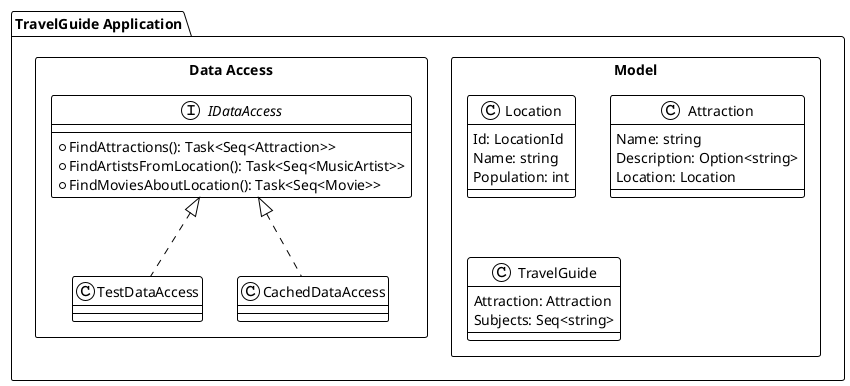
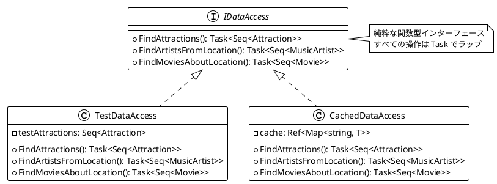
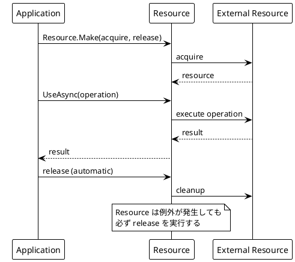
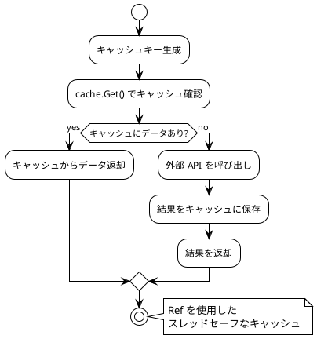
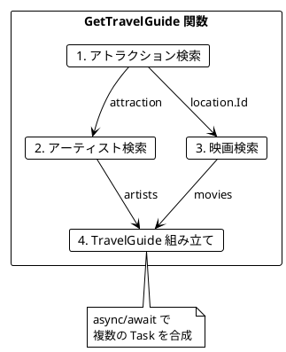
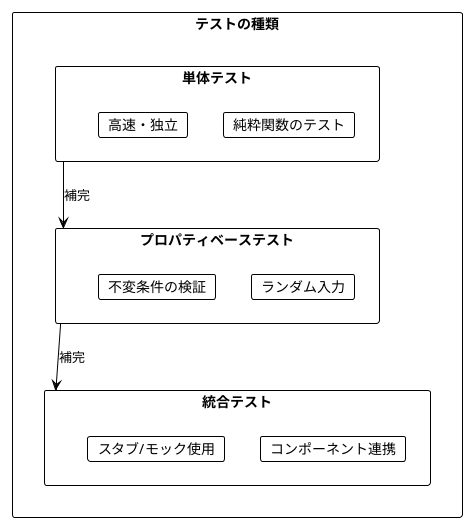
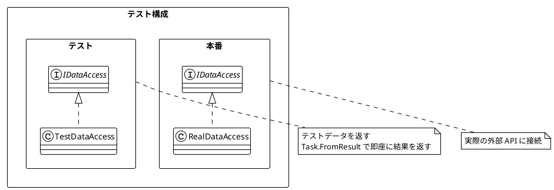
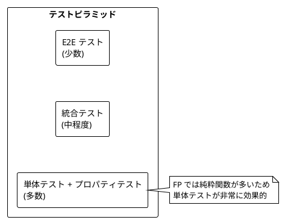
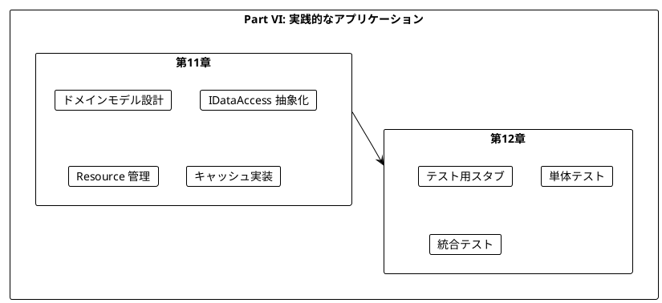
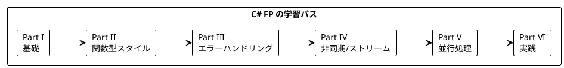

# Part VI: 実践的なアプリケーション構築とテスト

本章では、これまで学んだ関数型プログラミングの概念を統合し、実践的なアプリケーションを構築します。また、関数型プログラミングにおけるテスト戦略についても学びます。

---

## 第11章: 実践的なアプリケーション構築

### 11.1 TravelGuide アプリケーション

旅行ガイドアプリケーションを例に、実践的な FP アプリケーションの構築方法を学びます。



### 11.2 ドメインモデルの定義

**ソースファイル**: `app/csharp/src/Ch11/TravelGuide.cs`

```csharp
/// <summary>
/// ロケーション ID（値オブジェクト）
/// </summary>
public readonly record struct LocationId(string Value)
{
    public static LocationId Create(string id) => new(id);
    public override string ToString() => Value;
}

/// <summary>
/// ロケーション
/// </summary>
public record Location(LocationId Id, string Name, int Population);

/// <summary>
/// アトラクション（観光地）
/// </summary>
public record Attraction(string Name, Option<string> Description, Location Location);

/// <summary>
/// ミュージックアーティスト
/// </summary>
public record MusicArtist(string Name, Option<string> Genre);

/// <summary>
/// 映画
/// </summary>
public record Movie(string Name, Option<int> BoxOffice);

/// <summary>
/// 旅行ガイド
/// </summary>
public record TravelGuide(Attraction Attraction, Seq<string> Subjects);
```

### 11.3 データアクセス層の抽象化

外部データソースへのアクセスをインターフェースで抽象化します。

```csharp
/// <summary>
/// データアクセスインターフェース
/// </summary>
public interface IDataAccess
{
    Task<Seq<Attraction>> FindAttractions(string name, AttractionOrdering ordering, int limit);
    Task<Seq<MusicArtist>> FindArtistsFromLocation(LocationId locationId, int limit);
    Task<Seq<Movie>> FindMoviesAboutLocation(LocationId locationId, int limit);
}
```



### 11.4 Resource によるリソース管理

C# では `IDisposable` パターンと `using` ステートメントでリソースを管理できますが、より関数型的な `Resource<T>` 型を実装することもできます。

```csharp
/// <summary>
/// リソースを安全に管理するための型
/// </summary>
public class Resource<T>
{
    private readonly Func<Task<T>> _acquire;
    private readonly Func<T, Task> _release;

    private Resource(Func<Task<T>> acquire, Func<T, Task> release)
    {
        _acquire = acquire;
        _release = release;
    }

    /// <summary>
    /// リソースを作成
    /// </summary>
    public static Resource<T> Make(Func<Task<T>> acquire, Func<T, Task> release)
        => new(acquire, release);

    /// <summary>
    /// リソースを使用して操作を実行
    /// </summary>
    public async Task<TResult> UseAsync<TResult>(Func<T, Task<TResult>> f)
    {
        var resource = await _acquire();
        try
        {
            return await f(resource);
        }
        finally
        {
            await _release(resource);
        }
    }
}
```



### 11.5 キャッシュの実装

`Ref<T>` を使用したスレッドセーフなキャッシュの実装:

```csharp
/// <summary>
/// キャッシュ付きデータアクセスを作成
/// </summary>
public static IDataAccess CachedDataAccess(IDataAccess dataAccess)
{
    var attractionCache = ConcurrentProcessing.Ref<Map<string, Seq<Attraction>>>.Of(
        Map<string, Seq<Attraction>>());
    var artistCache = ConcurrentProcessing.Ref<Map<string, Seq<MusicArtist>>>.Of(
        Map<string, Seq<MusicArtist>>());
    var movieCache = ConcurrentProcessing.Ref<Map<string, Seq<Movie>>>.Of(
        Map<string, Seq<Movie>>());

    return new CachedDataAccessImpl(dataAccess, attractionCache, artistCache, movieCache);
}

private class CachedDataAccessImpl : IDataAccess
{
    // キャッシュロジック: キーがあればキャッシュから返却、なければ取得して保存
    public async Task<Seq<Attraction>> FindAttractions(string name, AttractionOrdering ordering, int limit)
    {
        var key = $"{name}-{ordering}-{limit}";
        var cached = _attractionCache.Get().Find(key);
        if (cached.IsSome)
        {
            return cached.IfNone(Seq<Attraction>());
        }

        var attractions = await _dataAccess.FindAttractions(name, ordering, limit);
        _attractionCache.Update(cache => cache.Add(key, attractions));
        return attractions;
    }
    // 他のメソッドも同様に実装...
}
```



### 11.6 アプリケーションの組み立て

すべてのコンポーネントを組み合わせてアプリケーションを構築します。

```csharp
/// <summary>
/// 旅行ガイドを生成
/// </summary>
public static async Task<Option<TravelGuide>> GetTravelGuide(IDataAccess data, string attractionName)
{
    var attractions = await data.FindAttractions(attractionName, AttractionOrdering.ByLocationPopulation, 1);
    if (attractions.IsEmpty)
    {
        return None;
    }

    var attraction = attractions.First();
    var artists = await data.FindArtistsFromLocation(attraction.Location.Id, 2);
    var movies = await data.FindMoviesAboutLocation(attraction.Location.Id, 2);

    var subjects = artists.Map(a => a.Name).Concat(movies.Map(m => m.Name));

    return Some(new TravelGuide(attraction, subjects));
}

/// <summary>
/// 複数のアトラクションから旅行ガイドを生成
/// </summary>
public static async Task<Seq<TravelGuide>> GetTravelGuides(IDataAccess data, string attractionName, int limit)
{
    var attractions = await data.FindAttractions(attractionName, AttractionOrdering.ByLocationPopulation, limit);

    var guideTasks = attractions.Map(async attraction =>
    {
        var artists = await data.FindArtistsFromLocation(attraction.Location.Id, 2);
        var movies = await data.FindMoviesAboutLocation(attraction.Location.Id, 2);
        var subjects = artists.Map(a => a.Name).Concat(movies.Map(m => m.Name));
        return new TravelGuide(attraction, subjects);
    });

    var guides = await Task.WhenAll(guideTasks);
    return toSeq(guides);
}
```



---

## 第12章: テスト戦略

### 12.1 関数型プログラミングのテスト

関数型プログラミングでは、純粋関数のおかげでテストが非常に簡単になります。



### 12.2 テスト用スタブの実装

**ソースファイル**: `app/csharp/tests/Ch11/TravelGuideTests.cs`

テスト可能性を高めるため、テスト用のスタブ実装を用意します。

```csharp
/// <summary>
/// テスト用のデータアクセス実装
/// </summary>
public static IDataAccess TestDataAccess(
    Seq<Attraction> testAttractions,
    Seq<MusicArtist> testArtists,
    Seq<Movie> testMovies)
{
    return new TestDataAccessImpl(testAttractions, testArtists, testMovies);
}

private class TestDataAccessImpl : IDataAccess
{
    private readonly Seq<Attraction> _attractions;
    private readonly Seq<MusicArtist> _artists;
    private readonly Seq<Movie> _movies;

    public TestDataAccessImpl(Seq<Attraction> attractions, Seq<MusicArtist> artists, Seq<Movie> movies)
    {
        _attractions = attractions;
        _artists = artists;
        _movies = movies;
    }

    public Task<Seq<Attraction>> FindAttractions(string name, AttractionOrdering ordering, int limit)
    {
        var filtered = _attractions
            .Filter(a => a.Name.Contains(name))
            .Take(limit);
        return Task.FromResult(filtered);
    }

    public Task<Seq<MusicArtist>> FindArtistsFromLocation(LocationId locationId, int limit)
    {
        return Task.FromResult(_artists.Take(limit));
    }

    public Task<Seq<Movie>> FindMoviesAboutLocation(LocationId locationId, int limit)
    {
        return Task.FromResult(_movies.Take(limit));
    }
}
```

### 12.3 単体テストの実装

```csharp
public class GetTravelGuideTests
{
    [Fact]
    public async Task GetTravelGuide_ReturnsGuideForValidAttraction()
    {
        var testLocation = new Location(
            LocationId.Create("Q123"),
            "Test City",
            100000
        );
        var testAttractions = Seq(
            new Attraction("Test Tower", Some("A tower"), testLocation)
        );
        var testArtists = Seq(
            new MusicArtist("Artist1", None),
            new MusicArtist("Artist2", Some("Rock"))
        );
        var testMovies = Seq(
            new Movie("Movie1", None)
        );

        var dataAccess = TestDataAccess(testAttractions, testArtists, testMovies);
        var result = await GetTravelGuide(dataAccess, "Test");

        Assert.True(result.IsSome);
        var guide = result.IfNone(() => throw new Exception("Expected Some"));
        Assert.Equal("Test Tower", guide.Attraction.Name);
        Assert.Equal(3, guide.Subjects.Count); // 2 artists + 1 movie
    }

    [Fact]
    public async Task GetTravelGuide_ReturnsNoneWhenNotFound()
    {
        var dataAccess = TestDataAccess(Seq<Attraction>(), Seq<MusicArtist>(), Seq<Movie>());
        var result = await GetTravelGuide(dataAccess, "NonExistent");

        Assert.True(result.IsNone);
    }
}
```

### 12.4 キャッシュのテスト

```csharp
public class CachedDataAccessTests
{
    [Fact]
    public async Task CachedDataAccess_CachesData()
    {
        var callCount = 0;
        var testLocation = new Location(
            LocationId.Create("Q123"),
            "Test City",
            100000
        );
        var testAttractions = Seq(
            new Attraction("Test Tower", None, testLocation)
        );

        var countingDataAccess = new CountingDataAccess(
            testAttractions,
            Seq<MusicArtist>(),
            Seq<Movie>(),
            () => callCount++
        );

        var cached = CachedDataAccess(countingDataAccess);

        // First call
        _ = await cached.FindAttractions("Test", AttractionOrdering.ByName, 10);
        Assert.Equal(1, callCount);

        // Second call (should be cached)
        _ = await cached.FindAttractions("Test", AttractionOrdering.ByName, 10);
        Assert.Equal(1, callCount); // Call count should not increase

        // Different parameters
        _ = await cached.FindAttractions("Other", AttractionOrdering.ByName, 10);
        Assert.Equal(2, callCount);
    }
}
```

### 12.5 Resource のテスト

```csharp
public class ResourceTests
{
    [Fact]
    public async Task Resource_Make_CreatesResource()
    {
        var acquired = false;
        var released = false;

        var resource = Resource.Make(
            async () =>
            {
                acquired = true;
                return "resource";
            },
            async r => { released = true; }
        );

        var result = await resource.UseAsync(async r => r + "-used");

        Assert.Equal("resource-used", result);
        Assert.True(acquired);
        Assert.True(released);
    }

    [Fact]
    public async Task Resource_ReleasesEvenOnException()
    {
        var released = false;

        var resource = Resource.Make(
            async () => "resource",
            async r => { released = true; }
        );

        try
        {
            await resource.UseAsync<string>(async r => throw new Exception("Test error"));
        }
        catch
        {
            // Expected
        }

        Assert.True(released);
    }
}
```



### 12.6 テストピラミッド



---

## まとめ

### Part VI で学んだこと



### キーポイント

1. **抽象化の重要性**: IDataAccess インターフェースで外部依存を抽象化
2. **Resource でリソース管理**: 安全なリソースの取得と解放
3. **Ref でキャッシュ**: スレッドセーフな状態管理
4. **Option でエラー処理**: 明示的なエラーハンドリング
5. **スタブ**: 外部依存を差し替えてテスト
6. **record 型**: イミュータブルなドメインモデル

### 学習の総括



---

## シリーズ全体の総括

本シリーズでは、「Grokking Functional Programming」の内容に沿って、関数型プログラミングの基礎から実践的なアプリケーション構築までを C# と LanguageExt ライブラリで学びました。

### 学んだ主な概念

| Part | 章 | 主な概念 |
|------|-----|----------|
| I | 1-2 | 純粋関数、参照透過性 |
| II | 3-5 | イミュータブルデータ、高階関数、Bind |
| III | 6-7 | Option、Either/Fin |
| IV | 8-9 | Task（非同期）、IAsyncEnumerable（ストリーム） |
| V | 10 | 並行処理、Ref、Agent |
| VI | 11 | 実践アプリケーション、テスト |

### 関数型プログラミングの利点

1. **予測可能性**: 純粋関数は同じ入力に対して常に同じ出力
2. **テスト容易性**: 副作用がないためテストが簡単
3. **合成可能性**: 小さな関数を組み合わせて複雑な処理を構築
4. **並行安全性**: イミュータブルデータは競合状態を防ぐ
5. **型安全性**: Option、Either で null や例外を型で表現

### C# + LanguageExt の特徴

C# は .NET プラットフォーム上で動作するマルチパラダイム言語で、LanguageExt ライブラリと組み合わせることで以下の特徴を持ちます:

- **Option<T>**: null 安全なオプション型
- **Either<L, R>**: 成功/失敗を型で表現
- **Seq<T>**: イミュータブルなシーケンス
- **Map<K, V>**: イミュータブルな辞書
- **パターンマッチング**: switch 式で関数型スタイルの分岐
- **record 型**: イミュータブルなデータ型

### 次のステップ

- C# の高度な機能（Source Generators、拡張メソッド）を学ぶ
- ASP.NET Core で FP スタイルの Web API を構築
- より高度な LanguageExt 機能（Eff, Aff）を探索
- 実際のプロジェクトで FP を適用する
