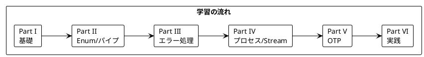

# Grokking Functional Programming - Elixir 版

本シリーズは「Grokking Functional Programming」（Michał Płachta 著）の学習コンパニオンとして、関数型プログラミングの概念を Elixir で実装しながら日本語で解説します。

---

## 対象読者

- 他の言語（Ruby, Python, JavaScript 等）の経験があり、関数型プログラミングに興味がある開発者
- Elixir を学びたいが、FP の概念から理解したい方
- 実践的な FP の適用方法を知りたいエンジニア

---

## Elixir と関数型プログラミング

Elixir は Erlang VM（BEAM）上で動作する関数型言語で、以下の特徴があります:

- **イミュータブルデータ**: すべてのデータは不変
- **パターンマッチング**: 強力なパターンマッチング構文
- **パイプ演算子**: `|>` による関数の連鎖
- **プロセス**: 軽量な並行処理モデル
- **OTP**: 堅牢な分散システム構築のためのフレームワーク

---

## 記事一覧

### [Part I: 関数型プログラミングの基礎](part-1.md)

関数型プログラミングの基本概念を学びます。

| 章 | トピック |
|----|----------|
| 第1章 | 命令型 vs 関数型、Elixir 基本構文 |
| 第2章 | 純粋関数、副作用の排除、テストの容易さ |

**キーワード**: 純粋関数、参照透過性、副作用、パターンマッチング

---

### [Part II: 関数型スタイルのプログラミング](part-2.md)

イミュータブルなデータ操作と高階関数を学びます。

| 章 | トピック |
|----|----------|
| 第3章 | イミュータブルデータ、リスト操作 |
| 第4章 | 高階関数、Enum モジュール |
| 第5章 | flat_map、for 内包表記 |

**キーワード**: イミュータブル、高階関数、Enum、パイプ演算子

---

### [Part III: エラーハンドリング](part-3.md)

型安全なエラーハンドリングを学びます。

| 章 | トピック |
|----|----------|
| 第6章 | nil の扱い、ガード節 |
| 第7章 | {:ok, value} / {:error, reason}、with 式 |

**キーワード**: タプルによるエラー処理、with 式、パターンマッチング

---

### [Part IV: プロセスと状態管理](part-4.md)

Elixir のプロセスモデルと状態管理を学びます。

| 章 | トピック |
|----|----------|
| 第8章 | Agent、GenServer |
| 第9章 | Stream、遅延評価 |

**キーワード**: Agent、GenServer、Stream、遅延評価

---

### [Part V: 並行処理と OTP](part-5.md)

Elixir/OTP における並行処理を学びます。

| 章 | トピック |
|----|----------|
| 第10章 | Task、並列処理 |
| 第11章 | Supervisor、OTP パターン |

**キーワード**: Task、Supervisor、OTP、フォールトトレランス

---

### [Part VI: 実践的なアプリケーション構築とテスト](part-6.md)

実践的なアプリケーション構築とテスト戦略を学びます。

| 章 | トピック |
|----|----------|
| 第12章 | TravelGuide アプリ、Behaviour、キャッシュ |
| 第13章 | テスト戦略、ExUnit、プロパティベーステスト |

**キーワード**: Behaviour、ExUnit、StreamData

---

## 学習パス



---

## Scala vs Elixir 対応表

| 概念 | Scala | Elixir |
|------|-------|--------|
| 基本単位 | クラス/オブジェクト | モジュール/関数 |
| コレクション操作 | map/filter/foldLeft | Enum.map/filter/reduce |
| パイプライン | メソッドチェーン | パイプ演算子 `\|>` |
| Option | Option[A] | nil またはタプル |
| Either | Either[E, A] | {:ok, value} / {:error, reason} |
| IO モナド | IO[A] (cats-effect) | 副作用は直接実行 |
| 状態管理 | Ref | Agent / GenServer |
| 並行処理 | Fiber | Process / Task |
| ストリーム | fs2 Stream | Stream |

---

## 使用ライブラリ

| ライブラリ | 用途 | 対応章 |
|------------|------|--------|
| Elixir 1.15+ | 言語 | 全章 |
| ExUnit | テストフレームワーク | 全章 |
| StreamData | プロパティベーステスト | Part VI |

---

## リポジトリ構成

```
grokkingfp-examples/
├── app/elixir/                  # Elixir のサンプルコード
│   ├── lib/
│   │   ├── ch01/               # 第1章
│   │   ├── ch02/               # 第2章
│   │   └── ...
│   ├── test/                   # テストコード
│   └── mix.exs                 # プロジェクト設定
├── docs/article/elixir/        # 解説記事（本ディレクトリ）
│   ├── index.md                # この記事
│   ├── part-1.md               # Part I
│   ├── part-2.md               # Part II
│   ├── part-3.md               # Part III
│   ├── part-4.md               # Part IV
│   ├── part-5.md               # Part V
│   └── part-6.md               # Part VI
└── ...
```

---

## Elixir における関数型プログラミングの利点

本シリーズを通じて、以下の利点を実感できます:

1. **予測可能性** - 純粋関数は同じ入力に対して常に同じ出力
2. **テスト容易性** - 副作用がないためテストが簡単
3. **合成可能性** - パイプ演算子で関数を自然に連鎖
4. **並行安全性** - イミュータブルデータとアクターモデル
5. **フォールトトレランス** - OTP による堅牢なシステム構築
6. **スケーラビリティ** - BEAM VM による分散処理

---

## 参考資料

- [Grokking Functional Programming](https://www.manning.com/books/grokking-functional-programming) - 原著
- [Elixir 公式ドキュメント](https://elixir-lang.org/docs.html)
- [Elixir School](https://elixirschool.com/ja/) - 日本語チュートリアル
- [Hex.pm](https://hex.pm/) - Elixir パッケージリポジトリ
