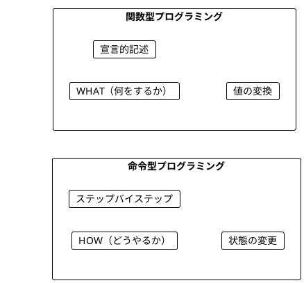
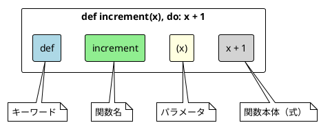
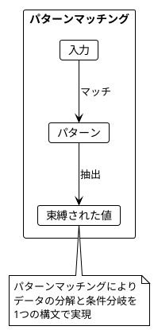
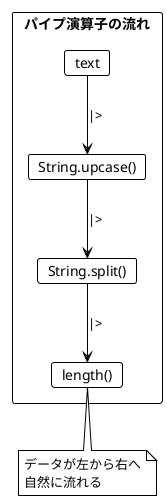
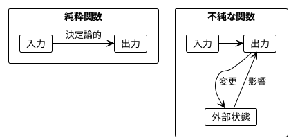
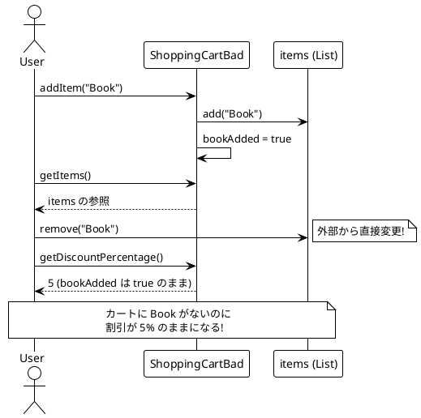
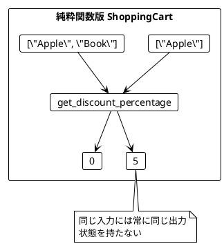
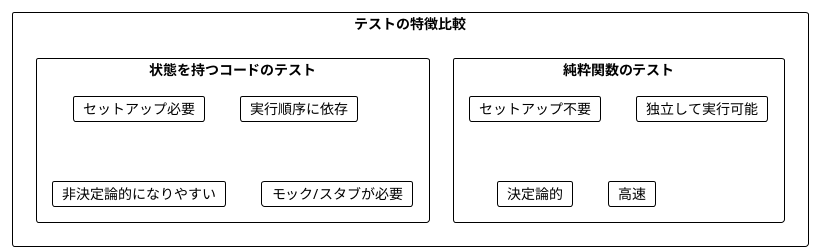
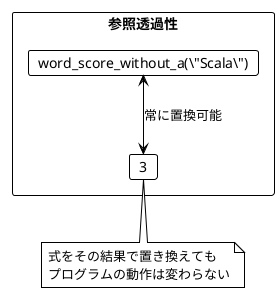
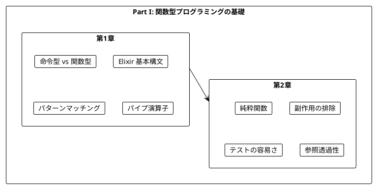

# Part I: 関数型プログラミングの基礎

本章では、関数型プログラミング（FP）の基本概念を学びます。命令型プログラミングとの違いを理解し、純粋関数の利点を実感することが目標です。

---

## 第1章: 関数型プログラミング入門

### 1.1 命令型 vs 関数型

プログラミングには大きく分けて2つのパラダイムがあります。



**命令型プログラミング**は「どうやるか」を記述します。

```java
// Java: 命令型でワードスコアを計算
public static int calculateScore(String word) {
    int score = 0;
    for(char c : word.toCharArray()) {
        score++;
    }
    return score;
}
```

**関数型プログラミング**は「何をするか」を記述します。

```elixir
# Elixir: 関数型でワードスコアを計算
def word_score(word), do: String.length(word)
```

### 1.2 Elixir の基本構文

Elixir での関数定義の基本形を見てみましょう。

**ソースファイル**: `app/elixir/lib/ch01/intro.ex`

```elixir
defmodule Ch01.Intro do
  # 数値を1増加させる
  def increment(x), do: x + 1

  # 文字列の最初の文字を取得
  def get_first_character(s), do: String.first(s)

  # 単語のスコアを計算（文字数）
  def word_score(word), do: String.length(word)
end
```

### 1.3 関数の構造



### 1.4 Elixir の関数定義スタイル

Elixir では複数の関数定義スタイルがあります。

```elixir
# 1行形式（短い関数向け）
def increment(x), do: x + 1

# ブロック形式（複数行の処理向け）
def increment(x) do
  x + 1
end

# 複数節（パターンマッチング）
def head([]), do: {:error, :empty_list}
def head([h | _t]), do: {:ok, h}
```

### 1.5 パターンマッチング

Elixir の強力な機能の一つがパターンマッチングです。

```elixir
# タプルからデータを抽出
def extract_name({:user, name, _age}), do: name

# リストの先頭と末尾を取得
def head([h | _t]), do: {:ok, h}
def tail([_h | t]), do: {:ok, t}

# 使用例
iex> extract_name({:user, "Alice", 30})
"Alice"

iex> head([1, 2, 3])
{:ok, 1}
```



### 1.6 パイプ演算子

Elixir の特徴的な機能がパイプ演算子（`|>`）です。

```elixir
# パイプ演算子なし（ネストが深い）
length(String.split(String.upcase(text)))

# パイプ演算子あり（読みやすい）
text
|> String.upcase()
|> String.split()
|> length()
```



### 1.7 ガード節

条件分岐をパターンマッチングと組み合わせられます。

```elixir
def describe_number(n) when n > 0, do: "positive"
def describe_number(n) when n < 0, do: "negative"
def describe_number(0), do: "zero"

def describe_type(value) when is_binary(value), do: "string"
def describe_type(value) when is_integer(value), do: "integer"
def describe_type(value) when is_float(value), do: "float"
def describe_type(value) when is_list(value), do: "list"
def describe_type(_value), do: "unknown"
```

### 1.8 学習ポイント

| 概念 | 命令型 | Elixir（関数型） |
|------|--------|-----------------|
| 焦点 | 手順（How） | 結果（What） |
| 状態 | 変更する | 変換する |
| ループ | for/while | Enum/再帰 |
| データ | ミュータブル | イミュータブル |
| 分岐 | if/switch | パターンマッチング |
| 合成 | メソッドチェーン | パイプ演算子 |

---

## 第2章: 純粋関数とテスト

### 2.1 純粋関数とは

純粋関数（Pure Function）は以下の特徴を持つ関数です:

1. **同じ入力には常に同じ出力を返す**
2. **副作用がない**（外部状態を変更しない）



### 2.2 純粋関数の例

**ソースファイル**: `app/elixir/lib/ch02/pure_functions.ex`

```elixir
defmodule Ch02.PureFunctions do
  # 純粋関数の例
  def increment(x), do: x + 1
  def add(a, b), do: a + b
  def double(x), do: x * 2

  # 文字 'a' を除外したスコア
  def word_score_without_a(word) do
    word
    |> String.replace("a", "")
    |> String.length()
  end

  # 偶数判定
  def even?(n), do: rem(n, 2) == 0
end
```

**純粋ではない関数の例**:

```elixir
# 不純な関数 - 毎回異なる値を返す
def random_part(x), do: x * :rand.uniform()

# 不純な関数 - 外部状態に依存
def get_current_time(), do: DateTime.utc_now()
```

### 2.3 ショッピングカートの例

状態を持つオブジェクト指向的なアプローチの問題点を見てみましょう。

**ソースファイル**: `app/elixir/lib/ch02/shopping_cart.ex`

#### 問題のあるコード（他言語での例）

```java
// Java: 状態を持つクラス
class ShoppingCartBad {
    private List<String> items = new ArrayList<>();
    private boolean bookAdded = false;

    public void addItem(String item) {
        items.add(item);
        if(item.equals("Book")) {
            bookAdded = true;
        }
    }

    public int getDiscountPercentage() {
        if(bookAdded) {
            return 5;
        } else {
            return 0;
        }
    }

    public List<String> getItems() {
        return items;  // 問題: 内部状態への参照を返している
    }
}
```



#### 純粋関数による解決

```elixir
defmodule Ch02.ShoppingCart do
  # 純粋関数: 状態を持たず、入力から出力を計算
  def get_discount_percentage(items) do
    if "Book" in items, do: 5, else: 0
  end

  # カートにアイテムを追加（新しいリストを返す）
  def add_item(items, item), do: items ++ [item]

  # カートからアイテムを削除（新しいリストを返す）
  def remove_item(items, item), do: List.delete(items, item)
end
```



### 2.4 チップ計算の例

**ソースファイル**: `app/elixir/lib/ch02/tip_calculator.ex`

```elixir
defmodule Ch02.TipCalculator do
  def get_tip_percentage(names) do
    count = length(names)

    cond do
      count > 5 -> 20
      count > 0 -> 10
      true -> 0
    end
  end

  def calculate_tip(bill_amount, names) do
    bill_amount * get_tip_percentage(names) / 100
  end
end
```

この関数は:
- 6人以上のグループ → 20% のチップ
- 1-5人のグループ → 10% のチップ
- 0人（空リスト） → 0% のチップ

### 2.5 純粋関数のテスト

純粋関数は非常にテストしやすいです。

**ソースファイル**: `app/elixir/test/ch02/pure_functions_test.exs`

```elixir
defmodule Ch02.PureFunctionsTest do
  use ExUnit.Case

  test "increment は正しく動作する" do
    assert Ch02.PureFunctions.increment(6) == 7
    assert Ch02.PureFunctions.increment(0) == 1
    assert Ch02.PureFunctions.increment(-6) == -5
  end

  test "word_score_without_a は 'a' を除外してカウント" do
    assert Ch02.PureFunctions.word_score_without_a("Scala") == 3
    assert Ch02.PureFunctions.word_score_without_a("banana") == 3
  end

  test "同じ入力に対して常に同じ出力（参照透過性）" do
    for _ <- 1..100 do
      assert Ch02.PureFunctions.increment(5) == 6
    end
  end
end
```



### 2.6 参照透過性

純粋関数は**参照透過性（Referential Transparency）**を持ちます。

> 式をその評価結果で置き換えても、プログラムの意味が変わらないこと

```elixir
# 参照透過性の例
score1 = Ch02.PureFunctions.word_score_without_a("Scala")
score2 = Ch02.PureFunctions.word_score_without_a("Scala")
# score1 と score2 は常に同じ値（3）

# 以下の2つは同等
total1 = Ch02.PureFunctions.word_score_without_a("Elixir") +
         Ch02.PureFunctions.word_score_without_a("Scala")
total2 = 6 + 3  # word_score_without_a の結果で置き換え可能
```



---

## Scala vs Elixir 比較

| 概念 | Scala | Elixir |
|------|-------|--------|
| 関数定義 | `def f(x: Int): Int = x + 1` | `def f(x), do: x + 1` |
| 型アノテーション | 必須/推論 | オプション（@spec） |
| パターンマッチ | `case x match { ... }` | `case x do ... end` または関数節 |
| パイプライン | `.` チェーン | `\|>` 演算子 |
| ガード | `if` 式 | `when` ガード節 |
| テストフレームワーク | ScalaTest | ExUnit |
| イミュータビリティ | `val` で不変 | デフォルトで不変 |

---

## まとめ

### Part I で学んだこと



### キーポイント

1. **関数型プログラミング**は「何をするか」を宣言的に記述する
2. **純粋関数**は同じ入力に対して常に同じ出力を返す
3. **副作用**を避けることでコードの予測可能性が向上する
4. **パイプ演算子**で関数を自然に連鎖できる
5. **パターンマッチング**でデータの分解と条件分岐を簡潔に記述
6. **純粋関数**はテストが非常に簡単
7. **参照透過性**により、コードの理解と推論が容易になる

### Elixir の特徴

- **イミュータブルデータ**: すべてのデータが不変
- **パターンマッチング**: 強力なデータ分解機能
- **パイプ演算子**: 関数合成を読みやすく
- **軽量プロセス**: 並行処理が得意（後の章で詳述）
- **OTP**: 堅牢なシステム構築のためのフレームワーク

### 次のステップ

Part II では、以下のトピックを学びます:

- イミュータブルなデータ操作
- 高階関数（関数を値として扱う）
- Enum モジュール（map, filter, reduce）
- for 内包表記

---

## 演習問題

### 問題 1: 純粋関数の識別

以下の関数のうち、純粋関数はどれですか?

```elixir
# A
def double(x), do: x * 2

# B
def increment_counter() do
  Agent.update(:counter, &(&1 + 1))
  Agent.get(:counter, & &1)
end

# C
def greet(name), do: "Hello, #{name}!"

# D
def current_time(), do: DateTime.utc_now()
```

<details>
<summary>解答</summary>

**A と C は純粋関数**です。

- A: 同じ入力に対して常に同じ出力を返し、副作用がない
- B: Agent の状態を変更する副作用がある（不純）
- C: 同じ入力に対して常に同じ出力を返し、副作用がない
- D: 呼び出すたびに異なる値を返す（不純）

</details>

### 問題 2: パイプ演算子で書き換え

以下のネストした関数呼び出しをパイプ演算子を使って書き換えてください。

```elixir
String.trim(String.downcase(String.reverse("  HELLO  ")))
```

<details>
<summary>解答</summary>

```elixir
"  HELLO  "
|> String.reverse()
|> String.downcase()
|> String.trim()
```

結果: `"olleh"`

</details>

### 問題 3: テストを書く

以下の関数に対するテストケースを考えてください。

```elixir
def is_even?(n), do: rem(n, 2) == 0
```

<details>
<summary>解答</summary>

```elixir
defmodule IsEvenTest do
  use ExUnit.Case

  test "偶数の場合 true を返す" do
    assert is_even?(0) == true
    assert is_even?(2) == true
    assert is_even?(4) == true
  end

  test "奇数の場合 false を返す" do
    assert is_even?(1) == false
    assert is_even?(3) == false
  end

  test "負の偶数も true を返す" do
    assert is_even?(-2) == true
  end

  test "負の奇数も false を返す" do
    assert is_even?(-3) == false
  end
end
```

</details>

### 問題 4: パターンマッチングで実装

リストの2番目の要素を取得する関数 `second/1` をパターンマッチングで実装してください。

<details>
<summary>解答</summary>

```elixir
def second([]), do: {:error, :empty_list}
def second([_]), do: {:error, :too_short}
def second([_, second | _]), do: {:ok, second}

# 使用例
iex> second([1, 2, 3])
{:ok, 2}

iex> second([1])
{:error, :too_short}

iex> second([])
{:error, :empty_list}
```

</details>
