# Part II: 関数型スタイルのプログラミング

本章では、関数型プログラミングの核心となるテクニックを学びます。イミュータブルなデータ操作、高階関数、そして `flat_map` と for 内包表記による複雑なデータ変換を習得します。

---

## 第3章: イミュータブルなデータ操作

### 3.1 イミュータブルとは

イミュータブル（不変）とは、一度作成されたデータが変更されないことを意味します。Elixir ではすべてのデータがイミュータブルです。データを「変更」する代わりに、新しいデータを「作成」します。

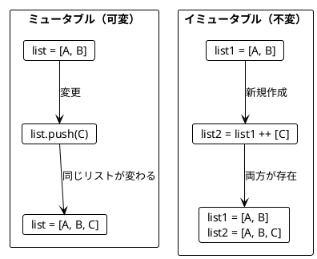

### 3.2 リストの基本操作

**ソースファイル**: `app/elixir/lib/ch03/immutable_data.ex`

#### 要素の追加

```elixir
# 末尾に追加
def append(list, element), do: list ++ [element]

# 先頭に追加（効率的）
def prepend(list, element), do: [element | list]

# 使用例
iex> append(["Apple", "Book"], "Mango")
["Apple", "Book", "Mango"]

iex> prepend(["Apple", "Book"], "Mango")
["Mango", "Apple", "Book"]
```

#### スライス操作

```elixir
# 最初の N 要素
def first_n(list, n), do: Enum.take(list, n)

# 最後の N 要素
def last_n(list, n), do: Enum.take(list, -n)

# 最初の N 要素を除く
def drop_first_n(list, n), do: Enum.drop(list, n)

# 使用例
iex> first_n(["a", "b", "c", "d"], 2)
["a", "b"]

iex> last_n(["a", "b", "c", "d"], 2)
["c", "d"]
```

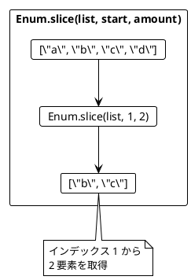

### 3.3 リストの変換例

```elixir
# 最初の2要素を末尾に移動
def move_first_two_to_end(list) do
  first_two = Enum.take(list, 2)
  without_first_two = Enum.drop(list, 2)
  without_first_two ++ first_two
end

iex> move_first_two_to_end(["a", "b", "c"])
["c", "a", "b"]

# 中央に要素を挿入
def insert_at_middle(list, element) do
  middle = div(length(list), 2)
  before = Enum.take(list, middle)
  after_middle = Enum.drop(list, middle)
  before ++ [element] ++ after_middle
end

iex> insert_at_middle(["a", "b", "c", "d"], "X")
["a", "b", "X", "c", "d"]
```

### 3.4 旅程の再計画

旅行の計画変更をイミュータブルに行う例です。

```elixir
def replan(plan, new_city, before_city) do
  before_city_index = Enum.find_index(plan, &(&1 == before_city))
  cities_before = Enum.take(plan, before_city_index)
  cities_after = Enum.drop(plan, before_city_index)
  cities_before ++ [new_city] ++ cities_after
end

iex> plan_a = ["Paris", "Berlin", "Kraków"]
iex> plan_b = replan(plan_a, "Vienna", "Kraków")
["Paris", "Berlin", "Vienna", "Kraków"]
iex> plan_a  # 元の計画は変わらない!
["Paris", "Berlin", "Kraków"]
```

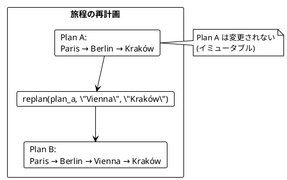

### 3.5 文字列操作

文字列も Elixir ではイミュータブルです。

```elixir
def abbreviate(name) do
  initial = String.first(name)
  separator_index = :binary.match(name, " ")

  case separator_index do
    {pos, _} ->
      last_name = String.slice(name, (pos + 1)..-1//1)
      "#{initial}. #{last_name}"
    :nomatch ->
      name
  end
end

iex> abbreviate("Alonzo Church")
"A. Church"
```

### 3.6 イミュータブルの利点

| 利点 | 説明 |
|------|------|
| 予測可能性 | データが変わらないので追跡が容易 |
| 並行安全性 | 競合状態が発生しない |
| テスト容易性 | 状態を気にせずテストできる |
| デバッグ容易性 | 変更履歴を追いやすい |

---

## 第4章: 関数を値として扱う

### 4.1 高階関数とは

高階関数（Higher-Order Function）とは:

1. 関数を引数として受け取る
2. 関数を戻り値として返す

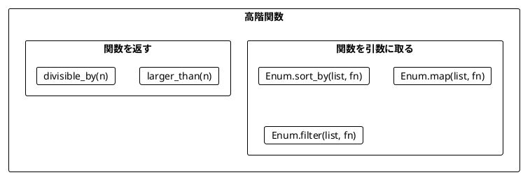

### 4.2 Enum.map - 各要素を変換

**ソースファイル**: `app/elixir/lib/ch04/higher_order_functions.ex`

```elixir
# 長さを取得
iex> Enum.map(["elixir", "rust", "ada"], &String.length/1)
[6, 4, 3]

# 2倍にする
iex> Enum.map([5, 1, 2, 4, 0], &(&1 * 2))
[10, 2, 4, 8, 0]

# 省略記法（キャプチャ演算子）
iex> Enum.map([1, 2, 3], &(&1 * 2))
[2, 4, 6]
```

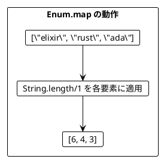

### 4.3 Enum.filter - 条件に合う要素を抽出

```elixir
# 奇数を抽出
iex> Enum.filter([5, 1, 2, 4, 0], &(rem(&1, 2) == 1))
[5, 1]

# 4より大きい要素
iex> Enum.filter([5, 1, 2, 4, 0], &(&1 > 4))
[5]
```

### 4.4 Enum.reduce - 畳み込み

```elixir
# 合計
iex> Enum.reduce([5, 1, 2, 4, 100], 0, &(&1 + &2))
112

# 最大値
iex> Enum.reduce([5, 1, 2, 4, 15], 0, fn i, max ->
...>   if i > max, do: i, else: max
...> end)
15
```

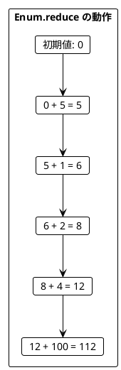

### 4.5 関数を返す関数

```elixir
# N より大きいかを判定する関数を返す
def larger_than(n), do: fn i -> i > n end

iex> larger = larger_than(4)
iex> larger.(5)
true
iex> larger.(3)
false

# フィルタリングに使用
iex> Enum.filter([5, 1, 2, 4, 0], larger_than(4))
[5]
```

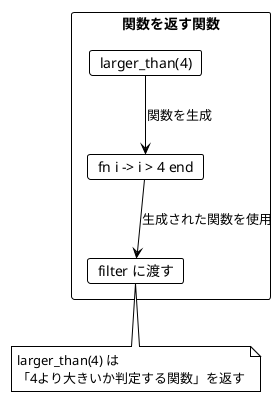

### 4.6 ワードスコアリングの例

複数のスコアリングロジックを組み合わせる例です。

```elixir
def score(word), do: word |> String.replace("a", "") |> String.length()
def bonus(word), do: if String.contains?(word, "c"), do: 5, else: 0
def penalty(word), do: if String.contains?(word, "s"), do: 7, else: 0

# スコア関数でランキングを作成
def ranked_words(word_score, words) do
  words
  |> Enum.sort_by(word_score)
  |> Enum.reverse()
end

words = ["ada", "haskell", "scala", "java", "rust"]

# 基本スコアでランキング
ranked_words(&score/1, words)
# ["haskell", "rust", "scala", "java", "ada"]

# ボーナス付きスコアでランキング
ranked_words(fn w -> score(w) + bonus(w) end, words)
# ["scala", "haskell", "rust", "java", "ada"]

# ボーナスとペナルティ付きスコアでランキング
ranked_words(fn w -> score(w) + bonus(w) - penalty(w) end, words)
# ["java", "scala", "ada", "haskell", "rust"]
```

### 4.7 Elixir のキャプチャ演算子

Elixir では `&` を使って関数を簡潔に参照・定義できます。

```elixir
# 名前付き関数の参照
&String.length/1

# 無名関数の短縮形
&(&1 * 2)          # fn x -> x * 2 end と同等
&(&1 + &2)         # fn a, b -> a + b end と同等
&String.upcase(&1) # fn s -> String.upcase(s) end と同等
```

---

## 第5章: flat_map とネスト構造

### 5.1 flatten と flat_map

**ソースファイル**: `app/elixir/lib/ch05/flat_map_and_comprehensions.ex`

#### List.flatten - ネストしたリストを平坦化

```elixir
iex> List.flatten([[1, 2], [3], [4, 5]])
[1, 2, 3, 4, 5]

# 書籍リストから全著者を抽出
books = [
  %{title: "FP in Scala", authors: ["Chiusano", "Bjarnason"]},
  %{title: "The Hobbit", authors: ["Tolkien"]}
]

books
|> Enum.map(& &1.authors)
|> List.flatten()
# ["Chiusano", "Bjarnason", "Tolkien"]
```

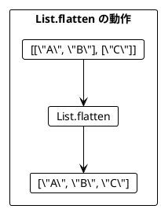

#### Enum.flat_map = map + flatten

```elixir
# map して flatten
books |> Enum.map(& &1.authors) |> List.flatten()

# flat_map で同じことを1行で
books |> Enum.flat_map(& &1.authors)
# ["Chiusano", "Bjarnason", "Tolkien"]
```

### 5.2 flat_map によるリストサイズの変化

```elixir
# 要素数が増える
Enum.flat_map([1, 2, 3], fn i -> [i, i + 10] end)
# [1, 11, 2, 12, 3, 13] - 6要素

# 要素数が同じ
Enum.flat_map([1, 2, 3], fn i -> [i * 2] end)
# [2, 4, 6] - 3要素

# 要素数が減る（フィルタリング効果）
Enum.flat_map([1, 2, 3], fn i ->
  if rem(i, 2) == 0, do: [i], else: []
end)
# [2] - 1要素
```

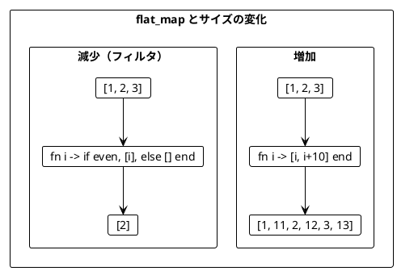

### 5.3 ネストした flat_map

複数のリストを組み合わせる場合、flat_map をネストします。

```elixir
defmodule Book do
  defstruct [:title, :authors]
end

defmodule Movie do
  defstruct [:title]
end

def book_adaptations("Tolkien") do
  [%Movie{title: "An Unexpected Journey"}, %Movie{title: "The Desolation of Smaug"}]
end
def book_adaptations(_), do: []

books = [
  %Book{title: "FP in Scala", authors: ["Chiusano", "Bjarnason"]},
  %Book{title: "The Hobbit", authors: ["Tolkien"]}
]

# ネストした flat_map
Enum.flat_map(books, fn book ->
  Enum.flat_map(book.authors, fn author ->
    Enum.map(book_adaptations(author), fn movie ->
      "You may like #{movie.title}, because you liked #{author}'s #{book.title}"
    end)
  end)
end)
# ["You may like An Unexpected Journey, because you liked Tolkien's The Hobbit",
#  "You may like The Desolation of Smaug, because you liked Tolkien's The Hobbit"]
```

### 5.4 for 内包表記

ネストした flat_map は for 内包表記で読みやすく書けます。

```elixir
# flat_map/map 版
Enum.flat_map(books, fn book ->
  Enum.flat_map(book.authors, fn author ->
    Enum.map(book_adaptations(author), fn movie ->
      "You may like #{movie.title}, because you liked #{author}'s #{book.title}"
    end)
  end)
end)

# for 内包表記版（等価）
for book <- books,
    author <- book.authors,
    movie <- book_adaptations(author) do
  "You may like #{movie.title}, because you liked #{author}'s #{book.title}"
end
```

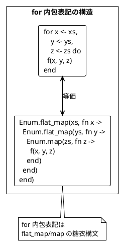

### 5.5 ガード式によるフィルタリング

for 内包表記では条件でフィルタリングもできます。

```elixir
defmodule Point do
  defstruct [:x, :y]
end

def inside?(%Point{x: x, y: y}, radius) do
  radius * radius >= x * x + y * y
end

points = [%Point{x: 5, y: 2}, %Point{x: 1, y: 1}]
radiuses = [2, 1]

# 全組み合わせを生成
for r <- radiuses,
    point <- points do
  "Point(#{point.x}, #{point.y}) is within a radius of #{r}: #{inside?(point, r)}"
end

# 円内の点のみ抽出（ガード式使用）
for r <- radiuses,
    point <- points,
    inside?(point, r) do  # フィルタ条件
  "Point(#{point.x}, #{point.y}) is within a radius of #{r}"
end
# ["Point(1, 1) is within a radius of 2"]
```

### 5.6 for 内包表記と結果の型

Elixir の for 内包表記は `into:` オプションで出力先を変更できます。

```elixir
# デフォルト: リストを返す
for i <- [1, 2, 3], do: i * 2
# [2, 4, 6]

# MapSet を返す
for item <- [1, 2, 2, 3], into: MapSet.new(), do: item
# MapSet.new([1, 2, 3])

# Map を返す
for s <- ["a", "bb", "ccc"], into: %{}, do: {s, String.length(s)}
# %{"a" => 1, "bb" => 2, "ccc" => 3}

# 文字列を返す
for <<c <- "hello">>, into: "", do: <<c + 1>>
# "ifmmp"
```

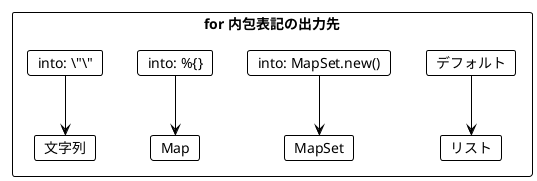

---

## Scala vs Elixir 比較

| 操作 | Scala | Elixir |
|------|-------|--------|
| 末尾追加 | `list.appended(x)` | `list ++ [x]` |
| 先頭追加 | `x :: list` | `[x \| list]` |
| スライス | `list.slice(a, b)` | `Enum.slice(list, a, b-a)` |
| map | `list.map(f)` | `Enum.map(list, f)` |
| filter | `list.filter(f)` | `Enum.filter(list, f)` |
| foldLeft | `list.foldLeft(init)(f)` | `Enum.reduce(list, init, f)` |
| flatMap | `list.flatMap(f)` | `Enum.flat_map(list, f)` |
| flatten | `list.flatten` | `List.flatten(list)` |
| for 内包表記 | `for { x <- xs } yield f(x)` | `for x <- xs, do: f(x)` |

---

## まとめ

### Part II で学んだこと

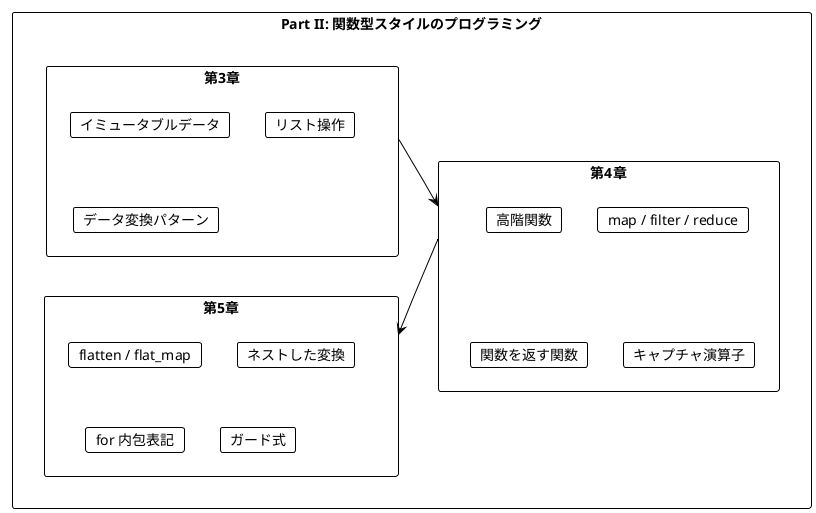

### キーポイント

| 章 | 主要概念 | キー操作 |
|----|----------|----------|
| 第3章 | イミュータブル | `++`, `Enum.take`, `Enum.drop`, `Enum.slice` |
| 第4章 | 高階関数 | `Enum.map`, `Enum.filter`, `Enum.reduce`, `Enum.sort_by` |
| 第5章 | 平坦化 | `List.flatten`, `Enum.flat_map`, `for` 内包表記 |

### 重要な法則

1. **イミュータブルデータ**: 元のデータは変更せず、新しいデータを作成する
2. **関数は値**: 関数を引数として渡したり、戻り値として返したりできる
3. **flat_map パターン**: ネストした構造を平坦化しながら変換する
4. **for 内包表記**: flat_map/map の糖衣構文として使える
5. **パイプ演算子**: データ変換を読みやすく連鎖させる

### 次のステップ

Part III では、以下のトピックを学びます:

- nil の安全な扱い
- `{:ok, value}` / `{:error, reason}` パターン
- `with` 式によるエラーハンドリング

---

## 演習問題

### 問題 1: イミュータブルな操作

以下の関数を実装してください。リストの最初と最後の要素を入れ替える関数です。

```elixir
def swap_first_last(list)

# 期待される動作
swap_first_last([1, 2, 3, 4]) == [4, 2, 3, 1]
swap_first_last([1, 2]) == [2, 1]
```

<details>
<summary>解答</summary>

```elixir
def swap_first_last([]), do: []
def swap_first_last([x]), do: [x]
def swap_first_last([first | rest]) do
  last = List.last(rest)
  middle = Enum.drop(rest, -1)
  [last | middle] ++ [first]
end
```

</details>

### 問題 2: 高階関数

以下の関数を実装してください。条件を満たす要素の数をカウントする関数です。

```elixir
def count_where(list, predicate)

# 期待される動作
count_where([1, 2, 3, 4, 5], &(&1 > 3)) == 2
count_where(["a", "bb", "ccc"], &(String.length(&1) > 1)) == 2
```

<details>
<summary>解答</summary>

```elixir
def count_where(list, predicate) do
  Enum.count(list, predicate)
end

# または filter を使って
def count_where(list, predicate) do
  list |> Enum.filter(predicate) |> length()
end

# または reduce を使って
def count_where(list, predicate) do
  Enum.reduce(list, 0, fn elem, count ->
    if predicate.(elem), do: count + 1, else: count
  end)
end
```

</details>

### 問題 3: for 内包表記

以下のネストした flat_map を for 内包表記で書き換えてください。

```elixir
Enum.flat_map([1, 2], fn x ->
  Enum.flat_map([10, 20], fn y ->
    Enum.map([100, 200], fn z ->
      x + y + z
    end)
  end)
end)
```

<details>
<summary>解答</summary>

```elixir
for x <- [1, 2],
    y <- [10, 20],
    z <- [100, 200] do
  x + y + z
end

# 結果: [111, 211, 121, 221, 112, 212, 122, 222]
```

</details>

### 問題 4: flat_map によるフィルタリング

for 内包表記のガード式を使わずに、flat_map だけで偶数のみを抽出するコードを書いてください。

```elixir
numbers = [1, 2, 3, 4, 5, 6]
# 偶数のみを抽出: [2, 4, 6]
```

<details>
<summary>解答</summary>

```elixir
Enum.flat_map(numbers, fn n ->
  if rem(n, 2) == 0, do: [n], else: []
end)

# または関数に分離
def even_filter(n) do
  if rem(n, 2) == 0, do: [n], else: []
end

Enum.flat_map(numbers, &even_filter/1)
```

</details>
