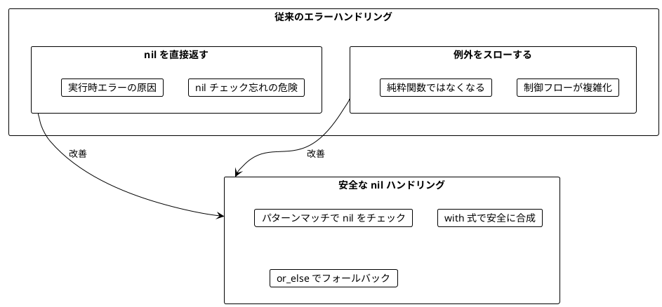
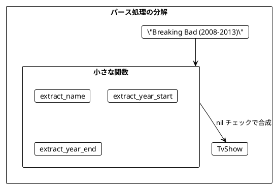
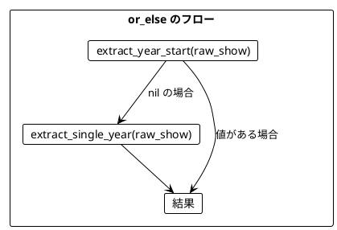
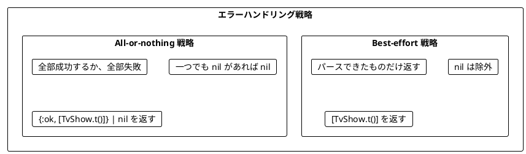
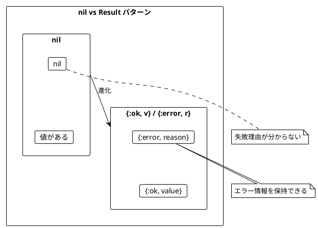
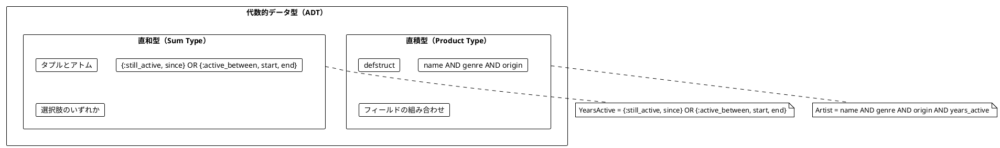
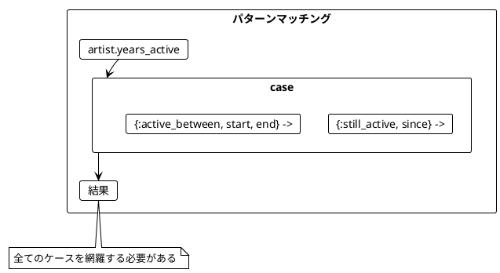
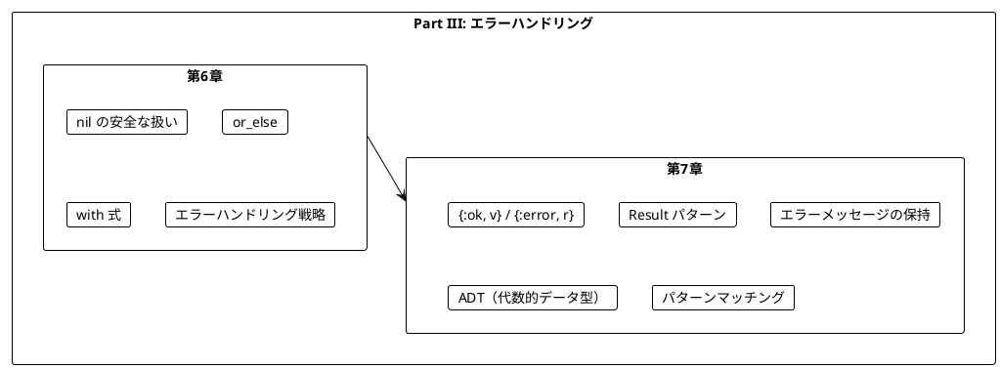

# Part III: エラーハンドリングと nil / Result パターン

本章では、関数型プログラミングにおける安全なエラーハンドリングを学びます。例外に頼らず、`nil` と `{:ok, value} / {:error, reason}` パターンを使って型安全にエラーを扱う方法を習得します。

---

## 第6章: nil の安全な扱い

### 6.1 なぜ nil を安全に扱う必要があるか

従来のエラーハンドリングには問題があります。



### 6.2 Elixir における nil

Elixir では `nil` は特別な値として扱われます。Scala の `Option` のような専用の型はありませんが、パターンマッチングと `with` 式を使って安全に扱えます。

**ソースファイル**: `app/elixir/lib/ch06/nil_handling.ex`

### 6.3 TV番組のパース例

TV番組の文字列をパースする例で nil の安全な扱い方を学びます。

```elixir
defmodule TvShow do
  defstruct [:title, :start, :end_year]
end

# 入力例: "Breaking Bad (2008-2013)"
# 期待する出力: %TvShow{title: "Breaking Bad", start: 2008, end_year: 2013}
```

#### 例外を使う方法（問題あり）

```elixir
def parse_show_unsafe!(raw_show) do
  bracket_open = find_index(raw_show, "(")
  bracket_close = find_index(raw_show, ")")
  dash = find_index(raw_show, "-")

  name = raw_show |> String.slice(0, bracket_open) |> String.trim()
  year_start = raw_show |> String.slice((bracket_open + 1)..(dash - 1)) |> String.to_integer()
  year_end = raw_show |> String.slice((dash + 1)..(bracket_close - 1)) |> String.to_integer()

  %TvShow{title: name, start: year_start, end_year: year_end}
end

# 正常ケース
parse_show_unsafe!("Breaking Bad (2008-2013)")
# => %TvShow{title: "Breaking Bad", start: 2008, end_year: 2013}

# 異常ケース → 例外がスローされる!
parse_show_unsafe!("Chernobyl (2019)")    # FunctionClauseError
parse_show_unsafe!("The Wire 2002-2008")  # FunctionClauseError
```

#### nil を返す安全な方法

```elixir
def parse_show(raw_show) do
  name = extract_name(raw_show)
  year_start = or_else(extract_year_start(raw_show), fn -> extract_single_year(raw_show) end)
  year_end = or_else(extract_year_end(raw_show), fn -> extract_single_year(raw_show) end)

  if name && year_start && year_end do
    %TvShow{title: name, start: year_start, end_year: year_end}
  else
    nil
  end
end

# 正常ケース
parse_show("Breaking Bad (2008-2013)")
# => %TvShow{title: "Breaking Bad", start: 2008, end_year: 2013}

# 異常ケース → nil が返される（例外なし）
parse_show("The Wire 2002-2008")  # => nil
```

### 6.4 小さな関数から組み立てる

複雑なパース処理を小さな関数に分解します。

```elixir
# 名前を抽出
def extract_name(raw_show) do
  bracket_open = find_index(raw_show, "(")

  if bracket_open > 0 do
    raw_show |> String.slice(0, bracket_open) |> String.trim()
  else
    nil
  end
end

# 開始年を抽出（with 式を使用）
def extract_year_start(raw_show) do
  bracket_open = find_index(raw_show, "(")
  dash = find_index(raw_show, "-")

  with true <- bracket_open != -1 && dash > bracket_open + 1,
       year_str <- String.slice(raw_show, (bracket_open + 1)..(dash - 1)),
       {year, ""} <- Integer.parse(year_str) do
    year
  else
    _ -> nil
  end
end

# 終了年を抽出
def extract_year_end(raw_show) do
  dash = find_index(raw_show, "-")
  bracket_close = find_index(raw_show, ")")

  with true <- dash != -1 && bracket_close > dash + 1,
       year_str <- String.slice(raw_show, (dash + 1)..(bracket_close - 1)),
       {year, ""} <- Integer.parse(year_str) do
    year
  else
    _ -> nil
  end
end
```



### 6.5 or_else によるフォールバック

`or_else` を使って、最初の値が `nil` の場合に代替を試すことができます。

```elixir
def or_else(nil, fallback) when is_function(fallback, 0), do: fallback.()
def or_else(nil, fallback), do: fallback
def or_else(value, _fallback), do: value

# 使用例
or_else(10, 42)     # => 10（値があるのでそのまま）
or_else(nil, 42)    # => 42（nil なので代替を使用）
or_else(nil, fn -> 100 end)  # => 100（遅延評価）
```

#### 単年の番組に対応する

「Chernobyl (2019)」のような単年の番組をパースできるようにします。

```elixir
def extract_single_year(raw_show) do
  dash = find_index(raw_show, "-")
  bracket_open = find_index(raw_show, "(")
  bracket_close = find_index(raw_show, ")")

  with true <- dash == -1 && bracket_open != -1 && bracket_close > bracket_open + 1,
       year_str <- String.slice(raw_show, (bracket_open + 1)..(bracket_close - 1)),
       {year, ""} <- Integer.parse(year_str) do
    year
  else
    _ -> nil
  end
end

def parse_show(raw_show) do
  name = extract_name(raw_show)
  year_start = or_else(extract_year_start(raw_show), fn -> extract_single_year(raw_show) end)
  year_end = or_else(extract_year_end(raw_show), fn -> extract_single_year(raw_show) end)

  if name && year_start && year_end do
    %TvShow{title: name, start: year_start, end_year: year_end}
  else
    nil
  end
end

# これで単年の番組もパースできる
parse_show("Chernobyl (2019)")
# => %TvShow{title: "Chernobyl", start: 2019, end_year: 2019}
```



### 6.6 nil 安全な操作関数

| 関数 | 説明 | 例 |
|------|------|-----|
| `nil_map` | 値があれば変換 | `nil_map(5, &(&1 * 2))` → `10` |
| `nil_flat_map` | 値があれば nil を返す可能性のある関数を適用 | `nil_flat_map(5, fn x -> x end)` → `5` |
| `or_else` | nil なら代替を使用 | `or_else(nil, 5)` → `5` |
| `to_list` | リストに変換 | `to_list(5)` → `[5]`, `to_list(nil)` → `[]` |

```elixir
# nil_map
def nil_map(nil, _func), do: nil
def nil_map(value, func), do: func.(value)

nil_map(5, &(&1 * 2))   # => 10
nil_map(nil, &(&1 * 2)) # => nil

# nil_flat_map
def nil_flat_map(nil, _func), do: nil
def nil_flat_map(value, func), do: func.(value)

nil_flat_map(5, fn x -> if x > 0, do: x * 2, else: nil end)  # => 10
nil_flat_map(nil, fn x -> x * 2 end)  # => nil

# to_list
def to_list(nil), do: []
def to_list(value), do: [value]

to_list(42)   # => [42]
to_list(nil)  # => []
```

### 6.7 エラーハンドリング戦略

複数の要素をパースする場合、2つの戦略があります。



#### Best-effort 戦略

```elixir
def parse_shows_best_effort(raw_shows) do
  raw_shows
  |> Enum.map(&parse_show/1)
  |> Enum.reject(&is_nil/1)
end

raw_shows = [
  "Breaking Bad (2008-2013)",
  "The Wire 2002 2008",        # 無効な形式
  "Mad Men (2007-2015)"
]

parse_shows_best_effort(raw_shows)
# => [%TvShow{title: "Breaking Bad", ...}, %TvShow{title: "Mad Men", ...}]
# 無効なものは除外される
```

#### All-or-nothing 戦略

```elixir
def parse_shows_all_or_nothing(raw_shows) do
  parsed = Enum.map(raw_shows, &parse_show/1)

  if Enum.any?(parsed, &is_nil/1) do
    nil
  else
    {:ok, parsed}
  end
end

# 全部成功 → {:ok, [...]}
parse_shows_all_or_nothing(["Breaking Bad (2008-2013)", "Mad Men (2007-2015)"])
# => {:ok, [%TvShow{...}, %TvShow{...}]}

# 一つでも失敗 → nil
parse_shows_all_or_nothing(["Breaking Bad (2008-2013)", "Invalid"])
# => nil
```

### 6.8 nil_forall と nil_exists

nil に対する条件判定を行う便利な関数です。

```elixir
# nil_forall - nil は常に true（存在しないので「すべてが真」）
def nil_forall(nil, _predicate), do: true
def nil_forall(value, predicate), do: predicate.(value)

nil_forall(5, fn x -> x > 0 end)    # => true
nil_forall(nil, fn x -> x > 0 end)  # => true
nil_forall(-1, fn x -> x > 0 end)   # => false

# nil_exists - nil は常に false（存在しないので「存在しない」）
def nil_exists(nil, _predicate), do: false
def nil_exists(value, predicate), do: predicate.(value)

nil_exists(5, fn x -> x > 0 end)    # => true
nil_exists(nil, fn x -> x > 0 end)  # => false
nil_exists(-1, fn x -> x > 0 end)   # => false
```

---

## 第7章: {:ok, value} / {:error, reason} パターンと代数的データ型

### 7.1 nil の限界

`nil` は「値があるかないか」しか表現できません。**なぜ失敗したのか**を伝えられません。



### 7.2 Result パターンの基本

**ソースファイル**: `app/elixir/lib/ch07/error_handling.ex`

Elixir では `{:ok, value}` と `{:error, reason}` のタプルを使ってエラーを表現します。

- `{:ok, value}`: 成功
- `{:error, reason}`: 失敗（エラー情報を保持）

```elixir
def extract_name(raw_show) do
  bracket_open = find_index(raw_show, "(")

  if bracket_open > 0 do
    {:ok, raw_show |> String.slice(0, bracket_open) |> String.trim()}
  else
    {:error, "Can't extract name from #{raw_show}"}
  end
end

extract_name("The Wire (2002-2008)")  # => {:ok, "The Wire"}
extract_name("(2022)")                # => {:error, "Can't extract name from (2022)"}
```

### 7.3 with 式を使ったパース

`with` 式を使うと、複数の Result を安全に合成できます。

```elixir
def extract_year_start(raw_show) do
  bracket_open = find_index(raw_show, "(")
  dash = find_index(raw_show, "-")

  with true <- bracket_open != -1 && dash > bracket_open + 1,
       year_str <- String.slice(raw_show, (bracket_open + 1)..(dash - 1)),
       {:ok, year} <- parse_int(year_str) do
    {:ok, year}
  else
    false -> {:error, "Can't extract start year from #{raw_show}"}
    {:error, reason} -> {:error, reason}
  end
end

defp parse_int(str) do
  case Integer.parse(str) do
    {value, ""} -> {:ok, value}
    _ -> {:error, "Can't parse '#{str}' as integer"}
  end
end

extract_year_start("The Wire (2002-2008)")   # => {:ok, 2002}
extract_year_start("The Wire (-2008)")       # => {:error, "Can't extract start year from ..."}
extract_year_start("The Wire (oops-2008)")   # => {:error, "Can't parse 'oops' as integer"}
```

### 7.4 Result 型のユーティリティ関数

```elixir
# or_else - 失敗時に代替を試す
def or_else({:ok, _} = result, _fallback), do: result
def or_else({:error, _}, fallback), do: fallback.()

or_else({:ok, 1}, fn -> {:ok, 2} end)        # => {:ok, 1}
or_else({:error, "failed"}, fn -> {:ok, 2} end)  # => {:ok, 2}

# result_map - 成功値を変換
def result_map({:ok, value}, func), do: {:ok, func.(value)}
def result_map({:error, _} = error, _func), do: error

result_map({:ok, 5}, &(&1 * 2))      # => {:ok, 10}
result_map({:error, "oops"}, &(&1 * 2))  # => {:error, "oops"}

# result_flat_map - 成功値に Result を返す関数を適用
def result_flat_map({:ok, value}, func), do: func.(value)
def result_flat_map({:error, _} = error, _func), do: error

result_flat_map({:ok, 5}, fn x -> {:ok, x * 2} end)  # => {:ok, 10}
result_flat_map({:ok, 5}, fn _x -> {:error, "failed"} end)  # => {:error, "failed"}
```

### 7.5 完全なパーサー（with 式版）

```elixir
def parse_show(raw_show) do
  with {:ok, name} <- extract_name(raw_show),
       {:ok, year_start} <- or_else(extract_year_start(raw_show),
                                     fn -> extract_single_year(raw_show) end),
       {:ok, year_end} <- or_else(extract_year_end(raw_show),
                                   fn -> extract_single_year(raw_show) end) do
    {:ok, %TvShow{title: name, start: year_start, end_year: year_end}}
  end
end

parse_show("The Wire (2002-2008)")  # => {:ok, %TvShow{...}}
parse_show("Mad Men ()")            # => {:error, "Can't extract single year from Mad Men ()"}
parse_show("(2002-2008)")           # => {:error, "Can't extract name from (2002-2008)"}
```

### 7.6 Result パターンの主要操作

| 操作 | 説明 | 例 |
|------|------|-----|
| `result_map` | 成功値を変換 | `result_map({:ok, 5}, &(&1 * 2))` → `{:ok, 10}` |
| `result_flat_map` | 成功なら Result を返す関数を適用 | `result_flat_map({:ok, 5}, fn x -> {:ok, x * 2} end)` |
| `or_else` | 失敗なら代替を使用 | `or_else({:error, "err"}, fn -> {:ok, 5} end)` |
| `result_to_nil` | nil に変換 | `result_to_nil({:ok, 5})` → `5` |
| `nil_to_result` | Result に変換 | `nil_to_result(5, "error")` → `{:ok, 5}` |

### 7.7 音楽アーティスト検索の例

より複雑な例として、音楽アーティストの検索機能を見てみましょう。

#### 代数的データ型（ADT）によるモデリング

Elixir ではタプルとパターンマッチングを使って直和型を表現します。

```elixir
# 活動期間の直和型
# {:still_active, since} - 現在も活動中
# {:active_between, start, end_year} - 過去に活動

defmodule Artist do
  defstruct [:name, :genre, :origin, :years_active]
end

# 使用例
metallica = %Artist{
  name: "Metallica",
  genre: :heavy_metal,
  origin: "U.S.",
  years_active: {:still_active, 1981}
}

led_zeppelin = %Artist{
  name: "Led Zeppelin",
  genre: :hard_rock,
  origin: "England",
  years_active: {:active_between, 1968, 1980}
}
```



### 7.8 パターンマッチング

直和型は**パターンマッチング**で処理します。

```elixir
def was_artist_active?(%Artist{years_active: years_active}, year_start, year_end) do
  case years_active do
    {:still_active, since} -> since <= year_end
    {:active_between, start, active_end} -> start <= year_end && active_end >= year_start
  end
end

def active_length(%Artist{years_active: years_active}, current_year) do
  case years_active do
    {:still_active, since} -> current_year - since
    {:active_between, start, active_end} -> active_end - start
  end
end

# 使用例
was_artist_active?(metallica, 2019, 2022)     # => true
was_artist_active?(led_zeppelin, 1990, 2000)  # => false

active_length(metallica, 2022)     # => 41
active_length(led_zeppelin, 2022)  # => 12
```



### 7.9 検索条件のモデリング

検索条件も直和型でモデリングできます。

```elixir
# 検索条件の直和型
# {:by_genre, [genre]} - ジャンルで検索
# {:by_origin, [location]} - 出身地で検索
# {:by_active_years, start, end} - 活動期間で検索

def search_artists(artists, conditions) do
  Enum.filter(artists, fn artist ->
    Enum.all?(conditions, fn condition ->
      matches_condition?(artist, condition)
    end)
  end)
end

defp matches_condition?(artist, condition) do
  case condition do
    {:by_genre, genres} -> artist.genre in genres
    {:by_origin, locations} -> artist.origin in locations
    {:by_active_years, start_year, end_year} -> was_artist_active?(artist, start_year, end_year)
  end
end

# 使用例
artists = [metallica, led_zeppelin, bee_gees]

search_artists(artists, [{:by_genre, [:pop]}, {:by_origin, ["England"]}])
# => [%Artist{name: "Bee Gees", ...}]

search_artists(artists, [{:by_active_years, 2019, 2022}])
# => [%Artist{name: "Metallica", ...}]
```

### 7.10 プレイリストの例

プレイリストの種類も直和型で表現できます。

```elixir
defmodule Song do
  defstruct [:artist, :title]
end

defmodule Playlist do
  defstruct [:name, :kind, :songs]
end

# プレイリストの種類
# {:curated_by_user, user} - ユーザーがキュレーション
# {:based_on_artist, artist} - アーティストベース
# {:based_on_genres, MapSet.t(genre)} - ジャンルベース

def gather_songs(playlists, artist, genre) do
  Enum.flat_map(playlists, fn playlist ->
    case playlist.kind do
      {:curated_by_user, _user} ->
        Enum.filter(playlist.songs, fn song -> song.artist == artist end)

      {:based_on_artist, playlist_artist} ->
        if playlist_artist == artist, do: playlist.songs, else: []

      {:based_on_genres, genres} ->
        if MapSet.member?(genres, genre), do: playlist.songs, else: []
    end
  end)
end
```

### 7.11 nil と Result の相互変換

```elixir
# nil を Result に変換
def nil_to_result(nil, error_msg), do: {:error, error_msg}
def nil_to_result(value, _error_msg), do: {:ok, value}

nil_to_result(42, "no value")   # => {:ok, 42}
nil_to_result(nil, "no value")  # => {:error, "no value"}

# Result を nil に変換
def result_to_nil({:ok, value}), do: value
def result_to_nil({:error, _}), do: nil

result_to_nil({:ok, 42})        # => 42
result_to_nil({:error, "failed"})  # => nil
```

---

## Scala との比較

### Option 型 vs nil

| Scala | Elixir | 説明 |
|-------|--------|------|
| `Option[A]` | `value \| nil` | 値があるかないか |
| `Some(value)` | `value` | 値がある |
| `None` | `nil` | 値がない |
| `opt.map(f)` | `nil_map(value, f)` | 値があれば変換 |
| `opt.flatMap(f)` | `nil_flat_map(value, f)` | チェーン |
| `opt.orElse(alt)` | `or_else(value, alt)` | フォールバック |
| `opt.getOrElse(default)` | `value \|\| default` | デフォルト値 |

### Either 型 vs Result パターン

| Scala | Elixir | 説明 |
|-------|--------|------|
| `Either[E, A]` | `{:ok, value} \| {:error, reason}` | 成功か失敗 |
| `Right(value)` | `{:ok, value}` | 成功 |
| `Left(error)` | `{:error, reason}` | 失敗 |
| `either.map(f)` | `result_map(result, f)` | 成功値を変換 |
| `either.flatMap(f)` | `result_flat_map(result, f)` | チェーン |
| `either.orElse(alt)` | `or_else(result, alt)` | フォールバック |
| `for {...} yield` | `with {...} do` | 合成 |

### パターンマッチング

```scala
// Scala
artist.yearsActive match {
  case StillActive(since)        => since <= yearEnd
  case ActiveBetween(start, end) => start <= yearEnd && end >= yearStart
}
```

```elixir
# Elixir
case artist.years_active do
  {:still_active, since} -> since <= year_end
  {:active_between, start, active_end} -> start <= year_end && active_end >= year_start
end
```

---

## まとめ

### Part III で学んだこと



### nil vs Result パターンの使い分け

| 状況 | 使用するパターン |
|------|------------------|
| 値があるかないかだけが重要 | `nil` |
| 失敗理由を伝える必要がある | `{:ok, value} / {:error, reason}` |
| 検索結果が見つからない | `nil` |
| バリデーションエラーを伝える | `{:error, reason}` |
| 外部 API 呼び出し | `{:ok, value} / {:error, reason}` |

### キーポイント

1. **nil**: 値の有無を表現する最もシンプルな方法
2. **Result パターン**: 成功/失敗とエラー情報を表現
3. **with 式**: Result パターンを組み合わせて使う
4. **or_else**: フォールバックを提供する
5. **ADT**: 直積型（struct）と直和型（タプル）でドメインを正確にモデリング
6. **パターンマッチング**: 直和型を安全に処理する

### 次のステップ

Part IV では、以下のトピックを学びます:

- IO とプロセス
- 副作用の管理
- GenServer とステート管理

---

## 演習問題

### 問題 1: nil の基本

以下の関数を実装してください。

```elixir
def safe_divide(a, b)

# 期待される動作
assert safe_divide(10, 2) == 5
assert safe_divide(10, 0) == nil
assert safe_divide(7, 2) == 3
```

<details>
<summary>解答</summary>

```elixir
def safe_divide(_a, 0), do: nil
def safe_divide(a, b), do: div(a, b)
```

</details>

### 問題 2: nil の合成

以下の関数を実装してください。2つの数値文字列を受け取り、その合計を返します。

```elixir
def add_strings(a, b)

# 期待される動作
assert add_strings("10", "20") == 30
assert add_strings("10", "abc") == nil
assert add_strings("xyz", "20") == nil
```

<details>
<summary>解答</summary>

```elixir
def add_strings(a, b) do
  with {x, ""} <- Integer.parse(a),
       {y, ""} <- Integer.parse(b) do
    x + y
  else
    _ -> nil
  end
end
```

</details>

### 問題 3: Result パターンによるバリデーション

以下の関数を実装してください。年齢を検証し、エラーメッセージを返します。

```elixir
def validate_age(age)

# 期待される動作
assert validate_age(25) == {:ok, 25}
assert validate_age(-5) == {:error, "Age cannot be negative"}
assert validate_age(200) == {:error, "Age cannot be greater than 150"}
```

<details>
<summary>解答</summary>

```elixir
def validate_age(age) when age < 0 do
  {:error, "Age cannot be negative"}
end

def validate_age(age) when age > 150 do
  {:error, "Age cannot be greater than 150"}
end

def validate_age(age) do
  {:ok, age}
end
```

</details>

### 問題 4: パターンマッチング

以下の直和型とパターンマッチングを使った関数を実装してください。

```elixir
# 支払い方法
# {:credit_card, number, expiry}
# {:bank_transfer, account_number}
# :cash

def describe_payment(method)

# 期待される動作
assert describe_payment({:credit_card, "1234", "12/25"}) == "Credit card ending in 1234"
assert describe_payment({:bank_transfer, "9876"}) == "Bank transfer to account 9876"
assert describe_payment(:cash) == "Cash payment"
```

<details>
<summary>解答</summary>

```elixir
def describe_payment({:credit_card, number, _expiry}) do
  "Credit card ending in #{number}"
end

def describe_payment({:bank_transfer, account}) do
  "Bank transfer to account #{account}"
end

def describe_payment(:cash) do
  "Cash payment"
end
```

</details>

### 問題 5: nil_forall と nil_exists

以下の条件に合うユーザーを抽出する関数を実装してください。

```elixir
defmodule User do
  defstruct [:name, :email, :age]
end

users = [
  %User{name: "Alice", email: "alice@example.com", age: 25},
  %User{name: "Bob", email: nil, age: 30},
  %User{name: "Charlie", email: "charlie@test.com", age: 17}
]

# 1. メールアドレスが設定されていないか、example.com ドメインのユーザー
def f1(users)

# 2. メールアドレスが設定されていて、test.com ドメインのユーザー
def f2(users)
```

<details>
<summary>解答</summary>

```elixir
# 1. メールアドレスが設定されていないか、example.com ドメイン
def f1(users) do
  Enum.filter(users, fn user ->
    nil_forall(user.email, &String.ends_with?(&1, "@example.com"))
  end)
end
# => [%User{name: "Alice", ...}, %User{name: "Bob", ...}]

# 2. メールアドレスが設定されていて、test.com ドメイン
def f2(users) do
  Enum.filter(users, fn user ->
    nil_exists(user.email, &String.ends_with?(&1, "@test.com"))
  end)
end
# => [%User{name: "Charlie", ...}]
```

</details>
