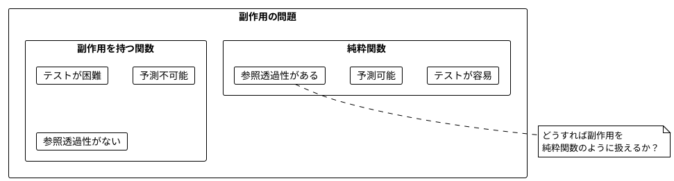
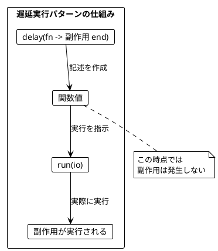
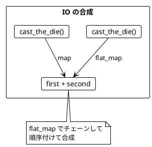
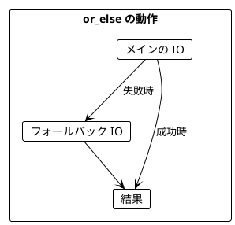
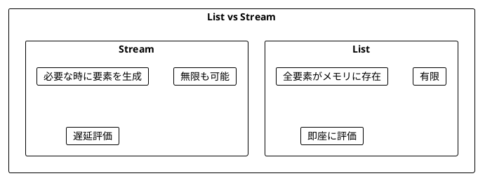
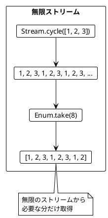
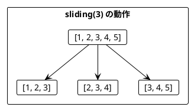
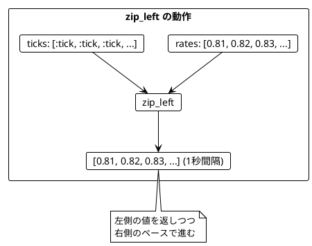
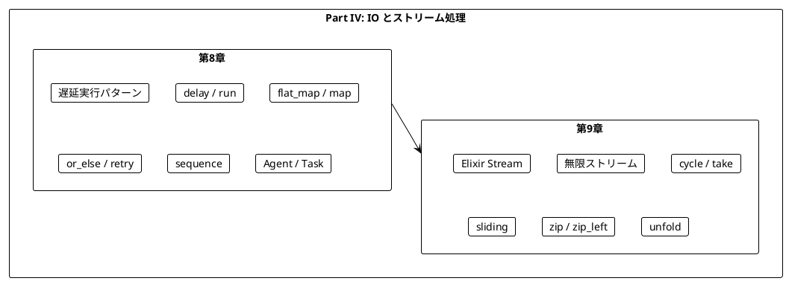

# Part IV: IO とストリーム処理

本章では、関数型プログラミングにおける副作用の扱い方を学びます。Elixir の無名関数を使って副作用を遅延実行し、Stream モジュールで無限のデータを効率的に扱う方法を習得します。

---

## 第8章: IO パターンとプロセス

### 8.1 副作用の問題

純粋関数は副作用を持ちません。しかし、実際のプログラムには副作用が必要です:

- ファイルの読み書き
- ネットワーク通信
- データベースアクセス
- 乱数生成
- 現在時刻の取得



### 8.2 Elixir における IO パターン

Scala の `IO` モナドに相当する概念を、Elixir では**無名関数**を使って表現します。

- `fn -> expr end` は「実行すると結果を返す副作用のある計算」
- 関数を作成しただけでは副作用は発生しない
- 関数を呼び出すことで実際に実行される



### 8.3 サイコロを振る例

**ソースファイル**: `app/elixir/lib/ch08/io_and_processes.ex`

#### 不純な関数（副作用あり）

```elixir
def cast_the_die_impure do
  :rand.uniform(6)
end

# 呼び出すたびに異なる値が返る
IO.inspect(cast_the_die_impure())  # 3
IO.inspect(cast_the_die_impure())  # 5
IO.inspect(cast_the_die_impure())  # 1
```

#### 遅延実行パターン

```elixir
@spec delay((-> any())) :: (-> any())
def delay(f) when is_function(f, 0), do: f

@spec run((-> any())) :: any()
def run(f) when is_function(f, 0), do: f.()

def cast_the_die do
  delay(fn -> cast_the_die_impure() end)
end

# 関数を作成（この時点では実行されない）
die_cast = cast_the_die()
IO.inspect(die_cast)  # #Function<...> - まだ実行されていない

# 実際に実行
IO.inspect(run(die_cast))  # 4
```

### 8.4 IO の作成方法

| 関数 | 用途 | 例 |
|------|------|-----|
| `delay(f)` | 副作用のある式をラップ | `delay(fn -> IO.puts("hello") end)` |
| `pure(value)` | 既存の値をラップ（副作用なし） | `pure(42)` |

```elixir
# delay: 副作用を遅延実行
delayed_print = delay(fn -> IO.puts("Hello") end)
# IO.puts はまだ実行されていない

# pure: 既存の値をラップ
pure_value = pure(42)
# 副作用なし、即座に 42 が確定
```

### 8.5 IO の合成

IO 値は `flat_map` でチェーンできます。Scala の `for` 内包表記に相当します。

```elixir
@spec flat_map((-> any()), (any() -> (-> any()))) :: (-> any())
def flat_map(io, f) do
  fn ->
    result = run(io)
    run(f.(result))
  end
end

def cast_the_die_twice do
  flat_map(cast_the_die(), fn first ->
    map(cast_the_die(), fn second ->
      first + second
    end)
  end)
end

# まだ実行されていない
program = cast_the_die_twice()

# 実行
result = run(program)  # 2〜12 の値
```



### 8.6 ミーティングスケジューリングの例

より実践的な例として、ミーティングのスケジューリングを見てみましょう。

```elixir
defmodule MeetingTime do
  defstruct [:start_hour, :end_hour]
end

# 副作用のある API 呼び出しを遅延実行
def calendar_entries(name) do
  delay(fn ->
    # モックデータ（実際には API 呼び出し）
    case name do
      "Alice" -> [%MeetingTime{start_hour: 9, end_hour: 10}, ...]
      "Bob" -> [%MeetingTime{start_hour: 10, end_hour: 11}, ...]
      _ -> []
    end
  end)
end
```

#### 予定の取得

```elixir
def scheduled_meetings(person1, person2) do
  flat_map(calendar_entries(person1), fn entries1 ->
    map(calendar_entries(person2), fn entries2 ->
      entries1 ++ entries2
    end)
  end)
end

# 使用例
io = scheduled_meetings("Alice", "Bob")
meetings = run(io)  # 4件の予定
```

#### 空き時間の計算（純粋関数）

```elixir
def possible_meetings(existing_meetings, start_hour, end_hour, length_hours) do
  slots =
    start_hour..(end_hour - length_hours)
    |> Enum.map(fn start ->
      %MeetingTime{start_hour: start, end_hour: start + length_hours}
    end)

  Enum.filter(slots, fn slot ->
    Enum.all?(existing_meetings, fn meeting ->
      not meetings_overlap?(meeting, slot)
    end)
  end)
end

# ミーティングが重なるかチェック
def meetings_overlap?(m1, m2) do
  m1.start_hour < m2.end_hour && m2.start_hour < m1.end_hour
end
```

### 8.7 or_else によるエラーハンドリング

`or_else` 関数で、失敗時のフォールバックを指定できます。

```elixir
def or_else(io, fallback) do
  fn ->
    try do
      run(io)
    rescue
      _ -> run(fallback)
    end
  end
end

success = pure(42)
fallback = pure(0)
run(or_else(success, fallback))  # 42

failing = fn -> raise "error" end
run(or_else(failing, fallback))  # 0
```



#### リトライ戦略

```elixir
def retry(io, max_retries) do
  fn ->
    do_retry(io, max_retries, nil)
  end
end

defp do_retry(_io, 0, last_error), do: raise(last_error || "Max retries exceeded")

defp do_retry(io, retries_left, _last_error) do
  try do
    run(io)
  rescue
    e -> do_retry(io, retries_left - 1, e)
  end
end

# 使用例：API 呼び出しを5回までリトライ
result = retry(calendar_entries("Alice"), 5)
```

### 8.8 sequence による IO のリスト処理

`[IO]` を `IO[List]` に変換するには `sequence` を使います。

```elixir
def sequence(ios) do
  fn -> Enum.map(ios, &run/1) end
end

ios = [pure(1), pure(2), pure(3)]
combined = sequence(ios)
run(combined)  # [1, 2, 3]
```

#### 複数人の予定を取得

```elixir
def scheduled_meetings_for(attendees) do
  attendees
  |> Enum.map(&calendar_entries/1)
  |> sequence()
  |> map(&List.flatten/1)
end

# 使用例
io = scheduled_meetings_for(["Alice", "Bob"])
meetings = run(io)  # 4件の予定
```

### 8.9 Agent による状態管理

Elixir では `Agent` を使って状態を安全に管理できます。

```elixir
def create_counter(initial_value) do
  Agent.start_link(fn -> initial_value end)
end

def get_count(counter) do
  Agent.get(counter, & &1)
end

def increment(counter) do
  Agent.update(counter, &(&1 + 1))
end

# 使用例
{:ok, counter} = create_counter(0)
get_count(counter)  # 0
increment(counter)
get_count(counter)  # 1
```

### 8.10 Task による非同期処理

`Task` を使って非同期処理を実行できます。

```elixir
def async_calendar_entries(name) do
  Task.async(fn -> run(calendar_entries(name)) end)
end

def parallel_calendar_entries(names) do
  names
  |> Enum.map(&async_calendar_entries/1)
  |> Task.await_many()
  |> List.flatten()
end

# 使用例：並行でカレンダーを取得
entries = parallel_calendar_entries(["Alice", "Bob"])  # 4件
```

---

## 第9章: ストリーム処理

### 9.1 ストリームとは

**ストリーム**は、要素の（潜在的に無限の）シーケンスを遅延評価で表します。Elixir の `Stream` モジュールを使用します。



### 9.2 基本的なストリーム操作

**ソースファイル**: `app/elixir/lib/ch09/streams.ex`

```elixir
# 有限ストリーム
def finite_stream(list), do: Stream.map(list, & &1)

stream = finite_stream([1, 2, 3])
Enum.to_list(stream)  # [1, 2, 3]

# フィルタリング
def filter_stream(stream, predicate), do: Stream.filter(stream, predicate)

odd_numbers = filter_stream([1, 2, 3, 4, 5], &(rem(&1, 2) != 0))
Enum.to_list(odd_numbers)  # [1, 3, 5]
```

### 9.3 無限ストリーム

```elixir
# 無限に繰り返し
def repeat(list), do: Stream.cycle(list)

infinite = repeat([1, 2, 3])
Enum.take(infinite, 8)  # [1, 2, 3, 1, 2, 3, 1, 2]

# 生成関数を使用
def generate(f), do: Stream.repeatedly(f)

stream = generate(fn -> :rand.uniform(6) end)
Enum.take(stream, 5)  # [4, 2, 6, 1, 3]

# カウントアップ
def count_from(start), do: Stream.iterate(start, &(&1 + 1))

stream = count_from(1)
Enum.take(stream, 5)  # [1, 2, 3, 4, 5]
```



### 9.4 サイコロストリーム

```elixir
def die_casts do
  Stream.repeatedly(fn -> :rand.uniform(6) end)
end

# 最初の3回を取得
die_casts() |> Enum.take(3)  # [4, 2, 6]

# 6 が出るまで振り続ける
def roll_until(target) do
  die_casts()
  |> Stream.take_while(fn x -> x != target end)
  |> Enum.to_list()
  |> Kernel.++([target])
end

roll_until(6)  # [2, 4, 1, 3, 6]

# 指定回数振って合計
def roll_and_sum(n) do
  die_casts()
  |> Enum.take(n)
  |> Enum.sum()
end

roll_and_sum(3)  # 3〜18 の値
```

### 9.5 ストリームの主要操作

| 操作 | 説明 | 例 |
|------|------|-----|
| `Stream.take(n)` | 最初の n 要素を取得 | `stream \|> Stream.take(3)` |
| `Stream.filter(p)` | 条件を満たす要素のみ | `stream \|> Stream.filter(&(&1 > 0))` |
| `Stream.map(f)` | 各要素を変換 | `stream \|> Stream.map(&(&1 * 2))` |
| `Stream.concat(s)` | 別のストリームを結合 | `Stream.concat(s1, s2)` |
| `Stream.cycle(list)` | 無限に繰り返し | `Stream.cycle([1, 2, 3])` |
| `Stream.chunk_every(n, step)` | スライディングウィンドウ | `stream \|> Stream.chunk_every(3, 1)` |

### 9.6 通貨交換レートの例

為替レートを監視して、上昇トレンドを検出する例です。

#### トレンド判定（純粋関数）

```elixir
def trending?(rates) when length(rates) <= 1, do: false

def trending?(rates) do
  rates
  |> Enum.zip(Enum.drop(rates, 1))
  |> Enum.all?(fn {prev, curr} -> curr > prev end)
end

trending?([0.81, 0.82, 0.83])  # true (上昇トレンド)
trending?([0.81, 0.84, 0.83])  # false

def declining?(rates) when length(rates) <= 1, do: false

def declining?(rates) do
  rates
  |> Enum.zip(Enum.drop(rates, 1))
  |> Enum.all?(fn {prev, curr} -> curr < prev end)
end

declining?([0.83, 0.82, 0.81])  # true (下降トレンド)

def stable?(values) when length(values) < 3, do: false

def stable?(values) do
  values |> Enum.uniq() |> length() == 1
end

stable?([5, 5, 5])  # true (安定)
```

#### レートのストリーム

```elixir
def exchange_rate(from, to) do
  # モックの為替レート（実際には API を呼び出す）
  base_rates = %{
    {:usd, :eur} => 0.85,
    {:usd, :gbp} => 0.73,
    # ...
  }

  base_rate = Map.get(base_rates, {from, to}, 1.0)
  variation = (:rand.uniform() - 0.5) * 0.02
  base_rate * (1 + variation)
end

def rate_stream(from, to) do
  Stream.repeatedly(fn -> exchange_rate(from, to) end)
end

# 使用例
rate_stream(:usd, :eur) |> Enum.take(3)
# [0.8493, 0.8521, 0.8478]
```

### 9.7 スライディングウィンドウ

`Stream.chunk_every/4` で連続する要素をグループ化できます。

```elixir
def sliding(stream, size) do
  Stream.chunk_every(stream, size, 1, :discard)
end

sliding([1, 2, 3, 4, 5], 3) |> Enum.to_list()
# [[1, 2, 3], [2, 3, 4], [3, 4, 5]]
```



#### トレンドを検出して交換

```elixir
def exchange_if_trending(amount, from, to, window_size, max_attempts) do
  result =
    rate_stream(from, to)
    |> sliding(window_size)
    |> Stream.filter(&trending?/1)     # 上昇トレンドを検出
    |> Stream.map(&List.last/1)        # 最新のレートを取得
    |> Stream.take(1)
    |> Enum.take(max_attempts)
    |> List.first()

  case result do
    nil -> {:error, "No trending pattern found"}
    rate -> {:ok, rate * amount}
  end
end

# 使用例
exchange_if_trending(100.0, :usd, :eur, 3, 1000)
# {:ok, 85.23}
```

### 9.8 ストリームの結合

2つのストリームを `Stream.zip` で結合できます。

```elixir
def zip_streams(stream1, stream2) do
  Stream.zip(stream1, stream2)
end

zip_streams([1, 2, 3], ["a", "b", "c"]) |> Enum.to_list()
# [{1, "a"}, {2, "b"}, {3, "c"}]

# 左側の値だけ返す
def zip_left(stream1, stream2) do
  Stream.zip(stream1, stream2)
  |> Stream.map(fn {left, _right} -> left end)
end

# インターバル付きで処理
def with_interval(stream, interval_ms) do
  Stream.map(stream, fn item ->
    Process.sleep(interval_ms)
    item
  end)
end

# レートを1秒間隔で取得
rate_stream(:usd, :eur)
|> with_interval(1000)
|> Enum.take(5)
```



### 9.9 集計操作

```elixir
# 合計
def sum_stream(stream), do: Enum.sum(stream)

sum_stream([1, 2, 3, 4, 5])  # 15

# 平均
def average_stream(stream) do
  {sum, count} =
    Enum.reduce(stream, {0, 0}, fn x, {sum, count} ->
      {sum + x, count + 1}
    end)

  if count == 0, do: 0.0, else: sum / count
end

average_stream([1, 2, 3, 4, 5])  # 3.0

# 移動平均
def moving_average(stream, window_size) do
  stream
  |> sliding(window_size)
  |> Stream.map(&average_stream/1)
end

moving_average([1, 2, 3, 4, 5], 3) |> Enum.to_list()
# [2.0, 3.0, 4.0]
```

### 9.10 unfold によるストリーム生成

`Stream.unfold/2` で状態を持つストリームを生成できます。

```elixir
# フィボナッチ数列
def fibonacci do
  Stream.unfold({0, 1}, fn {a, b} ->
    {a, {b, a + b}}
  end)
end

fibonacci() |> Enum.take(10)
# [0, 1, 1, 2, 3, 5, 8, 13, 21, 34]

# 等比数列
def geometric_series(start, ratio) do
  Stream.unfold(start, fn current ->
    {current, current * ratio}
  end)
end

geometric_series(1, 2) |> Enum.take(5)
# [1, 2, 4, 8, 16]

# 等差数列
def arithmetic_series(start, diff) do
  Stream.unfold(start, fn current ->
    {current, current + diff}
  end)
end

arithmetic_series(1, 3) |> Enum.take(5)
# [1, 4, 7, 10, 13]
```

---

## まとめ

### Part IV で学んだこと



### Scala との対応

| Scala | Elixir |
|-------|--------|
| `IO[A]` | `(-> any())` (無名関数) |
| `IO.delay(expr)` | `delay(fn -> expr end)` |
| `IO.pure(value)` | `pure(value)` |
| `unsafeRunSync()` | `run(io)` |
| `flatMap` | `flat_map/2` |
| `orElse` | `or_else/2` |
| `sequence` | `sequence/1` |
| `fs2.Stream` | `Stream` モジュール |
| `Stream.eval` | `Stream.repeatedly` |
| `sliding(n)` | `Stream.chunk_every(n, 1, :discard)` |
| `zipLeft` | `zip_left/2` |

### キーポイント

1. **遅延実行パターン**: 副作用を「記述」として扱い、実行を遅延させる
2. **delay/run**: 副作用のある式を遅延実行
3. **or_else**: 失敗時のフォールバックを指定
4. **sequence**: `[IO]` → `IO[List]`
5. **Stream**: 潜在的に無限のシーケンスを遅延評価で処理
6. **sliding**: 連続する要素をグループ化してパターンを検出
7. **unfold**: 状態を持つストリームを生成

### Elixir の特徴

- **Agent**: プロセスベースの状態管理
- **Task**: 簡単な非同期処理
- **Stream**: 組み込みの遅延評価ストリーム

### 次のステップ

Part V では、以下のトピックを学びます:

- 並行・並列処理
- GenServer による状態管理
- Supervisor による耐障害性

---

## 演習問題

### 問題 1: IO の基本

以下の関数を実装してください。

```elixir
def print_and_return(message) do
  # メッセージを出力して、そのメッセージを返す IO を作成
  ???
end

# 期待される動作
# io = print_and_return("Hello")
# run(io) は "Hello" をコンソールに出力し、"Hello" を返す
```

<details>
<summary>解答</summary>

```elixir
def print_and_return(message) do
  delay(fn ->
    IO.puts(message)
    message
  end)
end
```

</details>

### 問題 2: IO の合成

以下の関数を実装してください。2つの IO を順番に実行し、結果を結合します。

```elixir
def combine_io(io1, io2, f) do
  # io1 と io2 を実行し、結果を f で結合
  ???
end

# 期待される動作
# io = combine_io(pure(1), pure(2), &(&1 + &2))
# run(io)  # 3
```

<details>
<summary>解答</summary>

```elixir
def combine_io(io1, io2, f) do
  flat_map(io1, fn a ->
    map(io2, fn b ->
      f.(a, b)
    end)
  end)
end
```

</details>

### 問題 3: リトライ

以下の関数を実装してください。指定回数リトライし、全部失敗したらデフォルト値を返します。

```elixir
def retry_with_default(io, max_retries, default) do
  ???
end
```

<details>
<summary>解答</summary>

```elixir
def retry_with_default(io, max_retries, default) do
  fn ->
    try do
      run(retry(io, max_retries))
    rescue
      _ -> default
    end
  end
end
```

</details>

### 問題 4: ストリーム操作

以下のストリームを作成してください。

```elixir
# 1. 1から10までの偶数のストリーム
evens = ???

# 2. 無限に交互に true/false を返すストリーム
alternating = ???

# 3. 最初の5つの要素の合計を計算
sum = [1, 2, 3, 4, 5, 6, 7, 8, 9, 10] |> Stream.take(5) |> ???
```

<details>
<summary>解答</summary>

```elixir
# 1. 1から10までの偶数
evens = 1..10 |> Stream.filter(&(rem(&1, 2) == 0))
# または
evens = Stream.iterate(2, &(&1 + 2)) |> Stream.take_while(&(&1 <= 10))

# 2. 無限に交互に true/false
alternating = Stream.cycle([true, false])

# 3. 最初の5つの要素の合計
sum = [1, 2, 3, 4, 5, 6, 7, 8, 9, 10] |> Stream.take(5) |> Enum.sum()  # 15
```

</details>

### 問題 5: トレンド検出

以下の関数を実装してください。直近3つの値が全て同じかどうかを判定します。

```elixir
def stable?(values) do
  ???
end

# 期待される動作
assert stable?([5, 5, 5]) == true
assert stable?([5, 5, 6]) == false
assert stable?([5, 6, 5]) == false
assert stable?([5]) == false  # 3つ未満は false
```

<details>
<summary>解答</summary>

```elixir
def stable?(values) when length(values) < 3, do: false

def stable?(values) do
  values |> Enum.uniq() |> length() == 1
end
```

</details>
