# Part V: 並行処理と OTP

本章では、Elixir における並行処理を学びます。軽量プロセスによる並行実行、Agent/Task による安全な状態管理と非同期処理、そして OTP パターン（GenServer、Supervisor）による堅牢な並行システムの構築方法を習得します。

---

## 第10章: 並行処理

### 10.1 並行処理の課題

従来の並行処理には多くの課題があります:

- デッドロック
- 競合状態（Race Condition）
- 共有状態の管理の複雑さ
- スレッドのオーバーヘッド

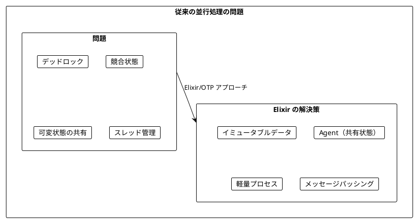

### 10.2 Elixir の並行モデル

Elixir は **アクターモデル** に基づいた並行処理を提供します:

- 各プロセスは独立した状態を持つ
- プロセス間はメッセージで通信
- プロセスは非常に軽量（数 KB）
- 数百万のプロセスを同時に実行可能

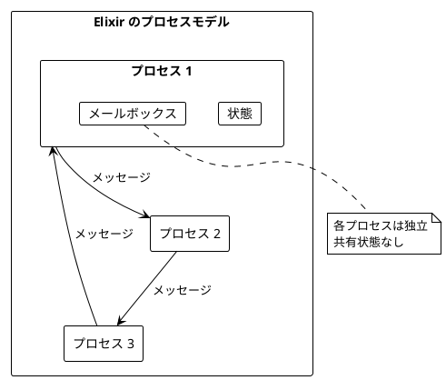

### 10.3 チェックインのリアルタイム集計

**ソースファイル**: `app/elixir/lib/ch10/concurrency.ex`

都市へのチェックインをリアルタイムで集計し、ランキングを更新する例を見ていきます。

```elixir
defmodule City do
  defstruct [:name]
end

defmodule CityStats do
  defstruct [:city, :check_ins]
end
```

#### トップ N 都市の計算（純粋関数）

```elixir
def top_cities(city_check_ins, n \\ 3) do
  city_check_ins
  |> Enum.map(fn {city, check_ins} ->
    %CityStats{city: city, check_ins: check_ins}
  end)
  |> Enum.sort_by(& &1.check_ins, :desc)
  |> Enum.take(n)
end
```

### 10.4 Agent - 共有状態の管理

**Agent** は、プロセスベースの状態管理を提供します。Scala の `Ref` に相当します。

```elixir
# Agent の作成
{:ok, counter} = Agent.start_link(fn -> 0 end)

# 値の取得
Agent.get(counter, & &1)  # 0

# アトミックな更新
Agent.update(counter, &(&1 + 1))
Agent.get(counter, & &1)  # 1

# 停止
Agent.stop(counter)
```

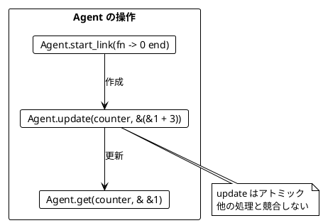

#### Agent の主要関数

| 関数 | 説明 | 例 |
|------|------|-----|
| `Agent.start_link(fun)` | 初期値で Agent を作成 | `Agent.start_link(fn -> 0 end)` |
| `Agent.get(agent, fun)` | 現在の値を取得 | `Agent.get(counter, & &1)` |
| `Agent.update(agent, fun)` | アトミックに更新 | `Agent.update(counter, &(&1 + 1))` |
| `Agent.get_and_update(agent, fun)` | 取得と更新を同時に | `Agent.get_and_update(counter, &{&1, &1 + 1})` |

#### チェックインストアの実装

```elixir
def create_check_in_store do
  Agent.start_link(fn -> %{} end)
end

def store_check_in(agent, city) do
  Agent.update(agent, fn state ->
    Map.update(state, city, 1, &(&1 + 1))
  end)
end

def get_check_ins(agent) do
  Agent.get(agent, & &1)
end
```

### 10.5 Task - 並列実行

`Task` を使って処理を並列に実行できます。Scala の `parSequence` に相当します。

```elixir
# 複数のタスクを並列実行
tasks = [fn -> 1 end, fn -> 2 end, fn -> 3 end]

results =
  tasks
  |> Enum.map(&Task.async/1)
  |> Task.await_many()

# [1, 2, 3]
```

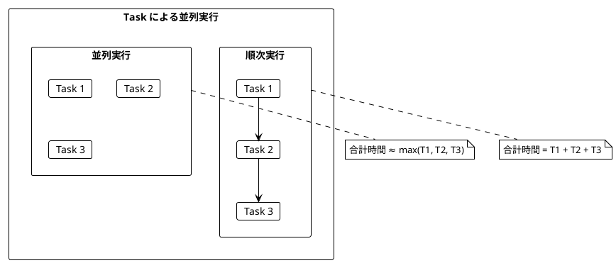

#### 並列マッピング

```elixir
def parallel_map(items, f) do
  items
  |> Enum.map(fn item -> Task.async(fn -> f.(item) end) end)
  |> Task.await_many()
end

# 使用例
parallel_map([1, 2, 3], &(&1 * 2))  # [2, 4, 6]
```

### 10.6 サイコロを並行して振る

```elixir
def cast_the_die do
  :rand.uniform(6)
end

def cast_dice_parallel(n) do
  1..n
  |> Enum.map(fn _ -> Task.async(&cast_the_die/0) end)
  |> Task.await_many()
  |> Enum.sum()
end

# 3つのサイコロを並行して振って合計
cast_dice_parallel(3)  # 3〜18 の値
```

#### Agent と Task の組み合わせ

```elixir
def cast_dice_and_store(n, agent) do
  tasks =
    1..n
    |> Enum.map(fn _ ->
      Task.async(fn ->
        result = cast_the_die()
        Agent.update(agent, &[result | &1])
        result
      end)
    end)

  Task.await_many(tasks)
  :ok
end

# 使用例
{:ok, agent} = Agent.start_link(fn -> [] end)
cast_dice_and_store(5, agent)
results = Agent.get(agent, & &1)  # 5つのサイコロの結果
```

### 10.7 プロセスによる軽量スレッド

Elixir のプロセスは、Scala の `Fiber` に相当する軽量な実行単位です。

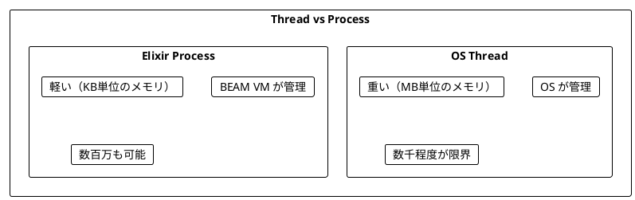

#### プロセスの起動とキャンセル

```elixir
def start_background(f) do
  pid = spawn(f)
  {:ok, pid}
end

def cancel(pid) do
  Process.exit(pid, :kill)
  :ok
end

# 使用例
{:ok, pid} = start_background(fn ->
  Process.sleep(1000)
  IO.puts("done")
end)

# 途中でキャンセル
cancel(pid)
```

#### 繰り返し実行するプロセス

```elixir
def start_repeating(f, interval_ms) do
  pid =
    spawn(fn ->
      repeat_forever(f, interval_ms)
    end)

  {:ok, pid}
end

defp repeat_forever(f, interval_ms) do
  f.()
  Process.sleep(interval_ms)
  repeat_forever(f, interval_ms)
end

# 100ms ごとにカウントアップ
{:ok, agent} = Agent.start_link(fn -> 0 end)
{:ok, pid} = start_repeating(fn -> Agent.update(agent, &(&1 + 1)) end, 100)
```

### 10.8 チェックイン処理の並行版

```elixir
defmodule ProcessingCheckIns do
  defstruct [:check_in_store, :ranking_store, :ranking_updater_pid, :check_in_processor_pid]
end

def start_processing(cities) do
  {:ok, check_in_store} = create_check_in_store()
  {:ok, ranking_store} = create_ranking_store()

  # ランキング更新プロセスを起動
  {:ok, ranking_updater_pid} =
    start_repeating(
      fn ->
        check_ins = get_check_ins(check_in_store)
        ranking = top_cities(check_ins)
        update_ranking(ranking_store, ranking)
      end,
      10
    )

  # チェックイン処理プロセスを起動
  check_in_processor_pid =
    spawn(fn ->
      Enum.each(cities, fn city ->
        store_check_in(check_in_store, city)
      end)
    end)

  {:ok, %ProcessingCheckIns{...}}
end

def current_ranking(processing) do
  get_ranking(processing.ranking_store)
end

def stop_processing(processing) do
  cancel(processing.ranking_updater_pid)
  cancel(processing.check_in_processor_pid)
  Agent.stop(processing.check_in_store)
  Agent.stop(processing.ranking_store)
  :ok
end
```

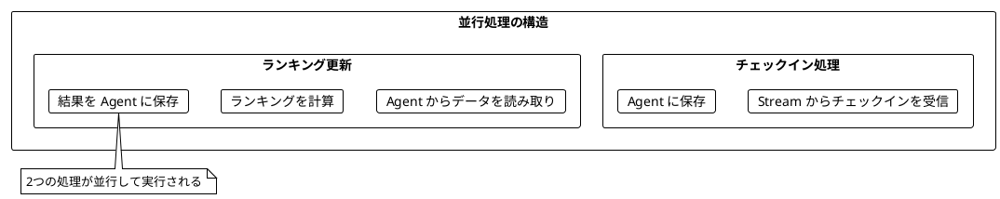

### 10.9 並行カウント

```elixir
def count_evens(ios) do
  {:ok, counter} = Agent.start_link(fn -> 0 end)

  ios
  |> Enum.map(fn io ->
    Task.async(fn ->
      n = io.()

      if rem(n, 2) == 0 do
        Agent.update(counter, &(&1 + 1))
      end
    end)
  end)
  |> Task.await_many()

  result = Agent.get(counter, & &1)
  Agent.stop(counter)
  result
end

# 使用例
ios = Enum.map(1..100, fn n -> fn -> n end end)
count_evens(ios)  # 50
```

### 10.10 Process.sleep の特性

Elixir の `Process.sleep` は他のプロセスをブロックしません。

| 特性 | Process.sleep | Thread.sleep (Java) |
|------|---------------|---------------------|
| ブロック対象 | 現在のプロセスのみ | OS スレッド |
| リソース | 軽量 | 重い |
| 並行性 | 他のプロセスは実行可能 | スレッドがブロック |

```elixir
# 3つのプロセスで並列スリープ → 約100msで完了
{time, _} = :timer.tc(fn ->
  1..3
  |> Enum.map(fn _ -> Task.async(fn -> Process.sleep(100) end) end)
  |> Task.await_many()
end)

time < 200_000  # true（200ms未満）
```

---

## 第11章: OTP パターン

### 11.1 OTP とは

**OTP (Open Telecom Platform)** は、Erlang/Elixir で堅牢な並行システムを構築するためのフレームワークです。

主なコンポーネント:
- **GenServer**: 汎用サーバープロセス
- **Supervisor**: プロセスの監視と再起動
- **Application**: アプリケーションの管理

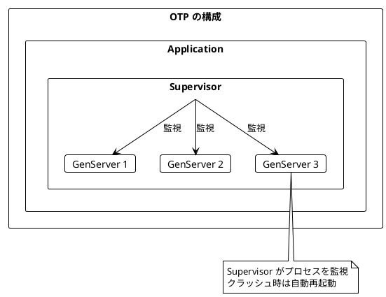

### 11.2 GenServer によるカウンター

**ソースファイル**: `app/elixir/lib/ch11/otp_patterns.ex`

GenServer は、状態を持つサーバープロセスを簡単に実装できます。

```elixir
defmodule Counter do
  use GenServer

  # クライアント API

  def start_link(initial_value \\ 0) do
    GenServer.start_link(__MODULE__, initial_value)
  end

  def get(counter) do
    GenServer.call(counter, :get)
  end

  def increment(counter) do
    GenServer.cast(counter, :increment)
  end

  def add(counter, value) do
    GenServer.cast(counter, {:add, value})
  end

  # サーバーコールバック

  @impl true
  def init(initial_value) do
    {:ok, initial_value}
  end

  @impl true
  def handle_call(:get, _from, state) do
    {:reply, state, state}
  end

  @impl true
  def handle_cast(:increment, state) do
    {:noreply, state + 1}
  end

  @impl true
  def handle_cast({:add, value}, state) do
    {:noreply, state + value}
  end
end
```

```elixir
# 使用例
{:ok, counter} = Counter.start_link(0)
Counter.get(counter)      # 0
Counter.increment(counter)
Counter.get(counter)      # 1
Counter.add(counter, 10)
Counter.get(counter)      # 11
GenServer.stop(counter)
```

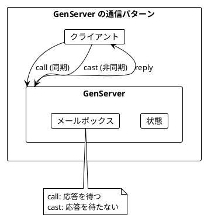

### 11.3 GenServer によるチェックインストア

```elixir
defmodule CheckInStore do
  use GenServer

  # クライアント API

  def start_link(opts \\ []) do
    GenServer.start_link(__MODULE__, %{}, opts)
  end

  def check_in(store, city) do
    GenServer.cast(store, {:check_in, city})
  end

  def get_count(store, city) do
    GenServer.call(store, {:get_count, city})
  end

  def get_all(store) do
    GenServer.call(store, :get_all)
  end

  def top_cities(store, n \\ 3) do
    GenServer.call(store, {:top_cities, n})
  end

  # サーバーコールバック

  @impl true
  def init(state) do
    {:ok, state}
  end

  @impl true
  def handle_cast({:check_in, city}, state) do
    new_state = Map.update(state, city, 1, &(&1 + 1))
    {:noreply, new_state}
  end

  @impl true
  def handle_call({:get_count, city}, _from, state) do
    {:reply, Map.get(state, city, 0), state}
  end

  @impl true
  def handle_call(:get_all, _from, state) do
    {:reply, state, state}
  end

  @impl true
  def handle_call({:top_cities, n}, _from, state) do
    top =
      state
      |> Enum.sort_by(fn {_city, count} -> count end, :desc)
      |> Enum.take(n)

    {:reply, top, state}
  end
end
```

### 11.4 定期実行タスク

```elixir
defmodule PeriodicTask do
  use GenServer

  def start_link(task_fn, interval_ms) do
    GenServer.start_link(__MODULE__, {task_fn, interval_ms})
  end

  @impl true
  def init({task_fn, interval_ms}) do
    schedule_work(interval_ms)
    {:ok, %{task_fn: task_fn, interval_ms: interval_ms}}
  end

  @impl true
  def handle_info(:work, %{task_fn: task_fn, interval_ms: interval_ms} = state) do
    task_fn.()
    schedule_work(interval_ms)
    {:noreply, state}
  end

  defp schedule_work(interval_ms) do
    Process.send_after(self(), :work, interval_ms)
  end
end

# 使用例：100ms ごとにタスクを実行
{:ok, agent} = Agent.start_link(fn -> 0 end)
{:ok, task} = PeriodicTask.start_link(
  fn -> Agent.update(agent, &(&1 + 1)) end,
  100
)
```

### 11.5 状態マシン

GenServer で状態マシンを実装できます。

```elixir
defmodule TrafficLight do
  use GenServer

  def start_link do
    GenServer.start_link(__MODULE__, :red)
  end

  def current(light) do
    GenServer.call(light, :current)
  end

  def next(light) do
    GenServer.cast(light, :next)
  end

  @impl true
  def init(initial_state) do
    {:ok, initial_state}
  end

  @impl true
  def handle_call(:current, _from, state) do
    {:reply, state, state}
  end

  @impl true
  def handle_cast(:next, state) do
    next_state =
      case state do
        :red -> :green
        :green -> :yellow
        :yellow -> :red
      end

    {:noreply, next_state}
  end
end
```

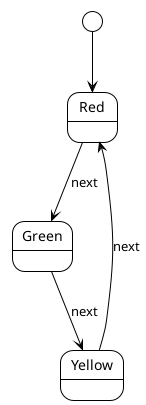

### 11.6 ジョブキュー

```elixir
defmodule JobQueue do
  use GenServer

  def start_link do
    GenServer.start_link(__MODULE__, :queue.new())
  end

  def enqueue(queue, job) do
    GenServer.cast(queue, {:enqueue, job})
  end

  def dequeue(queue) do
    GenServer.call(queue, :dequeue)
  end

  def size(queue) do
    GenServer.call(queue, :size)
  end

  @impl true
  def init(queue), do: {:ok, queue}

  @impl true
  def handle_cast({:enqueue, job}, queue) do
    {:noreply, :queue.in(job, queue)}
  end

  @impl true
  def handle_call(:dequeue, _from, queue) do
    case :queue.out(queue) do
      {{:value, job}, new_queue} -> {:reply, {:ok, job}, new_queue}
      {:empty, queue} -> {:reply, :empty, queue}
    end
  end

  @impl true
  def handle_call(:size, _from, queue) do
    {:reply, :queue.len(queue), queue}
  end
end
```

### 11.7 Supervisor による耐障害性

Supervisor は子プロセスを監視し、クラッシュ時に自動再起動します。

```elixir
defmodule CounterSupervisor do
  use Supervisor

  def start_link do
    Supervisor.start_link(__MODULE__, :ok)
  end

  def get_counter(supervisor) do
    [{_, counter, _, _}] = Supervisor.which_children(supervisor)
    counter
  end

  @impl true
  def init(:ok) do
    children = [
      {Counter, 0}
    ]

    Supervisor.init(children, strategy: :one_for_one)
  end
end
```


### 11.8 DynamicSupervisor

動的にプロセスを追加・削除できる Supervisor です。

```elixir
defmodule WorkerSupervisor do
  use DynamicSupervisor

  def start_link do
    DynamicSupervisor.start_link(__MODULE__, :ok)
  end

  def start_worker(supervisor, initial_value) do
    spec = {Counter, initial_value}
    DynamicSupervisor.start_child(supervisor, spec)
  end

  def stop_worker(supervisor, worker) do
    DynamicSupervisor.terminate_child(supervisor, worker)
  end

  def count_workers(supervisor) do
    DynamicSupervisor.count_children(supervisor).active
  end

  @impl true
  def init(:ok) do
    DynamicSupervisor.init(strategy: :one_for_one)
  end
end

# 使用例
{:ok, sup} = WorkerSupervisor.start_link()
{:ok, worker1} = WorkerSupervisor.start_worker(sup, 0)
{:ok, worker2} = WorkerSupervisor.start_worker(sup, 100)

Counter.increment(worker1)
Counter.get(worker1)  # 1
Counter.get(worker2)  # 100

WorkerSupervisor.count_workers(sup)  # 2
```

### 11.9 Task.Supervisor

Task を監視付きで実行できます。

```elixir
defmodule TaskRunner do
  def start_link do
    Task.Supervisor.start_link()
  end

  def run_async(supervisor, task_fn) do
    Task.Supervisor.async(supervisor, task_fn)
  end

  def run_all(supervisor, task_fns) do
    task_fns
    |> Enum.map(&Task.Supervisor.async(supervisor, &1))
    |> Task.await_many()
  end

  def run_with_timeout(supervisor, task_fn, timeout_ms) do
    task = Task.Supervisor.async_nolink(supervisor, task_fn)

    case Task.yield(task, timeout_ms) do
      {:ok, result} -> {:ok, result}
      nil ->
        Task.shutdown(task, :brutal_kill)
        {:error, :timeout}
    end
  end
end

# 使用例
{:ok, runner} = TaskRunner.start_link()
results = TaskRunner.run_all(runner, [fn -> 1 end, fn -> 2 end, fn -> 3 end])
# [1, 2, 3]
```

### 11.10 PubSub パターン

Publish/Subscribe パターンの実装です。

```elixir
defmodule PubSub do
  use GenServer

  def start_link do
    GenServer.start_link(__MODULE__, %{})
  end

  def subscribe(server, topic) do
    GenServer.call(server, {:subscribe, topic, self()})
  end

  def unsubscribe(server, topic) do
    GenServer.call(server, {:unsubscribe, topic, self()})
  end

  def publish(server, topic, message) do
    GenServer.cast(server, {:publish, topic, message})
  end

  @impl true
  def init(state), do: {:ok, state}

  @impl true
  def handle_call({:subscribe, topic, pid}, _from, state) do
    subscribers = Map.get(state, topic, MapSet.new())
    new_subscribers = MapSet.put(subscribers, pid)
    {:reply, :ok, Map.put(state, topic, new_subscribers)}
  end

  @impl true
  def handle_cast({:publish, topic, message}, state) do
    subscribers = Map.get(state, topic, MapSet.new())

    Enum.each(subscribers, fn pid ->
      send(pid, {:pubsub, topic, message})
    end)

    {:noreply, state}
  end
end

# 使用例
{:ok, pubsub} = PubSub.start_link()
PubSub.subscribe(pubsub, "events")
PubSub.publish(pubsub, "events", :hello)

receive do
  {:pubsub, "events", message} -> IO.inspect(message)  # :hello
end
```

---

## まとめ

### Part V で学んだこと

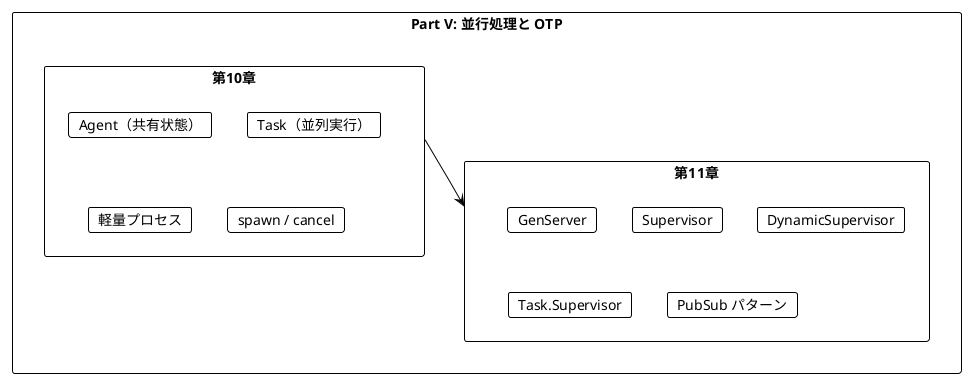

### Scala との対応

| Scala | Elixir |
|-------|--------|
| `Ref[IO, A]` | `Agent` |
| `parSequence` | `Task.await_many` |
| `Fiber` | プロセス（`spawn`） |
| `fiber.start` | `spawn` / `Task.async` |
| `fiber.cancel` | `Process.exit(pid, :kill)` |
| `foreverM` | 再帰的プロセス |
| - | `GenServer` |
| - | `Supervisor` |

### キーポイント

1. **Agent**: プロセスベースの状態管理（Ref 相当）
2. **Task**: 非同期タスクの実行と結果の取得
3. **プロセス**: 軽量な実行単位（数百万も可能）
4. **GenServer**: 汎用的なサーバープロセス
5. **Supervisor**: プロセスの監視と自動再起動
6. **DynamicSupervisor**: 動的なプロセス管理

### 設計パターン

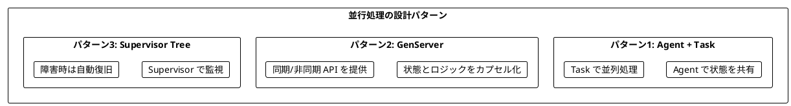

### 次のステップ

Part VI では、以下のトピックを学びます:

- 実践的なアプリケーション構築
- 外部 API との連携
- テスト戦略

---

## 演習問題

### 問題 1: Agent の基本

以下のプログラムを実装してください。カウンターを 0 から始めて、3回インクリメントした結果を返します。

```elixir
def increment_three_times do
  ???
end

# 期待される動作
increment_three_times()  # 3
```

<details>
<summary>解答</summary>

```elixir
def increment_three_times do
  {:ok, counter} = Agent.start_link(fn -> 0 end)
  Agent.update(counter, &(&1 + 1))
  Agent.update(counter, &(&1 + 1))
  Agent.update(counter, &(&1 + 1))
  result = Agent.get(counter, & &1)
  Agent.stop(counter)
  result
end
```

</details>

### 問題 2: 並列実行

以下のプログラムを実装してください。3つのタスクを並列実行し、結果の合計を返します。

```elixir
def sum_parallel(tasks) do
  ???
end

# 期待される動作
sum_parallel([fn -> 1 end, fn -> 2 end, fn -> 3 end])  # 6
```

<details>
<summary>解答</summary>

```elixir
def sum_parallel(tasks) do
  tasks
  |> Enum.map(&Task.async/1)
  |> Task.await_many()
  |> Enum.sum()
end
```

</details>

### 問題 3: GenServer

以下の GenServer を実装してください。リストを管理し、要素の追加と取得ができます。

```elixir
defmodule ListStore do
  use GenServer

  # ???
end

# 期待される動作
{:ok, store} = ListStore.start_link()
ListStore.add(store, 1)
ListStore.add(store, 2)
ListStore.add(store, 3)
ListStore.get_all(store)  # [1, 2, 3]
```

<details>
<summary>解答</summary>

```elixir
defmodule ListStore do
  use GenServer

  def start_link do
    GenServer.start_link(__MODULE__, [])
  end

  def add(store, item) do
    GenServer.cast(store, {:add, item})
  end

  def get_all(store) do
    GenServer.call(store, :get_all)
  end

  @impl true
  def init(state), do: {:ok, state}

  @impl true
  def handle_cast({:add, item}, state) do
    {:noreply, state ++ [item]}
  end

  @impl true
  def handle_call(:get_all, _from, state) do
    {:reply, state, state}
  end
end
```

</details>

### 問題 4: タイムアウト付き収集

以下のプログラムを実装してください。指定時間後にプロセスを停止し、それまでに蓄積された結果を返します。

```elixir
def collect_for(duration_ms, interval_ms, generator) do
  ???
end

# 期待される動作
# 100ms 間、10ms ごとに乱数を生成
results = collect_for(100, 10, fn -> :rand.uniform(100) end)
# 約10個の要素が返される
```

<details>
<summary>解答</summary>

```elixir
def collect_for(duration_ms, interval_ms, generator) do
  {:ok, collected} = Agent.start_link(fn -> [] end)

  {:ok, producer_pid} =
    start_repeating(
      fn ->
        value = generator.()
        Agent.update(collected, &[value | &1])
      end,
      interval_ms
    )

  Process.sleep(duration_ms)
  cancel(producer_pid)

  result = Agent.get(collected, &Enum.reverse/1)
  Agent.stop(collected)
  result
end
```

</details>

### 問題 5: Supervisor

以下の Supervisor を実装してください。2つのカウンターを監視します。

```elixir
defmodule DualCounterSupervisor do
  use Supervisor

  # ???
end

# 期待される動作
{:ok, sup} = DualCounterSupervisor.start_link()
{counter1, counter2} = DualCounterSupervisor.get_counters(sup)
Counter.increment(counter1)
Counter.get(counter1)  # 1
Counter.get(counter2)  # 0
```

<details>
<summary>解答</summary>

```elixir
defmodule DualCounterSupervisor do
  use Supervisor

  def start_link do
    Supervisor.start_link(__MODULE__, :ok)
  end

  def get_counters(supervisor) do
    children = Supervisor.which_children(supervisor)
    [{:counter1, c1, _, _}, {:counter2, c2, _, _}] = children
    {c1, c2}
  end

  @impl true
  def init(:ok) do
    children = [
      Supervisor.child_spec({Counter, 0}, id: :counter1),
      Supervisor.child_spec({Counter, 0}, id: :counter2)
    ]

    Supervisor.init(children, strategy: :one_for_one)
  end
end
```

</details>
