# Part VI: 実践的なアプリケーション構築とテスト

本章では、これまで学んだ関数型プログラミングの概念を統合し、実践的なアプリケーションを構築します。また、関数型プログラミングにおけるテスト戦略についても学びます。

---

## 第12章: 実践的なアプリケーションとテスト戦略

### 12.1 TravelGuide アプリケーション

旅行ガイドアプリケーションを例に、実践的な FP アプリケーションの構築方法を学びます。

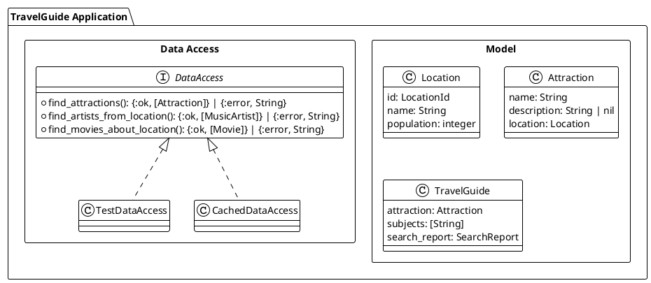

### 12.2 ドメインモデルの定義

**ソースファイル**: `app/elixir/lib/ch12/travel_guide.ex`

Elixir では構造体（struct）を使ってドメインモデルを定義します。

```elixir
defmodule LocationId do
  @moduledoc "位置情報 ID（Value Object）"
  defstruct [:value]

  @type t :: %__MODULE__{value: String.t()}

  @spec new(String.t()) :: t()
  def new(value), do: %__MODULE__{value: value}
end

defmodule Location do
  @moduledoc "ロケーション"
  defstruct [:id, :name, :population]

  @type t :: %__MODULE__{
          id: LocationId.t(),
          name: String.t(),
          population: non_neg_integer()
        }

  @spec new(LocationId.t(), String.t(), non_neg_integer()) :: t()
  def new(id, name, population) do
    %__MODULE__{id: id, name: name, population: population}
  end
end

defmodule Attraction do
  @moduledoc "アトラクション（観光地）"
  defstruct [:name, :description, :location]

  @type t :: %__MODULE__{
          name: String.t(),
          description: String.t() | nil,
          location: Location.t()
        }

  @spec new(String.t(), String.t() | nil, Location.t()) :: t()
  def new(name, description, location) do
    %__MODULE__{name: name, description: description, location: location}
  end
end
```

### 12.3 データアクセス層の抽象化

Elixir では `@behaviour` を使用してインターフェースを定義します。

```elixir
defmodule DataAccess do
  @moduledoc """
  データアクセス層のインターフェース（振る舞い）

  実装モジュールはこの振る舞いを実装する必要がある。
  """

  @type ordering :: :by_name | :by_location_population

  @callback find_attractions(String.t(), ordering(), pos_integer()) ::
              {:ok, [Attraction.t()]} | {:error, String.t()}

  @callback find_artists_from_location(LocationId.t(), pos_integer()) ::
              {:ok, [MusicArtist.t()]} | {:error, String.t()}

  @callback find_movies_about_location(LocationId.t(), pos_integer()) ::
              {:ok, [Movie.t()]} | {:error, String.t()}

  @callback find_hotels_near_location(LocationId.t(), pos_integer()) ::
              {:ok, [Hotel.t()]} | {:error, String.t()}
end
```

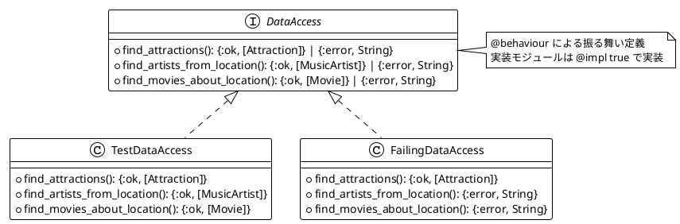

### 12.4 スタブ実装

テスト用のスタブ実装を作成します。

```elixir
defmodule TestDataAccess do
  @moduledoc "テスト用のスタブ実装"
  @behaviour DataAccess

  @impl true
  def find_attractions(name, _ordering, limit) do
    attractions =
      case name do
        "Empty" -> []
        _ ->
          [
            Attraction.new("#{name} Tower", "A famous tower", @test_location),
            Attraction.new("#{name} Park", "A beautiful park", @test_location),
            Attraction.new("#{name} Museum", "A great museum", @test_location)
          ]
      end

    {:ok, Enum.take(attractions, limit)}
  end

  @impl true
  def find_artists_from_location(_location_id, limit) do
    artists = [
      MusicArtist.new("Test Artist 1", "Pop"),
      MusicArtist.new("Test Artist 2", "Rock")
    ]

    {:ok, Enum.take(artists, limit)}
  end

  # 他のコールバックも同様に実装...
end
```

### 12.5 Agent を使用したキャッシュ

Elixir の Agent を使用して、スレッドセーフなキャッシュを実装します。

```elixir
defmodule CachedDataAccess do
  @moduledoc """
  Agent を使ったキャッシュ付きデータアクセス
  """

  @spec start_link(module()) :: {:ok, pid()}
  def start_link(data_access_module) do
    Agent.start_link(fn ->
      %{
        module: data_access_module,
        attractions_cache: %{},
        artists_cache: %{},
        movies_cache: %{},
        hotels_cache: %{}
      }
    end)
  end

  @spec find_attractions(pid(), String.t(), DataAccess.ordering(), pos_integer()) ::
          {:ok, [Attraction.t()]} | {:error, String.t()}
  def find_attractions(cache, name, ordering, limit) do
    key = "#{name}-#{ordering}-#{limit}"

    Agent.get_and_update(cache, fn state ->
      case Map.get(state.attractions_cache, key) do
        nil ->
          result = state.module.find_attractions(name, ordering, limit)

          case result do
            {:ok, attractions} ->
              new_cache = Map.put(state.attractions_cache, key, attractions)
              {result, %{state | attractions_cache: new_cache}}

            {:error, _} = error ->
              {error, state}
          end

        cached ->
          {{:ok, cached}, state}
      end
    end)
  end

  # 他のメソッドも同様に実装...
end
```

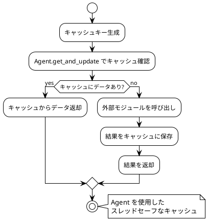

### 12.6 アプリケーションの組み立て

すべてのコンポーネントを組み合わせてアプリケーションを構築します。

```elixir
@spec travel_guide(module(), String.t()) :: {:ok, TravelGuide.t()} | {:error, String.t()}
def travel_guide(data_access_module, attraction_name) do
  case data_access_module.find_attractions(attraction_name, :by_location_population, 1) do
    {:ok, []} ->
      {:error, "No attractions found"}

    {:ok, [attraction | _]} ->
      build_guide(data_access_module, attraction, 1)

    {:error, reason} ->
      {:error, reason}
  end
end

defp build_guide(data_access_module, attraction, attractions_searched) do
  location_id = attraction.location.id

  artists_result = data_access_module.find_artists_from_location(location_id, 2)
  movies_result = data_access_module.find_movies_about_location(location_id, 2)

  errors =
    [artists_result, movies_result]
    |> Enum.filter(&match?({:error, _}, &1))
    |> Enum.map(fn {:error, reason} -> reason end)

  artists =
    case artists_result do
      {:ok, list} -> list
      {:error, _} -> []
    end

  movies =
    case movies_result do
      {:ok, list} -> list
      {:error, _} -> []
    end

  subjects = Enum.map(artists, & &1.name) ++ Enum.map(movies, & &1.name)
  report = SearchReport.new(attractions_searched, errors)

  {:ok, TravelGuide.new(attraction, subjects, report)}
end
```

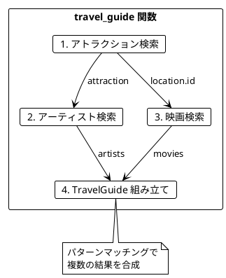

### 12.7 SearchReport の導入

テスト可能性を高めるため、`SearchReport` を導入します。

**ソースファイル**: `app/elixir/lib/ch12/travel_guide.ex`

```elixir
defmodule SearchReport do
  @moduledoc "検索レポート"
  defstruct [:attractions_searched, :errors]

  @type t :: %__MODULE__{
          attractions_searched: non_neg_integer(),
          errors: [String.t()]
        }

  @spec new(non_neg_integer(), [String.t()]) :: t()
  def new(attractions_searched, errors \\ []) do
    %__MODULE__{attractions_searched: attractions_searched, errors: errors}
  end

  @spec empty() :: t()
  def empty, do: new(0, [])

  @spec add_error(t(), String.t()) :: t()
  def add_error(%__MODULE__{} = report, error) do
    %{report | errors: report.errors ++ [error]}
  end
end
```

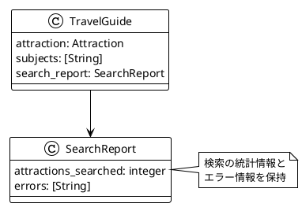

---

## テスト戦略

### 12.8 関数型プログラミングのテスト

関数型プログラミングでは、純粋関数のおかげでテストが非常に簡単になります。

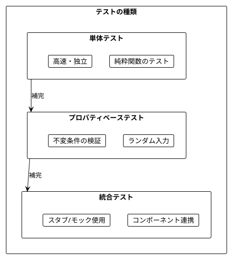

### 12.9 純粋関数のテスト

**ソースファイル**: `app/elixir/lib/ch12/testing.ex`

純粋関数は入力と出力だけを考えればよいため、テストが簡単です。

```elixir
# テスト対象の純粋関数
@spec filter_popular_locations([Location.t()], non_neg_integer()) :: [Location.t()]
def filter_popular_locations(locations, min_population) do
  Enum.filter(locations, fn loc -> loc.population >= min_population end)
end

@spec sort_by_population([Attraction.t()]) :: [Attraction.t()]
def sort_by_population(attractions) do
  Enum.sort_by(attractions, fn a -> a.location.population end, :desc)
end

@spec aggregate_results([{:ok, any()} | {:error, String.t()}]) ::
        {[any()], [String.t()]}
def aggregate_results(results) do
  Enum.reduce(results, {[], []}, fn result, {successes, errors} ->
    case result do
      {:ok, value} -> {successes ++ [value], errors}
      {:error, reason} -> {successes, errors ++ [reason]}
    end
  end)
end
```

### 12.10 プロパティベーステスト

**ソースファイル**: `app/elixir/lib/ch12/testing.ex`

ランダムな入力を生成して不変条件をテストします。

```elixir
@doc """
プロパティをテスト（指定回数実行）
"""
@spec check_property(pos_integer(), (-> boolean())) :: :ok | {:error, String.t()}
def check_property(iterations, property_fn) do
  results =
    Enum.map(1..iterations, fn _ ->
      try do
        property_fn.()
      rescue
        _ -> false
      end
    end)

  if Enum.all?(results) do
    :ok
  else
    failed_count = Enum.count(results, &(!&1))
    {:error, "Property failed #{failed_count}/#{iterations} times"}
  end
end

@doc """
filter_popular_locations の不変条件をテスト
"""
@spec verify_filter_properties(pos_integer()) :: :ok | {:error, String.t()}
def verify_filter_properties(iterations) do
  check_property(iterations, fn ->
    locations = random_locations(:rand.uniform(20))
    min_population = random_positive_int(5_000_000)

    result = TravelGuide.filter_popular_locations(locations, min_population)

    # プロパティ1: 結果のサイズは入力以下
    size_property = length(result) <= length(locations)

    # プロパティ2: 結果のすべての要素は条件を満たす
    all_meet_condition = Enum.all?(result, fn loc -> loc.population >= min_population end)

    # プロパティ3: 条件を満たす要素はすべて結果に含まれる
    qualifying = Enum.filter(locations, fn loc -> loc.population >= min_population end)
    all_included = Enum.all?(qualifying, fn loc -> loc in result end)

    size_property and all_meet_condition and all_included
  end)
end
```

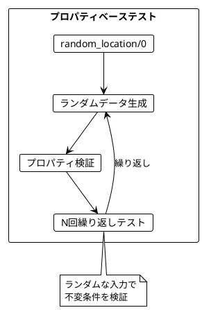

### 12.11 ランダムデータ生成

```elixir
@doc """
ランダムな文字列を生成
"""
@spec random_string(pos_integer()) :: String.t()
def random_string(length) do
  :crypto.strong_rand_bytes(length)
  |> Base.encode64()
  |> binary_part(0, length)
end

@doc """
ランダムな Location を生成
"""
@spec random_location() :: Location.t()
def random_location do
  id = LocationId.new("Q#{random_positive_int(1_000_000)}")
  name = random_string(8)
  population = random_positive_int(10_000_000)
  Location.new(id, name, population)
end

@doc """
ランダムな Attraction を生成
"""
@spec random_attraction() :: Attraction.t()
def random_attraction do
  name = random_string(10)
  description = if :rand.uniform(2) == 1, do: random_string(20), else: nil
  location = random_location()
  Attraction.new(name, description, location)
end
```

### 12.12 統合テスト

```elixir
@doc """
TravelGuide の統合テストを実行
"""
@spec run_integration_tests() :: {:ok, map()}
def run_integration_tests do
  tests = [
    {:normal_case, fn ->
      case TravelGuide.travel_guide(TravelGuide.TestDataAccess, "Tokyo") do
        {:ok, guide} ->
          guide.attraction.name == "Tokyo Tower" and
            length(guide.subjects) > 0 and
            guide.search_report.errors == []

        _ ->
          false
      end
    end},
    {:empty_result, fn ->
      case TravelGuide.travel_guide(TravelGuide.TestDataAccess, "Empty") do
        {:error, "No attractions found"} -> true
        _ -> false
      end
    end},
    {:error_handling, fn ->
      case TravelGuide.travel_guide(TravelGuide.FailingDataAccess, "Test") do
        {:ok, guide} ->
          length(guide.search_report.errors) == 2

        _ ->
          false
      end
    end},
    {:cached_access, fn ->
      {:ok, cache} = TravelGuide.CachedDataAccess.start_link(TravelGuide.TestDataAccess)

      result1 = TravelGuide.travel_guide_cached(cache, "Tokyo")
      result2 = TravelGuide.travel_guide_cached(cache, "Tokyo")

      stats = TravelGuide.CachedDataAccess.cache_stats(cache)
      Agent.stop(cache)

      case {result1, result2} do
        {{:ok, g1}, {:ok, g2}} ->
          g1.attraction.name == g2.attraction.name and
            stats.attractions > 0

        _ ->
          false
      end
    end}
  ]

  results =
    Enum.map(tests, fn {name, test_fn} ->
      result =
        try do
          test_fn.()
        rescue
          _ -> false
        end

      {name, result}
    end)

  passed = Enum.count(results, fn {_, r} -> r end)
  failed = Enum.count(results, fn {_, r} -> !r end)

  {:ok, %{passed: passed, failed: failed, results: results}}
end
```

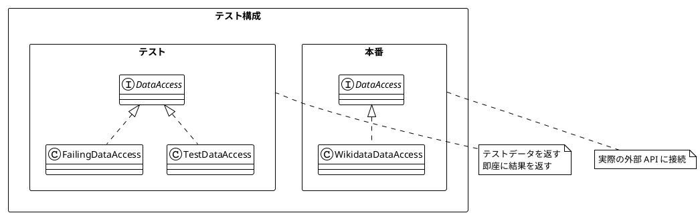

### 12.13 パフォーマンステスト

```elixir
@doc """
関数の実行時間を計測
"""
@spec measure_time((-> any())) :: {non_neg_integer(), any()}
def measure_time(fun) do
  {time, result} = :timer.tc(fun)
  {time, result}
end

@doc """
キャッシュの効果を測定
"""
@spec measure_cache_effect(pos_integer()) :: {:ok, map()}
def measure_cache_effect(iterations) do
  # キャッシュなしの時間
  {uncached_time, _} =
    measure_time(fn ->
      Enum.each(1..iterations, fn _ ->
        TravelGuide.travel_guide(TravelGuide.TestDataAccess, "Tokyo")
      end)
    end)

  # キャッシュありの時間
  {:ok, cache} = TravelGuide.CachedDataAccess.start_link(TravelGuide.TestDataAccess)

  {cached_time, _} =
    measure_time(fn ->
      Enum.each(1..iterations, fn _ ->
        TravelGuide.travel_guide_cached(cache, "Tokyo")
      end)
    end)

  Agent.stop(cache)

  {:ok,
   %{
     uncached_time: uncached_time,
     cached_time: cached_time,
     speedup: uncached_time / max(cached_time, 1)
   }}
end
```

### 12.14 テストピラミッド

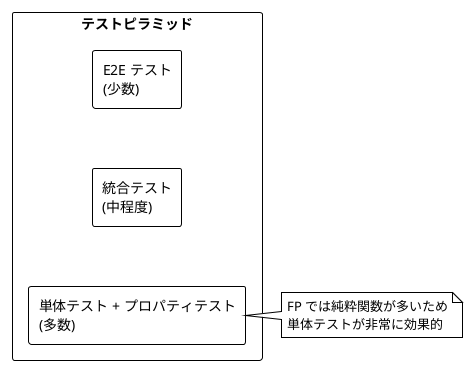

---

## まとめ

### Part VI で学んだこと

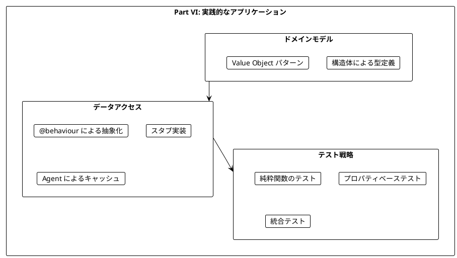

### キーポイント

1. **@behaviour による抽象化**: DataAccess 振る舞いで外部依存を抽象化
2. **Agent でキャッシュ**: スレッドセーフな状態管理
3. **タプルでエラー処理**: `{:ok, value}` / `{:error, reason}` で明示的なエラーハンドリング
4. **SearchReport**: テスト可能性と可観測性の向上
5. **スタブ**: 外部依存を差し替えてテスト
6. **プロパティベーステスト**: ランダム入力で不変条件を検証

### Scala との対比

| 概念 | Scala | Elixir |
|------|-------|--------|
| インターフェース | `trait` | `@behaviour` |
| 状態管理 | `Ref[IO, A]` | `Agent` |
| リソース管理 | `Resource[IO, A]` | プロセス / `with` |
| エラー処理 | `Either[E, A]` | `{:ok, a} \| {:error, e}` |
| 非同期処理 | `IO[A]` | `Task` / `GenServer` |
| キャッシュ | `Ref` + `Map` | `Agent` + `Map` |

### 学習の総括

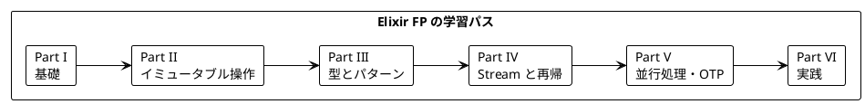

---

## 演習問題

### 問題 1: DataAccess の拡張

以下の要件で `DataAccess` を拡張してください:
- 新しいコールバック `find_restaurants_near_location` を追加
- 戻り値は `{:ok, [Restaurant.t()]} | {:error, String.t()}`

<details>
<summary>解答</summary>

```elixir
defmodule Restaurant do
  defstruct [:name, :cuisine, :rating, :location]

  @type t :: %__MODULE__{
          name: String.t(),
          cuisine: String.t(),
          rating: float(),
          location: Location.t()
        }

  @spec new(String.t(), String.t(), float(), Location.t()) :: t()
  def new(name, cuisine, rating, location) do
    %__MODULE__{name: name, cuisine: cuisine, rating: rating, location: location}
  end
end

# DataAccess に追加
@callback find_restaurants_near_location(LocationId.t(), pos_integer()) ::
            {:ok, [Restaurant.t()]} | {:error, String.t()}

# TestDataAccess の実装
@impl true
def find_restaurants_near_location(_location_id, limit) do
  restaurants = [
    Restaurant.new("Test Restaurant 1", "Japanese", 4.5, @test_location),
    Restaurant.new("Test Restaurant 2", "Italian", 4.0, @test_location)
  ]

  {:ok, Enum.take(restaurants, limit)}
end
```

</details>

### 問題 2: プロパティベーステスト

以下の関数に対するプロパティベーステストを書いてください:

```elixir
def merge_subjects(artists, movies) do
  Enum.map(artists, & &1.name) ++ Enum.map(movies, & &1.name)
end
```

<details>
<summary>解答</summary>

```elixir
@spec verify_merge_properties(pos_integer()) :: :ok | {:error, String.t()}
def verify_merge_properties(iterations) do
  check_property(iterations, fn ->
    artist_count = :rand.uniform(10)
    movie_count = :rand.uniform(10)

    artists = Enum.map(1..artist_count, fn i ->
      MusicArtist.new("Artist #{i}", nil)
    end)

    movies = Enum.map(1..movie_count, fn i ->
      Movie.new("Movie #{i}", nil)
    end)

    result = TravelGuide.merge_subjects(artists, movies)

    # プロパティ1: 結果の長さは入力の合計
    length_property = length(result) == artist_count + movie_count

    # プロパティ2: すべてのアーティスト名が含まれる
    artist_names = Enum.map(artists, & &1.name)
    artists_included = Enum.all?(artist_names, fn n -> n in result end)

    # プロパティ3: すべての映画名が含まれる
    movie_names = Enum.map(movies, & &1.name)
    movies_included = Enum.all?(movie_names, fn n -> n in result end)

    length_property and artists_included and movies_included
  end)
end
```

</details>

### 問題 3: キャッシュの有効期限

`CachedDataAccess` にキャッシュの有効期限機能を追加してください。

<details>
<summary>解答</summary>

```elixir
defmodule CachedDataAccessWithTTL do
  @moduledoc """
  TTL（有効期限）付きキャッシュ
  """

  @default_ttl_ms 60_000  # 60秒

  @spec start_link(module(), pos_integer()) :: {:ok, pid()}
  def start_link(data_access_module, ttl_ms \\ @default_ttl_ms) do
    Agent.start_link(fn ->
      %{
        module: data_access_module,
        ttl_ms: ttl_ms,
        attractions_cache: %{}  # key => {value, timestamp}
      }
    end)
  end

  @spec find_attractions(pid(), String.t(), DataAccess.ordering(), pos_integer()) ::
          {:ok, [Attraction.t()]} | {:error, String.t()}
  def find_attractions(cache, name, ordering, limit) do
    key = "#{name}-#{ordering}-#{limit}"
    now = System.monotonic_time(:millisecond)

    Agent.get_and_update(cache, fn state ->
      case Map.get(state.attractions_cache, key) do
        {cached, timestamp} when now - timestamp < state.ttl_ms ->
          # キャッシュが有効
          {{:ok, cached}, state}

        _ ->
          # キャッシュが無効または存在しない
          result = state.module.find_attractions(name, ordering, limit)

          case result do
            {:ok, attractions} ->
              new_cache = Map.put(state.attractions_cache, key, {attractions, now})
              {result, %{state | attractions_cache: new_cache}}

            {:error, _} = error ->
              {error, state}
          end
      end
    end)
  end
end
```

</details>

---

## シリーズ全体の総括

本シリーズでは、「Grokking Functional Programming」の内容に沿って、Elixir による関数型プログラミングの基礎から実践的なアプリケーション構築までを学びました。

### 学んだ主な概念

| Part | 章 | 主な概念 |
|------|-----|----------|
| I | 1-2 | 純粋関数、イミュータビリティ |
| II | 3-5 | パイプ演算子、高階関数、Enum |
| III | 6-7 | パターンマッチング、with 式 |
| IV | 8-9 | Stream、再帰 |
| V | 10-11 | 並行処理、OTP パターン |
| VI | 12 | 実践アプリケーション、テスト |

### 関数型プログラミングの利点

1. **予測可能性**: 純粋関数は同じ入力に対して常に同じ出力
2. **テスト容易性**: 副作用がないためテストが簡単
3. **合成可能性**: パイプ演算子で小さな関数を組み合わせ
4. **並行安全性**: イミュータブルデータは競合状態を防ぐ
5. **パターンマッチング**: 明確で安全なデータ処理

### Elixir 特有の利点

1. **OTP**: 堅牢な並行処理フレームワーク
2. **BEAM VM**: 軽量プロセスと高いスケーラビリティ
3. **パイプ演算子**: 読みやすいデータ変換
4. **パターンマッチング**: 強力な分岐とデストラクチャリング
5. **ホットコードスワップ**: 無停止でのコード更新

### 次のステップ

- Phoenix フレームワークでの Web 開発
- Ecto でのデータベース操作
- LiveView でのリアルタイム UI
- Nerves での組み込み開発
- 実際のプロジェクトで FP を適用する
