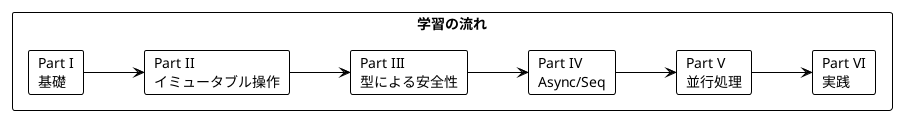

# Grokking Functional Programming 日本語解説（F# 版）

本シリーズは「Grokking Functional Programming」（Michał Płachta 著）の学習コンパニオンとして、関数型プログラミングの概念を F# で実装しながら日本語で解説します。

---

## 対象読者

- C# や .NET の経験があり、関数型プログラミングに興味がある開発者
- F# を学びたいが、FP の概念から理解したい方
- 実践的な FP の適用方法を知りたい .NET エンジニア

---

## 記事一覧

### [Part I: 関数型プログラミングの基礎](part-1.md)

関数型プログラミングの基本概念を学びます。

| 章 | トピック |
|----|----------|
| 第1章 | 命令型 vs 関数型、F# 基本構文 |
| 第2章 | 純粋関数、副作用の排除、テストの容易さ |

**キーワード**: 純粋関数、参照透過性、副作用、let バインディング

---

### [Part II: 関数型スタイルのプログラミング](part-2.md)

イミュータブルなデータ操作と高階関数を学びます。

| 章 | トピック |
|----|----------|
| 第3章 | イミュータブルデータ、List 操作 |
| 第4章 | 高階関数、List.map/filter/fold |
| 第5章 | パイプライン演算子、コンピュテーション式 |

**キーワード**: イミュータブル、高階関数、パイプライン（|>）、コンピュテーション式

---

### [Part III: エラーハンドリングと Option/Result](part-3.md)

型安全なエラーハンドリングを学びます。

| 章 | トピック |
|----|----------|
| 第6章 | Option 型、Some/None |
| 第7章 | Result 型、判別共用体、パターンマッチング |

**キーワード**: Option、Result、判別共用体（Discriminated Union）

---

### [Part IV: Async と副作用の管理](part-4.md)

非同期処理とストリーム処理を学びます。

| 章 | トピック |
|----|----------|
| 第8章 | Async ワークフロー、非同期コンピュテーション |
| 第9章 | Seq（遅延シーケンス）、AsyncSeq |

**キーワード**: Async、遅延評価、シーケンス処理

---

### [Part V: 並行処理](part-5.md)

関数型プログラミングにおける並行処理を学びます。

| 章 | トピック |
|----|----------|
| 第10章 | MailboxProcessor、Async.Parallel |

**キーワード**: 並行処理、MailboxProcessor（Agent）、Async.Parallel

---

### [Part VI: 実践的なアプリケーション構築とテスト](part-6.md)

実践的なアプリケーション構築とテスト戦略を学びます。

| 章 | トピック |
|----|----------|
| 第11章 | TravelGuide アプリ、use バインディング、キャッシュ |
| 第12章 | テスト戦略、FsCheck プロパティベーステスト |

**キーワード**: use（リソース管理）、Type Provider、FsCheck

---

## 学習パス



---

## 使用ライブラリ

| ライブラリ | 用途 | 対応章 |
|------------|------|--------|
| F# 8 | 言語 | 全章 |
| FSharp.Core | 標準ライブラリ | 全章 |
| FSharpPlus | 拡張関数型ライブラリ | Part IV-VI |
| FsCheck | プロパティベーステスト | Part VI |

---

## リポジトリ構成

```
grokkingfp-examples/
├── app/fsharp/src/           # F# のサンプルコード
│   ├── Ch03/                 # 第3章: イミュータブルデータ
│   ├── Ch04/                 # 第4章: 高階関数
│   ├── Ch05/                 # 第5章: パイプライン
│   ├── Ch06/                 # 第6章: Option
│   ├── Ch07/                 # 第7章: Result
│   ├── Ch08/                 # 第8章: Async
│   ├── Ch09/                 # 第9章: Seq
│   ├── Ch10/                 # 第10章: 並行処理
│   ├── Ch11/                 # 第11章: 実践アプリ
│   └── Ch12/                 # 第12章: テスト
├── app/fsharp/tests/         # テストコード
└── docs/article/fsharp/      # 解説記事（本ディレクトリ）
    ├── index.md              # この記事
    ├── part-1.md             # Part I
    ├── part-2.md             # Part II
    ├── part-3.md             # Part III
    ├── part-4.md             # Part IV
    ├── part-5.md             # Part V
    └── part-6.md             # Part VI
```

---

## F# の特徴

F# は .NET プラットフォーム上で動作する関数型ファーストの言語です:

### 言語の特徴

| 特徴 | 説明 |
|------|------|
| **関数型ファースト** | 関数型プログラミングを第一に設計 |
| **型推論** | 強力な型推論により簡潔なコード |
| **パイプライン** | `\|>` 演算子によるデータフローの表現 |
| **判別共用体** | 代数的データ型のネイティブサポート |
| **パターンマッチング** | 強力なパターンマッチング |
| **.NET 互換** | C# ライブラリとの完全な相互運用 |

### Scala との比較

| 概念 | Scala | F# |
|------|-------|-----|
| 言語パラダイム | マルチパラダイム | 関数型ファースト |
| 実行環境 | JVM | .NET (CLR) |
| Option 型 | `Option[A]` | `Option<'a>` または `'a option` |
| Either/Result | `Either[E, A]` | `Result<'a, 'e>` |
| ADT | `sealed trait` + `case class` | 判別共用体 |
| for 内包表記 | `for { ... } yield` | コンピュテーション式 |
| パイプライン | メソッドチェーン | `\|>` 演算子 |
| 非同期 | `IO[A]` (cats-effect) | `Async<'a>` |
| ストリーム | `fs2.Stream` | `Seq<'a>` / `AsyncSeq` |

---

## 関数型プログラミングの利点

本シリーズを通じて、以下の利点を実感できます:

1. **予測可能性** - 純粋関数は同じ入力に対して常に同じ出力
2. **テスト容易性** - 副作用がないためテストが簡単
3. **合成可能性** - 小さな関数を組み合わせて複雑な処理を構築
4. **並行安全性** - イミュータブルデータは競合状態を防ぐ
5. **型安全性** - Option、Result で null や例外を型で表現

---

## 参考資料

- [Grokking Functional Programming](https://www.manning.com/books/grokking-functional-programming) - 原著
- [F# 公式ドキュメント](https://docs.microsoft.com/ja-jp/dotnet/fsharp/)
- [F# for Fun and Profit](https://fsharpforfunandprofit.com/) - F# 学習サイト
- [FSharpPlus ドキュメント](https://fsprojects.github.io/FSharpPlus/)
- [FsCheck ドキュメント](https://fscheck.github.io/FsCheck/)
