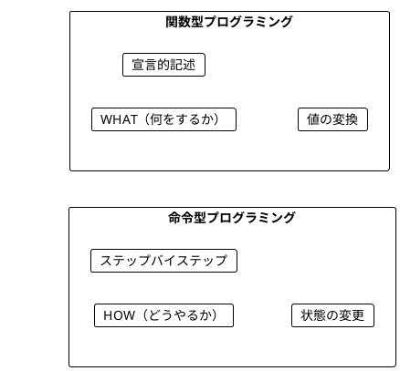
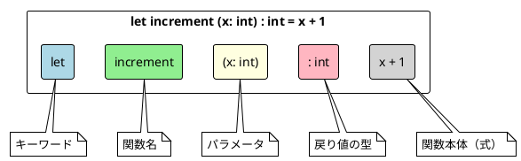
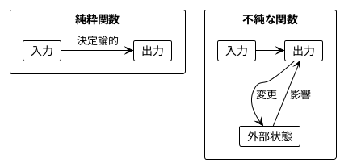
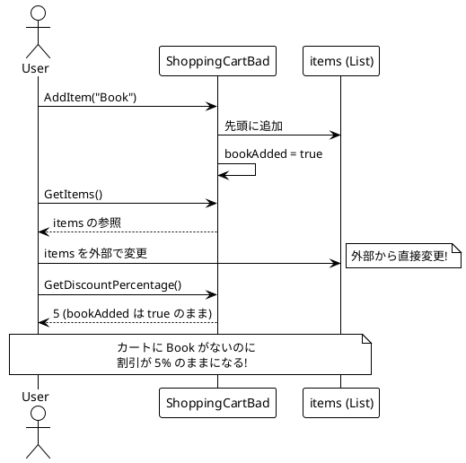
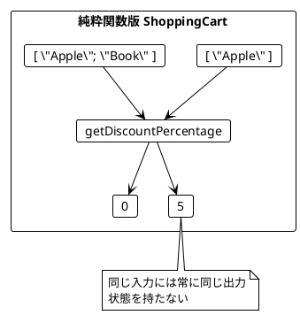
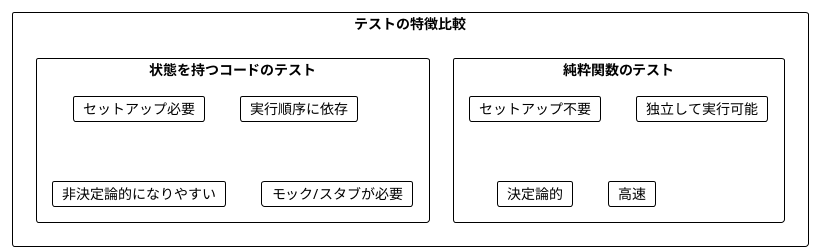
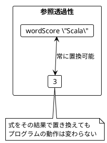
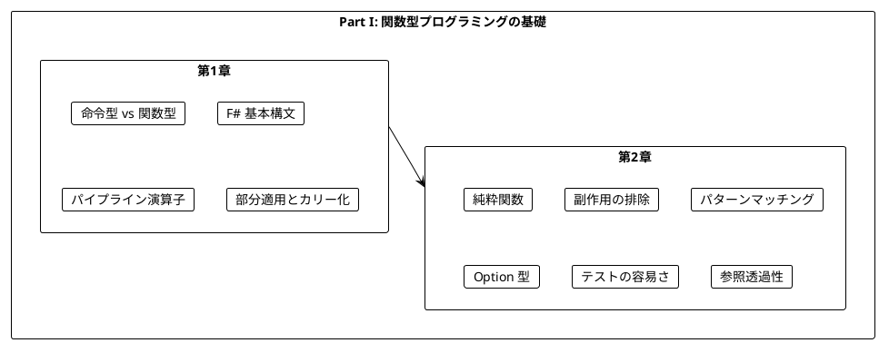

# Part I: 関数型プログラミングの基礎

本章では、関数型プログラミング（FP）の基本概念を学びます。命令型プログラミングとの違いを理解し、純粋関数の利点を実感することが目標です。

---

## 第1章: 関数型プログラミング入門

### 1.1 命令型 vs 関数型

プログラミングには大きく分けて2つのパラダイムがあります。



**命令型プログラミング**は「どうやるか」を記述します。

```fsharp
// F#: 命令型でワードスコアを計算
let wordScoreImperative (word: string) : int =
    let mutable score = 0
    for _ in word do
        score <- score + 1
    score
```

**関数型プログラミング**は「何をするか」を記述します。

```fsharp
// F#: 関数型でワードスコアを計算
let wordScore (word: string) : int =
    word.Length
```

### 1.2 F# の基本構文

F# での関数定義の基本形を見てみましょう。

**ソースファイル**: `app/fsharp/src/Ch01/IntroFSharp.fs`

```fsharp
/// 数値をインクリメント
let increment (x: int) : int =
    x + 1

/// 文字列の最初の文字を取得
let getFirstCharacter (s: string) : char =
    s.[0]

/// 単語のスコアを計算（文字数）
let wordScore (word: string) : int =
    word.Length
```

### 1.3 関数の構造



### 1.4 F# の特徴的な構文

#### パイプライン演算子

F# では `|>` 演算子を使って、データの流れを左から右に記述できます。

```fsharp
/// 文字列を大文字に変換してスコアを計算
let scoreUpperCase (word: string) : int =
    word
    |> fun s -> s.ToUpper()
    |> fun s -> s.Length

/// 複数の変換をパイプラインで連結
let processWord (word: string) : string =
    word
    |> fun s -> s.Trim()
    |> fun s -> s.ToLower()
    |> fun s -> s.Replace(" ", "")
```

#### 型推論

F# は強力な型推論を持っています。

```fsharp
// 型注釈なしでも型推論される
let add a b = a + b

// 明示的な型注釈
let addExplicit (a: int) (b: int) : int = a + b

// ジェネリック関数
let identity x = x
```

#### 部分適用とカリー化

F# の関数はデフォルトでカリー化されています。

```fsharp
/// 2つの数値を加算
let addTwo x y = x + y

/// 部分適用: 5を加算する関数
let addFive = addTwo 5

// addFive 3 = 8
```

### 1.5 学習ポイント

| 概念 | 命令型 | 関数型 |
|------|--------|--------|
| 焦点 | 手順（How） | 結果（What） |
| 状態 | 変更する | 変換する |
| ループ | for/while | map/filter/reduce |
| データ | ミュータブル | イミュータブル |
| 関数 | 引数を一括で受け取る | カリー化（部分適用可能） |

### 1.6 F# と Scala の比較

| 機能 | F# | Scala |
|------|-----|-------|
| 関数定義 | `let f x = ...` | `def f(x: Int) = ...` |
| 型注釈 | `(x: int)` | `(x: Int)` |
| パイプライン | `x \|> f` | `f(x)` または拡張メソッド |
| 部分適用 | デフォルトでカリー化 | `.curried` で変換 |
| 文字列補間 | `$"Hello {name}"` | `s"Hello $name"` |

---

## 第2章: 純粋関数とテスト

### 2.1 純粋関数とは

純粋関数（Pure Function）は以下の特徴を持つ関数です:

1. **同じ入力には常に同じ出力を返す**
2. **副作用がない**（外部状態を変更しない）



### 2.2 純粋関数の例

**ソースファイル**: `app/fsharp/src/Ch02/PureFunctions.fs`

```fsharp
/// 数値をインクリメント（純粋関数）
let increment (x: int) : int =
    x + 1

/// 2つの数値を加算（純粋関数）
let add (a: int) (b: int) : int =
    a + b

/// 文字列の最初の文字を取得（純粋関数）
let getFirstCharacter (s: string) : char =
    s.[0]

/// 数値を2倍にする（純粋関数）
let double (x: int) : int =
    x * 2

/// 数値が偶数かどうかを判定（純粋関数）
let isEven (n: int) : bool =
    n % 2 = 0
```

**純粋ではない関数の例**:

```fsharp
/// 不純な関数 - 毎回異なる値を返す
let randomPart (x: float) : float =
    x * System.Random().NextDouble()

/// 不純な関数 - 現在時刻を返す
let currentTime () : int64 =
    System.DateTimeOffset.UtcNow.ToUnixTimeMilliseconds()
```

### 2.3 ショッピングカートの例

状態を持つクラスの問題点を見てみましょう。

**ソースファイル**: `app/fsharp/src/Ch02/ShoppingCart.fs`

#### 問題のあるコード（オブジェクト指向的なアプローチ）

```fsharp
// ミュータブルな状態を持つ問題のあるアプローチ
type ShoppingCartBad() =
    let mutable items = []
    let mutable bookAdded = false

    member _.AddItem(item: string) =
        items <- item :: items
        if item = "Book" then
            bookAdded <- true

    member _.GetDiscountPercentage() =
        if bookAdded then 5 else 0

    member _.GetItems() = items  // 問題: 内部状態への参照を返している
```



#### 純粋関数による解決

```fsharp
/// カート内の商品リストから割引率を計算
/// Book が含まれていれば 5%、それ以外は 0%
let getDiscountPercentage (items: string list) : int =
    if List.contains "Book" items then 5
    else 0
```



#### イミュータブルなカート操作

```fsharp
/// 商品を追加した新しいカートを返す
let addItem (items: string list) (item: string) : string list =
    item :: items

/// 商品を削除した新しいカートを返す
let removeItem (items: string list) (item: string) : string list =
    items |> List.filter (fun i -> i <> item)
```

F# のリストはイミュータブルなので、`addItem` や `removeItem` は元のリストを変更せず、新しいリストを返します。

### 2.4 複数条件による割引計算

パターンマッチングを使った複雑なビジネスロジックの実装:

```fsharp
/// 複数の条件による割引計算
let getAdvancedDiscountPercentage (items: string list) : int =
    let hasBook = List.contains "Book" items
    let hasElectronics = List.exists (fun item ->
        item = "Laptop" || item = "Phone" || item = "Tablet") items
    let itemCount = List.length items

    match hasBook, hasElectronics, itemCount with
    | true, true, _ -> 15      // Book + 電子機器 → 15%
    | true, _, n when n >= 5 -> 10  // Book + 5個以上 → 10%
    | true, _, _ -> 5          // Book のみ → 5%
    | _, true, n when n >= 3 -> 7   // 電子機器 + 3個以上 → 7%
    | _, _, n when n >= 10 -> 5     // 10個以上 → 5%
    | _ -> 0                   // それ以外 → 0%
```

### 2.5 チップ計算の例

**ソースファイル**: `app/fsharp/src/Ch02/TipCalculator.fs`

```fsharp
/// グループサイズに応じたチップ率を計算
/// 6人以上 → 20%
/// 1-5人 → 10%
/// 0人 → 0%
let getTipPercentage (names: string list) : int =
    let size = List.length names
    if size > 5 then 20
    elif size > 0 then 10
    else 0
```

パターンマッチングを使った別の実装:

```fsharp
/// パターンマッチングを使用したチップ率計算
let getTipPercentageMatch (names: string list) : int =
    match List.length names with
    | n when n > 5 -> 20
    | n when n > 0 -> 10
    | _ -> 0
```

#### Option 型によるゼロ除算の防止

```fsharp
/// 一人当たりの支払額を計算（チップ込み）
let calculatePerPerson (billAmount: decimal) (names: string list) : decimal option =
    let size = List.length names
    if size = 0 then
        None
    else
        let tip = calculateTip billAmount names
        let total = billAmount + tip
        Some (total / decimal size)
```

F# の `Option` 型は、値が存在しない可能性を型で表現します。これにより、`null` による実行時エラーを防げます。

### 2.6 純粋関数のテスト

純粋関数は非常にテストしやすいです。

**ソースファイル**: `app/fsharp/tests/Ch02/PureFunctionsTests.fs`

```fsharp
[<Fact>]
let ``increment は数値を1増やす`` () =
    Assert.Equal(7, increment 6)
    Assert.Equal(1, increment 0)
    Assert.Equal(-5, increment -6)
    Assert.Equal(System.Int32.MaxValue, increment (System.Int32.MaxValue - 1))
```



### 2.7 文字 'a' を除外するワードスコア

より複雑な例を見てみましょう。

```fsharp
/// 'a' を除外した文字数をスコアとして返す
let wordScore (word: string) : int =
    word.Replace("a", "").Length

/// 大文字小文字を区別せずに 'a' を除外
let wordScoreIgnoreCase (word: string) : int =
    word
    |> String.filter (fun c -> c <> 'a' && c <> 'A')
    |> String.length
```

```fsharp
// テスト
[<Fact>]
let ``wordScore は 'a' を除外した文字数を返す`` () =
    Assert.Equal(3, wordScore "Scala")  // "Scl" → 3
    Assert.Equal(8, wordScore "function") // 'a' なし → 8
    Assert.Equal(0, wordScore "")        // 空文字 → 0
    Assert.Equal(0, wordScore "aaa")     // すべて 'a' → 0
```

### 2.8 参照透過性

純粋関数は**参照透過性（Referential Transparency）**を持ちます。

> 式をその評価結果で置き換えても、プログラムの意味が変わらないこと

```fsharp
// 参照透過性の例
let score1 = wordScore "Scala"
let score2 = wordScore "Scala"
// score1 と score2 は常に同じ値（3）

// 以下の2つは同等
let total1 = wordScore "Scala" + wordScore "Java"
let total2 = 3 + 2  // wordScore の結果で置き換え可能
```



---

## まとめ

### Part I で学んだこと



### キーポイント

1. **関数型プログラミング**は「何をするか」を宣言的に記述する
2. **F# のパイプライン演算子** (`|>`) でデータの流れを直感的に表現できる
3. **純粋関数**は同じ入力に対して常に同じ出力を返す
4. **副作用**を避けることでコードの予測可能性が向上する
5. **パターンマッチング**で複雑な条件分岐を簡潔に記述できる
6. **Option 型**で null 安全なプログラミングができる
7. **純粋関数**はテストが非常に簡単
8. **参照透過性**により、コードの理解と推論が容易になる

### 次のステップ

Part II では、以下のトピックを学びます:

- イミュータブルなデータ操作
- 高階関数（関数を値として扱う）
- `List.collect` とネスト構造の平坦化
- コンピュテーション式

---

## 演習問題

### 問題 1: 純粋関数の識別

以下の関数のうち、純粋関数はどれですか?

```fsharp
// A
let double (x: int) : int = x * 2

// B
let mutable counter = 0
let incrementCounter () : int =
    counter <- counter + 1
    counter

// C
let greet (name: string) : string = $"Hello, {name}!"

// D
let currentTime () : int64 = System.DateTimeOffset.UtcNow.ToUnixTimeMilliseconds()
```

<details>
<summary>解答</summary>

**A と C は純粋関数**です。

- A: 同じ入力に対して常に同じ出力を返し、副作用がない
- B: 外部変数 `counter` を変更する副作用がある（不純）
- C: 同じ入力に対して常に同じ出力を返し、副作用がない
- D: 呼び出すたびに異なる値を返す（不純）

</details>

### 問題 2: 純粋関数への書き換え

以下の不純な関数を純粋関数に書き換えてください。

```fsharp
type Counter() =
    let mutable value = 0

    member _.Increment() =
        value <- value + 1
        value
```

<details>
<summary>解答</summary>

```fsharp
let increment (value: int) : int = value + 1

// 使用例
let v1 = 0
let v2 = increment v1  // 1
let v3 = increment v2  // 2
```

状態を外部に持ち、関数は値を受け取って新しい値を返すだけにします。

</details>

### 問題 3: テストを書く

以下の関数に対するテストケースを考えてください。

```fsharp
let isEven (n: int) : bool = n % 2 = 0
```

<details>
<summary>解答</summary>

```fsharp
// 基本ケース
Assert.True(isEven 0)
Assert.True(isEven 2)
Assert.True(isEven 4)

// 奇数
Assert.False(isEven 1)
Assert.False(isEven 3)

// 負の数
Assert.True(isEven -2)
Assert.False(isEven -3)

// 境界値
Assert.False(isEven System.Int32.MaxValue)
Assert.True(isEven System.Int32.MinValue)
```

</details>

### 問題 4: パイプライン演算子を使う

以下の関数をパイプライン演算子を使って書き換えてください。

```fsharp
let processText (text: string) : int =
    String.length (text.ToUpper().Trim())
```

<details>
<summary>解答</summary>

```fsharp
let processText (text: string) : int =
    text
    |> fun s -> s.Trim()
    |> fun s -> s.ToUpper()
    |> String.length
```

パイプライン演算子を使うと、データの変換過程が上から下に読めるようになります。

</details>

### 問題 5: Option 型を使う

以下の関数を `Option` 型を使って安全にしてください。

```fsharp
let divide (a: int) (b: int) : int = a / b  // b が 0 の場合に例外
```

<details>
<summary>解答</summary>

```fsharp
let divide (a: int) (b: int) : int option =
    if b = 0 then None
    else Some (a / b)

// 使用例
match divide 10 2 with
| Some result -> printfn "結果: %d" result
| None -> printfn "0で除算できません"
```

`Option` 型を使うことで、エラーケースを型で表現し、呼び出し側にハンドリングを強制できます。

</details>
