# Part II: 関数型スタイルのプログラミング

本章では、関数型プログラミングの核心となるテクニックを学びます。イミュータブルなデータ操作、高階関数、そして `List.collect`（flatMap 相当）による複雑なデータ変換を習得します。

---

## 第3章: イミュータブルなデータ操作

### 3.1 イミュータブルとは

イミュータブル（不変）とは、一度作成されたデータが変更されないことを意味します。データを「変更」する代わりに、新しいデータを「作成」します。

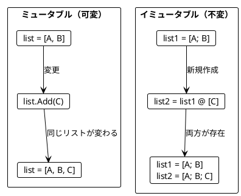

### 3.2 List の基本操作

**ソースファイル**: `app/fsharp/src/Ch03/ImmutableOperations.fs`

#### 要素の追加

F# のリストはデフォルトでイミュータブルです。要素を追加すると新しいリストが作成されます。

```fsharp
let appleBook = ["Apple"; "Book"]
let appleBookMango = appleBook @ ["Mango"]

// 元のリストは変わらない
assert (List.length appleBook = 2)
// 新しいリストが作成される
assert (List.length appleBookMango = 3)
assert (appleBookMango = ["Apple"; "Book"; "Mango"])
```

#### スライス操作

```fsharp
/// リストの先頭n個の要素を取得
let firstN (n: int) (list: 'a list) : 'a list =
    list |> List.truncate n

/// リストの末尾n個の要素を取得
let lastN (n: int) (list: 'a list) : 'a list =
    let skipCount = max 0 (List.length list - n)
    list |> List.skip skipCount

/// リストの最初の2要素を取得
let firstTwo (list: 'a list) : 'a list =
    firstN 2 list

/// リストの最後の2要素を取得
let lastTwo (list: 'a list) : 'a list =
    lastN 2 list
```

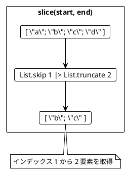

### 3.3 リストの変換例

```fsharp
/// 最初の2要素を末尾に移動
let moveFirstTwoToEnd (list: 'a list) : 'a list =
    let first = firstTwo list
    let rest = list |> List.skip 2
    rest @ first

// 使用例
assert (moveFirstTwoToEnd ["a"; "b"; "c"] = ["c"; "a"; "b"])

/// 最後の要素の前に新しい要素を挿入
let insertBeforeLast (element: 'a) (list: 'a list) : 'a list =
    let withoutLast = list |> List.truncate (List.length list - 1)
    let last = list |> lastN 1
    withoutLast @ [element] @ last

assert (insertBeforeLast "c" ["a"; "b"] = ["a"; "c"; "b"])
```

### 3.4 旅程の再計画

旅行の計画変更をイミュータブルに行う例です。

```fsharp
/// 指定した都市の前に新しい都市を挿入
let replan (plan: string list) (newCity: string) (beforeCity: string) : string list =
    let index =
        plan
        |> List.tryFindIndex (fun c -> c = beforeCity)
        |> Option.defaultValue (List.length plan)
    let citiesBefore = plan |> List.truncate index
    let citiesAfter = plan |> List.skip index
    citiesBefore @ [newCity] @ citiesAfter

let planA = ["Paris"; "Berlin"; "Kraków"]
let planB = replan planA "Vienna" "Kraków"

assert (planB = ["Paris"; "Berlin"; "Vienna"; "Kraków"])
assert (planA = ["Paris"; "Berlin"; "Kraków"])  // 元の計画は変わらない!
```

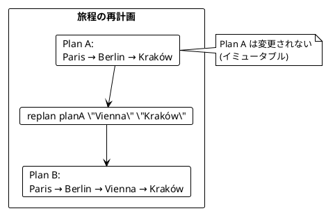

### 3.5 String と List の類似性

String と List は似た操作ができます。

| 操作 | F# List | F# String |
|------|---------|-----------|
| 結合 | `@` または `List.append` | `+` または `String.concat` |
| 切り出し | `List.skip`, `List.truncate` | `Substring` |
| サイズ | `List.length` | `String.length` |

```fsharp
// List の操作
let abList = ["a"; "b"]
let cdList = ["c"; "d"]
let abcdList = abList @ cdList
assert (abcdList = ["a"; "b"; "c"; "d"])

// String の操作
let abStr = "ab"
let cdStr = "cd"
let abcdStr = abStr + cdStr
assert (abcdStr = "abcd")
```

### 3.6 名前の省略

```fsharp
/// 名前を省略形に変換（例: "Alonzo Church" -> "A. Church"）
let abbreviate (name: string) : string =
    let initial = name.Substring(0, 1)
    let separatorIndex = name.IndexOf(' ')
    if separatorIndex < 0 then
        name
    else
        let lastName = name.Substring(separatorIndex + 1)
        $"{initial}. {lastName}"

assert (abbreviate "Alonzo Church" = "A. Church")
assert (abbreviate "A. Church" = "A. Church")
```

---

## 第4章: 関数を値として扱う

### 4.1 高階関数とは

高階関数（Higher-Order Function）とは、以下のいずれかを満たす関数です:

1. 関数を引数として受け取る
2. 関数を戻り値として返す

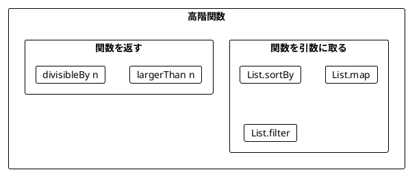

### 4.2 関数を引数として渡す

**ソースファイル**: `app/fsharp/src/Ch04/HigherOrderFunctions.fs`

#### List.sortBy - ソート基準を関数で指定

```fsharp
let wordScore (word: string) : int =
    word.Replace("a", "").Length

let words = ["rust"; "java"]
let sortedWords = words |> List.sortBy wordScore

assert (sortedWords = ["java"; "rust"])
// java: 2文字 (j, v), rust: 4文字 (r, u, s, t)
```

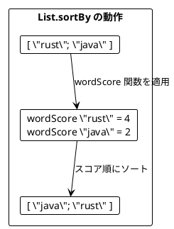

#### List.map - 各要素を変換

```fsharp
let len (s: string) : int = s.Length

let lengths = ["scala"; "rust"; "ada"] |> List.map len
assert (lengths = [5; 4; 3])

let double (i: int) : int = i * 2
let doubles = [5; 1; 2; 4; 0] |> List.map double
assert (doubles = [10; 2; 4; 8; 0])
```

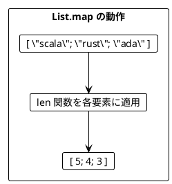

#### List.filter - 条件に合う要素を抽出

```fsharp
let isOdd (i: int) : bool = i % 2 = 1

let odds = [5; 1; 2; 4; 0] |> List.filter isOdd
assert (odds = [5; 1])

let largerThan4 (i: int) : bool = i > 4
let large = [5; 1; 2; 4; 0] |> List.filter largerThan4
assert (large = [5])
```

#### List.fold - 畳み込み

```fsharp
let sum = [5; 1; 2; 4; 100] |> List.fold (fun acc i -> acc + i) 0
assert (sum = 112)

let maximum = [5; 1; 2; 4; 15] |> List.fold (fun maxVal i ->
    if i > maxVal then i else maxVal) System.Int32.MinValue
assert (maximum = 15)
```

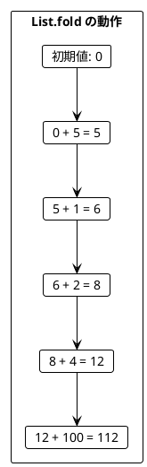

### 4.3 レコード型とパターン

**ソースファイル**: `app/fsharp/src/Ch04/HigherOrderFunctions.fs`

```fsharp
/// プログラミング言語を表すレコード型
type ProgrammingLanguage = {
    Name: string
    Year: int
}

let javalang = { Name = "Java"; Year = 1995 }
let scalalang = { Name = "Scala"; Year = 2004 }

let languages = [javalang; scalalang]

// フィールドにアクセス
let names = languages |> List.map (fun lang -> lang.Name)
assert (names = ["Java"; "Scala"])

// 条件でフィルタ
let young = languages |> List.filter (fun lang -> lang.Year > 2000)
assert (young = [scalalang])
```

### 4.4 関数を返す関数

```fsharp
/// n より大きいかを判定する関数を返す
let largerThan (n: int) : int -> bool =
    fun i -> i > n

let large = [5; 1; 2; 4; 0] |> List.filter (largerThan 4)
assert (large = [5])

let medium = [5; 1; 2; 4; 0] |> List.filter (largerThan 1)
assert (medium = [5; 2; 4])
```

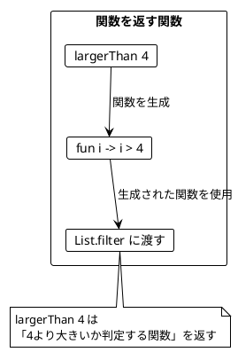

### 4.5 部分適用

F# の関数はデフォルトでカリー化されているため、部分適用が自然に行えます。

```fsharp
/// 2つの引数を取る関数
let add x y = x + y

/// 部分適用: 5を足す関数
let addFive = add 5

assert (addFive 3 = 8)
assert (addFive 10 = 15)
```

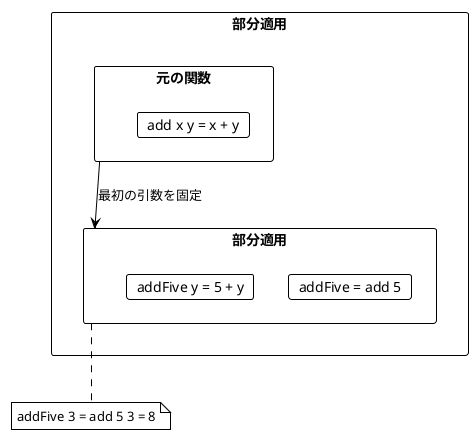

### 4.6 ワードスコアリングの例

複数のスコアリングロジックを組み合わせる例です。

```fsharp
let wordScore (word: string) : int = word.Replace("a", "").Length
let bonus (word: string) : int = if word.Contains("c") then 5 else 0
let penalty (word: string) : int = if word.Contains("s") then 7 else 0

let words = ["ada"; "haskell"; "scala"; "java"; "rust"]

/// 指定したスコア関数でワードをランキング
let rankedWords (scoreFn: string -> int) (words: string list) : string list =
    words |> List.sortByDescending scoreFn

// 基本スコアでランキング
let ranking1 = rankedWords wordScore words
assert (ranking1 = ["haskell"; "rust"; "scala"; "java"; "ada"])

// ボーナス付きスコアでランキング
let ranking2 = rankedWords (fun w -> wordScore w + bonus w) words
assert (ranking2 = ["scala"; "haskell"; "rust"; "java"; "ada"])

// ボーナスとペナルティ付きスコアでランキング
let ranking3 = rankedWords (fun w -> wordScore w + bonus w - penalty w) words
// java: 2, scala/ada: 1, haskell: -1, rust: -3
```

---

## 第5章: List.collect とネスト構造

### 5.1 flatten と List.collect

**ソースファイル**: `app/fsharp/src/Ch05/FlatMapOperations.fs`

#### List.concat - ネストしたリストを平坦化

```fsharp
type Book = {
    Title: string
    Authors: string list
}

let books = [
    { Title = "FP in Scala"; Authors = ["Chiusano"; "Bjarnason"] }
    { Title = "The Hobbit"; Authors = ["Tolkien"] }
]

// List.map だけだとネストする
let authorLists = books |> List.map (fun b -> b.Authors)
// [ ["Chiusano"; "Bjarnason"]; ["Tolkien"] ]

// List.concat で平坦化
let authors = authorLists |> List.concat
// ["Chiusano"; "Bjarnason"; "Tolkien"]
```

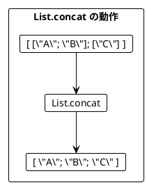

#### List.collect = map + concat

F# の `List.collect` は Scala の `flatMap` に相当します。

```fsharp
// map して concat
let authors1 = books |> List.map (fun b -> b.Authors) |> List.concat

// List.collect で同じことを1行で
let authors2 = books |> List.collect (fun b -> b.Authors)

assert (authors1 = authors2)
// ["Chiusano"; "Bjarnason"; "Tolkien"]
```

### 5.2 List.collect によるリストサイズの変化

```fsharp
// 要素数が増える
let duplicate = [1; 2; 3] |> List.collect (fun i -> [i; i + 10])
// [1; 11; 2; 12; 3; 13] - 6要素

// 要素数が同じ
let doubled = [1; 2; 3] |> List.collect (fun i -> [i * 2])
// [2; 4; 6] - 3要素

// 要素数が減る（フィルタリング効果）
let evens = [1; 2; 3] |> List.collect (fun i ->
    if i % 2 = 0 then [i] else [])
// [2] - 1要素
```

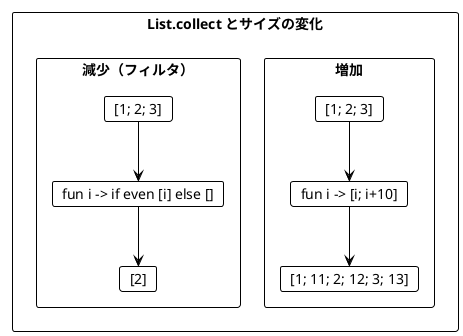

### 5.3 ネストした List.collect

複数のリストを組み合わせる場合、List.collect をネストします。

```fsharp
type Movie = { Title: string }

let bookAdaptations (author: string) : Movie list =
    if author = "Tolkien" then
        [{ Title = "An Unexpected Journey" }; { Title = "The Desolation of Smaug" }]
    else
        []

let books = [
    { Title = "FP in Scala"; Authors = ["Chiusano"; "Bjarnason"] }
    { Title = "The Hobbit"; Authors = ["Tolkien"] }
]

// ネストした List.collect
let recommendations =
    books
    |> List.collect (fun book ->
        book.Authors
        |> List.collect (fun author ->
            bookAdaptations author
            |> List.map (fun movie ->
                $"You may like {movie.Title}, because you liked {author}'s {book.Title}")))

// 結果:
// [ "You may like An Unexpected Journey, because you liked Tolkien's The Hobbit"
//   "You may like The Desolation of Smaug, because you liked Tolkien's The Hobbit" ]
```

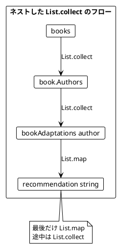

### 5.4 シーケンス式（リスト内包表記）

F# のシーケンス式は、ネストした List.collect を読みやすく書けます。

```fsharp
// List.collect/map 版
let c1 =
    books
    |> List.collect (fun book ->
        book.Authors
        |> List.collect (fun author ->
            bookAdaptations author
            |> List.map (fun movie ->
                $"You may like {movie.Title}, because you liked {author}'s {book.Title}")))

// シーケンス式版（等価）
let c2 =
    [ for book in books do
      for author in book.Authors do
      for movie in bookAdaptations author do
      yield $"You may like {movie.Title}, because you liked {author}'s {book.Title}" ]

assert (c1 = c2)
```

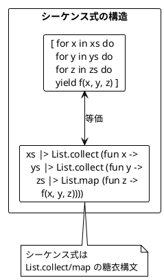

### 5.5 円内の点の判定

シーケンス式でフィルタリングも行う例です。

```fsharp
type Point = { X: int; Y: int }

let points = [{ X = 5; Y = 2 }; { X = 1; Y = 1 }]
let radiuses = [2; 1]

let isInside (point: Point) (radius: int) : bool =
    radius * radius >= point.X * point.X + point.Y * point.Y

// 全組み合わせを生成
let allCombinations =
    [ for r in radiuses do
      for point in points do
      yield $"Point({point.X},{point.Y}) is within a radius of {r}: {isInside point r}" ]

// 結果:
// [ "Point(5,2) is within a radius of 2: false"
//   "Point(1,1) is within a radius of 2: true"
//   "Point(5,2) is within a radius of 1: false"
//   "Point(1,1) is within a radius of 1: false" ]
```

#### if によるフィルタリング

```fsharp
// if を使ったフィルタリング
let insidePoints =
    [ for r in radiuses do
      for point in points do
      if isInside point r then
          yield $"Point({point.X},{point.Y}) is within a radius of {r}" ]

// 結果: [ "Point(1,1) is within a radius of 2" ]
```

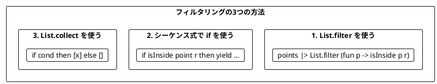

### 5.6 シーケンス式の柔軟性

F# のシーケンス式は、リスト `[ ]`、シーケンス `seq { }`、配列 `[| |]` で使えます。

```fsharp
// リスト
let listResult =
    [ for a in [1; 2] do
      for b in [2; 1] do
      yield a * b ]
// [2; 1; 4; 2] - 重複あり、順序あり

// セットへの変換
let setResult = listResult |> Set.ofList
// set [1; 2; 4] - 重複なし

// シーケンス（遅延評価）
let seqResult =
    seq { for a in [1; 2] do
          for b in [2; 1] do
          yield a * b }
```

---

## まとめ

### Part II で学んだこと

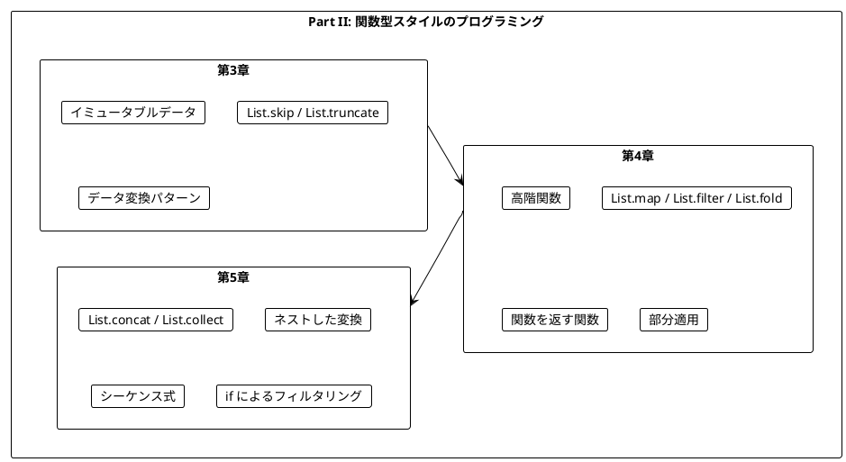

### キーポイント

| 章 | 主要概念 | キー操作 |
|----|----------|----------|
| 第3章 | イミュータブル | `@`, `List.skip`, `List.truncate` |
| 第4章 | 高階関数 | `List.map`, `List.filter`, `List.fold`, `List.sortBy` |
| 第5章 | 平坦化 | `List.concat`, `List.collect`, シーケンス式 |

### F# と Scala の対応

| 操作 | F# | Scala |
|------|-----|-------|
| 平坦化 | `List.concat` | `flatten` |
| flatMap | `List.collect` | `flatMap` |
| 内包表記 | `[ for x in xs do ... ]` | `for { x <- xs } yield ...` |
| 畳み込み | `List.fold` | `foldLeft` |
| フィルタ | `List.filter` | `filter` |

### 重要な法則

1. **イミュータブルデータ**: 元のデータは変更せず、新しいデータを作成する
2. **関数は値**: 関数を引数として渡したり、戻り値として返したりできる
3. **List.collect パターン**: ネストした構造を平坦化しながら変換する
4. **シーケンス式**: List.collect/map の糖衣構文として使える
5. **パイプライン**: `|>` で関数を連鎖させて読みやすくする

### 次のステップ

Part III では、以下のトピックを学びます:

- `Option` 型による安全なエラーハンドリング
- `Result` 型と複合的なエラー処理

---

## 演習問題

### 問題 1: イミュータブルな操作

以下の関数を実装してください。リストの中央に要素を挿入する関数です。

```fsharp
let insertAtMiddle (element: 'a) (list: 'a list) : 'a list = ???

// 期待される動作
assert (insertAtMiddle "X" ["a"; "b"; "c"; "d"] = ["a"; "b"; "X"; "c"; "d"])
assert (insertAtMiddle "X" ["a"; "b"] = ["a"; "X"; "b"])
```

<details>
<summary>解答</summary>

```fsharp
let insertAtMiddle (element: 'a) (list: 'a list) : 'a list =
    let middle = List.length list / 2
    let before = list |> List.truncate middle
    let after = list |> List.skip middle
    before @ [element] @ after
```

</details>

### 問題 2: 高階関数

以下の関数を実装してください。条件を満たす要素の数をカウントする関数です。

```fsharp
let countWhere (predicate: 'a -> bool) (list: 'a list) : int = ???

// 期待される動作
assert (countWhere (fun i -> i > 3) [1; 2; 3; 4; 5] = 2)
assert (countWhere (fun (s: string) -> s.Length > 1) ["a"; "bb"; "ccc"] = 2)
```

<details>
<summary>解答</summary>

```fsharp
let countWhere (predicate: 'a -> bool) (list: 'a list) : int =
    list |> List.filter predicate |> List.length

// または List.fold を使って
let countWhere2 (predicate: 'a -> bool) (list: 'a list) : int =
    list |> List.fold (fun count elem ->
        if predicate elem then count + 1 else count) 0
```

</details>

### 問題 3: シーケンス式

以下のネストした List.collect をシーケンス式で書き換えてください。

```fsharp
let result =
    [1; 2]
    |> List.collect (fun x ->
        [10; 20]
        |> List.collect (fun y ->
            [100; 200]
            |> List.map (fun z ->
                x + y + z)))
```

<details>
<summary>解答</summary>

```fsharp
let result =
    [ for x in [1; 2] do
      for y in [10; 20] do
      for z in [100; 200] do
      yield x + y + z ]

// 結果: [111; 211; 121; 221; 112; 212; 122; 222]
```

</details>

### 問題 4: List.collect によるフィルタリング

シーケンス式の `if` を使わずに、List.collect だけで偶数のみを抽出するコードを書いてください。

```fsharp
let numbers = [1; 2; 3; 4; 5; 6]
// 偶数のみを抽出: [2; 4; 6]
```

<details>
<summary>解答</summary>

```fsharp
let evenNumbers =
    numbers
    |> List.collect (fun n ->
        if n % 2 = 0 then [n] else [])

// または関数に分離
let evenFilter (n: int) : int list =
    if n % 2 = 0 then [n] else []

let evenNumbers2 = numbers |> List.collect evenFilter
```

</details>

### 問題 5: パイプラインで書き換え

以下のコードをパイプライン演算子を使って書き換えてください。

```fsharp
let result = List.length (List.filter (fun x -> x > 0) (List.map (fun x -> x * 2) [1; -2; 3; -4; 5]))
```

<details>
<summary>解答</summary>

```fsharp
let result =
    [1; -2; 3; -4; 5]
    |> List.map (fun x -> x * 2)
    |> List.filter (fun x -> x > 0)
    |> List.length

// 結果: 3 (2, 6, 10 の3つ)
```

パイプライン演算子を使うと、データの変換過程が上から下に読めるようになります。

</details>
