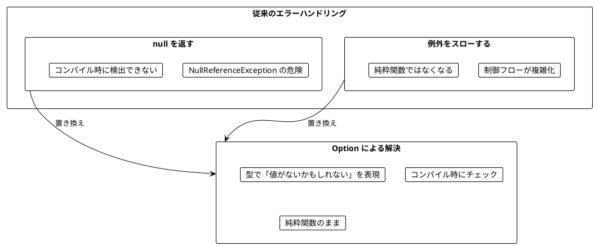
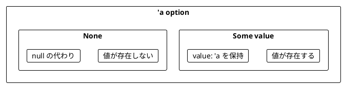
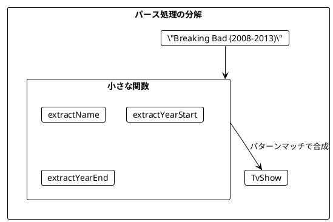
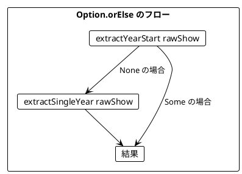
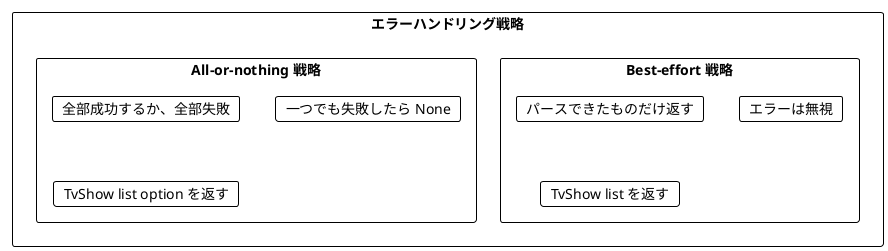
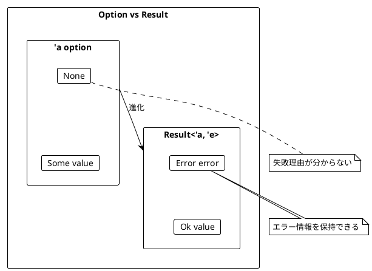
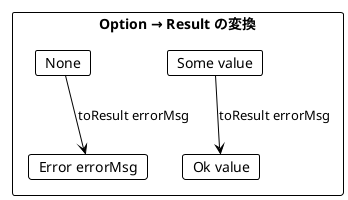
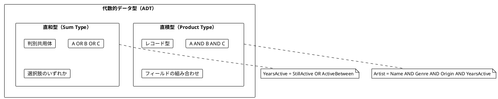
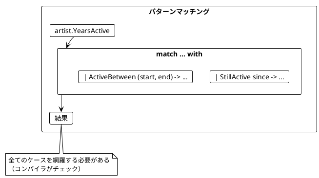
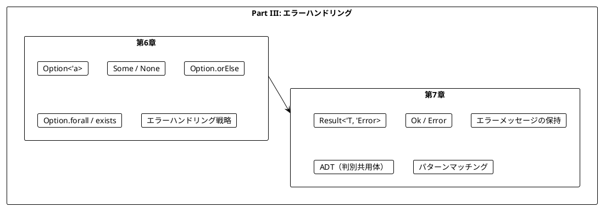

# Part III: エラーハンドリングと Option/Result

本章では、関数型プログラミングにおける安全なエラーハンドリングを学びます。`null` や例外に頼らず、`Option` と `Result` を使って型安全にエラーを扱う方法を習得します。

---

## 第6章: Option 型による安全なエラーハンドリング

### 6.1 なぜ Option が必要か

従来のエラーハンドリングには問題があります。



### 6.2 Option の基本

`'a option` は「`'a` 型の値があるか、ないか」を表す型です。



**ソースファイル**: `app/fsharp/src/Ch06/OptionHandling.fs`

### 6.3 TV番組のパース例

TV番組の文字列をパースする例で Option の使い方を学びます。

```fsharp
type TvShow = {
    Title: string
    Start: int
    End: int
}

// 入力例: "Breaking Bad (2008-2013)"
// 期待する出力: { Title = "Breaking Bad"; Start = 2008; End = 2013 }
```

#### 例外を使う方法（問題あり）

```fsharp
let parseShowUnsafe (rawShow: string) : TvShow =
    let bracketOpen = rawShow.IndexOf('(')
    let bracketClose = rawShow.IndexOf(')')
    let dash = rawShow.IndexOf('-')

    let name = rawShow.Substring(0, bracketOpen).Trim()
    let yearStart = int (rawShow.Substring(bracketOpen + 1, dash - bracketOpen - 1))
    let yearEnd = int (rawShow.Substring(dash + 1, bracketClose - dash - 1))

    { Title = name; Start = yearStart; End = yearEnd }

// 正常ケース
parseShowUnsafe "Breaking Bad (2008-2013)"
// { Title = "Breaking Bad"; Start = 2008; End = 2013 }

// 異常ケース → 例外がスローされる!
parseShowUnsafe "Chernobyl (2019)"        // ArgumentOutOfRangeException
parseShowUnsafe "The Wire 2002-2008"      // ArgumentOutOfRangeException
```

#### Option を使う方法

```fsharp
let parseShow (rawShow: string) : TvShow option =
    match extractName rawShow with
    | None -> None
    | Some name ->
        let yearStart =
            extractYearStart rawShow
            |> Option.orElse (extractSingleYear rawShow)
        let yearEnd =
            extractYearEnd rawShow
            |> Option.orElse (extractSingleYear rawShow)
        match yearStart, yearEnd with
        | Some start, Some endYear ->
            Some { Title = name; Start = start; End = endYear }
        | _ -> None

// 正常ケース
parseShow "Breaking Bad (2008-2013)"
// Some { Title = "Breaking Bad"; Start = 2008; End = 2013 }

// 異常ケース → None が返される（例外なし）
parseShow "The Wire 2002-2008"  // None
```

### 6.4 小さな関数から組み立てる

複雑なパース処理を小さな関数に分解します。

```fsharp
/// 文字列を安全に整数に変換
let tryParseInt (s: string) : int option =
    match System.Int32.TryParse(s) with
    | true, value -> Some value
    | false, _ -> None

/// 名前を抽出
let extractName (rawShow: string) : string option =
    let bracketOpen = rawShow.IndexOf('(')
    if bracketOpen > 0 then
        Some (rawShow.Substring(0, bracketOpen).Trim())
    else
        None

/// 開始年を抽出
let extractYearStart (rawShow: string) : int option =
    let bracketOpen = rawShow.IndexOf('(')
    let dash = rawShow.IndexOf('-')
    if bracketOpen <> -1 && dash > bracketOpen + 1 then
        let yearStr = rawShow.Substring(bracketOpen + 1, dash - bracketOpen - 1)
        tryParseInt yearStr
    else
        None

/// 終了年を抽出
let extractYearEnd (rawShow: string) : int option =
    let dash = rawShow.IndexOf('-')
    let bracketClose = rawShow.IndexOf(')')
    if dash <> -1 && bracketClose > dash + 1 then
        let yearStr = rawShow.Substring(dash + 1, bracketClose - dash - 1)
        tryParseInt yearStr
    else
        None
```



### 6.5 Option.orElse によるフォールバック

`Option.orElse` を使って、最初の Option が `None` の場合に代替を試すことができます。

```fsharp
let seven = Some 7
let eight = Some 8
let none: int option = None

seven |> Option.orElse eight   // Some 7 - 最初が Some なのでそのまま
none |> Option.orElse eight    // Some 8 - 最初が None なので代替を使用
seven |> Option.orElse none    // Some 7
none |> Option.orElse none     // None
```

#### 単年の番組に対応する

「Chernobyl (2019)」のような単年の番組をパースできるようにします。

```fsharp
/// 単年を抽出
let extractSingleYear (rawShow: string) : int option =
    let dash = rawShow.IndexOf('-')
    let bracketOpen = rawShow.IndexOf('(')
    let bracketClose = rawShow.IndexOf(')')
    if dash = -1 && bracketOpen <> -1 && bracketClose > bracketOpen + 1 then
        let yearStr = rawShow.Substring(bracketOpen + 1, bracketClose - bracketOpen - 1)
        tryParseInt yearStr
    else
        None

let parseShow (rawShow: string) : TvShow option =
    match extractName rawShow with
    | None -> None
    | Some name ->
        let yearStart =
            extractYearStart rawShow
            |> Option.orElse (extractSingleYear rawShow)
        let yearEnd =
            extractYearEnd rawShow
            |> Option.orElse (extractSingleYear rawShow)
        match yearStart, yearEnd with
        | Some start, Some endYear ->
            Some { Title = name; Start = start; End = endYear }
        | _ -> None

// これで単年の番組もパースできる
parseShow "Chernobyl (2019)"
// Some { Title = "Chernobyl"; Start = 2019; End = 2019 }
```



### 6.6 Option の主要メソッド

| 関数 | 説明 | 例 |
|------|------|-----|
| `Option.map` | 値があれば変換 | `Some 5 \|> Option.map ((*) 2)` → `Some 10` |
| `Option.bind` | 値があれば Option を返す関数を適用 | `Some 5 \|> Option.bind (fun x -> Some (x * 2))` → `Some 10` |
| `Option.filter` | 条件を満たさなければ None | `Some 5 \|> Option.filter (fun x -> x > 10)` → `None` |
| `Option.orElse` | None なら代替を使用 | `None \|> Option.orElse (Some 5)` → `Some 5` |
| `Option.defaultValue` | None ならデフォルト値 | `None \|> Option.defaultValue 0` → `0` |
| `Option.toList` | List に変換 | `Some 5 \|> Option.toList` → `[5]` |

```fsharp
let year: int option = Some 996
let noYear: int option = None

// map
year |> Option.map (fun x -> x * 2)     // Some 1992
noYear |> Option.map (fun x -> x * 2)   // None

// bind
year |> Option.bind (fun y -> Some (y * 2))     // Some 1992
noYear |> Option.bind (fun y -> Some (y * 2))   // None

// filter
year |> Option.filter (fun x -> x < 2020)   // Some 996
year |> Option.filter (fun x -> x > 2020)   // None

// orElse
year |> Option.orElse (Some 2020)     // Some 996
noYear |> Option.orElse (Some 2020)   // Some 2020
```

### 6.7 エラーハンドリング戦略

複数の要素をパースする場合、2つの戦略があります。



#### Best-effort 戦略

```fsharp
let parseShowsBestEffort (rawShows: string list) : TvShow list =
    rawShows
    |> List.choose parseShow  // Some のものだけ抽出

let rawShows = [
    "Breaking Bad (2008-2013)"
    "The Wire 2002 2008"        // 無効な形式
    "Mad Men (2007-2015)"
]

parseShowsBestEffort rawShows
// [{ Title = "Breaking Bad"; ... }; { Title = "Mad Men"; ... }]
// 無効なものは無視される
```

#### All-or-nothing 戦略

```fsharp
let parseShowsAllOrNothing (rawShows: string list) : TvShow list option =
    let parsed = rawShows |> List.map parseShow
    if List.forall Option.isSome parsed then
        Some (parsed |> List.choose id)
    else
        None

// 全部成功 → Some [...]
parseShowsAllOrNothing ["Breaking Bad (2008-2013)"; "Mad Men (2007-2015)"]
// Some [{ Title = "Breaking Bad"; ... }; { Title = "Mad Men"; ... }]

// 一つでも失敗 → None
parseShowsAllOrNothing ["Breaking Bad (2008-2013)"; "Invalid"]
// None
```

### 6.8 forall と exists

Option で条件判定をする際に便利な関数です。

| 関数 | 動作 |
|------|------|
| `Option.forall p` | None → true, Some x → p(x) |
| `Option.exists p` | None → false, Some x → p(x) |
| `Option.contains x` | Some x と等しいか |

```fsharp
let year = Some 996
let noYear: int option = None

// forall - 「全て」または「存在しない」
year |> Option.forall (fun x -> x < 2020)     // true (996 < 2020)
noYear |> Option.forall (fun x -> x < 2020)   // true (値がないので「全て」が自明に真)
year |> Option.forall (fun x -> x > 2020)     // false

// exists - 「存在して条件を満たす」
year |> Option.exists (fun x -> x < 2020)     // true
noYear |> Option.exists (fun x -> x < 2020)   // false (値がないので存在しない)
```

#### 実用例: ユーザーのメールフィルタリング

```fsharp
type User = {
    Name: string
    Email: string option
    Age: int
}

let users = [
    { Name = "Alice"; Email = Some "alice@example.com"; Age = 25 }
    { Name = "Bob"; Email = None; Age = 30 }
    { Name = "Charlie"; Email = Some "charlie@test.com"; Age = 17 }
]

// メールアドレスが設定されていないか、example.com ドメイン
let filterByDomain domain users =
    users
    |> List.filter (fun user ->
        user.Email |> Option.forall (fun email -> email.EndsWith(domain)))

filterByDomain "@example.com" users
// [Alice; Bob] - Bob は None なので forall = true

// メールアドレスが設定されていて、test.com ドメイン
let filterByDomainExists domain users =
    users
    |> List.filter (fun user ->
        user.Email |> Option.exists (fun email -> email.EndsWith(domain)))

filterByDomainExists "@test.com" users
// [Charlie]
```

---

## 第7章: Result 型と複合的なエラー処理

### 7.1 Option の限界

`Option` は「値があるかないか」しか表現できません。**なぜ失敗したのか**を伝えられません。



### 7.2 Result の基本

`Result<'T, 'Error>` は「`'T` 型の成功値か、`'Error` 型のエラーか」を表す型です。

- `Ok value`: 成功
- `Error error`: 失敗（エラー情報を保持）

**ソースファイル**: `app/fsharp/src/Ch07/ResultHandling.fs`

```fsharp
let extractName (show: string) : Result<string, string> =
    let bracketOpen = show.IndexOf('(')
    if bracketOpen > 0 then
        Ok (show.Substring(0, bracketOpen).Trim())
    else
        Error $"Can't extract name from '{show}'"

extractName "The Wire (2002-2008)"  // Ok "The Wire"
extractName "(2022)"                // Error "Can't extract name from '(2022)'"
```

### 7.3 Result を使ったパース

```fsharp
let extractYearStart (rawShow: string) : Result<int, string> =
    let bracketOpen = rawShow.IndexOf('(')
    let dash = rawShow.IndexOf('-')
    if bracketOpen <> -1 && dash > bracketOpen + 1 then
        let yearStr = rawShow.Substring(bracketOpen + 1, dash - bracketOpen - 1)
        tryParseInt yearStr
    else
        Error $"Can't extract start year from '{rawShow}'"

extractYearStart "The Wire (2002-2008)"  // Ok 2002
extractYearStart "The Wire (-2008)"      // Error "Can't extract start year from 'The Wire (-2008)'"
extractYearStart "The Wire (oops-2008)"  // Error "Can't parse 'oops' as integer"
```

### 7.4 Option から Result への変換

`Option.toResult` 相当の変換ができます。

```fsharp
let year = Some 996
let noYear: int option = None

// Option を Result に変換
let toResult errorMsg opt =
    match opt with
    | Some x -> Ok x
    | None -> Error errorMsg

year |> toResult "no year given"     // Ok 996
noYear |> toResult "no year given"   // Error "no year given"
```



### 7.5 Result による完全なパーサー

```fsharp
let parseShow (rawShow: string) : Result<TvShow, string> =
    match extractName rawShow with
    | Error e -> Error e
    | Ok name ->
        let yearStart =
            extractYearStart rawShow
            |> orElse (extractSingleYear rawShow)
        let yearEnd =
            extractYearEnd rawShow
            |> orElse (extractSingleYear rawShow)
        match yearStart, yearEnd with
        | Ok start, Ok endYear ->
            Ok { Title = name; Start = start; End = endYear }
        | Error e, _ -> Error e
        | _, Error e -> Error e

parseShow "The Wire (2002-2008)"  // Ok { Title = "The Wire"; Start = 2002; End = 2008 }
parseShow "Mad Men ()"            // Error "Can't extract single year from 'Mad Men ()'"
parseShow "(2002-2008)"           // Error "Can't extract name from '(2002-2008)'"
```

### 7.6 バリデーション

Result はバリデーションに最適です。

```fsharp
let validateAge (age: int) : Result<int, string> =
    if age < 0 then Error "Age cannot be negative"
    elif age > 150 then Error "Age cannot be greater than 150"
    else Ok age

let validateName (name: string) : Result<string, string> =
    if System.String.IsNullOrWhiteSpace(name) then
        Error "Name cannot be empty"
    elif name.Length > 100 then
        Error "Name cannot be longer than 100 characters"
    else
        Ok name

let validateEmail (email: string) : Result<string, string> =
    if System.String.IsNullOrWhiteSpace(email) then
        Error "Email cannot be empty"
    elif not (email.Contains("@")) then
        Error "Email must contain @"
    else
        Ok email
```

### 7.7 代数的データ型（ADT）

F# では、判別共用体（Discriminated Union）で直和型を表現します。

#### 直積型（Product Type）

複数のフィールドを**AND**で組み合わせる型です。

```fsharp
/// アーティスト（直積型）
type Artist = {
    Name: string
    Genre: MusicGenre
    Origin: Location
    YearsActive: YearsActive
}
```

#### 直和型（Sum Type）

複数の選択肢を**OR**で表す型です。

```fsharp
/// 音楽ジャンル（直和型）
type MusicGenre =
    | HeavyMetal
    | Pop
    | HardRock
    | Jazz
    | Classical

/// 活動期間（直和型）
type YearsActive =
    | StillActive of since: int
    | ActiveBetween of start: int * endYear: int

/// 地域（直和型）
type Location =
    | US
    | UK
    | England
    | Japan
    | Germany
    | Other of string
```



### 7.8 パターンマッチング

直和型は**パターンマッチング**で処理します。

```fsharp
let wasArtistActive (artist: Artist) (yearStart: int) (yearEnd: int) : bool =
    match artist.YearsActive with
    | StillActive since -> since <= yearEnd
    | ActiveBetween (start, endY) -> start <= yearEnd && endY >= yearStart

let activeLength (artist: Artist) (currentYear: int) : int =
    match artist.YearsActive with
    | StillActive since -> currentYear - since
    | ActiveBetween (start, endY) -> endY - start

let describeActivity (yearsActive: YearsActive) : string =
    match yearsActive with
    | StillActive since -> $"Active since {since}"
    | ActiveBetween (start, endY) -> $"Active from {start} to {endY}"
```



### 7.9 検索条件のモデリング

検索条件も ADT でモデリングできます。

```fsharp
type SearchCondition =
    | SearchByGenre of genres: MusicGenre list
    | SearchByOrigin of locations: Location list
    | SearchByActiveYears of start: int * endYear: int

let matchesCondition (artist: Artist) (condition: SearchCondition) : bool =
    match condition with
    | SearchByGenre genres -> List.contains artist.Genre genres
    | SearchByOrigin locations -> List.contains artist.Origin locations
    | SearchByActiveYears (start, endY) -> wasArtistActive artist start endY

let searchArtists (artists: Artist list) (conditions: SearchCondition list) : Artist list =
    artists
    |> List.filter (fun artist ->
        conditions |> List.forall (matchesCondition artist))
```

### 7.10 支払い方法の例

```fsharp
type PaymentMethod =
    | CreditCard of number: string * expiry: string
    | BankTransfer of accountNumber: string
    | Cash

let describePayment (method: PaymentMethod) : string =
    match method with
    | CreditCard (number, _) -> $"Credit card ending in {number}"
    | BankTransfer account -> $"Bank transfer to account {account}"
    | Cash -> "Cash payment"

let isValidPayment (method: PaymentMethod) : bool =
    match method with
    | CreditCard (number, expiry) ->
        number.Length >= 4 && expiry.Contains("/")
    | BankTransfer account ->
        account.Length > 0
    | Cash -> true
```

---

## まとめ

### Part III で学んだこと



### Option vs Result の使い分け

| 状況 | 使用する型 |
|------|------------|
| 値があるかないかだけが重要 | `'a option` |
| 失敗理由を伝える必要がある | `Result<'a, string>` |
| 検索結果が見つからない | `'a option` |
| バリデーションエラーを伝える | `Result<'a, string>` |
| 複数のエラー種別がある | `Result<'a, ErrorType>` |

### F# と Scala の対応

| 概念 | F# | Scala |
|------|-----|-------|
| 値の有無 | `option` | `Option` |
| 成功/失敗 | `Result` | `Either` |
| 値あり | `Some` | `Some` |
| 値なし | `None` | `None` |
| 成功 | `Ok` | `Right` |
| 失敗 | `Error` | `Left` |
| 直和型 | 判別共用体 | enum / sealed trait |

### キーポイント

1. **Option**: 値の有無を型で表現する
2. **Result**: 成功/失敗とエラー情報を型で表現する
3. **パターンマッチング**: Option/Result を安全に処理する
4. **Option.orElse**: フォールバックを提供する
5. **ADT**: 直積型と直和型でドメインを正確にモデリング
6. **forall/exists**: Option での条件判定に便利

### 次のステップ

Part IV では、以下のトピックを学びます:

- 副作用の管理
- 非同期処理
- ストリーム処理

---

## 演習問題

### 問題 1: Option の基本

以下の関数を実装してください。

```fsharp
let safeDivide (a: int) (b: int) : int option = ???

// 期待される動作
assert (safeDivide 10 2 = Some 5)
assert (safeDivide 10 0 = None)
assert (safeDivide 7 2 = Some 3)
```

<details>
<summary>解答</summary>

```fsharp
let safeDivide (a: int) (b: int) : int option =
    if b = 0 then None
    else Some (a / b)
```

</details>

### 問題 2: Option の合成

以下の関数を実装してください。2つの数値文字列を受け取り、その合計を返します。

```fsharp
let addStrings (a: string) (b: string) : int option = ???

// 期待される動作
assert (addStrings "10" "20" = Some 30)
assert (addStrings "10" "abc" = None)
assert (addStrings "xyz" "20" = None)
```

<details>
<summary>解答</summary>

```fsharp
let tryParseInt (s: string) : int option =
    match System.Int32.TryParse(s) with
    | true, value -> Some value
    | false, _ -> None

let addStrings (a: string) (b: string) : int option =
    match tryParseInt a, tryParseInt b with
    | Some x, Some y -> Some (x + y)
    | _ -> None
```

</details>

### 問題 3: Result によるバリデーション

以下の関数を実装してください。年齢を検証し、エラーメッセージを返します。

```fsharp
let validateAge (age: int) : Result<int, string> = ???

// 期待される動作
assert (validateAge 25 = Ok 25)
assert (validateAge -5 = Error "Age cannot be negative")
assert (validateAge 200 = Error "Age cannot be greater than 150")
```

<details>
<summary>解答</summary>

```fsharp
let validateAge (age: int) : Result<int, string> =
    if age < 0 then Error "Age cannot be negative"
    elif age > 150 then Error "Age cannot be greater than 150"
    else Ok age
```

</details>

### 問題 4: パターンマッチング

以下の判別共用体とパターンマッチングを使った関数を実装してください。

```fsharp
type PaymentMethod =
    | CreditCard of number: string * expiry: string
    | BankTransfer of accountNumber: string
    | Cash

let describePayment (method: PaymentMethod) : string = ???

// 期待される動作
assert (describePayment (CreditCard ("1234", "12/25")) = "Credit card ending in 1234")
assert (describePayment (BankTransfer "9876") = "Bank transfer to account 9876")
assert (describePayment Cash = "Cash payment")
```

<details>
<summary>解答</summary>

```fsharp
let describePayment (method: PaymentMethod) : string =
    match method with
    | CreditCard (number, _) -> $"Credit card ending in {number}"
    | BankTransfer account -> $"Bank transfer to account {account}"
    | Cash -> "Cash payment"
```

</details>

### 問題 5: forall と exists

以下の条件に合うユーザーを抽出する関数を実装してください。

```fsharp
type User = {
    Name: string
    Email: string option
    Age: int
}

let users = [
    { Name = "Alice"; Email = Some "alice@example.com"; Age = 25 }
    { Name = "Bob"; Email = None; Age = 30 }
    { Name = "Charlie"; Email = Some "charlie@test.com"; Age = 17 }
]

// 1. メールアドレスが設定されていないか、example.com ドメインのユーザー
let f1 (users: User list) : User list = ???

// 2. メールアドレスが設定されていて、test.com ドメインのユーザー
let f2 (users: User list) : User list = ???
```

<details>
<summary>解答</summary>

```fsharp
// 1. メールアドレスが設定されていないか、example.com ドメイン
let f1 (users: User list) : User list =
    users
    |> List.filter (fun user ->
        user.Email |> Option.forall (fun email -> email.EndsWith("@example.com")))
// [Alice; Bob]

// 2. メールアドレスが設定されていて、test.com ドメイン
let f2 (users: User list) : User list =
    users
    |> List.filter (fun user ->
        user.Email |> Option.exists (fun email -> email.EndsWith("@test.com")))
// [Charlie]
```

</details>
