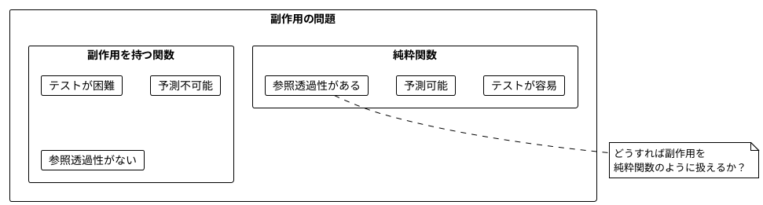
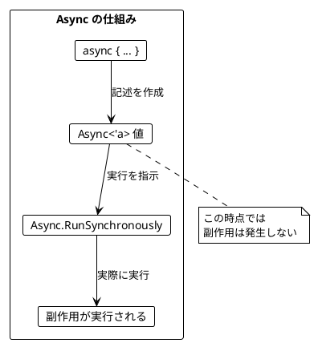
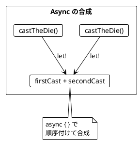
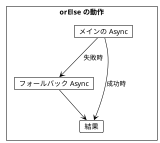
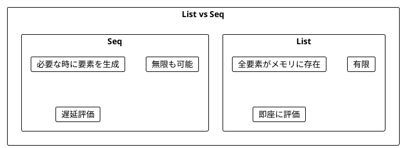
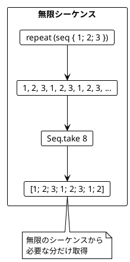
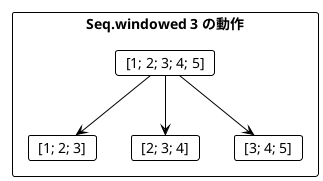
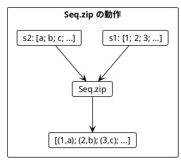
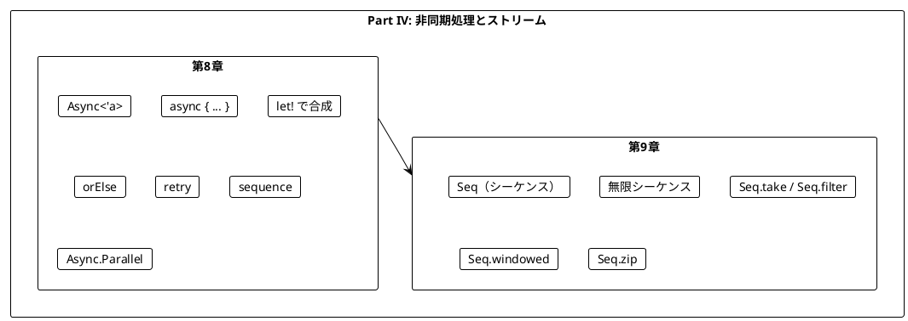

# Part IV: 非同期処理とストリーム

本章では、関数型プログラミングにおける副作用の扱い方を学びます。F# の Async を使って副作用を純粋関数内で安全に記述し、Seq（シーケンス）で無限のデータを扱う方法を習得します。

---

## 第8章: Async による非同期処理

### 8.1 副作用の問題

純粋関数は副作用を持ちません。しかし、実際のプログラムには副作用が必要です:

- ファイルの読み書き
- ネットワーク通信
- データベースアクセス
- 乱数生成
- 現在時刻の取得



### 8.2 F# の Async とは

**Async**（非同期計算）は「副作用を持つ計算の**記述**」を表す型です。

- `Async<'a>` は「実行すると `'a` 型の値を返す副作用のある計算」
- Async 値を作成しただけでは副作用は発生しない
- `Async.RunSynchronously` で実際に実行される



### 8.3 サイコロを振る例

**ソースファイル**: `app/fsharp/src/Ch08/AsyncIO.fs`

#### 不純な関数（副作用あり）

```fsharp
open System

let castTheDieImpure () : int =
    let random = Random()
    random.Next(1, 7)

// 呼び出すたびに異なる値が返る
printfn "%d" (castTheDieImpure ())  // 3
printfn "%d" (castTheDieImpure ())  // 5
printfn "%d" (castTheDieImpure ())  // 1
```

#### Async を使った純粋な記述

```fsharp
let castTheDie () : Async<int> =
    async { return castTheDieImpure () }

// Async 値を作成（この時点では実行されない）
let dieCast: Async<int> = castTheDie ()
printfn "%A" dieCast  // Async<int> - まだ実行されていない

// 実際に実行
printfn "%d" (Async.RunSynchronously dieCast)  // 4
```

### 8.4 Async の作成方法

| 方法 | 用途 | 例 |
|------|------|-----|
| `async { return expr }` | 副作用のある式をラップ | `async { return castTheDieImpure () }` |
| `async { return value }` | 既存の値をラップ（副作用なし） | `async { return 42 }` |
| `async { return () }` | 何もしない Async | `async { return () }` |

```fsharp
// 副作用を遅延実行
let delayedPrint: Async<unit> = async {
    printfn "Hello"
    return ()
}
// println はまだ実行されていない

// 既存の値をラップ
let pureValue: Async<int> = async { return 42 }
// 副作用なし、即座に 42 が確定
```

### 8.5 Async の合成

Async 値は `let!` を使って合成できます。

```fsharp
let castTheDieTwice () : Async<int> =
    async {
        let! firstCast = castTheDie ()
        let! secondCast = castTheDie ()
        return firstCast + secondCast
    }

// まだ実行されていない
let program: Async<int> = castTheDieTwice ()

// 実行
let result: int = Async.RunSynchronously program
```



### 8.6 ミーティングスケジューリングの例

**ソースファイル**: `app/fsharp/src/Ch08/AsyncIO.fs`

より実践的な例として、ミーティングのスケジューリングを見てみましょう。

```fsharp
type MeetingTime = { StartHour: int; EndHour: int }

// 副作用のある API 呼び出しを Async でラップ
let calendarEntries (name: string) : Async<MeetingTime list> =
    async { return calendarEntriesApiCall name }

let createMeeting (names: string list) (meeting: MeetingTime) : Async<unit> =
    async { return createMeetingApiCall names meeting }
```

#### 予定の取得

```fsharp
let scheduledMeetings (person1: string) (person2: string) : Async<MeetingTime list> =
    async {
        let! entries1 = calendarEntries person1
        let! entries2 = calendarEntries person2
        return entries1 @ entries2
    }
```

#### 空き時間の計算（純粋関数）

```fsharp
let possibleMeetings
    (existingMeetings: MeetingTime list)
    (startHour: int)
    (endHour: int)
    (lengthHours: int)
    : MeetingTime list =
    [ startHour .. (endHour - lengthHours) ]
    |> List.map (fun start -> { StartHour = start; EndHour = start + lengthHours })
    |> List.filter (fun slot ->
        existingMeetings |> List.forall (fun meeting -> not (meetingsOverlap meeting slot)))
```

### 8.7 orElse によるエラーハンドリング

失敗時のフォールバックを指定できます。

```fsharp
let orElse (fallback: Async<'a>) (primary: Async<'a>) : Async<'a> =
    async {
        try
            return! primary
        with _ ->
            return! fallback
    }

let year: Async<int> = async { return 996 }
let noYear: Async<int> = async { return failwith "no year" }

year |> orElse (async { return 2020 }) |> Async.RunSynchronously    // 996
noYear |> orElse (async { return 2020 }) |> Async.RunSynchronously  // 2020
```



#### リトライ戦略

```fsharp
// API 呼び出しを3回までリトライ
calendarEntries "Alice"
|> orElse (calendarEntries "Alice")
|> orElse (calendarEntries "Alice")
|> orElse (async { return [] })  // 全部失敗したら空リスト
```

#### 汎用リトライ関数

```fsharp
let retry (maxRetries: int) (action: Async<'a>) : Async<'a> =
    let rec loop remaining =
        async {
            try
                return! action
            with ex ->
                if remaining > 0 then
                    return! loop (remaining - 1)
                else
                    return raise ex
        }
    loop maxRetries

// 使用例
retry 10 (calendarEntries "Alice")
```

### 8.8 sequence による Async のリスト処理

`Async<'a> list` を `Async<'a list>` に変換するには sequence を使います。

```fsharp
let sequence (asyncList: Async<'a> list) : Async<'a list> =
    async {
        let! results =
            asyncList
            |> List.map (fun a -> async {
                let! result = a
                return result
            })
            |> Async.Sequential
        return results |> Array.toList
    }

let actions: Async<int> list = [ async { return 1 }; async { return 2 }; async { return 3 } ]
let combined: Async<int list> = sequence actions

Async.RunSynchronously combined  // [1; 2; 3]
```

#### 複数人の予定を取得

```fsharp
let scheduledMeetingsMultiple (attendees: string list) : Async<MeetingTime list> =
    async {
        let! allMeetings =
            attendees
            |> List.map (fun name -> retry 10 (calendarEntries name))
            |> sequence
        return allMeetings |> List.concat
    }
```

### 8.9 並列実行

F# では `Async.Parallel` で複数の Async を並列実行できます。

```fsharp
let parallelAll (asyncList: Async<'a> list) : Async<'a list> =
    async {
        let! results = Async.Parallel asyncList
        return results |> Array.toList
    }

// 使用例
let tasks = [ calendarEntries "Alice"; calendarEntries "Bob"; calendarEntries "Charlie" ]
let allResults = parallelAll tasks |> Async.RunSynchronously
```

---

## 第9章: ストリーム処理

### 9.1 Seq（シーケンス）とは

**Seq**（シーケンス）は、要素の（潜在的に無限の）シーケンスを表します。



### 9.2 純粋なシーケンス

**ソースファイル**: `app/fsharp/src/Ch09/StreamProcessing.fs`

```fsharp
// 有限シーケンス
let numbers: int seq = seq { 1; 2; 3 }

// List に変換
numbers |> Seq.toList  // [1; 2; 3]

// フィルタリング
let oddNumbers = numbers |> Seq.filter (fun n -> n % 2 <> 0)
oddNumbers |> Seq.toList  // [1; 3]
```

### 9.3 無限シーケンス

```fsharp
// repeat で無限に繰り返し
let repeat (elements: 'a seq) : 'a seq =
    seq {
        while true do
            yield! elements
    }

let infinite123s: int seq = repeat (seq { 1; 2; 3 })

// take で有限個を取得
infinite123s |> Seq.take 8 |> Seq.toList  // [1; 2; 3; 1; 2; 3; 1; 2]
```



### 9.4 サイコロを振るストリーム

```fsharp
let private random = Random()

let private castTheDieImpure () : int =
    random.Next(1, 7)

// サイコロを無限に振るストリーム
let infiniteDieCasts : int seq =
    seq {
        while true do
            yield castTheDieImpure ()
    }

// 最初の3回を取得
infiniteDieCasts |> Seq.take 3 |> Seq.toList  // [4; 2; 6]

// 6 が出るまで振り続ける
let castUntil (target: int) : int seq =
    infiniteDieCasts
    |> Seq.takeWhile (fun n -> n <> target)
    |> Seq.append (Seq.singleton target)
```

### 9.5 シーケンスの主要操作

| 操作 | 説明 | 例 |
|------|------|-----|
| `Seq.take n` | 最初の n 要素を取得 | `seq \|> Seq.take 3` |
| `Seq.filter p` | 条件を満たす要素のみ | `seq \|> Seq.filter (fun x -> x > 0)` |
| `Seq.map f` | 各要素を変換 | `seq \|> Seq.map (fun x -> x * 2)` |
| `Seq.append s1 s2` | 2つのシーケンスを結合 | `Seq.append s1 s2` |
| `Seq.windowed n` | スライディングウィンドウ | `seq \|> Seq.windowed 3` |

### 9.6 通貨交換レートの例

**ソースファイル**: `app/fsharp/src/Ch09/StreamProcessing.fs`

為替レートを監視して、上昇トレンドを検出する例です。

#### トレンド判定（純粋関数）

```fsharp
let trending (rates: decimal list) : bool =
    rates.Length > 1 &&
    rates
    |> List.pairwise
    |> List.forall (fun (prev, curr) -> curr > prev)

trending [0.81m; 0.82m; 0.83m]  // true (上昇トレンド)
trending [0.81m; 0.84m; 0.83m]  // false
```

#### レートのストリーム

```fsharp
type Currency = USD | EUR | GBP | JPY

let rates (from: Currency) (toC: Currency) : decimal seq =
    seq {
        while true do
            yield getExchangeRate from toC
    }
```

### 9.7 スライディングウィンドウ

`Seq.windowed` で連続する要素をグループ化できます。

```fsharp
let stream = seq { 1; 2; 3; 4; 5 }

stream |> Seq.windowed 3 |> Seq.toList
// [[|1; 2; 3|]; [|2; 3; 4|]; [|3; 4; 5|]]
```



#### トレンドを検出して交換

```fsharp
let exchangeIfTrending
    (amount: decimal)
    (from: Currency)
    (toC: Currency)
    (windowSize: int)
    : decimal option =
    rates from toC
    |> Seq.windowed windowSize
    |> Seq.map Array.toList
    |> Seq.tryFind trending
    |> Option.map (fun rateWindow ->
        let lastRate = rateWindow |> List.last
        amount * lastRate)
```

### 9.8 シーケンスの結合

2つのシーケンスを `Seq.zip` で結合できます。

```fsharp
let s1 = seq { 1; 2; 3 }
let s2 = seq { "a"; "b"; "c" }

Seq.zip s1 s2 |> Seq.toList  // [(1, "a"); (2, "b"); (3, "c")]

// 左側の値のみを返す
let zipLeft (stream1: 'a seq) (stream2: 'b seq) : 'a seq =
    Seq.zip stream1 stream2
    |> Seq.map fst
```



### 9.9 実用的なストリーム操作

```fsharp
// 累積和
let runningSum (stream: int seq) : int seq =
    stream |> Seq.scan (+) 0 |> Seq.skip 1

runningSum (seq { 1; 2; 3; 4; 5 }) |> Seq.toList  // [1; 3; 6; 10; 15]

// 移動平均
let movingAverage (windowSize: int) (stream: decimal seq) : decimal seq =
    stream
    |> Seq.windowed windowSize
    |> Seq.map (fun window ->
        window |> Array.sum |> fun s -> s / decimal windowSize)

// 連続する重複を除去
let distinctConsecutive (stream: 'a seq) : 'a seq =
    seq {
        let mutable prev = None
        for item in stream do
            match prev with
            | Some p when p = item -> ()
            | _ ->
                yield item
                prev <- Some item
    }
```

---

## Scala との比較

### IO と Async の比較

| Scala (Cats Effect) | F# | 説明 |
|---------------------|-----|------|
| `IO[A]` | `Async<'a>` | 副作用を記述する型 |
| `IO.delay(expr)` | `async { return expr }` | 副作用をラップ |
| `IO.pure(value)` | `async { return value }` | 純粋な値をラップ |
| `for { a <- io1; b <- io2 } yield ...` | `async { let! a = io1; let! b = io2; return ... }` | 合成 |
| `io.unsafeRunSync()` | `Async.RunSynchronously io` | 同期実行 |
| `io1.orElse(io2)` | `io1 \|> orElse io2` | フォールバック |
| `ios.sequence` | `sequence ios` | リストの変換 |

### Stream と Seq の比較

| Scala (fs2) | F# | 説明 |
|-------------|-----|------|
| `Stream[Pure, A]` | `'a seq` | 純粋なストリーム |
| `Stream.eval(io)` | `async { ... }` + 変換 | IO を含むストリーム |
| `stream.repeat` | `repeat stream` | 無限繰り返し |
| `stream.take(n)` | `Seq.take n stream` | 最初の n 要素 |
| `stream.filter(p)` | `Seq.filter p stream` | フィルタリング |
| `stream.sliding(n)` | `Seq.windowed n stream` | スライディングウィンドウ |

---

## まとめ

### Part IV で学んだこと



### Async と Seq の比較

| 特性 | Async<'a> | 'a seq |
|------|-----------|--------|
| 要素数 | 1つ | 0個以上（無限も可） |
| 実行 | `Async.RunSynchronously` | `Seq.toList` |
| 用途 | 単一の副作用 | 連続した要素の処理 |

### キーポイント

1. **Async**: 副作用を「記述」として扱い、実行を遅延させる
2. **async { return ... }**: 副作用のある式を Async にラップ
3. **let!**: Async を合成（Scala の flatMap 相当）
4. **orElse**: 失敗時のフォールバックを指定
5. **sequence**: `Async<'a> list` → `Async<'a list>`
6. **Seq**: 潜在的に無限のシーケンスを遅延評価で処理
7. **Seq.windowed**: 連続する要素をグループ化してパターンを検出

### 次のステップ

Part V では、以下のトピックを学びます:

- 並行・並列処理
- Agent（MailboxProcessor）による軽量並行処理
- 共有状態の管理

---

## 演習問題

### 問題 1: Async の基本

以下の関数を実装してください。

```fsharp
let printAndReturn (message: string) : Async<string> = ???

// 期待される動作
// printAndReturn "Hello" |> Async.RunSynchronously は
// "Hello" をコンソールに出力し、"Hello" を返す
```

<details>
<summary>解答</summary>

```fsharp
let printAndReturn (message: string) : Async<string> =
    async {
        printfn "%s" message
        return message
    }
```

</details>

### 問題 2: Async の合成

以下の関数を実装してください。2つの Async を順番に実行し、結果を結合します。

```fsharp
let combineAsync (async1: Async<'a>) (async2: Async<'b>) (f: 'a -> 'b -> 'c) : Async<'c> = ???

// 期待される動作
let result = combineAsync (async { return 1 }) (async { return 2 }) (+)
Async.RunSynchronously result  // 3
```

<details>
<summary>解答</summary>

```fsharp
let combineAsync (async1: Async<'a>) (async2: Async<'b>) (f: 'a -> 'b -> 'c) : Async<'c> =
    async {
        let! a = async1
        let! b = async2
        return f a b
    }
```

</details>

### 問題 3: リトライ

以下の関数を実装してください。指定回数リトライし、全部失敗したらデフォルト値を返します。

```fsharp
let retryWithDefault (maxRetries: int) (defaultValue: 'a) (action: Async<'a>) : Async<'a> = ???
```

<details>
<summary>解答</summary>

```fsharp
let retryWithDefault (maxRetries: int) (defaultValue: 'a) (action: Async<'a>) : Async<'a> =
    let rec loop remaining =
        async {
            try
                return! action
            with _ ->
                if remaining > 0 then
                    return! loop (remaining - 1)
                else
                    return defaultValue
        }
    loop maxRetries
```

</details>

### 問題 4: シーケンス操作

以下のシーケンスを作成してください。

```fsharp
// 1. 1から10までの偶数のシーケンス
let evens: int seq = ???

// 2. 無限に交互に true/false を返すシーケンス
let alternating: bool seq = ???

// 3. 最初の5つの要素の合計を計算
let sum: int = seq { 1; 2; 3; 4; 5; 6; 7; 8; 9; 10 } |> Seq.take 5 |> ???
```

<details>
<summary>解答</summary>

```fsharp
// 1. 1から10までの偶数
let evens: int seq = seq { 1 .. 10 } |> Seq.filter (fun n -> n % 2 = 0)
// または
let evens: int seq = seq { 2; 4; 6; 8; 10 }

// 2. 無限に交互に true/false
let alternating: bool seq =
    seq {
        while true do
            yield true
            yield false
    }

// 3. 最初の5つの要素の合計
let sum: int = seq { 1; 2; 3; 4; 5; 6; 7; 8; 9; 10 }
              |> Seq.take 5
              |> Seq.sum  // 15
```

</details>

### 問題 5: トレンド検出

以下の関数を実装してください。直近3つの値が全て同じかどうかを判定します。

```fsharp
let isStable (values: int list) : bool = ???

// 期待される動作
assert (isStable [5; 5; 5] = true)
assert (isStable [5; 5; 6] = false)
assert (isStable [5; 6; 5] = false)
assert (isStable [5] = false)  // 3つ未満は false
```

<details>
<summary>解答</summary>

```fsharp
let isStable (values: int list) : bool =
    values.Length >= 3 &&
    values
    |> List.pairwise
    |> List.forall (fun (prev, curr) -> prev = curr)

// または
let isStable (values: int list) : bool =
    values.Length >= 3 && values |> List.distinct |> List.length = 1
```

</details>
