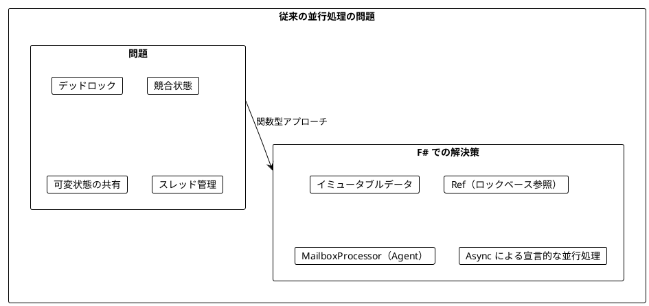
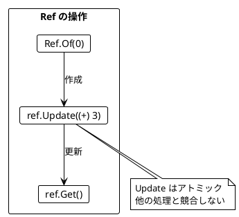
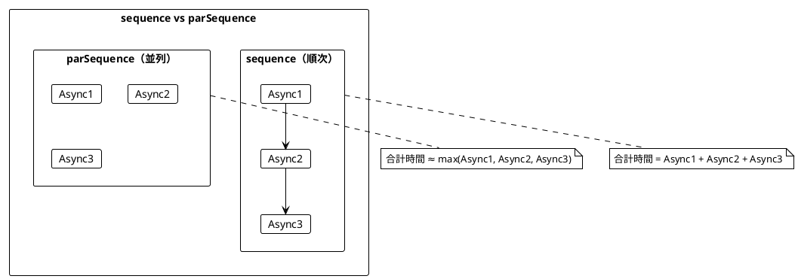
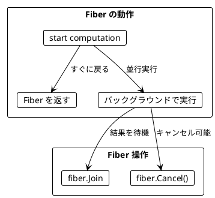
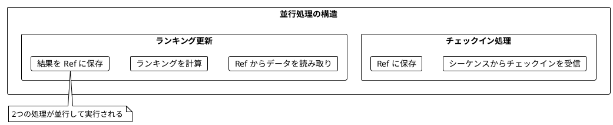
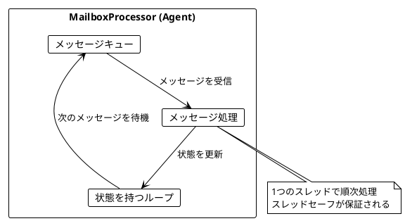
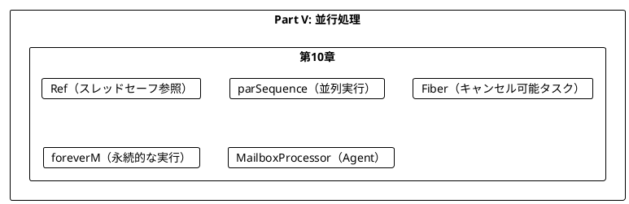
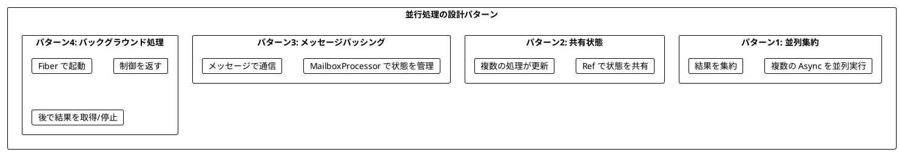

# Part V: 並行処理

本章では、関数型プログラミングにおける並行処理を学びます。Ref によるスレッドセーフな共有状態管理、Async.Parallel による並列実行、そして MailboxProcessor（Agent）による軽量並行処理の構築方法を習得します。

---

## 第10章: 並行・並列処理

### 10.1 並行処理の課題

従来の並行処理には多くの課題があります:

- デッドロック
- 競合状態（Race Condition）
- 共有状態の管理の複雑さ
- スレッドのオーバーヘッド



### 10.2 チェックインのリアルタイム集計

**ソースファイル**: `app/fsharp/src/Ch10/ConcurrentProcessing.fs`

都市へのチェックインをリアルタイムで集計し、ランキングを更新する例を見ていきます。

```fsharp
type City = { Name: string }
type CityStats = { City: City; CheckIns: int }

// チェックインのシーケンス
let checkIns: City seq =
    seq {
        for _ in 1..100000 do
            yield { Name = "Sydney" }
            yield { Name = "Dublin" }
            yield { Name = "Cape Town" }
            yield { Name = "Lima" }
            yield { Name = "Singapore" }
    }
```

#### トップ3都市の計算（純粋関数）

```fsharp
let topCities (n: int) (cityCheckIns: Map<City, int>) : CityStats list =
    cityCheckIns
    |> Map.toList
    |> List.map (fun (city, checkIns) -> { City = city; CheckIns = checkIns })
    |> List.sortByDescending (fun stats -> stats.CheckIns)
    |> List.truncate n
```

### 10.3 Ref - スレッドセーフな共有状態

**Ref** は、複数の並行処理から安全にアクセスできるスレッドセーフな参照です。F# では `lock` を使って実装します。

```fsharp
type Ref<'a> private (initialValue: 'a) =
    let mutable value = initialValue
    let lockObj = obj()

    /// 現在の値を取得
    member _.Get() : 'a =
        lock lockObj (fun () -> value)

    /// 値を設定
    member _.Set(newValue: 'a) : unit =
        lock lockObj (fun () -> value <- newValue)

    /// アトミックに更新
    member _.Update(f: 'a -> 'a) : unit =
        lock lockObj (fun () -> value <- f value)

    /// 初期値で Ref を作成
    static member Of(initialValue: 'a) : Ref<'a> =
        Ref(initialValue)
```



#### Ref の主要メソッド

| メソッド | 説明 | 例 |
|----------|------|-----|
| `Ref.Of(initial)` | 初期値で Ref を作成 | `Ref.Of(0)` |
| `ref.Get()` | 現在の値を取得 | `counter.Get()` |
| `ref.Set(value)` | 値を設定 | `counter.Set(10)` |
| `ref.Update(f)` | アトミックに更新 | `counter.Update((+) 1)` |
| `ref.GetAndUpdate(f)` | 更新して古い値を返す | `counter.GetAndUpdate((+) 1)` |
| `ref.UpdateAndGet(f)` | 更新して新しい値を返す | `counter.UpdateAndGet((+) 1)` |
| `ref.Modify(f)` | 更新して結果を返す | `counter.Modify(fun n -> (n + 1, n * 2))` |

#### 使用例

```fsharp
let example () =
    let counter = Ref.Of(0)
    counter.Update((+) 3)  // アトミックに更新
    counter.Get()           // 3
```

### 10.4 parSequence - 並列実行

F# では `Async.Parallel` を使って複数の Async を並列実行できます。

```fsharp
/// Async のリストを並列実行
let parSequence (asyncList: Async<'a> list) : Async<'a list> =
    async {
        let! results = Async.Parallel asyncList
        return results |> Array.toList
    }

// 使用例
let parallel =
    [ async { return 1 }
      async { return 2 }
      async { return 3 } ]
    |> parSequence

parallel |> Async.RunSynchronously  // [1; 2; 3]
```



#### 複数の Async を並列実行

```fsharp
/// 2つの Async を並列実行
let parTuple2 (async1: Async<'a>) (async2: Async<'b>) : Async<'a * 'b> =
    async {
        let! results = Async.Parallel [
            async { let! a = async1 in return box a }
            async { let! b = async2 in return box b }
        ]
        return (unbox results.[0], unbox results.[1])
    }

/// 3つの Async を並列実行
let parTuple3 (async1: Async<'a>) (async2: Async<'b>) (async3: Async<'c>) : Async<'a * 'b * 'c> =
    async {
        let! results = Async.Parallel [
            async { let! a = async1 in return box a }
            async { let! b = async2 in return box b }
            async { let! c = async3 in return box c }
        ]
        return (unbox results.[0], unbox results.[1], unbox results.[2])
    }
```

### 10.5 サイコロを並行して振る

```fsharp
let private random = Random()

let castTheDie () : Async<int> =
    async { return random.Next(1, 7) }

/// N 個のサイコロを並行して振る
let castDiceConcurrently (n: int) : Async<int list> =
    [ for _ in 1..n -> castTheDie () ]
    |> parSequence

/// N 個のサイコロを並行して振り、合計を返す
let castDiceAndSum (n: int) : Async<int> =
    async {
        let! results = castDiceConcurrently n
        return List.sum results
    }
```

### 10.6 Fiber - キャンセル可能な非同期タスク

**Fiber** は、バックグラウンドで実行されるキャンセル可能な非同期タスクです。

```fsharp
type Fiber<'a> = {
    /// タスクの結果を待機
    Join: Async<'a>
    /// タスクをキャンセル
    Cancel: unit -> unit
}

/// Async を Fiber として起動（バックグラウンドで実行）
let start (computation: Async<'a>) : Fiber<'a> =
    let cts = new CancellationTokenSource()
    let tcs = new TaskCompletionSource<'a>()

    Async.Start(
        async {
            try
                let! result = computation
                tcs.SetResult(result)
            with
            | :? OperationCanceledException ->
                tcs.SetCanceled()
            | ex ->
                tcs.SetException(ex)
        },
        cts.Token)

    {
        Join = Async.AwaitTask tcs.Task
        Cancel = fun () -> cts.Cancel()
    }
```



#### foreverM - 永遠に繰り返す

```fsharp
/// 永遠に繰り返す
let foreverM (action: Async<unit>) : Async<unit> =
    let rec loop () =
        async {
            do! action
            return! loop ()
        }
    loop ()
```

### 10.7 チェックイン処理の並行版

チェックインの保存とランキングの更新を並行して実行します。

#### チェックインの保存

```fsharp
let storeCheckIn (storedCheckIns: Ref<Map<City, int>>) (city: City) : unit =
    storedCheckIns.Update(fun map ->
        match Map.tryFind city map with
        | Some count -> Map.add city (count + 1) map
        | None -> Map.add city 1 map)
```

#### ランキングの継続的な更新

```fsharp
let updateRanking
    (storedCheckIns: Ref<Map<City, int>>)
    (storedRanking: Ref<CityStats list>)
    : Async<unit> =
    async {
        let checkIns = storedCheckIns.Get()
        let ranking = topCities 3 checkIns
        storedRanking.Set(ranking)
    }

/// ランキングを継続的に更新
let updateRankingForever
    (storedCheckIns: Ref<Map<City, int>>)
    (storedRanking: Ref<CityStats list>)
    : Async<unit> =
    foreverM (updateRanking storedCheckIns storedRanking)
```



### 10.8 呼び出し元に制御を返す

バックグラウンドで処理を続けつつ、呼び出し元に制御を返す設計ができます。

```fsharp
type ProcessingCheckIns = {
    /// 現在のランキングを取得
    CurrentRanking: unit -> CityStats list
    /// 処理を停止
    Stop: unit -> unit
}

let startCheckInProcessing (checkIns: City seq) : ProcessingCheckIns =
    let storedCheckIns = Ref.Of(Map.empty<City, int>)
    let storedRanking = Ref.Of([] : CityStats list)
    let cts = new CancellationTokenSource()

    // チェックイン処理を開始
    Async.Start(
        async {
            for city in checkIns do
                storeCheckIn storedCheckIns city
        },
        cts.Token)

    // ランキング更新を開始
    Async.Start(
        async {
            while not cts.Token.IsCancellationRequested do
                do! updateRanking storedCheckIns storedRanking
                do! Async.Sleep 10
        },
        cts.Token)

    {
        CurrentRanking = fun () -> storedRanking.Get()
        Stop = fun () -> cts.Cancel()
    }
```

#### 使用例

```fsharp
let example () =
    let cities = [
        { Name = "Tokyo" }
        { Name = "Sydney" }
        { Name = "Tokyo" }
        { Name = "London" }
        { Name = "Tokyo" }
    ]

    let processing = startCheckInProcessing cities

    // 少し待ってからランキングを取得
    System.Threading.Thread.Sleep(100)
    let ranking = processing.CurrentRanking()
    printfn "%A" ranking

    // 処理を停止
    processing.Stop()
```

### 10.9 MailboxProcessor（Agent）による並行処理

F# では、**MailboxProcessor**（別名 Agent）を使ったメッセージパッシング方式の並行処理が一般的です。



#### カウンターエージェント

```fsharp
type CounterMessage =
    | Increment
    | Decrement
    | GetValue of AsyncReplyChannel<int>
    | Reset

let createCounter (initialValue: int) : MailboxProcessor<CounterMessage> =
    MailboxProcessor.Start(fun inbox ->
        let rec loop count =
            async {
                let! msg = inbox.Receive()
                match msg with
                | Increment ->
                    return! loop (count + 1)
                | Decrement ->
                    return! loop (count - 1)
                | GetValue replyChannel ->
                    replyChannel.Reply(count)
                    return! loop count
                | Reset ->
                    return! loop initialValue
            }
        loop initialValue)
```

#### カウンターの使用

```fsharp
let counter = createCounter 0

// インクリメント（Fire-and-forget）
counter.Post(Increment)
counter.Post(Increment)

// 値を取得（同期）
let value = counter.PostAndReply(GetValue)  // 2

// デクリメント
counter.Post(Decrement)
let newValue = counter.PostAndReply(GetValue)  // 1
```

#### チェックインエージェント

```fsharp
type CheckInMessage =
    | AddCheckIn of City
    | GetStats of AsyncReplyChannel<CityStats list>
    | GetTotal of AsyncReplyChannel<int>

let createCheckInAgent () : MailboxProcessor<CheckInMessage> =
    MailboxProcessor.Start(fun inbox ->
        let rec loop (checkIns: Map<City, int>) =
            async {
                let! msg = inbox.Receive()
                match msg with
                | AddCheckIn city ->
                    let newCheckIns =
                        match Map.tryFind city checkIns with
                        | Some count -> Map.add city (count + 1) checkIns
                        | None -> Map.add city 1 checkIns
                    return! loop newCheckIns
                | GetStats replyChannel ->
                    let stats = topCities 3 checkIns
                    replyChannel.Reply(stats)
                    return! loop checkIns
                | GetTotal replyChannel ->
                    let total = checkIns |> Map.toList |> List.sumBy snd
                    replyChannel.Reply(total)
                    return! loop checkIns
            }
        loop Map.empty)
```

### 10.10 並列処理ユーティリティ

```fsharp
/// リストの各要素に関数を並列適用
let parMap (f: 'a -> 'b) (list: 'a list) : 'b list =
    list
    |> List.map (fun x -> async { return f x })
    |> parSequence
    |> Async.RunSynchronously

/// 条件を満たす要素を並列でフィルタ
let parFilter (predicate: 'a -> bool) (list: 'a list) : 'a list =
    list
    |> List.map (fun x -> async { return (x, predicate x) })
    |> parSequence
    |> Async.RunSynchronously
    |> List.filter snd
    |> List.map fst

/// 並列で集約
let parReduce (combine: 'a -> 'a -> 'a) (list: 'a list) : 'a option =
    match list with
    | [] -> None
    | [x] -> Some x
    | _ ->
        let rec reduceLevel (items: 'a list) =
            match items with
            | [] -> failwith "Unexpected empty list"
            | [x] -> x
            | _ ->
                items
                |> List.chunkBySize 2
                |> List.map (fun chunk ->
                    match chunk with
                    | [a; b] -> async { return combine a b }
                    | [a] -> async { return a }
                    | _ -> failwith "Unexpected chunk size")
                |> parSequence
                |> Async.RunSynchronously
                |> reduceLevel
        Some (reduceLevel list)
```

### 10.11 タイムアウト付き実行

```fsharp
/// タイムアウト付きで Async を実行
let withTimeout (timeoutMs: int) (computation: Async<'a>) : Async<'a option> =
    async {
        let! child = Async.StartChild(computation, timeoutMs)
        try
            let! result = child
            return Some result
        with :? TimeoutException ->
            return None
    }
```

### 10.12 偶数カウント（並行版）

```fsharp
/// 並行して実行し、偶数の数をカウント
let countEvens (asyncInts: Async<int> list) : Async<int> =
    async {
        let counter = Ref.Of(0)
        let tasks =
            asyncInts
            |> List.map (fun asyncInt ->
                async {
                    let! n = asyncInt
                    if n % 2 = 0 then
                        counter.Update((+) 1)
                })
        do! parSequence tasks |> Async.Ignore
        return counter.Get()
    }
```

---

## Scala との比較

### Ref の比較

| Scala (Cats Effect) | F# | 説明 |
|---------------------|-----|------|
| `Ref.of[IO, A](initial)` | `Ref.Of(initial)` | 初期値で Ref を作成 |
| `ref.get` | `ref.Get()` | 現在の値を取得 |
| `ref.set(value)` | `ref.Set(value)` | 値を設定 |
| `ref.update(f)` | `ref.Update(f)` | アトミックに更新 |
| `ref.modify(f)` | `ref.Modify(f)` | 更新して結果を返す |

### 並列実行の比較

| Scala (Cats Effect) | F# | 説明 |
|---------------------|-----|------|
| `ios.parSequence` | `parSequence ios` | 並列実行 |
| `ios.sequence` | `sequence ios` | 順次実行 |
| `(io1, io2).parTupled` | `parTuple2 io1 io2` | 2つを並列実行 |

### Fiber の比較

| Scala (Cats Effect) | F# | 説明 |
|---------------------|-----|------|
| `io.start` | `start computation` | Fiber を起動 |
| `fiber.join` | `fiber.Join` | 結果を待機 |
| `fiber.cancel` | `fiber.Cancel()` | キャンセル |
| `io.foreverM` | `foreverM io` | 永遠に繰り返す |

### Agent（Actor）の比較

| Scala (Akka) | F# | 説明 |
|--------------|-----|------|
| `Actor` | `MailboxProcessor` | メッセージベースの並行処理 |
| `actorRef ! message` | `agent.Post(message)` | メッセージ送信（非同期） |
| `actorRef ? message` | `agent.PostAndReply(f)` | メッセージ送信（同期） |

---

## まとめ

### Part V で学んだこと



### 主要コンポーネント

| コンポーネント | 用途 |
|----------------|------|
| `Ref<'a>` | スレッドセーフな共有状態 |
| `parSequence` | Async のリストを並列実行 |
| `Fiber` | キャンセル可能な非同期タスク |
| `start` | Fiber をバックグラウンドで起動 |
| `foreverM` | 永遠に繰り返し実行 |
| `MailboxProcessor` | メッセージベースの並行処理 |

### キーポイント

1. **Ref**: 複数の並行処理から安全にアクセスできるスレッドセーフな参照
2. **parSequence**: Async のリストを並列実行して結果を集約
3. **Fiber**: バックグラウンドで実行されるキャンセル可能なタスク
4. **MailboxProcessor**: F# ネイティブの Actor モデル実装
5. **Async.Parallel**: 組み込みの並列実行機能

### 設計パターン



---

## 演習問題

### 問題 1: Ref の基本

以下のプログラムを実装してください。カウンターを 0 から始めて、3回インクリメントした結果を返します。

```fsharp
let incrementThreeTimes () : int = ???

// 期待される動作
incrementThreeTimes ()  // 3
```

<details>
<summary>解答</summary>

```fsharp
let incrementThreeTimes () : int =
    let counter = Ref.Of(0)
    counter.Update((+) 1)
    counter.Update((+) 1)
    counter.Update((+) 1)
    counter.Get()
```

</details>

### 問題 2: 並列実行

以下のプログラムを実装してください。3つの Async を並列実行し、結果の合計を返します。

```fsharp
let sumParallel (async1: Async<int>) (async2: Async<int>) (async3: Async<int>) : Async<int> = ???

// 期待される動作
sumParallel (async { return 1 }) (async { return 2 }) (async { return 3 })
|> Async.RunSynchronously  // 6
```

<details>
<summary>解答</summary>

```fsharp
let sumParallel (async1: Async<int>) (async2: Async<int>) (async3: Async<int>) : Async<int> =
    async {
        let! results = [ async1; async2; async3 ] |> parSequence
        return List.sum results
    }
```

</details>

### 問題 3: 並行カウント

以下のプログラムを実装してください。Async のリストを並行実行し、そのうち偶数を返した回数をカウントします。

```fsharp
let countEvensInList (asyncInts: Async<int> list) : Async<int> = ???

// 使用例
let asyncInts = [
    async { return 2 }
    async { return 3 }
    async { return 4 }
    async { return 5 }
    async { return 6 }
]
countEvensInList asyncInts |> Async.RunSynchronously  // 3
```

<details>
<summary>解答</summary>

```fsharp
let countEvensInList (asyncInts: Async<int> list) : Async<int> =
    async {
        let counter = Ref.Of(0)
        let tasks =
            asyncInts
            |> List.map (fun asyncInt ->
                async {
                    let! n = asyncInt
                    if n % 2 = 0 then
                        counter.Update((+) 1)
                })
        do! parSequence tasks |> Async.Ignore
        return counter.Get()
    }
```

</details>

### 問題 4: MailboxProcessor

以下のプログラムを実装してください。メッセージを受け取ってリストに追加し、リストを取得できる Agent を作成します。

```fsharp
type ListMessage<'a> =
    | Add of 'a
    | GetAll of AsyncReplyChannel<'a list>

let createListAgent<'a> () : MailboxProcessor<ListMessage<'a>> = ???

// 期待される動作
let agent = createListAgent<int> ()
agent.Post(Add 1)
agent.Post(Add 2)
agent.Post(Add 3)
agent.PostAndReply(GetAll)  // [1; 2; 3] または [3; 2; 1]
```

<details>
<summary>解答</summary>

```fsharp
type ListMessage<'a> =
    | Add of 'a
    | GetAll of AsyncReplyChannel<'a list>

let createListAgent<'a> () : MailboxProcessor<ListMessage<'a>> =
    MailboxProcessor.Start(fun inbox ->
        let rec loop (items: 'a list) =
            async {
                let! msg = inbox.Receive()
                match msg with
                | Add item ->
                    return! loop (item :: items)
                | GetAll replyChannel ->
                    replyChannel.Reply(List.rev items)
                    return! loop items
            }
        loop [])
```

</details>

### 問題 5: タイムアウト付き収集

以下のプログラムを実装してください。指定時間後に処理を停止し、それまでに蓄積された結果を返します。

```fsharp
let collectFor (durationMs: int) (producer: unit -> int) : int list = ???

// 期待される動作
// 100msごとに乱数を生成して、1秒間収集
// 約10個の要素が返される
collectFor 1000 (fun () -> random.Next(100))
```

<details>
<summary>解答</summary>

```fsharp
let collectFor (durationMs: int) (producer: unit -> int) : int list =
    let collected = Ref.Of([] : int list)
    let cts = new CancellationTokenSource()

    // 100msごとに値を追加するプログラム
    Async.Start(
        async {
            while true do
                do! Async.Sleep 100
                let value = producer ()
                collected.Update(fun list -> value :: list)
        },
        cts.Token)

    // 指定時間待機
    Thread.Sleep(durationMs)

    // キャンセル
    cts.Cancel()

    // 結果を取得（逆順にして返す）
    collected.Get() |> List.rev
```

</details>
