# Part VI: 実践的なアプリケーション構築とテスト

本章では、これまで学んだ関数型プログラミングの概念を統合し、実践的なアプリケーションを構築します。また、関数型プログラミングにおけるテスト戦略についても学びます。

---

## 第11章: 実践的なアプリケーション構築

### 11.1 TravelGuide アプリケーション

旅行ガイドアプリケーションを例に、実践的な FP アプリケーションの構築方法を学びます。

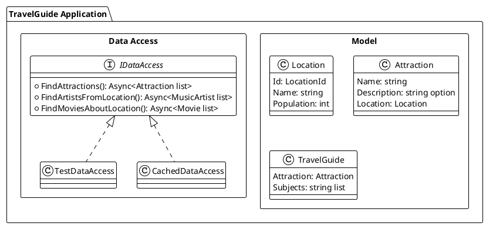

### 11.2 ドメインモデルの定義

**ソースファイル**: `app/fsharp/src/Ch11/TravelGuide.fs`

```fsharp
/// ロケーション ID（値オブジェクト）
type LocationId = LocationId of string

module LocationId =
    let value (LocationId id) = id
    let create id = LocationId id

/// ロケーション
type Location = {
    Id: LocationId
    Name: string
    Population: int
}

/// アトラクション（観光地）
type Attraction = {
    Name: string
    Description: string option
    Location: Location
}

/// ミュージックアーティスト
type MusicArtist = {
    Name: string
    Genre: string option
}

/// 映画
type Movie = {
    Name: string
    BoxOffice: int option
}

/// 旅行ガイド
type TravelGuide = {
    Attraction: Attraction
    Subjects: string list
}
```

### 11.3 データアクセス層の抽象化

外部データソースへのアクセスをインターフェースで抽象化します。

```fsharp
/// データアクセスインターフェース
type IDataAccess =
    abstract member FindAttractions:
        name: string * ordering: AttractionOrdering * limit: int
        -> Async<Attraction list>
    abstract member FindArtistsFromLocation:
        locationId: LocationId * limit: int
        -> Async<MusicArtist list>
    abstract member FindMoviesAboutLocation:
        locationId: LocationId * limit: int
        -> Async<Movie list>
```

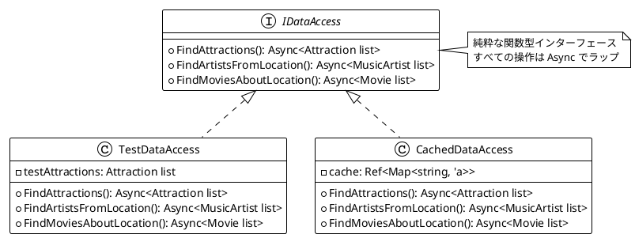

### 11.4 Resource によるリソース管理

F# では `IDisposable` パターンと `use` キーワードでリソースを管理できますが、より関数型的な `Resource` 型を実装することもできます。

```fsharp
/// リソースを安全に管理するための型
type Resource<'a> = {
    Acquire: unit -> Async<'a>
    Release: 'a -> Async<unit>
}

module Resource =
    /// リソースを作成
    let make (acquire: unit -> Async<'a>) (release: 'a -> Async<unit>) : Resource<'a> =
        { Acquire = acquire; Release = release }

    /// リソースを使用して操作を実行
    let useAsync (f: 'a -> Async<'b>) (resource: Resource<'a>) : Async<'b> =
        async {
            let! r = resource.Acquire()
            try
                return! f r
            finally
                resource.Release r |> Async.RunSynchronously
        }
```

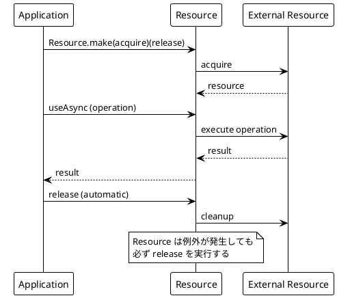

### 11.5 キャッシュの実装

`Ref` を使用したスレッドセーフなキャッシュの実装:

```fsharp
/// キャッシュ付きデータアクセス
let cachedDataAccess (dataAccess: IDataAccess) : Async<IDataAccess> =
    async {
        let attractionCache = Ref.Of(Map.empty<string, Attraction list>)
        let artistCache = Ref.Of(Map.empty<string, MusicArtist list>)
        let movieCache = Ref.Of(Map.empty<string, Movie list>)

        return
            { new IDataAccess with
                member _.FindAttractions(name, ordering, limit) =
                    async {
                        let key = sprintf "%s-%A-%d" name ordering limit
                        let cached = attractionCache.Get() |> Map.tryFind key
                        match cached with
                        | Some attractions -> return attractions
                        | None ->
                            let! attractions = dataAccess.FindAttractions(name, ordering, limit)
                            attractionCache.Update(Map.add key attractions)
                            return attractions
                    }
                // 他のメソッドも同様に実装...
            }
    }
```

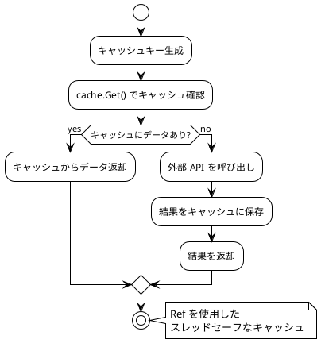

### 11.6 アプリケーションの組み立て

すべてのコンポーネントを組み合わせてアプリケーションを構築します。

```fsharp
/// 旅行ガイドを生成
let travelGuide (data: IDataAccess) (attractionName: string) : Async<TravelGuide option> =
    async {
        let! attractions = data.FindAttractions(attractionName, ByLocationPopulation, 1)
        match attractions with
        | [] -> return None
        | attraction :: _ ->
            let! artists = data.FindArtistsFromLocation(attraction.Location.Id, 2)
            let! movies = data.FindMoviesAboutLocation(attraction.Location.Id, 2)
            let subjects =
                (artists |> List.map (fun a -> a.Name))
                @ (movies |> List.map (fun m -> m.Name))
            return Some {
                Attraction = attraction
                Subjects = subjects
            }
    }
```

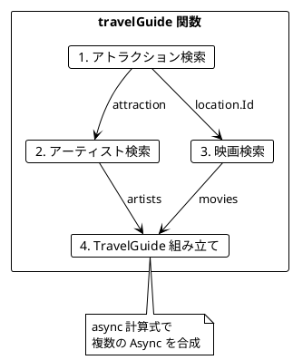

---

## 第12章: テスト戦略

### 12.1 関数型プログラミングのテスト

関数型プログラミングでは、純粋関数のおかげでテストが非常に簡単になります。

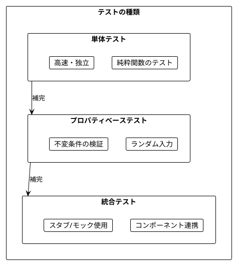

### 12.2 SearchReport の導入

**ソースファイル**: `app/fsharp/src/Ch12/TravelGuideWithReport.fs`

テスト可能性を高めるため、`SearchReport` を導入します。

```fsharp
/// 検索の統計情報とエラー情報
type SearchReport = {
    AttractionsSearched: int
    ArtistsFound: int
    MoviesFound: int
    Errors: string list
}

module SearchReport =
    let empty = {
        AttractionsSearched = 0
        ArtistsFound = 0
        MoviesFound = 0
        Errors = []
    }

    let addError error report =
        { report with Errors = error :: report.Errors }

/// SearchReport 付きの旅行ガイド
type TravelGuideWithReport = {
    Attraction: Attraction
    Subjects: string list
    SearchReport: SearchReport
}
```

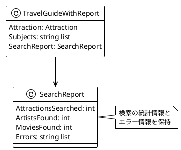

### 12.3 エラーハンドリングの改善

```fsharp
/// Either を使用したデータアクセスインターフェース
type IDataAccessWithErrors =
    abstract member FindAttractions:
        name: string * ordering: AttractionOrdering * limit: int
        -> Async<Attraction list>
    abstract member FindArtistsFromLocation:
        locationId: LocationId * limit: int
        -> Async<Result<MusicArtist list, string>>
    abstract member FindMoviesAboutLocation:
        locationId: LocationId * limit: int
        -> Async<Result<Movie list, string>>
```

Result を使用してエラーを明示的に扱います:

```fsharp
/// エラーハンドリング付き旅行ガイド生成
let travelGuideWithReport (data: IDataAccessWithErrors) (attractionName: string)
    : Async<TravelGuideWithReport option> =
    async {
        let! attractions = data.FindAttractions(attractionName, ByLocationPopulation, 1)
        match attractions with
        | [] -> return None
        | attraction :: _ ->
            let! artistsResult = data.FindArtistsFromLocation(attraction.Location.Id, 2)
            let! moviesResult = data.FindMoviesAboutLocation(attraction.Location.Id, 2)

            let artistError = match artistsResult with Error e -> Some e | Ok _ -> None
            let movieError = match moviesResult with Error e -> Some e | Ok _ -> None
            let errors = [artistError; movieError] |> List.choose id

            let artists = artistsResult |> Result.defaultValue []
            let movies = moviesResult |> Result.defaultValue []

            let subjects =
                (artists |> List.map (fun a -> a.Name))
                @ (movies |> List.map (fun m -> m.Name))

            let report = {
                AttractionsSearched = 1
                ArtistsFound = List.length artists
                MoviesFound = List.length movies
                Errors = errors
            }

            return Some {
                Attraction = attraction
                Subjects = subjects
                SearchReport = report
            }
    }
```

### 12.4 スタブを使用したテスト

**ソースファイル**: `app/fsharp/tests/Ch12/TravelGuideWithReportTests.fs`

```fsharp
/// 成功するテスト用データアクセス
let successfulDataAccess
    (testAttractions: Attraction list)
    (testArtists: MusicArtist list)
    (testMovies: Movie list)
    : IDataAccessWithErrors =
    { new IDataAccessWithErrors with
        member _.FindAttractions(name, _, limit) =
            async {
                return
                    testAttractions
                    |> List.filter (fun a -> a.Name.Contains(name))
                    |> List.truncate limit
            }

        member _.FindArtistsFromLocation(_, limit) =
            async { return Ok (testArtists |> List.truncate limit) }

        member _.FindMoviesAboutLocation(_, limit) =
            async { return Ok (testMovies |> List.truncate limit) }
    }

/// 部分的に失敗するテスト用データアクセス
let partiallyFailingDataAccess
    (testAttractions: Attraction list)
    (artistError: string)
    (movieError: string)
    : IDataAccessWithErrors =
    { new IDataAccessWithErrors with
        member _.FindAttractions(name, _, limit) =
            async {
                return
                    testAttractions
                    |> List.filter (fun a -> a.Name.Contains(name))
                    |> List.truncate limit
            }

        member _.FindArtistsFromLocation(_, _) =
            async { return Error artistError }

        member _.FindMoviesAboutLocation(_, _) =
            async { return Error movieError }
    }
```

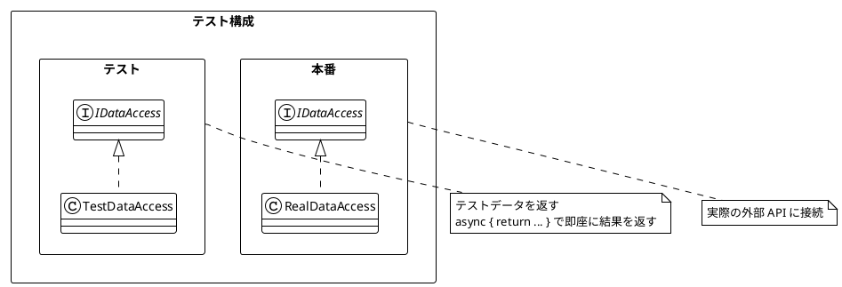

### 12.5 プロパティベーステスト用ジェネレーター

ランダムなテストデータを生成するジェネレーターを実装:

```fsharp
module Generators =
    open System

    let private random = Random()

    /// ランダムな LocationId を生成
    let locationId () =
        LocationId (sprintf "Q%d" (random.Next(1, 10000)))

    /// ランダムな Location を生成
    let location () = {
        Id = locationId ()
        Name = sprintf "City%d" (random.Next(1, 1000))
        Population = random.Next(1000, 10000000)
    }

    /// ランダムな Attraction を生成
    let attraction () = {
        Name = sprintf "Attraction%d" (random.Next(1, 1000))
        Description = if random.Next(2) = 0 then Some "Description" else None
        Location = location ()
    }

    /// ランダムな Attraction リストを生成
    let attractions (count: int) =
        [ for _ in 1..count -> attraction () ]
```

### 12.6 不変条件のテスト

```fsharp
module Invariants =
    /// 結果のサイズは limit 以下
    let resultSizeIsLimited (results: 'a list) (limit: int) : bool =
        List.length results <= limit

    /// SearchReport のエラー数は検索数以下
    let errorsAreBounded (report: SearchReport) : bool =
        List.length report.Errors <= 2 // artists + movies の最大

/// ユーティリティ関数
let filterPopularLocations (locations: Location list) (minPopulation: int) : Location list =
    locations |> List.filter (fun loc -> loc.Population >= minPopulation)
```

### 12.7 プロパティベーステスト（簡易版）

```fsharp
[<Fact>]
let ``filterPopularLocations の結果サイズは入力以下`` () =
    for _ in 1..10 do
        let locations = Generators.attractions 10 |> List.map (fun a -> a.Location)
        let minPop = System.Random().Next(1, 10000000)
        let result = filterPopularLocations locations minPop
        Assert.True(List.length result <= List.length locations)

[<Fact>]
let ``filterPopularLocations の結果はすべて条件を満たす`` () =
    for _ in 1..10 do
        let locations = Generators.attractions 10 |> List.map (fun a -> a.Location)
        let minPop = System.Random().Next(1, 100000)
        let result = filterPopularLocations locations minPop
        Assert.True(result |> List.forall (fun loc -> loc.Population >= minPop))
```

### 12.8 統合テスト

```fsharp
[<Fact>]
let ``完全なフローのテスト - 成功ケース`` () =
    let testLocation = {
        Id = LocationId "Q123"
        Name = "Tokyo"
        Population = 14000000
    }
    let testAttractions = [
        { Name = "Tokyo Tower"; Description = Some "Famous landmark"; Location = testLocation }
    ]
    let testArtists = [
        { Name = "Hikaru Utada"; Genre = Some "Pop" }
        { Name = "Ayumi Hamasaki"; Genre = Some "Pop" }
    ]
    let testMovies = [
        { Name = "Lost in Translation"; BoxOffice = Some 44000000 }
    ]

    let dataAccess = successfulDataAccess testAttractions testArtists testMovies
    let result = travelGuideWithReport dataAccess "Tokyo" |> Async.RunSynchronously

    Assert.True(result.IsSome)
    let guide = result.Value
    Assert.Equal("Tokyo Tower", guide.Attraction.Name)
    Assert.Equal(3, List.length guide.Subjects)
    Assert.Empty(guide.SearchReport.Errors)

[<Fact>]
let ``完全なフローのテスト - 部分的失敗ケース`` () =
    let testLocation = { Id = LocationId "Q123"; Name = "Tokyo"; Population = 14000000 }
    let testAttractions = [
        { Name = "Tokyo Tower"; Description = Some "Famous landmark"; Location = testLocation }
    ]

    let dataAccess = partiallyFailingDataAccess testAttractions "Network error" "Timeout"
    let result = travelGuideWithReport dataAccess "Tokyo" |> Async.RunSynchronously

    Assert.True(result.IsSome)
    let guide = result.Value
    Assert.Equal(2, List.length guide.SearchReport.Errors)
```

### 12.9 テストピラミッド

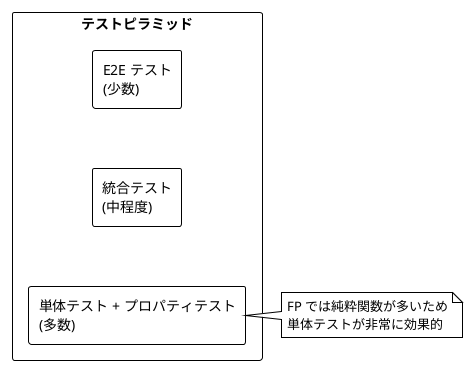

---

## まとめ

### Part VI で学んだこと

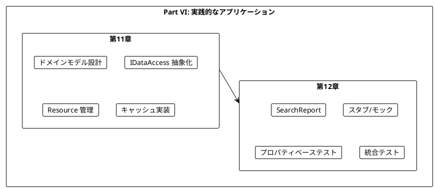

### キーポイント

1. **抽象化の重要性**: IDataAccess インターフェースで外部依存を抽象化
2. **Resource でリソース管理**: 安全なリソースの取得と解放
3. **Ref でキャッシュ**: スレッドセーフな状態管理
4. **Result でエラー処理**: 明示的なエラーハンドリング
5. **SearchReport**: テスト可能性と可観測性の向上
6. **スタブ**: 外部依存を差し替えてテスト
7. **プロパティベーステスト**: ランダム入力で不変条件を検証

### 学習の総括

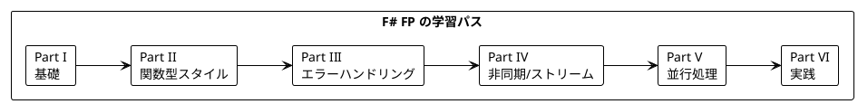

---

## 演習問題

### 問題 1: DataAccess の拡張

以下の要件で `IDataAccess` を拡張してください:
- 新しいメソッド `FindHotelsNearLocation` を追加
- 戻り値は `Async<Result<Hotel list, string>>`

<details>
<summary>解答</summary>

```fsharp
type Hotel = {
    Name: string
    Rating: float
    Location: Location
}

type IDataAccessExtended =
    inherit IDataAccess
    abstract member FindHotelsNearLocation:
        locationId: LocationId * limit: int
        -> Async<Result<Hotel list, string>>

// テスト用スタブ
let testDataAccessExtended
    (testAttractions: Attraction list)
    (testArtists: MusicArtist list)
    (testMovies: Movie list)
    (testHotels: Hotel list)
    : IDataAccessExtended =
    { new IDataAccessExtended with
        member _.FindAttractions(name, _, limit) =
            async { return testAttractions |> List.filter (fun a -> a.Name.Contains(name)) |> List.truncate limit }
        member _.FindArtistsFromLocation(_, limit) =
            async { return testArtists |> List.truncate limit }
        member _.FindMoviesAboutLocation(_, limit) =
            async { return testMovies |> List.truncate limit }
        member _.FindHotelsNearLocation(_, limit) =
            async { return Ok (testHotels |> List.truncate limit) }
    }
```

</details>

### 問題 2: プロパティベーステスト

以下の関数に対するプロパティベーステストを書いてください:

```fsharp
let sortAttractionsByPopulation (attractions: Attraction list) : Attraction list =
    attractions |> List.sortByDescending (fun a -> a.Location.Population)
```

<details>
<summary>解答</summary>

```fsharp
[<Fact>]
let ``sortAttractionsByPopulation は降順になる`` () =
    for _ in 1..10 do
        let attractions = Generators.attractions 5
        let result = sortAttractionsByPopulation attractions
        let populations = result |> List.map (fun a -> a.Location.Population)
        let sorted = populations |> List.sortDescending
        Assert.Equal<int list>(sorted, populations)

[<Fact>]
let ``sortAttractionsByPopulation は要素数を変えない`` () =
    for _ in 1..10 do
        let attractions = Generators.attractions 5
        let result = sortAttractionsByPopulation attractions
        Assert.Equal(List.length attractions, List.length result)

[<Fact>]
let ``sortAttractionsByPopulation は全要素を保持する`` () =
    for _ in 1..10 do
        let attractions = Generators.attractions 3
        let result = sortAttractionsByPopulation attractions
        let inputNames = attractions |> List.map (fun a -> a.Name) |> Set.ofList
        let outputNames = result |> List.map (fun a -> a.Name) |> Set.ofList
        Assert.Equal<Set<string>>(inputNames, outputNames)
```

</details>

### 問題 3: Resource の実装

ファイルを安全に読み取る `Resource` を実装してください。

<details>
<summary>解答</summary>

```fsharp
open System.IO

let fileResource (path: string) : Resource<StreamReader> =
    Resource.make
        (fun () -> async { return new StreamReader(path) })
        (fun reader -> async { reader.Dispose() })

let readAllLines (path: string) : Async<string list> =
    fileResource path
    |> Resource.useAsync (fun reader ->
        async {
            let lines = ResizeArray<string>()
            let mutable line = reader.ReadLine()
            while line <> null do
                lines.Add(line)
                line <- reader.ReadLine()
            return lines |> Seq.toList
        })

// 使用例
let program : Async<unit> =
    async {
        let! lines = readAllLines "data.txt"
        printfn "Read %d lines" (List.length lines)
    }
```

</details>

---

## シリーズ全体の総括

本シリーズでは、「Grokking Functional Programming」の内容に沿って、関数型プログラミングの基礎から実践的なアプリケーション構築までを F# で学びました。

### 学んだ主な概念

| Part | 章 | 主な概念 |
|------|-----|----------|
| I | 1-2 | 純粋関数、参照透過性 |
| II | 3-5 | イミュータブルデータ、高階関数、flatMap |
| III | 6-7 | Option、Result、判別共用体 |
| IV | 8-9 | Async、Seq（ストリーム） |
| V | 10 | 並行処理、Ref、MailboxProcessor |
| VI | 11-12 | 実践アプリケーション、テスト |

### 関数型プログラミングの利点

1. **予測可能性**: 純粋関数は同じ入力に対して常に同じ出力
2. **テスト容易性**: 副作用がないためテストが簡単
3. **合成可能性**: 小さな関数を組み合わせて複雑な処理を構築
4. **並行安全性**: イミュータブルデータは競合状態を防ぐ
5. **型安全性**: Option、Result で null や例外を型で表現

### F# の特徴

F# は .NET プラットフォーム上で動作する関数型優先言語で、以下の特徴があります:

- **型推論**: 明示的な型注釈なしでも型安全
- **パイプライン演算子**: `|>` でデータの流れを直感的に表現
- **パターンマッチング**: 強力なパターンマッチングで分岐処理
- **計算式**: `async { }` などで非同期処理を宣言的に記述
- **相互運用性**: C# や .NET ライブラリとシームレスに連携

### 次のステップ

- F# の高度な機能（型プロバイダー、アクティブパターン）を学ぶ
- Elmish/Bolero などの F# Web フレームワークを探索
- Fable で F# を JavaScript にコンパイル
- 実際のプロジェクトで FP を適用する

