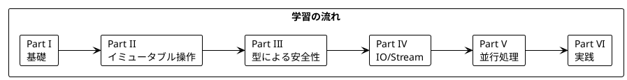

# Grokking Functional Programming - Haskell 版

本シリーズは「Grokking Functional Programming」（Michal Plachta 著）の学習コンパニオンとして、関数型プログラミングの概念を Haskell で解説します。

---

## 対象読者

- 関数型プログラミングの本場である Haskell を学びたい開発者
- 他の言語で FP を学んだが、純粋関数型言語で理解を深めたい方
- 型クラス、モナドなどの概念を Haskell で体験したいエンジニア

---

## 記事一覧

### [Part I: 関数型プログラミングの基礎](part-1.md)

関数型プログラミングの基本概念を Haskell で学びます。

| 章 | トピック |
|----|----------|
| 第1章 | Haskell 入門、基本構文、GHCi |
| 第2章 | 純粋関数、参照透過性、遅延評価 |

**キーワード**: 純粋関数、参照透過性、遅延評価、型推論

---

### [Part II: 関数型スタイルのプログラミング](part-2.md)

イミュータブルなデータ操作と高階関数を学びます。

| 章 | トピック |
|----|----------|
| 第3章 | イミュータブルデータ、リスト操作 |
| 第4章 | 高階関数、map/filter/fold |
| 第5章 | リスト内包表記、concatMap |

**キーワード**: イミュータブル、高階関数、リスト内包表記、fold

---

### [Part III: エラーハンドリングと Maybe/Either](part-3.md)

型安全なエラーハンドリングを学びます。

| 章 | トピック |
|----|----------|
| 第6章 | Maybe 型、Just/Nothing |
| 第7章 | Either 型、代数的データ型、パターンマッチング |

**キーワード**: Maybe、Either、代数的データ型（ADT）、パターンマッチング

---

### [Part IV: IO と副作用の管理](part-4.md)

IO モナドとストリーム処理を学びます。

| 章 | トピック |
|----|----------|
| 第8章 | IO モナド、do 記法 |
| 第9章 | conduit/pipes、無限ストリーム |

**キーワード**: IO モナド、do 記法、遅延評価、ストリーム処理

---

### [Part V: 並行処理](part-5.md)

関数型プログラミングにおける並行処理を学びます。

| 章 | トピック |
|----|----------|
| 第10章 | STM、TVar、async |

**キーワード**: STM、TVar、async、軽量スレッド

---

### [Part VI: 実践的なアプリケーション構築とテスト](part-6.md)

実践的なアプリケーション構築とテスト戦略を学びます。

| 章 | トピック |
|----|----------|
| 第11章 | TravelGuide アプリ、bracket、リソース管理 |
| 第12章 | テスト戦略、QuickCheck |

**キーワード**: bracket、リソース管理、QuickCheck、プロパティベーステスト

---

## 学習パス



---

## Haskell の特徴

Haskell は純粋関数型言語として、以下の特徴を持ちます:

| 特徴 | 説明 |
|------|------|
| **純粋性** | すべての関数がデフォルトで純粋、副作用は IO で明示 |
| **遅延評価** | 必要になるまで式を評価しない（デフォルト） |
| **強力な型システム** | 型クラス、高カインド型、GADT など |
| **型推論** | ほとんどの型注釈を省略可能 |

---

## 使用ライブラリ

| ライブラリ | 用途 | 対応章 |
|------------|------|--------|
| base | 標準ライブラリ | 全章 |
| text | テキスト処理 | 全章 |
| containers | Map、Set など | Part II-VI |
| mtl | モナド変換子 | Part IV-VI |
| async | 非同期処理 | Part V |
| stm | STM | Part V |
| conduit | ストリーム処理 | Part IV |
| QuickCheck | プロパティベーステスト | Part VI |
| hspec | テストフレームワーク | Part VI |

---

## Scala との対応

| Scala | Haskell | 説明 |
|-------|---------|------|
| `Option[A]` | `Maybe a` | 値の有無を表現 |
| `Either[A, B]` | `Either a b` | 成功/失敗を表現 |
| `List[A]` | `[a]` | リスト型 |
| `map` | `fmap` / `<$>` | ファンクターの射 |
| `flatMap` | `>>=` (bind) | モナドの bind |
| `for` 内包表記 | `do` 記法 | モナドの糖衣構文 |
| `IO[A]` | `IO a` | 副作用を表現 |
| `Ref[IO, A]` | `TVar a` | 可変参照（STM） |

---

## リポジトリ構成

```
grokkingfp-examples/
├── app/haskell/src/           # Haskell のサンプルコード
│   ├── Ch01/                  # 第1章
│   ├── Ch02/                  # 第2章
│   └── ...
├── app/haskell/test/          # テストコード
├── app/haskell/package.yaml   # Stack プロジェクト設定
├── docs/article/              # 解説記事
│   └── haskell/               # Haskell 版（本ディレクトリ）
│       ├── index.md           # この記事
│       ├── part-1.md          # Part I
│       ├── part-2.md          # Part II
│       ├── part-3.md          # Part III
│       ├── part-4.md          # Part IV
│       ├── part-5.md          # Part V
│       └── part-6.md          # Part VI
```

---

## 関数型プログラミングの利点

本シリーズを通じて、以下の利点を実感できます:

1. **予測可能性** - 純粋関数は同じ入力に対して常に同じ出力
2. **テスト容易性** - 副作用がないためテストが簡単
3. **合成可能性** - 小さな関数を組み合わせて複雑な処理を構築
4. **並行安全性** - イミュータブルデータは競合状態を防ぐ
5. **型安全性** - Maybe、Either で null や例外を型で表現
6. **遅延評価** - 無限データ構造や効率的なメモリ使用

---

## 開発環境のセットアップ

### GHCup（推奨）

```bash
# GHCup のインストール
curl --proto '=https' --tlsv1.2 -sSf https://get-ghcup.haskell.org | sh

# GHC と Stack のインストール
ghcup install ghc 9.4.8
ghcup install stack latest

# プロジェクトのビルド
cd app/haskell
stack build

# テストの実行
stack test

# REPL の起動
stack ghci
```

---

## 参考資料

- [Grokking Functional Programming](https://www.manning.com/books/grokking-functional-programming) - 原著
- [Haskell 公式サイト](https://www.haskell.org/)
- [Learn You a Haskell for Great Good!](http://learnyouahaskell.com/) - 入門書（無料）
- [Real World Haskell](http://book.realworldhaskell.org/) - 実践的な Haskell
- [Hoogle](https://hoogle.haskell.org/) - Haskell API 検索
- [Hackage](https://hackage.haskell.org/) - パッケージリポジトリ
