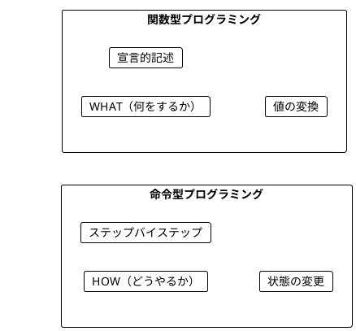
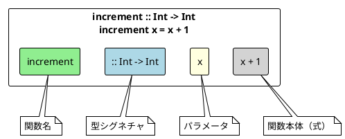
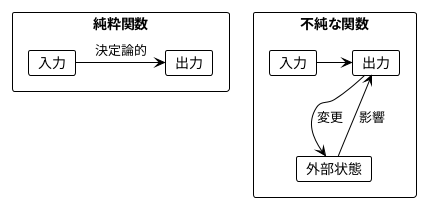
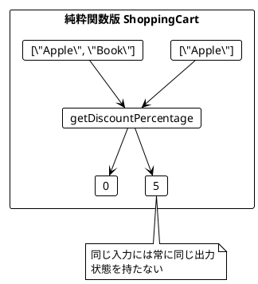
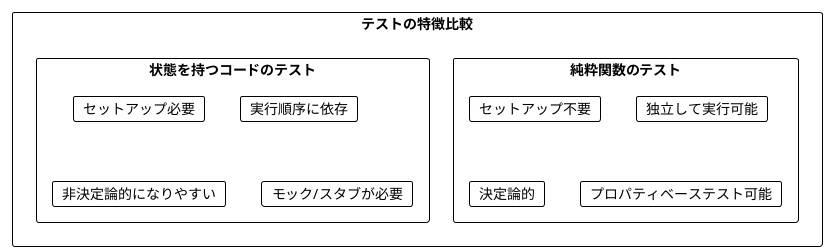
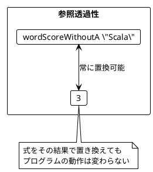
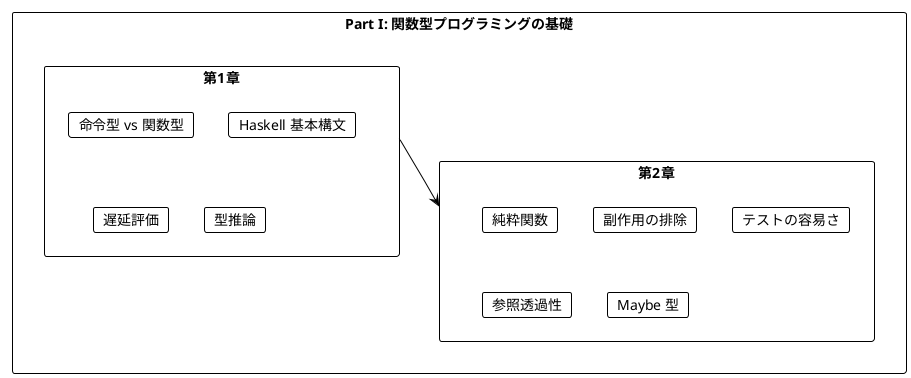

# Part I: 関数型プログラミングの基礎

本章では、関数型プログラミング（FP）の基本概念を Haskell で学びます。Haskell は純粋関数型言語であり、FP の概念を最も直接的に体験できます。

---

## 第1章: Haskell 入門

### 1.1 命令型 vs 関数型

プログラミングには大きく分けて2つのパラダイムがあります。



**命令型プログラミング**は「どうやるか」を記述します。

```java
// Java: 命令型でワードスコアを計算
public static int calculateScore(String word) {
    int score = 0;
    for(char c : word.toCharArray()) {
        score++;
    }
    return score;
}
```

**関数型プログラミング**は「何をするか」を記述します。

```haskell
-- Haskell: 関数型でワードスコアを計算
wordScore :: String -> Int
wordScore word = length word
```

### 1.2 Haskell の基本構文

Haskell での関数定義の基本形を見てみましょう。

**ソースファイル**: `app/haskell/src/Ch01/IntroHaskell.hs`

```haskell
-- 数値をインクリメントする
increment :: Int -> Int
increment x = x + 1

-- 文字列の最初の文字を取得する
getFirstCharacter :: String -> Char
getFirstCharacter s = head s

-- 単語のスコアを計算する（文字数）
wordScore :: String -> Int
wordScore word = length word
```

### 1.3 関数の構造



Haskell の関数定義は2行で構成されます:

1. **型シグネチャ**: `increment :: Int -> Int`（省略可能だが推奨）
2. **定義**: `increment x = x + 1`

### 1.4 Haskell の特徴

| 特徴 | 説明 | 例 |
|------|------|-----|
| **純粋性** | すべての関数がデフォルトで純粋 | 副作用は IO で明示 |
| **遅延評価** | 必要になるまで式を評価しない | 無限リストが可能 |
| **強い型推論** | 型注釈なしでも型を推論 | `add a b = a + b` |
| **カリー化** | 複数引数は自動的にカリー化 | `add 1` は部分適用 |

### 1.5 遅延評価の例

Haskell の特徴的な機能の一つが**遅延評価**です。

```haskell
-- 無限の 1 のリスト
infiniteOnes :: [Int]
infiniteOnes = repeat 1

-- 無限リストから最初の 5 要素を取得
takeFive :: [Int]
takeFive = take 5 infiniteOnes  -- [1,1,1,1,1]
```

遅延評価により、無限データ構造を扱えます。必要な分だけ評価されるため、メモリ効率も良好です。

### 1.6 基本的な関数

```haskell
-- 2つの数を加算する
add :: Int -> Int -> Int
add a b = a + b

-- 2つの数を乗算する
multiply :: Int -> Int -> Int
multiply a b = a * b

-- 数値が正かどうかを判定する
isPositive :: Int -> Bool
isPositive n = n > 0

-- 名前で挨拶する
greet :: String -> String
greet name = "Hello, " ++ name ++ "!"
```

### 1.7 学習ポイント

| 概念 | 命令型 | Haskell |
|------|--------|---------|
| 焦点 | 手順（How） | 結果（What） |
| 状態 | 変更する | 変換する |
| ループ | for/while | map/filter/fold |
| データ | ミュータブル | イミュータブル |
| 副作用 | 暗黙的 | IO で明示的 |

---

## 第2章: 純粋関数とテスト

### 2.1 純粋関数とは

純粋関数（Pure Function）は以下の特徴を持つ関数です:

1. **同じ入力には常に同じ出力を返す**
2. **副作用がない**（外部状態を変更しない）



**Haskell では、デフォルトですべての関数が純粋です。** 副作用は `IO` モナドで明示的に扱います。

### 2.2 純粋関数の例

**ソースファイル**: `app/haskell/src/Ch02/PureFunctions.hs`

```haskell
-- 純粋関数の例
pureIncrement :: Int -> Int
pureIncrement x = x + 1

pureAdd :: Int -> Int -> Int
pureAdd a b = a + b

pureGetFirstChar :: String -> Char
pureGetFirstChar s = head s
```

**純粋ではない関数の例**（Haskell では IO を使って明示）:

```haskell
-- 不純な関数 - IO モナドで副作用を明示
impureRandomPart :: Double -> IO Double
impureRandomPart x = do
    r <- randomIO
    return (x * r)
```

### 2.3 ショッピングカートの例

状態を持つクラスの問題点を純粋関数で解決します。

**ソースファイル**: `app/haskell/src/Ch02/PureFunctions.hs`

#### 問題のあるコード（Java）

```java
class ShoppingCartBad {
    private List<String> items = new ArrayList<>();
    private boolean bookAdded = false;

    public void addItem(String item) {
        items.add(item);
        if(item.equals("Book")) {
            bookAdded = true;
        }
    }

    public int getDiscountPercentage() {
        if(bookAdded) {
            return 5;
        } else {
            return 0;
        }
    }
}
```

#### 純粋関数による解決（Haskell）

```haskell
-- カート内のアイテムから割引率を計算する
getDiscountPercentage :: [String] -> Int
getDiscountPercentage items
    | "Book" `elem` items = 5
    | otherwise           = 0

-- 割引額を計算する
calculateDiscount :: Double -> [String] -> Double
calculateDiscount price items =
    price * fromIntegral (getDiscountPercentage items) / 100
```



### 2.4 チップ計算の例

```haskell
-- グループサイズからチップ率を計算する
getTipPercentage :: [String] -> Int
getTipPercentage names
    | length names > 5  = 20  -- 6人以上 → 20%
    | length names > 0  = 10  -- 1-5人 → 10%
    | otherwise         = 0   -- 0人 → 0%

-- チップ額を計算する
calculateTip :: Double -> [String] -> Double
calculateTip bill names =
    bill * fromIntegral (getTipPercentage names) / 100
```

### 2.5 純粋関数のテスト

純粋関数は非常にテストしやすいです。Haskell では HSpec と QuickCheck を使用します。

**ソースファイル**: `app/haskell/test/Ch02/PureFunctionsSpec.hs`

```haskell
-- 単体テスト
describe "pureIncrement" $ do
    it "increments 5 to 6" $ do
        pureIncrement 5 `shouldBe` 6

    it "same input always gives same output" $ do
        pureIncrement 10 `shouldBe` pureIncrement 10

-- プロパティベーステスト
    it "property: pureIncrement x == x + 1" $ property $
        \x -> pureIncrement x == x + 1
```



### 2.6 文字 'a' を除外するワードスコア

より複雑な例を見てみましょう。

```haskell
-- 'a' を除いた文字数をスコアとして計算
wordScoreWithoutA :: String -> Int
wordScoreWithoutA word = length $ filter (/= 'a') word

-- テスト
-- wordScoreWithoutA "Scala"   == 3  -- "Scl" → 3文字
-- wordScoreWithoutA "Haskell" == 7  -- 'a' なし → 7文字
-- wordScoreWithoutA "aaa"     == 0  -- すべて 'a' → 0文字
```

### 2.7 参照透過性

純粋関数は**参照透過性（Referential Transparency）**を持ちます。

> 式をその評価結果で置き換えても、プログラムの意味が変わらないこと

```haskell
-- 参照透過性の例
referentialTransparencyExample :: Bool
referentialTransparencyExample =
    let score1 = wordScoreWithoutA "Scala"  -- 常に 3
        score2 = wordScoreWithoutA "Scala"  -- 常に 3
        -- score1 と score2 は常に同じ値
        total1 = wordScoreWithoutA "Scala" + wordScoreWithoutA "Java"
        total2 = 3 + 4  -- 置き換え可能
    in score1 == score2 && total1 == total2  -- True
```



### 2.8 Maybe 型による安全な操作

Haskell では `null` の代わりに `Maybe` 型を使用します。

```haskell
-- 安全な先頭要素取得
safeHead :: [a] -> Maybe a
safeHead []    = Nothing
safeHead (x:_) = Just x

-- 安全な末尾取得
safeTail :: [a] -> Maybe [a]
safeTail []     = Nothing
safeTail (_:xs) = Just xs

-- 使用例
-- safeHead [1,2,3] == Just 1
-- safeHead []      == Nothing
```

---

## まとめ

### Part I で学んだこと



### キーポイント

1. **関数型プログラミング**は「何をするか」を宣言的に記述する
2. **Haskell ではすべての関数がデフォルトで純粋**（副作用は IO で明示）
3. **遅延評価**により無限データ構造が扱える
4. **純粋関数**はテストが非常に簡単
5. **参照透過性**により、コードの理解と推論が容易
6. **Maybe 型**で null 安全性を型レベルで保証

### Scala との対応

| Scala | Haskell | 説明 |
|-------|---------|------|
| `def f(x: Int): Int` | `f :: Int -> Int` | 型シグネチャ |
| `Option[A]` | `Maybe a` | 値の有無を表現 |
| `None` | `Nothing` | 値がない |
| `Some(x)` | `Just x` | 値がある |
| `List[A]` | `[a]` | リスト型 |
| `x.length` | `length x` | 関数適用（前置記法） |

### 次のステップ

Part II では、以下のトピックを学びます:

- イミュータブルなデータ操作
- 高階関数（map、filter、fold）
- リスト内包表記
- concatMap と flatMap

---

## 演習問題

### 問題 1: 純粋関数の識別

以下の関数のうち、純粋関数はどれですか?

```haskell
-- A
double :: Int -> Int
double x = x * 2

-- B
incrementCounter :: IORef Int -> IO Int
incrementCounter ref = do
    modifyIORef ref (+1)
    readIORef ref

-- C
greet :: String -> String
greet name = "Hello, " ++ name ++ "!"

-- D
currentTime :: IO UTCTime
currentTime = getCurrentTime
```

<details>
<summary>解答</summary>

**A と C は純粋関数**です。

- A: 同じ入力に対して常に同じ出力を返し、副作用がない
- B: IORef を変更する副作用がある（IO モナドで明示）
- C: 同じ入力に対して常に同じ出力を返し、副作用がない
- D: 呼び出すたびに異なる値を返す（IO モナドで明示）

</details>

### 問題 2: 純粋関数への書き換え

以下の不純な Java コードを Haskell の純粋関数に書き換えてください。

```java
class Counter {
    private int value = 0;

    public int increment() {
        value++;
        return value;
    }
}
```

<details>
<summary>解答</summary>

```haskell
-- 状態を引数として受け取り、新しい状態を返す
increment :: Int -> Int
increment value = value + 1

-- 使用例
-- let v1 = 0
--     v2 = increment v1  -- 1
--     v3 = increment v2  -- 2
```

状態を外部に持ち、関数は値を受け取って新しい値を返すだけにします。

</details>

### 問題 3: テストを書く

以下の関数に対するテストケースを考えてください。

```haskell
isEven :: Int -> Bool
isEven n = n `mod` 2 == 0
```

<details>
<summary>解答</summary>

```haskell
describe "isEven" $ do
    -- 基本ケース
    it "returns True for 0" $ isEven 0 `shouldBe` True
    it "returns True for 2" $ isEven 2 `shouldBe` True
    it "returns True for 4" $ isEven 4 `shouldBe` True

    -- 奇数
    it "returns False for 1" $ isEven 1 `shouldBe` False
    it "returns False for 3" $ isEven 3 `shouldBe` False

    -- 負の数
    it "returns True for -2" $ isEven (-2) `shouldBe` True
    it "returns False for -3" $ isEven (-3) `shouldBe` False

    -- プロパティベーステスト
    it "n and n+2 have same parity" $ property $
        \n -> isEven n == isEven (n + 2)
```

</details>
