# Part II: 関数型スタイルのプログラミング

本章では、関数型プログラミングの核心となるテクニックを Haskell で学びます。イミュータブルなデータ操作、高階関数、そして `concatMap`（flatMap）による複雑なデータ変換を習得します。

---

## 第3章: イミュータブルなデータ操作

### 3.1 イミュータブルとは

イミュータブル（不変）とは、一度作成されたデータが変更されないことを意味します。データを「変更」する代わりに、新しいデータを「作成」します。

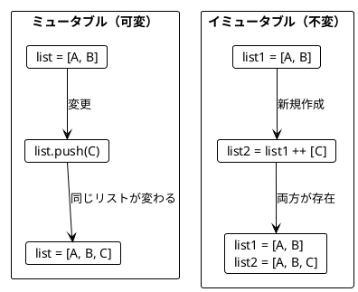

**Haskell ではすべてのデータがデフォルトでイミュータブルです。**

### 3.2 List の基本操作

**ソースファイル**: `app/haskell/src/Ch03/ImmutableValues.hs`

#### 要素の追加

```haskell
-- 要素を末尾に追加（新しいリストを返す）
appended :: [a] -> a -> [a]
appended xs x = xs ++ [x]

-- 使用例
let appleBook      = ["Apple", "Book"]
let appleBookMango = appended appleBook "Mango"

-- appleBook は ["Apple", "Book"] のまま（変わらない）
-- appleBookMango は ["Apple", "Book", "Mango"]
```

#### slice - リストの切り出し

```haskell
-- リストの一部を切り出す（start <= index < end）
slice :: Int -> Int -> [a] -> [a]
slice start end xs = take (end - start) $ drop start xs

-- 最初の2要素を取得
firstTwo :: [a] -> [a]
firstTwo = take 2

-- 最後の2要素を取得
lastTwo :: [a] -> [a]
lastTwo xs = drop (length xs - 2) xs

-- 使用例
firstTwo ["a", "b", "c"]  -- ["a", "b"]
lastTwo ["a", "b", "c"]   -- ["b", "c"]
slice 1 3 ["a","b","c","d"]  -- ["b", "c"]
```

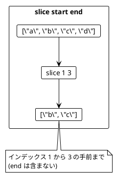

### 3.3 リストの変換例

```haskell
-- 最初の2要素を末尾に移動
movedFirstTwoToTheEnd :: [a] -> [a]
movedFirstTwoToTheEnd xs =
    let first = take 2 xs
        rest  = drop 2 xs
    in rest ++ first

-- 使用例
movedFirstTwoToTheEnd ["a","b","c"]  -- ["c","a","b"]

-- 中央に要素を挿入
insertAtMiddle :: [a] -> a -> [a]
insertAtMiddle xs element =
    let middle = length xs `div` 2
        before = take middle xs
        after  = drop middle xs
    in before ++ [element] ++ after

-- 使用例
insertAtMiddle ["a","b","c","d"] "X"  -- ["a","b","X","c","d"]
```

### 3.4 旅程の再計画

旅行の計画変更をイミュータブルに行う例です。

```haskell
-- 旅程を再計画する（指定都市の前に新都市を挿入）
replan :: [String] -> String -> String -> [String]
replan plan newCity beforeCity =
    let beforeCityIndex = findIndex beforeCity plan
        citiesBefore    = take beforeCityIndex plan
        citiesAfter     = drop beforeCityIndex plan
    in citiesBefore ++ [newCity] ++ citiesAfter

-- 使用例
let planA = ["Paris", "Berlin", "Krakow"]
let planB = replan planA "Vienna" "Krakow"

-- planA は ["Paris", "Berlin", "Krakow"] のまま！
-- planB は ["Paris", "Berlin", "Vienna", "Krakow"]
```

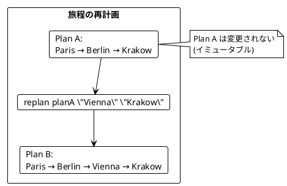

### 3.5 名前の省略

```haskell
-- 名前を省略形にする
abbreviate :: String -> String
abbreviate name =
    let initial   = take 1 name
        separator = findSpaceIndex name
        lastName  = drop (separator + 1) name
    in initial ++ ". " ++ lastName

-- 使用例
abbreviate "Alonzo Church"  -- "A. Church"
abbreviate "Haskell Curry"  -- "H. Curry"
```

---

## 第4章: 関数を値として扱う

### 4.1 高階関数とは

高階関数（Higher-Order Function）とは、以下のいずれかを満たす関数です:

1. 関数を引数として受け取る
2. 関数を戻り値として返す

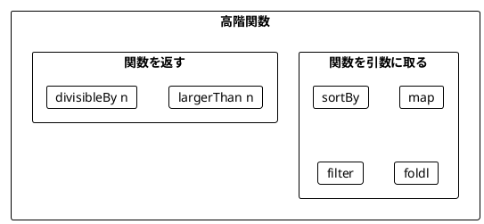

### 4.2 map - 各要素を変換

**ソースファイル**: `app/haskell/src/Ch04/FunctionsAsValues.hs`

```haskell
-- map の実装
myMap :: (a -> b) -> [a] -> [b]
myMap _ []     = []
myMap f (x:xs) = f x : myMap f xs

-- 使用例
map (+1) [1, 2, 3]        -- [2, 3, 4]
map length ["scala", "rust", "ada"]  -- [5, 4, 3]
map (*2) [5, 1, 2, 4, 0]  -- [10, 2, 4, 8, 0]
```

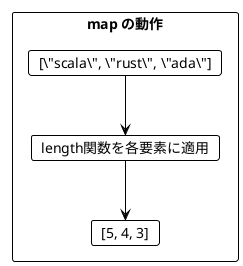

### 4.3 filter - 条件に合う要素を抽出

```haskell
-- filter の実装
myFilter :: (a -> Bool) -> [a] -> [a]
myFilter _ []     = []
myFilter p (x:xs)
    | p x       = x : myFilter p xs
    | otherwise = myFilter p xs

-- 使用例
filter odd [5, 1, 2, 4, 0]   -- [5, 1]
filter (> 4) [5, 1, 2, 4, 0] -- [5]
filter even [1, 2, 3, 4, 5, 6] -- [2, 4, 6]
```

### 4.4 foldl - 畳み込み

```haskell
-- foldl の実装
myFoldl :: (b -> a -> b) -> b -> [a] -> b
myFoldl _ acc []     = acc
myFoldl f acc (x:xs) = myFoldl f (f acc x) xs

-- 使用例
foldl (+) 0 [5, 1, 2, 4, 100]  -- 112
foldl max minBound [5, 1, 2, 4, 15]  -- 15
foldl (*) 1 [1, 2, 3, 4, 5]  -- 120 (階乗)
```

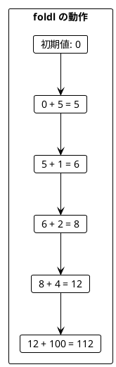

### 4.5 ワードスコアリングの例

複数のスコアリングロジックを組み合わせる例です。

```haskell
-- 'a' を除いた文字数をスコアとして計算
score :: String -> Int
score word = length $ filter (/= 'a') word

-- 'c' を含む場合のボーナス
bonus :: String -> Int
bonus word = if 'c' `elem` word then 5 else 0

-- 's' を含む場合のペナルティ
penalty :: String -> Int
penalty word = if 's' `elem` word then 7 else 0

-- スコア関数を使って単語をランキング
rankedWords :: (String -> Int) -> [String] -> [String]
rankedWords wordScore words =
    reverse $ sortBy (comparing wordScore) words

-- 使用例
let words = ["ada", "haskell", "scala", "java", "rust"]

-- 基本スコアでランキング
rankedWords score words
-- ["haskell", "rust", "scala", "java", "ada"]

-- ボーナス付きスコアでランキング
rankedWords (\w -> score w + bonus w) words
-- ["scala", "haskell", "rust", "java", "ada"]

-- ボーナスとペナルティ付きスコアでランキング
rankedWords (\w -> score w + bonus w - penalty w) words
-- ["java", "scala", "ada", "haskell", "rust"]
```

### 4.6 関数を返す関数

```haskell
-- n より大きいかを判定する関数を返す
largerThan :: Int -> (Int -> Bool)
largerThan n = \i -> i > n

-- 使用例
filter (largerThan 4) [5, 1, 2, 4, 0]  -- [5]
filter (largerThan 1) [5, 1, 2, 4, 0]  -- [5, 2, 4]

-- n で割り切れるかを判定する関数を返す
divisibleBy :: Int -> (Int -> Bool)
divisibleBy n = \i -> i `mod` n == 0

-- 使用例
filter (divisibleBy 3) [1, 2, 3, 6, 9, 10]  -- [3, 6, 9]
```

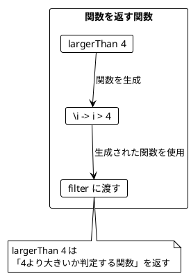

### 4.7 カリー化

Haskell では、**すべての関数がデフォルトでカリー化されています。**

```haskell
-- Haskell の関数は自動的にカリー化される
addCurried :: Int -> Int -> Int
addCurried a b = a + b

-- 部分適用
let add5 = addCurried 5
add5 3   -- 8
add5 10  -- 15

-- 3引数の関数も同様
multiply3 :: Int -> Int -> Int -> Int
multiply3 a b c = a * b * c

let double = multiply3 2 1
double 5  -- 10
double 7  -- 14
```

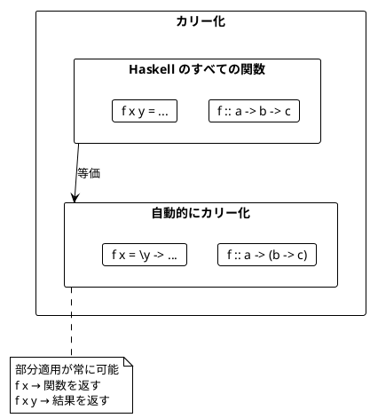

### 4.8 レコード型とパターン

```haskell
-- プログラミング言語を表すデータ型
data ProgrammingLanguage = ProgrammingLanguage
    { plName :: String
    , plYear :: Int
    } deriving (Show, Eq)

let java    = ProgrammingLanguage "Java" 1995
let scala   = ProgrammingLanguage "Scala" 2004
let haskell = ProgrammingLanguage "Haskell" 1990
let langs = [java, scala, haskell]

-- フィールドにアクセス
map plName langs  -- ["Java", "Scala", "Haskell"]

-- 条件でフィルタ
filter (\lang -> plYear lang > 2000) langs
-- [ProgrammingLanguage "Scala" 2004]

-- 年でソート
sortBy (comparing plYear) langs
-- [Haskell, Java, Scala]
```

---

## 第5章: concatMap とネスト構造

### 5.1 concat と concatMap

**ソースファイル**: `app/haskell/src/Ch05/SequentialPrograms.hs`

#### concat - ネストしたリストを平坦化

```haskell
-- concat の動作
concat [[1, 2], [3], [4, 5, 6]]  -- [1, 2, 3, 4, 5, 6]
concat [["A", "B"], ["C"]]       -- ["A", "B", "C"]
```

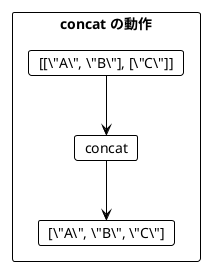

#### concatMap = map + concat（= flatMap）

```haskell
-- concatMap の動作
-- Scala の flatMap に相当
concatMap (\x -> [x, x + 10]) [1, 2, 3]
-- [1, 11, 2, 12, 3, 13]

-- 本の著者をすべて取得
data Book = Book { bookTitle :: String, bookAuthors :: [String] }

let books = [ Book "FP in Scala" ["Chiusano", "Bjarnason"]
            , Book "The Hobbit" ["Tolkien"]
            ]

-- map だけだとネストする
map bookAuthors books
-- [["Chiusano", "Bjarnason"], ["Tolkien"]]

-- concatMap で平坦化
concatMap bookAuthors books
-- ["Chiusano", "Bjarnason", "Tolkien"]
```

### 5.2 concatMap によるリストサイズの変化

```haskell
-- 要素数が増える
concatMap (\i -> [i, i + 10]) [1, 2, 3]
-- [1, 11, 2, 12, 3, 13] - 6要素

-- 要素数が同じ
concatMap (\i -> [i * 2]) [1, 2, 3]
-- [2, 4, 6] - 3要素

-- 要素数が減る（フィルタリング効果）
concatMap (\i -> if even i then [i] else []) [1, 2, 3]
-- [2] - 1要素
```

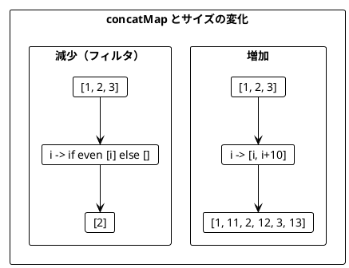

### 5.3 do 記法

ネストした concatMap は do 記法で読みやすく書けます。

```haskell
-- 本の映画化推奨を生成
getRecommendations :: [Book] -> [String]
getRecommendations books = do
    book   <- books
    author <- bookAuthors book
    movie  <- bookAdaptations author
    return $ "You may like " ++ movieTitle movie ++
             ", because you liked " ++ author ++ "'s " ++ bookTitle book

-- concatMap 版（等価）
getRecommendations' :: [Book] -> [String]
getRecommendations' books =
    concatMap (\book ->
        concatMap (\author ->
            map (\movie ->
                "You may like " ++ movieTitle movie ++
                ", because you liked " ++ author ++ "'s " ++ bookTitle book
            ) (bookAdaptations author)
        ) (bookAuthors book)
    ) books
```

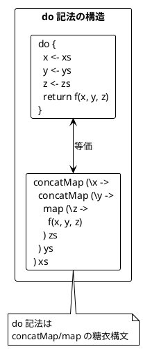

### 5.4 円内の点の判定

do 記法でフィルタリングも行う例です。

```haskell
data Point = Point { pointX :: Int, pointY :: Int }

-- 点が指定半径の円内にあるか判定
isInside :: Point -> Int -> Bool
isInside point radius =
    radius * radius >= pointX point * pointX point + pointY point * pointY point

-- 全組み合わせを生成
let points   = [Point 1 1, Point 5 2]
let radiuses = [2, 1]

allCombinations :: [Point] -> [Int] -> [(String, Int, Bool)]
allCombinations points radiuses = do
    r     <- radiuses
    point <- points
    let desc = "Point " ++ show (pointX point) ++ " " ++ show (pointY point)
    return (desc, r, isInside point r)

-- 結果:
-- [("Point 1 1", 2, True), ("Point 5 2", 2, False),
--  ("Point 1 1", 1, False), ("Point 5 2", 1, False)]
```

#### ガード式によるフィルタリング

```haskell
-- 円内にある点のみを返す
pointsInsideRadius :: [Point] -> Int -> [Point]
pointsInsideRadius points radius = do
    point <- points
    if isInside point radius
        then return point
        else []

-- 使用例
pointsInsideRadius [Point 1 1, Point 5 2] 2
-- [Point 1 1]
```

### 5.5 リスト内包表記

Haskell には do 記法の代わりにリスト内包表記も使えます。

```haskell
-- do 記法
combinations :: [a] -> [b] -> [(a, b)]
combinations xs ys = do
    x <- xs
    y <- ys
    return (x, y)

-- リスト内包表記（等価）
combinations' :: [a] -> [b] -> [(a, b)]
combinations' xs ys = [(x, y) | x <- xs, y <- ys]

-- ガード付きリスト内包表記
evenPairs :: [Int] -> [Int] -> [(Int, Int)]
evenPairs xs ys = [(x, y) | x <- xs, y <- ys, even (x + y)]
```

### 5.6 デカルト積

```haskell
-- 3つのリストのデカルト積
cartesianProduct :: [Int] -> [Int] -> [Int] -> [Int]
cartesianProduct xs ys zs = do
    x <- xs
    y <- ys
    z <- zs
    return (x + y + z)

-- 使用例
cartesianProduct [1, 2] [10, 20] [100, 200]
-- [111, 211, 121, 221, 112, 212, 122, 222]

-- リスト内包表記版
cartesianProduct' xs ys zs = [x + y + z | x <- xs, y <- ys, z <- zs]
```

---

## まとめ

### Part II で学んだこと

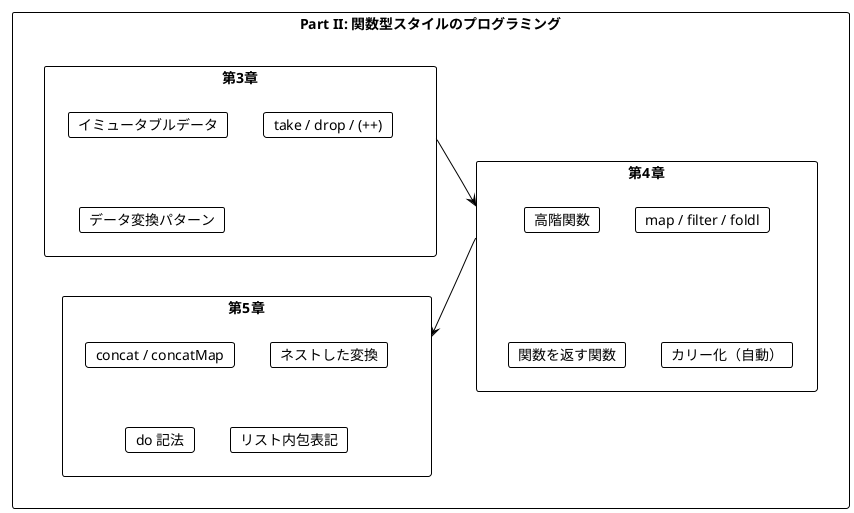

### キーポイント

| 章 | 主要概念 | キー操作 |
|----|----------|----------|
| 第3章 | イミュータブル | `take`, `drop`, `(++)`, `slice` |
| 第4章 | 高階関数 | `map`, `filter`, `foldl`, `sortBy` |
| 第5章 | 平坦化 | `concat`, `concatMap`, `do` 記法 |

### Scala との対応

| Scala | Haskell | 説明 |
|-------|---------|------|
| `list.appended(x)` | `list ++ [x]` | 要素追加 |
| `list.slice(s, e)` | `take (e-s) $ drop s list` | スライス |
| `list.map(f)` | `map f list` | 変換 |
| `list.filter(p)` | `filter p list` | フィルタ |
| `list.foldLeft(z)(f)` | `foldl f z list` | 畳み込み |
| `list.flatten` | `concat list` | 平坦化 |
| `list.flatMap(f)` | `concatMap f list` | 変換+平坦化 |
| `for { ... } yield` | `do { ... }` または `[ | ]` | 内包表記 |

### 重要な法則

1. **イミュータブルデータ**: Haskell ではすべてデフォルトでイミュータブル
2. **関数は値**: 関数を引数として渡したり、戻り値として返したりできる
3. **自動カリー化**: Haskell のすべての関数は自動的にカリー化される
4. **concatMap パターン**: ネストした構造を平坦化しながら変換する
5. **do 記法**: concatMap/map の糖衣構文として使える

### 次のステップ

Part III では、以下のトピックを学びます:

- `Maybe` 型による安全なエラーハンドリング
- `Either` 型と複合的なエラー処理

---

## 演習問題

### 問題 1: イミュータブルな操作

以下の関数を実装してください。リストの中央に要素を挿入する関数です。

```haskell
insertAtMiddle :: [a] -> a -> [a]
insertAtMiddle = ???

-- 期待される動作
insertAtMiddle ["a","b","c","d"] "X" == ["a","b","X","c","d"]
insertAtMiddle ["a","b"] "X" == ["a","X","b"]
```

<details>
<summary>解答</summary>

```haskell
insertAtMiddle :: [a] -> a -> [a]
insertAtMiddle xs element =
    let middle = length xs `div` 2
        before = take middle xs
        after  = drop middle xs
    in before ++ [element] ++ after
```

</details>

### 問題 2: 高階関数

以下の関数を実装してください。条件を満たす要素の数をカウントする関数です。

```haskell
countWhere :: (a -> Bool) -> [a] -> Int
countWhere = ???

-- 期待される動作
countWhere (> 3) [1, 2, 3, 4, 5] == 2
countWhere (\s -> length s > 1) ["a", "bb", "ccc"] == 2
```

<details>
<summary>解答</summary>

```haskell
countWhere :: (a -> Bool) -> [a] -> Int
countWhere p xs = length $ filter p xs

-- または foldl を使って
countWhere' :: (a -> Bool) -> [a] -> Int
countWhere' p = foldl (\count elem -> if p elem then count + 1 else count) 0
```

</details>

### 問題 3: do 記法

以下のネストした concatMap を do 記法で書き換えてください。

```haskell
result = concatMap (\x ->
    concatMap (\y ->
        map (\z ->
            x + y + z
        ) [100, 200]
    ) [10, 20]
) [1, 2]
```

<details>
<summary>解答</summary>

```haskell
result = do
    x <- [1, 2]
    y <- [10, 20]
    z <- [100, 200]
    return (x + y + z)

-- またはリスト内包表記
result' = [x + y + z | x <- [1, 2], y <- [10, 20], z <- [100, 200]]

-- 結果: [111, 211, 121, 221, 112, 212, 122, 222]
```

</details>

### 問題 4: concatMap によるフィルタリング

do 記法の `if` を使わずに、concatMap だけで偶数のみを抽出するコードを書いてください。

```haskell
numbers = [1, 2, 3, 4, 5, 6]
-- 偶数のみを抽出: [2, 4, 6]
```

<details>
<summary>解答</summary>

```haskell
evenNumbers = concatMap (\n -> if even n then [n] else []) numbers

-- または関数に分離
evenFilter :: Int -> [Int]
evenFilter n = if even n then [n] else []

evenNumbers' = concatMap evenFilter numbers
```

</details>
