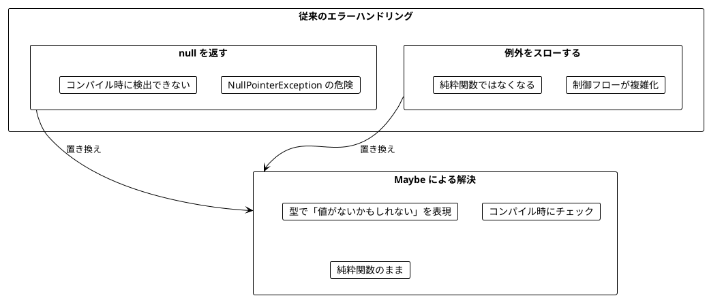
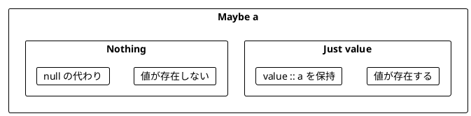
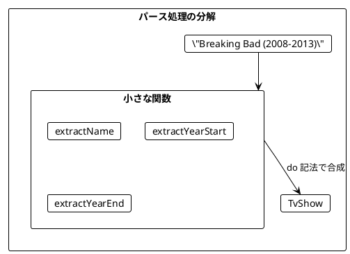
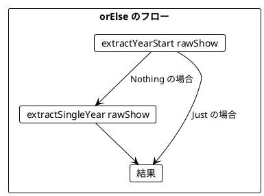
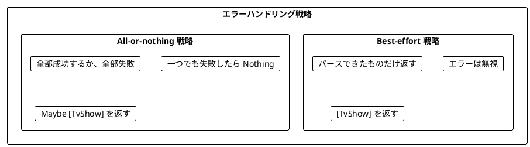
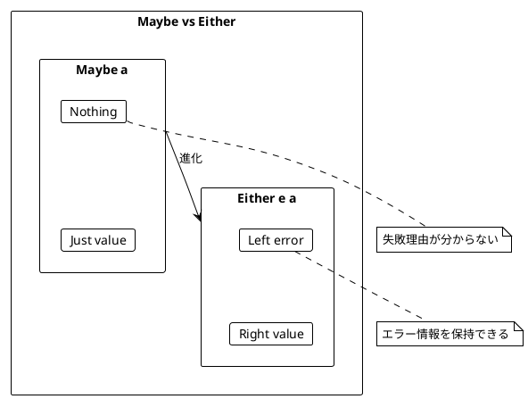
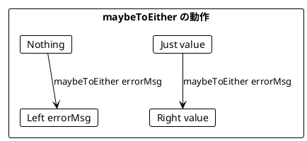
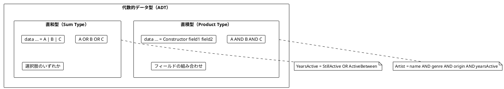
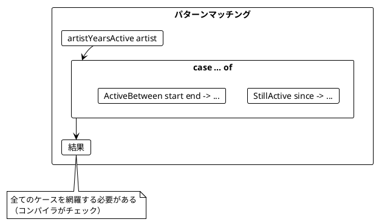
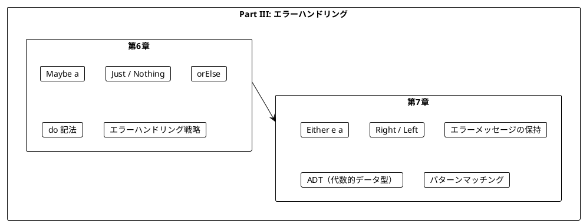

# Part III: エラーハンドリングと Maybe/Either

本章では、関数型プログラミングにおける安全なエラーハンドリングを Haskell で学びます。`null` や例外に頼らず、`Maybe` と `Either` を使って型安全にエラーを扱う方法を習得します。

---

## 第6章: Maybe 型による安全なエラーハンドリング

### 6.1 なぜ Maybe が必要か

従来のエラーハンドリングには問題があります。



**Haskell には null が存在しません。** 値が「ない」可能性は `Maybe` 型で明示的に表現します。

### 6.2 Maybe の基本

`Maybe a` は「`a` 型の値があるか、ないか」を表す型です。



```haskell
data Maybe a = Nothing | Just a

-- 使用例
Just 5    :: Maybe Int     -- 値がある
Nothing   :: Maybe Int     -- 値がない
Just "Hi" :: Maybe String  -- 文字列がある
```

**ソースファイル**: `app/haskell/src/Ch06/MaybeHandling.hs`

### 6.3 TV番組のパース例

TV番組の文字列をパースする例で Maybe の使い方を学びます。

```haskell
data TvShow = TvShow
    { tvTitle     :: String
    , tvStartYear :: Int
    , tvEndYear   :: Int
    } deriving (Show, Eq)

-- 入力例: "Breaking Bad (2008-2013)"
-- 期待する出力: TvShow "Breaking Bad" 2008 2013
```

#### 安全でない実装（パターンマッチの失敗）

```haskell
parseShow :: String -> TvShow
parseShow rawShow =
    let Just name      = extractName rawShow      -- 危険！
        Just yearStart = extractYearStart rawShow -- 危険！
        Just yearEnd   = extractYearEnd rawShow   -- 危険！
    in TvShow name yearStart yearEnd

-- 正常ケース
parseShow "Breaking Bad (2008-2013)"  -- TvShow "Breaking Bad" 2008 2013

-- 異常ケース → パターンマッチ失敗で例外！
parseShow "Invalid"  -- *** Exception: ...
```

#### Maybe を使った安全な実装

```haskell
parseShowSafe :: String -> Maybe TvShow
parseShowSafe rawShow = do
    name      <- extractName rawShow
    yearStart <- extractYearStart rawShow `orElse` extractSingleYear rawShow
    yearEnd   <- extractYearEnd rawShow `orElse` extractSingleYear rawShow
    return $ TvShow name yearStart yearEnd

-- 正常ケース
parseShowSafe "Breaking Bad (2008-2013)"
-- Just (TvShow "Breaking Bad" 2008 2013)

-- 異常ケース → Nothing が返される（例外なし）
parseShowSafe "Invalid"
-- Nothing
```

### 6.4 小さな関数から組み立てる

複雑なパース処理を小さな関数に分解します。

```haskell
-- 名前を抽出
extractName :: String -> Maybe String
extractName rawShow =
    let bracketOpen = elemIndex '(' rawShow
    in case bracketOpen of
        Just idx | idx > 0 -> Just $ trim $ take idx rawShow
        _                  -> Nothing

-- 開始年を抽出
extractYearStart :: String -> Maybe Int
extractYearStart rawShow = do
    bracketOpen <- elemIndex '(' rawShow
    dash        <- elemIndex '-' rawShow
    if dash > bracketOpen + 1
        then readMaybe $ take (dash - bracketOpen - 1) $ drop (bracketOpen + 1) rawShow
        else Nothing

-- 終了年を抽出
extractYearEnd :: String -> Maybe Int
extractYearEnd rawShow = do
    dash         <- elemIndex '-' rawShow
    bracketClose <- elemIndex ')' rawShow
    if bracketClose > dash + 1
        then readMaybe $ take (bracketClose - dash - 1) $ drop (dash + 1) rawShow
        else Nothing
```



### 6.5 orElse によるフォールバック

`orElse` を使って、最初の Maybe が `Nothing` の場合に代替を試すことができます。

```haskell
-- orElse の実装
orElse :: Maybe a -> Maybe a -> Maybe a
orElse (Just x) _ = Just x
orElse Nothing  y = y

-- 使用例
Just 7 `orElse` Just 8   -- Just 7 (最初が Just なのでそのまま)
Nothing `orElse` Just 8  -- Just 8 (最初が Nothing なので代替を使用)
Just 7 `orElse` Nothing  -- Just 7
Nothing `orElse` Nothing -- Nothing
```

#### 単年の番組に対応する

「Chernobyl (2019)」のような単年の番組をパースできるようにします。

```haskell
extractSingleYear :: String -> Maybe Int
extractSingleYear rawShow =
    case (elemIndex '-' rawShow, elemIndex '(' rawShow, elemIndex ')' rawShow) of
        (Nothing, Just bo, Just bc) | bc > bo + 1 ->
            readMaybe $ take (bc - bo - 1) $ drop (bo + 1) rawShow
        _ -> Nothing

parseShowSafe :: String -> Maybe TvShow
parseShowSafe rawShow = do
    name      <- extractName rawShow
    yearStart <- extractYearStart rawShow `orElse` extractSingleYear rawShow
    yearEnd   <- extractYearEnd rawShow `orElse` extractSingleYear rawShow
    return $ TvShow name yearStart yearEnd

-- これで単年の番組もパースできる
parseShowSafe "Chernobyl (2019)"
-- Just (TvShow "Chernobyl" 2019 2019)
```



### 6.6 Maybe の主要関数

| 関数 | 説明 | 例 |
|------|------|-----|
| `fmap` / `<$>` | 値があれば変換 | `fmap (*2) (Just 5)` → `Just 10` |
| `>>=` | Maybe を返す関数を適用 | `Just 5 >>= \x -> Just (x * 2)` → `Just 10` |
| `<\|>` | Nothing なら代替を使用 | `Nothing <\|> Just 5` → `Just 5` |
| `fromMaybe` | Nothing ならデフォルト値 | `fromMaybe 0 Nothing` → `0` |
| `maybeToList` | List に変換 | `maybeToList (Just 5)` → `[5]` |
| `catMaybes` | Just だけ抽出 | `catMaybes [Just 1, Nothing, Just 3]` → `[1,3]` |

```haskell
import Data.Maybe

let year   = Just 996
let noYear = Nothing :: Maybe Int

-- fmap / <$>
fmap (*2) year     -- Just 1992
fmap (*2) noYear   -- Nothing
(*2) <$> year      -- Just 1992

-- >>= (bind)
year >>= \y -> Just (y * 2)    -- Just 1992
noYear >>= \y -> Just (y * 2)  -- Nothing

-- <|> (Alternative)
import Control.Applicative
year <|> Just 2020     -- Just 996
noYear <|> Just 2020   -- Just 2020

-- fromMaybe
fromMaybe 0 year    -- 996
fromMaybe 0 noYear  -- 0
```

### 6.7 エラーハンドリング戦略

複数の要素をパースする場合、2つの戦略があります。



#### Best-effort 戦略

```haskell
parseShowsBestEffort :: [String] -> [TvShow]
parseShowsBestEffort rawShows =
    concatMap (maybe [] (:[]) . parseShowSafe) rawShows

-- または catMaybes を使用
parseShowsBestEffort' :: [String] -> [TvShow]
parseShowsBestEffort' = catMaybes . map parseShowSafe

let rawShows = [ "Breaking Bad (2008-2013)"
               , "Invalid Format"
               , "Mad Men (2007-2015)"
               ]

parseShowsBestEffort rawShows
-- [TvShow "Breaking Bad" 2008 2013, TvShow "Mad Men" 2007 2015]
-- 無効なものは無視される
```

#### All-or-nothing 戦略

```haskell
parseShowsAllOrNothing :: [String] -> Maybe [TvShow]
parseShowsAllOrNothing = traverse parseShowSafe

-- 全部成功 → Just [...]
parseShowsAllOrNothing ["Breaking Bad (2008-2013)", "Mad Men (2007-2015)"]
-- Just [TvShow "Breaking Bad" 2008 2013, TvShow "Mad Men" 2007 2015]

-- 一つでも失敗 → Nothing
parseShowsAllOrNothing ["Breaking Bad (2008-2013)", "Invalid"]
-- Nothing
```

---

## 第7章: Either 型と複合的なエラー処理

### 7.1 Maybe の限界

`Maybe` は「値があるかないか」しか表現できません。**なぜ失敗したのか**を伝えられません。



### 7.2 Either の基本

`Either e a` は「`e` 型のエラーか、`a` 型の成功値か」を表す型です。

- `Right value`: 成功（慣例的に「正しい」= right）
- `Left error`: 失敗（エラー情報を保持）

```haskell
data Either e a = Left e | Right a

-- 使用例
Right 5     :: Either String Int  -- 成功
Left "oops" :: Either String Int  -- 失敗（エラーメッセージ付き）
```

**ソースファイル**: `app/haskell/src/Ch07/EitherHandling.hs`

### 7.3 Either を使ったパース

```haskell
extractNameE :: String -> Either String String
extractNameE rawShow =
    case elemIndex '(' rawShow of
        Just idx | idx > 0 -> Right $ trim $ take idx rawShow
        _                  -> Left $ "Can't extract name from " ++ rawShow

extractNameE "The Wire (2002-2008)"  -- Right "The Wire"
extractNameE "(2022)"                -- Left "Can't extract name from (2022)"
```

### 7.4 Either を使った完全なパーサー

```haskell
extractYearStartE :: String -> Either String Int
extractYearStartE rawShow =
    case (elemIndex '(' rawShow, elemIndex '-' rawShow) of
        (Just bo, Just d) | d > bo + 1 ->
            let yearStr = take (d - bo - 1) $ drop (bo + 1) rawShow
            in maybeToEither ("Can't parse year: " ++ yearStr) (readMaybe yearStr)
        _ -> Left $ "Can't extract start year from " ++ rawShow

extractYearStartE "The Wire (2002-2008)"  -- Right 2002
extractYearStartE "The Wire (-2008)"      -- Left "Can't extract start year from ..."
extractYearStartE "The Wire (oops-2008)"  -- Left "Can't parse year: oops"
```

### 7.5 Maybe から Either への変換

`maybeToEither` で `Maybe` を `Either` に変換できます。

```haskell
maybeToEither :: e -> Maybe a -> Either e a
maybeToEither _ (Just x) = Right x
maybeToEither e Nothing  = Left e

let year   = Just 996
let noYear = Nothing :: Maybe Int

maybeToEither "no year given" year    -- Right 996
maybeToEither "no year given" noYear  -- Left "no year given"
```



### 7.6 Either による完全なパーサー

```haskell
parseShowE :: String -> Either String TvShow
parseShowE rawShow = do
    name      <- extractNameE rawShow
    yearStart <- extractYearStartE rawShow `orElseE` extractSingleYearE rawShow
    yearEnd   <- extractYearEndE rawShow `orElseE` extractSingleYearE rawShow
    return $ TvShow name yearStart yearEnd

parseShowE "The Wire (2002-2008)"  -- Right (TvShow "The Wire" 2002 2008)
parseShowE "Mad Men ()"            -- Left "Can't extract single year from Mad Men ()"
parseShowE "(2002-2008)"           -- Left "Can't extract name from (2002-2008)"
```

### 7.7 Either の主要関数

| 関数 | 説明 | 例 |
|------|------|-----|
| `fmap` / `<$>` | Right の値を変換 | `fmap (*2) (Right 5)` → `Right 10` |
| `>>=` | Right なら Either を返す関数を適用 | `Right 5 >>= \x -> Right (x * 2)` → `Right 10` |
| `either` | Left/Right で異なる処理 | `either show id (Right "ok")` → `"ok"` |
| `fromRight` | Left ならデフォルト値 | `fromRight 0 (Left "err")` → `0` |
| `partitionEithers` | Left と Right を分離 | `partitionEithers [Left "e", Right 1]` → `(["e"], [1])` |

```haskell
import Data.Either

let year   = Right 996 :: Either String Int
let noYear = Left "no year" :: Either String Int

-- fmap / <$>
fmap (*2) year     -- Right 1992
fmap (*2) noYear   -- Left "no year"

-- >>= (bind)
year >>= \y -> Right (y * 2)              -- Right 1992
noYear >>= \y -> Right (y * 2)            -- Left "no year"
year >>= \_ -> Left "can't progress"      -- Left "can't progress"

-- either
either length id year    -- 996
either length id noYear  -- 7 ("no year" の長さ)

-- fromRight
fromRight 0 year    -- 996
fromRight 0 noYear  -- 0
```

### 7.8 音楽アーティスト検索の例

より複雑な例として、音楽アーティストの検索機能を見てみましょう。

#### 代数的データ型（ADT）によるモデリング

```haskell
-- 音楽ジャンル（直和型）
data MusicGenre
    = HeavyMetal
    | Pop
    | HardRock
    | Grunge
    | Punk
    deriving (Show, Eq)

-- 場所（直和型）
data Location
    = USA
    | England
    | Australia
    | Canada
    deriving (Show, Eq)

-- 活動期間（直和型）
data YearsActive
    = StillActive Int           -- 活動中（開始年）
    | ActiveBetween Int Int     -- 活動終了（開始年、終了年）
    deriving (Show, Eq)

-- アーティスト（直積型）
data Artist = Artist
    { artistName        :: String
    , artistGenre       :: MusicGenre
    , artistOrigin      :: Location
    , artistYearsActive :: YearsActive
    } deriving (Show, Eq)
```



### 7.9 パターンマッチング

直和型は**パターンマッチング**で処理します。

```haskell
wasArtistActive :: Artist -> Int -> Int -> Bool
wasArtistActive artist yearStart yearEnd =
    case artistYearsActive artist of
        StillActive since        -> since <= yearEnd
        ActiveBetween start end_ -> start <= yearEnd && end_ >= yearStart

activeLength :: Artist -> Int -> Int
activeLength artist currentYear =
    case artistYearsActive artist of
        StillActive since        -> currentYear - since
        ActiveBetween start end_ -> end_ - start
```



### 7.10 検索条件のモデリング

検索条件も ADT でモデリングできます。

```haskell
data SearchCondition
    = SearchByGenre [MusicGenre]
    | SearchByOrigin [Location]
    | SearchByActiveYears Int Int
    deriving (Show, Eq)

searchArtists :: [Artist] -> [SearchCondition] -> [Artist]
searchArtists artists conditions =
    filter (satisfiesAll conditions) artists
  where
    satisfiesAll conds artist = all (satisfies artist) conds

    satisfies artist (SearchByGenre genres) =
        artistGenre artist `elem` genres
    satisfies artist (SearchByOrigin locations) =
        artistOrigin artist `elem` locations
    satisfies artist (SearchByActiveYears start end_) =
        wasArtistActive artist start end_

-- 使用例
let metallica = Artist "Metallica" HeavyMetal USA (StillActive 1981)
let madonna   = Artist "Madonna" Pop USA (StillActive 1982)

searchArtists [metallica, madonna] [SearchByGenre [HeavyMetal]]
-- [metallica]

searchArtists [metallica, madonna] [SearchByOrigin [USA], SearchByGenre [Pop]]
-- [madonna]
```

### 7.11 バリデーションの例

```haskell
validateAge :: Int -> Either String Int
validateAge age
    | age < 0   = Left "Age cannot be negative"
    | age > 150 = Left "Age cannot be greater than 150"
    | otherwise = Right age

validateEmail :: String -> Either String String
validateEmail email
    | '@' `notElem` email = Left "Email must contain @"
    | '.' `notElem` email = Left "Email must contain a domain"
    | otherwise           = Right email

-- 組み合わせ
validateUser :: Int -> String -> Either String (Int, String)
validateUser age email = do
    validAge   <- validateAge age
    validEmail <- validateEmail email
    return (validAge, validEmail)

validateUser 25 "test@example.com"  -- Right (25, "test@example.com")
validateUser (-5) "test@example.com" -- Left "Age cannot be negative"
validateUser 25 "invalid"            -- Left "Email must contain @"
```

---

## まとめ

### Part III で学んだこと



### Maybe vs Either の使い分け

| 状況 | 使用する型 |
|------|------------|
| 値があるかないかだけが重要 | `Maybe a` |
| 失敗理由を伝える必要がある | `Either e a` |
| 検索結果が見つからない | `Maybe a` |
| バリデーションエラーを伝える | `Either String a` |
| 複数のエラー種別がある | `Either ErrorType a` |

### Scala との対応

| Scala | Haskell | 説明 |
|-------|---------|------|
| `Option[A]` | `Maybe a` | 値の有無 |
| `Some(x)` | `Just x` | 値がある |
| `None` | `Nothing` | 値がない |
| `Either[E, A]` | `Either e a` | 成功/失敗 |
| `Right(x)` | `Right x` | 成功 |
| `Left(e)` | `Left e` | 失敗 |
| `opt.getOrElse(d)` | `fromMaybe d opt` | デフォルト値 |
| `opt.orElse(alt)` | `opt <\|> alt` | 代替 |
| `opt.toRight(e)` | `maybeToEither e opt` | Maybe→Either |

### キーポイント

1. **Maybe**: 値の有無を型で表現する（Haskell には null がない）
2. **Either**: 成功/失敗とエラー情報を型で表現する
3. **do 記法**: Maybe/Either を組み合わせて使う
4. **orElse / <|>**: フォールバックを提供する
5. **ADT**: 直積型と直和型でドメインを正確にモデリング
6. **パターンマッチング**: 直和型を安全に処理する（網羅性チェック付き）

### 次のステップ

Part IV では、以下のトピックを学びます:

- IO モナドの導入
- 副作用の管理
- ストリーム処理

---

## 演習問題

### 問題 1: Maybe の基本

以下の関数を実装してください。

```haskell
safeDivide :: Int -> Int -> Maybe Int
safeDivide = ???

-- 期待される動作
safeDivide 10 2 == Just 5
safeDivide 10 0 == Nothing
safeDivide 7 2 == Just 3
```

<details>
<summary>解答</summary>

```haskell
safeDivide :: Int -> Int -> Maybe Int
safeDivide _ 0 = Nothing
safeDivide a b = Just (a `div` b)
```

</details>

### 問題 2: Maybe の合成

以下の関数を実装してください。2つの数値文字列を受け取り、その合計を返します。

```haskell
addStrings :: String -> String -> Maybe Int
addStrings = ???

-- 期待される動作
addStrings "10" "20" == Just 30
addStrings "10" "abc" == Nothing
addStrings "xyz" "20" == Nothing
```

<details>
<summary>解答</summary>

```haskell
import Text.Read (readMaybe)

addStrings :: String -> String -> Maybe Int
addStrings a b = do
    x <- readMaybe a
    y <- readMaybe b
    return (x + y)
```

</details>

### 問題 3: Either によるバリデーション

以下の関数を実装してください。年齢を検証し、エラーメッセージを返します。

```haskell
validateAge :: Int -> Either String Int
validateAge = ???

-- 期待される動作
validateAge 25 == Right 25
validateAge (-5) == Left "Age cannot be negative"
validateAge 200 == Left "Age cannot be greater than 150"
```

<details>
<summary>解答</summary>

```haskell
validateAge :: Int -> Either String Int
validateAge age
    | age < 0   = Left "Age cannot be negative"
    | age > 150 = Left "Age cannot be greater than 150"
    | otherwise = Right age
```

</details>

### 問題 4: パターンマッチング

以下のデータ型とパターンマッチングを使った関数を実装してください。

```haskell
data PaymentMethod
    = CreditCard String String  -- カード番号、有効期限
    | BankTransfer String       -- 口座番号
    | Cash
    deriving (Show, Eq)

describePayment :: PaymentMethod -> String
describePayment = ???

-- 期待される動作
describePayment (CreditCard "1234" "12/25") == "Credit card ending in 1234"
describePayment (BankTransfer "9876") == "Bank transfer to account 9876"
describePayment Cash == "Cash payment"
```

<details>
<summary>解答</summary>

```haskell
describePayment :: PaymentMethod -> String
describePayment method = case method of
    CreditCard number _ -> "Credit card ending in " ++ number
    BankTransfer account -> "Bank transfer to account " ++ account
    Cash -> "Cash payment"
```

</details>

### 問題 5: all と any

以下の条件に合うユーザーを抽出する関数を実装してください。

```haskell
data User = User
    { userName  :: String
    , userEmail :: Maybe String
    , userAge   :: Int
    } deriving (Show, Eq)

let users = [ User "Alice" (Just "alice@example.com") 25
            , User "Bob" Nothing 30
            , User "Charlie" (Just "charlie@test.com") 17
            ]

-- 1. メールアドレスが設定されていないか、example.com ドメインのユーザー
f1 :: [User] -> [User]
f1 = ???

-- 2. メールアドレスが設定されていて、test.com ドメインのユーザー
f2 :: [User] -> [User]
f2 = ???
```

<details>
<summary>解答</summary>

```haskell
import Data.List (isSuffixOf)

-- 1. メールアドレスが設定されていないか、example.com ドメイン
-- maybe True ... は Scala の forall に相当
f1 :: [User] -> [User]
f1 = filter (\u -> maybe True ("@example.com" `isSuffixOf`) (userEmail u))
-- [Alice, Bob]

-- 2. メールアドレスが設定されていて、test.com ドメイン
-- maybe False ... は Scala の exists に相当
f2 :: [User] -> [User]
f2 = filter (\u -> maybe False ("@test.com" `isSuffixOf`) (userEmail u))
-- [Charlie]
```

</details>
