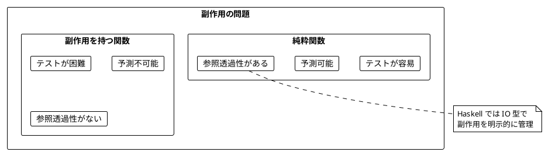
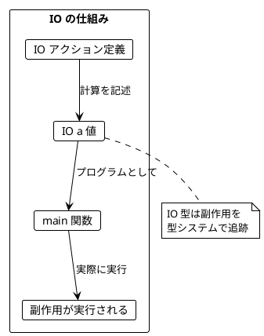
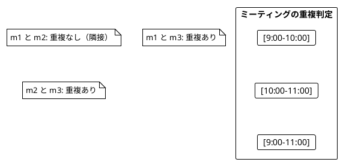
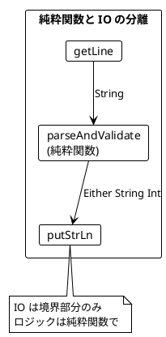
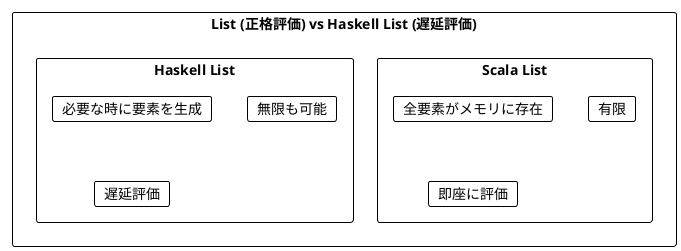
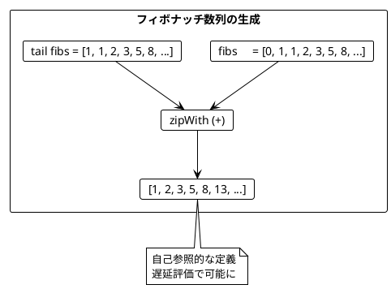
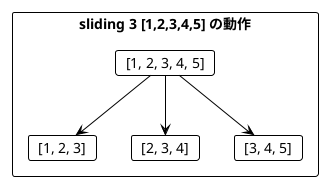
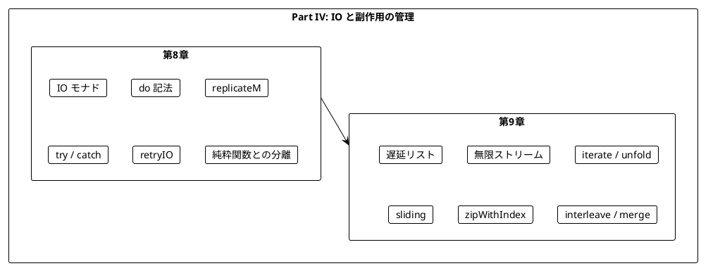

# Part IV: IO と副作用の管理

本章では、関数型プログラミングにおける副作用の扱い方を学びます。Haskell では IO モナドを使って副作用を型システムで管理し、遅延リストで無限のデータを扱う方法を習得します。

---

## 第8章: IO モナドの導入

### 8.1 副作用の問題

純粋関数は副作用を持ちません。しかし、実際のプログラムには副作用が必要です:

- ファイルの読み書き
- ネットワーク通信
- データベースアクセス
- 乱数生成
- 現在時刻の取得



### 8.2 IO モナドとは

Haskell の **IO モナド**は「副作用を持つ計算」を表す型です。

- `IO a` は「実行すると `a` 型の値を返す副作用のある計算」
- IO 値は `do` 記法で合成できる
- Haskell のプログラムは `main :: IO ()` から始まる



### 8.3 サイコロを振る例

**ソースファイル**: `app/haskell/src/Ch08/IOMonad.hs`

#### 乱数生成（IO を使用）

```haskell
import System.Random (randomRIO)

-- | サイコロを振る（副作用あり）
castTheDie :: IO Int
castTheDie = randomRIO (1, 6)
```

Scala との違い:
- Scala: `IO.delay(random.nextInt(6) + 1)` で副作用をラップ
- Haskell: `randomRIO` 自体が `IO Int` を返す

#### サイコロを2回振る

```haskell
-- | サイコロを2回振って合計を返す
castTheDieTwice :: IO Int
castTheDieTwice = do
    first  <- castTheDie
    second <- castTheDie
    return (first + second)
```

Scala での同等のコード:
```scala
def castTheDieTwice(): IO[Int] = {
  for {
    first  <- castTheDie()
    second <- castTheDie()
  } yield first + second
}
```

### 8.4 do 記法

Haskell の `do` 記法は、Scala の `for` 内包表記に相当します。

```haskell
-- do 記法
castTheDieTwice :: IO Int
castTheDieTwice = do
    first  <- castTheDie
    second <- castTheDie
    return (first + second)

-- 脱糖後（>>=を使用）
castTheDieTwice :: IO Int
castTheDieTwice =
    castTheDie >>= \first ->
    castTheDie >>= \second ->
    return (first + second)
```

| Haskell | Scala | 説明 |
|---------|-------|------|
| `do` | `for` | モナド内包表記 |
| `<-` | `<-` | 値の取り出し |
| `return` | `yield` または `IO.pure` | 値をモナドに包む |
| `>>=` | `flatMap` | モナドの連鎖 |

### 8.5 複数回のサイコロ

```haskell
import Control.Monad (replicateM)

-- | サイコロをn回振って結果をリストで返す
castTheDieN :: Int -> IO [Int]
castTheDieN n = replicateM n castTheDie
```

`replicateM` は Scala の `sequence` + `List.fill` に相当:
```scala
// Scala
def castTheDieN(n: Int): IO[List[Int]] =
  List.fill(n)(castTheDie()).sequence
```

### 8.6 ミーティングスケジューリングの例

#### データ型の定義

```haskell
-- | ミーティング時間を表すデータ型
data MeetingTime = MeetingTime
    { mtStartHour :: Int
    , mtEndHour   :: Int
    } deriving (Show, Eq)
```

#### 重複判定（純粋関数）

```haskell
-- | 2つのミーティングが重なっているかを判定
meetingsOverlap :: MeetingTime -> MeetingTime -> Bool
meetingsOverlap m1 m2 =
    mtStartHour m1 < mtEndHour m2 && mtEndHour m1 > mtStartHour m2
```



#### 空き時間の計算

```haskell
-- | 可能なミーティング時間を計算（純粋関数）
possibleMeetings :: [MeetingTime] -> Int -> Int -> Int -> [MeetingTime]
possibleMeetings existingMeetings startHour endHour lengthHours =
    let slots = [MeetingTime s (s + lengthHours) | s <- [startHour .. endHour - lengthHours]]
    in filter (\slot -> all (not . meetingsOverlap slot) existingMeetings) slots
```

Haskell のリスト内包表記 `[... | ...]` は、Scala の `for` 内包表記に似ています:
```scala
// Scala
val slots = for {
  s <- startHour to (endHour - lengthHours)
} yield MeetingTime(s, s + lengthHours)
```

### 8.7 IO の合成

```haskell
-- | 2つの IO を合成
combineIO :: IO a -> IO b -> (a -> b -> c) -> IO c
combineIO io1 io2 f = do
    a <- io1
    b <- io2
    return (f a b)
```

使用例:
```haskell
ghci> result <- combineIO (return 1) (return 2) (+)
ghci> print result
3
```

#### IO のリストを順番に実行

```haskell
-- | IO のリストを順番に実行
sequenceIO :: [IO a] -> IO [a]
sequenceIO []     = return []
sequenceIO (x:xs) = do
    a  <- x
    as <- sequenceIO xs
    return (a : as)
```

標準ライブラリの `sequence` と同じ機能です。

### 8.8 エラーハンドリング

```haskell
import Control.Exception (try, SomeException)

-- | 例外をキャッチして Either に変換
catchIO :: IO a -> IO (Either String a)
catchIO action = do
    result <- try action :: IO (Either SomeException a)
    return $ case result of
        Right a -> Right a
        Left e  -> Left (show e)
```

#### リトライ機能

```haskell
-- | IO アクションをリトライ
retryIO :: Int -> IO a -> IO (Maybe a)
retryIO 0 _      = return Nothing
retryIO n action = do
    result <- try action :: IO (Either SomeException a)
    case result of
        Right a -> return (Just a)
        Left _  -> retryIO (n - 1) action

-- | リトライしてデフォルト値を返す
retryWithDefault :: Int -> a -> IO a -> IO a
retryWithDefault maxRetries defaultVal action = do
    result <- retryIO maxRetries action
    return $ maybe defaultVal id result
```

### 8.9 純粋関数と IO の分離

```haskell
-- | 入力をパースして検証（純粋関数）
parseAndValidate :: String -> Either String Int
parseAndValidate input =
    case reads input of
        [(n, "")] | n > 0     -> Right n
                  | otherwise -> Left "Number must be positive"
        _                     -> Left "Invalid number"

-- | 入力を処理（IO と純粋関数の分離）
processInput :: IO ()
processInput = do
    putStr "Enter a positive number: "
    input <- getLine
    case parseAndValidate input of
        Right n  -> putStrLn $ "Valid: " ++ show n
        Left err -> putStrLn $ "Error: " ++ err
```



---

## 第9章: ストリーム処理

### 9.1 遅延リストとは

Haskell のリストは**遅延評価**されます。これにより、無限リストを扱うことができます。



Scala では `fs2.Stream` を使いますが、Haskell では標準のリストが遅延評価のため、そのまま無限ストリームとして機能します。

### 9.2 無限ストリームの基本

**ソースファイル**: `app/haskell/src/Ch09/StreamProcessing.hs`

```haskell
-- | 自然数の無限ストリーム
naturals :: [Integer]
naturals = [1..]

-- | 偶数の無限ストリーム
evens :: [Integer]
evens = [2,4..]

-- | 奇数の無限ストリーム
odds :: [Integer]
odds = [1,3..]
```

```haskell
ghci> take 10 naturals
[1,2,3,4,5,6,7,8,9,10]

ghci> take 5 evens
[2,4,6,8,10]
```

### 9.3 フィボナッチ数列

遅延評価を使った自己参照的な定義:

```haskell
-- | フィボナッチ数列の無限ストリーム
fibs :: [Integer]
fibs = 0 : 1 : zipWith (+) fibs (tail fibs)
```



```haskell
ghci> take 10 fibs
[0,1,1,2,3,5,8,13,21,34]
```

### 9.4 素数のストリーム（エラトステネスのふるい）

```haskell
-- | 素数の無限ストリーム
primes :: [Integer]
primes = sieve [2..]
  where
    sieve (p:xs) = p : sieve [x | x <- xs, x `mod` p /= 0]
    sieve []     = []
```

```haskell
ghci> take 10 primes
[2,3,5,7,11,13,17,19,23,29]
```

### 9.5 ストリーム生成関数

```haskell
-- | 同じ値を無限に繰り返す（Scala の Stream.repeat に相当）
repeatVal :: a -> [a]
repeatVal x = x : repeatVal x

-- | リストを無限に繰り返す（Scala の Stream(...).repeat に相当）
cycleList :: [a] -> [a]
cycleList xs = xs ++ cycleList xs

-- | 関数を繰り返し適用して無限リストを生成
iterate' :: (a -> a) -> a -> [a]
iterate' f x = x : iterate' f (f x)
```

```haskell
ghci> take 5 (repeatVal 1)
[1,1,1,1,1]

ghci> take 7 (cycleList [1,2,3])
[1,2,3,1,2,3,1]

ghci> take 5 (iterate' (*2) 1)
[1,2,4,8,16]
```

### 9.6 unfold: 汎用的なストリーム生成

```haskell
-- | unfold: 種から無限リストを生成
unfold :: (b -> Maybe (a, b)) -> b -> [a]
unfold f seed = case f seed of
    Nothing      -> []
    Just (a, b') -> a : unfold f b'
```

Scala の `Stream.unfold` に相当:
```scala
// Scala
Stream.unfold(0)(n => Some((n, n + 1)))
```

```haskell
-- Haskell
ghci> take 5 (unfold (\n -> Just (n, n+1)) 0)
[0,1,2,3,4]
```

### 9.7 ストリーム操作

```haskell
-- | 条件を満たす間、要素を取得（Scala の takeWhile）
takeWhile' :: (a -> Bool) -> [a] -> [a]
takeWhile' _ []     = []
takeWhile' p (x:xs)
    | p x       = x : takeWhile' p xs
    | otherwise = []

-- | 条件を満たす間、要素をスキップ（Scala の dropWhile）
dropWhile' :: (a -> Bool) -> [a] -> [a]
dropWhile' _ []     = []
dropWhile' p xs@(x:xs')
    | p x       = dropWhile' p xs'
    | otherwise = xs
```

```haskell
ghci> takeWhile' (<5) [1,2,3,4,5,6]
[1,2,3,4]

ghci> dropWhile' (<5) [1,2,3,4,5,6]
[5,6]
```

### 9.8 スライディングウィンドウ

```haskell
-- | スライディングウィンドウ（Scala の sliding に相当）
sliding :: Int -> [a] -> [[a]]
sliding n xs
    | length window < n = []
    | otherwise         = window : sliding n (tail xs)
  where
    window = take n xs
```



```haskell
ghci> sliding 3 [1,2,3,4,5]
[[1,2,3],[2,3,4],[3,4,5]]
```

### 9.9 チャンク分割

```haskell
-- | 固定サイズのチャンクに分割
chunksOf :: Int -> [a] -> [[a]]
chunksOf _ [] = []
chunksOf n xs = take n xs : chunksOf n (drop n xs)
```

```haskell
ghci> chunksOf 3 [1,2,3,4,5,6,7,8]
[[1,2,3],[4,5,6],[7,8]]
```

### 9.10 トレンド検出

通貨交換レートの監視に使用する関数:

```haskell
-- | 上昇トレンドかどうかを判定
trending :: Ord a => [a] -> Bool
trending xs =
    length xs > 1 &&
    all (uncurry (<)) (zip xs (tail xs))

-- | 安定（全て同じ値）かどうかを判定
isStable :: Eq a => [a] -> Bool
isStable xs =
    length xs >= 3 &&
    all (== head xs) xs
```

```haskell
ghci> trending [0.81, 0.82, 0.83]
True

ghci> trending [0.81, 0.84, 0.83]
False

ghci> isStable [5, 5, 5]
True
```

### 9.11 通貨交換レートの例

```haskell
type ExchangeRate = Double

-- | 為替レートをシミュレート（無限ストリーム）
simulateRates :: ExchangeRate -> [ExchangeRate]
simulateRates initial = iterate' vary initial
  where
    vary rate = rate + sin (rate * 100) * 0.01

-- | 上昇トレンドを検出するまでレートを監視
findUptrend :: Int -> [ExchangeRate] -> Maybe [ExchangeRate]
findUptrend = findTrend

-- | ストリームから上昇トレンドを検出
findTrend :: Ord a => Int -> [a] -> Maybe [a]
findTrend windowSize xs =
    case filter trending (sliding windowSize xs) of
        []    -> Nothing
        (w:_) -> Just w
```

#### トレンドを検出して交換

```haskell
-- | 上昇トレンドを検出したら交換
exchangeIfTrending :: Double -> Int -> [ExchangeRate] -> Maybe Double
exchangeIfTrending amount windowSize rates =
    case findUptrend windowSize rates of
        Just trend -> Just $ amount * last trend
        Nothing    -> Nothing
```

```haskell
ghci> exchangeIfTrending 100 3 [0.80, 0.81, 0.82, 0.83, 0.80]
Just 82.0
```

### 9.12 ストリーム合成

```haskell
-- | インデックス付きストリーム（Scala の zipWithIndex）
zipWithIndex :: [a] -> [(Int, a)]
zipWithIndex = zip [0..]

-- | 2つのストリームを交互に合成
interleave :: [a] -> [a] -> [a]
interleave []     ys     = ys
interleave xs     []     = xs
interleave (x:xs) (y:ys) = x : y : interleave xs ys

-- | 2つのソート済みストリームをマージ
merge :: Ord a => [a] -> [a] -> [a]
merge []     ys     = ys
merge xs     []     = xs
merge (x:xs) (y:ys)
    | x <= y    = x : merge xs (y:ys)
    | otherwise = y : merge (x:xs) ys
```

```haskell
ghci> take 3 (zipWithIndex ['a', 'b', 'c'])
[(0,'a'),(1,'b'),(2,'c')]

ghci> take 6 (interleave [1,3,5] [2,4,6])
[1,2,3,4,5,6]

ghci> take 10 (merge [1,3,5,7,9] [2,4,6,8,10])
[1,2,3,4,5,6,7,8,9,10]
```

---

## まとめ

### Part IV で学んだこと



### Scala と Haskell の比較

| 概念 | Scala (cats-effect/fs2) | Haskell |
|------|-------------------------|---------|
| 副作用の型 | `IO[A]` | `IO a` |
| 遅延実行 | `IO.delay(expr)` | 関数が `IO` を返す |
| 値のラップ | `IO.pure(value)` | `return value` |
| モナド合成 | `for` 内包表記 | `do` 記法 |
| flatMap | `flatMap` | `>>=` |
| ストリーム | `fs2.Stream[IO, A]` | 標準の `[a]`（遅延評価） |
| 無限繰り返し | `Stream(...).repeat` | `repeat` / `cycle` |
| スライディング | `stream.sliding(n)` | `sliding n xs` |
| リストの sequence | `list.sequence` | `sequence` |

### キーポイント

1. **IO モナド**: Haskell では副作用を持つ計算は必ず `IO` 型を返す
2. **do 記法**: Scala の `for` 内包表記に相当、モナドを順序付けて合成
3. **遅延評価**: Haskell のリストはデフォルトで遅延評価、無限リストが自然に扱える
4. **純粋関数との分離**: ロジックは純粋関数で、IO は境界部分のみ
5. **ストリーム生成**: `iterate`、`unfold` で無限ストリームを生成
6. **パターン検出**: `sliding` でウィンドウを作り、`trending` でパターンを検出

### 次のステップ

Part V では、以下のトピックを学びます:

- 並行・並列処理
- Concurrent Haskell
- STM（Software Transactional Memory）
- async ライブラリ

---

## 演習問題

### 問題 1: IO の基本

以下の関数を実装してください。

```haskell
-- メッセージを出力して返す
printAndReturn :: String -> IO String
printAndReturn message = ???

-- 期待される動作
-- > result <- printAndReturn "Hello"
-- Hello
-- > result
-- "Hello"
```

<details>
<summary>解答</summary>

```haskell
printAndReturn :: String -> IO String
printAndReturn message = do
    putStrLn message
    return message
```

</details>

### 問題 2: IO の合成

以下の関数を実装してください。2つの IO を順番に実行し、結果を結合します。

```haskell
combineIO :: IO a -> IO b -> (a -> b -> c) -> IO c
combineIO io1 io2 f = ???

-- 期待される動作
-- > result <- combineIO (return 1) (return 2) (+)
-- > result
-- 3
```

<details>
<summary>解答</summary>

```haskell
combineIO :: IO a -> IO b -> (a -> b -> c) -> IO c
combineIO io1 io2 f = do
    a <- io1
    b <- io2
    return (f a b)
```

</details>

### 問題 3: リトライ

以下の関数を実装してください。指定回数リトライし、全部失敗したらデフォルト値を返します。

```haskell
retryWithDefault :: Int -> a -> IO a -> IO a
retryWithDefault maxRetries defaultVal action = ???
```

<details>
<summary>解答</summary>

```haskell
import Control.Exception (try, SomeException)

retryWithDefault :: Int -> a -> IO a -> IO a
retryWithDefault 0 defaultVal _ = return defaultVal
retryWithDefault n defaultVal action = do
    result <- try action :: IO (Either SomeException a)
    case result of
        Right a -> return a
        Left _  -> retryWithDefault (n - 1) defaultVal action
```

</details>

### 問題 4: ストリーム操作

以下のストリームを作成してください。

```haskell
-- 1. 1から10までの偶数のリスト
evens :: [Int]
evens = ???

-- 2. 無限に交互に True/False を返すリスト
alternating :: [Bool]
alternating = ???

-- 3. 最初の5つの要素の合計を計算
sumFirst5 :: [Int] -> Int
sumFirst5 xs = ???
```

<details>
<summary>解答</summary>

```haskell
-- 1. 1から10までの偶数
evens :: [Int]
evens = [2, 4, 6, 8, 10]
-- または
evens = filter even [1..10]

-- 2. 無限に交互に True/False
alternating :: [Bool]
alternating = cycle [True, False]

-- 3. 最初の5つの要素の合計
sumFirst5 :: [Int] -> Int
sumFirst5 xs = sum (take 5 xs)
```

</details>

### 問題 5: トレンド検出

以下の関数を実装してください。直近の値が減少傾向かどうかを判定します。

```haskell
declining :: Ord a => [a] -> Bool
declining xs = ???

-- 期待される動作
-- declining [0.83, 0.82, 0.81]  -- True (減少トレンド)
-- declining [0.81, 0.82, 0.83]  -- False
-- declining [0.81]              -- False (1要素では判定不可)
```

<details>
<summary>解答</summary>

```haskell
declining :: Ord a => [a] -> Bool
declining xs =
    length xs > 1 &&
    all (uncurry (>)) (zip xs (tail xs))
```

</details>
