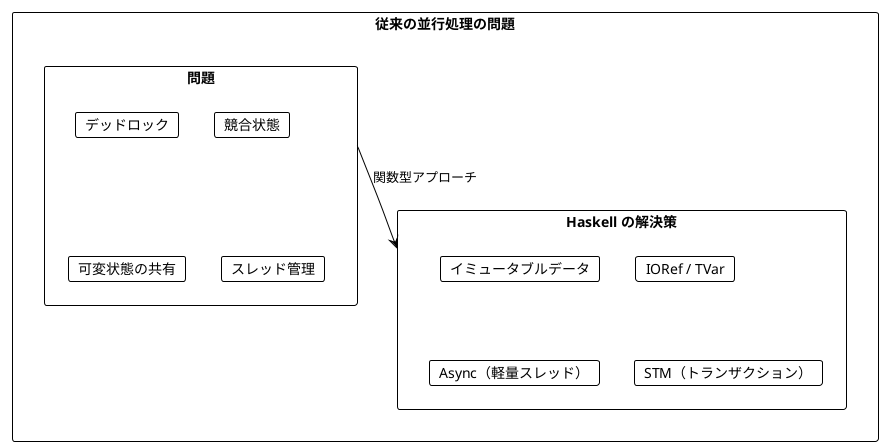
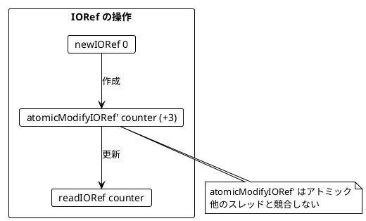
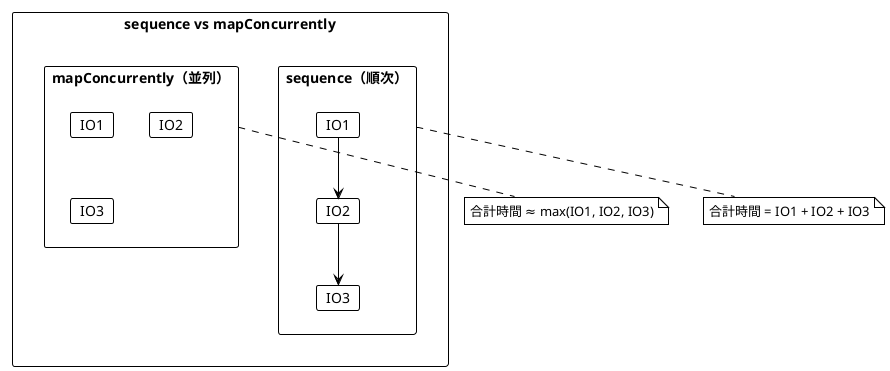
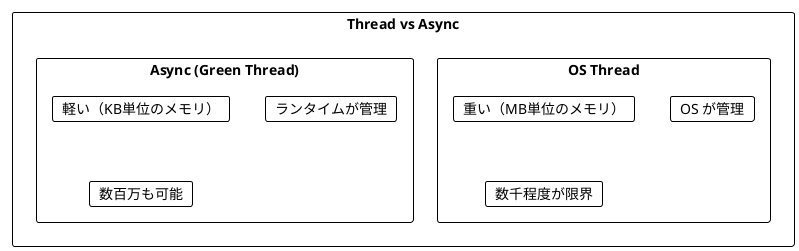
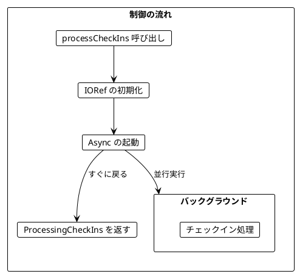
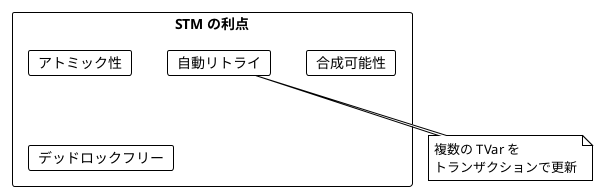
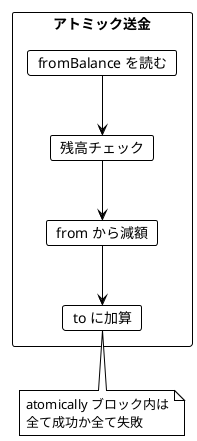
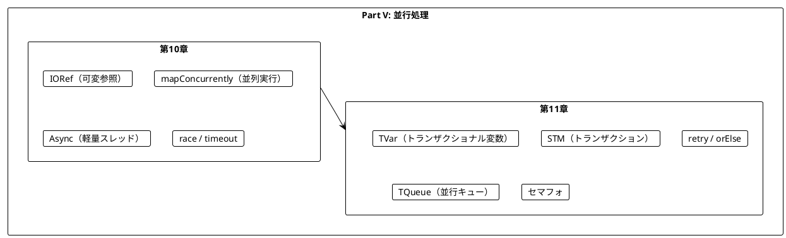
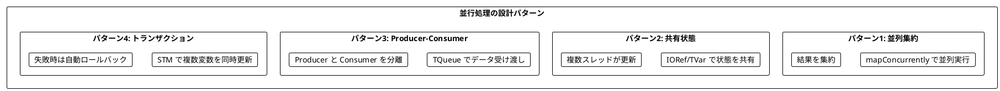

# Part V: 並行処理

本章では、関数型プログラミングにおける並行処理を学びます。Haskell では IORef、Async、STM（Software Transactional Memory）を使って、安全で効率的な並行プログラムを構築できます。

---

## 第10章: 並行・並列処理

### 10.1 並行処理の課題

従来の並行処理には多くの課題があります:

- デッドロック
- 競合状態（Race Condition）
- 共有状態の管理の複雑さ
- スレッドのオーバーヘッド



### 10.2 IORef - 可変参照

**ソースファイル**: `app/haskell/src/Ch10/ConcurrentProcessing.hs`

**IORef** は、IO モナド内で可変参照を提供します。Scala の `Ref` に相当します。

```haskell
import Data.IORef

-- カウンターの作成と使用
example :: IO Int
example = do
    counter <- newIORef 0           -- 初期値 0 の IORef を作成
    atomicModifyIORef' counter (\n -> (n + 3, ()))  -- アトミックに更新
    readIORef counter               -- 現在の値を取得

-- 実行結果: 3
```



#### IORef の主要関数

| 関数 | 説明 | 例 |
|------|------|-----|
| `newIORef initial` | 初期値で IORef を作成 | `newIORef 0` |
| `readIORef ref` | 現在の値を取得 | `readIORef counter` |
| `writeIORef ref value` | 値を設定 | `writeIORef counter 10` |
| `modifyIORef' ref f` | 更新（非アトミック） | `modifyIORef' counter (+1)` |
| `atomicModifyIORef' ref f` | アトミックに更新 | `atomicModifyIORef' counter (\n -> (n+1, n))` |

### 10.3 並列実行

Haskell の `async` ライブラリを使って、IO アクションを並列実行できます。

```haskell
import Control.Concurrent.Async

-- 並列実行
results <- mapConcurrently (\x -> return (x * 2)) [1, 2, 3]
-- results: [2, 4, 6]

-- 複数の IO を並列実行
results <- mapConcurrently id [return 1, return 2, return 3]
-- results: [1, 2, 3]
```

Scala との対応:
- Scala の `parSequence` → Haskell の `mapConcurrently id`
- Scala の `parTraverse` → Haskell の `mapConcurrently`



### 10.4 チェックインのリアルタイム集計

都市へのチェックインをリアルタイムで集計し、ランキングを更新する例です。

```haskell
import Data.Map.Strict (Map)
import qualified Data.Map.Strict as Map

-- 都市と統計のデータ型
newtype City = City { cityName :: String }
    deriving (Show, Eq, Ord)

data CityStats = CityStats
    { csCity     :: City
    , csCheckIns :: Int
    } deriving (Show, Eq)

-- チェックイン状態
type CheckInState = IORef (Map City Int)

-- チェックインを記録
recordCheckIn :: CheckInState -> City -> IO ()
recordCheckIn state city = atomicModifyIORef' state $ \m ->
    (Map.insertWith (+) city 1 m, ())
```

#### トップ都市の計算（純粋関数）

```haskell
import Data.List (sortBy)
import Data.Ord (Down(..))

topCities :: Int -> Map City Int -> [CityStats]
topCities n cityCheckIns =
    take n
    . sortBy (\a b -> compare (Down $ csCheckIns a) (Down $ csCheckIns b))
    . map (uncurry CityStats)
    $ Map.toList cityCheckIns
```

### 10.5 サイコロを並行して振る

```haskell
import System.Random (randomRIO)
import Control.Concurrent.Async (mapConcurrently)

-- サイコロを振る
castDie :: IO Int
castDie = randomRIO (1, 6)

-- 2つのサイコロを並行して振る
castDieConcurrently :: IO [Int]
castDieConcurrently = mapConcurrently id [castDie, castDie]

-- n個のサイコロを並行して振り、合計を返す
sumDiceConcurrently :: Int -> IO Int
sumDiceConcurrently n = sum <$> mapConcurrently id (replicate n castDie)
```

### 10.6 Async - 軽量スレッド

**Async** は、Haskell の軽量スレッドを表します。Scala の `Fiber` に相当します。

```haskell
import Control.Concurrent.Async

-- バックグラウンドで実行
handle <- async (return 42)

-- 結果を待機
result <- wait handle  -- 42

-- キャンセル
cancel handle
```



#### Async の主要関数

| 関数 | 説明 | Scala 相当 |
|------|------|-----------|
| `async action` | バックグラウンドで起動 | `fiber.start` |
| `wait handle` | 完了を待機 | `fiber.join` |
| `cancel handle` | キャンセル | `fiber.cancel` |
| `race a b` | 先に完了した方を返す | `IO.race` |
| `concurrently a b` | 両方を並行実行 | `IO.both` |

### 10.7 Race - 競争

2つの IO を競争させ、先に完了した方の結果を返します。

```haskell
import Control.Concurrent.Async (race)
import Control.Concurrent (threadDelay)

-- 先に完了した方の結果を返す
result <- race (return "fast") (threadDelay 1000000 >> return "slow")
-- result: Left "fast"
```

### 10.8 タイムアウト

```haskell
import System.Timeout (timeout)

-- タイムアウト付きで実行（マイクロ秒単位）
result <- timeout 1000000 (return 42)  -- 1秒
-- result: Just 42

-- タイムアウトした場合
result <- timeout 1000 (threadDelay 1000000 >> return 42)
-- result: Nothing
```

### 10.9 バックグラウンド処理

Async を使って、呼び出し元に制御を返しつつバックグラウンドで処理を続ける設計ができます。

```haskell
data ProcessingCheckIns = ProcessingCheckIns
    { currentRanking :: IO [CityStats]  -- 現在のランキングを取得
    , stopProcessing :: IO ()           -- 処理を停止
    }

processCheckIns :: [City] -> IO ProcessingCheckIns
processCheckIns cities = do
    state <- newCheckInState

    -- バックグラウンドで処理を開始
    handle <- async $ mapM_ (recordCheckIn state) cities

    return ProcessingCheckIns
        { currentRanking = getTopCities 3 state
        , stopProcessing = cancel handle
        }
```



---

## 第11章: STM（Software Transactional Memory）

### 11.1 STM とは

**ソースファイル**: `app/haskell/src/Ch11/STMProcessing.hs`

**STM** は、トランザクションベースの並行処理を提供します。複数の変数を安全に更新できます。



### 11.2 TVar - トランザクショナル変数

**TVar** は STM 用の変数です。IORef と似ていますが、トランザクション内で使用します。

```haskell
import Control.Concurrent.STM

-- TVar の作成と使用
example :: IO Int
example = do
    counter <- newTVarIO 0           -- 初期値 0 の TVar を作成
    atomically $ modifyTVar' counter (+3)  -- トランザクション内で更新
    readTVarIO counter               -- 現在の値を取得
```

#### TVar の主要関数

| 関数 | 説明 | コンテキスト |
|------|------|------------|
| `newTVarIO initial` | TVar を作成 | IO |
| `newTVar initial` | TVar を作成 | STM |
| `readTVar var` | 値を読み取り | STM |
| `writeTVar var value` | 値を書き込み | STM |
| `modifyTVar' var f` | 値を更新 | STM |
| `readTVarIO var` | 値を読み取り | IO |
| `atomically action` | STM を IO で実行 | IO |

### 11.3 銀行口座の例

STM を使った安全な送金の例です。

```haskell
-- 口座を表すデータ型
data Account = Account
    { accountId      :: String
    , accountBalance :: TVar Int
    }

-- 新しい口座を作成
newAccount :: String -> Int -> IO Account
newAccount accId initialBalance = do
    balanceVar <- newTVarIO initialBalance
    return $ Account accId balanceVar

-- 残高を取得
getBalance :: Account -> IO Int
getBalance = readTVarIO . accountBalance

-- 入金
deposit :: Account -> Int -> IO ()
deposit acc amount = atomically $
    modifyTVar' (accountBalance acc) (+ amount)

-- 出金
withdraw :: Account -> Int -> IO (Either String ())
withdraw acc amount = atomically $ do
    balance <- readTVar (accountBalance acc)
    if balance >= amount
        then do
            writeTVar (accountBalance acc) (balance - amount)
            return $ Right ()
        else return $ Left "Insufficient funds"
```

#### 安全な送金（アトミック）

```haskell
-- 送金（アトミック版 - 安全）
transferSafe :: Account -> Account -> Int -> IO (Either String ())
transferSafe from to amount = atomically $ do
    fromBalance <- readTVar (accountBalance from)
    if fromBalance >= amount
        then do
            modifyTVar' (accountBalance from) (subtract amount)
            modifyTVar' (accountBalance to) (+ amount)
            return $ Right ()
        else return $ Left "Insufficient funds"
```



### 11.4 STM のリトライ

`retry` を使うと、条件が満たされるまでトランザクションを待機できます。

```haskell
-- 残高が十分になるまで待機して出金
withdrawWait :: Account -> Int -> IO ()
withdrawWait acc amount = atomically $ do
    balance <- readTVar (accountBalance acc)
    if balance < amount
        then retry  -- 残高が変わるまで待機
        else modifyTVar' (accountBalance acc) (subtract amount)
```

### 11.5 orElse - 代替トランザクション

`orElse` を使うと、最初のトランザクションが `retry` した場合に代替を試行できます。

```haskell
-- 複数の口座から出金を試みる
withdrawFromAny :: [Account] -> Int -> IO (Either String Account)
withdrawFromAny accounts amount = atomically $
    foldr tryAccount (return $ Left "All accounts insufficient") accounts
  where
    tryAccount acc alt = do
        balance <- readTVar (accountBalance acc)
        if balance >= amount
            then do
                modifyTVar' (accountBalance acc) (subtract amount)
                return $ Right acc
            else alt
```

### 11.6 在庫管理の例

```haskell
-- 在庫を表すデータ型
type Inventory = TVar (Map String Int)

-- 在庫を別の倉庫に移動
transferStock :: Inventory -> Inventory -> String -> Int -> IO (Either String ())
transferStock fromInv toInv item amount = atomically $ do
    fromStock <- readTVar fromInv
    let currentAmount = Map.findWithDefault 0 item fromStock
    if currentAmount >= amount
        then do
            modifyTVar' fromInv $ Map.adjust (subtract amount) item
            modifyTVar' toInv $ Map.insertWith (+) item amount
            return $ Right ()
        else return $ Left "Insufficient stock"
```

### 11.7 並行キュー（TQueue）

STM を使った並行キューです。

```haskell
import Control.Concurrent.STM.TQueue

-- キューの作成
q <- newTQueueIO

-- 書き込み
atomically $ writeTQueue q item

-- 読み取り（ブロッキング）
item <- atomically $ readTQueue q

-- 読み取り（ノンブロッキング）
maybeItem <- atomically $ tryReadTQueue q
```

### 11.8 Producer-Consumer パターン

```haskell
-- Producer
producer :: TQueue Int -> Int -> IO ()
producer q n = mapM_ (\i -> atomically $ writeTQueue q i) [1..n]

-- Consumer
consumer :: TQueue Int -> TVar Int -> Int -> IO ()
consumer q sumVar n = replicateM_ n $ do
    item <- atomically $ readTQueue q
    atomically $ modifyTVar' sumVar (+ item)

-- 実行
producerConsumer :: Int -> IO Int
producerConsumer n = do
    q <- newTQueueIO
    sumVar <- newTVarIO 0

    _ <- forkIO $ producer q n
    consumer q sumVar n

    readTVarIO sumVar
```

### 11.9 セマフォ

STM を使ったセマフォの実装です。

```haskell
-- セマフォを表すデータ型
type Semaphore = TVar Int

-- 新しいセマフォを作成
newSemaphore :: Int -> IO Semaphore
newSemaphore = newTVarIO

-- セマフォを取得
acquireSemaphore :: Semaphore -> IO ()
acquireSemaphore sem = atomically $ do
    count <- readTVar sem
    if count > 0
        then writeTVar sem (count - 1)
        else retry  -- 空きができるまで待機

-- セマフォを解放
releaseSemaphore :: Semaphore -> IO ()
releaseSemaphore sem = atomically $ modifyTVar' sem (+1)

-- セマフォで保護されたアクションを実行
withSemaphore :: Semaphore -> IO a -> IO a
withSemaphore sem action = do
    acquireSemaphore sem
    result <- action
    releaseSemaphore sem
    return result
```

---

## まとめ

### Part V で学んだこと



### Scala と Haskell の比較

| 概念 | Scala (cats-effect) | Haskell |
|------|---------------------|---------|
| 可変参照 | `Ref[IO, A]` | `IORef a` / `TVar a` |
| 並列実行 | `parSequence` | `mapConcurrently id` |
| 軽量スレッド | `Fiber` | `Async` |
| バックグラウンド実行 | `fiber.start` | `async` |
| キャンセル | `fiber.cancel` | `cancel` |
| 競争 | `IO.race` | `race` |
| トランザクション | なし（cats-stm） | `STM` |

### キーポイント

1. **IORef**: IO モナド内で可変参照を提供、`atomicModifyIORef'` でアトミック更新
2. **Async**: 軽量スレッドで並行処理、`async` / `wait` / `cancel`
3. **mapConcurrently**: IO のリストを並列実行
4. **STM**: トランザクションベースの並行処理、デッドロックフリー
5. **TVar**: STM 用の変数、`atomically` ブロック内で使用
6. **retry**: 条件が満たされるまでトランザクションを待機
7. **orElse**: 代替トランザクションを試行

### 設計パターン



### 次のステップ

Part VI では、以下のトピックを学びます:

- 実践的なアプリケーション構築
- 外部 API との連携
- テスト戦略

---

## 演習問題

### 問題 1: IORef の基本

以下のプログラムを実装してください。カウンターを 0 から始めて、3回インクリメントした結果を返します。

```haskell
incrementThreeTimes :: IO Int
incrementThreeTimes = ???

-- 期待される動作
-- > incrementThreeTimes
-- 3
```

<details>
<summary>解答</summary>

```haskell
incrementThreeTimes :: IO Int
incrementThreeTimes = do
    counter <- newIORef 0
    atomicModifyIORef' counter (\n -> (n + 1, ()))
    atomicModifyIORef' counter (\n -> (n + 1, ()))
    atomicModifyIORef' counter (\n -> (n + 1, ()))
    readIORef counter
```

</details>

### 問題 2: 並列実行

以下のプログラムを実装してください。3つの IO を並列実行し、結果の合計を返します。

```haskell
sumParallel :: IO Int -> IO Int -> IO Int -> IO Int
sumParallel io1 io2 io3 = ???

-- 期待される動作
-- > sumParallel (return 1) (return 2) (return 3)
-- 6
```

<details>
<summary>解答</summary>

```haskell
import Control.Concurrent.Async (mapConcurrently)

sumParallel :: IO Int -> IO Int -> IO Int -> IO Int
sumParallel io1 io2 io3 = sum <$> mapConcurrently id [io1, io2, io3]
```

</details>

### 問題 3: STM 送金

以下のプログラムを実装してください。複数の口座間で安全に送金します。

```haskell
-- 複数の送金をアトミックに実行
multiTransfer :: [(Account, Account, Int)] -> IO ()
multiTransfer transfers = ???
```

<details>
<summary>解答</summary>

```haskell
multiTransfer :: [(Account, Account, Int)] -> IO ()
multiTransfer transfers = atomically $ mapM_ doTransfer transfers
  where
    doTransfer (from, to, amount) = do
        fromBalance <- readTVar (accountBalance from)
        when (fromBalance >= amount) $ do
            modifyTVar' (accountBalance from) (subtract amount)
            modifyTVar' (accountBalance to) (+ amount)
```

</details>

### 問題 4: タイムアウト付き実行

以下のプログラムを実装してください。指定時間後に Async をキャンセルし、それまでに蓄積された結果を返します。

```haskell
collectFor :: Int -> IO [Int]  -- ミリ秒
collectFor duration = ???

-- 期待される動作
-- 1秒間、100msごとに乱数を生成してリストに追加
-- 約10個の要素が返される
-- > collectFor 1000
-- [42, 17, 83, ...]
```

<details>
<summary>解答</summary>

```haskell
import Control.Concurrent (threadDelay)
import Control.Concurrent.Async (async, cancel)
import System.Random (randomRIO)

collectFor :: Int -> IO [Int]
collectFor duration = do
    collected <- newIORef []

    -- 100msごとに乱数を追加
    handle <- async $ forever $ do
        threadDelay 100000  -- 100ms
        n <- randomRIO (1, 100)
        atomicModifyIORef' collected (\xs -> (xs ++ [n], ()))

    -- 指定時間待機
    threadDelay (duration * 1000)

    -- キャンセル
    cancel handle

    -- 結果を取得
    readIORef collected
```

</details>

### 問題 5: Producer-Consumer

以下のプログラムを実装してください。複数の Producer と Consumer を使用します。

```haskell
-- n個のProducerがそれぞれm個のアイテムを生成
-- 1個のConsumerが全てを消費して合計を返す
multiProducerConsumer :: Int -> Int -> IO Int
multiProducerConsumer numProducers itemsPerProducer = ???
```

<details>
<summary>解答</summary>

```haskell
import Control.Concurrent (forkIO)
import Control.Concurrent.STM
import Control.Monad (replicateM_)

multiProducerConsumer :: Int -> Int -> IO Int
multiProducerConsumer numProducers itemsPerProducer = do
    q <- newTQueueIO
    sumVar <- newTVarIO 0

    -- 複数のProducerを起動
    replicateM_ numProducers $ forkIO $
        mapM_ (\i -> atomically $ writeTQueue q i) [1..itemsPerProducer]

    -- Consumer（全アイテムを消費）
    let totalItems = numProducers * itemsPerProducer
    replicateM_ totalItems $ do
        item <- atomically $ readTQueue q
        atomically $ modifyTVar' sumVar (+ item)

    readTVarIO sumVar
```

</details>
