# Part VI: 実践的なアプリケーション構築とテスト

本章では、これまで学んだ関数型プログラミングの概念を統合し、実践的なアプリケーションを構築します。また、Haskell におけるテスト戦略についても学びます。

---

## 第12章: テスト戦略と実践アプリケーション

### 12.1 TravelGuide アプリケーション

**ソースファイル**: `app/haskell/src/Ch12/TestingStrategies.hs`

旅行ガイドアプリケーションを例に、実践的な FP アプリケーションの構築方法を学びます。

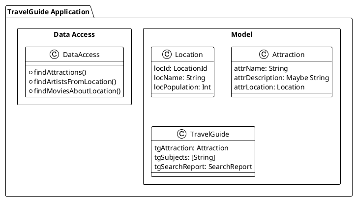

### 12.2 ドメインモデルの定義

```haskell
-- 位置ID（値オブジェクト）
newtype LocationId = LocationId { unLocationId :: String }
    deriving (Show, Eq, Ord)

-- ロケーション
data Location = Location
    { locId         :: LocationId
    , locName       :: String
    , locPopulation :: Int
    } deriving (Show, Eq)

-- アトラクション（観光地）
data Attraction = Attraction
    { attrName        :: String
    , attrDescription :: Maybe String
    , attrLocation    :: Location
    } deriving (Show, Eq)

-- 旅行ガイド
data TravelGuide = TravelGuide
    { tgAttraction   :: Attraction
    , tgSubjects     :: [String]
    , tgSearchReport :: SearchReport
    } deriving (Show, Eq)
```

Scala との対応:

- `opaque type LocationId` → `newtype LocationId`
- `case class` → `data` with record syntax
- `Option[String]` → `Maybe String`

### 12.3 データアクセス層の抽象化

外部データソースへのアクセスをレコード型で抽象化します。

```haskell
-- データアクセスインターフェース
data DataAccess = DataAccess
    { findAttractions         :: String -> AttractionOrdering -> Int -> IO [Attraction]
    , findArtistsFromLocation :: LocationId -> Int -> IO (Either String [MusicArtist])
    , findMoviesAboutLocation :: LocationId -> Int -> IO (Either String [Movie])
    }
```

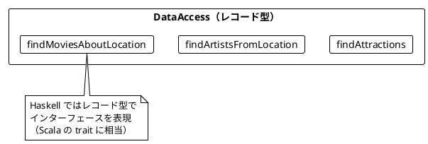

Scala との対応:

- `trait DataAccess` → `data DataAccess = DataAccess { ... }`
- メソッド → レコードのフィールド（関数型）

### 12.4 テスト用スタブの作成

```haskell
-- テスト用データアクセスの作成
mkTestDataAccess :: IO DataAccess
mkTestDataAccess = return DataAccess
    { findAttractions = \name _ limit ->
        return $ take limit
            [ Attraction
                { attrName = "Test Attraction"
                , attrDescription = Just "A test attraction"
                , attrLocation = Location (LocationId "Q123") "Test City" 100000
                }
            | name == "Test" || name == ""
            ]
    , findArtistsFromLocation = \_ limit ->
        return $ Right $ take limit [MusicArtist "Test Artist"]
    , findMoviesAboutLocation = \_ limit ->
        return $ Right $ take limit [Movie "Test Movie"]
    }

-- 失敗するデータアクセス（エラーテスト用）
mkFailingDataAccess :: IO DataAccess
mkFailingDataAccess = return DataAccess
    { findAttractions = \_ _ limit ->
        return $ take limit [testAttraction]
    , findArtistsFromLocation = \_ _ ->
        return $ Left "Network error"
    , findMoviesAboutLocation = \_ _ ->
        return $ Left "Timeout"
    }
```

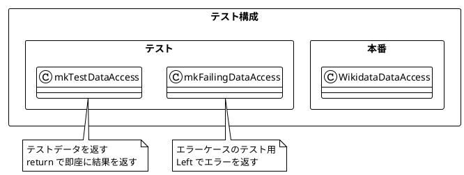

### 12.5 SearchReport の導入

テスト可能性を高めるため、`SearchReport` を導入します。

```haskell
-- 検索レポート
data SearchReport = SearchReport
    { srAttractionsSearched :: Int
    , srErrors              :: [String]
    } deriving (Show, Eq)

-- 旅行ガイド（SearchReport 付き）
data TravelGuide = TravelGuide
    { tgAttraction   :: Attraction
    , tgSubjects     :: [String]
    , tgSearchReport :: SearchReport
    } deriving (Show, Eq)
```

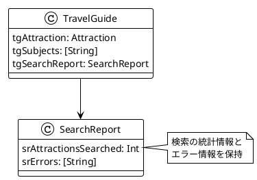

### 12.6 アプリケーションロジック

```haskell
-- 旅行ガイドを取得（SearchReport 付き）
travelGuideWithReport :: DataAccess -> String -> IO (Maybe TravelGuide)
travelGuideWithReport da attractionName = do
    attractions <- findAttractions da attractionName AttrByLocationPopulation 3
    case attractions of
        [] -> return Nothing
        (attraction:_) -> do
            let locId' = locId $ attrLocation attraction
            artistsResult <- findArtistsFromLocation da locId' 2
            moviesResult <- findMoviesAboutLocation da locId' 2

            let errors = collectErrors [artistsResult, moviesResult]
            let artists = either (const []) id artistsResult
            let movies = either (const []) id moviesResult
            let subjects = map artistName artists ++ map movieName movies

            return $ Just TravelGuide
                { tgAttraction = attraction
                , tgSubjects = subjects
                , tgSearchReport = SearchReport (length attractions) errors
                }
  where
    collectErrors :: [Either String a] -> [String]
    collectErrors = foldr (\r acc -> either (:acc) (const acc) r) []
```

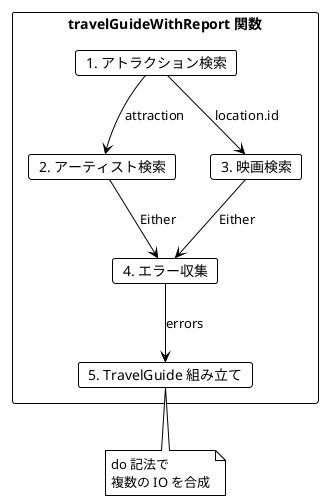

### 12.7 キャッシュの実装

`IORef` を使用したスレッドセーフなキャッシュの実装:

```haskell
import Data.IORef
import Data.Map.Strict (Map)
import qualified Data.Map.Strict as Map

-- キャッシュ付きデータアクセス
type CachedDataAccess = (DataAccess, IORef (Map String [Attraction]))

-- キャッシュ付きデータアクセスの作成
mkCachedDataAccess :: DataAccess -> IO CachedDataAccess
mkCachedDataAccess da = do
    cache <- newIORef Map.empty
    return (da, cache)

-- キャッシュ付きアトラクション検索
cachedFindAttractions :: CachedDataAccess -> String -> AttractionOrdering -> Int -> IO [Attraction]
cachedFindAttractions (da, cache) name ordering limit = do
    let key = name ++ "-" ++ show ordering ++ "-" ++ show limit
    cached <- Map.lookup key <$> readIORef cache
    case cached of
        Just attractions -> return attractions  -- キャッシュヒット
        Nothing -> do
            attractions <- findAttractions da name ordering limit
            atomicModifyIORef' cache (\m -> (Map.insert key attractions m, ()))
            return attractions
```

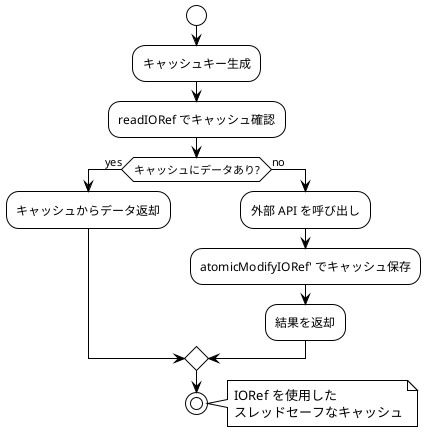

### 12.8 リソース管理（bracket）

Haskell の `bracket` を使用して、安全なリソース管理を実現します。

```haskell
import Control.Exception (bracket)
import System.IO (Handle, openFile, hClose, hGetContents, IOMode(..))

-- リソースを安全に使用
withResource :: IO a -> (a -> IO ()) -> (a -> IO b) -> IO b
withResource acquire release = bracket acquire release

-- ファイルを安全に開く
withFile' :: FilePath -> IOMode -> (Handle -> IO a) -> IO a
withFile' path mode = bracket (openFile path mode) hClose

-- 使用例
readFileContents :: FilePath -> IO (Either String String)
readFileContents path = do
    result <- try $ withFile' path ReadMode hGetContents
    case result of
        Left e  -> return $ Left (show e)
        Right c -> return $ Right c
```

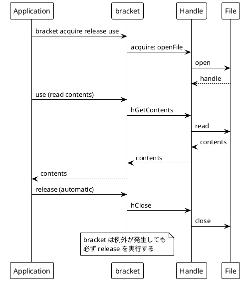

Scala との対応:

- `Resource[IO, A]` → `bracket acquire release use`
- `Resource.make(acquire)(release)` → `bracket acquire release`

### 12.9 純粋関数のテスト

純粋関数は副作用がないため、テストが非常に簡単です。

```haskell
-- 人口でロケーションをフィルタリング（純粋関数）
filterPopularLocations :: [Location] -> Int -> [Location]
filterPopularLocations locations minPopulation =
    filter (\loc -> locPopulation loc >= minPopulation) locations

-- アトラクションを人口でソート（純粋関数）
sortAttractionsByPopulation :: [Attraction] -> [Attraction]
sortAttractionsByPopulation =
    sortBy (\a b -> compare (Down $ locPopulation $ attrLocation a)
                            (Down $ locPopulation $ attrLocation b))

-- バリデーション（純粋関数）
validateLocation :: Location -> Either String Location
validateLocation loc
    | null (unLocationId $ locId loc) = Left "Location ID cannot be empty"
    | null (locName loc) = Left "Location name cannot be empty"
    | locPopulation loc < 0 = Left "Population cannot be negative"
    | otherwise = Right loc
```

### 12.10 HSpec によるユニットテスト

```haskell
import Test.Hspec

spec :: Spec
spec = do
    describe "filterPopularLocations" $ do
        it "filters by minimum population" $ do
            let locs = [ Location (LocationId "1") "A" 100
                       , Location (LocationId "2") "B" 200
                       , Location (LocationId "3") "C" 150
                       ]
            let filtered = filterPopularLocations locs 150
            length filtered `shouldBe` 2

        it "returns empty for high minimum" $ do
            let locs = [Location (LocationId "1") "A" 100]
            filterPopularLocations locs 1000 `shouldBe` []

    describe "validateLocation" $ do
        it "validates correct location" $ do
            let loc = Location (LocationId "Q1") "Tokyo" 14000000
            validateLocation loc `shouldBe` Right loc

        it "rejects empty ID" $ do
            let loc = Location (LocationId "") "Tokyo" 14000000
            validateLocation loc `shouldBe` Left "Location ID cannot be empty"
```

### 12.11 QuickCheck によるプロパティベーステスト

QuickCheck を使用したプロパティベーステスト:

```haskell
import Test.QuickCheck

-- Arbitrary インスタンスの定義
instance Arbitrary LocationId where
    arbitrary = LocationId <$> listOf1 (elements ['a'..'z'])

instance Arbitrary Location where
    arbitrary = Location
        <$> arbitrary
        <*> listOf1 (elements ['A'..'Z'])
        <*> (abs <$> arbitrary)

-- プロパティテスト
spec :: Spec
spec = do
    describe "Property-based tests" $ do
        it "filterPopularLocations result size <= input size" $
            property $ \(locs :: [Location]) (minPop :: Int) ->
                length (filterPopularLocations locs (abs minPop)) <= length locs

        it "filterPopularLocations all results meet minimum" $
            property $ \(locs :: [Location]) (minPop :: Int) ->
                let filtered = filterPopularLocations locs (abs minPop)
                in all (\loc -> locPopulation loc >= abs minPop) filtered

        it "sortAttractionsByPopulation preserves length" $
            property $ \(attrs :: [Attraction]) ->
                length (sortAttractionsByPopulation attrs) == length attrs
```

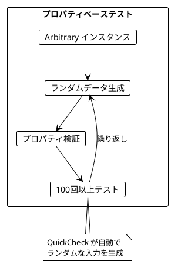

Scala との対応:

- ScalaCheck `Gen[A]` → QuickCheck `Arbitrary a`
- `forAll` → `property`

### 12.12 統合テスト

```haskell
describe "Integration tests" $ do
    it "travelGuide returns guide for valid attraction" $ do
        da <- mkTestDataAccess
        guide <- travelGuide da "Test"
        guide `shouldSatisfy` \g -> case g of
            Just g' -> attrName (tgAttraction g') == "Test Attraction"
            Nothing -> False

    it "travelGuideWithReport collects errors" $ do
        da <- mkFailingDataAccess
        guide <- travelGuideWithReport da "Test"
        case guide of
            Just g -> do
                let errors = srErrors (tgSearchReport g)
                length errors `shouldBe` 2
                errors `shouldContain` ["Network error"]
            Nothing -> expectationFailure "Expected Just"

    it "still returns guide even with errors" $ do
        da <- mkFailingDataAccess
        guide <- travelGuideWithReport da "Test"
        guide `shouldSatisfy` \g -> case g of
            Just _ -> True
            Nothing -> False
```

### 12.13 テストピラミッド

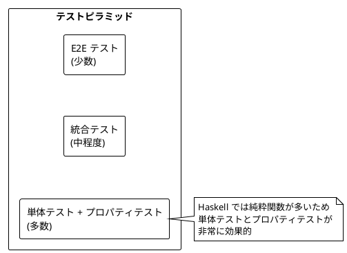

---

## まとめ

### Part VI で学んだこと

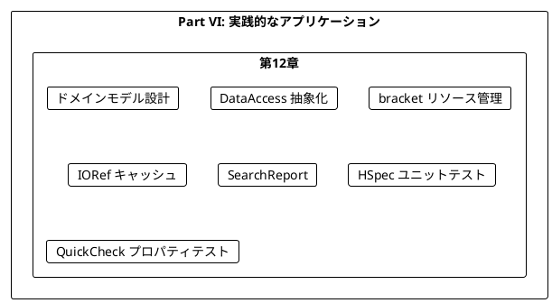

### Scala と Haskell の比較

| 概念 | Scala | Haskell |
|------|-------|---------|
| インターフェース | `trait` | `data` (レコード型) |
| 値オブジェクト | `opaque type` | `newtype` |
| オプショナル | `Option[A]` | `Maybe a` |
| リソース管理 | `Resource[IO, A]` | `bracket` |
| キャッシュ | `Ref[IO, Map]` | `IORef (Map ...)` |
| ユニットテスト | ScalaTest | HSpec |
| プロパティテスト | ScalaCheck | QuickCheck |
| ジェネレータ | `Gen[A]` | `Arbitrary a` |

### キーポイント

1. **抽象化の重要性**: レコード型で外部依存を抽象化
2. **bracket でリソース管理**: 安全なリソースの取得と解放
3. **IORef でキャッシュ**: スレッドセーフな状態管理
4. **Either でエラー処理**: 明示的なエラーハンドリング
5. **SearchReport**: テスト可能性と可観測性の向上
6. **スタブ**: 外部依存を差し替えてテスト
7. **プロパティベーステスト**: QuickCheck でランダム入力による不変条件の検証

### 学習の総括

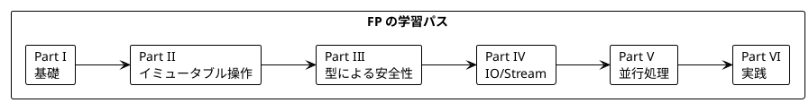

---

## 演習問題

### 問題 1: DataAccess の拡張

以下の要件で `DataAccess` を拡張してください:
- 新しいフィールド `findHotelsNearLocation` を追加
- 戻り値は `IO (Either String [Hotel])`

```haskell
data Hotel = Hotel
    { hotelName     :: String
    , hotelRating   :: Double
    , hotelLocation :: Location
    } deriving (Show, Eq)
```

<details>
<summary>解答</summary>

```haskell
data DataAccess = DataAccess
    { findAttractions         :: String -> AttractionOrdering -> Int -> IO [Attraction]
    , findArtistsFromLocation :: LocationId -> Int -> IO (Either String [MusicArtist])
    , findMoviesAboutLocation :: LocationId -> Int -> IO (Either String [Movie])
    , findHotelsNearLocation  :: LocationId -> Int -> IO (Either String [Hotel])
    }

-- テスト用スタブ
mkTestDataAccess :: IO DataAccess
mkTestDataAccess = return DataAccess
    { -- 既存の実装...
    , findHotelsNearLocation = \_ limit ->
        return $ Right $ take limit
            [Hotel "Test Hotel" 4.5 (Location (LocationId "Q123") "Test City" 100000)]
    }
```

</details>

### 問題 2: プロパティベーステスト

以下の関数に対するプロパティベーステストを書いてください:

```haskell
combineSubjects :: [MusicArtist] -> [Movie] -> [String]
combineSubjects artists movies =
    map artistName artists ++ map movieName movies
```

<details>
<summary>解答</summary>

```haskell
import Test.QuickCheck

instance Arbitrary MusicArtist where
    arbitrary = MusicArtist <$> listOf1 (elements ['A'..'Z'])

instance Arbitrary Movie where
    arbitrary = Movie <$> listOf1 (elements ['A'..'Z'])

spec :: Spec
spec = do
    describe "combineSubjects properties" $ do
        it "length is sum of inputs" $
            property $ \(artists :: [MusicArtist]) (movies :: [Movie]) ->
                length (combineSubjects artists movies) == length artists + length movies

        it "artists come first" $
            property $ \(artists :: [MusicArtist]) (movies :: [Movie]) ->
                let result = combineSubjects artists movies
                    artistNames = map artistName artists
                in take (length artists) result == artistNames

        it "movies come after artists" $
            property $ \(artists :: [MusicArtist]) (movies :: [Movie]) ->
                let result = combineSubjects artists movies
                    movieNames = map movieName movies
                in drop (length artists) result == movieNames
```

</details>

### 問題 3: bracket の実装

データベース接続を安全に管理する関数を実装してください。

```haskell
data Connection = Connection { connId :: Int }

-- 実装してください
withConnection :: IO Connection -> (Connection -> IO a) -> IO a
```

<details>
<summary>解答</summary>

```haskell
import Control.Exception (bracket)

data Connection = Connection { connId :: Int }

-- 接続を開く
openConnection :: IO Connection
openConnection = do
    putStrLn "Opening connection..."
    return $ Connection 1

-- 接続を閉じる
closeConnection :: Connection -> IO ()
closeConnection conn = putStrLn $ "Closing connection " ++ show (connId conn)

-- 安全に接続を使用
withConnection :: (Connection -> IO a) -> IO a
withConnection = bracket openConnection closeConnection

-- 使用例
queryDatabase :: IO String
queryDatabase = withConnection $ \conn -> do
    putStrLn $ "Querying with connection " ++ show (connId conn)
    return "Query result"
```

</details>

### 問題 4: エラー収集

複数の `Either` からエラーを収集する関数を実装してください。

```haskell
collectAllErrors :: [Either String a] -> [String]
collectAllErrors = ???
```

<details>
<summary>解答</summary>

```haskell
collectAllErrors :: [Either String a] -> [String]
collectAllErrors = foldr collect []
  where
    collect (Left err) acc = err : acc
    collect (Right _) acc  = acc

-- または
collectAllErrors :: [Either String a] -> [String]
collectAllErrors results = [err | Left err <- results]

-- テスト
-- collectAllErrors [Right 1, Left "Error1", Right 2, Left "Error2"]
-- => ["Error1", "Error2"]
```

</details>

---

## シリーズ全体の総括

本シリーズでは、「Grokking Functional Programming」の内容に沿って、Haskell で関数型プログラミングの基礎から実践的なアプリケーション構築までを学びました。

### 学んだ主な概念

| Part | 章 | 主な概念 |
|------|-----|----------|
| I | 1-2 | 純粋関数、参照透過性、型推論 |
| II | 3-5 | イミュータブルデータ、高階関数、do 記法 |
| III | 6-7 | Maybe、Either、パターンマッチング |
| IV | 8-9 | IO モナド、遅延リスト（無限ストリーム） |
| V | 10-11 | 並行処理、IORef、Async、STM |
| VI | 12 | 実践アプリケーション、テスト戦略 |

### Haskell の関数型プログラミングの利点

1. **純粋性の保証**: 型システムが純粋関数と IO を分離
2. **遅延評価**: 無限リストが自然に扱える
3. **強力な型システム**: newtype、ADT で安全なモデリング
4. **STM**: デッドロックフリーな並行処理
5. **QuickCheck**: プロパティベーステストの先駆者

### 次のステップ

- Monad Transformers（モナドトランスフォーマー）を学ぶ
- lens ライブラリでデータ操作を効率化
- servant で型安全な Web API を構築
- 実際のプロジェクトで Haskell を適用する
