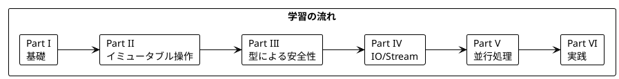

# Grokking Functional Programming Java 版解説

本シリーズは「Grokking Functional Programming」（Michał Płachta 著）の学習コンパニオンとして、関数型プログラミングの概念を **Java + Vavr** で実装しながら日本語で解説します。

---

## 対象読者

- Java の経験があり、関数型プログラミングに興味がある開発者
- Scala を学ばずに Java で FP を実践したい方
- Vavr ライブラリを使った実践的な FP の適用方法を知りたいエンジニア

---

## 記事一覧

### [Part I: 関数型プログラミングの基礎](part-1.md)

関数型プログラミングの基本概念を学びます。

| 章 | トピック |
|----|----------|
| 第1章 | 命令型 vs 関数型、Java での FP 入門 |
| 第2章 | 純粋関数、副作用の排除、テストの容易さ |

**キーワード**: 純粋関数、参照透過性、副作用

---

### [Part II: 関数型スタイルのプログラミング](part-2.md)

イミュータブルなデータ操作と高階関数を学びます。

| 章 | トピック |
|----|----------|
| 第3章 | イミュータブルデータ、Vavr List 操作 |
| 第4章 | 高階関数、map/filter/foldLeft |
| 第5章 | flatMap、For 内包表記（Vavr） |

**キーワード**: イミュータブル、高階関数、flatMap、Vavr コレクション

---

### [Part III: エラーハンドリングと Option/Either](part-3.md)

型安全なエラーハンドリングを学びます。

| 章 | トピック |
|----|----------|
| 第6章 | Option 型、Some/None |
| 第7章 | Either 型、Sealed クラス、パターンマッチング |

**キーワード**: Option、Either、Sealed クラス（Java 17+）

---

### [Part IV: IO と副作用の管理](part-4.md)

IO パターンとストリーム処理を学びます。

| 章 | トピック |
|----|----------|
| 第8章 | IO パターン、Lazy 評価 |
| 第9章 | Stream 処理、無限ストリーム |

**キーワード**: Lazy、Try、Future、ストリーム処理

---

### [Part V: 並行処理](part-5.md)

関数型プログラミングにおける並行処理を学びます。

| 章 | トピック |
|----|----------|
| 第10章 | CompletableFuture、並列ストリーム |

**キーワード**: 並行処理、CompletableFuture、Virtual Threads（Java 21+）

---

### [Part VI: 実践的なアプリケーション構築とテスト](part-6.md)

実践的なアプリケーション構築とテスト戦略を学びます。

| 章 | トピック |
|----|----------|
| 第11章 | TravelGuide アプリ、リソース管理 |
| 第12章 | テスト戦略、プロパティベーステスト |

**キーワード**: Try-with-resources、DataAccess 抽象化、jqwik

---

## 学習パス



---

## 使用ライブラリ

| ライブラリ | 用途 | 対応章 |
|------------|------|--------|
| Java 17+ | 言語 | 全章 |
| Vavr | 関数型データ構造 | 全章 |
| jqwik | プロパティベーステスト | Part VI |
| JUnit 5 | 単体テスト | 全章 |

---

## Vavr とは

[Vavr](https://www.vavr.io/) は Java 向けの関数型プログラミングライブラリです。

### 主な機能

- **イミュータブルコレクション**: `List`, `Set`, `Map`, `Seq`
- **関数型データ型**: `Option`, `Either`, `Try`, `Lazy`, `Future`
- **パターンマッチング**: `Match` API
- **タプル**: `Tuple1` 〜 `Tuple8`
- **関数型インターフェース**: `Function0` 〜 `Function8`

### Scala との対応

| Scala | Vavr (Java) |
|-------|-------------|
| `Option[T]` | `Option<T>` |
| `Either[L, R]` | `Either<L, R>` |
| `Try[T]` | `Try<T>` |
| `List[T]` | `List<T>` |
| `for` 内包表記 | `For.yield()` |
| パターンマッチ | `Match(value).of()` |

---

## リポジトリ構成

```
grokkingfp-examples/
├── app/java/src/main/java/      # Java + Vavr のサンプルコード
├── app/java/src/test/java/      # テストコード
├── app/scala/src/main/scala/    # Scala 版（参考）
└── docs/article/                # 解説記事
    ├── scala/                   # Scala 版解説
    └── java/                    # Java 版解説（本ディレクトリ）
        ├── index.md             # この記事
        ├── part-1.md            # Part I
        ├── part-2.md            # Part II
        ├── part-3.md            # Part III
        ├── part-4.md            # Part IV
        ├── part-5.md            # Part V
        └── part-6.md            # Part VI
```

---

## 関数型プログラミングの利点

本シリーズを通じて、以下の利点を実感できます:

1. **予測可能性** - 純粋関数は同じ入力に対して常に同じ出力
2. **テスト容易性** - 副作用がないためテストが簡単
3. **合成可能性** - 小さな関数を組み合わせて複雑な処理を構築
4. **並行安全性** - イミュータブルデータは競合状態を防ぐ
5. **型安全性** - Option、Either で null や例外を型で表現

---

## Java での FP: Scala との比較

| 特徴 | Scala | Java + Vavr |
|------|-------|-------------|
| 構文の簡潔さ | 非常に簡潔 | やや冗長 |
| 型推論 | 強力 | 限定的 |
| パターンマッチ | 言語機能 | ライブラリ |
| イミュータブル | デフォルト | 明示的に選択 |
| for 内包表記 | 言語機能 | `For.yield()` |
| 学習コスト | 高い | 低い（Java 経験者） |
| エコシステム | Scala 専用 | Java 資産活用可能 |

---

## 参考資料

- [Grokking Functional Programming](https://www.manning.com/books/grokking-functional-programming) - 原著
- [Vavr 公式ドキュメント](https://www.vavr.io/)
- [Vavr GitHub](https://github.com/vavr-io/vavr)
- [jqwik ドキュメント](https://jqwik.net/)
- [Java 公式ドキュメント](https://docs.oracle.com/en/java/)
