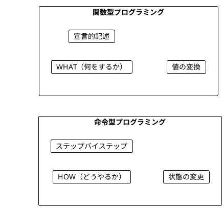
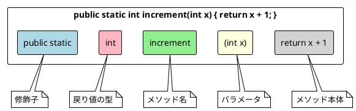
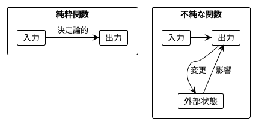
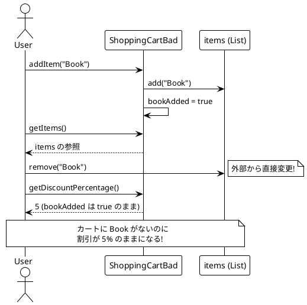
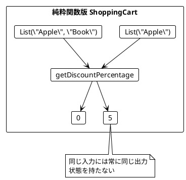
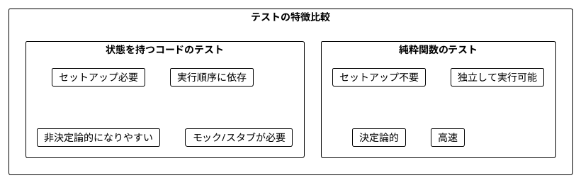
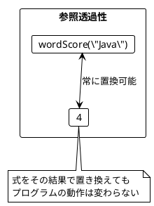
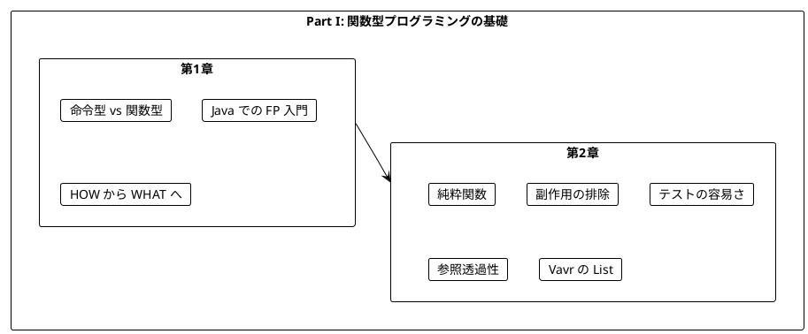

# Part I: 関数型プログラミングの基礎

本章では、関数型プログラミング（FP）の基本概念を **Java + Vavr** で学びます。命令型プログラミングとの違いを理解し、純粋関数の利点を実感することが目標です。

---

## 第1章: 関数型プログラミング入門

### 1.1 命令型 vs 関数型

プログラミングには大きく分けて2つのパラダイムがあります。



**命令型プログラミング**は「どうやるか」を記述します。

**ソースファイル**: `app/java/src/main/java/ch01/IntroJava.java`

```java
// Java: 命令型でワードスコアを計算
public static int calculateScoreImperative(String word) {
    int score = 0;
    for (char c : word.toCharArray()) {
        score++;
    }
    return score;
}
```

**関数型プログラミング**は「何をするか」を記述します。

```java
// Java: 関数型でワードスコアを計算
public static int wordScore(String word) {
    return word.length();
}
```

### 1.2 Java での関数定義

Java での関数（メソッド）定義の基本形を見てみましょう。

```java
public static int increment(int x) {
    return x + 1;
}

public static char getFirstCharacter(String s) {
    return s.charAt(0);
}

public static int wordScore(String word) {
    return word.length();
}
```

### 1.3 関数の構造



### 1.4 学習ポイント

| 概念 | 命令型 | 関数型 |
|------|--------|--------|
| 焦点 | 手順（How） | 結果（What） |
| 状態 | 変更する | 変換する |
| ループ | for/while | map/filter/reduce |
| データ | ミュータブル | イミュータブル |

---

## 第2章: 純粋関数とテスト

### 2.1 純粋関数とは

純粋関数（Pure Function）は以下の特徴を持つ関数です:

1. **同じ入力には常に同じ出力を返す**
2. **副作用がない**（外部状態を変更しない）



### 2.2 純粋関数の例

**ソースファイル**: `app/java/src/main/java/ch02/PureFunctions.java`

```java
// 純粋関数の例
public static int increment(int x) {
    return x + 1;
}

public static int add(int a, int b) {
    return a + b;
}

public static char getFirstCharacter(String s) {
    return s.charAt(0);
}

public static double applyDiscount(double x) {
    return x * 95.0 / 100.0;
}
```

**純粋ではない関数の例**:

```java
// 不純な関数 - Math.random() は毎回異なる値を返す
public static double randomPart(double x) {
    return x * Math.random();
}

// 不純な関数 - 現在時刻は毎回異なる
public static long currentTime() {
    return System.currentTimeMillis();
}
```

### 2.3 ショッピングカートの例

状態を持つクラスの問題点を見てみましょう。

**ソースファイル**: `app/java/src/main/java/ch02/ShoppingCartBad.java`

#### 問題のあるコード

```java
public class ShoppingCartBad {
    private List<String> items = new ArrayList<>();
    private boolean bookAdded = false;

    public void addItem(String item) {
        items.add(item);
        if (item.equals("Book")) {
            bookAdded = true;
        }
    }

    public int getDiscountPercentage() {
        if (bookAdded) {
            return 5;
        } else {
            return 0;
        }
    }

    public List<String> getItems() {
        return items;  // 問題: 内部状態への参照を返している
    }
}
```



#### 純粋関数による解決

**ソースファイル**: `app/java/src/main/java/ch02/ShoppingCart.java`

```java
import io.vavr.collection.List;

public class ShoppingCart {
    /**
     * 割引率を計算する純粋関数
     */
    public static int getDiscountPercentage(List<String> items) {
        if (items.contains("Book")) {
            return 5;
        } else {
            return 0;
        }
    }
}
```



### 2.4 Vavr の List を使ったイミュータブル操作

Vavr の `List` はイミュータブルなデータ構造です。

```java
import io.vavr.collection.List;

// イミュータブルな操作
List<String> cart1 = List.of("Apple");
List<String> cart2 = cart1.append("Book");  // 新しいリストを作成
List<String> cart3 = cart2.append("Lemon"); // 新しいリストを作成

// cart1 は変更されていない
System.out.println(cart1); // List(Apple)
System.out.println(cart2); // List(Apple, Book)
System.out.println(cart3); // List(Apple, Book, Lemon)

// 割引率を計算
ShoppingCart.getDiscountPercentage(cart1); // 0
ShoppingCart.getDiscountPercentage(cart2); // 5
ShoppingCart.getDiscountPercentage(cart3); // 5
```

### 2.5 チップ計算の例

**ソースファイル**: `app/java/src/main/java/ch02/TipCalculator.java`

```java
import io.vavr.collection.List;

public class TipCalculator {
    /**
     * チップ率を計算する純粋関数
     */
    public static int getTipPercentage(List<String> names) {
        if (names.size() > 5) {
            return 20;
        } else if (names.size() > 0) {
            return 10;
        } else {
            return 0;
        }
    }
}
```

この関数は:
- 6人以上のグループ → 20% のチップ
- 1-5人のグループ → 10% のチップ
- 0人（空リスト） → 0% のチップ

### 2.6 純粋関数のテスト

純粋関数は非常にテストしやすいです。

**ソースファイル**: `app/java/src/test/java/ch01/IntroJavaTest.java`

```java
@Test
@DisplayName("increment は入力に1を加える")
void incrementAddOne() {
    assertThat(IntroJava.increment(0)).isEqualTo(1);
    assertThat(IntroJava.increment(6)).isEqualTo(7);
    assertThat(IntroJava.increment(-1)).isEqualTo(0);
    assertThat(IntroJava.increment(Integer.MAX_VALUE - 1))
            .isEqualTo(Integer.MAX_VALUE);
}

@Test
@DisplayName("isEven は偶数を判定")
void isEvenChecksEvenness() {
    assertThat(IntroJava.isEven(0)).isTrue();
    assertThat(IntroJava.isEven(2)).isTrue();
    assertThat(IntroJava.isEven(1)).isFalse();
    assertThat(IntroJava.isEven(-2)).isTrue();
    assertThat(IntroJava.isEven(-3)).isFalse();
}
```



### 2.7 文字 'a' を除外するワードスコア

より複雑な例を見てみましょう。

```java
public static int wordScoreWithoutA(String word) {
    return word.replace("a", "").length();
}

// テスト
assertThat(wordScoreWithoutA("Scala")).isEqualTo(3);    // "Scl" → 3文字
assertThat(wordScoreWithoutA("function")).isEqualTo(8); // 'a' なし → 8文字
assertThat(wordScoreWithoutA("")).isEqualTo(0);         // 空文字 → 0文字
```

### 2.8 参照透過性

純粋関数は**参照透過性（Referential Transparency）**を持ちます。

> 式をその評価結果で置き換えても、プログラムの意味が変わらないこと

```java
// 参照透過性の例
int score1 = wordScore("Java");
int score2 = wordScore("Java");
// score1 と score2 は常に同じ値（4）

// 以下の2つは同等
int total1 = wordScore("Java") + wordScore("Scala");
int total2 = 4 + 5;  // wordScore の結果で置き換え可能
```



---

## Java と Vavr の対応表

| 概念 | 標準 Java | Vavr |
|------|-----------|------|
| イミュータブルリスト | `List.of()` (Java 9+) | `io.vavr.collection.List` |
| 空リスト | `List.of()` | `List.empty()` |
| 要素追加 | 不可（イミュータブル） | `list.append(x)` |
| 要素削除 | 不可（イミュータブル） | `list.remove(x)` |
| 要素検索 | `list.contains(x)` | `list.contains(x)` |

---

## まとめ

### Part I で学んだこと



### キーポイント

1. **関数型プログラミング**は「何をするか」を宣言的に記述する
2. **純粋関数**は同じ入力に対して常に同じ出力を返す
3. **副作用**を避けることでコードの予測可能性が向上する
4. **純粋関数**はテストが非常に簡単
5. **参照透過性**により、コードの理解と推論が容易になる
6. **Vavr の List** を使うとイミュータブルなデータ操作が簡単

### 次のステップ

Part II では、以下のトピックを学びます:

- イミュータブルなデータ操作（Vavr コレクション）
- 高階関数（関数を値として扱う）
- `flatMap` とネスト構造の平坦化
- Vavr の `For.yield()` による内包表記

---

## 演習問題

### 問題 1: 純粋関数の識別

以下の関数のうち、純粋関数はどれですか?

```java
// A
public static int doubleValue(int x) {
    return x * 2;
}

// B
private static int counter = 0;
public static int incrementCounter() {
    counter++;
    return counter;
}

// C
public static String greet(String name) {
    return "Hello, " + name + "!";
}

// D
public static long currentTime() {
    return System.currentTimeMillis();
}
```

<details>
<summary>解答</summary>

**A と C は純粋関数**です。

- A: 同じ入力に対して常に同じ出力を返し、副作用がない
- B: 外部変数 `counter` を変更する副作用がある（不純）
- C: 同じ入力に対して常に同じ出力を返し、副作用がない
- D: 呼び出すたびに異なる値を返す（不純）

</details>

### 問題 2: 純粋関数への書き換え

以下の不純な関数を純粋関数に書き換えてください。

```java
public class Counter {
    private int value = 0;

    public int increment() {
        value++;
        return value;
    }
}
```

<details>
<summary>解答</summary>

```java
public static int increment(int value) {
    return value + 1;
}

// 使用例
int v1 = 0;
int v2 = increment(v1);  // 1
int v3 = increment(v2);  // 2
```

状態を外部に持ち、関数は値を受け取って新しい値を返すだけにします。

</details>

### 問題 3: Vavr List を使ったテストを書く

以下の関数に対するテストケースを JUnit + AssertJ で書いてください。

```java
public static boolean hasDiscount(List<String> items) {
    return items.contains("Book") || items.contains("Magazine");
}
```

<details>
<summary>解答</summary>

```java
@Test
void hasDiscountTest() {
    // 空のリスト
    assertThat(hasDiscount(List.empty())).isFalse();

    // Book のみ
    assertThat(hasDiscount(List.of("Book"))).isTrue();

    // Magazine のみ
    assertThat(hasDiscount(List.of("Magazine"))).isTrue();

    // 両方
    assertThat(hasDiscount(List.of("Book", "Magazine"))).isTrue();

    // どちらもない
    assertThat(hasDiscount(List.of("Apple", "Orange"))).isFalse();

    // 混在
    assertThat(hasDiscount(List.of("Apple", "Book", "Orange"))).isTrue();
}
```

</details>

---

## 実行方法

### テストの実行

```bash
cd app/java
./gradlew test
```

### サンプルコードの実行

```bash
cd app/java
./gradlew run -PmainClass=ch01.IntroJava
./gradlew run -PmainClass=ch02.PureFunctions
./gradlew run -PmainClass=ch02.ShoppingCart
./gradlew run -PmainClass=ch02.TipCalculator
```
