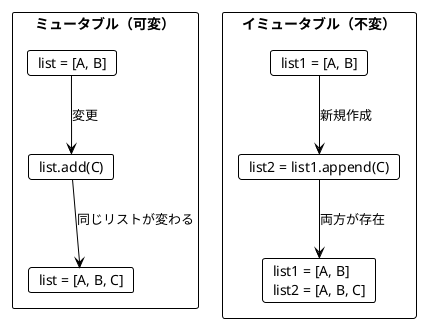
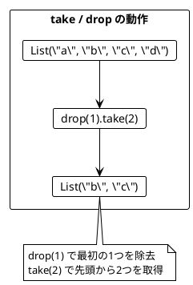
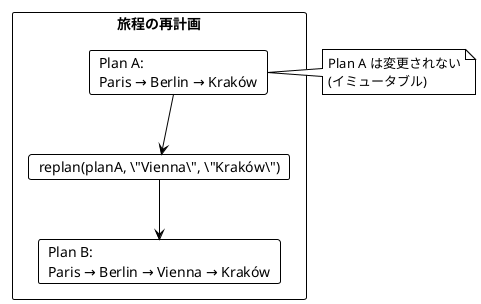
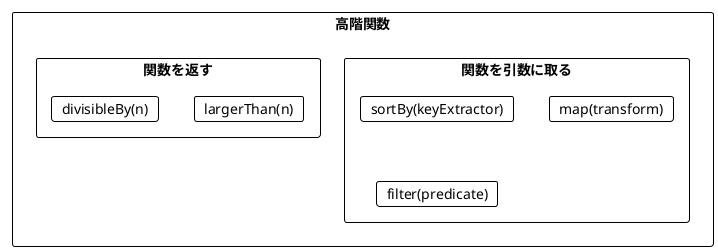
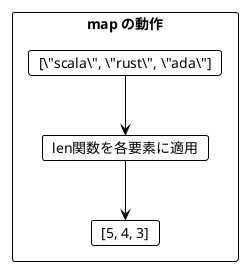
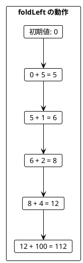
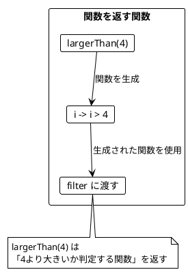
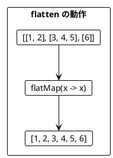
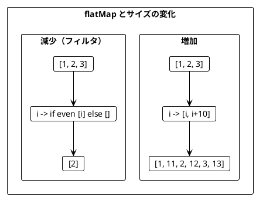
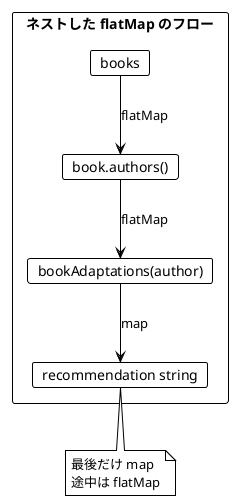

# Part II: 関数型スタイルのプログラミング

本章では、関数型プログラミングの核心となるテクニックを学びます。イミュータブルなデータ操作、高階関数、そして `flatMap` による複雑なデータ変換を Vavr を使って習得します。

---

## 第3章: イミュータブルなデータ操作

### 3.1 イミュータブルとは

イミュータブル（不変）とは、一度作成されたデータが変更されないことを意味します。データを「変更」する代わりに、新しいデータを「作成」します。



### 3.2 Vavr List の基本操作

**ソースファイル**: `app/java/src/main/java/ch03/ImmutableList.java`

#### append - 要素の追加

```java
List<String> appleBook = List.of("Apple", "Book");
List<String> appleBookMango = appleBook.append("Mango");

assert appleBook.size() == 2;       // 元のリストは変わらない
assert appleBookMango.size() == 3;  // 新しいリストが作成される
assert appleBookMango.equals(List.of("Apple", "Book", "Mango"));
```

#### take / drop - リストの切り出し

```java
public static List<String> firstTwo(List<String> list) {
    return list.take(2);
}

public static List<String> lastTwo(List<String> list) {
    return list.takeRight(2);
}

public static <T> List<T> slice(List<T> list, int start, int end) {
    return list.drop(start).take(end - start);
}

// 使用例
List<String> fruits = List.of("a", "b", "c", "d");
assert firstTwo(fruits).equals(List.of("a", "b"));
assert lastTwo(fruits).equals(List.of("c", "d"));
assert slice(fruits, 1, 3).equals(List.of("b", "c"));
```



### 3.3 リストの変換例

**ソースファイル**: `app/java/src/main/java/ch03/ImmutableList.java`

```java
// 最初の2要素を末尾に移動
public static List<String> movedFirstTwoToTheEnd(List<String> list) {
    List<String> firstTwo = list.take(2);
    List<String> withoutFirstTwo = list.drop(2);
    return withoutFirstTwo.appendAll(firstTwo);
}

assert movedFirstTwoToTheEnd(List.of("a", "b", "c")).equals(List.of("c", "a", "b"));

// 最後の要素の前に挿入
public static List<String> insertedBeforeLast(List<String> list, String element) {
    List<String> withoutLast = list.dropRight(1);
    List<String> last = list.takeRight(1);
    return withoutLast.append(element).appendAll(last);
}

assert insertedBeforeLast(List.of("a", "b"), "c").equals(List.of("a", "c", "b"));
```

### 3.4 旅程の再計画

**ソースファイル**: `app/java/src/main/java/ch03/Itinerary.java`

旅行の計画変更をイミュータブルに行う例です。

```java
public static List<String> replan(List<String> plan, String newCity, String beforeCity) {
    int beforeCityIndex = plan.indexOf(beforeCity);
    List<String> citiesBefore = plan.take(beforeCityIndex);
    List<String> citiesAfter = plan.drop(beforeCityIndex);
    return citiesBefore.append(newCity).appendAll(citiesAfter);
}

List<String> planA = List.of("Paris", "Berlin", "Kraków");
List<String> planB = replan(planA, "Vienna", "Kraków");

assert planB.equals(List.of("Paris", "Berlin", "Vienna", "Kraków"));
assert planA.equals(List.of("Paris", "Berlin", "Kraków"));  // 元の計画は変わらない!
```



---

## 第4章: 関数を値として扱う

### 4.1 高階関数とは

高階関数（Higher-Order Function）とは、以下のいずれかを満たす関数です:

1. 関数を引数として受け取る
2. 関数を戻り値として返す



### 4.2 関数を引数として渡す

**ソースファイル**: `app/java/src/main/java/ch04/HigherOrderFunctions.java`

#### sortBy - ソート基準を関数で指定

```java
public static int score(String word) {
    return word.replaceAll("a", "").length();
}

List<String> words = List.of("rust", "java");
List<String> sortedWords = words.sortBy(HigherOrderFunctions::score);

assert sortedWords.equals(List.of("java", "rust"));
// java: 2文字 (j, v), rust: 4文字 (r, u, s, t)
```

#### map - 各要素を変換

```java
public static int len(String s) {
    return s.length();
}

List<Integer> lengths = List.of("scala", "rust", "ada").map(HigherOrderFunctions::len);
assert lengths.equals(List.of(5, 4, 3));

public static int doubleValue(int i) {
    return 2 * i;
}

List<Integer> doubles = List.of(5, 1, 2, 4, 0).map(HigherOrderFunctions::doubleValue);
assert doubles.equals(List.of(10, 2, 4, 8, 0));
```



#### filter - 条件に合う要素を抽出

```java
public static boolean isOdd(int i) {
    return i % 2 == 1;
}

List<Integer> odds = List.of(5, 1, 2, 4, 0).filter(HigherOrderFunctions::isOdd);
assert odds.equals(List.of(5, 1));

public static boolean isLargerThan4(int i) {
    return i > 4;
}

List<Integer> large = List.of(5, 1, 2, 4, 0).filter(HigherOrderFunctions::isLargerThan4);
assert large.equals(List.of(5));
```

#### foldLeft - 畳み込み

```java
List<Integer> numbers = List.of(5, 1, 2, 4, 100);
int sum = numbers.foldLeft(0, (acc, i) -> acc + i);
assert sum == 112;

int max = List.of(5, 1, 2, 4, 15).foldLeft(Integer.MIN_VALUE, (m, i) -> i > m ? i : m);
assert max == 15;
```



### 4.3 record とメソッド参照

**ソースファイル**: `app/java/src/main/java/ch04/ProgrammingLanguage.java`

Java の record を使ったイミュータブルなデータクラスの例です。

```java
public record ProgrammingLanguage(String name, int year) {}

ProgrammingLanguage java = new ProgrammingLanguage("Java", 1995);
ProgrammingLanguage scala = new ProgrammingLanguage("Scala", 2004);

List<ProgrammingLanguage> languages = List.of(java, scala);

// フィールドにアクセス
List<String> names = languages.map(ProgrammingLanguage::name);
assert names.equals(List.of("Java", "Scala"));

// 条件でフィルタ
List<ProgrammingLanguage> young = languages.filter(lang -> lang.year() > 2000);
assert young.equals(List.of(scala));
```

### 4.4 関数を返す関数

**ソースファイル**: `app/java/src/main/java/ch04/HigherOrderFunctions.java`

```java
public static Predicate<Integer> largerThan(int n) {
    return i -> i > n;
}

List<Integer> large = List.of(5, 1, 2, 4, 0).filter(largerThan(4));
assert large.equals(List.of(5));

List<Integer> medium = List.of(5, 1, 2, 4, 0).filter(largerThan(1));
assert medium.equals(List.of(5, 2, 4));
```



### 4.5 ワードスコアリングの例

**ソースファイル**: `app/java/src/main/java/ch04/WordScoring.java`

複数のスコアリングロジックを組み合わせる例です。

```java
public static int score(String word) {
    return word.replaceAll("a", "").length();
}

public static int bonus(String word) {
    return word.contains("c") ? 5 : 0;
}

public static int penalty(String word) {
    return word.contains("s") ? 7 : 0;
}

List<String> words = List.of("ada", "haskell", "scala", "java", "rust");

// 関数を引数として渡す
public static List<String> rankedWords(Function<String, Integer> wordScore, List<String> words) {
    return words.sortBy(wordScore).reverse();
}

// 基本スコアでランキング
List<String> ranking1 = rankedWords(WordScoring::score, words);
assert ranking1.equals(List.of("haskell", "rust", "scala", "java", "ada"));

// ボーナス付きスコアでランキング
List<String> ranking2 = rankedWords(w -> score(w) + bonus(w), words);
assert ranking2.equals(List.of("scala", "haskell", "rust", "java", "ada"));

// ボーナスとペナルティ付きスコアでランキング
List<String> ranking3 = rankedWords(w -> score(w) + bonus(w) - penalty(w), words);
// java が1位
```

---

## 第5章: flatMap とネスト構造

### 5.1 flatten と flatMap

**ソースファイル**: `app/java/src/main/java/ch05/FlatMapExamples.java`

#### flatten - ネストしたリストを平坦化

```java
List<List<Integer>> nested = List.of(
    List.of(1, 2),
    List.of(3, 4, 5),
    List.of(6)
);

// flatMap で平坦化
List<Integer> flat = nested.flatMap(x -> x);
// List(1, 2, 3, 4, 5, 6)
```



#### flatMap = map + flatten

```java
// 書籍と映画化の例
public record Book(String title, List<String> authors) {}

List<Book> books = List.of(
    new Book("FP in Scala", List.of("Chiusano", "Bjarnason")),
    new Book("The Hobbit", List.of("Tolkien"))
);

// map だけだとネストする
List<List<String>> authorLists = books.map(Book::authors);
// List(List("Chiusano", "Bjarnason"), List("Tolkien"))

// flatMap で平坦化
List<String> authors = books.flatMap(Book::authors);
// List("Chiusano", "Bjarnason", "Tolkien")
```

### 5.2 flatMap によるリストサイズの変化

```java
// 要素数が増える
List.of(1, 2, 3).flatMap(i -> List.of(i, i + 10));
// List(1, 11, 2, 12, 3, 13) - 6要素

// 要素数が同じ
List.of(1, 2, 3).flatMap(i -> List.of(i * 2));
// List(2, 4, 6) - 3要素

// 要素数が減る（フィルタリング効果）
List.of(1, 2, 3).flatMap(i -> i % 2 == 0 ? List.of(i) : List.empty());
// List(2) - 1要素
```



### 5.3 ネストした flatMap

**ソースファイル**: `app/java/src/main/java/ch05/BookAdaptations.java`

複数のリストを組み合わせる場合、flatMap をネストします。

```java
public record Book(String title, List<String> authors) {}
public record Movie(String title) {}

public static List<Movie> bookAdaptations(String author) {
    if ("Tolkien".equals(author)) {
        return List.of(
            new Movie("An Unexpected Journey"),
            new Movie("The Desolation of Smaug")
        );
    }
    return List.empty();
}

List<Book> books = List.of(
    new Book("FP in Scala", List.of("Chiusano", "Bjarnason")),
    new Book("The Hobbit", List.of("Tolkien"))
);

// ネストした flatMap
List<String> recommendations = books.flatMap(book ->
    book.authors().flatMap(author ->
        bookAdaptations(author).map(movie ->
            String.format("You may like %s, because you liked %s's %s",
                movie.title(), author, book.title())
        )
    )
);

// 結果:
// List(
//   "You may like An Unexpected Journey, because you liked Tolkien's The Hobbit",
//   "You may like The Desolation of Smaug, because you liked Tolkien's The Hobbit"
// )
```



### 5.4 Java での for 内包表記の代替

Scala の for 内包表記に相当する機能は、Java では flatMap のチェーンで表現します。

```java
// flatMap/map 版
List<String> c1 = books.flatMap(book ->
    book.authors().flatMap(author ->
        bookAdaptations(author).map(movie ->
            String.format("You may like %s, because you liked %s's %s",
                movie.title(), author, book.title())
        )
    )
);

// Vavr の Iterator を使った版（同等）
List<String> c2 = Iterator.ofAll(books)
    .flatMap(book -> Iterator.ofAll(book.authors())
        .flatMap(author -> Iterator.ofAll(bookAdaptations(author))
            .map(movie -> String.format(
                "You may like %s, because you liked %s's %s",
                movie.title(), author, book.title()))))
    .toList();
```

### 5.5 円内の点の判定

**ソースファイル**: `app/java/src/main/java/ch05/PointsInsideCircles.java`

flatMap を使った組み合わせ生成とフィルタリングの例です。

```java
public record Point(int x, int y) {}

List<Point> points = List.of(new Point(5, 2), new Point(1, 1));
List<Integer> radiuses = List.of(2, 1);

public static boolean isInside(Point point, int radius) {
    return radius * radius >= point.x() * point.x() + point.y() * point.y();
}

// 全組み合わせを生成
List<String> allCombinations = radiuses.flatMap(r ->
    points.map(point ->
        String.format("%s is within radius %d: %s", point, r, isInside(point, r))
    )
);

// 結果:
// List(
//   "(5, 2) is within radius 2: false",
//   "(1, 1) is within radius 2: true",
//   "(5, 2) is within radius 1: false",
//   "(1, 1) is within radius 1: false"
// )
```

#### ガード式相当のフィルタリング

```java
// 円内の点のみを取得（ガード式相当）
List<String> inside = radiuses.flatMap(r ->
    points.filter(point -> isInside(point, r))
        .map(point -> String.format("%s is inside circle with radius %d", point, r))
);
```

---

## まとめ

### 学んだこと

1. **イミュータブルなデータ操作**
   - Vavr の `List` は不変
   - `take`, `drop`, `append`, `appendAll` で新しいリストを作成
   - 元のデータは変更されない

2. **高階関数**
   - `map`: 各要素を変換
   - `filter`: 条件に合う要素を抽出
   - `foldLeft`: 畳み込み
   - `sortBy`: ソート基準を関数で指定

3. **関数を返す関数**
   - `Predicate<T>` を返すことで再利用可能なフィルタを作成
   - 部分適用のような効果を得られる

4. **flatMap**
   - ネストしたリストを平坦化
   - `map` + `flatten` の組み合わせ
   - リストサイズが増減する変換に対応

### Scala との対応

| Scala | Java + Vavr |
|-------|-------------|
| `List` | `io.vavr.collection.List` |
| `slice(a, b)` | `drop(a).take(b - a)` |
| `appended` | `append` |
| `appendedAll` | `appendAll` |
| `sortBy` | `sortBy` |
| `map` | `map` |
| `filter` | `filter` |
| `foldLeft` | `foldLeft` |
| `flatMap` | `flatMap` |
| `for {...} yield` | `flatMap` のチェーン |

### 次のパート

Part III では、エラーハンドリングについて学びます。`Option` と `Either` を使った安全なプログラミング手法を紹介します。
