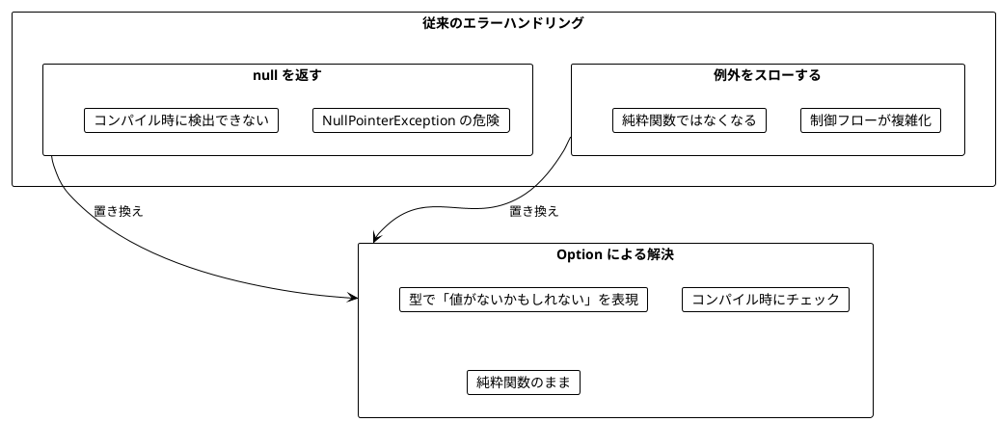
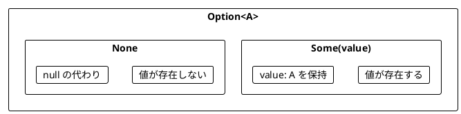
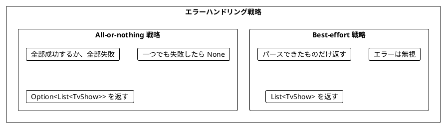
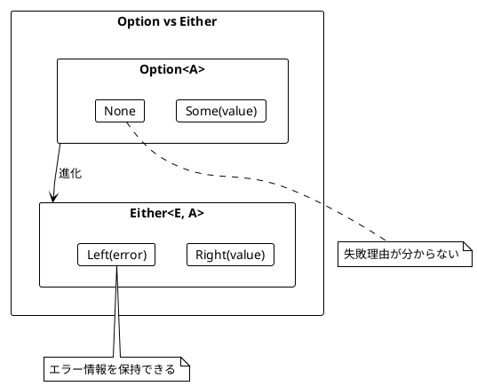
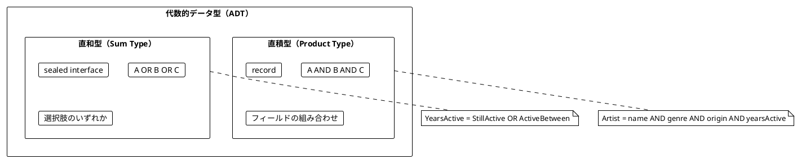

# Part III: エラーハンドリングと Option/Either

本章では、関数型プログラミングにおける安全なエラーハンドリングを学びます。`null` や例外に頼らず、Vavr の `Option` と `Either` を使って型安全にエラーを扱う方法を習得します。

---

## 第6章: Option 型による安全なエラーハンドリング

### 6.1 なぜ Option が必要か

従来のエラーハンドリングには問題があります。



### 6.2 Option の基本

`Option<A>` は「`A` 型の値があるか、ないか」を表す型です。



**ソースファイル**: `app/java/src/main/java/ch06/OptionBasics.java`

```java
import io.vavr.control.Option;

// Some: 値が存在する
Option<Integer> some = Option.some(42);

// None: 値が存在しない
Option<Integer> none = Option.none();

// null から安全に作成
Option<String> fromNull = Option.of(maybeNull); // null なら None
```

### 6.3 TV番組のパース例

**ソースファイル**: `app/java/src/main/java/ch06/TvShowParser.java`

TV番組の文字列をパースする例で Option の使い方を学びます。

```java
public record TvShow(String title, int start, int end) {}

// 入力例: "Breaking Bad (2008-2013)"
// 期待する出力: TvShow("Breaking Bad", 2008, 2013)
```

#### 例外を使う方法（問題あり）

```java
public static TvShow parseShowUnsafe(String rawShow) {
    int bracketOpen = rawShow.indexOf('(');
    int bracketClose = rawShow.indexOf(')');
    int dash = rawShow.indexOf('-');

    String name = rawShow.substring(0, bracketOpen).trim();
    int yearStart = Integer.parseInt(rawShow.substring(bracketOpen + 1, dash));
    int yearEnd = Integer.parseInt(rawShow.substring(dash + 1, bracketClose));

    return new TvShow(name, yearStart, yearEnd);
}

// 正常ケース
parseShowUnsafe("Breaking Bad (2008-2013)");  // TvShow("Breaking Bad", 2008, 2013)

// 異常ケース → 例外がスローされる!
parseShowUnsafe("Chernobyl (2019)");           // StringIndexOutOfBoundsException
parseShowUnsafe("The Wire 2002-2008");         // StringIndexOutOfBoundsException
```

#### Option を使う方法

```java
public static Option<TvShow> parseShow(String rawShow) {
    return extractName(rawShow).flatMap(name ->
        extractYearStart(rawShow).orElse(() -> extractSingleYear(rawShow)).flatMap(yearStart ->
            extractYearEnd(rawShow).orElse(() -> extractSingleYear(rawShow)).map(yearEnd ->
                new TvShow(name, yearStart, yearEnd)
            )
        )
    );
}

// 正常ケース
parseShow("Breaking Bad (2008-2013)");  // Some(TvShow("Breaking Bad", 2008, 2013))

// 異常ケース → None が返される（例外なし）
parseShow("The Wire 2002-2008");         // None
```

### 6.4 小さな関数から組み立てる

複雑なパース処理を小さな関数に分解します。

```java
// 名前を抽出
public static Option<String> extractName(String rawShow) {
    int bracketOpen = rawShow.indexOf('(');
    if (bracketOpen > 0) {
        return Option.some(rawShow.substring(0, bracketOpen).trim());
    }
    return Option.none();
}

// 開始年を抽出
public static Option<Integer> extractYearStart(String rawShow) {
    int bracketOpen = rawShow.indexOf('(');
    int dash = rawShow.indexOf('-');

    if (bracketOpen != -1 && dash > bracketOpen + 1) {
        String yearStr = rawShow.substring(bracketOpen + 1, dash);
        return parseYear(yearStr);
    }
    return Option.none();
}

// 文字列を年（整数）にパース
public static Option<Integer> parseYear(String yearStr) {
    try {
        return Option.some(Integer.parseInt(yearStr.trim()));
    } catch (NumberFormatException e) {
        return Option.none();
    }
}
```

### 6.5 orElse によるフォールバック

`orElse` を使って、最初の Option が `None` の場合に代替を試すことができます。

```java
Option<Integer> seven = Option.some(7);
Option<Integer> eight = Option.some(8);
Option<Integer> none = Option.none();

seven.orElse(eight);  // Some(7) - 最初が Some なのでそのまま
none.orElse(eight);   // Some(8) - 最初が None なので代替を使用
seven.orElse(none);   // Some(7)
none.orElse(none);    // None
```

#### 単年の番組に対応する

「Chernobyl (2019)」のような単年の番組をパースできるようにします。

```java
public static Option<Integer> extractSingleYear(String rawShow) {
    int dash = rawShow.indexOf('-');
    int bracketOpen = rawShow.indexOf('(');
    int bracketClose = rawShow.indexOf(')');

    if (dash == -1 && bracketOpen != -1 && bracketClose > bracketOpen + 1) {
        String yearStr = rawShow.substring(bracketOpen + 1, bracketClose);
        return parseYear(yearStr);
    }
    return Option.none();
}

// これで単年の番組もパースできる
parseShow("Chernobyl (2019)");  // Some(TvShow("Chernobyl", 2019, 2019))
```

### 6.6 Option の主要メソッド

| メソッド | 説明 | 例 |
|----------|------|-----|
| `map` | 値があれば変換 | `Some(5).map(x -> x * 2)` → `Some(10)` |
| `flatMap` | 値があれば Option を返す関数を適用 | `Some(5).flatMap(x -> Some(x * 2))` → `Some(10)` |
| `filter` | 条件を満たさなければ None | `Some(5).filter(x -> x > 10)` → `None` |
| `orElse` | None なら代替を使用 | `None.orElse(Some(5))` → `Some(5)` |
| `getOrElse` | None ならデフォルト値 | `None.getOrElse(0)` → `0` |
| `toList` | List に変換 | `Some(5).toList()` → `List(5)` |
| `toEither` | Either に変換 | `Some(5).toEither("error")` → `Right(5)` |

```java
Option<Integer> year = Option.some(996);
Option<Integer> noYear = Option.none();

// map
year.map(y -> y * 2);    // Some(1992)
noYear.map(y -> y * 2);  // None

// flatMap
year.flatMap(y -> Option.some(y * 2));    // Some(1992)
noYear.flatMap(y -> Option.some(y * 2));  // None

// filter
year.filter(y -> y < 2020);   // Some(996)
year.filter(y -> y > 2020);   // None

// getOrElse
year.getOrElse(2020);    // 996
noYear.getOrElse(2020);  // 2020
```

### 6.7 エラーハンドリング戦略

複数の要素をパースする場合、2つの戦略があります。



#### Best-effort 戦略

```java
public static List<TvShow> parseShowsBestEffort(List<String> rawShows) {
    return rawShows
        .map(TvShowParser::parseShow)
        .flatMap(Option::toList);
}

List<String> rawShows = List.of(
    "Breaking Bad (2008-2013)",
    "The Wire 2002 2008",        // 無効な形式
    "Mad Men (2007-2015)"
);

parseShowsBestEffort(rawShows);
// List(TvShow("Breaking Bad", 2008, 2013), TvShow("Mad Men", 2007, 2015))
// 無効なものは無視される
```

#### All-or-nothing 戦略

```java
public static Option<List<TvShow>> parseShowsAllOrNothing(List<String> rawShows) {
    Option<List<TvShow>> initial = Option.some(List.empty());

    return rawShows
        .map(TvShowParser::parseShow)
        .foldLeft(initial, (acc, optShow) ->
            acc.flatMap(shows ->
                optShow.map(shows::append)
            )
        );
}

// 全部成功 → Some(List(...))
parseShowsAllOrNothing(List.of("Breaking Bad (2008-2013)", "Mad Men (2007-2015)"));
// Some(List(TvShow(...), TvShow(...)))

// 一つでも失敗 → None
parseShowsAllOrNothing(List.of("Breaking Bad (2008-2013)", "Invalid"));
// None
```

### 6.8 forall と exists

Option で条件判定をする際に便利なメソッドです。

| メソッド | Option での動作 |
|----------|-----------------|
| `forAll(p)` | None → true, Some(x) → p(x) |
| `exists(p)` | None → false, Some(x) → p(x) |

```java
Option<Integer> year = Option.some(996);
Option<Integer> noYear = Option.none();

// forAll - 「全て」または「存在しない」
year.forAll(y -> y < 2020);    // true (996 < 2020)
noYear.forAll(y -> y < 2020);  // true (値がないので「全て」が自明に真)
year.forAll(y -> y > 2020);    // false

// exists - 「存在して条件を満たす」
year.exists(y -> y < 2020);    // true
noYear.exists(y -> y < 2020);  // false (値がないので存在しない)
```

---

## 第7章: Either 型と複合的なエラー処理

### 7.1 Option の限界

`Option` は「値があるかないか」しか表現できません。**なぜ失敗したのか**を伝えられません。



### 7.2 Either の基本

**ソースファイル**: `app/java/src/main/java/ch07/EitherBasics.java`

`Either<E, A>` は「`E` 型のエラーか、`A` 型の成功値か」を表す型です。

- `Right(value)`: 成功（慣例的に「正しい」= right）
- `Left(error)`: 失敗（エラー情報を保持）

```java
import io.vavr.control.Either;

public static Either<String, String> extractName(String show) {
    int bracketOpen = show.indexOf('(');
    if (bracketOpen > 0) {
        return Either.right(show.substring(0, bracketOpen).trim());
    }
    return Either.left("Can't extract name from: " + show);
}

extractName("The Wire (2002-2008)");  // Right("The Wire")
extractName("(2022)");                // Left("Can't extract name from: (2022)")
```

### 7.3 Either を使ったパース

**ソースファイル**: `app/java/src/main/java/ch07/TvShowParserEither.java`

```java
public static Either<String, Integer> extractYearStart(String rawShow) {
    int bracketOpen = rawShow.indexOf('(');
    int dash = rawShow.indexOf('-');

    if (bracketOpen != -1 && dash > bracketOpen + 1) {
        String yearStr = rawShow.substring(bracketOpen + 1, dash);
        return parseYear(yearStr, "start year");
    }
    return Either.left("Can't extract start year from: " + rawShow);
}

extractYearStart("The Wire (2002-2008)");  // Right(2002)
extractYearStart("The Wire (-2008)");      // Left("Can't extract start year from: The Wire (-2008)")
extractYearStart("The Wire (oops-2008)");  // Left("Can't parse start year: 'oops'")
```

### 7.4 Option から Either への変換

`toEither` メソッドで `Option` を `Either` に変換できます。

```java
Option<Integer> year = Option.some(996);
Option<Integer> noYear = Option.none();

year.toEither("no year given");    // Right(996)
noYear.toEither("no year given");  // Left("no year given")
```

### 7.5 Either の主要メソッド

| メソッド | 説明 | 例 |
|----------|------|-----|
| `map` | Right の値を変換 | `Right(5).map(x -> x * 2)` → `Right(10)` |
| `flatMap` | Right なら Either を返す関数を適用 | `Right(5).flatMap(x -> Right(x * 2))` → `Right(10)` |
| `orElse` | Left なら代替を使用 | `Left("err").orElse(Right(5))` → `Right(5)` |
| `toOption` | Option に変換 | `Right(5).toOption()` → `Some(5)` |
| `fold` | 両方のケースを処理 | `either.fold(err -> ..., val -> ...)` |

```java
Either<String, Integer> year = Either.right(996);
Either<String, Integer> noYear = Either.left("no year");

// map
year.map(y -> y * 2);    // Right(1992)
noYear.map(y -> y * 2);  // Left("no year")

// flatMap
year.flatMap(y -> Either.right(y * 2));   // Right(1992)
noYear.flatMap(y -> Either.right(y * 2)); // Left("no year")

// fold
year.fold(
    error -> "Error: " + error,
    value -> "Success: " + value
);  // "Success: 996"
```

### 7.6 バリデーションの例

```java
public static Either<String, Integer> validateAge(int age) {
    if (age < 0) {
        return Either.left("Age cannot be negative");
    } else if (age > 150) {
        return Either.left("Age cannot be greater than 150");
    }
    return Either.right(age);
}

validateAge(25);   // Right(25)
validateAge(-5);   // Left("Age cannot be negative")
validateAge(200);  // Left("Age cannot be greater than 150")
```

#### 複合バリデーション

```java
public record User(String username, String email, int age) {}

public static Either<String, User> validateUser(String username, String email, int age) {
    return validateUsername(username).flatMap(validUsername ->
        validateEmail(email).flatMap(validEmail ->
            validateAge(age).map(validAge ->
                new User(validUsername, validEmail, validAge)
            )
        )
    );
}

validateUser("alice", "alice@example.com", 25);  // Right(User(...))
validateUser("ab", "alice@example.com", 25);     // Left("Username must be at least 3 characters")
```

### 7.7 代数的データ型（ADT）

**ソースファイル**: `app/java/src/main/java/ch07/MusicArtist.java`

Java 17+ の sealed interface と record を使って ADT を表現します。

#### 直和型（Sum Type）- sealed interface

```java
// 活動期間を表す直和型
public sealed interface YearsActive permits StillActive, ActiveBetween {}

public record StillActive(int since) implements YearsActive {}
public record ActiveBetween(int start, int end) implements YearsActive {}
```

#### 直積型（Product Type）- record

```java
public record Artist(
    String name,
    MusicGenre genre,
    String origin,
    YearsActive yearsActive
) {}
```



### 7.8 パターンマッチング

Java 21 の拡張 switch を使ってパターンマッチングを行います。

```java
public static boolean wasArtistActive(Artist artist, int yearStart, int yearEnd) {
    return switch (artist.yearsActive()) {
        case StillActive(int since) -> since <= yearEnd;
        case ActiveBetween(int start, int end) -> start <= yearEnd && end >= yearStart;
    };
}

public static int activeLength(Artist artist, int currentYear) {
    return switch (artist.yearsActive()) {
        case StillActive(int since) -> currentYear - since;
        case ActiveBetween(int start, int end) -> end - start;
    };
}

// 使用例
Artist metallica = new Artist("Metallica", MusicGenre.HEAVY_METAL, "U.S.", new StillActive(1981));
Artist ledZeppelin = new Artist("Led Zeppelin", MusicGenre.HARD_ROCK, "England", new ActiveBetween(1968, 1980));

activeLength(metallica, 2024);    // 43 (2024 - 1981)
activeLength(ledZeppelin, 2024);  // 12 (1980 - 1968)
```

### 7.9 検索条件のモデリング

検索条件も ADT でモデリングできます。

```java
public sealed interface SearchCondition permits SearchByGenre, SearchByOrigin, SearchByActiveYears {}

public record SearchByGenre(List<MusicGenre> genres) implements SearchCondition {}
public record SearchByOrigin(List<String> locations) implements SearchCondition {}
public record SearchByActiveYears(int start, int end) implements SearchCondition {}

public static List<Artist> searchArtists(
        List<Artist> artists,
        List<SearchCondition> requiredConditions) {
    return artists.filter(artist ->
        requiredConditions.forAll(condition -> matchesCondition(artist, condition))
    );
}

public static boolean matchesCondition(Artist artist, SearchCondition condition) {
    return switch (condition) {
        case SearchByGenre(List<MusicGenre> genres) ->
            genres.contains(artist.genre());
        case SearchByOrigin(List<String> locations) ->
            locations.contains(artist.origin());
        case SearchByActiveYears(int start, int end) ->
            wasArtistActive(artist, start, end);
    };
}
```

### 7.10 支払い方法の例

**ソースファイル**: `app/java/src/main/java/ch07/PaymentMethod.java`

```java
public sealed interface Payment permits CreditCard, BankTransfer, Cash {}

public record CreditCard(String number, String expiry) implements Payment {}
public record BankTransfer(String accountNumber) implements Payment {}
public record Cash() implements Payment {}

public static String describePayment(Payment method) {
    return switch (method) {
        case CreditCard(String number, String expiry) ->
            "Credit card ending in " + number.substring(number.length() - 4);
        case BankTransfer(String account) ->
            "Bank transfer to account " + account;
        case Cash() ->
            "Cash payment";
    };
}
```

---

## まとめ

### Part III で学んだこと

1. **Option**: 値の有無を型で表現する
2. **Either**: 成功/失敗とエラー情報を型で表現する
3. **flatMap**: Option/Either を組み合わせて使う
4. **orElse**: フォールバックを提供する
5. **ADT**: 直積型と直和型でドメインを正確にモデリング
6. **パターンマッチング**: 直和型を安全に処理する

### Option vs Either の使い分け

| 状況 | 使用する型 |
|------|------------|
| 値があるかないかだけが重要 | `Option<A>` |
| 失敗理由を伝える必要がある | `Either<E, A>` |
| 検索結果が見つからない | `Option<A>` |
| バリデーションエラーを伝える | `Either<String, A>` |
| 複数のエラー種別がある | `Either<ErrorType, A>` |

### Scala との対応

| Scala | Java + Vavr |
|-------|-------------|
| `Option[A]` | `io.vavr.control.Option<A>` |
| `Some(x)` | `Option.some(x)` |
| `None` | `Option.none()` |
| `Either[E, A]` | `io.vavr.control.Either<E, A>` |
| `Right(x)` | `Either.right(x)` |
| `Left(e)` | `Either.left(e)` |
| `toRight(e)` | `toEither(e)` |
| `case class` | `record` |
| `sealed trait` | `sealed interface` |
| `match { case ... }` | `switch (expr) { case ... -> }` |

### 次のパート

Part IV では、以下のトピックを学びます:

- IO モナドの導入
- 副作用の管理
- ストリーム処理
