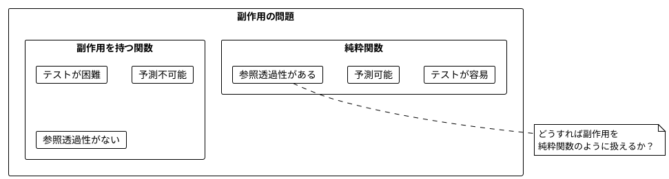
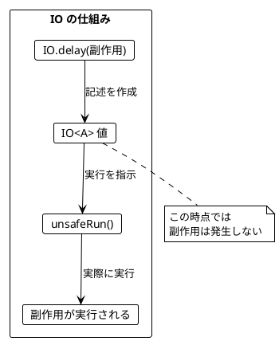
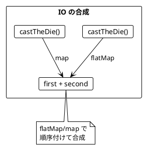
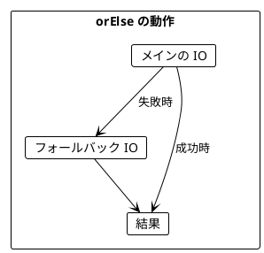
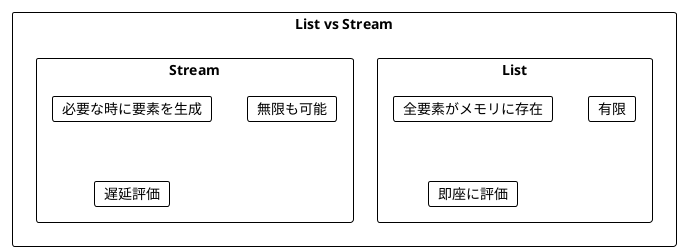
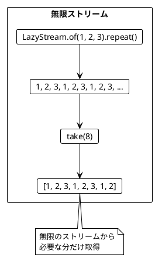
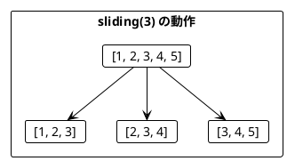
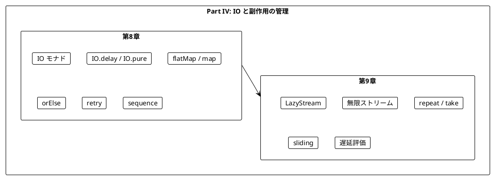

# Part IV: IO と副作用の管理

本章では、関数型プログラミングにおける副作用の扱い方を学びます。IO モナドを使って副作用を純粋関数内で安全に記述し、ストリーム処理で無限のデータを扱う方法を習得します。

---

## 第8章: IO モナドの導入

### 8.1 副作用の問題

純粋関数は副作用を持ちません。しかし、実際のプログラムには副作用が必要です:

- ファイルの読み書き
- ネットワーク通信
- データベースアクセス
- 乱数生成
- 現在時刻の取得



### 8.2 IO モナドとは

**IO モナド**は「副作用を持つ計算の**記述**」を表す型です。

- `IO<A>` は「実行すると `A` 型の値を返す副作用のある計算」
- IO 値を作成しただけでは副作用は発生しない
- `unsafeRun()` で実際に実行される



### 8.3 IO の実装

**ソースファイル**: `app/java/src/main/java/ch08/IO.java`

Java + Vavr での IO モナドの簡易実装です:

```java
public final class IO<A> {

    private final Supplier<A> thunk;

    private IO(Supplier<A> thunk) {
        this.thunk = thunk;
    }

    // 副作用のある式を遅延実行する IO を作成
    public static <A> IO<A> delay(Supplier<A> supplier) {
        return new IO<>(supplier);
    }

    // 既存の値をラップ（副作用なし）
    public static <A> IO<A> pure(A value) {
        return new IO<>(() -> value);
    }

    // IO を実行して結果を取得（副作用が発生する）
    public A unsafeRun() {
        return thunk.get();
    }

    // 結果を変換する
    public <B> IO<B> map(Function<A, B> f) {
        return new IO<>(() -> f.apply(thunk.get()));
    }

    // IO を返す関数を適用してフラット化
    public <B> IO<B> flatMap(Function<A, IO<B>> f) {
        return new IO<>(() -> f.apply(thunk.get()).unsafeRun());
    }
}
```

### 8.4 サイコロを振る例

**ソースファイル**: `app/java/src/main/java/ch08/CastingDie.java`

#### 不純な関数（副作用あり）

```java
private static final Random random = new Random();

// 呼び出すたびに異なる値が返る
public static int castTheDieImpure() {
    return random.nextInt(6) + 1;
}
```

#### IO を使った純粋な記述

```java
// サイコロを振る（IO でラップ）
// IO 値を作成しただけでは実行されない
public static IO<Integer> castTheDie() {
    return IO.delay(CastingDie::castTheDieImpure);
}

// IO 値を作成（この時点では実行されない）
IO<Integer> dieCast = castTheDie();
System.out.println(dieCast);  // IO(...) - まだ実行されていない

// 実際に実行
System.out.println(dieCast.unsafeRun());  // 4
```

### 8.5 IO の作成方法

| メソッド | 用途 | 例 |
|----------|------|-----|
| `IO.delay(expr)` | 副作用のある式をラップ | `IO.delay(() -> System.out.println("hello"))` |
| `IO.pure(value)` | 既存の値をラップ（副作用なし） | `IO.pure(42)` |
| `IO.unit()` | 何もしない IO | `IO.unit()` (= `IO.pure(null)`) |
| `IO.effect(runnable)` | 副作用のみを実行 | `IO.effect(() -> System.out.println("!"))` |

```java
// IO.delay: 副作用を遅延実行
IO<Void> delayedPrint = IO.effect(() -> System.out.println("Hello"));
// println はまだ実行されていない

// IO.pure: 既存の値をラップ
IO<Integer> pureValue = IO.pure(42);
// 副作用なし、即座に 42 が確定
```

### 8.6 IO の合成

IO 値は `flatMap` や `map` で合成できます。

```java
// サイコロを2回振って合計を返す
public static IO<Integer> castTheDieTwice() {
    return castTheDie()
            .flatMap(first -> castTheDie()
                    .map(second -> first + second));
}

// まだ実行されていない
IO<Integer> program = castTheDieTwice();

// 実行
int result = program.unsafeRun();
```



### 8.7 ミーティングスケジューリングの例

**ソースファイル**: `app/java/src/main/java/ch08/SchedulingMeetings.java`

より実践的な例として、ミーティングのスケジューリングを見てみましょう。

#### データ型

```java
public record MeetingTime(int startHour, int endHour) {
    public int lengthHours() {
        return endHour - startHour;
    }
}
```

#### 副作用のある API 呼び出しを IO でラップ

```java
public static IO<List<MeetingTime>> calendarEntries(String name) {
    return IO.delay(() -> simulateCalendarApi(name));
}

public static IO<Void> createMeeting(List<String> attendees, MeetingTime meeting) {
    return IO.effect(() -> {
        System.out.println("Creating meeting for " + attendees.mkString(", ") +
                " at " + meeting.startHour() + ":00 - " + meeting.endHour() + ":00");
    });
}
```

#### 予定の取得

```java
public static IO<List<MeetingTime>> scheduledMeetings(String person1, String person2) {
    return calendarEntries(person1)
            .flatMap(p1Entries -> calendarEntries(person2)
                    .map(p2Entries -> p1Entries.appendAll(p2Entries)));
}
```

#### 空き時間の計算（純粋関数）

```java
public static List<MeetingTime> possibleMeetings(
        List<MeetingTime> existingMeetings,
        int startHour,
        int endHour,
        int lengthHours) {

    return List.range(startHour, endHour - lengthHours + 1)
            .map(start -> new MeetingTime(start, start + lengthHours))
            .filter(slot -> existingMeetings.forAll(
                    existing -> !meetingsOverlap(existing, slot)));
}
```

### 8.8 orElse によるエラーハンドリング

IO の `orElse` メソッドで、失敗時のフォールバックを指定できます。

```java
IO<Integer> year = IO.delay(() -> 996);
IO<Integer> noYear = IO.delay(() -> { throw new RuntimeException("no year"); });

year.orElse(2020).unsafeRun();    // 996
noYear.orElse(2020).unsafeRun();  // 2020
```



#### リトライ戦略

```java
// API 呼び出しを3回までリトライ
calendarEntries("Alice")
    .retry(3)
    .orElse(List.empty());  // 全部失敗したら空リスト
```

#### 汎用リトライ関数

```java
public IO<A> retry(int maxRetries) {
    IO<A> result = this;
    for (int i = 0; i < maxRetries; i++) {
        result = result.orElse(() -> this);
    }
    return result;
}

// 使用例
calendarEntries("Alice").retry(10);
```

### 8.9 sequence による IO のリスト処理

`List<IO<A>>` を `IO<List<A>>` に変換するには `sequence` を使います。

```java
public static <A> IO<List<A>> sequence(List<IO<A>> ios) {
    return ios.foldLeft(
            IO.pure(List.empty()),
            (acc, io) -> acc.flatMap(list -> io.map(list::append))
    );
}

List<IO<Integer>> actions = List.of(IO.pure(1), IO.pure(2), IO.pure(3));
IO<List<Integer>> combined = IO.sequence(actions);

combined.unsafeRun();  // List(1, 2, 3)
```

#### 複数人の予定を取得

```java
public static IO<List<MeetingTime>> scheduledMeetings(List<String> attendees) {
    return IO.traverse(attendees, SchedulingMeetings::calendarEntries)
            .map(lists -> lists.flatMap(x -> x));
}
```

---

## 第9章: ストリーム処理

### 9.1 ストリームとは

**ストリーム**は、要素の（潜在的に無限の）シーケンスを表します。



### 9.2 LazyStream の実装

**ソースファイル**: `app/java/src/main/java/ch09/LazyStream.java`

Java + Vavr での遅延評価ストリームの実装です:

```java
public final class LazyStream<A> implements Iterable<A> {

    private final Supplier<Option<Cons<A>>> headTail;

    private record Cons<A>(A head, LazyStream<A> tail) {}

    private LazyStream(Supplier<Option<Cons<A>>> headTail) {
        this.headTail = headTail;
    }

    // 空のストリーム
    public static <A> LazyStream<A> empty() {
        return new LazyStream<>(Option::none);
    }

    // 単一要素のストリーム
    public static <A> LazyStream<A> of(A value) {
        return new LazyStream<>(() ->
            Option.some(new Cons<>(value, empty())));
    }

    // 無限に値を繰り返すストリーム
    public static <A> LazyStream<A> repeat(A value) {
        return new LazyStream<>(() ->
            Option.some(new Cons<>(value, repeat(value))));
    }
}
```

### 9.3 純粋なストリーム

```java
// 有限ストリーム
LazyStream<Integer> numbers = LazyStream.of(1, 2, 3);

// List に変換
numbers.toList();  // List(1, 2, 3)

// フィルタリング
LazyStream<Integer> oddNumbers = numbers.filter(x -> x % 2 != 0);
oddNumbers.toList();  // List(1, 3)
```

### 9.4 無限ストリーム

```java
// repeat で無限に繰り返し
LazyStream<Integer> infinite123s = LazyStream.of(1, 2, 3).repeat();

// take で有限個を取得
infinite123s.take(8).toList();  // List(1, 2, 3, 1, 2, 3, 1, 2)
```



### 9.5 ストリームの主要操作

| 操作 | 説明 | 例 |
|------|------|-----|
| `take(n)` | 最初の n 要素を取得 | `stream.take(3)` |
| `filter(p)` | 条件を満たす要素のみ | `stream.filter(x -> x > 0)` |
| `map(f)` | 各要素を変換 | `stream.map(x -> x * 2)` |
| `append(s)` | 別のストリームを結合 | `stream1.append(stream2)` |
| `repeat()` | 無限に繰り返し | `stream.repeat()` |
| `sliding(n)` | スライディングウィンドウ | `stream.sliding(3)` |

### 9.6 通貨交換レートの例

**ソースファイル**: `app/java/src/main/java/ch09/CurrencyExchange.java`

為替レートを監視して、上昇トレンドを検出する例です。

#### トレンド判定（純粋関数）

```java
public static boolean trending(List<BigDecimal> rates) {
    if (rates.size() <= 1) {
        return false;
    }
    return rates.zip(rates.drop(1))
            .forAll(pair -> pair._2().compareTo(pair._1()) > 0);
}

trending(List.of(
    BigDecimal.valueOf(0.81),
    BigDecimal.valueOf(0.82),
    BigDecimal.valueOf(0.83)
));  // true (上昇トレンド)

trending(List.of(
    BigDecimal.valueOf(0.81),
    BigDecimal.valueOf(0.84),
    BigDecimal.valueOf(0.83)
));  // false
```

#### レートのストリーム

```java
public static LazyStream<IO<Option<BigDecimal>>> ratesStream(
        Currency from,
        Currency to) {
    return LazyStream.continually(() -> rate(from, to));
}
```

### 9.7 スライディングウィンドウ

`sliding` で連続する要素をグループ化できます。

```java
LazyStream<Integer> stream = LazyStream.of(1, 2, 3, 4, 5);

stream.sliding(3).toList().map(Queue::toList);
// List(List(1, 2, 3), List(2, 3, 4), List(3, 4, 5))
```



#### トレンドを検出

```java
public static Option<BigDecimal> findTrendInRates(
        List<BigDecimal> rates,
        int windowSize) {

    LazyStream<Queue<BigDecimal>> windows = LazyStream.fromList(rates)
            .sliding(windowSize);

    for (Queue<BigDecimal> window : windows) {
        List<BigDecimal> windowList = window.toList();
        if (trending(windowList)) {
            return Option.some(windowList.last());
        }
    }
    return Option.none();
}
```

---

## まとめ

### Part IV で学んだこと



### IO と LazyStream の比較

| 特性 | IO<A> | LazyStream<A> |
|------|-------|---------------|
| 要素数 | 1つ | 0個以上（無限も可） |
| 実行 | `unsafeRun()` | `toList()` |
| 用途 | 単一の副作用 | 連続したデータ処理 |

### キーポイント

1. **IO モナド**: 副作用を「記述」として扱い、実行を遅延させる
2. **IO.delay**: 副作用のある式を IO にラップ
3. **orElse**: 失敗時のフォールバックを指定
4. **sequence**: `List<IO<A>>` → `IO<List<A>>`
5. **LazyStream**: 潜在的に無限のシーケンスを遅延評価で処理
6. **sliding**: 連続する要素をグループ化してパターンを検出

### Scala との比較

| 概念 | Scala (cats-effect/fs2) | Java + Vavr |
|------|-------------------------|-------------|
| IO 型 | `cats.effect.IO[A]` | `IO<A>` (独自実装) |
| 遅延実行 | `IO.delay(expr)` | `IO.delay(() -> expr)` |
| 即座の値 | `IO.pure(value)` | `IO.pure(value)` |
| 実行 | `unsafeRunSync()` | `unsafeRun()` |
| ストリーム | `fs2.Stream[F, A]` | `LazyStream<A>` (独自実装) |
| 無限繰り返し | `stream.repeat` | `stream.repeat()` |

### 次のステップ

Part V では、以下のトピックを学ぶ予定です:

- 並行・並列処理
- 共有状態管理

---

## 演習問題

### 問題 1: IO の基本

以下の関数を実装してください。

```java
public static IO<String> printAndReturn(String message) {
    // "message" をコンソールに出力し、"message" を返す IO
}

// 期待される動作
// printAndReturn("Hello").unsafeRun() は
// "Hello" をコンソールに出力し、"Hello" を返す
```

<details>
<summary>解答</summary>

```java
public static IO<String> printAndReturn(String message) {
    return IO.delay(() -> {
        System.out.println(message);
        return message;
    });
}
```

</details>

### 問題 2: IO の合成

以下の関数を実装してください。2つの IO を順番に実行し、結果を結合します。

```java
public static <A, B, C> IO<C> combineIO(
        IO<A> io1,
        IO<B> io2,
        BiFunction<A, B, C> f) {
    // ???
}

// 期待される動作
IO<Integer> result = combineIO(IO.pure(1), IO.pure(2), Integer::sum);
result.unsafeRun();  // 3
```

<details>
<summary>解答</summary>

```java
public static <A, B, C> IO<C> combineIO(
        IO<A> io1,
        IO<B> io2,
        BiFunction<A, B, C> f) {
    return io1.flatMap(a -> io2.map(b -> f.apply(a, b)));
}
```

</details>

### 問題 3: リトライ

以下の関数を実装してください。指定回数リトライし、全部失敗したらデフォルト値を返します。

```java
public IO<A> retryWithDefault(int maxRetries, A defaultValue) {
    // ???
}
```

<details>
<summary>解答</summary>

```java
public IO<A> retryWithDefault(int maxRetries, A defaultValue) {
    return retry(maxRetries).orElse(defaultValue);
}
```

</details>

### 問題 4: ストリーム操作

以下のストリームを作成してください。

```java
// 1. 1から10までの偶数のストリーム
LazyStream<Integer> evens = ???

// 2. 無限に交互に true/false を返すストリーム
LazyStream<Boolean> alternating = ???

// 3. 最初の5つの要素の合計を計算
int sum = LazyStream.of(1, 2, 3, 4, 5, 6, 7, 8, 9, 10).take(5).???
```

<details>
<summary>解答</summary>

```java
// 1. 1から10までの偶数
LazyStream<Integer> evens = LazyStream.range(1, 11).filter(x -> x % 2 == 0);
// または
LazyStream<Integer> evens = LazyStream.of(2, 4, 6, 8, 10);

// 2. 無限に交互に true/false
LazyStream<Boolean> alternating = LazyStream.of(true, false).repeat();

// 3. 最初の5つの要素の合計
int sum = LazyStream.of(1, 2, 3, 4, 5, 6, 7, 8, 9, 10)
    .take(5)
    .foldLeft(0, Integer::sum);  // 15
```

</details>

### 問題 5: トレンド検出

以下の関数を実装してください。直近3つの値が全て同じかどうかを判定します。

```java
public static boolean isStable(List<BigDecimal> values) {
    // ???
}

// 期待される動作
assert isStable(List.of(bd(5), bd(5), bd(5))) == true;
assert isStable(List.of(bd(5), bd(5), bd(6))) == false;
assert isStable(List.of(bd(5), bd(6), bd(5))) == false;
assert isStable(List.of(bd(5))) == false;  // 3つ未満は false
```

<details>
<summary>解答</summary>

```java
public static boolean isStable(List<BigDecimal> values) {
    return values.size() >= 3 && values.distinct().size() == 1;
}
```

</details>
