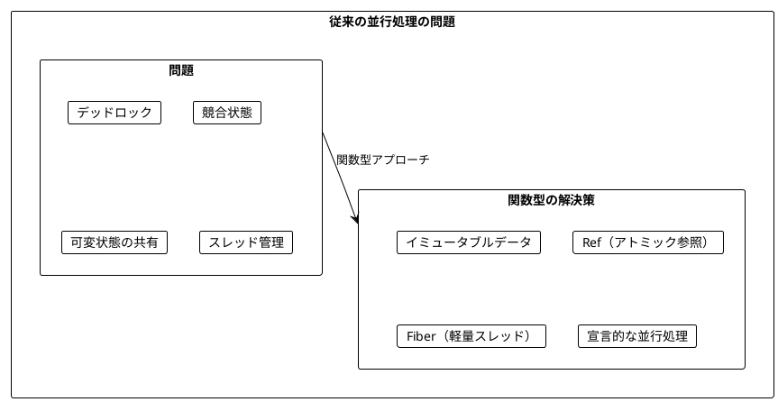
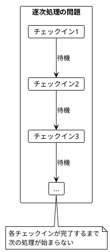
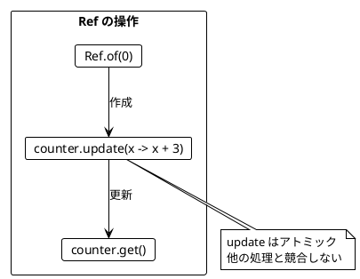
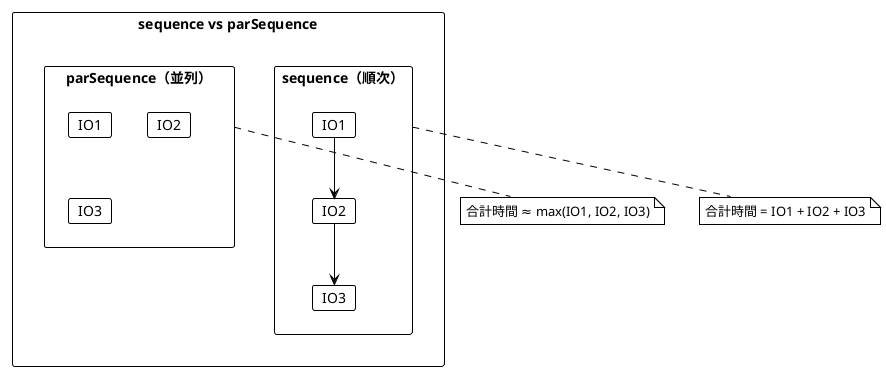
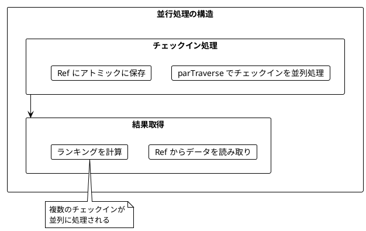
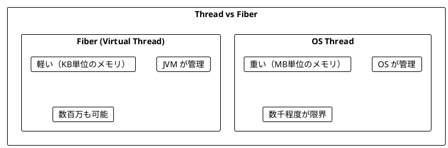
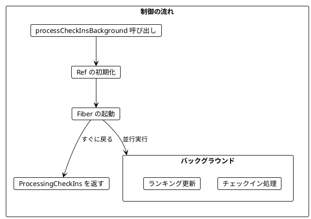
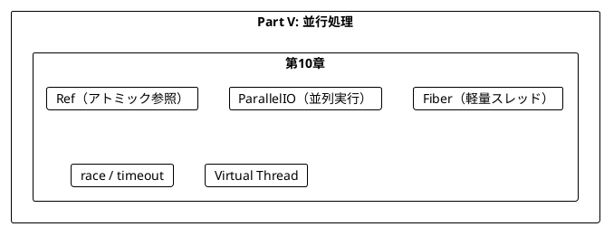
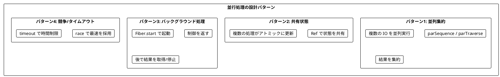

# Part V: 並行処理

本章では、関数型プログラミングにおける並行処理を学びます。Ref による安全な共有状態管理、Fiber による軽量スレッド、そして並列 IO 操作の構築方法を習得します。

---

## 第10章: 並行・並列処理

### 10.1 並行処理の課題

従来の並行処理には多くの課題があります:

- デッドロック
- 競合状態（Race Condition）
- 共有状態の管理の複雑さ
- スレッドのオーバーヘッド



### 10.2 チェックインのリアルタイム集計

**ソースファイル**: `app/java/src/main/java/ch10/CheckIns.java`

都市へのチェックインをリアルタイムで集計し、ランキングを更新する例を見ていきます。

```java
public record City(String name) {}
public record CityStats(City city, int checkIns) {}

// サンプルのチェックインデータを生成
public static List<City> sampleCheckIns(int repeatCount) {
    List<City> cities = List.of(
            new City("Sydney"),
            new City("Dublin"),
            new City("Cape Town"),
            new City("Lima"),
            new City("Singapore")
    );

    return List.range(0, repeatCount)
            .flatMap(i -> cities);
}
```

#### トップ N 都市の計算（純粋関数）

```java
public static List<CityStats> topCities(Map<City, Integer> cityCheckIns, int n) {
    return cityCheckIns.toList()
            .map(t -> new CityStats(t._1(), t._2()))
            .sortBy(stats -> -stats.checkIns())  // 降順
            .take(n);
}
```

### 10.3 逐次処理の問題

最初の実装は逐次処理で、シンプルですがパフォーマンスに問題があります。

```java
public static IO<List<CityStats>> processCheckInsSequential(List<City> checkIns, int topN) {
    return IO.delay(() -> {
        Map<City, Integer> cityCheckIns = checkIns.foldLeft(
                HashMap.<City, Integer>empty(),
                CheckIns::updateCheckIns
        );
        return topCities(cityCheckIns, topN);
    });
}

public static Map<City, Integer> updateCheckIns(Map<City, Integer> current, City city) {
    return current.put(city, current.get(city).map(c -> c + 1).getOrElse(1));
}
```



### 10.4 Ref - アトミックな共有状態

**ソースファイル**: `app/java/src/main/java/ch10/Ref.java`

**Ref** は、複数の並行処理から安全にアクセスできるアトミックな参照です。Java の `AtomicReference` をラップし、IO モナドと統合しています。

```java
public final class Ref<A> {

    private final AtomicReference<A> value;

    private Ref(A initial) {
        this.value = new AtomicReference<>(initial);
    }

    // 初期値で Ref を作成（IO でラップ）
    public static <A> IO<Ref<A>> of(A initial) {
        return IO.delay(() -> new Ref<>(initial));
    }

    // 現在の値を取得
    public IO<A> get() {
        return IO.delay(value::get);
    }

    // 値を設定
    public IO<Void> set(A newValue) {
        return IO.effect(() -> value.set(newValue));
    }

    // アトミックに値を更新
    public IO<Void> update(UnaryOperator<A> f) {
        return IO.effect(() -> value.updateAndGet(f));
    }
}
```

#### Ref の使用例

```java
// Ref の作成と使用
IO<Integer> program = Ref.of(0)
        .flatMap(counter ->
                counter.update(x -> x + 3)    // アトミックに更新
                        .andThen(counter.get()) // 現在の値を取得
        );

program.unsafeRun();  // 3
```



#### Ref の主要メソッド

| メソッド | 説明 | 例 |
|----------|------|-----|
| `Ref.of(initial)` | 初期値で Ref を作成 | `Ref.of(0)` |
| `ref.get()` | 現在の値を取得 | `counter.get()` |
| `ref.set(value)` | 値を設定 | `counter.set(10)` |
| `ref.update(f)` | アトミックに更新 | `counter.update(x -> x + 1)` |
| `ref.modify(f)` | 更新して結果を返す | `counter.modify(n -> ModifyResult.of(n + 1, n))` |
| `ref.getAndUpdate(f)` | 古い値を返して更新 | `counter.getAndUpdate(x -> x * 2)` |
| `ref.updateAndGet(f)` | 更新して新しい値を返す | `counter.updateAndGet(x -> x * 2)` |

#### modify の使用例

`modify` は値を更新しつつ、何か別の値を返したい場合に便利です。

```java
Ref<Integer> ref = Ref.unsafe(10);
String result = ref.modify(x ->
        Ref.ModifyResult.of(x + 1, "was " + x)
).unsafeRun();

// result: "was 10"
// ref の値: 11
```

### 10.5 ParallelIO - 並列実行

**ソースファイル**: `app/java/src/main/java/ch10/ParallelIO.java`

`IO.sequence` は IO を順番に実行しますが、`ParallelIO.parSequence` は並列に実行します。

```java
public final class ParallelIO {

    private static final ExecutorService executor =
        Executors.newVirtualThreadPerTaskExecutor();

    // IO のリストを並列に実行
    public static <A> IO<List<A>> parSequence(List<IO<A>> ios) {
        return IO.delay(() -> {
            // 各 IO を CompletableFuture として非同期実行
            java.util.List<CompletableFuture<A>> futures = ios
                    .map(io -> CompletableFuture.supplyAsync(io::unsafeRun, executor))
                    .toJavaList();

            // すべての完了を待機
            CompletableFuture.allOf(futures.toArray(new CompletableFuture[0])).join();

            // 結果を収集
            return List.ofAll(futures.stream().map(CompletableFuture::join).toList());
        });
    }
}
```



#### 並列実行の効果

```java
List<IO<Integer>> ios = List.of(
        Fiber.sleep(100).andThen(IO.pure(1)),
        Fiber.sleep(100).andThen(IO.pure(2)),
        Fiber.sleep(100).andThen(IO.pure(3))
);

long start = System.currentTimeMillis();
ParallelIO.parSequence(ios).unsafeRun();
long elapsed = System.currentTimeMillis() - start;

// 並列なので約100ms（順次なら約300ms）
assertThat(elapsed).isLessThan(200);
```

#### parTraverse

`parTraverse` は、リストの各要素に IO を返す関数を適用し、並列に実行します。

```java
public static <A, B> IO<List<B>> parTraverse(
        List<A> list,
        Function<A, IO<B>> f) {
    return parSequence(list.map(f));
}

// 使用例
List<Integer> numbers = List.of(1, 2, 3, 4, 5);

List<Integer> result = ParallelIO.parTraverse(
        numbers,
        n -> IO.pure(n * 2)
).unsafeRun();  // List(2, 4, 6, 8, 10)
```

### 10.6 チェックイン処理の並行版

Ref と ParallelIO を組み合わせて、チェックインを並行処理します。

#### チェックインの保存

```java
public static IO<Void> storeCheckIn(
        Ref<Map<City, Integer>> storedCheckIns,
        City city) {
    return storedCheckIns.update(current -> updateCheckIns(current, city));
}
```

#### 並行処理版

```java
public static IO<List<CityStats>> processCheckInsConcurrent(
        List<City> checkIns,
        int topN) {
    return Ref.<Map<City, Integer>>of(HashMap.empty())
            .flatMap(storedCheckIns ->
                    // すべてのチェックインを並列に処理
                    ParallelIO.parTraverse(checkIns, city ->
                            storeCheckIn(storedCheckIns, city))
                            .andThen(storedCheckIns.get())
                            .map(cityCheckIns -> topCities(cityCheckIns, topN))
            );
}
```



### 10.7 parTuple と parMap

複数の IO を並列に実行して結果を組み合わせる便利なメソッドです。

#### parTuple2 / parTuple3

```java
// 2つの IO を並列実行し、タプルで返す
Tuple2<Integer, String> result = ParallelIO.parTuple2(
        IO.pure(42),
        IO.pure("hello")
).unsafeRun();

// result._1(): 42
// result._2(): "hello"

// 3つの IO も同様
var result3 = ParallelIO.parTuple3(
        IO.pure(1),
        IO.pure("two"),
        IO.pure(3.0)
).unsafeRun();
```

#### parMap2

```java
// 2つの IO を並列実行して結果を結合
IO<Integer> result = ParallelIO.parMap2(
        IO.pure(10),
        IO.pure(20),
        Integer::sum
);

result.unsafeRun();  // 30
```

### 10.8 race と timeout

#### race - 競争

2つの IO を並列に実行し、最初に完了した方の結果を返します。

```java
public static <A> IO<A> race(IO<A> io1, IO<A> io2) {
    return IO.delay(() -> {
        CompletableFuture<A> f1 = CompletableFuture.supplyAsync(io1::unsafeRun, executor);
        CompletableFuture<A> f2 = CompletableFuture.supplyAsync(io2::unsafeRun, executor);

        return CompletableFuture.anyOf(f1, f2)
                .thenApply(result -> {
                    f1.cancel(true);
                    f2.cancel(true);
                    @SuppressWarnings("unchecked")
                    A typedResult = (A) result;
                    return typedResult;
                })
                .join();
    });
}

// 使用例
IO<String> slow = Fiber.sleep(200).andThen(IO.pure("slow"));
IO<String> fast = Fiber.sleep(50).andThen(IO.pure("fast"));

String result = ParallelIO.race(slow, fast).unsafeRun();
// result: "fast"
```

#### timeout - タイムアウト

```java
public static <A> IO<Option<A>> timeout(IO<A> action, long millis) {
    return IO.delay(() -> {
        CompletableFuture<A> future =
            CompletableFuture.supplyAsync(action::unsafeRun, executor);

        try {
            A result = future.get(millis, TimeUnit.MILLISECONDS);
            return Option.some(result);
        } catch (TimeoutException e) {
            future.cancel(true);
            return Option.none();
        } catch (Exception e) {
            throw new RuntimeException(e);
        }
    });
}

// 使用例
IO<Integer> fast = Fiber.sleep(50).andThen(IO.pure(42));
Option<Integer> result1 = ParallelIO.timeout(fast, 200).unsafeRun();
// result1: Some(42)

IO<Integer> slow = Fiber.sleep(500).andThen(IO.pure(42));
Option<Integer> result2 = ParallelIO.timeout(slow, 100).unsafeRun();
// result2: None
```

### 10.9 Fiber - 軽量スレッド

**ソースファイル**: `app/java/src/main/java/ch10/Fiber.java`

**Fiber** は、IO の実行をバックグラウンドで行う軽量な実行単位です。Java 21 の仮想スレッド（Virtual Thread）を活用しています。



#### Fiber の実装

```java
public final class Fiber<A> {

    private static final ExecutorService executor =
        Executors.newVirtualThreadPerTaskExecutor();

    private final CompletableFuture<A> future;
    private final AtomicBoolean cancelled;
    private final Future<?> task;

    // IO をバックグラウンドで起動し、Fiber を返す
    public static <A> IO<Fiber<A>> start(IO<A> io) {
        return IO.delay(() -> {
            CompletableFuture<A> future = new CompletableFuture<>();
            AtomicBoolean cancelled = new AtomicBoolean(false);

            Future<?> task = executor.submit(() -> {
                try {
                    if (!cancelled.get()) {
                        A result = io.unsafeRun();
                        if (!cancelled.get()) {
                            future.complete(result);
                        }
                    }
                } catch (Exception e) {
                    if (!cancelled.get()) {
                        future.completeExceptionally(e);
                    }
                }
            });

            return new Fiber<>(future, cancelled, task);
        });
    }
}
```

#### Fiber の起動とキャンセル

```java
AtomicInteger counter = new AtomicInteger(0);

// 無限ループする IO をバックグラウンドで起動
Fiber<Void> fiber = Fiber.startForever(
        Fiber.sleep(10).andThen(IO.effect(counter::incrementAndGet))
).unsafeRun();

// しばらく実行
Thread.sleep(100);
int countBefore = counter.get();
assertThat(countBefore).isGreaterThan(0);

// キャンセル
fiber.cancel().unsafeRun();
Thread.sleep(50);

int countAfter = counter.get();
// キャンセル後は増加しない
assertThat(fiber.isCancelled()).isTrue();
```

#### Fiber の主要メソッド

| メソッド | 説明 | 例 |
|----------|------|-----|
| `Fiber.start(io)` | IO をバックグラウンドで起動 | `Fiber.start(IO.pure(42))` |
| `Fiber.startForever(io)` | 無限ループで起動 | `Fiber.startForever(process)` |
| `fiber.join()` | 完了を待機し結果を取得 | `fiber.join().unsafeRun()` |
| `fiber.cancel()` | Fiber をキャンセル | `fiber.cancel().unsafeRun()` |
| `fiber.isDone()` | 完了したか | `fiber.isDone()` |
| `fiber.isCancelled()` | キャンセルされたか | `fiber.isCancelled()` |
| `Fiber.sleep(millis)` | 指定時間スリープ | `Fiber.sleep(100)` |
| `Fiber.delay(millis, io)` | 遅延実行 | `Fiber.delay(100, IO.pure(42))` |

### 10.10 呼び出し元に制御を返す

Fiber を使って、呼び出し元にすぐ制御を返しつつバックグラウンドで処理を続ける設計ができます。

```java
public record ProcessingCheckIns(
        IO<List<CityStats>> currentRanking,  // 現在のランキングを取得
        IO<Void> stop                         // 処理を停止
) {}

public static IO<ProcessingCheckIns> processCheckInsBackground(
        List<City> checkIns,
        int topN,
        long updateIntervalMillis) {

    return Ref.<Map<City, Integer>>of(HashMap.empty())
            .flatMap(storedCheckIns ->
                    Ref.<List<CityStats>>of(List.empty())
                            .flatMap(storedRanking -> {
                                // チェックイン処理プログラム
                                IO<Void> checkInsProgram = IO.traverse(
                                        checkIns,
                                        city -> storeCheckIn(storedCheckIns, city)
                                ).map(ignored -> null);

                                // ランキング更新プログラム（定期的に実行）
                                IO<Void> rankingProgram = IO.delay(() -> {
                                    updateRanking(storedCheckIns, storedRanking, topN)
                                        .unsafeRun();
                                    return null;
                                });

                                // Fiber として起動し、すぐに戻る
                                return Fiber.start(checkInsProgram)
                                        .flatMap(checkInsFiber ->
                                                Fiber.startForever(
                                                        Fiber.sleep(updateIntervalMillis)
                                                                .andThen(rankingProgram)
                                                ).map(rankingFiber ->
                                                        new ProcessingCheckIns(
                                                                storedRanking.get(),
                                                                checkInsFiber.cancel()
                                                                        .andThen(rankingFiber.cancel())
                                                        )
                                                )
                                        );
                            })
            );
}
```



### 10.11 parFold - 並列実行して集約

```java
public static <A, B> IO<B> parFold(
        List<IO<A>> ios,
        B initial,
        BiFunction<B, A, B> f) {
    return parSequence(ios).map(results -> results.foldLeft(initial, f));
}

// 使用例
List<IO<Integer>> ios = List.of(
        IO.pure(1),
        IO.pure(2),
        IO.pure(3),
        IO.pure(4)
);

Integer sum = ParallelIO.parFold(ios, 0, Integer::sum).unsafeRun();
// sum: 10
```

### 10.12 Java 21 Virtual Thread の活用

この実装では Java 21 の仮想スレッド（Virtual Thread）を活用しています。

```java
private static final ExecutorService executor =
    Executors.newVirtualThreadPerTaskExecutor();
```

仮想スレッドの利点:

- **軽量**: 従来のプラットフォームスレッドより遥かに軽量
- **スケーラブル**: 数百万の同時実行が可能
- **ブロッキング OK**: ブロッキング操作でもスレッドプールを枯渇させない
- **既存コードと互換**: 既存の Java コードをそのまま使用可能

---

## まとめ

### Part V で学んだこと



### 主要コンポーネント

| コンポーネント | 用途 |
|----------------|------|
| `Ref<A>` | スレッドセーフな共有状態 |
| `ParallelIO.parSequence` | IO のリストを並列実行 |
| `ParallelIO.parTraverse` | リストに関数を適用して並列実行 |
| `ParallelIO.race` | 最初に完了した方を返す |
| `ParallelIO.timeout` | タイムアウト付き実行 |
| `Fiber` | 軽量な実行単位 |
| `fiber.start` | Fiber をバックグラウンドで起動 |
| `fiber.cancel` | Fiber をキャンセル |

### キーポイント

1. **Ref**: `AtomicReference` をラップし、IO モナドと統合したアトミックな参照
2. **parSequence**: IO のリストを並列実行して結果を集約
3. **Fiber**: Java 21 の仮想スレッドを活用した軽量な実行単位
4. **start**: Fiber をバックグラウンドで起動し、すぐに制御を返す
5. **race**: 2つの IO を競争させ、最初に完了した方を採用
6. **timeout**: 指定時間内に完了しなければ None を返す

### 設計パターン



### Scala との比較

| 概念 | Scala (cats-effect) | Java + Vavr |
|------|---------------------|-------------|
| アトミック参照 | `Ref[IO, A]` | `Ref<A>` (独自実装) |
| 並列実行 | `parSequence` | `ParallelIO.parSequence` |
| 軽量スレッド | `Fiber[IO, A]` | `Fiber<A>` (Virtual Thread) |
| Fiber 起動 | `io.start` | `Fiber.start(io)` |
| キャンセル | `fiber.cancel` | `fiber.cancel()` |
| 競争 | `IO.race(io1, io2)` | `ParallelIO.race(io1, io2)` |
| タイムアウト | `io.timeout(duration)` | `ParallelIO.timeout(io, millis)` |

---

## 演習問題

### 問題 1: Ref の基本

以下のプログラムを実装してください。カウンターを 0 から始めて、3回インクリメントした結果を返します。

```java
public static IO<Integer> incrementThreeTimes() {
    // ???
}

// 期待される動作
incrementThreeTimes().unsafeRun();  // 3
```

<details>
<summary>解答</summary>

```java
public static IO<Integer> incrementThreeTimes() {
    return Ref.of(0)
            .flatMap(counter ->
                    counter.update(x -> x + 1)
                            .andThen(counter.update(x -> x + 1))
                            .andThen(counter.update(x -> x + 1))
                            .andThen(counter.get())
            );
}
```

</details>

### 問題 2: 並列実行

以下のプログラムを実装してください。3つの IO を並列実行し、結果の合計を返します。

```java
public static IO<Integer> sumParallel(IO<Integer> io1, IO<Integer> io2, IO<Integer> io3) {
    // ???
}

// 期待される動作
sumParallel(IO.pure(1), IO.pure(2), IO.pure(3)).unsafeRun();  // 6
```

<details>
<summary>解答</summary>

```java
public static IO<Integer> sumParallel(IO<Integer> io1, IO<Integer> io2, IO<Integer> io3) {
    return ParallelIO.parSequence(List.of(io1, io2, io3))
            .map(list -> list.foldLeft(0, Integer::sum));
}

// または parFold を使用
public static IO<Integer> sumParallel(IO<Integer> io1, IO<Integer> io2, IO<Integer> io3) {
    return ParallelIO.parFold(List.of(io1, io2, io3), 0, Integer::sum);
}
```

</details>

### 問題 3: 並行カウント

以下のプログラムを実装してください。IO のリストを並行実行し、そのうち偶数を返した回数をカウントします。

```java
public static IO<Integer> countEvens(List<IO<Integer>> ios) {
    // ???
}

// 使用例
List<IO<Integer>> ios = List.range(0, 100).map(IO::pure);
countEvens(ios).unsafeRun();  // 50
```

<details>
<summary>解答</summary>

```java
public static IO<Integer> countEvens(List<IO<Integer>> ios) {
    return Ref.of(0)
            .flatMap(counter ->
                    ParallelIO.parTraverse(ios, io ->
                            io.flatMap(n ->
                                    n % 2 == 0
                                            ? counter.update(x -> x + 1)
                                            : IO.unit()
                            )
                    ).andThen(counter.get())
            );
}
```

</details>

### 問題 4: タイムアウト付き実行

以下のプログラムを実装してください。指定時間後に Fiber をキャンセルし、それまでに蓄積された結果を返します。

```java
public static IO<List<Integer>> collectFor(long durationMillis) {
    // 100msごとに乱数を生成してリストに追加
    // 指定時間後に停止して結果を返す
    // ???
}

// 期待される動作
// 1秒間実行すると約10個の要素が返される
collectFor(1000).unsafeRun();
```

<details>
<summary>解答</summary>

```java
public static IO<List<Integer>> collectFor(long durationMillis) {
    return Ref.<List<Integer>>of(List.empty())
            .flatMap(collected -> {
                Random random = new Random();

                // 100msごとに乱数を追加するプログラム
                IO<Void> producer = Fiber.sleep(100)
                        .andThen(IO.delay(() -> random.nextInt(100)))
                        .flatMap(n -> collected.update(list -> list.append(n)));

                return Fiber.startForever(producer)
                        .flatMap(fiber ->
                                Fiber.sleep(durationMillis)
                                        .andThen(fiber.cancel())
                                        .andThen(collected.get())
                        );
            });
}
```

</details>

### 問題 5: 並行マップ更新

以下のプログラムを実装してください。複数の更新を並行して Map に適用し、最終的な Map を返します。

```java
record Update(String key, int value) {}

public static IO<Map<String, Integer>> applyUpdates(List<Update> updates) {
    // ???
}

// 期待される動作
List<Update> updates = List.of(
    new Update("a", 1),
    new Update("b", 2),
    new Update("a", 3),  // "a" を上書き
    new Update("c", 4)
);
applyUpdates(updates).unsafeRun();  // HashMap(a -> 3, b -> 2, c -> 4)
```

<details>
<summary>解答</summary>

```java
record Update(String key, int value) {}

public static IO<Map<String, Integer>> applyUpdates(List<Update> updates) {
    return Ref.<Map<String, Integer>>of(HashMap.empty())
            .flatMap(mapRef ->
                    ParallelIO.parTraverse(updates, update ->
                            mapRef.update(m -> m.put(update.key(), update.value()))
                    ).andThen(mapRef.get())
            );
}
```

注意: 並行実行なので、同じキーへの複数の更新がある場合、最終的な値は実行順序に依存します。

</details>
