# Part VI: 実践的なアプリケーション構築とテスト

本章では、これまで学んだ関数型プログラミングの概念を統合し、実践的なアプリケーションを構築します。また、関数型プログラミングにおけるテスト戦略についても学びます。

---

## 第11章: 実践的なアプリケーション構築

### 11.1 TravelGuide アプリケーション

旅行ガイドアプリケーションを例に、実践的な FP アプリケーションの構築方法を学びます。

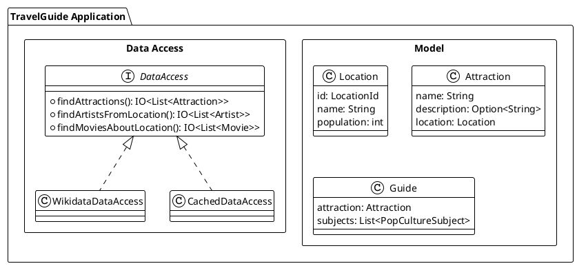

### 11.2 ドメインモデルの定義

**ソースファイル**: `app/java/src/main/java/ch11/TravelGuide.java`

```java
// 位置情報を表す値オブジェクト
public record LocationId(String value) {
    public LocationId {
        Objects.requireNonNull(value, "LocationId value cannot be null");
    }
}

// ロケーション
public record Location(LocationId id, String name, int population) {
    public Location {
        Objects.requireNonNull(id, "Location id cannot be null");
        Objects.requireNonNull(name, "Location name cannot be null");
    }
}

// アトラクション（観光地）
public record Attraction(
        String name,
        Option<String> description,
        Location location
) {
    public Attraction {
        Objects.requireNonNull(name, "Attraction name cannot be null");
        Objects.requireNonNull(description, "Attraction description cannot be null");
        Objects.requireNonNull(location, "Attraction location cannot be null");
    }
}

// ポップカルチャーの題材（sealed interface）
public sealed interface PopCultureSubject permits Artist, Movie {
    String name();
}

// アーティスト
public record Artist(String name, int followers) implements PopCultureSubject {
    public Artist {
        Objects.requireNonNull(name, "Artist name cannot be null");
    }
}

// 映画
public record Movie(String name, int boxOffice) implements PopCultureSubject {
    public Movie {
        Objects.requireNonNull(name, "Movie name cannot be null");
    }
}

// 旅行ガイド
public record Guide(
        Attraction attraction,
        List<PopCultureSubject> subjects
) {
    public Guide {
        Objects.requireNonNull(attraction, "Guide attraction cannot be null");
        Objects.requireNonNull(subjects, "Guide subjects cannot be null");
    }
}
```

Java 17 の `record` と `sealed interface` を活用して、Scala の case class と ADT を表現しています。

### 11.3 データアクセス層の抽象化

外部データソースへのアクセスをインターフェースで抽象化します。

**ソースファイル**: `app/java/src/main/java/ch11/DataAccess.java`

```java
public interface DataAccess {
    IO<List<Attraction>> findAttractions(
            String name,
            AttractionOrdering ordering,
            int limit
    );

    IO<List<Artist>> findArtistsFromLocation(
            LocationId locationId,
            int limit
    );

    IO<List<Movie>> findMoviesAboutLocation(
            LocationId locationId,
            int limit
    );
}
```

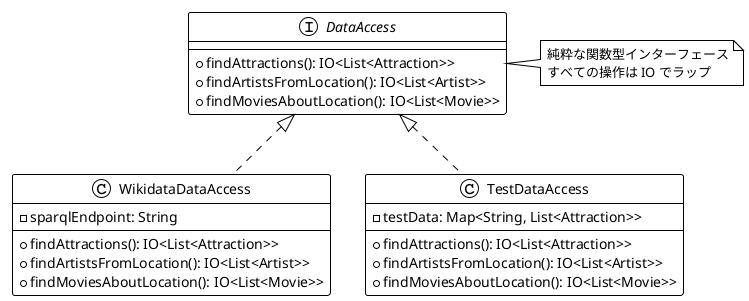

### 11.4 Resource によるリソース管理

**ソースファイル**: `app/java/src/main/java/ch11/Resource.java`

`Resource` は、リソースの取得（acquire）と解放（release）を安全に管理するための型です。cats-effect の `Resource` に相当する機能を提供します。

```java
public final class Resource<A> {

    private final IO<A> acquire;
    private final Consumer<A> release;

    private Resource(IO<A> acquire, Consumer<A> release) {
        this.acquire = acquire;
        this.release = release;
    }

    // リソースを作成
    public static <A> Resource<A> make(IO<A> acquire, Consumer<A> release) {
        return new Resource<>(acquire, release);
    }

    // AutoCloseable からリソースを作成
    public static <A extends AutoCloseable> Resource<A> fromAutoCloseable(IO<A> acquire) {
        return new Resource<>(acquire, a -> {
            try {
                a.close();
            } catch (Exception e) {
                throw new RuntimeException("Failed to close resource", e);
            }
        });
    }

    // リソースを使用して処理を実行
    // リソースは処理完了後（成功・失敗問わず）に必ず解放される
    public <B> IO<B> use(Function<A, IO<B>> f) {
        return acquire.flatMap(resource ->
                f.apply(resource)
                        .guarantee(IO.effect(() -> release.accept(resource)))
        );
    }
}
```

#### Resource の使用例

```java
// ファイルリソースの例
Resource<BufferedReader> fileResource = Resource.fromAutoCloseable(
        IO.delay(() -> new BufferedReader(new FileReader("data.txt")))
);

// リソースを使用して処理を実行
IO<String> readFirstLine = fileResource.use(reader ->
        IO.delay(reader::readLine)
);

// ファイルは自動的にクローズされる
String firstLine = readFirstLine.unsafeRun();
```

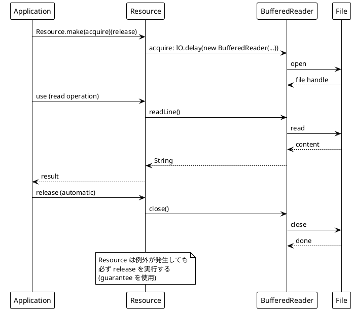

#### guarantee メソッド

`IO` クラスに追加した `guarantee` メソッドは、成功・失敗にかかわらず必ず実行される処理を指定します。

```java
// IO クラスの guarantee メソッド
public IO<A> guarantee(IO<Void> finalizer) {
    return new IO<>(() -> {
        try {
            return thunk.get();
        } finally {
            try {
                finalizer.unsafeRun();
            } catch (Exception ignored) {
                // finalizer のエラーは無視
            }
        }
    });
}
```

### 11.5 キャッシュの実装

**ソースファイル**: `app/java/src/main/java/ch11/CachedDataAccess.java`

`Ref` を使用したスレッドセーフなキャッシュの実装:

```java
public final class CachedDataAccess implements DataAccess {

    private final DataAccess underlying;
    private final Ref<Map<String, Object>> cache;

    private CachedDataAccess(DataAccess underlying, Ref<Map<String, Object>> cache) {
        this.underlying = underlying;
        this.cache = cache;
    }

    // IO 経由でキャッシュ付き DataAccess を作成
    public static IO<DataAccess> create(DataAccess underlying) {
        return Ref.<Map<String, Object>>of(HashMap.empty())
                .map(cache -> new CachedDataAccess(underlying, cache));
    }

    @Override
    public IO<List<Attraction>> findAttractions(
            String name,
            AttractionOrdering ordering,
            int limit) {
        String key = "attractions:" + name + ":" + ordering + ":" + limit;
        return getOrCompute(key, () -> underlying.findAttractions(name, ordering, limit));
    }

    @SuppressWarnings("unchecked")
    private <T> IO<T> getOrCompute(String key, Supplier<IO<T>> compute) {
        return cache.get()
                .flatMap(currentCache ->
                        currentCache.get(key)
                                .map(cached -> IO.pure((T) cached))
                                .getOrElse(() ->
                                        compute.get().flatMap(result ->
                                                cache.update(c -> c.put(key, result))
                                                        .andThen(IO.pure(result))
                                        )
                                )
                );
    }

    // ... 他のメソッドも同様
}
```

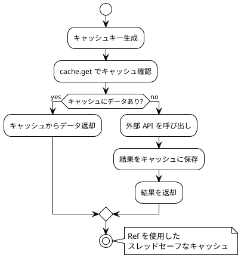

### 11.6 ガイドスコアの計算

純粋関数でガイドのスコアを計算します:

```java
/**
 * ガイドのスコアを計算
 *
 * 要件:
 * - 30 点: 説明がある場合
 * - 10 点/件: アーティストまたは映画（最大 40 点）
 * - 1 点/100,000 フォロワー: 全アーティスト合計（最大 15 点）
 * - 1 点/10,000,000 ドル: 全映画の興行収入合計（最大 15 点）
 */
public static int guideScore(Guide guide) {
    int descriptionScore = guide.attraction().description().isDefined() ? 30 : 0;
    int quantityScore = Math.min(40, guide.subjects().size() * 10);

    // Long を使用してオーバーフローを防ぐ
    long totalFollowers = guide.subjects()
            .filter(s -> s instanceof Artist)
            .map(s -> (long) ((Artist) s).followers())
            .sum().longValue();

    long totalBoxOffice = guide.subjects()
            .filter(s -> s instanceof Movie)
            .map(s -> (long) ((Movie) s).boxOffice())
            .sum().longValue();

    int followersScore = (int) Math.min(15, totalFollowers / 100_000);
    int boxOfficeScore = (int) Math.min(15, totalBoxOffice / 10_000_000);

    return descriptionScore + quantityScore + followersScore + boxOfficeScore;
}
```

重要なポイント:
- **オーバーフロー防止**: `long` を使用して大きな数値の合計を安全に計算
- **上限値の設定**: 各スコア成分に最大値を設定してスコアを 0-100 の範囲に

### 11.7 アプリケーションの組み立て

すべてのコンポーネントを組み合わせてアプリケーションを構築します。

#### バージョン 1: 基本的な実装

```java
public static IO<Option<Guide>> travelGuideV1(
        DataAccess dataAccess,
        String attractionName) {

    return dataAccess.findAttractions(attractionName, AttractionOrdering.BY_LOCATION_POPULATION, 1)
            .flatMap(attractions -> attractions.headOption()
                    .map(attraction ->
                            dataAccess.findArtistsFromLocation(attraction.location().id(), 2)
                                    .flatMap(artists ->
                                            dataAccess.findMoviesAboutLocation(attraction.location().id(), 2)
                                                    .map(movies -> {
                                                        List<PopCultureSubject> subjects = List.<PopCultureSubject>empty()
                                                                .appendAll(artists)
                                                                .appendAll(movies);
                                                        return Option.some(new Guide(attraction, subjects));
                                                    })
                                    )
                    )
                    .getOrElse(IO.pure(Option.none()))
            );
}
```

#### バージョン 2: 複数候補からベストを選択

```java
public static IO<Option<Guide>> travelGuideV2(
        DataAccess dataAccess,
        String attractionName) {

    return dataAccess.findAttractions(attractionName, AttractionOrdering.BY_LOCATION_POPULATION, 3)
            .flatMap(attractions ->
                    IO.traverse(attractions, attraction ->
                            dataAccess.findArtistsFromLocation(attraction.location().id(), 2)
                                    .flatMap(artists ->
                                            dataAccess.findMoviesAboutLocation(attraction.location().id(), 2)
                                                    .map(movies -> {
                                                        List<PopCultureSubject> subjects = List.<PopCultureSubject>empty()
                                                                .appendAll(artists)
                                                                .appendAll(movies);
                                                        return new Guide(attraction, subjects);
                                                    })
                                    )
                    ).map(TravelGuide::findBestGuide)
            );
}
```

#### バージョン 3: エラーハンドリング付き

```java
public static IO<Either<SearchReport, Guide>> travelGuideV3(
        DataAccess dataAccess,
        String attractionName) {

    return dataAccess.findAttractions(attractionName, AttractionOrdering.BY_LOCATION_POPULATION, 3)
            .attempt()
            .flatMap(attractionsResult ->
                    attractionsResult.fold(
                            error -> IO.pure(Either.left(
                                    SearchReport.withProblems(List.of(error.getMessage())))),
                            attractions ->
                                    IO.traverse(attractions, attraction ->
                                                    guideForAttraction(dataAccess, attraction).attempt()
                                            )
                                            .map(TravelGuide::processGuideResults)
                    )
            );
}
```

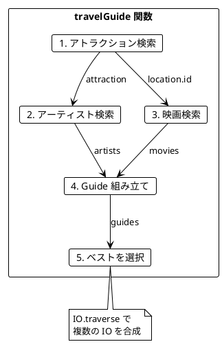

### 11.8 attempt メソッドによるエラーハンドリング

`IO` クラスに追加した `attempt` メソッドは、例外を `Either` に変換します:

```java
// IO クラスの attempt メソッド
public IO<Either<Throwable, A>> attempt() {
    return new IO<>(() -> {
        try {
            return Either.right(thunk.get());
        } catch (Throwable e) {
            return Either.left(e);
        }
    });
}
```

これにより、例外を値として扱うことができ、関数型の方法でエラーハンドリングができます。

---

## 第12章: テスト戦略

### 12.1 関数型プログラミングのテスト

関数型プログラミングでは、純粋関数のおかげでテストが非常に簡単になります。

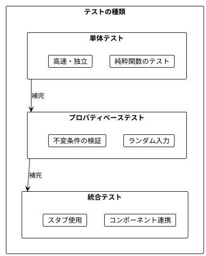

### 12.2 SearchReport の導入

**ソースファイル**: `app/java/src/main/java/ch11/TravelGuide.java`

テスト可能性を高めるため、`SearchReport` を導入します。

```java
/**
 * 検索レポート（エラーや不十分な結果を報告）
 */
public record SearchReport(
        List<Guide> badGuides,
        List<String> problems
) {
    public SearchReport {
        Objects.requireNonNull(badGuides, "SearchReport badGuides cannot be null");
        Objects.requireNonNull(problems, "SearchReport problems cannot be null");
    }

    public static SearchReport empty() {
        return new SearchReport(List.empty(), List.empty());
    }

    public static SearchReport withProblems(List<String> problems) {
        return new SearchReport(List.empty(), problems);
    }

    public static SearchReport withBadGuides(List<Guide> badGuides) {
        return new SearchReport(badGuides, List.empty());
    }
}
```

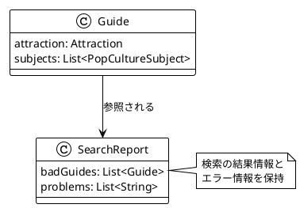

### 12.3 TestDataAccess - テスト用スタブ

**ソースファイル**: `app/java/src/test/java/ch12/TestDataAccess.java`

Builder パターンを使用したテスト用スタブ:

```java
public class TestDataAccess implements DataAccess {

    // ビルダーパターンで作成
    public static Builder builder() {
        return new Builder();
    }

    // 空の DataAccess を作成
    public static DataAccess empty() {
        return builder().build();
    }

    // ファクトリメソッド
    public static DataAccess withAttractions(Attraction... attractions) {
        return builder().withAttractions(attractions).build();
    }

    public static class Builder {
        private List<Attraction> attractions = List.empty();
        private List<Artist> artists = List.empty();
        private List<Movie> movies = List.empty();
        private String attractionsError = null;
        private String artistsError = null;
        private String moviesError = null;

        public Builder withAttractions(Attraction... attractions) {
            this.attractions = List.of(attractions);
            return this;
        }

        public Builder withArtists(Artist... artists) {
            this.artists = List.of(artists);
            return this;
        }

        public Builder withMovies(Movie... movies) {
            this.movies = List.of(movies);
            return this;
        }

        public Builder failOnAttractions(String errorMessage) {
            this.attractionsError = errorMessage;
            return this;
        }

        public Builder failOnArtists(String errorMessage) {
            this.artistsError = errorMessage;
            return this;
        }

        public Builder failOnMovies(String errorMessage) {
            this.moviesError = errorMessage;
            return this;
        }

        public TestDataAccess build() {
            return new TestDataAccess(this);
        }
    }
}
```

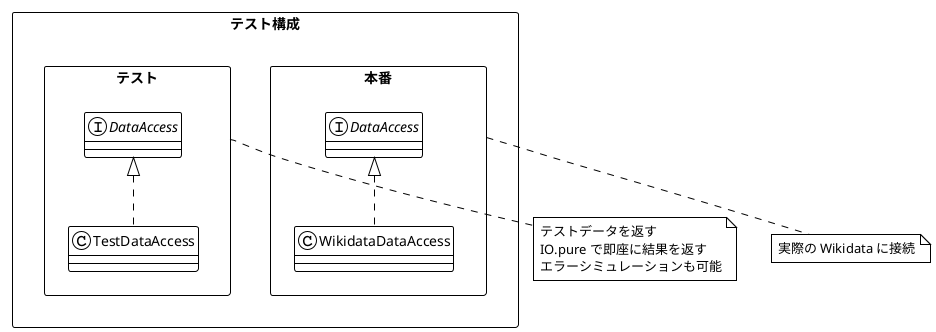

#### TestDataAccess の使用例

```java
// テストデータの準備
static final Location LONDON = new Location(
        new LocationId("Q84"),
        "London",
        8_908_081
);

static final Attraction TOWER_BRIDGE = new Attraction(
        "Tower Bridge",
        Option.none(),
        LONDON
);

static final Artist QUEEN = new Artist("Queen", 2_050_559);
static final Movie INSIDE_OUT = new Movie("Inside Out", 857_611_174);

// 正常系のテスト
@Test
void withAllData() {
    DataAccess dataAccess = TestDataAccess.of(
            List.of(TOWER_BRIDGE),
            List.of(QUEEN),
            List.of(INSIDE_OUT)
    );

    assertThat(dataAccess.findAttractions("test", AttractionOrdering.BY_NAME, 10).unsafeRun())
            .containsExactly(TOWER_BRIDGE);
    assertThat(dataAccess.findArtistsFromLocation(LONDON.id(), 10).unsafeRun())
            .containsExactly(QUEEN);
    assertThat(dataAccess.findMoviesAboutLocation(LONDON.id(), 10).unsafeRun())
            .containsExactly(INSIDE_OUT);
}

// エラーシミュレーション
@Test
void failOnAttractions() {
    DataAccess dataAccess = TestDataAccess.builder()
            .failOnAttractions("Network error")
            .build();

    assertThatThrownBy(() ->
            dataAccess.findAttractions("test", AttractionOrdering.BY_NAME, 10).unsafeRun()
    ).isInstanceOf(RuntimeException.class)
            .hasMessage("Network error");
}
```

### 12.4 プロパティベーステスト

**ソースファイル**: `app/java/src/test/java/ch12/PropertyBasedTest.java`

JUnit 5 の `@RepeatedTest` を使用したプロパティベーステスト:

```java
// ジェネレータの定義
static int nonNegativeInt() {
    return random.nextInt(Integer.MAX_VALUE);
}

static String randomString() {
    int length = random.nextInt(20) + 1;
    StringBuilder sb = new StringBuilder();
    for (int i = 0; i < length; i++) {
        sb.append((char) ('a' + random.nextInt(26)));
    }
    return sb.toString();
}

static Location randomLocation() {
    return new Location(
            new LocationId("Q" + nonNegativeInt(1000000)),
            randomString(),
            nonNegativeInt(10_000_000)
    );
}

static Attraction randomAttraction(boolean withDescription) {
    return new Attraction(
            randomString(),
            withDescription ? Option.some(randomString()) : Option.none(),
            randomLocation()
    );
}

static Guide randomGuide(boolean withDescription, int maxSubjects) {
    return new Guide(
            randomAttraction(withDescription),
            randomSubjects(maxSubjects)
    );
}
```

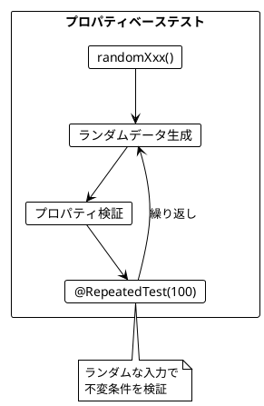

### 12.5 不変条件のテスト

```java
@Nested
@DisplayName("guideScore のプロパティ")
class GuideScorePropertyTest {

    @RepeatedTest(100)
    @DisplayName("スコアは常に 0 以上 100 以下")
    void scoreIsBetween0And100() {
        Guide guide = randomGuide(random.nextBoolean(), 10);

        int score = guideScore(guide);

        assertThat(score).isBetween(0, 100);
    }

    @RepeatedTest(100)
    @DisplayName("説明ありのスコアは説明なしより 30 点高い")
    void descriptionAdds30Points() {
        Location location = randomLocation();
        List<PopCultureSubject> subjects = randomSubjects(4);

        Attraction withDesc = new Attraction("Test", Option.some("Description"), location);
        Attraction withoutDesc = new Attraction("Test", Option.none(), location);

        Guide guideWithDesc = new Guide(withDesc, subjects);
        Guide guideWithoutDesc = new Guide(withoutDesc, subjects);

        int scoreDiff = guideScore(guideWithDesc) - guideScore(guideWithoutDesc);

        assertThat(scoreDiff).isEqualTo(30);
    }

    @RepeatedTest(100)
    @DisplayName("スコアはアトラクション名に依存しない")
    void scoreDoesNotDependOnName() {
        Location location = randomLocation();
        Option<String> description = Option.some(randomString());
        List<PopCultureSubject> subjects = randomSubjects(4);

        Attraction attr1 = new Attraction("Name1", description, location);
        Attraction attr2 = new Attraction("Name2", description, location);

        Guide guide1 = new Guide(attr1, subjects);
        Guide guide2 = new Guide(attr2, subjects);

        assertThat(guideScore(guide1)).isEqualTo(guideScore(guide2));
    }

    @Test
    @DisplayName("フォロワー数のオーバーフローを防ぐ")
    void preventsFollowerOverflow() {
        Attraction attraction = randomAttraction(false);
        List<Artist> artists = List.range(0, 100)
                .map(i -> new Artist("Artist" + i, Integer.MAX_VALUE));
        Guide guide = new Guide(attraction, List.narrow(artists));

        int score = guideScore(guide);

        assertThat(score).isBetween(0, 100);
    }
}
```

### 12.6 純粋関数のプロパティテスト

```java
@Nested
@DisplayName("純粋関数のプロパティ")
class PureFunctionPropertyTest {

    @RepeatedTest(100)
    @DisplayName("guideScore は同じ入力に対して同じ出力を返す（参照透過性）")
    void guideScoreIsReferentiallyTransparent() {
        Guide guide = randomGuide(random.nextBoolean(), 5);

        int score1 = guideScore(guide);
        int score2 = guideScore(guide);
        int score3 = guideScore(guide);

        assertThat(score1).isEqualTo(score2).isEqualTo(score3);
    }

    @RepeatedTest(100)
    @DisplayName("findBestGuide は同じ入力に対して同じ出力を返す")
    void findBestGuideIsReferentiallyTransparent() {
        List<Guide> guides = List.range(0, random.nextInt(5) + 1)
                .map(i -> randomGuide(random.nextBoolean(), 3));

        Option<Guide> result1 = TravelGuide.findBestGuide(guides);
        Option<Guide> result2 = TravelGuide.findBestGuide(guides);

        assertThat(result1).isEqualTo(result2);
    }
}
```

### 12.7 キャッシュのテスト

**ソースファイル**: `app/java/src/test/java/ch11/CachedDataAccessTest.java`

```java
@Test
@DisplayName("同じクエリは2回目以降キャッシュから返される")
void cachedResultsAreReused() {
    AtomicInteger callCount = new AtomicInteger(0);

    DataAccess underlying = new DataAccess() {
        @Override
        public IO<List<Attraction>> findAttractions(String name, AttractionOrdering ordering, int limit) {
            return IO.delay(() -> {
                callCount.incrementAndGet();
                return List.of(TOWER_BRIDGE);
            });
        }

        // 他のメソッドも同様に実装...
    };

    DataAccess cached = CachedDataAccess.createUnsafe(underlying);

    // 1回目のクエリ
    cached.findAttractions("Bridge", AttractionOrdering.BY_NAME, 10).unsafeRun();
    assertThat(callCount.get()).isEqualTo(1);

    // 2回目のクエリ（同じパラメータ）
    cached.findAttractions("Bridge", AttractionOrdering.BY_NAME, 10).unsafeRun();
    assertThat(callCount.get()).isEqualTo(1); // キャッシュから返されるので呼び出し回数は増えない

    // 3回目のクエリ（異なるパラメータ）
    cached.findAttractions("Tower", AttractionOrdering.BY_NAME, 10).unsafeRun();
    assertThat(callCount.get()).isEqualTo(2); // 新しいクエリなので呼び出される
}
```

### 12.8 Resource のテスト

**ソースファイル**: `app/java/src/test/java/ch11/ResourceTest.java`

```java
@Test
@DisplayName("use でリソースを取得して使用")
void useAcquiresAndReleasesResource() {
    AtomicBoolean released = new AtomicBoolean(false);

    Resource<String> resource = Resource.make(
            IO.pure("hello"),
            s -> released.set(true)
    );

    String result = resource.use(s -> IO.pure(s.toUpperCase())).unsafeRun();

    assertThat(result).isEqualTo("HELLO");
    assertThat(released.get()).isTrue();
}

@Test
@DisplayName("処理が失敗してもリソースは解放される")
void resourceReleasedOnFailure() {
    AtomicBoolean released = new AtomicBoolean(false);

    Resource<String> resource = Resource.make(
            IO.pure("hello"),
            s -> released.set(true)
    );

    assertThatThrownBy(() ->
            resource.use(s -> IO.delay(() -> {
                throw new RuntimeException("error");
            })).unsafeRun()
    ).isInstanceOf(RuntimeException.class);

    assertThat(released.get()).isTrue();
}

@Test
@DisplayName("both で2つのリソースを組み合わせる")
void bothCombinesTwoResources() {
    AtomicBoolean firstReleased = new AtomicBoolean(false);
    AtomicBoolean secondReleased = new AtomicBoolean(false);

    Resource<Integer> first = Resource.make(
            IO.pure(1),
            i -> firstReleased.set(true)
    );

    Resource<String> second = Resource.make(
            IO.pure("two"),
            s -> secondReleased.set(true)
    );

    var result = Resource.both(first, second)
            .use(tuple -> IO.pure(tuple._1() + tuple._2()))
            .unsafeRun();

    assertThat(result).isEqualTo("1two");
    assertThat(firstReleased.get()).isTrue();
    assertThat(secondReleased.get()).isTrue();
}
```

### 12.9 テストピラミッド

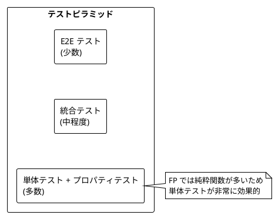

---

## まとめ

### Part VI で学んだこと

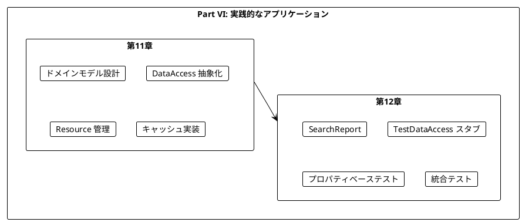

### キーポイント

1. **record と sealed interface**: Java 17 の機能で Scala の case class と ADT を表現
2. **DataAccess インターフェース**: 外部依存を抽象化してテスト可能に
3. **Resource**: acquire/release パターンで安全なリソース管理
4. **guarantee**: finally 的なセマンティクスを IO に追加
5. **attempt**: 例外を Either に変換してエラーを値として扱う
6. **CachedDataAccess**: Ref を使用したスレッドセーフなキャッシュ
7. **TestDataAccess**: Builder パターンでテストスタブを柔軟に作成
8. **プロパティベーステスト**: @RepeatedTest とランダム生成で不変条件を検証

### 学習の総括

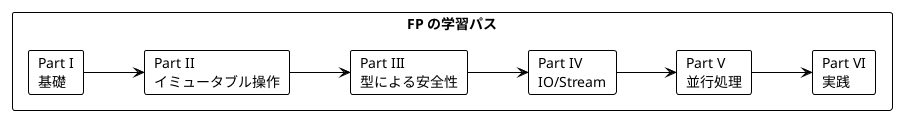

### Scala との比較

| 概念 | Scala (cats-effect) | Java + Vavr |
|------|---------------------|-------------|
| 値オブジェクト | `opaque type LocationId` | `record LocationId(String value)` |
| ドメインモデル | `case class` | `record` |
| ADT | `sealed trait` | `sealed interface` |
| リソース管理 | `Resource[IO, A]` | `Resource<A>` (独自実装) |
| キャッシュ | `Ref[IO, Map[...]]` | `Ref<Map<...>>` |
| エラーハンドリング | `IO[A].attempt` | `IO<A>.attempt()` |
| テストスタブ | `val stub = new DataAccess {...}` | `TestDataAccess.builder().build()` |
| プロパティテスト | ScalaCheck `Gen[A]` | `@RepeatedTest` + random generators |

---

## 演習問題

### 問題 1: DataAccess の拡張

以下の要件で `DataAccess` を拡張してください:
- 新しいメソッド `findHotelsNearLocation` を追加
- 戻り値は `IO<List<Hotel>>`

<details>
<summary>解答</summary>

```java
public record Hotel(String name, double rating, Location location) {}

public interface DataAccess {
    // 既存のメソッド...

    IO<List<Hotel>> findHotelsNearLocation(
            LocationId locationId,
            int limit
    );
}

// TestDataAccess.Builder に追加
public Builder withHotels(Hotel... hotels) {
    this.hotels = List.of(hotels);
    return this;
}
```

</details>

### 問題 2: プロパティベーステスト

以下の関数に対するプロパティベーステストを書いてください:

```java
public static List<Location> filterPopularLocations(
        List<Location> locations,
        int minPopulation) {
    return locations.filter(loc -> loc.population() >= minPopulation);
}
```

<details>
<summary>解答</summary>

```java
static List<Location> randomLocations(int maxCount) {
    int count = random.nextInt(maxCount + 1);
    return List.range(0, count).map(i -> randomLocation());
}

// プロパティ1: 結果は入力以下の要素数
@RepeatedTest(100)
@DisplayName("結果のサイズは入力以下")
void resultSizeIsLessOrEqual() {
    List<Location> locations = randomLocations(20);
    int minPop = nonNegativeInt(10_000_000);

    List<Location> result = filterPopularLocations(locations, minPop);

    assertThat(result.size()).isLessThanOrEqualTo(locations.size());
}

// プロパティ2: 結果のすべての要素は条件を満たす
@RepeatedTest(100)
@DisplayName("すべての結果は最小人口以上")
void allResultsMeetMinimum() {
    List<Location> locations = randomLocations(20);
    int minPop = nonNegativeInt(10_000_000);

    List<Location> result = filterPopularLocations(locations, minPop);

    assertThat(result.forAll(loc -> loc.population() >= minPop)).isTrue();
}

// プロパティ3: 条件を満たす要素はすべて結果に含まれる
@RepeatedTest(100)
@DisplayName("条件を満たす要素はすべて結果に含まれる")
void allQualifyingLocationsAreInResult() {
    List<Location> locations = randomLocations(20);
    int minPop = nonNegativeInt(10_000_000);

    List<Location> result = filterPopularLocations(locations, minPop);
    List<Location> expected = locations.filter(loc -> loc.population() >= minPop);

    assertThat(result).containsExactlyInAnyOrderElementsOf(expected);
}
```

</details>

### 問題 3: Resource の実装

ファイルを安全に読み取る `Resource` を実装してください。

<details>
<summary>解答</summary>

```java
public static Resource<BufferedReader> fileResource(String path) {
    return Resource.fromAutoCloseable(
            IO.delay(() -> new BufferedReader(new FileReader(path)))
    );
}

public static IO<List<String>> readLines(String path) {
    return fileResource(path).use(reader ->
            IO.delay(() -> {
                java.util.List<String> lines = new java.util.ArrayList<>();
                String line;
                while ((line = reader.readLine()) != null) {
                    lines.add(line);
                }
                return List.ofAll(lines);
            })
    );
}

// 使用例
IO<Void> program = readLines("data.txt")
        .flatMap(lines ->
                IO.effect(() -> System.out.println("Read " + lines.size() + " lines"))
        );

program.unsafeRun();
```

</details>

---

## シリーズ全体の総括

本シリーズでは、「Grokking Functional Programming」の内容に沿って、関数型プログラミングの基礎から実践的なアプリケーション構築までを学びました。

### 学んだ主な概念

| Part | 章 | 主な概念 |
|------|-----|----------|
| I | 1-2 | 純粋関数、参照透過性 |
| II | 3-5 | イミュータブルデータ、高階関数、flatMap |
| III | 6-7 | Option、Either、ADT |
| IV | 8-9 | IO モナド、Stream |
| V | 10 | 並行処理、Ref、Fiber |
| VI | 11-12 | 実践アプリケーション、テスト |

### 関数型プログラミングの利点

1. **予測可能性**: 純粋関数は同じ入力に対して常に同じ出力
2. **テスト容易性**: 副作用がないためテストが簡単
3. **合成可能性**: 小さな関数を組み合わせて複雑な処理を構築
4. **並行安全性**: イミュータブルデータは競合状態を防ぐ
5. **型安全性**: Option、Either で null や例外を型で表現

### 次のステップ

- Vavr のより高度な機能を学ぶ
- プロジェクト Reactor や RxJava を探索
- Virtual Thread と組み合わせた実践的な並行処理
- 実際のプロジェクトで FP を適用する
