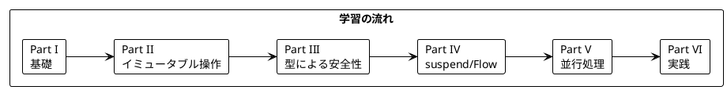

# Grokking Functional Programming Kotlin 版解説

本シリーズは「Grokking Functional Programming」（Michał Płachta 著）の学習コンパニオンとして、関数型プログラミングの概念を **Kotlin + Arrow + kotlinx.coroutines** で実装しながら日本語で解説します。

---

## 対象読者

- Kotlin の経験があり、関数型プログラミングを体系的に学びたい開発者
- Scala を学ばずに JVM 上で実践的な FP を身につけたい方
- Arrow ライブラリやコルーチンを FP の観点から使いこなしたいエンジニア

---

## 記事一覧

### [Part I: 関数型プログラミングの基礎](part-1.md)

関数型プログラミングの基本概念を学びます。

| 章 | トピック |
|----|----------|
| 第1章 | 命令型 vs 関数型、Kotlin での FP 入門 |
| 第2章 | 純粋関数、副作用の排除、テストの容易さ |

**キーワード**: 純粋関数、参照透過性、式本体関数、`val`

---

### [Part II: 関数型スタイルのプログラミング](part-2.md)

イミュータブルなデータ操作と高階関数を学びます。

| 章 | トピック |
|----|----------|
| 第3章 | イミュータブルデータ、読み取り専用 `List` の操作 |
| 第4章 | 高階関数、`map` / `filter` / `fold`、拡張関数 |
| 第5章 | `flatMap`、for 内包表記の代替 |

**キーワード**: 読み取り専用コレクション、関数型 `(A) -> B`、末尾ラムダ、`flatMap`

---

### [Part III: エラーハンドリングと Option/Either](part-3.md)

型安全なエラーハンドリングを学びます。

| 章 | トピック |
|----|----------|
| 第6章 | nullable 型（`A?`）と Arrow `Option` |
| 第7章 | Arrow `Either`、`Raise` DSL、sealed interface とパターンマッチング |

**キーワード**: null 安全、`Either`、`either { }`、`when` の網羅性

---

### [Part IV: IO と副作用の管理](part-4.md)

副作用の分離とストリーム処理を学びます。

| 章 | トピック |
|----|----------|
| 第8章 | サンクによる IO、`suspend` 関数、リトライ |
| 第9章 | `Sequence` と `Flow` によるストリーム処理 |

**キーワード**: `suspend`、`Schedule`、`Sequence`、`Flow`

---

### [Part V: 並行処理](part-5.md)

関数型プログラミングにおける並行処理を学びます。

| 章 | トピック |
|----|----------|
| 第10章 | 構造化並行性、`parMap` / `parZip`、共有状態、キャンセル、STM |

**キーワード**: コルーチン、構造化並行性、`parMap`、`raceN`、`MutableStateFlow`、`TVar`

---

### [Part VI: 実践的なアプリケーション構築とテスト](part-6.md)

実践的なアプリケーション構築とテスト戦略を学びます。

| 章 | トピック |
|----|----------|
| 第11章 | TravelGuide アプリ、Arrow `Resource` によるリソース管理 |
| 第12章 | テスト戦略、Kotest によるプロパティベーステスト |

**キーワード**: `Resource`、DataAccess 抽象化、キャッシュ、Kotest Property

---

## 学習パス



Part I〜II は Kotlin 標準ライブラリのみ、Part III から Arrow Core、Part IV 以降でコルーチンと Arrow Fx を段階的に導入します。

---

## 使用ライブラリ

| ライブラリ | バージョン | 用途 | 対応章 |
|------------|-----------|------|--------|
| Kotlin | 2.4 | 言語（JVM 21） | 全章 |
| Arrow Core | 2.2 | `Either`、`Option`、`Raise` DSL、`NonEmptyList` | Part III〜VI |
| Arrow Fx Coroutines | 2.2 | `parMap`、`parZip`、`raceN`、`Resource` | Part V〜VI |
| Arrow Resilience | 2.2 | `Schedule` によるリトライ | Part IV |
| Arrow Fx STM | 2.2 | `TVar`、`atomically` によるトランザクション | Part V |
| kotlinx.coroutines | 1.11 | `suspend`、`Flow`、構造化並行性 | Part IV〜VI |
| Kotest | 6.2 | 単体テスト、プロパティベーステスト | 全章 |

---

## Arrow とは

[Arrow](https://arrow-kt.io/) は Kotlin 向けの関数型プログラミングライブラリです。

### 主な機能

- **型付きエラー**: `Either`、`Raise` DSL（`either { }`、`bind()`、`ensure`）
- **エラーの蓄積**: `zipOrAccumulate`、`mapOrAccumulate`、`NonEmptyList`
- **並行処理**: `parMap`、`parZip`、`raceN`（kotlinx.coroutines の上に構築）
- **リソース管理**: `Resource`、`resourceScope`
- **レジリエンス**: `Schedule`、`CircuitBreaker`
- **STM**: `TVar`、`atomically`、`retry` / `orElse`

### Arrow 2.x の設計方針

Arrow 2.x は Scala の cats-effect のような独自の `IO` 型を持ちません。代わりに Kotlin の `suspend` 関数を「副作用を持つ計算」の印として扱い、コルーチンの上に FP の道具を積み上げています。Kotlin 版では、この設計判断が Scala 版との最大の違いになります。

### Scala との対応

| Scala | Kotlin + Arrow |
|-------|---------------|
| `Option[A]` | nullable 型 `A?` / `Option<A>` |
| `Either[E, A]` | `Either<E, A>` |
| `for` 内包表記 | `either { }` / `option { }` と `bind()` |
| `sealed trait` + `case class` | `sealed interface` + `data class` |
| `match` | `when` |
| `IO[A]` | `suspend () -> A` |
| `fs2.Stream[IO, A]` | `Flow<A>` |
| `Ref[IO, A]` | `MutableStateFlow<A>` / `Atomic` |
| `parSequence` / `parTraverse` | `parMap` |
| `Resource[IO, A]` | `Resource<A>` |
| ScalaCheck | Kotest Property |

---

## リポジトリ構成

```
grokkingfp-excersice/
├── app/kotlin/
│   ├── build.gradle.kts           # Gradle（Kotlin DSL）設定
│   └── src/
│       ├── main/kotlin/ch01〜ch12/ # Kotlin + Arrow のサンプルコード
│       └── test/kotlin/ch01〜ch12/ # Kotest によるテストコード
└── docs/article/kotlin/           # Kotlin 版解説（本ディレクトリ）
    ├── index.md                   # この記事
    ├── part-1.md 〜 part-6.md     # Part I〜VI
    └── writing-plan.md            # 執筆計画
```

---

## 関数型プログラミングの利点

本シリーズを通じて、以下の利点を実感できます。

1. **予測可能性** - 純粋関数は同じ入力に対して常に同じ出力を返す
2. **テスト容易性** - 副作用がないためテストが簡単
3. **合成可能性** - 小さな関数を組み合わせて複雑な処理を構築できる
4. **並行安全性** - イミュータブルデータは競合状態を防ぐ
5. **型安全性** - nullable 型や `Either` で失敗を型として表現できる

---

## Kotlin での FP: Scala、Java との比較

| 特徴 | Scala | Java + Vavr | Kotlin + Arrow |
|------|-------|-------------|----------------|
| 構文の簡潔さ | 非常に簡潔 | やや冗長 | 簡潔 |
| 型推論 | 強力 | 限定的 | 強力 |
| null 安全 | `Option` | `Option`（ライブラリ） | 言語組み込み（`A?`） |
| パターンマッチ | 言語機能 | `switch` パターン | `when`（網羅性チェックあり） |
| 内包表記 | `for` | `For.yield()` | `Raise` DSL |
| IO の表現 | `IO` モナド | 独自 `IO` | `suspend` 関数 |
| 学習コスト | 高い | 低い（Java 経験者） | 中程度 |

---

## 実行方法

```bash
cd app/kotlin
./gradlew test                    # 全テストの実行
./gradlew test --tests 'ch06.*'   # 章を指定して実行
```

Nix を使う場合は、プロジェクトルートで `nix develop .#kotlin` を実行してから上記コマンドを実行します。

---

## 参考資料

- [Grokking Functional Programming](https://www.manning.com/books/grokking-functional-programming) - 原著
- [Kotlin 公式ドキュメント](https://kotlinlang.org/docs/home.html)
- [Arrow 公式ドキュメント](https://arrow-kt.io/)
- [kotlinx.coroutines ガイド](https://kotlinlang.org/docs/coroutines-guide.html)
- [Kotest ドキュメント](https://kotest.io/)
