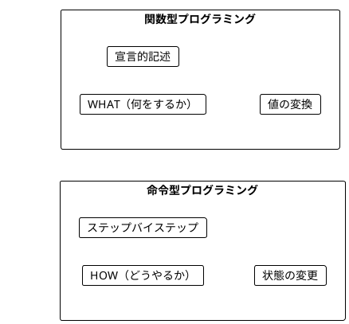
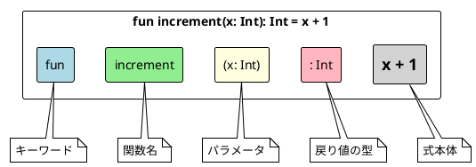
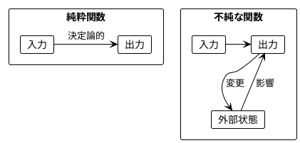
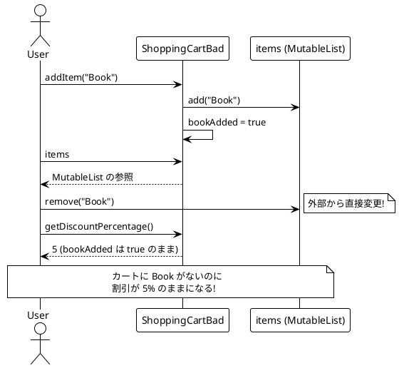
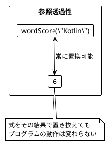
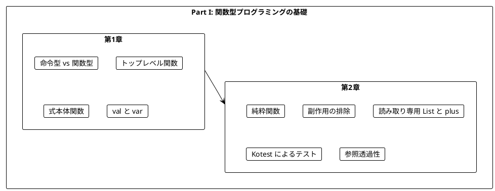

# Part I: 関数型プログラミングの基礎

本章では、関数型プログラミング（FP）の基本概念を **Kotlin** で学びます。命令型プログラミングとの違いを理解し、純粋関数の利点を実感することが目標です。

Part I と Part II では Arrow を使わず、Kotlin の標準ライブラリだけで FP の考え方を確認します。Kotlin は式本体関数、`val`、トップレベル関数、読み取り専用の `List` といった仕組みを言語レベルで備えているため、特別なライブラリがなくても関数型スタイルを自然に書けます。

---

## 第1章: 関数型プログラミング入門

### 1.1 命令型 vs 関数型

プログラミングには大きく分けて 2 つのパラダイムがあります。



**命令型プログラミング**は「どうやるか」を記述します。

**ソースファイル**: `app/kotlin/src/main/kotlin/ch01/IntroKotlin.kt`

```kotlin
// Kotlin: 命令型でワードスコアを計算
fun calculateScoreImperative(word: String): Int {
    var score = 0
    for (c in word) {
        score++
    }
    return score
}
```

`var` で宣言した変数 `score` を、ループの中で 1 つずつ書き換えています。処理の「手順」をコンピュータに指示するスタイルです。

**関数型プログラミング**は「何をするか」を記述します。

```kotlin
// Kotlin: 関数型でワードスコアを計算
fun wordScore(word: String): Int = word.length
```

「ワードスコアとは単語の長さである」という定義をそのまま書いています。状態の書き換えはなく、入力から出力への変換だけが残ります。

### 1.2 Kotlin の基本構文

#### トップレベル関数

Java ではすべてのメソッドがクラスに属するため、`public static` を付けたユーティリティクラスを用意するのが定番でした。Kotlin では関数をファイルの直下（トップレベル）に定義できます。

トップレベル関数はクラスのインスタンスや `this` に依存しないため、「入力を受け取り出力を返すだけ」という純粋関数の姿をそのまま表現できます。JVM 上ではファイル名に `Kt` を付けたクラス（例: `ch01.IntroKotlinKt`）の static メソッドとしてコンパイルされます。

#### 式本体関数

`fun f(x: Int): Int = x + 1` のように `=` の右側に式を 1 つだけ書く形を **式本体関数**（expression body）と呼びます。`{ return ... }` を書くブロック本体と比べて次の利点があります。

- 関数が「値を計算する式」であることが一目で分かる
- `return` 文や途中の代入を書く余地がないため、副作用が紛れ込みにくい
- 戻り値の型を省略しても推論される（公開 API では明示するのが推奨）

```kotlin
package ch01

fun increment(x: Int): Int = x + 1

fun concatenate(a: String, b: String): String = a + b

fun doubleValue(x: Int): Int = x * 2

fun greet(name: String): String = "Hello, $name!"

fun isEven(n: Int): Boolean = n % 2 == 0
```

`"Hello, $name!"` は文字列テンプレートです。Java の `"Hello, " + name + "!"` よりも簡潔に書けます。

#### val と var

Kotlin の変数宣言には、再代入できない `val` と再代入できる `var` の 2 種類があります（Scala と同じキーワードです）。右辺から型が分かる場合は型注釈を省略できます。

```kotlin
val score1 = wordScore("Kotlin")  // 再代入不可
var score = 0                     // 再代入可能
score++                           // OK
// score1 = 10                    // コンパイルエラー
```

関数型スタイルでは **原則として `val` を使い、`var` は局所的なループなどに限定します**。上の `calculateScoreImperative` は `var` を使った命令型の例、`wordScore` は `var` を必要としない関数型の例です。なお、`val` は「参照を差し替えられない」ことを保証するだけで、参照先のオブジェクトが不変であることまでは保証しません。この点は 2.3 節で `List` と `MutableList` を使って確認します。

### 1.3 関数の構造



Java の `public static int increment(int x) { return x + 1; }` と比べると、修飾子と `return` がなくなり、型がパラメータ名の後ろに来ています。この「名前: 型」の順序は Scala と同じです。

### 1.4 学習ポイント

| 概念 | 命令型 | 関数型 |
|------|--------|--------|
| 焦点 | 手順（How） | 結果（What） |
| 状態 | 変更する（`var`） | 変換する（`val`） |
| ループ | `for` / `while` | `map` / `filter` / `fold` |
| データ | ミュータブル（`MutableList`） | イミュータブル（`List`） |
| 関数の形 | ブロック本体 + `return` | 式本体関数 |

---

## 第2章: 純粋関数とテスト

### 2.1 純粋関数とは

純粋関数（Pure Function）は以下の特徴を持つ関数です。

1. **同じ入力には常に同じ出力を返す**
2. **副作用がない**（外部状態を変更しない）



### 2.2 純粋関数の例

**ソースファイル**: `app/kotlin/src/main/kotlin/ch02/PureFunctions.kt`

```kotlin
// 純粋関数の例
fun increment(x: Int): Int = x + 1

fun add(a: Int, b: Int): Int = a + b

fun getFirstCharacter(s: String): Char = s[0]

/** 入力の 95% を返す */
fun applyDiscount(x: Double): Double = x * 95.0 / 100.0

/** 文字列の長さの 3 倍をスコアとする */
fun calculateStringScore(s: String): Int = s.length * 3
```

どの関数も引数だけを使って結果を計算し、外部の何にも触れていません。

**純粋ではない関数の例**:

```kotlin
import kotlin.random.Random

/** 不純: 乱数に依存するため、同じ入力でも毎回異なる値を返しうる */
fun randomPart(x: Double): Double = x * Random.nextDouble()

/** 不純: 呼び出すタイミングによって結果が変わる */
fun currentTime(): Long = System.currentTimeMillis()
```

どちらも式本体関数で書かれていますが、純粋ではありません。式本体で書くことは純粋さの「手がかり」にはなっても「保証」にはならない点に注意してください。乱数生成器やシステム時計という **隠れた入力** に依存しているため、引数が同じでも結果が変わります。

### 2.3 ショッピングカートの例

状態を持つクラスの問題点を見てみましょう。

**ソースファイル**: `app/kotlin/src/main/kotlin/ch02/ShoppingCartBad.kt`

#### 問題のあるコード

```kotlin
class ShoppingCartBad {
    /** 問題: 可変リストを外部に公開しているため、誰でも中身を変更できる */
    val items: MutableList<String> = mutableListOf()

    /** 問題: items とは別に管理されるフラグ。items と食い違う可能性がある */
    private var bookAdded = false

    fun addItem(item: String) {
        items.add(item)
        if (item == "Book") {
            bookAdded = true
        }
    }

    fun getDiscountPercentage(): Int = if (bookAdded) 5 else 0

    /** 読み取り専用の型で返しても、中身は内部の可変リストそのもの */
    fun itemsView(): List<String> = items
}
```

`items` は `val` で宣言されていますが、型が `MutableList` なので中身はいくらでも変更できます。`val` が守っているのは「`items` が別のリストに差し替えられないこと」だけです。



#### 読み取り専用 ≠ イミュータブル

では `itemsView()` のように戻り値の型を読み取り専用の `List<String>` にすれば安全でしょうか。

```kotlin
test("読み取り専用ビューでも内部状態の変更が見えてしまう") {
    val cart = ShoppingCartBad()
    val view: List<String> = cart.itemsView()
    view shouldBe emptyList()

    cart.addItem("Apple")
    view shouldBe listOf("Apple")
}
```

Kotlin の `List` インターフェースには `add` や `remove` がないため、`view` を通して変更することはできません。しかし `view` の実体は内部の `MutableList` そのものなので、カート側が変更されると `view` の中身も変わってしまいます。Kotlin の `List` は **読み取り専用のビュー** であって、**イミュータブル（不変）であることを保証する型ではない** のです。

この区別は Kotlin 版で繰り返し登場する重要な論点です。関数型スタイルでは、可変なコレクションを共有せず、変更が必要なときは **新しいリストを作る** ことで不変性を保ちます。

#### 純粋関数による解決

**ソースファイル**: `app/kotlin/src/main/kotlin/ch02/ShoppingCart.kt`

```kotlin
/** Book が含まれていれば 5%、そうでなければ 0% の割引率を返す */
fun getDiscountPercentage(items: List<String>): Int =
    if ("Book" in items) 5 else 0
```

状態（`items` と `bookAdded`）をクラスに持たせるのをやめ、カートの中身を引数として受け取って、その都度割引率を計算します。フラグと中身が食い違う余地は最初からありません。

Kotlin では `if` が **式** なので、Java の三項演算子の代わりにそのまま値として使えます。`"Book" in items` は `items.contains("Book")` の演算子版です。

### 2.4 読み取り専用 List と plus によるイミュータブル操作

Java 版では Vavr の `List` を使ってイミュータブルな操作を示しました。Kotlin では標準ライブラリの `List` と、新しいリストを返す演算子 `plus`（`+`）/ `minus`（`-`）で同じことができます。

```kotlin
test("plus は新しいリストを作成") {
    val cart1 = listOf("Apple")
    val cart2 = cart1 + "Book"

    cart1 shouldBe listOf("Apple")
    cart2 shouldBe listOf("Apple", "Book")
    getDiscountPercentage(cart1) shouldBe 0
    getDiscountPercentage(cart2) shouldBe 5
}
```

`listOf` で作ったリストを `val` で保持し、`+` / `-` で新しいリストを作る限り、既存のリストが変わることはありません。`cart1 + "Book" + "Lemon"` のように連鎖させても同様です。

| 操作 | `List`（読み取り専用） | `MutableList`（可変） |
|------|----------------------|---------------------|
| 生成 | `listOf("Apple")` | `mutableListOf("Apple")` |
| 要素追加 | `list + "Book"`（新しいリスト） | `list.add("Book")`（その場で変更） |
| 要素削除 | `list - "Book"`（新しいリスト） | `list.remove("Book")`（その場で変更） |
| 要素検索 | `"Book" in list` | `"Book" in list` |

`plus` は呼び出すたびに要素をコピーするため、大量の要素を繰り返し追加する用途には向きません。リストを組み立てる別の方法（`buildList`）は Part II で扱います。

### 2.5 チップ計算の例

**ソースファイル**: `app/kotlin/src/main/kotlin/ch02/TipCalculator.kt`

```kotlin
/** 6 人以上: 20%、1〜5 人: 10%、0 人: 0% のチップ率を返す */
fun getTipPercentage(names: List<String>): Int =
    when {
        names.size > 5 -> 20
        names.isNotEmpty() -> 10
        else -> 0
    }
```

引数なしの `when` は `if-else if-else` の連鎖を式として書くための構文です。`if` と同様に値を返すため、式本体関数と組み合わせると条件分岐全体が 1 つの式になります。

グループにメンバーを追加するときも `group1 + "Charlie"` や `group2 + listOf("David", "Eve")` のように新しいリストを作れば、元のグループは変わりません（`TipCalculatorTest.kt` で検証しています）。

### 2.6 純粋関数のテスト

純粋関数は非常にテストしやすいです。Kotlin 版では **Kotest** の `FunSpec` スタイルを使います。`context` でテストをグループ化し、`test` の名前には日本語で振る舞いを書きます。

**ソースファイル**: `app/kotlin/src/test/kotlin/ch01/IntroKotlinTest.kt`

```kotlin
class IntroKotlinTest : FunSpec({

    context("基本的な純粋関数") {
        test("increment は入力に 1 を加える") {
            increment(0) shouldBe 1
            increment(6) shouldBe 7
            increment(-1) shouldBe 0
            increment(Int.MAX_VALUE - 1) shouldBe Int.MAX_VALUE
        }
    }
})
```

`shouldBe` は中置関数（infix function）として定義されたアサーションで、`実際の値 shouldBe 期待値` と英文のように読めます。純粋関数のテストには、セットアップもモックも不要です。関数を呼んで結果を比べるだけで済みます。

一方、不純な関数のテストは回りくどくなります。`PureFunctionsTest.kt` では `currentTime()` の結果が変わることを確かめるために `Thread.sleep` を挟んでいますが、これ自体がこの関数が外部の状態（時計）に依存している証拠です。

| 観点 | 純粋関数のテスト | 状態を持つコードのテスト |
|------|----------------|------------------------|
| 準備 | セットアップ不要 | セットアップが必要 |
| 独立性 | 独立して実行可能 | 実行順序に依存しやすい |
| 結果 | 決定論的で高速 | 非決定論的になりやすい |
| 依存 | モック / スタブ不要 | モック / スタブが必要 |

### 2.7 文字 'a' を除外するワードスコア

ワードスコアの仕様を「文字 'a' を数えない」に変更してみましょう。命令型では、ループの中に条件分岐を追加します。

**ソースファイル**: `app/kotlin/src/main/kotlin/ch01/IntroKotlin.kt`

```kotlin
fun calculateScoreWithoutAImperative(word: String): Int {
    var score = 0
    for (c in word) {
        if (c != 'a') {
            score++
        }
    }
    return score
}
```

関数型では「'a' を取り除いた文字列の長さ」という定義を書き直すだけです。

```kotlin
fun wordScoreWithoutA(word: String): Int = word.replace("a", "").length
```

テストでは、具体的な値の確認に加えて「命令型と関数型が同じ結果を返すこと」も確かめます。

```kotlin
test("命令型と関数型で同じ結果を返す") {
    listOf("", "Scala", "banana", "Kotlin", "haskell").forEach { word ->
        calculateScoreWithoutAImperative(word) shouldBe wordScoreWithoutA(word)
    }
}
```

`"Scala"` は `"Scl"` になるので 3、`"banana"` は `"bnn"` になるので 3 です。

### 2.8 参照透過性

純粋関数は **参照透過性（Referential Transparency）** を持ちます。

> 式をその評価結果で置き換えても、プログラムの意味が変わらないこと

```kotlin
test("式をその結果で置き換えても動作が変わらない") {
    val total1 = wordScore("Kotlin") + wordScore("Scala")
    val total2 = 6 + 5
    total1 shouldBe total2
}
```

`wordScore("Kotlin")` はいつどこで評価しても `6` なので、プログラム中のこの式を `6` に書き換えても意味は変わりません。逆に `currentTime()` を、ある時点で得た値に置き換えると、プログラムの意味が変わってしまいます。



参照透過性があると、関数を読むときに「その関数の中身」だけを見ればよくなり、コードの理解と変更が容易になります。

---

## まとめ

### Part I で学んだこと



### キーポイント

1. **関数型プログラミング** は「何をするか」を宣言的に記述する
2. **トップレベル関数** と **式本体関数** を使うと、純粋関数を「入力から出力への式」として簡潔に書ける
3. **`val` を基本** にし、`var` は局所的な用途に限定する
4. **純粋関数** は同じ入力に対して常に同じ出力を返し、副作用を持たない
5. Kotlin の **`List` は読み取り専用のビュー** であり、イミュータブルの保証ではない。変更は `plus` / `minus` で新しいリストを作って表現する
6. **純粋関数はテストが簡単** で、Kotest の `shouldBe` で入力と出力を比べるだけで済む
7. **参照透過性** により、式を値で置き換えて推論できる

### Scala との対応

| 概念 | Scala | Kotlin |
|------|-------|--------|
| 関数定義 | `def f(x: Int): Int = x + 1` | `fun f(x: Int): Int = x + 1` |
| 関数の置き場所 | `object` 内、または Scala 3 のトップレベル定義 | トップレベル関数 |
| 変数（再代入不可 / 可） | `val` / `var` | `val` / `var` |
| 文字列テンプレート | `s"Hello, $name!"` | `"Hello, $name!"` |
| 多分岐 | `match` / `if-else` の連鎖 | `when { ... }` |
| イミュータブルリスト | `List("Apple")`（永続データ構造） | `listOf("Apple")`（読み取り専用ビュー） |
| 要素の追加 | `list.appended("Book")` / `list :+ "Book"` | `list + "Book"` |
| 要素の検索 | `list.contains("Book")` | `"Book" in list` |
| テスト | ScalaTest / MUnit | Kotest（`FunSpec`、`shouldBe`） |

最も大きな違いは `List` の性質です。Scala の `List` は構造的に不変な永続データ構造ですが、Kotlin の `List` は変更メソッドを持たないインターフェースにすぎません。Kotlin で不変性を保つには、型だけでなく「可変コレクションを共有しない」という規律が必要になります。

### 次のステップ

Part II では、以下のトピックを学びます。

- イミュータブルなデータ操作（`plus`、`take` / `drop`、`subList`）
- 高階関数（関数型 `(A) -> B`、末尾ラムダと `it`）
- 拡張関数によるパイプライン風の記述
- `flatMap` とネスト構造の平坦化
- `fold` と `reduce` の違い、`buildList`

---

## 演習問題

### 問題 1: 純粋関数の識別

以下の関数のうち、純粋関数はどれですか。

```kotlin
// A
fun doubleValue(x: Int): Int = x * 2

// B
var counter = 0
fun incrementCounter(): Int {
    counter++
    return counter
}

// C
fun greet(name: String): String = "Hello, $name!"

// D
fun currentTime(): Long = System.currentTimeMillis()
```

<details>
<summary>解答</summary>

**A と C は純粋関数** です。

- A: 同じ入力に対して常に同じ出力を返し、副作用がない
- B: トップレベルの `var counter` を変更する副作用がある（不純）
- C: 同じ入力に対して常に同じ出力を返し、副作用がない
- D: 式本体関数だが、呼び出すたびに異なる値を返す（不純）

D のように、式本体で書かれていても外部の状態に依存していれば純粋ではありません。

</details>

### 問題 2: 純粋関数への書き換え

以下の不純なクラスを、状態を持たない純粋関数に書き換えてください。

```kotlin
class Counter {
    private var value = 0

    fun increment(): Int {
        value++
        return value
    }
}
```

<details>
<summary>解答</summary>

```kotlin
fun increment(value: Int): Int = value + 1

// 使用例
val v1 = 0
val v2 = increment(v1)  // 1
val v3 = increment(v2)  // 2
```

状態を関数の外に出し、関数は値を受け取って新しい値を返すだけにします。呼び出し側はすべて `val` で書けるようになり、どの時点の値なのかが名前で区別できます。

</details>

### 問題 3: Kotest でテストを書く

以下の関数に対するテストを Kotest の `FunSpec` で書いてください。

```kotlin
fun hasDiscount(items: List<String>): Boolean =
    "Book" in items || "Magazine" in items
```

<details>
<summary>解答</summary>

```kotlin
class HasDiscountTest : FunSpec({
    test("空のリストは割引なし") {
        hasDiscount(emptyList()) shouldBe false
    }

    test("Book または Magazine を含むと割引あり") {
        hasDiscount(listOf("Book")) shouldBe true
        hasDiscount(listOf("Magazine")) shouldBe true
        hasDiscount(listOf("Book", "Magazine")) shouldBe true
        hasDiscount(listOf("Apple", "Book", "Orange")) shouldBe true
    }

    test("どちらも含まなければ割引なし") {
        hasDiscount(listOf("Apple", "Orange")) shouldBe false
    }
})
```

純粋関数なので、どのテストも入力を用意して結果を比べるだけで完結します。

</details>

---

## 実行方法

### テストの実行

```bash
cd app/kotlin

# すべてのテストを実行
./gradlew test

# 章ごとにテストを実行
./gradlew test --tests 'ch01.*'
./gradlew test --tests 'ch02.*'

# 特定のテストクラスだけを実行
./gradlew test --tests 'ch02.ShoppingCartTest'
```

### サンプルコードの実行

```bash
cd app/kotlin
./gradlew run
```

`build.gradle.kts` の `mainClass` には `ch01.IntroKotlinKt` が設定されており、`IntroKotlin.kt` の `main` 関数が実行されます。
