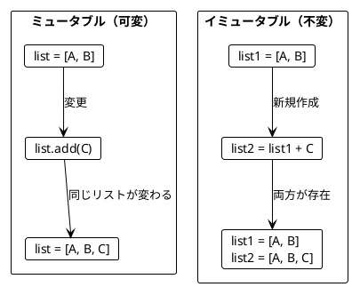
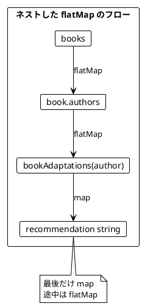
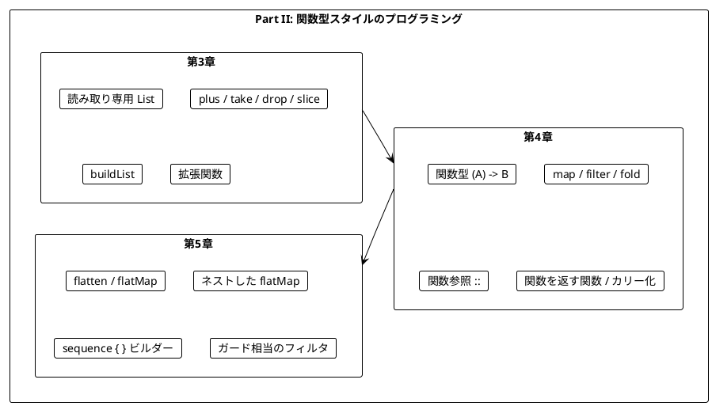

# Part II: 関数型スタイルのプログラミング

本章では、関数型プログラミングの核心となるテクニックを学びます。イミュータブルなデータ操作、高階関数、そして `flatMap` による複雑なデータ変換を、Kotlin の標準ライブラリだけで習得します。Arrow は Part III から導入するため、この Part には登場しません。

Kotlin のコレクション API は、最初から関数型スタイルを前提に設計されています。`map`、`filter`、`fold`、`flatMap` が標準で用意されており、末尾ラムダと `it` で簡潔に書けます。一方で、`List` が「読み取り専用」であって「イミュータブル」ではないという、Kotlin 固有の注意点もあります。

---

## 第3章: イミュータブルなデータ操作

### 3.1 イミュータブルとは

イミュータブル（不変）とは、一度作成されたデータが変更されないことを意味します。データを「変更」する代わりに、新しいデータを「作成」します。



#### List と MutableList

Kotlin のコレクションには、読み取り専用のインターフェース `List` と、変更操作を持つ `MutableList` の 2 種類があります。`MutableList` は `List` を継承しているため、`MutableList` を `List` 型の変数に代入できます。

| インターフェース | 生成関数 | 変更操作 |
|-----------------|---------|---------|
| `List<T>` | `listOf`、`buildList` | なし（`get`、`size` などの読み取りのみ） |
| `MutableList<T>` | `mutableListOf`、`arrayListOf` | `add`、`remove`、`set` など |

#### 読み取り専用 ≠ イミュータブル

ここが Kotlin で最も注意すべき点です。`List` 型は「この参照からは変更できない」ことを表すだけで、「中身が絶対に変わらない」ことは保証しません。

**ソースファイル**: `app/kotlin/src/test/kotlin/ch03/ImmutableListTest.kt`

```kotlin
test("MutableList を List として参照しても、元のリストの変更は見えてしまう") {
    val mutable = mutableListOf("a", "b")
    val readOnly: List<String> = mutable

    mutable.add("c")

    readOnly shouldBe listOf("a", "b", "c")
}
```

`readOnly` からは `add` を呼べませんが、同じオブジェクトを指す `mutable` から変更すると、`readOnly` の内容も変わります。外部から受け取ったリストを保持し続ける場合は、`toList()` でコピーを取っておくと安全です。

**ソースファイル**: `app/kotlin/src/main/kotlin/ch03/ImmutableList.kt`

```kotlin
/** 呼び出し時点の内容を新しいリストとしてコピーする */
fun <T> snapshotOf(list: List<T>): List<T> = list.toList()

// テスト
val mutable = mutableListOf("a", "b")
val snapshot = snapshotOf(mutable)
mutable.add("c")
snapshot shouldBe listOf("a", "b")
```

`List` 型は「変更操作を持たない窓」であり、中身の不変性は保証しません。本シリーズでは、`MutableList` を関数の外に公開せず、関数は常に新しい `List` を返すという規律を守ることで、実質的なイミュータブル性を確保します。

### 3.2 List の基本操作

**ソースファイル**: `app/kotlin/src/main/kotlin/ch03/ImmutableList.kt`

#### plus - 要素の追加

Kotlin の `List` には `plus` 演算子（`+`）が定義されており、要素またはリストを連結した **新しいリスト** を返します。Scala の `appended` / `appendedAll` に相当します。

```kotlin
val appleBook = listOf("Apple", "Book")
val appleBookMango = appleBook + "Mango"

appleBook shouldBe listOf("Apple", "Book")                  // 元のリストは変わらない
appleBookMango shouldBe listOf("Apple", "Book", "Mango")    // 新しいリストが作成される

listOf("a", "b").plus(listOf("c", "d")) shouldBe listOf("a", "b", "c", "d")
```

`MutableList.add` が「自分自身を変更する」のに対し、`plus` は「元を変えずに新しいリストを作る」点が決定的に異なります。

#### take / drop / slice - リストの切り出し

```kotlin
/** 最初の 2 要素を取得 */
fun firstTwo(list: List<String>): List<String> = list.take(2)

/** 最後の 2 要素を取得 */
fun lastTwo(list: List<String>): List<String> = list.takeLast(2)

/** start 以上 end 未満の要素を取得 */
fun <T> slice(list: List<T>, start: Int, end: Int): List<T> = list.slice(start until end)

// テスト
val letters = listOf("a", "b", "c", "d")
firstTwo(letters) shouldBe listOf("a", "b")
lastTwo(letters) shouldBe listOf("c", "d")
slice(letters, 1, 3) shouldBe listOf("b", "c")
firstTwo(listOf("a")) shouldBe listOf("a")   // 要素数を超えても例外を投げない
```

`slice` は `IntRange` を受け取り、`start until end` は「`start` 以上 `end` 未満」の範囲です。Java 由来の `subList(from, to)` も使えますが、`subList` は **元のリストのビュー** を返すため、元が `MutableList` だと変更の影響を受けます。関数型スタイルでは新しいリストを返す `slice` を使います。

### 3.3 リストの変換例

**ソースファイル**: `app/kotlin/src/main/kotlin/ch03/ImmutableList.kt`

`take` / `drop` と `+` を組み合わせれば、元のリストを変えずにさまざまな変換ができます。

```kotlin
/** 最初の 2 要素を末尾に移動 */
fun movedFirstTwoToTheEnd(list: List<String>): List<String> {
    val firstTwo = list.take(2)
    val withoutFirstTwo = list.drop(2)
    return withoutFirstTwo + firstTwo
}

// テスト
movedFirstTwoToTheEnd(listOf("a", "b", "c")) shouldBe listOf("c", "a", "b")
```

同じ考え方で、`dropLast` / `takeLast` を使った `insertedBeforeLast`（最後の要素の前に挿入）も実装しています。

#### buildList - 可変操作を閉じ込める

ループで要素を追加していく処理を書きたい場合は `buildList` を使います。ブロックの内側では `MutableList` として `add` でき、外側には読み取り専用の `List` だけが返ります。可変性がブロックの外に漏れないため、関数としては純粋なままです。

```kotlin
/** 1 から n までの 2 乗のリストを作る（可変操作は buildList の内側に閉じ込める） */
fun squares(n: Int): List<Int> = buildList {
    for (i in 1..n) add(i * i)
}

// テスト
squares(4) shouldBe listOf(1, 4, 9, 16)
```

### 3.4 旅程の再計画

**ソースファイル**: `app/kotlin/src/main/kotlin/ch03/Itinerary.kt`

旅行の計画変更をイミュータブルに行う例です。

```kotlin
/** 旅程の再計画 - 指定した都市の前に新しい都市を挿入 */
fun replan(plan: List<String>, newCity: String, beforeCity: String): List<String> {
    val beforeCityIndex = plan.indexOf(beforeCity)
    val citiesBefore = plan.take(beforeCityIndex)
    val citiesAfter = plan.drop(beforeCityIndex)
    return citiesBefore + newCity + citiesAfter
}

// テスト
val planA = listOf("Paris", "Berlin", "Kraków")
replan(planA, "Vienna", "Kraków") shouldBe listOf("Paris", "Berlin", "Vienna", "Kraków")
planA shouldBe listOf("Paris", "Berlin", "Kraków")   // 元の計画は変わらない
```

都市の削除（`removeCity`、`filter` を使用）や入れ替えも、新しいリストを作るだけです。Kotlin の `when` は値を返す式なので、そのままラムダの結果になります。

```kotlin
/** 旅程の 2 つの都市を入れ替え */
fun swapCities(plan: List<String>, city1: String, city2: String): List<String> =
    plan.map { city ->
        when (city) {
            city1 -> city2
            city2 -> city1
            else -> city
        }
    }

// テスト
swapCities(planA, "Paris", "Kraków") shouldBe listOf("Kraków", "Berlin", "Paris")
```

#### 拡張関数でパイプライン風に書く

Kotlin の **拡張関数** を使うと、既存の型（ここでは `List<String>`）にメソッドを追加したかのように呼び出せます。拡張関数の中では `this` がレシーバー（呼び出し元のリスト）を指します。

```kotlin
/** 拡張関数版の replan - beforeCity の前に newCity を挿入 */
fun List<String>.insertedBefore(beforeCity: String, newCity: String): List<String> =
    replan(this, newCity, beforeCity)

// テスト
planA.insertedBefore("Kraków", "Vienna").insertedBefore("Paris", "London") shouldBe
    listOf("London", "Paris", "Berlin", "Vienna", "Kraków")
```

拡張関数はクラスを変更せず、レシーバーを第 1 引数に取る静的関数としてコンパイルされます。そのため、イミュータブルなデータに対する変換を左から右へ連ねる「パイプライン」を、クラス定義に手を入れずに作れます。

### 3.5 String と List の類似性

String と List は似た操作ができます。どちらもイミュータブルな値として扱え、操作は新しい値を返します。

| 操作 | List | String |
|------|------|--------|
| 結合 | `+`（`plus`） | `+`（`plus`） |
| 切り出し | `slice(1 until 3)` | `substring(1, 3)` |
| サイズ | `size` | `length` |

```kotlin
listOf("a", "b") + listOf("c", "d") shouldBe listOf("a", "b", "c", "d")
"ab" + "cd" shouldBe "abcd"
```

### 3.6 名前の省略

**ソースファイル**: `app/kotlin/src/main/kotlin/ch03/ImmutableList.kt`

```kotlin
/** 名を頭文字に省略する */
fun abbreviate(name: String): String {
    val initial = name.substring(0, 1)
    val separator = name.indexOf(' ')
    val lastName = name.substring(separator + 1)
    return "$initial. $lastName"
}

// テスト
abbreviate("Alonzo Church") shouldBe "A. Church"
abbreviate("A. Church") shouldBe "A. Church"
```

---

## 第4章: 関数を値として扱う

### 4.1 高階関数とは

高階関数（Higher-Order Function）とは、以下のいずれかを満たす関数です。

1. 関数を引数として受け取る
2. 関数を戻り値として返す

`sortedBy`、`map`、`filter`、`fold` は前者の、後述する `largerThan(n)` は後者の例です。

#### 関数型 (A) -> B

Kotlin では関数そのものに型があります。`(String) -> Int` は「`String` を受け取って `Int` を返す関数」の型です。Java の `Function` / `Predicate` のような専用インターフェースを使い分ける必要はありません。

| Kotlin の関数型 | 意味 | Scala | Java |
|----------------|------|-------|------|
| `(String) -> Int` | 1 引数の関数 | `String => Int` | `Function<String, Integer>` |
| `(Int) -> Boolean` | 述語 | `Int => Boolean` | `Predicate<Integer>` |
| `(Int, Int) -> Int` | 2 引数の関数 | `(Int, Int) => Int` | `BiFunction<...>` |
| `(Int) -> (Int) -> Boolean` | 関数を返す関数 | `Int => Int => Boolean` | `Function<Integer, Predicate<Integer>>` |

関数型の値は、**ラムダ式**（`{ w -> score(w) + bonus(w) }`）か **関数参照**（`::score`、`ProgrammingLanguage::name`）で作ります。

### 4.2 関数を引数として渡す

**ソースファイル**: `app/kotlin/src/main/kotlin/ch04/HigherOrderFunctions.kt`、`app/kotlin/src/main/kotlin/ch04/WordScoring.kt`

#### sortedBy - ソート基準を関数で指定

```kotlin
/** 基本スコア: 'a' を除いた文字数 */
fun score(word: String): Int = word.replace("a", "").length

// テスト
listOf("rust", "java").sortedBy(::score) shouldBe listOf("java", "rust")
// java: 2 文字 (j, v), rust: 4 文字 (r, u, s, t)
```

`::score` は関数 `score` を値として参照する **関数参照** です。Kotlin の標準ライブラリでは、新しいリストを返すソートは `sortedBy`、`MutableList` をその場で並べ替えるのは `sortBy` という命名規則になっています。関数型スタイルでは過去分詞形の `sorted*` / `reversed` を使います。

#### 末尾ラムダと it

型パラメータを使えば、キー関数を受け取る汎用的なソート関数も書けます。

```kotlin
/** 指定したキー関数でソート */
fun <T, R : Comparable<R>> sortByFunction(list: List<T>, key: (T) -> R): List<T> = list.sortedBy(key)

// 以下はすべて同じ意味
sortByFunction(words, { s -> s.length })
sortByFunction(words) { s -> s.length }
sortByFunction(words) { it.length }
```

関数の最後の引数が関数型であれば、ラムダを括弧の外に出して書けます（**末尾ラムダ**）。さらに、引数が 1 つのラムダでは、引数名を省略して暗黙の名前 `it` で参照できます。この構文のおかげで、`map { ... }` や `filter { ... }` が言語の制御構文のように読めます。

#### map / filter - 変換と抽出

```kotlin
fun len(s: String): Int = s.length
fun isOdd(i: Int): Boolean = i % 2 == 1

fun lengths(words: List<String>): List<Int> = words.map(::len)
fun filterOdds(numbers: List<Int>): List<Int> = numbers.filter(::isOdd)

// テスト
lengths(listOf("scala", "rust", "ada")) shouldBe listOf(5, 4, 3)
listOf(5, 1, 2, 4, 0).map { it * 2 } shouldBe listOf(10, 2, 4, 8, 0)   // 末尾ラムダと it
filterOdds(listOf(5, 1, 2, 4, 0)) shouldBe listOf(5, 1)
```

#### fold - 畳み込み

Scala の `foldLeft` に相当するのが Kotlin の `fold` です。初期値と「累積値と要素から次の累積値を作る関数」を受け取り、リストを 1 つの値にまとめます。

```kotlin
/** 合計を計算 */
fun sum(numbers: List<Int>): Int = numbers.fold(0) { acc, i -> acc + i }

/** 最大値を取得（空リストなら Int.MIN_VALUE） */
fun largest(numbers: List<Int>): Int = numbers.fold(Int.MIN_VALUE) { max, i -> if (i > max) i else max }

/** 文字列を連結 */
fun concatenate(strings: List<String>): String = strings.fold("") { acc, s -> acc + s }

// テスト
sum(listOf(5, 1, 2, 4, 100)) shouldBe 112
largest(listOf(5, 1, 2, 4, 15)) shouldBe 15
concatenate(listOf("a", "b", "c")) shouldBe "abc"
```

`sum` の計算は、初期値 `0` から `0 + 5 = 5`、`5 + 1 = 6`、`6 + 2 = 8`、`8 + 4 = 12`、`12 + 100 = 112` と、累積値を左から順に更新していきます。

#### fold と reduce の違い

Kotlin には `fold` とよく似た `reduce` もあります。違いは **初期値の有無** です。

| 関数 | 初期値 | 空リストのとき | 結果の型 |
|------|-------|--------------|---------|
| `fold(initial) { acc, x -> ... }` | 必要 | 初期値を返す | 初期値の型（要素型と異なってもよい） |
| `reduce { acc, x -> ... }` | 不要（先頭要素を使う） | `UnsupportedOperationException` | 要素型 |
| `reduceOrNull { acc, x -> ... }` | 不要 | `null` を返す | 要素型の nullable 型 |

```kotlin
sum(emptyList()) shouldBe 0   // fold は初期値を返す
shouldThrow<UnsupportedOperationException> {
    emptyList<Int>().reduce { acc, i -> acc + i }   // reduce は例外を投げる
}
```

`reduce` は空リストで例外を投げる **部分関数** です。関数型スタイルでは例外ではなく戻り値の型で失敗を表したいので、`fold` か `reduceOrNull` を選びます。`reduceOrNull` の結果は `Int?` になり、「空なら値がない」ことが型に現れます。

```kotlin
/** 最大値を取得（空リストなら null） */
fun largestOrNull(numbers: List<Int>): Int? = numbers.reduceOrNull { max, i -> if (i > max) i else max }

/** 区切り文字で連結 */
fun join(strings: List<String>, delimiter: String): String =
    strings.reduceOrNull { acc, s -> acc + delimiter + s } ?: ""

// テスト
largestOrNull(emptyList()) shouldBe null
largestOrNull(listOf(5, 1, 2, 4, 15)) shouldBe 15
join(listOf("a", "b", "c"), ", ") shouldBe "a, b, c"
join(emptyList(), ", ") shouldBe ""
```

`join` では、`reduceOrNull` が `null` を返したときにエルビス演算子 `?:` で空文字列にフォールバックしています。nullable 型と `?:` は Part III で詳しく扱います。

### 4.3 data class と関数参照（::）

**ソースファイル**: `app/kotlin/src/main/kotlin/ch04/ProgrammingLanguage.kt`

`data class` を使うと、`equals` / `hashCode` / `toString` / `copy` を備えたデータ型を 1 行で定義できます。プロパティを `val` で宣言すれば、再代入できないデータになります。プロパティも関数参照で値として渡せ、`ProgrammingLanguage::name` は `(ProgrammingLanguage) -> String` 型の関数として振る舞います。

```kotlin
data class ProgrammingLanguage(val name: String, val year: Int)

fun names(languages: List<ProgrammingLanguage>): List<String> =
    languages.map(ProgrammingLanguage::name)

fun filterByYearAfter(languages: List<ProgrammingLanguage>, year: Int): List<ProgrammingLanguage> =
    languages.filter { it.year > year }

fun sortByName(languages: List<ProgrammingLanguage>): List<ProgrammingLanguage> =
    languages.sortedBy(ProgrammingLanguage::name)

/** 名前だけを変えた新しいインスタンスを返す */
fun renamed(language: ProgrammingLanguage, newName: String): ProgrammingLanguage =
    language.copy(name = newName)

// テスト
val java = ProgrammingLanguage("Java", 1995)
val scala = ProgrammingLanguage("Scala", 2004)
val kotlin = ProgrammingLanguage("Kotlin", 2011)
val languages = listOf(java, scala, kotlin)

names(languages) shouldBe listOf("Java", "Scala", "Kotlin")
filterByYearAfter(languages, 2000) shouldBe listOf(scala, kotlin)
sortByName(languages) shouldBe listOf(java, kotlin, scala)

// copy は新しいインスタンスを返し、元は変わらない
renamed(kotlin, "Kotlin 2") shouldBe ProgrammingLanguage("Kotlin 2", 2011)
kotlin.name shouldBe "Kotlin"
```

`ProgrammingLanguage::name`（関数参照）と `{ it.name }`（ラムダ）は同じ関数を表します。既存の関数やプロパティをそのまま渡すなら関数参照、式を組み立てるならラムダ、と使い分けると読みやすくなります。

### 4.4 関数を返す関数

**ソースファイル**: `app/kotlin/src/main/kotlin/ch04/HigherOrderFunctions.kt`

戻り値の型に関数型 `(Int) -> Boolean` を書けば、関数を返す関数を定義できます。

```kotlin
/** 指定値より大きいかを判定する関数を返す */
fun largerThan(n: Int): (Int) -> Boolean = { i -> i > n }

/** 指定値で割り切れるかを判定する関数を返す */
fun divisibleBy(n: Int): (Int) -> Boolean = { it % n == 0 }

/** 指定した部分文字列を含むかを判定する関数を返す */
fun containsText(text: String): (String) -> Boolean = { it.contains(text) }

// テスト
val numbers = listOf(5, 1, 2, 4, 0)
numbers.filter(largerThan(4)) shouldBe listOf(5)
numbers.filter(largerThan(1)) shouldBe listOf(5, 2, 4)
numbers.filter(divisibleBy(2)) shouldBe listOf(2, 4, 0)
listOf("scala", "rust", "ada").filter(containsText("a")) shouldBe listOf("scala", "ada")
```

返されるラムダは、引数 `n` の値を捕捉した **クロージャ** です。`largerThan(4)` と `largerThan(1)` は、それぞれ異なる `n` を覚えた別々の関数になります。

### 4.5 カリー化と部分適用

カリー化（Currying）は、複数の引数を取る関数を、引数を 1 つずつ取る関数のチェーンに変換する技法です。Scala には `def f(a: Int)(b: Int)` という複数パラメータリストの構文がありますが、Kotlin にはありません。代わりに **関数を返す関数型** `(Int) -> (Int) -> Boolean` で表現します。矢印 `->` は右結合なので、これは `(Int) -> ((Int) -> Boolean)` と読みます。

```kotlin
/** 通常の 2 引数関数 */
fun largerThanNormal(n: Int, i: Int): Boolean = i > n

/** カリー化された関数（関数型の値） */
val largerThanCurried: (Int) -> (Int) -> Boolean = { n -> { i -> i > n } }

/** 2 引数関数をカリー化する */
fun <A, B, C> curry(f: (A, B) -> C): (A) -> (B) -> C = { a -> { b -> f(a, b) } }

// テスト
numbers.filter(largerThanCurried(4)) shouldBe listOf(5)

val curried = curry(::largerThanNormal)
numbers.filter(curried(1)) shouldBe listOf(5, 2, 4)
```

`curry` 自体も「関数を受け取り、関数を返す」高階関数です。`::largerThanNormal` は `(Int, Int) -> Boolean` 型の値として渡され、`curried(1)` のように最初の引数だけを渡すと、残りの引数を待つ `(Int) -> Boolean` が返ります（部分適用）。

### 4.6 ワードスコアリングの例

**ソースファイル**: `app/kotlin/src/main/kotlin/ch04/WordScoring.kt`

複数のスコアリングロジックを組み合わせる例です。ランキングのロジックは変えずに、渡すスコア関数だけを差し替えます。

```kotlin
fun score(word: String): Int = word.replace("a", "").length
fun bonus(word: String): Int = if (word.contains("c")) 5 else 0
fun penalty(word: String): Int = if (word.contains("s")) 7 else 0

/** スコア関数を受け取ってランキングを作成 */
fun rankedWords(wordScore: (String) -> Int, words: List<String>): List<String> =
    words.sortedBy(wordScore).reversed()

// テスト
val words = listOf("ada", "haskell", "scala", "java", "rust")

rankedWords(::score, words) shouldBe listOf("haskell", "rust", "scala", "java", "ada")
rankedWords({ w -> score(w) + bonus(w) }, words) shouldBe
    listOf("scala", "haskell", "rust", "java", "ada")
rankedWords({ w -> score(w) + bonus(w) - penalty(w) }, words) shouldBe
    listOf("java", "scala", "ada", "haskell", "rust")
```

#### 拡張関数と末尾ラムダの組み合わせ

`rankedWords` ではスコア関数が第 1 引数なので、末尾ラムダが使えません。拡張関数にしてスコア関数を最後の引数にすると、より Kotlin らしく書けます。関数型のパラメータは最後に置く、というのが Kotlin の API 設計の慣習です。

```kotlin
/** 拡張関数版のランキング - 末尾ラムダでスコア関数を渡せる */
fun List<String>.rankedBy(wordScore: (String) -> Int): List<String> =
    sortedBy(wordScore).reversed()

// テスト
words.rankedBy { score(it) + bonus(it) } shouldBe listOf("scala", "haskell", "rust", "java", "ada")
```

#### 関数を返す highScoringWords

原著では、スコア関数・閾値・単語リストを段階的に受け取る `highScoringWords` が登場します。Kotlin では戻り値の関数型をネストさせて表現します。

```kotlin
/** カリー化版: スコア関数 → 閾値 → 単語リスト の順に受け取り、閾値より大きい単語を返す */
fun highScoringWordsCurried(wordScore: (String) -> Int): (Int) -> (List<String>) -> List<String> =
    { higherThan -> { words -> words.filter { wordScore(it) > higherThan } } }

// テスト
val wordsWithScoreHigherThan = highScoringWordsCurried { w -> score(w) + bonus(w) - penalty(w) }
wordsWithScoreHigherThan(1)(words) shouldBe listOf("java")
wordsWithScoreHigherThan(0)(words) shouldBe listOf("ada", "scala", "java")
```

スコア関数を一度だけ渡しておけば、閾値や単語リストを変えて何度でも再利用できます。これが部分適用の実用的な利点です。

---

## 第5章: flatMap とネスト構造

### 5.1 flatten と flatMap

**ソースファイル**: `app/kotlin/src/main/kotlin/ch05/FlatMapExamples.kt`

`flatten` はネストしたリストを平坦化します。

```kotlin
/** ネストしたリストを平坦化 */
fun <T> flattenList(nested: List<List<T>>): List<T> = nested.flatten()

// テスト
flattenList(listOf(listOf(1, 2), listOf(3, 4, 5), listOf(6))) shouldBe listOf(1, 2, 3, 4, 5, 6)
```

`flatMap` は `map` と `flatten` を 1 回で行います（**ソースファイル**: `app/kotlin/src/main/kotlin/ch05/BookAdaptations.kt`）。

```kotlin
data class Book(val title: String, val authors: List<String>)

/** 全著者のリストを取得 */
fun allAuthors(books: List<Book>): List<String> = books.flatMap(Book::authors)

// テスト
val books = listOf(
    Book("FP in Scala", listOf("Chiusano", "Bjarnason")),
    Book("The Hobbit", listOf("Tolkien")),
)

// map だけだとリストがネストする
books.map(Book::authors) shouldBe listOf(listOf("Chiusano", "Bjarnason"), listOf("Tolkien"))

// flatMap で平坦化
allAuthors(books) shouldBe listOf("Chiusano", "Bjarnason", "Tolkien")
```

### 5.2 flatMap によるリストサイズの変化

**ソースファイル**: `app/kotlin/src/main/kotlin/ch05/FlatMapExamples.kt`

`flatMap` に渡す関数は各要素に対して **リスト** を返します。返すリストの長さによって、結果のサイズが増えたり減ったりします。

```kotlin
/** 各要素を i と i + 10 の 2 つにする（要素数が増える） */
fun duplicate(numbers: List<Int>): List<Int> = numbers.flatMap { listOf(it, it + 10) }

/** 偶数のみを残す（要素数が減る - filter の代わり） */
fun filterEvens(numbers: List<Int>): List<Int> =
    numbers.flatMap { if (it % 2 == 0) listOf(it) else emptyList() }

// テスト
duplicate(listOf(1, 2, 3)) shouldBe listOf(1, 11, 2, 12, 3, 13)        // 増える
listOf(1, 2, 3).flatMap { listOf(it * 2) } shouldBe listOf(2, 4, 6)    // 変わらない
filterEvens(listOf(1, 2, 3, 4, 5)) shouldBe listOf(2, 4)               // 減る
```

Kotlin の `flatMap` は、ラムダが `List` 以外の `Iterable`（`IntRange`、`String.split` の結果など）を返しても受け付けます。

```kotlin
fun splitAndFlatten(sentences: List<String>): List<String> = sentences.flatMap { it.split(" ") }
fun ranges(ends: List<Int>): List<Int> = ends.flatMap { n -> 1..n }

// テスト
splitAndFlatten(listOf("hello world", "foo bar baz")) shouldBe
    listOf("hello", "world", "foo", "bar", "baz")
ranges(listOf(2, 3)) shouldBe listOf(1, 2, 1, 2, 3)
```

### 5.3 ネストした flatMap

**ソースファイル**: `app/kotlin/src/main/kotlin/ch05/BookAdaptations.kt`

複数のリストを組み合わせる場合、`flatMap` をネストします。

```kotlin
data class Movie(val title: String)

/** 著者に基づいて映画化作品を取得 */
fun bookAdaptations(author: String): List<Movie> =
    when (author) {
        "Tolkien" -> listOf(Movie("An Unexpected Journey"), Movie("The Desolation of Smaug"))
        else -> emptyList()
    }

/** おすすめ文を生成（ネストした flatMap） */
fun recommendations(books: List<Book>): List<String> =
    books.flatMap { book ->
        book.authors.flatMap { author ->
            bookAdaptations(author).map { movie ->
                "You may like ${movie.title}, because you liked $author's ${book.title}"
            }
        }
    }

// テスト
recommendations(books) shouldBe listOf(
    "You may like An Unexpected Journey, because you liked Tolkien's The Hobbit",
    "You may like The Desolation of Smaug, because you liked Tolkien's The Hobbit",
)
```



内側のラムダから外側のラムダの引数（`book`、`author`）を参照できる点が重要です。ここで `it` を使うと、どの階層の `it` なのかが分かりにくくなるため、ネストしたラムダでは引数に名前を付けるのが Kotlin の一般的なスタイルです。

### 5.4 for 内包表記の代替

Scala の for 内包表記や Haskell の do 記法に相当する構文は、Kotlin にはありません。Kotlin では次の 2 つの方法で表現します。

1. **ネストした flatMap**: 5.3 のように `flatMap` / `map` を入れ子にする
2. **`sequence { }` ビルダー**: `for` ループと `yield` で値を 1 つずつ生成する

`sequence { }` ビルダーは、ブロック内で `yield(value)` を呼ぶたびに値を 1 つ生成する遅延シーケンスを作ります。見た目は命令型の `for` ループですが、外部の状態を変更せずに値を「生成」するだけなので、結果は純粋な式として扱えます。

```kotlin
/** おすすめ文を生成（sequence ビルダー版） */
fun recommendationsWithSequence(books: List<Book>): List<String> =
    sequence {
        for (book in books)
            for (author in book.authors)
                for (movie in bookAdaptations(author))
                    yield("You may like ${movie.title}, because you liked $author's ${book.title}")
    }.toList()

// テスト
recommendationsWithSequence(books) shouldBe recommendations(books)
```

| 方法 | 長所 | 短所 |
|------|------|------|
| ネストした `flatMap` | 原著の考え方と直接対応する | ネストが深くなると読みにくい |
| `sequence { }` | 平坦に書ける。遅延評価される | `Iterable` / `Sequence` 専用。`Either` などには使えない |

Part III では、`Either` に対して同様の平坦な書き方を可能にする Arrow の `either { }` DSL を学びます。

#### flatMap の戻り値の型

Scala の for 内包表記では、最初のジェネレータの型（`List` か `Set` か）が結果の型を決めます。Kotlin の `Iterable.flatMap` は、レシーバーが `Set` であっても **常に `List` を返します**。

```kotlin
/** Set から始めても Iterable.flatMap は List を返す */
fun productsFromSet(first: Set<Int>, second: List<Int>): List<Int> =
    first.flatMap { a -> second.map { b -> a * b } }

/** flatMapTo で結果のコレクションを Set に指定する */
fun distinctProducts(first: Set<Int>, second: List<Int>): Set<Int> =
    first.flatMapTo(mutableSetOf()) { a -> second.map { b -> a * b } }

// テスト
productsFromSet(setOf(1, 2), listOf(2, 1)) shouldBe listOf(2, 1, 4, 2)   // 重複が残る
distinctProducts(setOf(1, 2), listOf(2, 1)) shouldBe setOf(2, 1, 4)      // 重複が除かれる
```

結果を `Set` にしたい場合は、`flatMapTo` で出力先を明示するか `toSet()` で変換します。`flatMapTo` に渡す `mutableSetOf()` は関数の内側で作られて `Set<Int>` として返るだけなので、`buildList` と同様に可変性は外に漏れません。

### 5.5 円内の点の判定

**ソースファイル**: `app/kotlin/src/main/kotlin/ch05/PointsInsideCircles.kt`

`flatMap` を使った組み合わせ生成とフィルタリングの例です。

```kotlin
data class Point(val x: Int, val y: Int)

/** 点が半径 radius の円の内側にあるか判定 */
fun isInside(point: Point, radius: Int): Boolean =
    radius * radius >= point.x * point.x + point.y * point.y

/** 全組み合わせの判定結果を生成 */
fun allCombinations(points: List<Point>, radiuses: List<Int>): List<String> =
    radiuses.flatMap { r ->
        points.map { point -> "$point is within a radius of $r: ${isInside(point, r)}" }
    }

// テスト
val points = listOf(Point(5, 2), Point(1, 1))
val radiuses = listOf(2, 1)

allCombinations(points, radiuses) shouldBe listOf(
    "Point(x=5, y=2) is within a radius of 2: false",
    "Point(x=1, y=1) is within a radius of 2: true",
    "Point(x=5, y=2) is within a radius of 1: false",
    "Point(x=1, y=1) is within a radius of 1: false",
)
```

文字列テンプレートの `$point` には、`data class` が自動生成した `toString`（`Point(x=5, y=2)`）が使われます。

#### ガード相当のフィルタリング

Scala の for 内包表記では `if isInside(point, r)` というガード式で要素を絞り込めます。Kotlin では `filter`、`flatMap`（5.2 の `filterEvens` と同じく、条件を満たせば 1 要素、満たさなければ空のリストを返す `insideFilter` を使う `insidePointsWithFlatMap`）、`sequence` 内の `if` の 3 つの方法で同じことができます。

```kotlin
/** filter によるフィルタリング */
fun insidePointsWithFilter(points: List<Point>, radiuses: List<Int>): List<String> =
    radiuses.flatMap { r ->
        points.filter { point -> isInside(point, r) }
            .map { point -> "$point is within a radius of $r" }
    }

/** sequence ビルダーの if によるフィルタリング（ガード式相当） */
fun insidePointsWithSequence(points: List<Point>, radiuses: List<Int>): List<String> =
    sequence {
        for (r in radiuses)
            for (point in points)
                if (isInside(point, r)) yield("$point is within a radius of $r")
    }.toList()

// テスト（3 つとも同じ結果）
val expected = listOf("Point(x=1, y=1) is within a radius of 2")
insidePointsWithFilter(points, radiuses) shouldBe expected
insidePointsWithFlatMap(points, radiuses) shouldBe expected
insidePointsWithSequence(points, radiuses) shouldBe expected
```

#### count / any / all

リスト全体に対する判定には `count`、`any`、`all` が使えます。Scala の `count`、`exists`、`forall` に相当します（`count` を使う `countPointsPerRadius` もソースファイルにあります）。

```kotlin
fun pointsInAnyCircle(points: List<Point>, radiuses: List<Int>): List<Point> =
    points.filter { point -> radiuses.any { r -> isInside(point, r) } }

fun pointsInAllCircles(points: List<Point>, radiuses: List<Int>): List<Point> =
    points.filter { point -> radiuses.all { r -> isInside(point, r) } }

// テスト
val morePoints = listOf(Point(5, 2), Point(1, 1), Point(0, 0))
pointsInAnyCircle(morePoints, listOf(1, 2)) shouldBe listOf(Point(1, 1), Point(0, 0))
pointsInAllCircles(morePoints, listOf(1, 2)) shouldBe listOf(Point(0, 0))
```

---

## まとめ

### Part II で学んだこと



### キーポイント

| 章 | 主要概念 | キー操作 |
|----|----------|----------|
| 第3章 | イミュータブル | `+`、`take`、`drop`、`slice`、`buildList`、`toList` |
| 第4章 | 高階関数 | `map`、`filter`、`fold`、`reduceOrNull`、`sortedBy`、`::` |
| 第5章 | 平坦化 | `flatten`、`flatMap`、`flatMapTo`、`sequence { }` |

Kotlin 固有の論点は次のとおりです。

- **読み取り専用 ≠ イミュータブル**: `List` 型の参照からは変更できないが、同じオブジェクトを `MutableList` として持つ別の参照からは変更できる
- **命名規則**: `sortedBy` / `reversed` は新しいリストを返し、`sortBy` / `reverse` は `MutableList` をその場で変更する
- **`fold` と `reduce`**: `reduce` は空リストで例外を投げるため、`fold` か `reduceOrNull` を優先する
- **拡張関数と末尾ラムダ**: 関数型パラメータを最後に置き、拡張関数としてパイプライン風に連結する

### Scala との対応

| Scala | Kotlin |
|-------|--------|
| `List`（イミュータブル） | `List`（読み取り専用）、`listOf` |
| `appended` / `appendedAll` | `+`（`plus`） |
| `slice(a, b)` | `slice(a until b)` |
| `takeRight` / `dropRight` | `takeLast` / `dropLast` |
| `case class` | `data class` |
| `String => Int` | `(String) -> Int` |
| メソッドを関数として渡す（`score`） | 関数参照（`::score`） |
| `_.name` | `it.name` / `ProgrammingLanguage::name` |
| `sortBy` | `sortedBy` |
| `foldLeft` | `fold` |
| `reduce`（空で例外） | `reduce` / `reduceOrNull` |
| `def f(a: Int)(b: Int)` | `(Int) -> (Int) -> ...` を返す関数 |
| `flatten` / `flatMap` | `flatten` / `flatMap` |
| `for {...} yield` | ネストした `flatMap`、`sequence { }` |
| for 内包表記のガード `if` | `filter`、`sequence` 内の `if` |
| `exists` / `forall` | `any` / `all` |

### 次のステップ

Part III では、以下のトピックを学びます。

- Kotlin の nullable 型 `A?` と `?.` / `?:` による安全なエラーハンドリング
- Arrow の `Either` と `either { }` DSL による、for 内包表記に相当する平坦な記述

---

## 演習問題

### 問題 1: イミュータブルな操作

リストの中央に要素を挿入する関数を実装してください。元のリストを変更してはいけません。

```kotlin
fun insertAtMiddle(list: List<String>, element: String): List<String> = TODO()

insertAtMiddle(listOf("a", "b", "c", "d"), "X") shouldBe listOf("a", "b", "X", "c", "d")
insertAtMiddle(listOf("a", "b"), "X") shouldBe listOf("a", "X", "b")
```

<details>
<summary>解答</summary>

```kotlin
/** 指定位置に要素を挿入 */
fun insertAt(list: List<String>, index: Int, element: String): List<String> =
    list.take(index) + element + list.drop(index)

/** リストの中央に要素を挿入 */
fun insertAtMiddle(list: List<String>, element: String): List<String> =
    insertAt(list, list.size / 2, element)
```

`take` / `drop` と `+` はいずれも新しいリストを返すため、元のリストは変わりません。この解答は `app/kotlin/src/main/kotlin/ch03/ImmutableList.kt` に実装されています。

</details>

### 問題 2: 高階関数と fold

条件を満たす要素の数を数える関数 `countWhere` を、`fold` を使って実装してください。

```kotlin
fun <A> countWhere(list: List<A>, predicate: (A) -> Boolean): Int = TODO()

countWhere(listOf(1, 2, 3, 4, 5)) { it > 3 } shouldBe 2
countWhere(listOf("a", "bb", "ccc")) { it.length > 1 } shouldBe 2
countWhere(emptyList<Int>()) { it > 0 } shouldBe 0
```

<details>
<summary>解答</summary>

```kotlin
fun <A> countWhere(list: List<A>, predicate: (A) -> Boolean): Int =
    list.fold(0) { count, elem -> if (predicate(elem)) count + 1 else count }
```

`predicate` を最後の引数にしているので、呼び出し側で末尾ラムダが使えます。`reduce` ではなく `fold` を使っているため、空リストでも例外を投げずに `0` を返します。実務では標準ライブラリの `list.count(predicate)` が同じ働きをします。

</details>

### 問題 3: sequence ビルダーへの書き換え

以下のネストした `flatMap` を `sequence { }` ビルダーで書き換えてください。

```kotlin
val result = listOf(1, 2).flatMap { x ->
    listOf(10, 20).flatMap { y ->
        listOf(100, 200).map { z -> x + y + z }
    }
}
```

<details>
<summary>解答</summary>

```kotlin
val result = sequence {
    for (x in listOf(1, 2))
        for (y in listOf(10, 20))
            for (z in listOf(100, 200))
                yield(x + y + z)
}.toList()

// 結果: [111, 211, 121, 221, 112, 212, 122, 222]
```

`sequence { }` は遅延シーケンスを返すため、最後に `toList()` で `List` に変換します。3 つのリストを引数に取る形にしたものが、`app/kotlin/src/main/kotlin/ch05/FlatMapExamples.kt` の `sumsWithFlatMap` / `sumsWithSequence` です。

</details>

### 問題 4: flatMap によるフィルタリング

`filter` を使わずに、`flatMap` だけで偶数のみを抽出するコードを書いてください。

```kotlin
val numbers = listOf(1, 2, 3, 4, 5, 6)
// 偶数のみを抽出: [2, 4, 6]
```

<details>
<summary>解答</summary>

```kotlin
val evenNumbers = numbers.flatMap { if (it % 2 == 0) listOf(it) else emptyList() }
```

条件を満たす要素は 1 要素のリストに、満たさない要素は空のリストに変換し、`flatMap` で平坦化すると空のリストが消えます。本文の `filterEvens` と同じ考え方です。

</details>

---

## 実行方法

Part II のサンプルコードは Kotest のテストとして実行できます。

```bash
cd app/kotlin

# Part II のテストをすべて実行
./gradlew test --tests 'ch03.*' --tests 'ch04.*' --tests 'ch05.*'

# 章ごとに実行
./gradlew test --tests 'ch03.*'
./gradlew test --tests 'ch04.*'
./gradlew test --tests 'ch05.*'

# 特定のテストクラスのみ実行
./gradlew test --tests 'ch05.BookAdaptationsTest'
```

ソースファイルは `app/kotlin/src/main/kotlin/ch03`〜`ch05`、テストは `app/kotlin/src/test/kotlin/ch03`〜`ch05` にあります。
