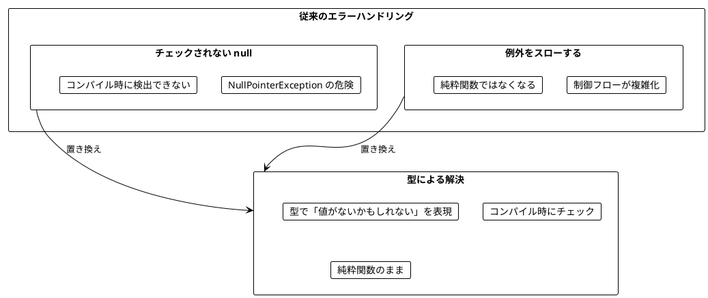
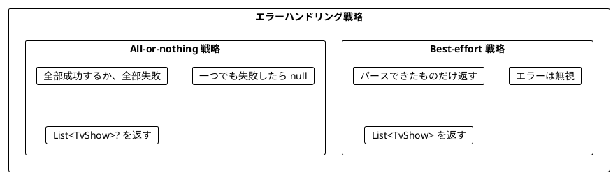
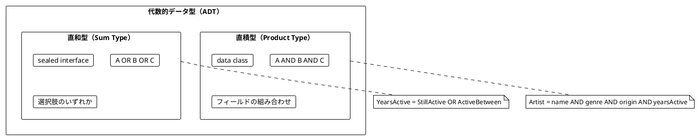

# Part III: エラーハンドリングと Option/Either

本章では、関数型プログラミングにおける安全なエラーハンドリングを学びます。`null` や例外に頼らず、Kotlin の **nullable 型** と Arrow の `Either`、そして `Raise` DSL を使って型安全にエラーを扱う方法を習得します。

Scala 版や Java 版では「値がないかもしれない」を `Option` 型で表しますが、Kotlin では言語そのものが `A?` という nullable 型を備えています。第 6 章では nullable 型を主軸に据え、Arrow の `Option` は「nullable 型では表現しきれない場面」の比較として紹介します。第 7 章では Arrow の `Either` と `Raise<E>` を導入し、失敗理由を型で運ぶ方法を学びます。

---

## 第6章: nullable 型と Option による安全なエラーハンドリング

### 6.1 なぜ Option が必要か

従来のエラーハンドリングには問題があります。



原著（Scala）はこの問題を `Option[A]` 型で解決します。Kotlin には同じ役割を担う仕組みが 2 つあります。

| 仕組み | 提供元 | 特徴 |
|--------|--------|------|
| nullable 型 `A?` | 言語組み込み | 追加のオブジェクトがなく軽量。`?.`、`?:` などの専用構文がある |
| `Option<A>` | Arrow Core | `Some` / `None` を持つ代数的データ型。ネストできる |

Kotlin の標準ライブラリや多くの API は nullable 型を前提に設計されているため、本書では **nullable 型を第一の選択肢** とします。

### 6.2 nullable 型の基本

`A?` は「`A` 型の値か、`null` か」を表す型です。`String` と `String?` は別の型であり、`String?` の値をそのまま `String` として使うことはコンパイラが許しません。

nullable 型を安全に扱うための主な道具は次のとおりです。

| 構文 / 関数 | 意味 | Option のメソッドとの対応 |
|-------------|------|---------------------------|
| `x?.let { f(it) }` | 値があれば `f` を適用し、`null` ならそのまま `null` | `map` / `flatMap` |
| `x ?: y` | `x` が `null` なら `y` を使う（エルビス演算子） | `orElse` / `getOrElse` |
| `x?.takeIf { p(it) }` | 条件を満たさなければ `null` | `filter` |
| `listOfNotNull(x)` | 0 または 1 要素のリスト | `toList` |
| `s.toIntOrNull()` | パースに失敗したら `null` | `toIntOption` |

**ソースファイル**: `app/kotlin/src/main/kotlin/ch06/OptionBasics.kt`

```kotlin
fun safeDivide(a: Int, b: Int): Int? = if (b == 0) null else a / b

fun addStrings(a: String, b: String): Int? {
    val x = a.trim().toIntOrNull() ?: return null
    val y = b.trim().toIntOrNull() ?: return null
    return x + y
}

safeDivide(10, 2)        // 5
safeDivide(10, 0)        // null
addStrings("10", "20")   // 30
addStrings("10", "abc")  // null
```

`?: return null` は「`null` なら関数から抜ける」という早期リターンのイディオムです。`return` も式なので、エルビス演算子の右辺に置けます。

### 6.3 TV番組のパース例

**ソースファイル**: `app/kotlin/src/main/kotlin/ch06/TvShowParser.kt`

TV番組の文字列をパースする例で nullable 型の使い方を学びます。`"Breaking Bad (2008-2013)"` という文字列から `TvShow("Breaking Bad", 2008, 2013)` を作ります。

```kotlin
data class TvShow(val title: String, val start: Int, val end: Int)
```

#### 例外を使う方法（問題あり）

```kotlin
fun parseShowUnsafe(rawShow: String): TvShow {
    val bracketOpen = rawShow.indexOf('(')
    val bracketClose = rawShow.indexOf(')')
    val dash = rawShow.indexOf('-')

    val name = rawShow.substring(0, bracketOpen).trim()
    val yearStart = rawShow.substring(bracketOpen + 1, dash).toInt()
    val yearEnd = rawShow.substring(dash + 1, bracketClose).toInt()

    return TvShow(name, yearStart, yearEnd)
}

// 正常ケース
parseShowUnsafe("Breaking Bad (2008-2013)")  // TvShow("Breaking Bad", 2008, 2013)

// 異常ケース → 例外がスローされる!
parseShowUnsafe("Chernobyl (2019)")          // StringIndexOutOfBoundsException
parseShowUnsafe("The Wire 2002-2008")        // StringIndexOutOfBoundsException
```

Kotlin には Java のような検査例外（checked exception）がないため、シグネチャ `(String) -> TvShow` からは例外の可能性がまったく読み取れません。これは Java 以上に危険です。

#### nullable 型を使う方法

```kotlin
fun parseShow(rawShow: String): TvShow? {
    val name = extractName(rawShow) ?: return null
    val yearStart = extractYearStart(rawShow) ?: extractSingleYear(rawShow) ?: return null
    val yearEnd = extractYearEnd(rawShow) ?: extractSingleYear(rawShow) ?: return null
    return TvShow(name, yearStart, yearEnd)
}

// 正常ケース
parseShow("Breaking Bad (2008-2013)")  // TvShow("Breaking Bad", 2008, 2013)

// 異常ケース → null が返される（例外なし）
parseShow("The Wire 2002-2008")        // null
```

戻り値の型が `TvShow?` になったことで、呼び出し側は `null` の可能性を無視できなくなりました。

### 6.4 小さな関数から組み立てる

複雑なパース処理を小さな関数に分解します。

```kotlin
fun extractName(rawShow: String): String? {
    val bracketOpen = rawShow.indexOf('(')
    return if (bracketOpen > 0) rawShow.substring(0, bracketOpen).trim() else null
}

fun extractYearStart(rawShow: String): Int? {
    val bracketOpen = rawShow.indexOf('(')
    val dash = rawShow.indexOf('-')
    return if (bracketOpen != -1 && dash > bracketOpen + 1) {
        parseYear(rawShow.substring(bracketOpen + 1, dash))
    } else {
        null
    }
}

fun parseYear(yearStr: String): Int? = yearStr.trim().toIntOrNull()
```

Java 版では `Integer.parseInt` の例外を `try-catch` で `Option` に変換していましたが、Kotlin では標準ライブラリの `toIntOrNull()` が最初から nullable 型を返します。例外を捕まえる必要はありません。`extractYearEnd` も同じ形で実装します。

#### ?.let の連鎖で書く

早期リターンを使わず、式だけで組み立てることもできます。`?.let` のネストは Scala の `flatMap` のネストに対応します。

```kotlin
fun parseShowWithLet(rawShow: String): TvShow? =
    extractName(rawShow)?.let { name ->
        (extractYearStart(rawShow) ?: extractSingleYear(rawShow))?.let { yearStart ->
            (extractYearEnd(rawShow) ?: extractSingleYear(rawShow))?.let { yearEnd ->
                TvShow(name, yearStart, yearEnd)
            }
        }
    }
```

ネストが深くなると読みにくくなるため、Kotlin では `?: return null` による早期リターンのほうが好まれます。Scala の for 内包表記が担う「ネストの平坦化」を、Kotlin では早期リターンが担っているわけです。

### 6.5 ?: によるフォールバック

エルビス演算子 `?:` は、左辺が `null` のときに右辺を評価します。右辺も nullable 型であれば、Option の `orElse` と同じ働きになります。

```kotlin
/** orElse 相当: null なら代替の nullable 値を使う */
fun orElseExample(x: Int?, alternative: Int?): Int? = x ?: alternative

orElseExample(7, 8)        // 7 - 左辺が null でないのでそのまま
orElseExample(null, 8)     // 8 - 左辺が null なので代替を使用
orElseExample(7, null)     // 7
orElseExample(null, null)  // null
```

右辺に非 null の値を置けば `getOrElse` 相当になり、`x ?: 0` の結果の型は非 null の `Int` になります。

#### 単年の番組に対応する

「Chernobyl (2019)」のような単年の番組をパースできるようにします。

```kotlin
fun extractSingleYear(rawShow: String): Int? {
    val dash = rawShow.indexOf('-')
    val bracketOpen = rawShow.indexOf('(')
    val bracketClose = rawShow.indexOf(')')
    return if (dash == -1 && bracketOpen != -1 && bracketClose > bracketOpen + 1) {
        parseYear(rawShow.substring(bracketOpen + 1, bracketClose))
    } else {
        null
    }
}
```

`parseShow` の中の `extractYearStart(rawShow) ?: extractSingleYear(rawShow) ?: return null` は、「開始年を試す → だめなら単年を試す → それもだめなら `null` を返す」という 3 段のフォールバックを 1 行で表しています。

```kotlin
// これで単年の番組もパースできる
parseShow("Chernobyl (2019)")  // TvShow("Chernobyl", 2019, 2019)
```

なお、nullable 型では `map` と `flatMap` の区別がありません。`?.let` の中で `Int` を返せば `map`、`Int?` を返せば `flatMap` として振る舞い、どちらの結果も `Int?` に平坦化されます。これは便利な反面、次の節で見る「ネストできない」という制約の裏返しでもあります。

### 6.6 Arrow Option との比較

nullable 型は `Int??` のように二重にできません。`T?` の `T` 自体が nullable 型の場合、「値がない」と「値として `null` がある」を区別できなくなります。たとえば `listOf(null, 2, 3).firstOrNull()` と `emptyList<Int?>().firstOrNull()` はどちらも `null` を返します。

Arrow の `Option<A>` は `Some` / `None` の 2 つのケースを持つ代数的データ型なので、`Option<Int?>` のようにネストできます。

```kotlin
import arrow.core.None
import arrow.core.Option
import arrow.core.Some
import arrow.core.firstOrNone

fun firstElement(list: List<Int?>): Option<Int?> = list.firstOrNone()

fun describeFirst(list: List<Int?>): String =
    when (val first = firstElement(list)) {
        is Some -> "first element is ${first.value}"
        None -> "list is empty"
    }

describeFirst(listOf(1, 2))        // "first element is 1"
describeFirst(listOf(null, 2, 3))  // "first element is null"
describeFirst(emptyList())         // "list is empty"
```

`Option` は sealed な型なので、`when` で `Some` と `None` の両方を扱えば `else` 分岐は不要です（網羅性チェックについては第 7 章で詳しく扱います）。

#### option { } DSL

Arrow は `Option` を組み立てるための `option { }` ビルダーを提供しています。ブロック内で `bind()` を呼ぶと、`None` であればその場でブロック全体が `None` になります。`ensureNotNull` を使えば nullable 型の値を直接取り出せます。

```kotlin
import arrow.core.raise.option
import arrow.core.toOption

fun addStringsOption(a: String, b: String): Option<Int> = option {
    val x = a.trim().toIntOrNull().toOption().bind()
    val y = ensureNotNull(b.trim().toIntOrNull())
    x + y
}

/** nullable 型から Option への変換 */
fun toOptionExample(x: Int?): Option<Int> = x.toOption()

addStringsOption("10", "20")   // Some(30)
addStringsOption("10", "abc")  // None
Some(42).getOrNull()           // 42（Option から nullable 型への変換、逆は x.toOption()）
```

`option { }` の中身は、6.2 節の `addStrings` の早期リターン版とほぼ同じ形をしています。この「ブロックの中では失敗しない値として書き、失敗したら外側で短絡する」スタイルは、第 7 章の `either { }` でも同じように使います。

#### nullable 型と Option の使い分け

| 観点 | nullable 型 `A?` | Arrow `Option<A>` |
|------|------------------|-------------------|
| 実行時コスト | ラッパーを生成しない（`Int?` などはボックス化される） | `Some` のオブジェクトを生成 |
| 構文サポート | `?.`、`?:`、スマートキャスト | メソッドと `option { }` DSL |
| ネスト | できない（`A??` は `A?` と同じ） | できる（`Option<Option<A>>`、`Option<A?>`） |
| 標準ライブラリとの親和性 | 高い（`firstOrNull`、`toIntOrNull` など） | 変換が必要（`toOption()`、`getOrNull()`） |
| 推奨される場面 | ほとんどの場面 | 値として `null` を持ちうる型を扱うとき、ジェネリックなコード |

### 6.7 エラーハンドリング戦略

複数の要素をパースする場合、2 つの戦略があります。



#### Best-effort 戦略

Kotlin 標準ライブラリの `mapNotNull` は「変換して `null` を取り除く」関数です。Scala の `flatMap(_.toList)` や Java 版の `flatMap(Option::toList)` に相当する処理が 1 語で書けます。

```kotlin
fun parseShowsBestEffort(rawShows: List<String>): List<TvShow> =
    rawShows.mapNotNull(::parseShow)

val rawShows = listOf(
    "Breaking Bad (2008-2013)",
    "The Wire 2002 2008",        // 無効な形式
    "Mad Men (2007-2015)",
)

parseShowsBestEffort(rawShows)
// [TvShow("Breaking Bad", 2008, 2013), TvShow("Mad Men", 2007, 2015)]
// 無効なものは無視される
```

#### All-or-nothing 戦略

```kotlin
fun parseShowsAllOrNothing(rawShows: List<String>): List<TvShow>? {
    val shows = rawShows.mapNotNull(::parseShow)
    return shows.takeIf { it.size == rawShows.size }
}

// 全部成功 → リスト
parseShowsAllOrNothing(listOf("Breaking Bad (2008-2013)", "Mad Men (2007-2015)"))
// [TvShow(...), TvShow(...)]

// 一つでも失敗 → null
parseShowsAllOrNothing(listOf("Breaking Bad (2008-2013)", "Invalid"))
// null
```

「パースできた件数が入力の件数と同じなら成功」という考え方で、`takeIf` を使って表現しています。Java 版・Scala 版と同じく `fold` で書くこともできます（演習問題 1 で扱います）。

### 6.8 all と any（forall / exists 相当）

Scala の `Option` には `forall` と `exists` があります。nullable 型ではこれらを論理演算子とスマートキャストで表現します。

| Scala の Option | 動作 | Kotlin の nullable 型 |
|-----------------|------|-----------------------|
| `forall(p)` | None → true, Some(x) → p(x) | `x == null \|\| p(x)` |
| `exists(p)` | None → false, Some(x) → p(x) | `x != null && p(x)` |

たとえば `forallExample(null, 2020)` は `true`（値がないので「全て」が自明に真）、`existsExample(null, 500)` は `false` になります。`x == null || x < max` の右辺では、コンパイラが `x` を `Int` にスマートキャストしてくれるため、`!!` は不要です。コレクションに対しては、標準ライブラリの `all` / `any` がそれぞれ `forall` / `exists` に対応します。第 7 章の検索条件の例で使います。

---

## 第7章: Either 型と複合的なエラー処理

### 7.1 nullable 型 / Option の限界

nullable 型も `Option` も「値があるかないか」しか表現できません。**なぜ失敗したのか** を伝えられません。

| 型 | 成功 | 失敗 | 失敗理由 |
|----|------|------|----------|
| `A?` / `Option<A>` | 値 / `Some(value)` | `null` / `None` | 分からない |
| `Either<E, A>` | `Right(value)` | `Left(error)` | `error: E` として保持できる |

`parseShow("The Wire 2002-2008")` が `null` を返しても、名前の抽出に失敗したのか、年のパースに失敗したのかは分かりません。

### 7.2 Arrow Either の基本

**ソースファイル**: `app/kotlin/src/main/kotlin/ch07/EitherBasics.kt`

Arrow の `Either<E, A>` は「`E` 型のエラーか、`A` 型の成功値か」を表す sealed class です。

- `Right(value)`: 成功（慣例的に「正しい」= right）
- `Left(error)`: 失敗（エラー情報を保持）

Kotlin では `42.right()` や `"Error occurred".left()` のように、拡張関数 `right()` / `left()` で値を包むのが一般的です。

主要な操作は次のとおりです。Arrow 2.x では `flatMap`、`getOrElse`、`recover` などが拡張関数として提供されているため、`arrow.core.flatMap` のように個別に import します。

| 操作 | 説明 | 例 |
|------|------|-----|
| `map` | Right の値を変換 | `Right(5).map { it * 2 }` → `Right(10)` |
| `flatMap` | Right なら Either を返す関数を適用 | `Right(5).flatMap { (it * 2).right() }` → `Right(10)` |
| `recover` | Left なら回復処理を実行（orElse 相当） | `Left("err").recover { 5 }` → `Right(5)` |
| `getOrElse` | Left ならデフォルト値 | `Left("err").getOrElse { 0 }` → `0` |
| `getOrNull` | nullable 型に変換 | `Right(5).getOrNull()` → `5` |
| `getOrNone` | Option に変換 | `Right(5).getOrNone()` → `Some(5)` |
| `fold` | 両方のケースを処理 | `either.fold({ ... }, { ... })` |

```kotlin
/** recover: Left なら代替の Either を使う（orElse 相当） */
fun orElseExample(either: Either<String, Int>, alternative: Either<String, Int>): Either<String, Int> =
    either.recover { alternative.bind() }

/** fold: 両方のケースを 1 つの値にまとめる */
fun foldExample(either: Either<String, Int>): String =
    either.fold(
        ifLeft = { error -> "Error: $error" },
        ifRight = { value -> "Success: $value" },
    )

orElseExample("no year".left(), 2020.right())  // Right(2020)
foldExample(996.right())                       // "Success: 996"
```

Arrow 2.x の `Either` には `orElse` がありません。代わりに `recover` を使います。`recover` のラムダは `Raise<E>` のスコープで実行されるため、中で `bind()` を呼ぶと「代替の Either が Left ならそのエラーで失敗する」という意味になります。

### 7.3 Either を使ったパース

**ソースファイル**: `app/kotlin/src/main/kotlin/ch07/TvShowParserEither.kt`

第 6 章の小さな関数を Either 版に書き換えます。`null` の代わりに、失敗理由を持った `Left` を返します。

```kotlin
fun extractName(rawShow: String): Either<String, String> {
    val bracketOpen = rawShow.indexOf('(')
    return if (bracketOpen > 0) {
        rawShow.substring(0, bracketOpen).trim().right()
    } else {
        "Can't extract name from: $rawShow".left()
    }
}

fun extractYearStart(rawShow: String): Either<String, Int> {
    val bracketOpen = rawShow.indexOf('(')
    val dash = rawShow.indexOf('-')
    return if (bracketOpen != -1 && dash > bracketOpen + 1) {
        parseYear(rawShow.substring(bracketOpen + 1, dash), "start year")
    } else {
        "Can't extract start year from: $rawShow".left()
    }
}

/** nullable 型の結果に失敗理由を付けて Either にする */
fun parseYear(yearStr: String, context: String): Either<String, Int> =
    yearStr.trim().toIntOrNull()?.right() ?: "Can't parse $context: '$yearStr'".left()

extractName("The Wire (2002-2008)")        // Right("The Wire")
extractName("(2022)")                      // Left("Can't extract name from: (2022)")
extractYearStart("The Wire (2002-2008)")   // Right(2002)
extractYearStart("The Wire (-2008)")       // Left("Can't extract start year from: The Wire (-2008)")
extractYearStart("The Wire (oops-2008)")   // Left("Can't parse start year: 'oops'")
```

`parseYear` の `toIntOrNull()?.right() ?: ...left()` は、nullable 型から Either への変換の定番パターンです。「抽出できなかった」と「パースできなかった」が別のメッセージとして区別できるようになりました。

#### nullable 型 / Option から Either への変換

同じパターンで、任意の nullable 値は `value?.right() ?: errorMsg.left()`、Arrow の `Option` は `option.toEither { errorMsg }` で Either に変換できます（サンプルコードの `fromNullable` / `fromOption`）。`Option.toEither` は Scala の `toRight` に相当します。

#### flatMap と recover で組み立てる

小さな関数を `flatMap` と `recover` で組み立てると、Java 版・Scala 版とほぼ同じ形になります。

```kotlin
/** flatMap と recover で組み立てる */
fun parseShowWithFlatMap(rawShow: String): Either<String, TvShow> =
    extractName(rawShow).flatMap { name ->
        extractYearStart(rawShow).recover { extractSingleYear(rawShow).bind() }.flatMap { yearStart ->
            extractYearEnd(rawShow).recover { extractSingleYear(rawShow).bind() }.map { yearEnd ->
                TvShow(name, yearStart, yearEnd)
            }
        }
    }
```

動作はしますが、ネストが深く読みにくいコードです。次の節で `either { }` DSL を使って平坦にします。

### 7.4 either { } DSL と bind()

Scala では for 内包表記、Haskell では do 記法でモナドのネストを平坦化します。Kotlin にはそのための専用構文はありませんが、Arrow の `either { }` ビルダーが同じ役割を果たします。

```kotlin
import arrow.core.raise.either

/** either { } DSL で組み立てる */
fun parseShow(rawShow: String): Either<String, TvShow> = either {
    val name = extractName(rawShow).bind()
    val yearStart = extractYearStart(rawShow).getOrElse { extractSingleYear(rawShow).bind() }
    val yearEnd = extractYearEnd(rawShow).getOrElse { extractSingleYear(rawShow).bind() }
    TvShow(name, yearStart, yearEnd)
}

parseShow("Breaking Bad (2008-2013)")  // Right(TvShow("Breaking Bad", 2008, 2013))
parseShow("Chernobyl (2019)")          // Right(TvShow("Chernobyl", 2019, 2019))
parseShow("(2008-2013)")               // Left("Can't extract name from: (2008-2013)")
```

ポイントは次のとおりです。

- `bind()` は `Right` なら中身を取り出し、`Left` ならブロック全体をそのエラーで終了させます
- ブロックの最後の式が `Right` の中身になります
- `getOrElse` はインライン関数なので、ラムダの中から外側の `either { }` に向けて `bind()` を呼べます。これが「開始年がだめなら単年を試し、それもだめなら失敗」というフォールバックになります

第 6 章の `?: return null` による早期リターンと見比べると、構造がほとんど同じであることが分かります。`either { }` は「失敗理由付きの早期リターン」と捉えると理解しやすいでしょう。

### 7.5 Raise<E> による関数シグネチャ

`either { }` のブロックの中は `Raise<E>` というスコープ（レシーバー）です。`Raise<E>` は「型 `E` のエラーで処理を中断できる文脈」を表し、`bind()`、`raise(e)`、`ensure(条件) { e }`、`ensureNotNull(値) { e }` といった関数を提供します。

`Raise<E>` を拡張関数のレシーバーにすると、`Either` を返さずに「失敗しうる関数」を書けます。

```kotlin
import arrow.core.raise.Raise
import arrow.core.raise.ensure

/** Raise<String> の文脈で年齢を検証する。失敗したら raise で処理を中断する */
fun Raise<String>.checkAge(age: Int): Int {
    ensure(age >= 0) { "Age cannot be negative" }
    ensure(age <= 150) { "Age cannot be greater than 150" }
    return age
}

fun Raise<String>.checkEmail(email: String): String {
    ensure(email.isNotBlank()) { "Email cannot be empty" }
    ensure("@" in email) { "Email must contain @" }
    return email
}

fun Raise<String>.checkUsername(username: String): String {
    ensure(username.isNotBlank()) { "Username cannot be empty" }
    ensure(username.length >= 3) { "Username must be at least 3 characters" }
    ensure(username.length <= 20) { "Username must be at most 20 characters" }
    return username
}
```

戻り値の型は `Int` や `String` のままで、失敗の可能性は `Raise<String>` レシーバーとしてシグネチャに現れます。呼び出すには `Raise<String>` の文脈が必要なので、エラー処理を忘れることはできません。`either { }` で囲めば、いつでも `Either` を返す関数に変換できます。

```kotlin
/** either { } で Raise の関数を Either を返す関数に変換する */
fun validateAge(age: Int): Either<String, Int> = either { checkAge(age) }

fun validateEmail(email: String): Either<String, String> = either { checkEmail(email) }

fun validateUsername(username: String): Either<String, String> = either { checkUsername(username) }

validateAge(25)   // Right(25)
validateAge(-5)   // Left("Age cannot be negative")
validateAge(200)  // Left("Age cannot be greater than 150")
```

#### 複合バリデーションの 3 つの書き方

同じバリデーションを 3 つのスタイルで書き比べます。

```kotlin
data class User(val username: String, val email: String, val age: Int)

/** flatMap のネストで組み立てる */
fun validateUser(username: String, email: String, age: Int): Either<String, User> =
    validateUsername(username).flatMap { validUsername ->
        validateEmail(email).flatMap { validEmail ->
            validateAge(age).map { validAge ->
                User(validUsername, validEmail, validAge)
            }
        }
    }

/** either { } と bind() で組み立てる */
fun validateUserDsl(username: String, email: String, age: Int): Either<String, User> = either {
    val validUsername = validateUsername(username).bind()
    val validEmail = validateEmail(email).bind()
    val validAge = validateAge(age).bind()
    User(validUsername, validEmail, validAge)
}

/** Raise の関数を直接呼び出して組み立てる（bind() も不要） */
fun validateUserRaise(username: String, email: String, age: Int): Either<String, User> = either {
    User(checkUsername(username), checkEmail(email), checkAge(age))
}

validateUser("alice", "alice@example.com", 25)  // Right(User("alice", "alice@example.com", 25))
validateUser("ab", "alice@example.com", 25)     // Left("Username must be at least 3 characters")
validateUserDsl("ab", "invalid", -1)            // Left("Username must be at least 3 characters")
```

3 つめの `validateUserRaise` では、`Raise<String>` の関数どうしが同じ文脈を共有するため、`bind()` すら不要になります。見た目は例外を投げる普通の関数呼び出しと変わりませんが、エラーは型で追跡されています。これが Arrow 2.x が推奨するスタイルです。

| スタイル | 戻り値 | 合成方法 | 向いている場面 |
|----------|--------|----------|----------------|
| `flatMap` のネスト | `Either<E, A>` | メソッドチェーン | 1〜2 段の短い変換 |
| `either { }` + `bind()` | `Either<E, A>` | 早期リターン風 | 既存の Either を返す関数の合成 |
| `Raise<E>.` 拡張関数 | `A` | 直接呼び出し | ドメインロジックの本体 |

### 7.6 バリデーションとエラーの蓄積

ここまでのバリデーションは **最初のエラーで停止** します。`validateUserDsl("ab", "invalid", -1)` は 3 つとも不正なのに、ユーザー名のエラーしか返しません。フォームの入力チェックのように、すべてのエラーをまとめて報告したい場面もあります。

Arrow 2.x では `zipOrAccumulate` を使います（Arrow 1.x の `Validated` は廃止されました）。

```kotlin
import arrow.core.NonEmptyList
import arrow.core.raise.zipOrAccumulate

/** zipOrAccumulate: すべての検証を実行し、エラーを NonEmptyList に集める */
fun validateUserAccumulating(username: String, email: String, age: Int): Either<NonEmptyList<String>, User> =
    either {
        zipOrAccumulate(
            { checkUsername(username) },
            { checkEmail(email) },
            { checkAge(age) },
        ) { validUsername, validEmail, validAge ->
            User(validUsername, validEmail, validAge)
        }
    }

validateUserAccumulating("alice", "alice@example.com", 25)
// Right(User("alice", "alice@example.com", 25))

validateUserAccumulating("ab", "invalid", -1)
// Left(NonEmptyList("Username must be at least 3 characters", "Email must contain @", "Age cannot be negative"))
```

エラー型が `NonEmptyList<String>` になっている点が重要です。`Left` のときは必ず 1 つ以上のエラーがあることを型が保証しています。空の `List<String>` を返してしまうバグは起こりえません。

`Raise<String>` の関数（`checkUsername` など）は、`zipOrAccumulate` の各ラムダの中からそのまま呼び出せます。バリデーションロジックを 1 つ書いておけば、「短絡」と「蓄積」のどちらの戦略でも再利用できるわけです。

#### リストに対するエラーの蓄積

第 6 章で扱った Best-effort / All-or-nothing に加え、Either 版では「すべてのエラーを集める」第 3 の戦略を選べます（Best-effort は `rawShows.mapNotNull { parseShow(it).getOrNull() }` で書けます）。

```kotlin
/** Best-effort 戦略: パースできたものだけを返す */
fun parseShowsBestEffort(rawShows: List<String>): List<TvShow> =
    rawShows.mapNotNull { parseShow(it).getOrNull() }

/** All-or-nothing 戦略: 最初のエラーで停止する */
fun parseShowsAllOrNothing(rawShows: List<String>): Either<String, List<TvShow>> = either {
    rawShows.map { parseShow(it).bind() }
}

/** エラー収集戦略: すべてのエラーを NonEmptyList に集める */
fun parseShowsCollectErrors(rawShows: List<String>): Either<NonEmptyList<String>, List<TvShow>> =
    rawShows.mapOrAccumulate { parseShow(it).bind() }
```

```kotlin
val rawShows = listOf(
    "Breaking Bad (2008-2013)",
    "The Wire 2002 2008",
    "Mad Men (2007-2015)",
    "(2019)",
)

parseShowsAllOrNothing(rawShows)
// Left("Can't extract name from: The Wire 2002 2008")

parseShowsCollectErrors(rawShows)
// Left(NonEmptyList("Can't extract name from: The Wire 2002 2008", "Can't extract name from: (2019)"))
```

All-or-nothing 戦略は、`either { }` の中で普通の `map` を使い、各要素で `bind()` するだけです。Scala では `traverse` や `sequence` を使う場面ですが、Kotlin では標準の `map` と `bind()` の組み合わせで同じことができます。

| 戦略 | 戻り値の型 | 失敗時の情報 |
|------|------------|--------------|
| Best-effort | `List<TvShow>` | なし（失敗は捨てる） |
| All-or-nothing | `Either<String, List<TvShow>>` | 最初のエラー 1 つ |
| エラー収集 | `Either<NonEmptyList<String>, List<TvShow>>` | すべてのエラー |

### 7.7 代数的データ型（ADT）

**ソースファイル**: `app/kotlin/src/main/kotlin/ch07/MusicArtist.kt`

Kotlin では `sealed interface` と `data class` を使って ADT を表現します。

#### 直積型（Product Type）- data class

```kotlin
enum class MusicGenre { HEAVY_METAL, POP, HARD_ROCK, JAZZ, CLASSICAL }

/** 直積型: 名前、ジャンル、出身地、活動期間の組み合わせ */
data class Artist(
    val name: String,
    val genre: MusicGenre,
    val origin: String,
    val yearsActive: YearsActive,
)
```

`data class` は `equals` / `hashCode` / `toString` に加えて、一部のフィールドだけを変えた新しい値を作る `copy` を自動生成します。

```kotlin
val retired = metallica.copy(yearsActive = ActiveBetween(1981, 2030))
// metallica 自体は変更されない
```

#### 直和型（Sum Type）- sealed interface

```kotlin
/** 直和型: 活動中か、活動期間が終わっているかのどちらか */
sealed interface YearsActive {
    data class StillActive(val since: Int) : YearsActive
    data class ActiveBetween(val start: Int, val end: Int) : YearsActive
}
```

サブタイプを `sealed interface` の本体にネストして定義すると、`YearsActive.StillActive` のように名前空間がまとまり、Scala 3 の `enum` に近い書き心地になります。



原著では、最初に `isActive: Boolean` と `yearsActiveEnd: Int` のような組み合わせでモデリングし、「活動中なのに終了年がある」といった不正な状態が表現できてしまう問題を指摘します。直和型を使えば、`StillActive` は終了年を持たず、`ActiveBetween` は必ず終了年を持つため、**不正な状態をそもそも表現できません**。

### 7.8 when による網羅的パターンマッチング

`sealed interface` の値を `when` 式で分岐すると、コンパイラがすべてのサブタイプを扱っているかをチェックします。`else` 分岐は不要です。

```kotlin
fun wasArtistActive(artist: Artist, yearStart: Int, yearEnd: Int): Boolean =
    when (val active = artist.yearsActive) {
        is StillActive -> active.since <= yearEnd
        is ActiveBetween -> active.start <= yearEnd && active.end >= yearStart
    }

fun activeLength(artist: Artist, currentYear: Int): Int =
    when (val active = artist.yearsActive) {
        is StillActive -> currentYear - active.since
        is ActiveBetween -> active.end - active.start
    }

// 使用例
val metallica = Artist("Metallica", HEAVY_METAL, "U.S.", StillActive(1981))
val ledZeppelin = Artist("Led Zeppelin", HARD_ROCK, "England", ActiveBetween(1968, 1980))

activeLength(metallica, 2024)    // 43 (2024 - 1981)
activeLength(ledZeppelin, 2024)  // 12 (1980 - 1968)
```

`when (val active = ...)` で分岐対象を変数に束縛すると、各分岐の中で `active` が `StillActive` や `ActiveBetween` に **スマートキャスト** されます。Java 21 のレコードパターンのような分解構文はありませんが、スマートキャストによってフィールドに型安全にアクセスできます。

もし将来 `YearsActive` に `OnHiatus` のような新しいサブタイプを追加すると、`else` を書いていない `when` 式はすべてコンパイルエラーになります。変更の影響範囲をコンパイラが教えてくれるため、「変更を楽に安全に」行えます。

### 7.9 検索条件のモデリング

検索条件も ADT でモデリングできます。

```kotlin
sealed interface SearchCondition {
    data class SearchByGenre(val genres: List<MusicGenre>) : SearchCondition
    data class SearchByOrigin(val locations: List<String>) : SearchCondition
    data class SearchByActiveYears(val start: Int, val end: Int) : SearchCondition
}

fun matchesCondition(artist: Artist, condition: SearchCondition): Boolean =
    when (condition) {
        is SearchByGenre -> artist.genre in condition.genres
        is SearchByOrigin -> artist.origin in condition.locations
        is SearchByActiveYears -> wasArtistActive(artist, condition.start, condition.end)
    }

/** すべての条件を満たすアーティストを返す（all は forall 相当） */
fun searchArtists(artists: List<Artist>, requiredConditions: List<SearchCondition>): List<Artist> =
    artists.filter { artist ->
        requiredConditions.all { condition -> matchesCondition(artist, condition) }
    }

/** いずれかの条件を満たすアーティストを返す（any は exists 相当） */
fun searchArtistsAny(artists: List<Artist>, conditions: List<SearchCondition>): List<Artist> =
    artists.filter { artist ->
        conditions.any { condition -> matchesCondition(artist, condition) }
    }
```

```kotlin
searchArtists(artists, listOf(SearchByGenre(listOf(HEAVY_METAL))))
// [Metallica, Black Sabbath]

searchArtists(artists, listOf(SearchByOrigin(listOf("England")), SearchByActiveYears(1970, 1979)))
// [Led Zeppelin, Black Sabbath, The Beatles, Queen]

searchArtists(artists, emptyList())     // すべてのアーティスト（all は空なら true）
searchArtistsAny(artists, emptyList())  // 空リスト（any は空なら false）
```

`in` 演算子は `contains` の糖衣構文です。条件リストが空のときの振る舞いは、6.8 節の `forall` / `exists` と同じ論理に従います。

### 7.10 支払い方法の例

**ソースファイル**: `app/kotlin/src/main/kotlin/ch07/PaymentMethod.kt`

```kotlin
private const val CREDIT_CARD_FEE_RATE = 0.03
private const val BANK_TRANSFER_FEE = 500.0
private const val CARD_DIGITS_SHOWN = 4

sealed interface Payment {
    data class CreditCard(val number: String, val expiry: String) : Payment
    data class BankTransfer(val accountNumber: String) : Payment
    data object Cash : Payment
}

fun describePayment(method: Payment): String =
    when (method) {
        is CreditCard -> "Credit card ending in ${method.number.takeLast(CARD_DIGITS_SHOWN)}"
        is BankTransfer -> "Bank transfer to account ${method.accountNumber}"
        Cash -> "Cash payment"
    }

fun calculateFee(method: Payment, amount: Double): Double =
    when (method) {
        is CreditCard -> amount * CREDIT_CARD_FEE_RATE
        is BankTransfer -> BANK_TRANSFER_FEE
        Cash -> 0.0
    }

fun isOnlinePaymentAvailable(method: Payment): Boolean =
    when (method) {
        is CreditCard, is BankTransfer -> true
        Cash -> false
    }
```

Kotlin 固有のポイントを挙げます。

- **`data object`**: フィールドを持たないケースはシングルトンの `data object` で表します。`toString()` が `Cash` を返すなど、`data class` と揃った振る舞いになります。値を持たないので `is Cash` ではなく `Cash` と直接比較します
- **`takeLast`**: Java 版の `substring(Math.max(0, length - 4))` を、文字数が足りない場合も安全な `takeLast(4)` で置き換えています
- **分岐の統合**: `is CreditCard, is BankTransfer -> true` のように、同じ結果になる分岐をカンマでまとめられます

---

## まとめ

### Part III で学んだこと

- **第 6 章**: nullable 型 `A?` と `?.` / `?:` / `let` / `takeIf`、`toIntOrNull` / `mapNotNull`、Arrow `Option` との比較、Best-effort / All-or-nothing 戦略
- **第 7 章**: Arrow `Either`、`either { }` / `bind()`、`Raise<E>` / `ensure`、`zipOrAccumulate` / `mapOrAccumulate` と `NonEmptyList`、`sealed interface` / `data class` / `when` による ADT

### nullable・Option vs Either の使い分け

| 状況 | 使用する型 |
|------|------------|
| 値があるかないかだけが重要 | `A?` |
| 値として `null` を持ちうる型の有無を表す | `Option<A>` |
| 失敗理由を伝える必要がある | `Either<E, A>` |
| 検索結果が見つからない | `A?` |
| バリデーションエラーを伝える | `Either<String, A>` または `Raise<String>.` 関数 |
| すべてのバリデーションエラーを伝える | `Either<NonEmptyList<E>, A>` |
| 複数のエラー種別がある | `Either<ErrorType, A>`（`ErrorType` は sealed interface） |

### キーポイント

1. **nullable 型を第一の選択肢に**: Kotlin では `?.`、`?:`、`toIntOrNull` など言語と標準ライブラリが nullable 型を前提にしている
2. **`?: return null` は早期リターン**: for 内包表記の代わりとしてネストを平坦にする
3. **`either { }` は失敗理由付きの早期リターン**: `bind()` で Left なら即座に脱出する
4. **`Raise<E>` で失敗をシグネチャに載せる**: 戻り値は素の型のまま、失敗の可能性をレシーバーで表す
5. **短絡と蓄積を使い分ける**: 同じ `Raise` 関数を `either { }` でも `zipOrAccumulate` でも再利用できる
6. **不正な状態を表現できなくする**: `sealed interface` と `when` の網羅性チェックで、変更の影響をコンパイラに教えてもらう

### Scala との対応

| Scala | Kotlin + Arrow |
|-------|----------------|
| `Option[A]` | `A?`（または `arrow.core.Option<A>`） |
| `Some(x)` | `x`（または `Some(x)`） |
| `None` | `null`（または `None`） |
| `opt.map(f)` / `opt.flatMap(f)` | `x?.let(f)` |
| `opt.orElse(alt)` | `x ?: alt` |
| `opt.getOrElse(d)` | `x ?: d` |
| `opt.filter(p)` | `x?.takeIf(p)` |
| `opt.forall(p)` / `opt.exists(p)` | `x == null \|\| p(x)` / `x != null && p(x)` |
| `s.toIntOption` | `s.toIntOrNull()` |
| `list.flatMap(_.toList)` | `list.mapNotNull { ... }` |
| `Either[E, A]` | `arrow.core.Either<E, A>` |
| `Right(x)` / `Left(e)` | `x.right()` / `e.left()` |
| `opt.toRight(e)` | `x?.right() ?: e.left()` / `option.toEither { e }` |
| `either.orElse(alt)` | `either.recover { alt.bind() }` |
| `for { a <- ea; b <- eb } yield f(a, b)` | `either { f(ea.bind(), eb.bind()) }` |
| `list.traverse(f)` | `either { list.map { f(it).bind() } }` |
| `(v1, v2).mapN(f)`（cats `ValidatedNel`） | `zipOrAccumulate({ ... }, { ... }) { a, b -> f(a, b) }` |
| `NonEmptyList[E]`（cats） | `arrow.core.NonEmptyList<E>` |
| `case class` | `data class` |
| `sealed trait` / `enum` | `sealed interface` |
| `case object` | `data object` |
| `match { case ... }` | `when (x) { is ... -> }` |

### 次のステップ

Part IV では、以下のトピックを学びます。

- 副作用を値として扱う（`() -> A` サンクによる最小 IO）
- `suspend` 関数による副作用の型付け
- `Sequence` と `Flow` によるストリーム処理

---

## 演習問題

### 問題 1: fold による All-or-nothing

6.7 節の All-or-nothing 戦略を、`takeIf` を使わずに `fold` で実装してください。1 つでもパースに失敗したら `null` を返します。

```kotlin
fun parseShowsAllOrNothingFold(rawShows: List<String>): List<TvShow>? = TODO()

// 期待される動作
parseShowsAllOrNothingFold(listOf("Breaking Bad (2008-2013)")) shouldBe
    listOf(TvShow("Breaking Bad", 2008, 2013))
parseShowsAllOrNothingFold(listOf("Breaking Bad (2008-2013)", "The Wire 2002 2008")) shouldBe null
```

<details>
<summary>解答</summary>

```kotlin
fun parseShowsAllOrNothingFold(rawShows: List<String>): List<TvShow>? =
    rawShows.fold<String, List<TvShow>?>(emptyList()) { acc, rawShow ->
        acc?.let { shows -> parseShow(rawShow)?.let { show -> shows + show } }
    }
```

`fold` の累積値の型を `List<TvShow>?` と明示するのがポイントです。累積値が一度 `null` になると、以降の `acc?.let` はすべて `null` を返し続けます。Java 版・Scala 版の `foldLeft` + `flatMap` と同じ構造です。

</details>

### 問題 2: Raise によるバリデーションとエラーの蓄積

`Raise<String>` の拡張関数として年齢のバリデーションを実装し、それを使ってすべてのエラーを集める `validateUserAccumulating` を実装してください（`checkUsername` と `checkEmail` は実装済みとします）。

```kotlin
fun Raise<String>.checkAge(age: Int): Int = TODO()

fun validateUserAccumulating(username: String, email: String, age: Int): Either<NonEmptyList<String>, User> =
    TODO()

// 期待される動作
either { checkAge(25) } shouldBe 25.right()
either { checkAge(-5) } shouldBe "Age cannot be negative".left()
validateUserAccumulating("ab", "invalid", -1) shouldBe nonEmptyListOf(
    "Username must be at least 3 characters",
    "Email must contain @",
    "Age cannot be negative",
).left()
```

<details>
<summary>解答</summary>

```kotlin
fun Raise<String>.checkAge(age: Int): Int {
    ensure(age >= 0) { "Age cannot be negative" }
    ensure(age <= 150) { "Age cannot be greater than 150" }
    return age
}

fun validateUserAccumulating(username: String, email: String, age: Int): Either<NonEmptyList<String>, User> =
    either {
        zipOrAccumulate(
            { checkUsername(username) },
            { checkEmail(email) },
            { checkAge(age) },
        ) { validUsername, validEmail, validAge ->
            User(validUsername, validEmail, validAge)
        }
    }
```

`checkAge` は `either { }` の中で使えば最初のエラーで停止し、`zipOrAccumulate` の中で使えばエラーが蓄積されます。

</details>

### 問題 3: sealed interface と when

7.7 節の `Artist` と `YearsActive` を使って、アーティストの活動状況を説明する関数を実装してください。

```kotlin
fun describeActivity(artist: Artist): String = TODO()

// 期待される動作
describeActivity(metallica) shouldBe "Metallica has been active since 1981"
describeActivity(ledZeppelin) shouldBe "Led Zeppelin was active from 1968 to 1980"
```

<details>
<summary>解答</summary>

```kotlin
fun describeActivity(artist: Artist): String =
    when (val active = artist.yearsActive) {
        is StillActive -> "${artist.name} has been active since ${active.since}"
        is ActiveBetween -> "${artist.name} was active from ${active.start} to ${active.end}"
    }
```

`YearsActive` は sealed interface なので `else` 分岐は不要です。新しいサブタイプを追加すると、この `when` 式がコンパイルエラーになり、対応漏れを防げます。

</details>

---

## 実行方法

### テストの実行

```bash
cd app/kotlin

# Part III のテストをすべて実行
./gradlew test --tests 'ch06.*' --tests 'ch07.*'

# 章ごとに実行
./gradlew test --tests 'ch06.*'
./gradlew test --tests 'ch07.*'

# 特定のテストクラスだけを実行
./gradlew test --tests 'ch07.EitherBasicsTest'
```
