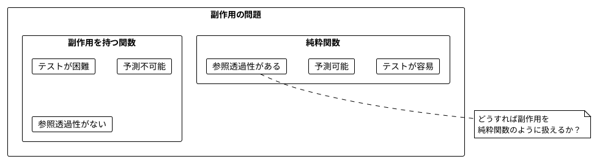
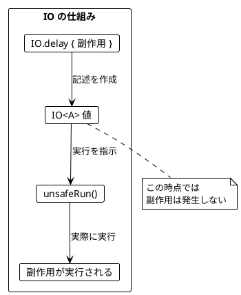
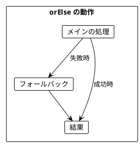
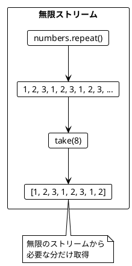
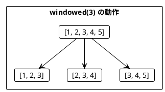
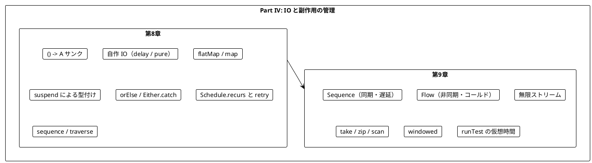

# Part IV: IO と副作用の管理

本章では、関数型プログラミングにおける副作用の扱い方を学びます。まず `() -> A` サンクを包んだ最小の `IO` を自作して「副作用を値として扱う」考え方を確認し、次に Kotlin と Arrow が採用している `suspend` 関数による副作用の型付けへ進みます。後半では `Sequence` と `Flow` の 2 種類のストリームを使い分けて、無限のデータを扱う方法を習得します。

---

## 第8章: IO の導入

### 8.1 副作用の問題

純粋関数は副作用を持ちません。しかし、実際のプログラムには副作用が必要です。

- ファイルの読み書き
- ネットワーク通信
- データベースアクセス
- 乱数生成
- 現在時刻の取得



原著（Scala 版）の答えは「副作用を持つ計算の**記述**を値として扱い、実行は最後に回す」というものです。Scala では cats-effect の `IO` 型がその役割を担います。Kotlin には標準の `IO` 型がなく、Arrow 2.x も独自の `IO` 型を持ちません。そこで本章では次の順で段階的に説明します。

1. `() -> A` サンクで「記述」と「実行」を分ける
2. サンクを包んだ小さな `IO<A>` を自作して、`map` / `flatMap` / `orElse` を体験する
3. Kotlin の本命である `suspend` 関数で同じことを表現する

### 8.2 副作用を値として扱う（() -> A サンクによる最小 IO）

#### サンク

**サンク（thunk）** は「引数を取らず、呼び出されたときに初めて計算を行う関数」です。Kotlin では `() -> A` 型のラムダがそのままサンクになります。

```kotlin
var calls = 0
val thunk: () -> Int = { calls += 1; 42 }
calls shouldBe 0   // 作っただけでは実行されない
thunk() shouldBe 42 // 呼び出したときに初めて副作用が起きる
calls shouldBe 1
```

サンクは「実行を遅らせる」ことはできますが、合成のための `map` や `flatMap`、失敗時の `orElse` がありません。そこで、サンクを包んだ小さな `IO` を作ります。

#### 自作の IO

**ソースファイル**: `app/kotlin/src/main/kotlin/ch08/IO.kt`

```kotlin
class IO<A> private constructor(private val thunk: () -> A) {

    /** IO を実行して結果を取得する（ここで初めて副作用が発生する） */
    fun unsafeRun(): A = thunk()

    /** 結果を変換する */
    fun <B> map(f: (A) -> B): IO<B> = IO { f(thunk()) }

    /** IO を返す関数を適用してフラット化する */
    fun <B> flatMap(f: (A) -> IO<B>): IO<B> = IO { f(thunk()).unsafeRun() }

    /** 失敗したら代替の IO を実行する */
    fun orElse(alternative: IO<A>): IO<A> =
        IO { Either.catch { thunk() }.getOrElse { alternative.unsafeRun() } }

    /** 失敗を Either の値として取り出す */
    fun attempt(): IO<Either<Throwable, A>> = IO { Either.catch { thunk() } }

    /** 失敗したら最大 maxRetries 回まで再実行する */
    fun retry(maxRetries: Int): IO<A> =
        List(maxRetries) { this }.fold(this) { program, retryAction -> program.orElse(retryAction) }

    companion object {
        /** 副作用のある式を遅延実行する IO を作る */
        fun <A> delay(thunk: () -> A): IO<A> = IO(thunk)

        /** 既存の値をラップする（副作用なし） */
        fun <A> pure(value: A): IO<A> = IO { value }

        /** 何もしない IO */
        val unit: IO<Unit> = pure(Unit)
    }
}
```

`map` も `flatMap` も「新しいサンクを包んだ `IO`」を返すだけで、その場では何も実行しません。`orElse` と `attempt` では Part III で学んだ Arrow の `Either.catch` を使い、例外を値に変換しています。



#### IO の作成方法

| メソッド | 用途 | 例 |
|----------|------|-----|
| `IO.delay { expr }` | 副作用のある式をラップ | `IO.delay { println("hello") }` |
| `IO.pure(value)` | 既存の値をラップ（副作用なし） | `IO.pure(42)` |
| `IO.unit` | 何もしない IO | `IO.unit`（= `IO.pure(Unit)`） |

`IO` 値は「レシピ」です。同じレシピを 2 回実行すれば料理は 2 回作られます。レシピそのものは何度参照しても変わらないので、`IO` 値を返す関数は純粋関数のままです。

### 8.3 suspend 関数による副作用の型付け

自作の `IO` は原著の考え方を理解するには十分ですが、Kotlin の実務では使いません。Arrow 2.x は「Kotlin には既に `suspend` という言語機能がある」という理由で独自の `IO` 型を廃止し、**`suspend` 関数を副作用の記述として扱う**方針を取っています。

```kotlin
/** suspend: 呼び出せる場所がコルーチンの中に限定される */
suspend fun castTheDie(): Int = castTheDieImpure()
```

`suspend` 修飾子には、`IO` 型と同じ働きをする 2 つの性質があります。

| 性質 | `IO<A>` | `suspend () -> A` |
|------|---------|-------------------|
| 副作用の目印 | 戻り値の型が `IO<A>` | 関数に `suspend` が付く |
| 呼び出せる場所 | どこからでも作れるが、実行は `unsafeRun()` | `suspend` 関数かコルーチンの中からのみ |
| 値として保持 | `val io: IO<Int>` | `val program: suspend () -> Int` |
| 実行の入口 | `unsafeRun()` | `runBlocking` / `runTest` / `launch` など |
| 合成 | `map` / `flatMap` | 普通の逐次コード（直接スタイル） |

つまり、`suspend` は「この関数は副作用を持ちうる」ことをコンパイラが追跡するマーカーであり、`suspend` ラムダは `IO` 値に相当する「実行を待つ記述」です。

```kotlin
test("suspend ラムダは値として保持でき、呼び出すまで実行されない") {
    var calls = 0
    val program: suspend () -> Int = { calls += 1; castTheDie() }
    calls shouldBe 0
    program() shouldBeInRange 1..6
    program() shouldBeInRange 1..6
    calls shouldBe 2
}
```

ただし、`suspend` 関数を**呼び出す式**そのものは値ではなく、`suspend` 関数の中では書いた順にすぐ実行されます。「遅延された値」として受け渡したいときは、`suspend () -> A` 型のラムダや関数参照にする必要がある点が `IO` との違いです。この違いは本 Part の「Scala との対応」で改めて整理します。

### 8.4 サイコロを振る例

**ソースファイル**: `app/kotlin/src/main/kotlin/ch08/CastingDie.kt`

不純な関数 `castTheDieImpure` を、サンクと `IO` で包みます（`suspend` 版は 8.3 の `castTheDie` です）。

```kotlin
/** 呼び出すたびに異なる値が返る */
fun castTheDieImpure(): Int = Random.nextInt(1, 7)

/** サンク: 「サイコロを振る」という計算の記述を返す */
fun castTheDieThunk(): () -> Int = { castTheDieImpure() }

/** IO: 作成しただけではサイコロは振られない */
fun castTheDieIO(): IO<Int> = IO.delay { castTheDieImpure() }
```

### 8.5 IO の合成

`IO` 値は `flatMap` と `map` で合成します。

```kotlin
/** サイコロを 2 回振って合計を返す */
fun castTheDieTwiceIO(): IO<Int> =
    castTheDieIO().flatMap { first -> castTheDieIO().map { second -> first + second } }
```

`suspend` 版では、同じ処理を普通の逐次コードとして書けます。Scala の for 内包表記や Haskell の do 記法が担っている「順序付けて合成する」役割を、Kotlin では言語そのものが担っています。

```kotlin
/** flatMap の代わりに、普通の逐次コードとして合成できる */
suspend fun castTheDieTwice(): Int {
    val first = castTheDie()
    val second = castTheDie()
    return first + second
}
```

### 8.6 ミーティングスケジューリングの例

**ソースファイル**: `app/kotlin/src/main/kotlin/ch08/SchedulingMeetings.kt`

より実践的な例として、2 人以上の参加者の予定を取得し、空いている時間にミーティングを設定するプログラムを作ります。

#### データ型と定数

```kotlin
data class MeetingTime(val startHour: Int, val endHour: Int)

const val WORK_DAY_START = 8
const val WORK_DAY_END = 16
const val MAX_RETRIES = 10
private const val API_FAILURE_RATE = 0.25
```

#### 外部 API のシミュレーション

原著と同じく、外部 API は「自分では変更できない、ランダムに失敗する不純な関数」として用意します。

```kotlin
fun calendarEntriesApiCall(name: String): List<MeetingTime> {
    if (Random.nextDouble() < API_FAILURE_RATE) throw RuntimeException("Connection error")
    return when (name) {
        "Alice" -> listOf(MeetingTime(8, 10), MeetingTime(11, 12))
        "Bob" -> listOf(MeetingTime(9, 10))
        else -> listOf(MeetingTime(Random.nextInt(8, 13), Random.nextInt(13, 17)))
    }
}

fun createMeetingApiCall(names: List<String>, meetingTime: MeetingTime) {
    println("SIDE-EFFECT: Created meeting $meetingTime for $names")
}
```

#### 空き時間の計算（純粋関数）

副作用とは無関係なロジックは純粋関数として切り出します。

```kotlin
fun meetingsOverlap(meeting1: MeetingTime, meeting2: MeetingTime): Boolean =
    meeting1.endHour > meeting2.startHour && meeting2.endHour > meeting1.startHour

fun possibleMeetings(
    existingMeetings: List<MeetingTime>,
    startHour: Int,
    endHour: Int,
    lengthHours: Int,
): List<MeetingTime> =
    (startHour..endHour - lengthHours)
        .map { start -> MeetingTime(start, start + lengthHours) }
        .filter { slot -> existingMeetings.none { meetingsOverlap(it, slot) } }
```

#### IO 版: API 呼び出しを IO で包む

```kotlin
fun calendarEntriesIO(name: String): IO<List<MeetingTime>> =
    IO.delay { calendarEntriesApiCall(name) }

fun createMeetingIO(names: List<String>, meeting: MeetingTime): IO<Unit> =
    IO.delay { createMeetingApiCall(names, meeting) }

fun scheduledMeetingsIO(person1: String, person2: String): IO<List<MeetingTime>> =
    calendarEntriesIO(person1).flatMap { entries1 ->
        calendarEntriesIO(person2).map { entries2 -> entries1 + entries2 }
    }
```

#### suspend 版: API 呼び出しを suspend 関数で包む

```kotlin
suspend fun calendarEntries(name: String): List<MeetingTime> =
    withContext(Dispatchers.IO) { calendarEntriesApiCall(name) }

suspend fun createMeeting(names: List<String>, meeting: MeetingTime): Unit =
    withContext(Dispatchers.IO) { createMeetingApiCall(names, meeting) }
```

`withContext(Dispatchers.IO)` はブロッキングする API 呼び出しを I/O 用のスレッドプールへ移します。`suspend` で「副作用がある」ことを型に表し、`Dispatchers.IO` で「どこで実行するか」を指定する、という役割分担が Kotlin らしいところです。

### 8.7 エラーハンドリングとリトライ（Either.catch、Schedule）

`calendarEntriesApiCall` は 25% の確率で失敗します。失敗への備えを、まず自作 `IO` で、次に `suspend` と Arrow で書いてみます。

#### IO の orElse

```kotlin
val year: IO<Int> = IO.delay { 996 }
val noYear: IO<Int> = IO.delay { throw RuntimeException("no year") }

year.orElse(IO.delay { 2020 }).unsafeRun()   // 996
noYear.orElse(IO.delay { 2020 }).unsafeRun() // 2020
```



`IO` 値は記述なので、`orElse` を何度つなげても安全です。`retry` は「同じ `IO` を `orElse` で `maxRetries` 回つなげる」だけで実装できます。

```kotlin
fun retry(maxRetries: Int): IO<A> =
    List(maxRetries) { this }.fold(this) { program, retryAction -> program.orElse(retryAction) }
```

#### suspend ラムダの orElse

`suspend () -> A` を `IO` 値のように扱えるなら、`orElse` も定義できるはずです。Kotlin では関数型に対する中置の拡張関数として書けます。

```kotlin
/** suspend ラムダ版の orElse: 失敗したら fallback を実行する新しい「記述」を返す */
infix fun <A> (suspend () -> A).orElse(fallback: suspend () -> A): suspend () -> A = {
    Either.catch { this() }.getOrElse { fallback() }
}
```

```kotlin
test("orElse は呼び出すまで実行されない") {
    var calls = 0
    val program = suspend { calls += 1; 1 } orElse { 2 }
    calls shouldBe 0
    program() shouldBe 1
    calls shouldBe 1
}
```

`suspend { ... }` は標準ライブラリの関数で、ラムダを `suspend () -> A` 型として作ります。`Either.catch` は `CancellationException` などの致命的な例外を捕捉せずに再送出するため、コルーチンのキャンセルを誤って握りつぶすことはありません。

#### Arrow の Schedule によるリトライ

`suspend` 版のリトライには、Arrow Resilience の `Schedule` を使います。`Schedule` は「いつ、何回繰り返すか」を表す値で、`recurs`（回数）、`spaced`（一定間隔）、`exponential`（指数バックオフ）などを組み合わせられます。

```kotlin
/** Arrow の Schedule で最大 maxRetries 回まで再実行する */
suspend fun <A> retry(maxRetries: Int, action: suspend () -> A): A =
    Schedule.recurs<Throwable>(maxRetries.toLong()).retry(action)

/** リトライしても全て失敗したらデフォルト値を返す */
suspend fun <A> retryWithDefault(maxRetries: Int, default: A, action: suspend () -> A): A =
    Either.catch { retry(maxRetries, action) }.getOrElse { default }
```

`Schedule.recurs(n)` は「最初の 1 回 + 最大 n 回の再試行」を意味します。自作 `IO` の `retry` と同じ回数になることをテストで確かめます。

```kotlin
test("失敗し続けると 1 + maxRetries 回実行して例外を投げる") {
    var calls = 0
    shouldThrow<RuntimeException> {
        retry(10) {
            calls += 1
            throw RuntimeException("failed")
        }
    }
    calls shouldBe 11
}
```

#### suspend 版のスケジューリング

```kotlin
suspend fun schedule(attendees: List<String>, lengthHours: Int): MeetingTime? {
    val existingMeetings = scheduledMeetings(attendees)
    val possibleMeeting =
        possibleMeetings(existingMeetings, WORK_DAY_START, WORK_DAY_END, lengthHours).firstOrNull()
    possibleMeeting?.let { retry(MAX_RETRIES) { createMeeting(attendees, it) } }
    return possibleMeeting
}
```

`flatMap` の連鎖が消え、上から下へ読める普通のコードになりました。それでも `suspend` が付いているため、この関数が副作用を持つことはシグネチャから分かります。

#### 入出力を関数として受け取る

原著ではコンソール入出力を `IO` 値として渡し、プログラム本体を入出力の方法から切り離していました。Kotlin では `suspend` 関数型の引数で同じことができます。

```kotlin
/** 入出力を関数として受け取ることで、コンソールにもテスト用スタブにも差し替えられる */
suspend fun schedulingProgram(
    getName: suspend () -> String,
    showMeeting: suspend (MeetingTime?) -> Unit,
) {
    val name1 = getName()
    val name2 = getName()
    val possibleMeeting = schedule(listOf(name1, name2), 2)
    showMeeting(possibleMeeting)
}
```

本番では `getName = { readln() }`、`showMeeting = { println(it) }` のようにコンソールを渡し、テストでは名前のリストから取り出すスタブと結果を記録するスタブを渡します（`SchedulingMeetingsTest.kt` 参照）。

### 8.8 複数の IO をまとめる

#### sequence と traverse

`List<IO<A>>` を `IO<List<A>>` に変換する操作を `sequence`、各要素に `IO` を返す関数を適用してから `sequence` する操作を `traverse` と呼びます。

```kotlin
/** List<IO<A>> を IO<List<A>> に変換する */
fun <A> List<IO<A>>.sequence(): IO<List<A>> =
    fold(IO.pure(emptyList())) { acc, io -> acc.flatMap { list -> io.map { list + it } } }

/** 各要素に IO を返す関数を適用し、結果を 1 つの IO にまとめる */
fun <A, B> List<A>.traverse(f: (A) -> IO<B>): IO<List<B>> = map(f).sequence()
```

```kotlin
listOf(IO.pure(1), IO.pure(2), IO.pure(3)).sequence().unsafeRun() // [1, 2, 3]
listOf(1, 2, 3).traverse { IO.pure(it * 10) }.unsafeRun()         // [10, 20, 30]
```

#### suspend 版: map がそのまま sequence になる

`suspend` 関数の世界では、`sequence` を別途用意する必要はありません。`List.map` や `List.flatMap` はインライン関数なので、ラムダの中で `suspend` 関数を呼び出せます。要素を順番に処理するので、これがそのまま逐次版の `sequence` / `traverse` です。

```kotlin
/** 複数人の予定を逐次取得する（sequence に相当） */
suspend fun scheduledMeetings(attendees: List<String>): List<MeetingTime> =
    attendees.flatMap { retry(MAX_RETRIES) { calendarEntries(it) } }
```

#### 並行に取得する（Part V の予告）

参加者ごとの予定取得は互いに独立しているので、並行に実行できます。コルーチンの `async` / `awaitAll` を使う方法と、Arrow Fx Coroutines の `parMap` を使う方法があります。

```kotlin
/** async / awaitAll で並行に取得する */
suspend fun scheduledMeetingsConcurrently(attendees: List<String>): List<MeetingTime> =
    coroutineScope {
        attendees
            .map { async { retry(MAX_RETRIES) { calendarEntries(it) } } }
            .awaitAll()
            .flatten()
    }

/** Arrow Fx の parMap で並行に取得する（Part V で詳しく扱う） */
suspend fun scheduledMeetingsPar(attendees: List<String>): List<MeetingTime> =
    attendees.parMap { retry(MAX_RETRIES) { calendarEntries(it) } }.flatten()
```

どちらも結果の順序は入力の順序と同じです。`coroutineScope` の中で起動した子コルーチンは、1 つでも失敗すると残りがキャンセルされます（構造化並行性）。詳細は Part V で扱います。

---

## 第9章: ストリーム処理

### 9.1 ストリームとは

**ストリーム**は、要素の（潜在的に無限の）並びを表します。Kotlin には性質の異なる 2 種類の遅延ストリームがあります。

| 型 | 評価 | 要素の生成 | 主な用途 |
|----|------|-----------|---------|
| `List<A>` | 即時 | 全要素がメモリ上に存在 | 有限のデータ |
| `Sequence<A>` | 遅延・同期 | 必要になったときに通常の関数で生成 | 純粋な無限列、大きなコレクションの変換 |
| `Flow<A>` | 遅延・非同期（コールド） | `collect` されたときに `suspend` 関数で生成 | API 呼び出しやタイマーなど副作用を伴う列 |

使い分けの目安は、要素を作るのに `suspend` 関数（副作用）が必要かどうかです。必要なら `Flow`、不要なら `Sequence` を選びます。

### 9.2 Sequence による遅延評価と無限ストリーム

**ソースファイル**: `app/kotlin/src/main/kotlin/ch09/Streams.kt`

#### 有限の Sequence

```kotlin
val numbers: Sequence<Int> = sequenceOf(1, 2, 3)

numbers.toList()                        // [1, 2, 3]
numbers.filter { it % 2 != 0 }.toList() // [1, 3]
```

#### 無限の Sequence

```kotlin
/** 自然数の無限ストリーム */
val naturals: Sequence<Int> = generateSequence(1) { it + 1 }

/** Sequence を無限に繰り返す（空なら空のまま） */
fun <A> Sequence<A>.repeat(): Sequence<A> {
    val source = this
    return sequence {
        if (source.none()) return@sequence
        while (true) yieldAll(source)
    }
}
```

`sequence { ... }` ビルダーの中で `yield` / `yieldAll` を呼ぶと、要求された分だけ要素を生成するジェネレータを書けます。空の `Sequence` を無限に繰り返すと、要素を 1 つも出さないまま永遠にループしてしまうため、先に `none()` で確認しています。

```kotlin
numbers.repeat().take(8).toList() // [1, 2, 3, 1, 2, 3, 1, 2]
naturals.filter { it % 2 == 0 }.take(3).toList() // [2, 4, 6]
```



#### 必要な要素だけが評価される

```kotlin
test("Sequence は必要な要素だけを評価する") {
    val evaluated = mutableListOf<Int>()
    val result = naturals
        .onEach { evaluated.add(it) }
        .map { it * 10 }
        .take(3)
        .toList()
    result shouldBe listOf(10, 20, 30)
    evaluated shouldBe listOf(1, 2, 3)
}
```

`List` なら `map` の時点で全要素を変換しますが、`Sequence` は `toList()` が要素を要求したときに 1 要素ずつパイプライン全体を通します。

#### Sequence と副作用

`Sequence` の要素生成は通常の関数なので、副作用のある関数も呼べてしまいます。

```kotlin
/** サイコロの目の無限ストリーム（評価のたびに副作用が起きる） */
fun dieCasts(): Sequence<Int> = generateSequence { castTheDieImpure() }
```

これは動きますが、`suspend` 関数は呼べず、副作用があることも型に現れません。副作用を伴うストリームには次の `Flow` を使います。

### 9.3 Flow によるコールドストリーム

`Flow<A>` は「`collect` されたときに `suspend` 関数で要素を生成するストリーム」です。原著の fs2 の `Stream[IO, A]` に相当します。

```kotlin
/** suspend 関数 castTheDie を無限に呼び出すストリーム */
fun infiniteDieCasts(): Flow<Int> = flow {
    while (true) emit(castTheDie())
}

suspend fun firstThreeCasts(): List<Int> = infiniteDieCasts().take(3).toList()

/** 6 が出るまで振り続け、6 を含めた目を返す */
suspend fun castUntilSix(): List<Int> =
    infiniteDieCasts().transformWhile { value ->
        emit(value)
        value != 6
    }.toList()

suspend fun sumOfFirstThree(): Int = infiniteDieCasts().take(3).fold(0) { acc, value -> acc + value }
```

`infiniteDieCasts()` は `Flow` を返すだけの普通の関数（`suspend` なし）です。`toList()` や `fold` のような**終端操作**が `suspend` 関数であり、そこで初めてサイコロが振られます。`Flow` の値は、原著の `Stream[IO, A]` と同じく「実行を待つストリームの記述」です。

#### コールドであること

```kotlin
test("Flow はコールドなので collect するたびに最初から実行される") {
    var calls = 0
    val stream = flow {
        calls += 1
        emit(calls)
    }
    stream.toList() shouldBe listOf(1)
    stream.toList() shouldBe listOf(2)
    calls shouldBe 2
}
```

**コールド**とは、収集されるたびに生成処理が最初から実行されることを意味します。`IO` 値を 2 回実行すると副作用が 2 回起きるのと同じ性質です。

### 9.4 ストリームの主要操作

| 操作 | 説明 | Sequence | Flow |
|------|------|----------|------|
| `take(n)` | 最初の n 要素を取得 | あり | あり |
| `filter(p)` | 条件を満たす要素のみ | あり | あり |
| `map(f)` | 各要素を変換 | あり | あり（`f` は `suspend` 可） |
| `zip(other)` | 2 つのストリームを組にする | あり | あり |
| `scan(init, f)` | 累積値のストリーム | あり | あり |
| `windowed(n)` | スライディングウィンドウ | あり | なし（9.6 で自作） |
| `transformWhile` | 条件を満たす間だけ出力 | なし | あり |
| `retry(n)` | 失敗したら上流をやり直す | なし | あり |

```kotlin
flowOf(1, 2, 3).map { it * 2 }.toList()                          // [2, 4, 6]
flowOf(1, 2, 3).zip(flowOf("a", "b", "c")) { n, s -> "$n$s" }.toList() // [1a, 2b, 3c]
flowOf(1, 2, 3).scan(0) { acc, n -> acc + n }.toList()            // [0, 1, 3, 6]
```

`Flow` の `retry` は、失敗したときに上流の `flow { ... }` を最初から実行し直します。ただし、その回数はストリーム全体で数えられ、要素ごとにはリセットされません。無限ストリームの各要素を個別にリトライしたい場合は、次節のように `flow { ... }` の中で第 8 章の `retry` を使います。

### 9.5 通貨交換レートの例

**ソースファイル**: `app/kotlin/src/main/kotlin/ch09/CurrencyExchange.kt`

為替レートを監視し、上昇トレンドを検出したら交換する例です。

#### 通貨の型

```kotlin
@JvmInline
value class Currency(val name: String)

const val TREND_WINDOW_SIZE = 3
```

`value class` は実行時には中身の `String` として扱われるため、オーバーヘッドなしに「ただの文字列」と「通貨」を型で区別できます。Scala 版の `opaque type` に相当します。

#### トレンド判定（純粋関数）

```kotlin
/** 連続して上昇していれば true */
fun trending(rates: List<BigDecimal>): Boolean =
    rates.size > 1 && rates.zipWithNext().all { (previous, rate) -> rate > previous }
```

Scala 版は `rates.zip(rates.drop(1))` で隣り合う要素の組を作りますが、Kotlin には専用の `zipWithNext` があります。`BigDecimal` は `Comparable` なので、`>` で比較できます。

```kotlin
// rates(vararg String) は文字列から List<BigDecimal> を作るテスト用ヘルパー
trending(rates("0.81", "0.82", "0.83")) // true
trending(rates("0.81", "0.84", "0.83")) // false
trending(rates("0.81"))                 // false
```

#### レート表から 1 つの通貨を取り出す

```kotlin
/** レート表から 1 つの通貨のレートを取り出す（カリー化） */
fun extractSingleCurrencyRate(currencyToExtract: Currency): (Map<Currency, BigDecimal>) -> BigDecimal? =
    { table -> table[currencyToExtract] }
```

関数を返す関数にしておくと、`map` や `mapNotNull` にそのまま渡せます。

```kotlin
usdExchangeTables.map(extractSingleCurrencyRate(eur))        // [0.88, 0.89, null]
usdExchangeTables.mapNotNull(extractSingleCurrencyRate(eur)) // [0.88, 0.89]
```

#### API 呼び出しと Version 1

外部 API `exchangeRatesTableApiCall(currency: String): Map<String, BigDecimal>` は、第 8 章のカレンダー API と同じく 25% の確率で失敗し、USD のレート表（EUR と JPY がランダムに変動する）だけを返します。これを `suspend` 関数で包みます。

```kotlin
suspend fun exchangeTable(from: Currency): Map<Currency, BigDecimal> =
    exchangeRatesTableApiCall(from.name).mapKeys { (name, _) -> Currency(name) }
```

原著の Version 1 にならい、ソースファイルには「直近 3 回分のレートを取ってきて 1 回だけ判断する」`lastRates` / `exchangeIfTrendingOnce` も用意しています。しかしこの版には、トレンドが見つかるまで繰り返したいのに 1 回で終わってしまうことと、取得回数が 3 回に固定されていることの 2 つの問題があります。これを無限ストリームで解決します。

#### レートの無限ストリーム

```kotlin
/** 為替レートの無限ストリーム */
fun rates(from: Currency, to: Currency): Flow<BigDecimal> =
    flow { while (true) emit(retry(MAX_RETRIES) { exchangeTable(from) }) }
        .mapNotNull(extractSingleCurrencyRate(to))
```

`flow { ... }` の中は `suspend` の世界なので、第 8 章で作った `retry` をそのまま使えます。要素ごとにリトライするため、無限に続けても再試行の回数を使い切ることはありません。

```kotlin
rates(usd, eur).take(3).toList() // 例: [0.79, 0.83, 0.80]
```

### 9.6 スライディングウィンドウ（windowed）とトレンド検出

#### Sequence の windowed

`windowed(n)` は、連続する n 個の要素をまとめたウィンドウを 1 つずつずらしながら作ります。

```kotlin
sequenceOf(1, 2, 3, 4, 5).windowed(3).toList()
// [[1, 2, 3], [2, 3, 4], [3, 4, 5]]
```



レートの `List` からトレンドを探す純粋関数は、`Sequence` の `windowed` で書けます。

```kotlin
/** レートの List からトレンドを検出する（Sequence の windowed を使う） */
fun findTrendInRates(rates: List<BigDecimal>, windowSize: Int): BigDecimal? =
    rates.asSequence()
        .windowed(windowSize)
        .firstOrNull(::trending)
        ?.last()
```

```kotlin
findTrendInRates(rates("0.81", "0.80", "0.82", "0.83", "0.84"), 3) // 0.83
findTrendInRates(rates("0.81", "0.80", "0.79"), 3)                 // null
```

#### Flow の windowed を自作する

kotlinx.coroutines の `Flow` には `windowed` がありません。そこで拡張関数として自作します。`flow { ... }` ビルダーの中で上流を `collect` し、直近 `size` 個を `ArrayDeque` に保持します。

```kotlin
/** Flow のスライディングウィンドウ（標準ライブラリにはないので自作する） */
fun <A> Flow<A>.windowed(size: Int): Flow<List<A>> {
    require(size > 0) { "size must be positive: $size" }
    val upstream = this
    return flow {
        val window = ArrayDeque<A>(size)
        upstream.collect { value ->
            window.addLast(value)
            if (window.size > size) window.removeFirst()
            if (window.size == size) emit(window.toList())
        }
    }
}
```

`ArrayDeque` は可変ですが、`flow { ... }` の中に閉じ込められていて外からは見えません。外に出すのは `toList()` で作ったコピーだけなので、利用者から見ればこの関数は不変なウィンドウを流すストリームです。「可変状態は局所に閉じ込め、境界ではイミュータブルな値を渡す」のは Kotlin で FP を実践するときの定石です。

#### トレンドを検出して交換

```kotlin
/** ストリームから最初の上昇トレンドの最新レートを取り出す */
suspend fun firstTrendingRate(rates: Flow<BigDecimal>, windowSize: Int = TREND_WINDOW_SIZE): BigDecimal =
    rates.windowed(windowSize)
        .filter(::trending)
        .map { it.last() }
        .first()

suspend fun exchangeIfTrending(amount: BigDecimal, from: Currency, to: Currency): BigDecimal =
    firstTrendingRate(rates(from, to)) * amount
```

`first()` は最初の要素を受け取った時点で上流をキャンセルします。そのため、無限ストリームであっても、トレンドが見つかった時点で API 呼び出しは止まります。ストリームのロジックを `firstTrendingRate` に切り出しておくと、固定のデータでテストできます。

#### ticks と zip で一定間隔にする

今の実装は、トレンドが見つかるまで休みなく API を呼び続けます。一定間隔で取得するには、一定間隔で `Unit` を流す `ticks` と `zip` します。`zip` は両方のストリームから 1 つずつ要素がそろうまで待つため、遅い方のペースで進みます。

```kotlin
/** 一定間隔で Unit を流す無限ストリーム */
fun ticks(period: Duration): Flow<Unit> = flow {
    while (true) {
        delay(period)
        emit(Unit)
    }
}

/** ticks と zip して、一定間隔でレートを取得する */
suspend fun exchangeIfTrendingWithTicks(
    amount: BigDecimal,
    from: Currency,
    to: Currency,
    period: Duration = 1.seconds,
): BigDecimal {
    val ratesWithDelay = rates(from, to).zip(ticks(period)) { rate, _ -> rate }
    return firstTrendingRate(ratesWithDelay) * amount
}
```

#### 仮想時間でテストする

`delay` を含むコードを実時間でテストすると遅くなります。`kotlinx.coroutines.test.runTest` の中では `delay` が**仮想時間**で進むため、1 秒間隔のストリームも一瞬でテストできます。`currentTime` で経過した仮想時間（ミリ秒）を確認できます。

```kotlin
test("ticks と zip すると一定間隔で要素が流れる（仮想時間）") {
    runTest {
        val result = flowOf("a", "b", "c").zip(ticks(1.seconds)) { value, _ -> value }.toList()
        result shouldBe listOf("a", "b", "c")
        currentTime shouldBe 3_000
    }
}
```

`exchangeIfTrendingWithTicks` も同じように `runTest` の中で実行し、仮想時間が 1 秒単位で進んでいることを検証しています。`currentTime` は実験的 API のため、テストファイルの先頭に `@file:OptIn(ExperimentalCoroutinesApi::class)` を付けています。

---

## まとめ

### Part IV で学んだこと



### IO とストリームの比較

| 特性 | `IO<A>`（自作） | `suspend () -> A` | `Sequence<A>` | `Flow<A>` |
|------|-----------------|-------------------|---------------|-----------|
| 要素数 | 1 つ | 1 つ | 0 個以上（無限も可） | 0 個以上（無限も可） |
| 副作用 | 記述して後で実行 | `suspend` で型に表れる | 型に表れない | 終端操作が `suspend` |
| 合成 | `map` / `flatMap` | 逐次コード | `map` / `filter` など | `map` / `filter` など |
| 実行 | `unsafeRun()` | `runBlocking` / `runTest` | `toList()` など | `toList()` / `first()` など |
| 用途 | IO の概念の学習 | 単一の副作用 | 純粋な遅延列 | 副作用を伴う連続データ |

### キーポイント

1. **記述と実行の分離**: サンクや `IO` は副作用を「記述」として扱い、実行を最後に回す
2. **suspend による型付け**: Kotlin と Arrow 2.x は `IO` 型の代わりに `suspend` 関数を副作用のマーカーとして使う
3. **直接スタイル**: `suspend` 関数は `flatMap` の連鎖ではなく普通の逐次コードで合成できる
4. **Either.catch と Schedule**: 失敗は `Either.catch` で値にし、リトライは `Schedule.recurs(n).retry { ... }` で宣言的に書く
5. **map が sequence になる**: `suspend` の世界では `List.map` / `flatMap` がそのまま逐次の `sequence` / `traverse` になり、並行版は `parMap`
6. **Sequence と Flow の使い分け**: 要素の生成に `suspend` 関数が必要なら `Flow`、不要なら `Sequence`
7. **windowed**: 連続する要素をまとめてパターン（トレンド）を検出する。`Flow` 版は拡張関数で自作できる
8. **仮想時間**: `runTest` を使えば `delay` を含むストリームも高速かつ決定的にテストできる

### Scala との対応

| 概念 | Scala（cats-effect / fs2） | Kotlin + Arrow |
|------|---------------------------|----------------|
| IO 型 | `cats.effect.IO[A]` | `suspend () -> A`（学習用に自作 `IO<A>`） |
| 遅延実行 | `IO.delay(expr)` | `suspend { expr }` / `IO.delay { expr }` |
| 即座の値 | `IO.pure(value)` | 値そのもの / `IO.pure(value)` |
| 合成 | `flatMap` / for 内包表記 | 普通の逐次コード |
| 実行 | `unsafeRunSync()` | `runBlocking { }` / `runTest { }` |
| フォールバック | `io.orElse(other)` | `Either.catch { }.getOrElse { }` |
| 失敗を値に | `io.attempt` | `Either.catch { }` |
| リトライ | `retry(io, n)`（自作）/ cats-retry | `Schedule.recurs(n).retry { }` |
| sequence | `list.sequence` | `list.map { }`（逐次）/ `parMap`（並行） |
| ストリーム | `fs2.Stream[IO, A]` | `Flow<A>` |
| 純粋なストリーム | `fs2.Stream[Pure, A]` | `Sequence<A>` |
| 無限繰り返し | `stream.repeat` | `generateSequence` / `while (true) emit(...)` |
| スライディングウィンドウ | `stream.sliding(n)` | `Sequence.windowed(n)` / 自作の `Flow.windowed(n)` |
| 一定間隔 | `Stream.fixedRate(d)` | `flow { delay(d); emit(Unit) }` |
| 左側だけ残す結合 | `zipLeft` | `zip { a, _ -> a }` |

#### cats-effect の IO と suspend の違い

両者は「副作用を型で区別し、合成可能にする」という目的は同じですが、仕組みが異なります。

- **値か、関数の性質か**: cats-effect の `IO[A]` は普通の値です。`val program = calendarEntries("Alice")` と書いても何も実行されず、`program` を何度参照しても同じ記述を指します（参照透過）。一方、Kotlin の `suspend` は関数の性質であり、`suspend` 関数の中で `calendarEntries("Alice")` と書けばその場で実行されます。遅延させたい場合は `suspend { ... }` や関数参照で明示的にラムダにする必要があります。
- **合成の書き方**: cats-effect は `flatMap` と for 内包表記で合成し、実行順序はデータ構造として組み立てられます。Kotlin はコンパイラが `suspend` 関数を継続渡しスタイルのステートマシンに変換するため、普通の逐次コードがそのまま合成になります。
- **副作用の境界**: cats-effect では `IO` を返す関数からも `IO` を返さない関数からも `IO` 値を作れ、実行は `unsafeRunSync` などの「世界の端」で行います。Kotlin では `suspend` 関数は `suspend` 関数かコルーチンからしか呼べないため、副作用の境界がコンパイル時に呼び出しの連鎖として強制されます。
- **エラーとキャンセル**: cats-effect の `IO` は失敗を内部に保持し、`attempt` / `handleErrorWith` で扱います。Kotlin の `suspend` は失敗を通常の例外として投げるため、Arrow の `Either.catch` で値に変換します。キャンセルは cats-effect ではファイバーの中断、Kotlin では `CancellationException` と構造化並行性で伝播します。
- **ライブラリの位置付け**: cats-effect は `IO` 型を中心としたランタイムを提供します。Arrow 2.x はあえて `IO` 型を持たず、kotlinx.coroutines の上に `Either.catch`、`Schedule`、`parMap`、`Resource` などの部品を提供する方針です。

つまり、Scala では「副作用は `IO` という値で表す」、Kotlin では「副作用は `suspend` という型の印で表し、必要なときだけ `suspend () -> A` として値にする」と整理できます。

### 次のステップ

Part V では、以下のトピックを学びます。

- 構造化並行性（`coroutineScope`、`async` / `await`）
- Arrow Fx Coroutines の `parZip` / `parMap` / `raceN`
- アトミックな共有状態（`Atomic` / `MutableStateFlow`）と Scala の `Ref` との対応
- `Job` によるバックグラウンド実行とキャンセル

---

## 演習問題

### 問題 1: IO の合成

以下の関数を実装してください。2 つの IO を順番に実行し、結果を結合します。

```kotlin
fun <A, B, C> combineIO(io1: IO<A>, io2: IO<B>, f: (A, B) -> C): IO<C> = TODO()

// 期待される動作
combineIO(IO.pure(1), IO.pure(2)) { a, b -> a + b }.unsafeRun() // 3
```

<details>
<summary>解答</summary>

```kotlin
/** 2 つの IO を順番に実行し、結果を関数で結合する */
fun <A, B, C> combineIO(io1: IO<A>, io2: IO<B>, f: (A, B) -> C): IO<C> =
    io1.flatMap { a -> io2.map { b -> f(a, b) } }
```

</details>

### 問題 2: リトライとデフォルト値

以下の関数を実装してください。`action` を最大 `maxRetries` 回リトライし、全部失敗したら `default` を返します。Arrow の `Schedule` と `Either.catch` を使ってください。

```kotlin
suspend fun <A> retryWithDefault(maxRetries: Int, default: A, action: suspend () -> A): A = TODO()

// 期待される動作
retryWithDefault(3, emptyList<MeetingTime>()) { throw RuntimeException("Connection error") } // []（4 回実行される）
retryWithDefault(3, 0) { 42 } // 42
```

<details>
<summary>解答</summary>

```kotlin
/** Arrow の Schedule で最大 maxRetries 回まで再実行する */
suspend fun <A> retry(maxRetries: Int, action: suspend () -> A): A =
    Schedule.recurs<Throwable>(maxRetries.toLong()).retry(action)

/** リトライしても全て失敗したらデフォルト値を返す */
suspend fun <A> retryWithDefault(maxRetries: Int, default: A, action: suspend () -> A): A =
    Either.catch { retry(maxRetries, action) }.getOrElse { default }
```

</details>

### 問題 3: ストリーム操作

以下のストリームを `Sequence` で作成してください。

```kotlin
// 1. 1 から 10 までの偶数のストリーム
val evens: Sequence<Int> = TODO()

// 2. 無限に交互に true / false を返すストリーム
val alternating: Sequence<Boolean> = TODO()

// 3. 最初の 5 つの要素の合計を計算
val sum: Int = (1..10).asSequence().take(5).TODO()
```

<details>
<summary>解答</summary>

```kotlin
// 1. 1 から 10 までの偶数
val evens = (1..10).asSequence().filter { it % 2 == 0 }
// [2, 4, 6, 8, 10]

// 2. 無限に交互に true / false（9.2 の repeat を使う）
val alternating = sequenceOf(true, false).repeat()
// alternating.take(5).toList() == [true, false, true, false, true]

// 3. 最初の 5 つの要素の合計
val sum = (1..10).asSequence().take(5).sum()
// 15
```

要素の生成に `suspend` 関数が不要なので、`Flow` ではなく `Sequence` を選びます。

</details>

### 問題 4: トレンド検出

以下の関数を実装してください。3 つ以上の値が全て同じかどうかを判定します。

```kotlin
fun isStable(values: List<BigDecimal>): Boolean = TODO()

// 期待される動作
isStable(rates("5", "5", "5")) // true
isStable(rates("5", "5", "6")) // false
isStable(rates("5", "6", "5")) // false
isStable(rates("5"))           // false（3 つ未満は false）
```

<details>
<summary>解答</summary>

```kotlin
/** 3 つ以上の値がすべて同じなら true */
fun isStable(values: List<BigDecimal>): Boolean = values.size >= 3 && values.distinct().size == 1
```

`trending` と同じ `List<BigDecimal> -> Boolean` 型なので、`rates(usd, eur).windowed(3).filter(::isStable)` のように組み合わせれば「レートが安定したら交換する」ストリームも作れます。

</details>

---

## 実行方法

```bash
cd app/kotlin

# 全テストを実行
./gradlew test

# 第 8 章のテストのみ実行
./gradlew test --tests 'ch08.*'

# 第 9 章のテストのみ実行
./gradlew test --tests 'ch09.*'

# 特定のテストクラスのみ実行
./gradlew test --tests 'ch09.CurrencyExchangeTest'
```

Nix を使う場合は、リポジトリのルートで `nix develop .#kotlin` を実行してから上記のコマンドを実行します。
