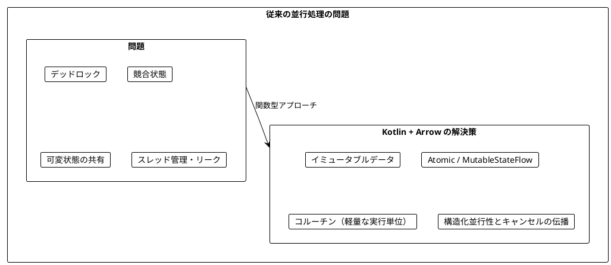
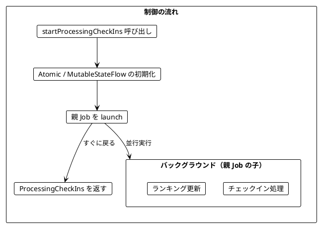
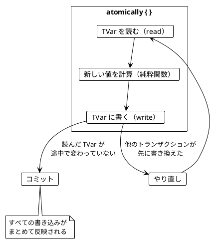
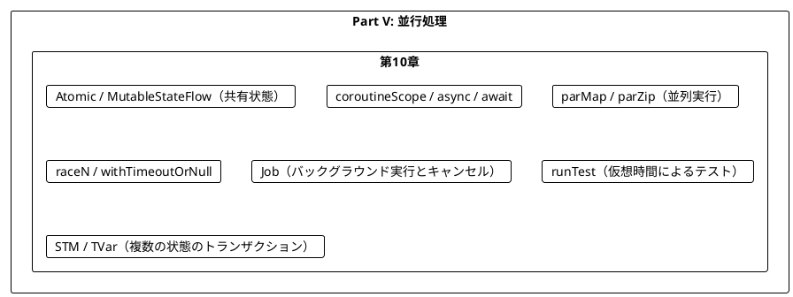
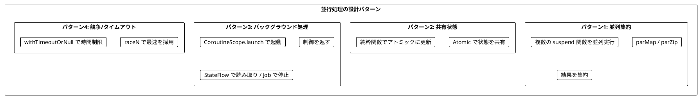

# Part V: 並行処理

本章では、Kotlin における関数型スタイルの並行処理を学びます。Scala 版の cats-effect が `Ref`、`Fiber`、`parSequence` を使うのに対し、Kotlin ではコルーチンの **構造化並行性（Structured Concurrency）** を土台に、Arrow Fx Coroutines の `parMap` / `parZip` / `raceN` と、`Atomic` / `MutableStateFlow` による共有状態を組み合わせます。複数の共有状態をまとめて更新する場面では、Arrow の STM（`TVar`、`atomically`）も使います。

---

## 第10章: 並行・並列処理

### 10.1 並行処理の課題

従来の並行処理には多くの課題があります。

- デッドロック
- 競合状態（Race Condition）
- 共有状態の管理の複雑さ
- スレッドのオーバーヘッド
- 起動した処理の「後始末」（キャンセル漏れ、リーク）

最後の項目は見落とされがちですが、Kotlin のコルーチンが最も力を入れている部分です。コルーチンは必ず何らかの `CoroutineScope` の中で起動され、スコープが終わるまで子のコルーチンが終わらないことが保証されます。これを **構造化並行性** と呼びます。



### 10.2 チェックインのリアルタイム集計

**ソースファイル**: `app/kotlin/src/main/kotlin/ch10/CheckIns.kt`

都市へのチェックインをリアルタイムで集計し、ランキングを更新する例を見ていきます。データは `data class` で表現します。

```kotlin
data class City(val name: String)

data class CityStats(val city: City, val checkIns: Int)

private val sampleCities = listOf(
    City("Sydney"),
    City("Dublin"),
    City("Cape Town"),
    City("Lima"),
    City("Singapore"),
)

/** サンプルのチェックインデータ（5 都市を repeatCount 回繰り返す） */
fun sampleCheckIns(repeatCount: Int): List<City> =
    List(repeatCount) { sampleCities }.flatten()
```

#### トップ N 都市の計算（純粋関数）

ランキングの計算は並行処理とは無関係な純粋関数として切り出します。並行処理のコードが複雑になっても、この部分は単体でテストできます。

```kotlin
/** チェックイン数の降順（同数なら都市名の昇順）で上位 n 件を返す */
fun topCities(cityCheckIns: Map<City, Int>, n: Int = 3): List<CityStats> =
    cityCheckIns
        .map { (city, checkIns) -> CityStats(city, checkIns) }
        .sortedWith(compareByDescending<CityStats> { it.checkIns }.thenBy { it.city.name })
        .take(n)

/** チェックインを 1 件反映した新しい Map を返す（元の Map は変更しない） */
fun updateCheckIns(current: Map<City, Int>, city: City): Map<City, Int> =
    current + (city to (current[city] ?: 0) + 1)
```

同数のときに都市名で並べるのは、テストの結果を決定論的にするためです。`HashMap` の反復順序に依存したランキングは、並行処理と組み合わせたときに「たまに失敗するテスト」の原因になります。

### 10.3 逐次処理の問題

最初の実装は逐次処理です。`fold` でチェックインを 1 件ずつ `Map` に反映します。

```kotlin
/** チェックインを逐次処理する（シンプルだが並行性はない） */
fun processCheckInsSequential(checkIns: List<City>, topN: Int): List<CityStats> =
    topCities(checkIns.fold(emptyMap(), ::updateCheckIns), topN)
```

シンプルで正しいコードですが、チェックインが次々と届く状況では「すべてのチェックインを処理し終えるまでランキングが得られない」という問題があります。チェックインの受信とランキングの更新は、本来は互いに待つ必要のない独立した処理です。

### 10.4 アトミックな共有状態（Atomic / MutableStateFlow）

複数のコルーチンから同じ状態を更新するには、アトミックな参照が必要です。Scala の cats-effect では `Ref[IO, A]` を使いますが、Kotlin では次の選択肢があります。

| 選択肢 | パッケージ | 特徴 |
|--------|-----------|------|
| `Atomic<A>` | `arrow.atomic`（Arrow） | JVM では `AtomicReference` の型エイリアス。`update { }`、`getAndUpdate { }`、`updateAndGet { }` を拡張関数で提供 |
| `AtomicInt` | `arrow.atomic`（Arrow） | `AtomicInteger` の型エイリアス。カウンターに便利 |
| `MutableStateFlow<A>` | `kotlinx.coroutines.flow` | 最新値を保持し、`update { }` でアトミックに更新できる。購読（`collect`）もできる |
| `AtomicReference<A>` | `java.util.concurrent.atomic` | JVM 標準。Arrow の `Atomic` の実体 |

本章では、書き込み専用の集計には `Atomic`、外部から読み取るランキングには `MutableStateFlow` を使います。

#### storeCheckIn

```kotlin
/** Atomic に保存されたチェックイン数をアトミックに更新する */
fun storeCheckIn(storedCheckIns: Atomic<Map<City, Int>>, city: City) {
    storedCheckIns.update { current -> updateCheckIns(current, city) }
}
```

`update` は「現在値を読む → 関数を適用する → CAS（Compare-And-Set）で書き戻す」を成功するまで繰り返します。そのため、**`update` に渡す関数は何度呼ばれてもよい純粋関数でなければなりません**。ここで純粋関数 `updateCheckIns` を再利用できるのは、10.2 で計算を切り出しておいたおかげです。これは Scala の `Ref.update` とまったく同じ制約です。

#### Scala の Ref との違い

Scala の `Ref.of(0)` は `IO[Ref[IO, Int]]` を返し、「Ref を作ること」自体も副作用として IO に包まれます。Kotlin の `Atomic(0)` はただのコンストラクタ呼び出しで、`update` も `suspend` ではありません。Arrow 2.x は独自の `IO` 型を持たないため、「共有状態をいつ作り、どこで使うか」は関数のスコープ（`suspend fun` や `coroutineScope` の中でローカル変数として作る）で管理します。

対応するメソッドは、`Ref.of(a)` → `Atomic(a)`、`ref.get` → `atomic.get()`、`ref.set(a)` → `atomic.set(a)`、`ref.update(f)` → `atomic.update(f)`、`ref.modify(f)` → `atomic.updateAndGet(f)` / `getAndUpdate(f)` です。

### 10.5 構造化並行性（coroutineScope、async / await）

**ソースファイル**: `app/kotlin/src/main/kotlin/ch10/ParallelExamples.kt`

コルーチンを並行に動かす最も基本的な道具は `coroutineScope` と `async` / `await` です。

#### サイコロを並行して振る

Scala 版では `List(castTheDie(), castTheDie()).parSequence` で 2 つのサイコロを並行して振りました。Kotlin では次のように書きます。

```kotlin
/** 2 つのサイコロを並行して振り、合計を返す */
suspend fun castTheDieTwice(castTheDie: suspend () -> Int): Int = coroutineScope {
    val first = async { castTheDie() }
    val second = async { castTheDie() }
    first.await() + second.await()
}
```

サイコロを振る処理は `suspend () -> Int` として外から受け取ります。テストでは呼ばれるたびに 1, 2, 3, ... を返す決定論的な「サイコロ」を渡せます。

```kotlin
// 決定論的な「サイコロ」: 呼ばれるたびに 1, 2, 3, ... を返す
fun fakeDie(): suspend () -> Int {
    val counter = AtomicInteger(0)
    return { counter.incrementAndGet() }
}
```

テストでは `castTheDieTwice(fakeDie()) shouldBe 3` と検証できます。

#### 逐次実行と並行実行の比較

```kotlin
/** 1 つずつ順番に実行して合計する */
suspend fun sumSequential(ios: List<suspend () -> Int>): Int =
    ios.sumOf { io -> io() }

/** すべてを並行に実行して合計する */
suspend fun sumConcurrent(ios: List<suspend () -> Int>): Int = coroutineScope {
    ios.map { io -> async { io() } }.awaitAll().sum()
}
```

`sumOf` はインライン関数なので、ラムダの中で `suspend` 関数を呼べます。

これらの違いは **仮想時間** を使ったテストで確かめられます。`kotlinx.coroutines.test.runTest` の中では `delay` が実際には待たずに仮想時計を進めるだけなので、テストは一瞬で終わり、しかも経過時間を `currentTime` で正確に検証できます。

```kotlin
fun delayed(millis: Long, value: Int): suspend () -> Int = {
    delay(millis)
    value
}

test("sumSequential は処理時間の合計だけかかる") {
    runTest {
        val ios = listOf(delayed(100, 1), delayed(100, 2), delayed(100, 3))
        sumSequential(ios) shouldBe 6
        currentTime shouldBe 300
    }
}

test("sumConcurrent は最も遅い処理の時間だけで終わる") {
    runTest {
        val ios = listOf(delayed(100, 1), delayed(200, 2), delayed(100, 3))
        sumConcurrent(ios) shouldBe 6
        currentTime shouldBe 200
    }
}
```

実時間で「200ms 未満で終わること」を検証するテストは CI の負荷次第で失敗しますが、仮想時間なら結果は常に同じです。`currentTime` や `advanceTimeBy` は `@ExperimentalCoroutinesApi` なので、テストファイルの先頭で `@file:OptIn(ExperimentalCoroutinesApi::class)` を宣言しています。

#### 失敗とキャンセルの伝播

構造化並行性の本当の価値は、失敗したときに現れます。`coroutineScope` の中の子コルーチンが 1 つでも例外で失敗すると、**残りの兄弟コルーチンは自動的にキャンセルされ**、例外は呼び出し元に再送出されます。

```kotlin
test("coroutineScope 内の 1 つが失敗すると兄弟のコルーチンもキャンセルされる") {
    runTest {
        val siblingCancelled = CompletableDeferred<Boolean>()
        val sibling: suspend () -> Int = {
            try {
                awaitCancellation()
            } finally {
                siblingCancelled.complete(true)
            }
        }
        val failing: suspend () -> Int = {
            delay(50)
            error("boom")
        }
        shouldThrow<IllegalStateException> { sumConcurrent(listOf(sibling, failing)) }
        siblingCancelled.await() shouldBe true
    }
}
```

`sibling` は永遠に待ち続ける処理ですが、`failing` が失敗した時点でキャンセルされ、`finally` ブロックが実行されます。手動で Future をキャンセルして回る必要はありません。

### 10.6 parZip と parMap

`async` / `await` は柔軟ですが、よくあるパターンには Arrow Fx Coroutines の高水準な関数が便利です。これらも内部では構造化並行性に従うため、失敗時のキャンセル伝播は同じように働きます。

#### parSequence と parTraverse

Scala の `parSequence` / `parTraverse` に相当する関数は、Arrow の `parMap` で 1 行で書けます。

```kotlin
/** Scala の parSequence に相当: suspend 関数のリストを並列実行する */
suspend fun <A> List<suspend () -> A>.parSequence(): List<A> =
    parMap { io -> io() }

/** Scala の parTraverse に相当: 各要素に関数を適用して並列実行する */
suspend fun <A, B> List<A>.parTraverse(f: suspend (A) -> B): List<B> =
    parMap { a -> f(a) }
```

結果の順序は、完了した順ではなく **入力の順序** に保たれます。

```kotlin
test("parSequence は suspend 関数のリストを並列実行して結果を順序通りに返す") {
    runTest {
        val ios = listOf(delayed(300, 1), delayed(100, 2), delayed(200, 3))
        ios.parSequence() shouldBe listOf(1, 2, 3)
        currentTime shouldBe 300
    }
}

```

#### 同時実行数の制限

外部 API を呼ぶ場合など、同時に走らせる数を制限したいことがあります。`parMap` の `concurrency` 引数で指定できます。

```kotlin
/** 同時実行数を制限して並列に取得する */
suspend fun <A, B> fetchAllLimited(
    ids: List<A>,
    concurrency: Int,
    fetch: suspend (A) -> B,
): List<B> = ids.parMap(concurrency = concurrency) { id -> fetch(id) }
```

6 件の 100ms の処理を同時実行数 2 で動かすと、3 回に分かれて合計 300ms かかることを、テストで `currentTime shouldBe 300` として確かめています。

#### parZip - 型の異なる処理を並列に組み合わせる

`parMap` は同じ型の処理のリスト向けですが、`parZip` は **型の異なる** 処理を並列に実行して結果を組み合わせます。Scala の `(ioA, ioB).parMapN(f)` に相当します。

```kotlin
data class Profile(val name: String, val score: Int)

/**
 * 名前とスコアを並列に取得して Profile に組み立てる。
 * context を省略すると呼び出し元の Dispatcher を引き継ぐ。
 */
suspend fun fetchProfile(
    fetchName: suspend () -> String,
    fetchScore: suspend () -> Int,
    context: CoroutineContext = EmptyCoroutineContext,
): Profile = parZip(
    context,
    { fetchName() },
    { fetchScore() },
) { name, score -> Profile(name, score) }
```

```kotlin
test("fetchProfile は parZip で 2 つの取得処理を並列に行い結果を組み合わせる") {
    runTest {
        val profile = fetchProfile(
            fetchName = { delay(100); "Alice" },
            fetchScore = { delay(150); 42 },
        )
        profile shouldBe Profile("Alice", 42)
        currentTime shouldBe 150
    }
}
```

`context` 引数をわざわざ用意しているのには理由があります。これは 10.11 で説明します。

#### parFold - 並列実行して集約

```kotlin
/** 並列に実行した結果を畳み込む */
suspend fun <A, B> parFold(ios: List<suspend () -> A>, initial: B, f: (B, A) -> B): B =
    ios.parSequence().fold(initial, f)
```

#### Atomic と parMap の組み合わせ

Scala 版の「3 つのサイコロを並行して振り、結果を Ref に保存する」例は次のようになります。

```kotlin
/** n 個のサイコロを並列に振り、結果を Atomic に保存して返す */
suspend fun castTheDieAndStore(n: Int, castTheDie: suspend () -> Int): List<Int> {
    val storedCasts = Atomic(emptyList<Int>())
    (1..n).parMap {
        val result = castTheDie()
        storedCasts.update { casts -> casts + result }
    }
    return storedCasts.get()
}
```

保存される順序は実行順に依存するため、テストでは `shouldContainExactlyInAnyOrder` で順序を問わずに検証します。

### 10.7 チェックイン処理の並行版

`Atomic` と `parMap` を組み合わせて、チェックインを並列に処理します。

```kotlin
/** すべてのチェックインを並列に保存してからランキングを計算する */
suspend fun processCheckInsConcurrent(
    checkIns: List<City>,
    topN: Int,
    context: CoroutineContext = Dispatchers.Default,
): List<CityStats> {
    val storedCheckIns = Atomic(emptyMap<City, Int>())
    checkIns.parMap(context) { city -> storeCheckIn(storedCheckIns, city) }
    return topCities(storedCheckIns.get(), topN)
}
```

ここでは `Dispatchers.Default` を指定し、複数の CPU スレッドから **本当に同時に** `Atomic` を更新させています。10,000 件のチェックインを処理しても数え漏れがないことが、アトミックな更新の効果です。

```kotlin
test("processCheckInsConcurrent は複数スレッドから更新しても数え漏れがない") {
    runTest {
        val result = processCheckInsConcurrent(sampleCheckIns(2_000), 5)
        result.map { it.checkIns } shouldBe List(5) { 2_000 }
    }
}
```

このテストは実スレッドを使いますが、結果は実行順序に依存しないため決定論的です。

#### ランキングの継続的な更新

次に、チェックインの受信とランキングの更新を **同時に** 走らせます。チェックインは Part IV で学んだ `Flow<City>`（Scala の `Stream[IO, City]` に相当）として届くものとします。

```kotlin
/** 現在のチェックインからランキングを 1 回計算して保存する */
fun updateRankingOnce(
    storedCheckIns: Atomic<Map<City, Int>>,
    storedRanking: MutableStateFlow<List<CityStats>>,
    topN: Int,
) {
    storedRanking.value = topCities(storedCheckIns.get(), topN)
}

/** 一定間隔でランキングを更新し続ける（キャンセルされるまで終わらない） */
suspend fun updateRanking(
    storedCheckIns: Atomic<Map<City, Int>>,
    storedRanking: MutableStateFlow<List<CityStats>>,
    topN: Int,
    interval: Duration,
): Nothing {
    while (true) {
        updateRankingOnce(storedCheckIns, storedRanking, topN)
        delay(interval)
    }
}
```

戻り値の型 `Nothing` は「この関数は正常には戻らない」ことを表し、Scala の `IO[Nothing]`（`foreverM`）に対応します。ループの中の `delay` は **キャンセルポイント** でもあります。Scala の `foreverM` はファイバーのキャンセルでいつでも止まりますが、Kotlin のコルーチンは協調的キャンセルなので、`delay` のようなサスペンドポイントがないループはキャンセルできません。

```kotlin
/**
 * チェックインの保存とランキングの更新を並行して実行する。
 * チェックインの Flow が完了したらランキング更新を止め、最終ランキングを返す。
 */
suspend fun processCheckIns(
    checkIns: Flow<City>,
    topN: Int,
    interval: Duration,
): List<CityStats> = coroutineScope {
    val storedCheckIns = Atomic(emptyMap<City, Int>())
    val storedRanking = MutableStateFlow(emptyList<CityStats>())

    val rankingJob = launch { updateRanking(storedCheckIns, storedRanking, topN, interval) }
    checkIns.collect { city -> storeCheckIn(storedCheckIns, city) }

    rankingJob.cancelAndJoin()
    updateRankingOnce(storedCheckIns, storedRanking, topN)
    storedRanking.value
}
```

`launch` で起動したランキング更新は `coroutineScope` の子なので、もし `rankingJob.cancelAndJoin()` を書き忘れると、`coroutineScope` は子が終わるのを永遠に待ちます。つまり「止め忘れ」はリークではなく **ハング** として即座に表面化します。

### 10.8 raceN と withTimeout

#### raceN - 競争

`raceN` は 2 つ（または 3 つ）の処理を同時に開始し、**先に完了した方** の結果を返します。負けた方は自動的にキャンセルされます。結果の型は `Either<A, B>` で、どちらが勝ったかを型で区別できます。

```kotlin
test("raceN は先に完了した側を Either で返す") {
    runTest {
        // context を省略すると Dispatchers.Default で実行されるため、仮想時間を使うには明示する
        val result = raceN(EmptyCoroutineContext, { delay(200); "slow" }, { delay(50); 42 })
        result shouldBe Either.Right(42)
        currentTime shouldBe 50
    }
}
```

同じ型の処理を競争させるなら、`merge()` で `Either<A, A>` を `A` に畳めます。

```kotlin
/** 同じ型の 2 つの処理を競争させ、先に完了した方の結果を返す */
suspend fun <A> race(
    first: suspend () -> A,
    second: suspend () -> A,
    context: CoroutineContext = EmptyCoroutineContext,
): A = raceN(context, { first() }, { second() }).merge()
```

負けた処理が本当にキャンセルされることは、10.5 の兄弟キャンセルのテストと同じく、`finally` で `CompletableDeferred` を完了させる方法で検証しています。

#### withTimeoutOrNull - タイムアウト

タイムアウトは kotlinx.coroutines の `withTimeout` / `withTimeoutOrNull` で表現します。`withTimeout` は時間切れで `TimeoutCancellationException` を投げ、`withTimeoutOrNull` は `null` を返します。Kotlin では「値がないかもしれない」を nullable 型で表すのが自然なので、Scala の `io.timeout(d).option` に近い後者を使います。

```kotlin
/** 時間内に完了すれば結果を、時間切れなら null を返す */
suspend fun <A> timeoutOrNull(timeout: Duration, action: suspend () -> A): A? =
    withTimeoutOrNull(timeout) { action() }
```

```kotlin
test("timeoutOrNull は時間切れなら null を返す") {
    runTest {
        timeoutOrNull(100.milliseconds, delayed(500, 42)) shouldBe null
        currentTime shouldBe 100
    }
}
```

時間切れの処理はキャンセルされるため、500ms 待たずに 100ms の時点で戻ってきます。

### 10.9 Job によるバックグラウンド実行とキャンセル（Fiber 相当）

Scala の `io.start` は IO をバックグラウンドの **Fiber** として起動し、`fiber.cancel` で止めます。Kotlin で同じ役割を果たすのが `launch` が返す **`Job`** です（結果が必要な場合は `async` が返す `Deferred<A>` を使い、`await()` が Scala の `fiber.join` に相当します）。

```kotlin
/** interval ごとに action を繰り返す Job を起動し、すぐに返す */
fun CoroutineScope.repeatForever(interval: Duration, action: suspend () -> Unit): Job =
    launch {
        while (true) {
            delay(interval)
            action()
        }
    }
```

`repeatForever` は `CoroutineScope` の **拡張関数** になっています。これは Kotlin の重要な慣習で、「この関数はコルーチンを起動して、処理が終わる前に戻る」ことをシグネチャで表明しています。起動されたコルーチンはレシーバーのスコープの子になるため、スコープの外に漏れることはありません。

```kotlin
test("repeatForever で起動した Job はキャンセルするまで繰り返し実行される") {
    runTest {
        val counter = AtomicInteger(0)
        val job = repeatForever(100.milliseconds) { counter.incrementAndGet() }

        advanceTimeBy(350.milliseconds)
        counter.get() shouldBe 3

        job.cancel()
        advanceTimeBy(1_000.milliseconds)
        counter.get() shouldBe 3
        job.isCancelled shouldBe true
    }
}
```

`advanceTimeBy` で仮想時計を 350ms 進めると、100ms、200ms、300ms の 3 回だけ実行されます。キャンセル後に時計を進めてもカウンターは増えません。Java 版のように `Thread.sleep` で実時間を待つ必要はありません。

`cancel()` はキャンセルを **要求** するだけなので、終了まで待ちたい場合は `cancelAndJoin()` を使います。

#### Job の主要メソッド

| メソッド | 説明 | Scala（cats-effect） |
|----------|------|----------------------|
| `scope.launch { }` | バックグラウンドで起動し `Job` を返す | `io.start` |
| `scope.async { }` | 結果付きで起動し `Deferred<A>` を返す | `io.start` |
| `deferred.await()` | 完了を待ち結果を取得 | `fiber.joinWithNever` |
| `job.join()` | 完了を待機 | `fiber.join` |
| `job.cancel()` | キャンセルを要求 | `fiber.cancel`（完了まで待つ） |
| `job.cancelAndJoin()` | キャンセルして終了まで待つ | `fiber.cancel` |
| `job.isActive` / `isCancelled` / `isCompleted` | 状態の確認 | `fiber.join` の `Outcome` |
| `delay(d)` | コルーチンを中断（スレッドは解放） | `IO.sleep(d)` |

### 10.10 呼び出し元に制御を返す

Scala 版では、チェックイン処理を Fiber として起動し、`currentRanking` と `stop` を持つ `ProcessingCheckIns` をすぐに返しました。Kotlin では次のように書きます。

```kotlin
/** バックグラウンドで処理中のチェックイン */
class ProcessingCheckIns(
    private val ranking: StateFlow<List<CityStats>>,
    private val job: Job,
) {
    /** 現在のランキングを取得する */
    fun currentRanking(): List<CityStats> = ranking.value

    /** 処理を停止し、終了まで待つ */
    suspend fun stop() = job.cancelAndJoin()

    val isActive: Boolean get() = job.isActive
}

/**
 * チェックイン処理とランキング更新をバックグラウンドで起動し、すぐに制御を返す。
 * 起動したコルーチンは受け取った CoroutineScope の子になる。
 */
fun CoroutineScope.startProcessingCheckIns(
    checkIns: Flow<City>,
    topN: Int,
    interval: Duration,
): ProcessingCheckIns {
    val storedCheckIns = Atomic(emptyMap<City, Int>())
    val storedRanking = MutableStateFlow(emptyList<CityStats>())

    val job = launch {
        launch { updateRanking(storedCheckIns, storedRanking, topN, interval) }
        launch { checkIns.collect { city -> storeCheckIn(storedCheckIns, city) } }
    }
    return ProcessingCheckIns(storedRanking, job)
}
```

ポイントは次の 3 つです。

1. **親 Job の下に 2 つの子を起動**: 親 `job` をキャンセルすれば、ランキング更新とチェックイン処理の両方がまとめてキャンセルされます。Scala の `List(a, b).parSequence.start` を `fiber.cancel` で止めるのと同じ構造です
2. **読み取り専用の `StateFlow` を公開**: 内部では `MutableStateFlow` に書き込みますが、外には `StateFlow` として渡すので、呼び出し元はランキングを書き換えられません
3. **`CoroutineScope` の拡張関数**: 呼び出し元のスコープが終了すれば、`stop()` を呼び忘れても処理は必ず止まります



#### 使用例

テストでは、仮想時計を進めながらランキングが更新されていく様子を確かめます。

```kotlin
test("startProcessingCheckIns はすぐに制御を返し、ランキングは時間とともに更新される") {
    runTest {
        val checkIns = sampleCheckIns(10).asFlow().onEach { delay(10.milliseconds) }
        val processing = startProcessingCheckIns(checkIns, 3, 100.milliseconds)

        processing.currentRanking().shouldBeEmpty()

        advanceTimeBy(150.milliseconds)
        runCurrent()
        val early = processing.currentRanking()
        early.size shouldBe 3

        advanceTimeBy(1_000.milliseconds)
        runCurrent()
        processing.currentRanking().map { it.checkIns } shouldBe listOf(10, 10, 10)

        processing.stop()
        processing.isActive shouldBe false
    }
}
```

呼び出した直後はまだランキングが空で、150ms 後には途中経過が、すべてのチェックインが届いた後には最終結果が得られます（`stop` の後にランキングが更新されないことも、別のテストで確認しています）。

`runTest` は、テスト本体が終わった時点で子コルーチンが残っていれば、それらが終わるまで待ちます。もし `processing.stop()` を書き忘れると、無限ループのランキング更新が残り続け、`runTest` のタイムアウト（既定 60 秒）で `UncompletedCoroutinesError` となってテストが失敗します。構造化並行性のおかげで、リークがテストで検出できるのです（テストの間だけ動けばよい処理は、`runTest` が用意する `backgroundScope` で起動すると自動的にキャンセルされます）。

### 10.11 Dispatcher の選択とキャンセルの性質

#### Dispatcher - どのスレッドで動かすか

コルーチンが **どのスレッドで** 動くかは `CoroutineContext` に含まれる **Dispatcher** が決めます。

| Dispatcher | 用途 |
|-----------|------|
| `Dispatchers.Default` | CPU を使う計算。CPU コア数程度のスレッドで並列実行 |
| `Dispatchers.IO` | ブロッキング I/O（ファイル、JDBC など） |
| `EmptyCoroutineContext` | 呼び出し元の Dispatcher を引き継ぐ |
| テスト用 Dispatcher | `runTest` が用意する仮想時間の Dispatcher |

Arrow 2.2.3 の関数は、`context` を省略したときの既定値が関数によって異なります。

| 関数 | `context` 省略時 |
|------|-----------------|
| `parMap` | `EmptyCoroutineContext`（呼び出し元を引き継ぐ） |
| `parZip` | `Dispatchers.Default` |
| `raceN` | `Dispatchers.Default` |

`parZip` や `raceN` を `context` なしで呼ぶと、`runTest` の中でも `Dispatchers.Default` の実スレッドで実行されるため、仮想時間が効かず `currentTime` は 0 のままになります。本章の `fetchProfile` や `race` が `context: CoroutineContext = EmptyCoroutineContext` を受け取るのはこのためです。**Dispatcher を引数で差し替えられるようにしておくこと** は、テスト容易性のための Kotlin の定番の設計です。

逆に `processCheckInsConcurrent` では、既定値を `Dispatchers.Default` にして本当の並列実行を行い、`Atomic` の効果を確かめています。

#### 協調的キャンセル

Kotlin のキャンセルは **協調的** です。`cancel()` はコルーチンに「止まってほしい」と伝えるだけで、実際に止まるのはコルーチンが次にサスペンドポイント（`delay`、`yield`、`await` など）に到達したときです。

- CPU を使い続けるループでは、`ensureActive()` や `yield()` を定期的に呼ぶ
- キャンセルされると `CancellationException` が投げられるので、`finally` で後始末ができる
- `CancellationException` を `catch (e: Exception)` で握りつぶすとキャンセルが効かなくなる

Scala の cats-effect もキャンセル可能な地点（`flatMap` の境界など）でキャンセルを検査しますが、IO ランタイムが自動的に検査するため、ユーザーが意識する場面は Kotlin より少なくなります。

### 10.12 STM - 複数の共有状態をまとめて更新する

10.4 の `Atomic` は **1 つの値** をアトミックに更新する道具でした。では、「チェックイン数」と「ランキング」のように **2 つの共有状態を常に整合させたい** 場合はどうすればよいでしょうか。`Atomic` を 2 つ用意して順に更新すると、その間に別のコルーチンが割り込み、「チェックイン数は更新済みなのにランキングは古い」という中間状態を観測できてしまいます。

この問題を解決するのが **STM（Software Transactional Memory）** です。Arrow は `arrow-fx-stm` モジュールで STM を提供しています（Haskell の `STM` / `TVar` と同じ考え方で、[Haskell 版 Part V](../haskell/part-5.md) でも解説しています）。

**ソースファイル**: `app/kotlin/src/main/kotlin/ch10/Stm.kt`

```kotlin
// build.gradle.kts
implementation("io.arrow-kt:arrow-fx-stm:$arrowVersion")
```

| 要素 | 役割 |
|------|------|
| `TVar<A>` | トランザクションの中で読み書きする共有変数。`TVar.new(a)` で作成する |
| `STM` | トランザクションの文脈。`read()`、`write()`、`modify { }` は `STM` をレシーバーとする操作 |
| `atomically { }` | `STM` のブロックを 1 つのトランザクションとして実行する `suspend` 関数 |
| `check(cond)` / `retry()` | 条件が満たされるまで待機し、読んだ `TVar` が変わったら再実行する |
| `orElse` | 左のトランザクションが `retry` したら、右のトランザクションを試す |



#### チェックイン数とランキングの同時更新

チェックイン数とランキングを別々の `TVar` に保持し、1 つのトランザクションで両方を書き換えます。

```kotlin
/** チェックイン数とランキングを別々の TVar で保持するストア */
class CheckInStore private constructor(
    val checkIns: TVar<Map<City, Int>>,
    val ranking: TVar<List<CityStats>>,
    val topN: Int,
) {
    /** 2 つの TVar を同じトランザクションで読み、一貫したスナップショットを返す */
    suspend fun snapshot(): CheckInSnapshot = atomically {
        CheckInSnapshot(checkIns.read(), ranking.read())
    }

    companion object {
        suspend fun create(topN: Int): CheckInStore =
            CheckInStore(TVar.new(emptyMap()), TVar.new(emptyList()), topN)
    }
}

/** チェックインを 1 件反映し、ランキングも同じトランザクションで更新する */
fun STM.recordCheckIn(store: CheckInStore, city: City) {
    val updated = updateCheckIns(store.checkIns.read(), city)
    store.checkIns.write(updated)
    store.ranking.write(topCities(updated, store.topN))
}

suspend fun storeCheckInStm(store: CheckInStore, city: City) =
    atomically { recordCheckIn(store, city) }
```

ポイントは次の 3 つです。

- `recordCheckIn` は **`STM` の拡張関数** で、`suspend` ではありません。トランザクションの中でしか呼べないことが型で表現され、複数の STM 操作を組み合わせて 1 つのトランザクションにできます
- 計算には 10.2 の純粋関数 `updateCheckIns` と `topCities` をそのまま再利用しています。トランザクションは衝突すると **再実行される** ため、`Atomic.update` と同じく中の処理は純粋でなければなりません（ログ出力や I/O を書いてはいけません）
- 読み取り側の `snapshot` も `atomically` で包むことで、2 つの `TVar` を同じ時点の値として読めます

並列に保存しても、ランキングは常にチェックイン数から計算した値と一致します。

```kotlin
/** すべてのチェックインを並列に保存し、最終スナップショットを返す */
suspend fun processCheckInsStm(
    checkIns: List<City>,
    topN: Int,
    context: CoroutineContext = Dispatchers.Default,
): CheckInSnapshot {
    val store = CheckInStore.create(topN)
    checkIns.parMap(context) { city -> storeCheckInStm(store, city) }
    return store.snapshot()
}
```

```kotlin
test("並列に保存しても件数が失われず、ランキングは常にチェックイン数と一致する") {
    val checkIns = sampleCheckIns(200)
    val snapshot = processCheckInsStm(checkIns, topN = 3, context = Dispatchers.Default)

    snapshot.checkIns.values.sum() shouldBe 1000
    snapshot.ranking shouldBe topCities(snapshot.checkIns, 3)
}
```

#### retry による条件待ち - 口座間の送金

STM のもう 1 つの強みは、**条件が満たされるまで待つ** 処理を安全に書けることです。口座間の送金を例にします。

```kotlin
/** 残高が足りるまで待ってから送金する STM 操作 */
fun STM.transferStm(from: TVar<Int>, to: TVar<Int>, amount: Int) {
    val balance = from.read()
    check(balance >= amount) // false なら retry: from が変わるまで待機して再実行
    from.write(balance - amount)
    to.modify { it + amount }
}

/** 残高不足なら入金されるまで待機する送金 */
suspend fun transfer(from: TVar<Int>, to: TVar<Int>, amount: Int) =
    atomically { transferStm(from, to, amount) }

suspend fun deposit(account: TVar<Int>, amount: Int) =
    atomically { account.modify { it + amount } }
```

`check(balance >= amount)` が `false` になると、トランザクションは `retry` します。`retry` はビジーループではありません。トランザクションはサスペンドし、**読んだ `TVar`（ここでは `from`）が他のトランザクションによって書き換えられたときにだけ** 再実行されます。ロックや条件変数を使わずに「入金を待ってから送金する」処理が書けます。

```kotlin
test("残高不足の transfer は入金されるまで待機する（retry）") {
    runTest {
        val from = TVar.new(10)
        val to = TVar.new(0)

        val pending = async { transfer(from, to, 50) }
        runCurrent()
        pending.isCompleted shouldBe false

        deposit(from, 40)
        pending.await()

        atomically { from.read() to to.read() } shouldBe (0 to 50)
    }
}
```

#### orElse による代替トランザクション

待たずに失敗を返したい場合は `orElse` を使います。左のトランザクションが `retry` すると、その変更を破棄して右のトランザクションを実行します。

```kotlin
/** 残高不足なら待たずに false を返す送金 */
suspend fun tryTransfer(from: TVar<Int>, to: TVar<Int>, amount: Int): Boolean =
    atomically {
        stm { transferStm(from, to, amount); true } orElse { false }
    }
```

`stm { }` は `STM.() -> A` 型のトランザクションを値として作る関数で、`orElse` はそれを中置で組み合わせます。同じ `transferStm` から「待つ送金」と「待たない送金」を作り分けられるのは、STM 操作が **合成可能な値** だからです。

#### Atomic と STM の使い分け

| 観点 | `Atomic` / `MutableStateFlow` | STM（`TVar`） |
|------|------------------------------|---------------|
| 対象 | 1 つの値 | 複数の値をまとめて |
| 条件待ち | できない（自分でループやロックを書く） | `check` / `retry` で宣言的に書ける |
| 代替処理 | できない | `orElse` で合成できる |
| 実行の単位 | `update { }` | `atomically { }`（`suspend`） |
| コスト | 小さい | トランザクションログの分だけ大きい |

1 つの値で済むなら `Atomic` で十分です。**複数の共有状態の整合性** や **条件待ち** が必要になったときに STM を選びます。なお、Scala の cats-effect 本体には STM がなく、必要な場合は外部ライブラリ（cats-stm など）を使います。この点では、言語ランタイムに STM を持つ Haskell や、ライブラリとして提供する Arrow のほうが手軽に使えます。

---

## まとめ

### Part V で学んだこと



### 主要コンポーネント

| コンポーネント | 用途 |
|----------------|------|
| `Atomic<A>` / `AtomicInt` | スレッドセーフな共有状態 |
| `MutableStateFlow<A>` | 最新値を保持し、読み取り側には `StateFlow` として公開 |
| `coroutineScope { }` | 子コルーチンの完了を待つスコープ |
| `async` / `await` / `awaitAll` | 結果を返す並行処理 |
| `parMap` | リストの各要素を並列処理（`concurrency` で制限可） |
| `parZip` | 型の異なる処理を並列実行して組み合わせる |
| `raceN` | 最初に完了した方を `Either` で返す |
| `withTimeoutOrNull` | タイムアウト付き実行（時間切れで `null`） |
| `launch` / `Job` | バックグラウンド実行とキャンセル |
| `runTest` / `advanceTimeBy` / `currentTime` | 仮想時間による決定論的なテスト |
| `TVar` / `atomically` | 複数の共有状態をトランザクションで更新 |
| `check` / `retry` / `orElse` | STM での条件待ちと代替トランザクション |

### キーポイント

1. **Atomic**: `update` は CAS の再試行で実装されるため、渡す関数は純粋関数にする
2. **構造化並行性**: コルーチンは必ずスコープに属し、スコープは子の完了を待つ
3. **キャンセルの伝播**: 子の失敗は兄弟をキャンセルし、親へ例外を再送出する
4. **parMap / parZip**: Scala の `parSequence` / `parTraverse` / `parMapN` に相当する高水準 API
5. **Job**: Scala の Fiber に相当するが、起動には必ず `CoroutineScope` が必要
6. **CoroutineScope の拡張関数**: 「起動して戻る」関数はシグネチャでそれを表明する
7. **Dispatcher の差し替え**: `context` を引数にするとテストで仮想時間を使える
8. **STM**: 複数の `TVar` を 1 つのトランザクションで更新し、`check` で条件待ちを宣言的に書ける

### 設計パターン



### Scala との対応

#### 役割が同じもの

| 概念 | Scala（cats-effect） | Kotlin（kotlinx.coroutines + Arrow） |
|------|---------------------|--------------------------------------|
| 副作用の記述 | `IO[A]` | `suspend () -> A` |
| アトミック参照 | `Ref[IO, A]` | `Atomic<A>` / `MutableStateFlow<A>` |
| 並列実行 | `list.parSequence` | `list.parMap { it() }` |
| 並列 traverse | `list.parTraverse(f)` | `list.parMap { f(it) }` |
| 並列の組み合わせ | `(ioA, ioB).parMapN(f)` | `parZip({ a() }, { b() }, f)` |
| 競争 | `IO.race(a, b)` | `raceN({ a() }, { b() })` |
| タイムアウト | `io.timeout(d)` | `withTimeout(d) { }` / `withTimeoutOrNull(d) { }` |
| バックグラウンド起動 | `io.start` | `scope.launch { }` / `scope.async { }` |
| 結果の待機 | `fiber.join` | `job.join()` / `deferred.await()` |
| キャンセル | `fiber.cancel` | `job.cancelAndJoin()` |
| 無限ループ | `io.foreverM` | `while (true) { ...; delay(d) }`（戻り値 `Nothing`） |
| スリープ | `IO.sleep(d)` | `delay(d)` |
| テスト用の時間制御 | `TestControl` | `runTest` / `advanceTimeBy` |
| トランザクショナルな共有状態 | cats-stm（外部ライブラリ）の `TVar` | Arrow `arrow-fx-stm` の `TVar` / `atomically` |

#### 性質が異なるもの

| 観点 | Scala（cats-effect） | Kotlin（kotlinx.coroutines + Arrow） |
|------|---------------------|--------------------------------------|
| 状態の作成 | `Ref.of` 自体が `IO` で、作成も副作用として記述 | `Atomic(initial)` は普通のコンストラクタ呼び出し |
| Fiber / Job の寿命 | `start` した Fiber は親と独立に生き続けうる（`background` / `Supervisor` で管理） | `launch` は必ず `CoroutineScope` の子。スコープが子の完了を待つ |
| 失敗の伝播 | `parSequence` は失敗時に他をキャンセル。`start` した Fiber の失敗は `join` するまで表面化しない | 子の失敗は既定で兄弟をキャンセルし、親に伝播する（`SupervisorJob` で変更可） |
| キャンセルの検査 | ランタイムが `flatMap` 境界などで自動的に検査 | 協調的。サスペンドポイントか `ensureActive()` でのみ止まる |
| キャンセル時の後始末 | `onCancel` / `guarantee` / `Resource` | `try / finally`、`CancellationException` |
| 実行スレッド | IO ランタイムのワークスティーリングプール | Dispatcher で明示的に選択。Arrow の関数ごとに既定値が異なる |
| 評価のタイミング | `IO` は値。何度でも実行でき、実行は `unsafeRun` まで遅延 | `suspend` 関数は呼んだ時点で実行。遅延させたい場合はラムダで包む |

### 次のステップ

Part VI では、以下のトピックを学びます。

- 実践的なアプリケーション構築（TravelGuide）
- Arrow `Resource` によるリソース管理
- Kotest によるプロパティベーステストとテスト戦略

---

## 演習問題

### 問題 1: Atomic の基本

以下の関数を実装してください。カウンターを 0 から始めて、3 回インクリメントした結果を返します。

```kotlin
fun incrementThreeTimes(): Int = TODO()

// 期待される動作
incrementThreeTimes() // 3
```

<details>
<summary>解答</summary>

```kotlin
/** 問題 1: カウンターを 3 回インクリメントした結果を返す */
fun incrementThreeTimes(): Int {
    val counter = AtomicInt(0)
    repeat(3) { counter.update { it + 1 } }
    return counter.get()
}
```

Scala 版では `Ref.of(0)` 自体が `IO` を返すため `flatMap` でつなぎましたが、Kotlin の `AtomicInt` は普通のオブジェクトなので、`suspend` にする必要もありません。

</details>

### 問題 2: 並列実行

以下の関数を実装してください。3 つの処理を並列実行し、結果の合計を返します。

```kotlin
suspend fun sumParallel(
    first: suspend () -> Int,
    second: suspend () -> Int,
    third: suspend () -> Int,
): Int = TODO()

// 期待される動作（それぞれ 100ms かかる場合、合計でも約 100ms）
sumParallel({ 1 }, { 2 }, { 3 }) // 6
```

<details>
<summary>解答</summary>

```kotlin
/** 問題 2: 3 つの処理を並列実行して合計する */
suspend fun sumParallel(
    first: suspend () -> Int,
    second: suspend () -> Int,
    third: suspend () -> Int,
): Int = parFold(listOf(first, second, third), 0) { acc, n -> acc + n }
```

</details>

### 問題 3: 並行カウント

以下の関数を実装してください。処理のリストを並行実行し、そのうち偶数を返した回数を数えます。

```kotlin
suspend fun countEvens(ios: List<suspend () -> Int>): Int = TODO()

// 使用例
val ios = (0 until 100).map { n -> suspend { n } }
countEvens(ios) // 50
```

<details>
<summary>解答</summary>

```kotlin
/** 問題 3: 並行に実行し、偶数を返した処理の数を数える */
suspend fun countEvens(ios: List<suspend () -> Int>): Int {
    val counter = AtomicInt(0)
    ios.parMap { io ->
        if (io() % 2 == 0) counter.incrementAndGet()
    }
    return counter.get()
}
```

実際には `ios.parSequence().count { it % 2 == 0 }` と書けば共有状態は不要です。共有状態は「途中経過を他の処理から読みたい」場合に初めて必要になります。

</details>

### 問題 4: 一定時間だけ集める

以下の関数を実装してください。`interval` ごとに `produce` を呼んで値を集め、`duration` 経過後に停止して、それまでに集めた値を返します。

```kotlin
suspend fun collectFor(
    duration: Duration,
    interval: Duration,
    produce: suspend () -> Int,
): List<Int> = TODO()

// 期待される動作: 1,050ms の間、100ms ごとに集めると 10 個
collectFor(1_050.milliseconds, 100.milliseconds) { Random.nextInt(100) }.size // 10
```

<details>
<summary>解答</summary>

```kotlin
/** 問題 4: interval ごとに値を集め、duration 経過後に停止して結果を返す */
suspend fun collectFor(
    duration: Duration,
    interval: Duration,
    produce: suspend () -> Int,
): List<Int> = coroutineScope {
    val collected = Atomic(emptyList<Int>())
    val producer = repeatForever(interval) {
        val n = produce()
        collected.update { values -> values + n }
    }
    delay(duration)
    producer.cancelAndJoin()
    collected.get()
}
```

`coroutineScope` の中で `repeatForever` を呼ぶと、生産者はこのスコープの子になります。`cancelAndJoin()` を忘れると `coroutineScope` が終わらないため、止め忘れにすぐ気づけます。テストでは決定論的な `produce` と `runTest` を使って、結果が `(1..10).toList()` になり、`currentTime` が 1,050 であることを検証しています。

</details>

### 問題 5: 並行マップ更新

以下の関数を実装してください。複数の更新を並行して `Map` に適用し、最終的な `Map` を返します。

```kotlin
data class Update(val key: String, val value: Int)

suspend fun applyUpdates(updates: List<Update>): Map<String, Int> = TODO()

// 期待される動作
val updates = listOf(Update("a", 1), Update("b", 2), Update("c", 4))
applyUpdates(updates) // {a=1, b=2, c=4}
```

<details>
<summary>解答</summary>

```kotlin
/** 問題 5: 複数の更新を並行して Map に適用する */
suspend fun applyUpdates(updates: List<Update>): Map<String, Int> {
    val stored = Atomic(emptyMap<String, Int>())
    updates.parMap { update ->
        stored.update { current -> current + (update.key to update.value) }
    }
    return stored.get()
}
```

注意: 並行実行なので、同じキーへの複数の更新がある場合、最終的な値は実行順序に依存します。テストでは異なるキーだけを使い、結果が実行順序に依存しないようにしています。

</details>

---

## 実行方法

```bash
cd app/kotlin

# 第 10 章のテストをすべて実行
./gradlew test --tests 'ch10.*'

# クラス単位で実行
./gradlew test --tests 'ch10.CheckInsTest'
./gradlew test --tests 'ch10.ParallelExamplesTest'
./gradlew test --tests 'ch10.StmTest'
```

テストはすべて `runTest` の仮想時間で実行されるため、`delay` を含むテストも一瞬で終わります（実スレッドを使うのは `processCheckInsConcurrent`、`processCheckInsStm`、`runTransfersConcurrently` のテストのみです）。
